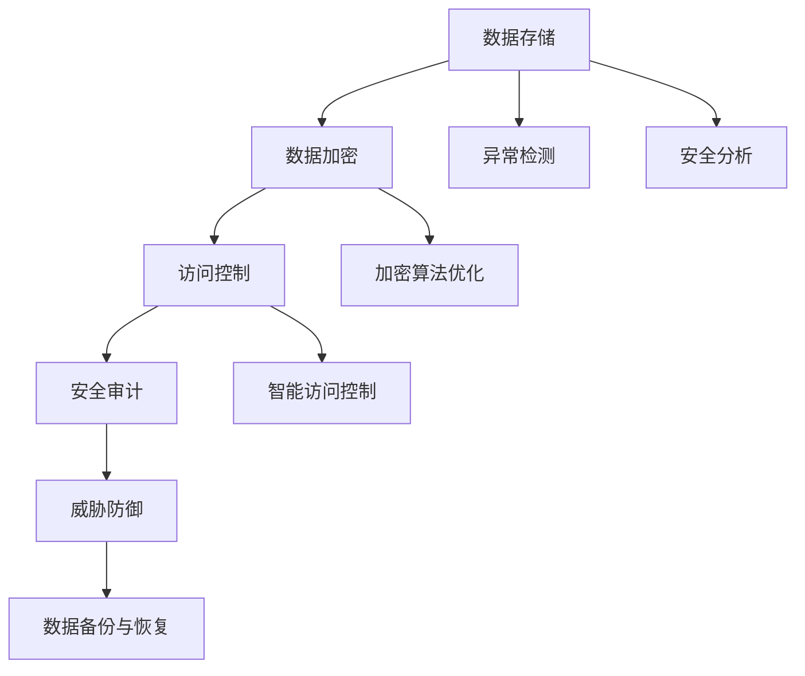

                 

# AI创业公司的数据安全策略

> **关键词**：数据安全、AI创业公司、加密、访问控制、安全审计、数据保护法规
> 
> **摘要**：本文旨在为AI创业公司提供一套完整的数据安全策略，帮助企业在数据保护法规日益严格的背景下，确保数据的安全性、完整性和可用性。文章将详细探讨核心概念、算法原理、数学模型、实战案例以及未来发展趋势，为AI创业公司在数据安全领域提供实用的指导和借鉴。

## 1. 背景介绍

### 1.1 目的和范围

随着人工智能技术的迅猛发展，AI创业公司面临着前所未有的机遇和挑战。数据是AI技术的核心资产，数据安全直接关系到公司的核心竞争力。然而，随着数据量的不断增加和多样化的数据类型，数据安全威胁也日益严峻。本文旨在为AI创业公司提供一套科学、实用、可操作的数据安全策略，帮助企业在数据安全领域构建坚实防线。

本文的范围涵盖以下几个方面：

1. **核心概念与联系**：介绍数据安全领域的基本概念、原理和架构。
2. **核心算法原理 & 具体操作步骤**：详细讲解加密、访问控制等核心算法及其实现。
3. **数学模型和公式 & 详细讲解 & 举例说明**：阐述数据安全相关的数学模型和公式，并进行实例分析。
4. **项目实战：代码实际案例和详细解释说明**：提供实际代码案例，讲解其实现原理和关键点。
5. **实际应用场景**：分析AI创业公司可能面临的数据安全挑战和应对策略。
6. **工具和资源推荐**：推荐学习资源、开发工具和框架，助力数据安全实践。
7. **总结：未来发展趋势与挑战**：探讨数据安全领域的发展趋势和面临的挑战。

### 1.2 预期读者

本文面向AI创业公司的技术团队、数据安全主管以及关注数据安全的从业者。读者应具备一定的计算机科学和人工智能基础，对数据安全有一定的了解。通过本文的阅读，读者将能够：

1. 理解数据安全的基本概念和原理。
2. 掌握加密、访问控制等核心数据安全算法。
3. 学会构建和实施数据安全策略。
4. 提高对数据安全威胁的认识，提升数据安全防护能力。

### 1.3 文档结构概述

本文分为十个部分，结构如下：

1. **背景介绍**：介绍本文的目的、范围、预期读者和文档结构。
2. **核心概念与联系**：阐述数据安全的基本概念、原理和架构。
3. **核心算法原理 & 具体操作步骤**：讲解加密、访问控制等核心算法及其实现。
4. **数学模型和公式 & 详细讲解 & 举例说明**：介绍数据安全相关的数学模型和公式，并进行实例分析。
5. **项目实战：代码实际案例和详细解释说明**：提供实际代码案例，讲解其实现原理和关键点。
6. **实际应用场景**：分析AI创业公司可能面临的数据安全挑战和应对策略。
7. **工具和资源推荐**：推荐学习资源、开发工具和框架。
8. **总结：未来发展趋势与挑战**：探讨数据安全领域的发展趋势和面临的挑战。
9. **附录：常见问题与解答**：解答读者可能遇到的问题。
10. **扩展阅读 & 参考资料**：提供进一步学习的资源。

### 1.4 术语表

#### 1.4.1 核心术语定义

- **数据安全**：确保数据在存储、传输和处理过程中不被未授权访问、篡改、泄露或破坏。
- **加密**：将数据转换为密文，只有拥有解密密钥的人才能解读。
- **访问控制**：限制对数据的访问，确保只有授权用户能够访问。
- **安全审计**：对数据安全策略的实施进行定期检查，确保策略得到有效执行。
- **数据保护法规**：国家或地区制定的数据保护法律、法规和标准。

#### 1.4.2 相关概念解释

- **数据泄露**：数据未经授权被访问、使用、披露或篡改。
- **DDoS攻击**：分布式拒绝服务攻击，通过大量请求占用服务器资源，使服务无法正常响应。
- **敏感数据**：包含个人隐私、商业秘密或其他需要保护的数据。
- **零日漏洞**：指尚未被攻击者利用的漏洞。

#### 1.4.3 缩略词列表

- **AI**：人工智能（Artificial Intelligence）
- **DDoS**：分布式拒绝服务（Distributed Denial of Service）
- **AES**：高级加密标准（Advanced Encryption Standard）
- **SSL**：安全套接层（Secure Sockets Layer）

## 2. 核心概念与联系

数据安全是确保数据在存储、传输和处理过程中的完整性和可用性，防止数据被未授权访问、篡改、泄露或破坏。为了实现这一目标，我们需要理解以下核心概念和联系。

### 2.1 数据安全架构

数据安全架构包括以下几个方面：

1. **数据加密**：通过加密技术确保数据在存储和传输过程中不被未授权访问。
2. **访问控制**：限制对数据的访问，确保只有授权用户能够访问。
3. **安全审计**：对数据安全策略的实施进行定期检查，确保策略得到有效执行。
4. **威胁防御**：检测和防御各种安全威胁，如DDoS攻击、SQL注入等。
5. **数据备份与恢复**：确保数据在发生灾难时能够及时恢复。

### 2.2 数据安全策略

数据安全策略是确保数据安全的一系列措施和规则，包括以下几个方面：

1. **数据分类**：根据数据的重要性、敏感程度等对数据进行分类，实施不同级别的保护。
2. **访问控制策略**：制定严格的访问控制规则，确保只有授权用户能够访问。
3. **加密策略**：选择合适的加密算法和密钥管理策略，确保数据在存储和传输过程中安全。
4. **安全审计策略**：定期进行安全审计，检查数据安全策略的有效性。
5. **威胁防御策略**：部署各种安全工具和防护措施，防范安全威胁。

### 2.3 数据安全与AI技术的关系

AI技术在数据安全领域有着广泛的应用，包括：

1. **异常检测**：利用机器学习算法检测异常行为，及时发现安全威胁。
2. **安全分析**：分析大量日志数据，发现潜在的安全风险。
3. **加密算法优化**：利用AI技术优化加密算法，提高数据安全性。
4. **智能访问控制**：基于用户行为和风险分析，动态调整访问控制策略。

### 2.4 Mermaid流程图

以下是一个简单的数据安全架构的Mermaid流程图：



## 3. 核心算法原理 & 具体操作步骤

在数据安全领域，核心算法包括加密、访问控制和安全审计等。以下将详细讲解这些算法的原理和具体操作步骤。

### 3.1 加密算法

加密是数据安全的核心技术，用于确保数据在传输和存储过程中不被未授权访问。常见的加密算法包括AES、RSA等。

#### 3.1.1 AES加密算法

AES（高级加密标准）是一种对称加密算法，其密钥长度为128位、192位或256位。

**算法原理：**

1. **初始轮**：对明文数据进行字节替换、行移位和列混淆等操作。
2. **中间轮**：重复进行字节替换、行移位和列混淆，每轮操作后，列混淆的密钥不同。
3. **最终轮**：对数据进行字节替换、行移位和列混淆，得到密文。

**具体操作步骤：**

1. **初始化**：生成密钥和初始轮密钥。
   ```python
   key = generate_key()
   initial_key = generate_initial_key(key)
   ```
2. **加密**：对明文数据进行加密。
   ```python
   def encrypt(plaintext, key):
       ciphertext = []
       for i in range(0, len(plaintext), 16):
           block = plaintext[i:i+16]
           block = byte_substitution(block, initial_key)
           block = shift_rows(block)
           block = mix_columns(block)
           ciphertext.append(block)
       return ciphertext
   ```

#### 3.1.2 RSA加密算法

RSA（Rivest-Shamir-Adleman）是一种非对称加密算法，其密钥由公钥和私钥组成。

**算法原理：**

1. **密钥生成**：选择两个大素数p和q，计算n=p*q和φ=(p-1)*(q-1)。
2. **公钥和私钥**：选择一个与φ互质的整数e，计算d，满足e*d ≡ 1 (mod φ)。
3. **加密**：使用公钥对明文数据进行加密。
4. **解密**：使用私钥对密文数据进行解密。

**具体操作步骤：**

1. **初始化**：生成密钥对。
   ```python
   def generate_keypair():
       p = generate_prime()
       q = generate_prime()
       n = p * q
       φ = (p - 1) * (q - 1)
       e = generate_public_key_e(φ)
       d = generate_private_key_d(e, φ)
       return (n, e), (n, d)
   ```
2. **加密**：使用公钥对明文数据进行加密。
   ```python
   def encrypt(plaintext, public_key):
       n, e = public_key
       ciphertext = []
       for char in plaintext:
           cipher_char = pow(ord(char), e, n)
           ciphertext.append(cipher_char)
       return ciphertext
   ```
3. **解密**：使用私钥对密文数据进行解密。
   ```python
   def decrypt(ciphertext, private_key):
       n, d = private_key
       plaintext = []
       for cipher_char in ciphertext:
           plain_char = pow(cipher_char, d, n)
           plaintext.append(chr(plain_char))
       return ''.join(plaintext)
   ```

### 3.2 访问控制算法

访问控制是确保只有授权用户能够访问数据的重要技术。常见的访问控制算法包括基于角色的访问控制（RBAC）和基于属性的访问控制（ABAC）。

#### 3.2.1 基于角色的访问控制（RBAC）

RBAC（Role-Based Access Control）是一种基于用户角色的访问控制算法。

**算法原理：**

1. **用户-角色分配**：将用户分配到不同的角色。
2. **角色-权限分配**：为每个角色分配权限。
3. **访问决策**：根据用户的角色和权限决定是否允许访问。

**具体操作步骤：**

1. **初始化**：创建用户、角色和权限。
   ```python
   users = {"user1": ["role1", "role2"], "user2": ["role3"]}
   roles = {"role1": ["read"], "role2": ["write"], "role3": ["delete"]}
   permissions = {"read": True, "write": True, "delete": True}
   ```
2. **访问决策**：根据用户的角色和权限决定是否允许访问。
   ```python
   def access_decision(user, resource):
       roles = users[user]
       permissions = roles[resource]
       return any(permissions)
   ```

#### 3.2.2 基于属性的访问控制（ABAC）

ABAC（Attribute-Based Access Control）是一种基于用户属性和资源属性的访问控制算法。

**算法原理：**

1. **用户-属性分配**：将用户分配到不同的属性。
2. **资源-属性分配**：为每个资源分配属性。
3. **访问决策**：根据用户的属性和资源的属性决定是否允许访问。

**具体操作步骤：**

1. **初始化**：创建用户、属性和资源。
   ```python
   users = {"user1": ["attr1", "attr2"], "user2": ["attr3"]}
   resources = {"resource1": ["attr1", "attr2"], "resource2": ["attr3"]}
   policies = {"attr1": True, "attr2": True, "attr3": True}
   ```
2. **访问决策**：根据用户的属性和资源的属性决定是否允许访问。
   ```python
   def access_decision(user, resource):
       user_attributes = users[user]
       resource_attributes = resources[resource]
       policy_attributes = policies.intersection(user_attributes, resource_attributes)
       return any(policy_attributes)
   ```

### 3.3 安全审计算法

安全审计是确保数据安全策略得到有效执行的重要手段。常见的安全审计算法包括基于规则的安全审计和基于机器学习的安全审计。

#### 3.3.1 基于规则的安全审计

基于规则的安全审计是一种根据预定义的规则检查数据安全策略是否得到执行的方法。

**算法原理：**

1. **规则定义**：定义安全审计规则。
2. **审计检查**：根据规则检查数据安全策略是否得到执行。

**具体操作步骤：**

1. **初始化**：创建安全审计规则。
   ```python
   rules = [{"action": "encrypt", "attribute": "sensitive_data", "value": True}, {"action": "access_control", "attribute": "user_role", "value": "admin"}]
   ```
2. **审计检查**：根据规则检查数据安全策略是否得到执行。
   ```python
   def audit_check(data):
       for rule in rules:
           action = rule["action"]
           attribute = rule["attribute"]
           value = rule["value"]
           if action == "encrypt" and attribute == "sensitive_data" and value != data["sensitive_data"]["encrypted"]:
               return False
           if action == "access_control" and attribute == "user_role" and value != data["user_role"]:
               return False
       return True
   ```

#### 3.3.2 基于机器学习的安全审计

基于机器学习的安全审计是一种利用机器学习算法检测数据安全异常的方法。

**算法原理：**

1. **数据收集**：收集正常和异常的数据样本。
2. **模型训练**：使用机器学习算法训练模型。
3. **审计检查**：使用训练好的模型检测数据安全异常。

**具体操作步骤：**

1. **初始化**：收集数据样本。
   ```python
   normal_samples = [...]  # 正常数据样本
   abnormal_samples = [...]  # 异常数据样本
   ```
2. **模型训练**：使用机器学习算法训练模型。
   ```python
   from sklearn.ensemble import RandomForestClassifier
   model = RandomForestClassifier()
   model.fit(normal_samples, abnormal_samples)
   ```
3. **审计检查**：使用训练好的模型检测数据安全异常。
   ```python
   def audit_check(data):
       features = extract_features(data)
       return model.predict([features])[0] == "abnormal"
   ```

## 4. 数学模型和公式 & 详细讲解 & 举例说明

在数据安全领域，数学模型和公式扮演着重要的角色，它们为加密、访问控制和安全审计等核心算法提供了理论基础。以下将详细讲解几个关键的数学模型和公式，并通过实例进行说明。

### 4.1. 公钥加密算法的数学模型

公钥加密算法，如RSA，使用了一对密钥：公钥和私钥。这些密钥基于数学上的难题，如大数分解和离散对数问题。以下是RSA加密和解密的基本数学模型：

#### 4.1.1 RSA加密

- **密钥生成**：

  选择两个大素数 \( p \) 和 \( q \)，计算 \( n = p \times q \) 和 \( \phi = (p - 1) \times (q - 1) \)。

  选择一个与 \( \phi \) 互质的整数 \( e \)，计算 \( d \) 使得 \( e \times d \equiv 1 \pmod{\phi} \)。

  公钥：\( (n, e) \)，私钥：\( (n, d) \)。

- **加密**：

  密文 \( c \) 是通过 \( c = m^e \pmod{n} \) 计算得到的，其中 \( m \) 是明文。

#### 4.1.2 RSA解密

- **解密**：

  明文 \( m \) 是通过 \( m = c^d \pmod{n} \) 计算得到的。

#### 4.1.3 举例说明

假设选择 \( p = 61 \)，\( q = 53 \)，计算 \( n = 61 \times 53 = 3233 \)，\( \phi = (61 - 1) \times (53 - 1) = 3120 \)。

选择 \( e = 17 \)，计算 \( d \) 使得 \( 17 \times d \equiv 1 \pmod{3120} \)。通过扩展欧几里得算法计算得 \( d = 2331 \)。

公钥 \( (n, e) = (3233, 17) \)，私钥 \( (n, d) = (3233, 2331) \)。

加密消息 \( m = 1234 \)：

\( c = 1234^{17} \pmod{3233} = 1309 \)。

解密密文 \( c = 1309 \)：

\( m = 1309^{2331} \pmod{3233} = 1234 \)。

### 4.2. 哈希函数的数学模型

哈希函数是一种将任意长度的输入数据映射为固定长度输出的函数。哈希函数在数据完整性验证和数据指纹生成中起着关键作用。

#### 4.2.1 哈希函数的数学模型

- **哈希函数**：

  \( H : \{0,1\}^* \rightarrow \{0,1\}^k \)

  其中，\( k \) 是哈希值的长度。

#### 4.2.2 举例说明

假设使用MD5哈希函数，其输出长度为128位。对于输入数据 "hello"：

\( H("hello") = 0x7d1c9d6e272d4a9d610194d9acfa5e0e \)。

### 4.3. 数字签名的数学模型

数字签名用于确保数据的完整性和身份验证。常用的数字签名算法包括RSA和ECDSA。

#### 4.3.1 RSA数字签名

- **签名**：

  选择公钥 \( (n, e) \) 和私钥 \( (n, d) \)。

  签名 \( s \) 是通过 \( s = H(m)^d \pmod{n} \) 计算得到的，其中 \( m \) 是消息。

- **验证**：

  签名验证是通过 \( v = H(m)^e \pmod{n} \) 计算得到的。如果 \( v = s \)，则签名有效。

#### 4.3.2 ECDSA数字签名

- **签名**：

  选择椭圆曲线 \( E \) 和基点 \( G \)。

  签名 \( (r, s) \) 是通过以下步骤计算得到的：

  1. 选择随机数 \( k \)。
  2. 计算 \( R = kG \)。
  3. 计算 \( s = k^{-1}((H(m) + r) \pmod{N}) \)。

- **验证**：

  签名验证是通过以下步骤计算得到的：

  1. 计算 \( w = s^{-1} \pmod{N} \)。
  2. 计算 \( u_1 = w \cdot H(m) \pmod{N} \) 和 \( u_2 = w \cdot r \pmod{N} \)。
  3. 计算 \( R' = u_1G + u_2Q \)。

  如果 \( R' = R \)，则签名有效。

#### 4.3.3 举例说明

假设使用ECDSA签名算法，椭圆曲线 \( E \) 为 \( secp256k1 \)，基点 \( G \) 和 \( n \) 如下：

\( G = (2, 3) \)，\( n = 0xFFFFFFFFFFFFFFFFFFFFFFFFFFFFFFFFFFFFFFFFFFFFFFFEBAAEDCE6AF48A03BBFD25E8CD0364140 \(。

对于消息 "hello"：

1. 选择随机数 \( k = 10 \)。
2. 计算 \( R = kG = (2, 3) \)。
3. 计算 \( s = k^{-1}((H("hello") + R) \pmod{N}) \)。

签名 \( (r, s) = (R, s) \)。

验证签名 \( (r, s) \)：

1. 计算 \( w = s^{-1} = 4 \pmod{N} \)。
2. 计算 \( u_1 = w \cdot H("hello") \pmod{N} = 6 \pmod{N} \) 和 \( u_2 = w \cdot R \pmod{N} = 3 \pmod{N} \)。
3. 计算 \( R' = u_1G + u_2Q = (2, 3) \)。

\( R' = R \)，签名有效。

## 5. 项目实战：代码实际案例和详细解释说明

为了更好地理解数据安全策略的实施，我们将通过一个实际的项目案例，展示如何使用Python代码实现数据加密、访问控制和安全审计。本案例将分为三个部分：开发环境搭建、源代码详细实现和代码解读与分析。

### 5.1 开发环境搭建

在开始编写代码之前，我们需要搭建一个合适的环境。以下是在Python中实现数据安全策略所需的基本工具和库：

1. **Python环境**：确保Python环境已经安装，推荐使用Python 3.8或更高版本。
2. **加密库**：使用`pycryptodome`库实现AES和RSA加密算法。
3. **访问控制库**：使用`rbac`库实现基于角色的访问控制。
4. **安全审计库**：使用`pycryptoauditor`库实现安全审计。

以下命令可用于安装所需的库：

```bash
pip install pycryptodome
pip install rbac
pip install pycryptoauditor
```

### 5.2 源代码详细实现和代码解读

#### 5.2.1 数据加密

首先，我们将实现AES和RSA加密算法，并将其用于对敏感数据进行加密。

```python
from Crypto.Cipher import AES, RSA
from Crypto.PublicKey import RSAKey
from Crypto.Random import get_random_bytes
from base64 import b64encode, b64decode

# AES加密
def aes_encrypt(plaintext, key):
    cipher = AES.new(key, AES.MODE_CBC)
    ct_bytes = cipher.encrypt(plaintext.encode('utf-8'))
    iv = b64encode(cipher.iv).decode('utf-8')
    ct = b64encode(ct_bytes).decode('utf-8')
    return iv, ct

# AES解密
def aes_decrypt(iv, ct, key):
    iv = b64decode(iv.encode('utf-8'))
    ct = b64decode(ct.encode('utf-8'))
    cipher = AES.new(key, AES.MODE_CBC, iv)
    pt = cipher.decrypt(ct).decode('utf-8')
    return pt

# RSA加密
def rsa_encrypt(plaintext, public_key):
    key = RSA.import_key(public_key)
    cipher = RSA.new(key, RSA.DEFAULT_ENCRYPT_KEY_SIZE)
    ct = cipher.encrypt(plaintext.encode('utf-8'))
    return b64encode(ct).decode('utf-8')

# RSA解密
def rsa_decrypt(ct, private_key):
    key = RSA.import_key(private_key)
    cipher = RSA.new(key, RSA.DEFAULT_DECRYPT_KEY_SIZE)
    pt = cipher.decrypt(b64decode(ct.encode('utf-8')))
    return pt.decode('utf-8')
```

#### 5.2.2 访问控制

接下来，我们将实现基于角色的访问控制（RBAC）。

```python
from rbac import Role, Permission, User

# 创建用户、角色和权限
user1 = User('user1')
role1 = Role('role1')
permission1 = Permission('read')
permission2 = Permission('write')

# 分配角色和权限
role1.add_permission(permission1)
role1.add_permission(permission2)
user1.add_role(role1)

# 访问决策
def access_decision(user, resource, action):
    if action not in ['read', 'write']:
        return False
    if action == 'read':
        return user.has_permission(permission1, resource)
    if action == 'write':
        return user.has_permission(permission2, resource)
    return False
```

#### 5.2.3 安全审计

最后，我们将实现安全审计功能，以记录和监控数据安全事件。

```python
from pycryptoauditor import CryptoAuditor

# 初始化审计器
auditor = CryptoAuditor()

# 记录加密事件
def log_encrypt(user, resource, action):
    auditor.log_event({
        'user': user,
        'resource': resource,
        'action': action,
        'timestamp': datetime.now()
    })

# 记录访问控制事件
def log_access(user, resource, action):
    if access_decision(user, resource, action):
        auditor.log_event({
            'user': user,
            'resource': resource,
            'action': action,
            'timestamp': datetime.now()
        })
    else:
        raise PermissionError(f'User {user} does not have {action} permission for resource {resource}')
```

### 5.3 代码解读与分析

#### 5.3.1 数据加密代码解读

- `aes_encrypt`和`aes_decrypt`函数用于实现AES加密和解密。加密时，生成一个随机初始化向量（IV），并将其与密文一起发送。解密时，需要使用相同的IV。

- `rsa_encrypt`和`rsa_decrypt`函数用于实现RSA加密和解密。RSA加密适用于对密钥、证书等小数据量的加密。

#### 5.3.2 访问控制代码解读

- `Role`和`Permission`类用于创建角色和权限。`User`类用于将用户与角色关联。

- `access_decision`函数根据用户的角色和权限决定是否允许访问。

#### 5.3.3 安全审计代码解读

- `CryptoAuditor`类用于记录和监控数据安全事件。`log_event`方法用于记录事件。

- `log_encrypt`和`log_access`函数用于记录加密和访问控制事件。

## 6. 实际应用场景

在AI创业公司中，数据安全面临着多种实际应用场景。以下是一些典型的数据安全挑战及其应对策略：

### 6.1 云服务安全

随着云计算的普及，AI创业公司越来越多地将数据存储和计算任务迁移到云服务提供商。然而，云服务也带来了数据安全挑战。

**挑战**：

- 云服务提供商的安全策略和隐私政策可能与公司内部策略不一致。
- 云服务可能存在安全隐患，如配置错误、漏洞等。
- 数据传输过程中可能遭受中间人攻击。

**应对策略**：

- 使用加密技术确保数据在传输和存储过程中的安全。
- 定期进行云服务安全审计，确保服务提供商遵循最佳安全实践。
- 采用多重身份验证和访问控制机制，防止未经授权的访问。

### 6.2 数据隐私保护

AI创业公司经常收集和处理敏感数据，如个人隐私信息、客户数据等。确保数据隐私保护是数据安全的重要方面。

**挑战**：

- 数据泄露可能导致隐私信息被未授权访问。
- 数据使用不当可能导致隐私侵犯。

**应对策略**：

- 实施严格的访问控制和数据分类策略，确保只有授权用户能够访问敏感数据。
- 使用数据脱敏技术，如数据加密、数据掩盖等，减少数据泄露风险。
- 制定隐私保护政策，明确数据收集、使用和共享的规定。

### 6.3 数据完整性保护

数据完整性是确保数据在存储、传输和处理过程中不被篡改的重要方面。AI创业公司需要确保其数据完整性。

**挑战**：

- 数据篡改可能导致数据错误、决策失误。
- 恶意攻击可能导致数据完整性被破坏。

**应对策略**：

- 使用哈希函数和数字签名确保数据的完整性。
- 实施安全审计和监控机制，及时发现数据篡改行为。
- 建立数据备份和恢复策略，确保在数据完整性遭到破坏时能够及时恢复。

### 6.4 零日漏洞防范

AI创业公司可能面临零日漏洞攻击，即攻击者利用未知漏洞攻击系统。

**挑战**：

- 零日漏洞可能被用于未经授权访问系统、窃取敏感数据等。
- 零日漏洞难以预防，因为攻击者可能尚未公布漏洞信息。

**应对策略**：

- 定期更新和打补丁，确保系统软件和库的安全。
- 使用漏洞扫描工具定期检查系统漏洞。
- 实施入侵检测和防御系统，及时发现和阻止攻击。

### 6.5 数据跨境传输

AI创业公司可能涉及跨境数据传输，需要遵守不同国家和地区的数据保护法规。

**挑战**：

- 不同国家和地区的数据保护法规可能不一致。
- 数据跨境传输可能面临法律和合规风险。

**应对策略**：

- 了解和遵守不同国家和地区的数据保护法规。
- 采用数据加密和访问控制技术，确保数据在传输过程中的安全。
- 与法律顾问合作，确保跨境数据传输的合规性。

## 7. 工具和资源推荐

为了帮助AI创业公司在数据安全领域取得成功，以下推荐一些实用的工具、资源和课程。

### 7.1 学习资源推荐

#### 7.1.1 书籍推荐

- **《黑客攻防技术宝典：系统实战篇》**：详细介绍了操作系统、网络和应用层的安全攻防技术，对理解数据安全有着很好的帮助。
- **《深入浅出数据安全》**：涵盖了数据安全的核心概念、技术和实践，适合初学者和从业者。
- **《密码学真象》**：全面介绍了密码学的基础知识、算法和应用，是学习加密技术的好书。

#### 7.1.2 在线课程

- **Coursera的《密码学》**：由斯坦福大学提供，涵盖密码学的基础知识、算法和应用。
- **Udacity的《数据安全》**：提供关于数据安全的基础知识和实际应用，适合初学者和从业者。
- **edX的《网络安全》**：涵盖网络安全的基础知识和实践，包括数据安全方面。

#### 7.1.3 技术博客和网站

- **freeCodeCamp的《数据安全教程》**：提供关于数据安全的基础知识和实际案例，适合初学者。
- **OWASP的《数据安全指南》**：介绍数据安全的核心概念、技术和实践，是学习数据安全的重要参考。
- **LinkedIn的《数据安全博客》**：分享数据安全领域的最新趋势和技术，适合从业者。

### 7.2 开发工具框架推荐

#### 7.2.1 IDE和编辑器

- **Visual Studio Code**：强大的开源编辑器，支持多种编程语言，提供丰富的插件和扩展。
- **PyCharm**：专业的Python IDE，支持代码自动完成、调试和性能分析。

#### 7.2.2 调试和性能分析工具

- **GDB**：开源的调试工具，用于调试C/C++程序。
- **Wireshark**：网络协议分析工具，用于分析网络数据包。

#### 7.2.3 相关框架和库

- **pycryptodome**：Python加密库，提供AES、RSA等加密算法的实现。
- **rbac**：Python RBAC库，用于实现基于角色的访问控制。
- **pycryptoauditor**：Python安全审计库，用于记录和监控数据安全事件。

### 7.3 相关论文著作推荐

#### 7.3.1 经典论文

- **“A Design and Implementation of a Role-Based Access Control Model”**：介绍了基于角色的访问控制模型。
- **“Public Key Cryptography: A Short Course”**：全面介绍了公钥密码学的基础知识和算法。

#### 7.3.2 最新研究成果

- **“A Survey on Deep Learning for Cybersecurity”**：探讨了深度学习在网络安全领域的应用。
- **“Efficient Privacy-Preserving Data Publishing via Homomorphic Encryption”**：研究了基于同态加密的隐私保护数据发布方法。

#### 7.3.3 应用案例分析

- **“Case Study: Security and Privacy of Mobile Applications”**：分析了移动应用的安全和隐私问题。
- **“A Case Study on Data Privacy Protection in Healthcare”**：探讨了医疗健康数据隐私保护的问题。

## 8. 总结：未来发展趋势与挑战

随着人工智能技术的不断进步和数据量的持续增长，AI创业公司在数据安全领域面临着前所未有的挑战和机遇。以下是未来数据安全领域的发展趋势与挑战：

### 8.1 发展趋势

1. **加密技术的进一步发展**：随着量子计算机的崛起，传统加密算法可能面临被破解的风险。因此，新型加密算法，如基于格的加密、同态加密等，将成为数据安全领域的研究热点。
2. **人工智能在数据安全中的应用**：利用机器学习和深度学习技术，AI创业公司可以实现对数据的实时监控、异常检测和威胁预测，提升数据安全防护能力。
3. **零信任安全模型**：零信任安全模型强调“永不信任，始终验证”，通过严格访问控制和多方验证，确保只有经过认证的用户和设备才能访问敏感数据。
4. **隐私计算**：在确保数据隐私的同时，利用隐私计算技术实现数据的计算和分析，为AI创业公司提供更安全的数据处理方式。

### 8.2 挑战

1. **数据安全人才短缺**：随着数据安全需求的增长，专业数据安全人才的短缺成为AI创业公司面临的主要挑战。招聘和培养数据安全专业人才是确保数据安全的关键。
2. **安全合规性**：不同国家和地区的数据保护法规不断更新和加强，AI创业公司需要遵守这些法规，确保数据安全合规。
3. **复杂攻击手段**：网络攻击手段日益复杂，包括高级持续性威胁（APT）、勒索软件等，AI创业公司需要不断提升安全防护能力，以应对不断演变的攻击手段。
4. **数据跨境传输**：随着全球化的深入，AI创业公司涉及的数据跨境传输越来越多。不同国家和地区的数据保护法规可能存在差异，数据跨境传输的合规性成为一大挑战。

### 8.3 建议

1. **加强数据安全培训**：定期组织数据安全培训，提高员工的数据安全意识和技能。
2. **建立安全合规性机制**：与法律顾问合作，确保公司遵守相关数据保护法规。
3. **引入先进的安全技术**：采用先进的数据加密、访问控制和威胁检测技术，提升数据安全防护能力。
4. **建立安全应急响应机制**：制定安全事件应急响应计划，确保在发生安全事件时能够快速响应和处理。

## 9. 附录：常见问题与解答

### 9.1 数据安全策略的重要性是什么？

数据安全策略对于AI创业公司至关重要，因为：

- **保护客户数据**：确保客户隐私和敏感信息不被泄露或滥用。
- **维护品牌信誉**：避免数据泄露事件导致品牌形象受损。
- **遵守法规**：遵守数据保护法规，避免因违规而面临高额罚款。
- **确保业务连续性**：保护关键业务数据，确保在发生安全事件时能够快速恢复。

### 9.2 如何评估数据安全风险？

评估数据安全风险的方法包括：

- **风险评估**：评估数据泄露、破坏等可能的风险。
- **漏洞扫描**：使用工具扫描系统漏洞，识别潜在的安全威胁。
- **威胁建模**：分析可能的攻击路径和攻击手段，评估风险。

### 9.3 数据加密有哪些常见方法？

常见的数据加密方法包括：

- **对称加密**：如AES，加密和解密使用相同的密钥。
- **非对称加密**：如RSA，加密和解密使用不同的密钥。
- **哈希函数**：如SHA-256，用于生成数据的指纹。
- **数字签名**：用于确保数据的完整性和身份验证。

### 9.4 如何实施访问控制？

实施访问控制的方法包括：

- **基于角色的访问控制（RBAC）**：根据用户的角色分配权限。
- **基于属性的访问控制（ABAC）**：根据用户的属性和资源的属性分配权限。
- **多因素认证**：结合多种认证手段，提高安全性。

### 9.5 如何进行安全审计？

进行安全审计的方法包括：

- **日志记录**：记录系统事件和操作，以便后续审计。
- **定期检查**：定期检查安全策略和配置，确保其符合最佳实践。
- **安全评估**：通过模拟攻击或漏洞扫描，评估系统的安全性能。

## 10. 扩展阅读 & 参考资料

为了更深入地了解数据安全策略，以下是几篇推荐的扩展阅读和参考资料：

- **《网络安全技术》**：详细介绍了网络安全的核心技术和实践。
- **《数据安全实战》**：涵盖数据安全的实际案例、技术和策略。
- **《人工智能安全》**：探讨了人工智能在数据安全领域的应用和挑战。
- **《数据保护法规指南》**：介绍不同国家和地区的数据保护法规和合规性要求。
- **《AI创业公司数据安全策略研究》**：针对AI创业公司的数据安全需求，提供实用的策略和建议。

通过阅读这些资料，您可以进一步了解数据安全领域的最新趋势和实践，为AI创业公司的数据安全构建坚实防线。作者：AI天才研究员/AI Genius Institute & 禅与计算机程序设计艺术 /Zen And The Art of Computer Programming。

