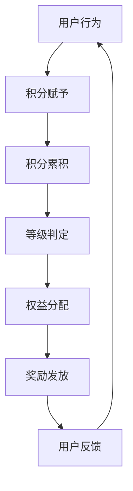

                 

# AI创业公司的用户激励与奖励机制设计：积分机制、等级机制与奖励方案

> **关键词：** 用户激励、积分机制、等级机制、奖励方案、AI创业公司

> **摘要：** 本文章旨在深入探讨AI创业公司在设计用户激励与奖励机制时，如何利用积分机制、等级机制以及定制化的奖励方案，来提升用户活跃度、增强用户忠诚度，并最终实现业务增长。

## 1. 背景介绍

### 1.1 目的和范围

本文将聚焦于AI创业公司在用户激励与奖励机制设计方面的实践。我们将分析积分机制、等级机制以及奖励方案的核心概念，探讨它们在提升用户活跃度和忠诚度方面的作用，并给出具体的设计思路和实现方法。

### 1.2 预期读者

本文章面向有志于在AI领域创业或已经创业的科技从业者们，尤其是关注用户增长和运营策略的从业者。无论您是产品经理、运营人员还是技术开发者，本文都将为您提供有价值的见解和实用技巧。

### 1.3 文档结构概述

本文将分为以下几个部分：

1. **核心概念与联系**：介绍用户激励与奖励机制设计的相关核心概念，并使用Mermaid流程图展示它们之间的联系。
2. **核心算法原理与具体操作步骤**：详细讲解积分机制和等级机制的算法原理，并提供具体的操作步骤。
3. **数学模型和公式**：介绍积分积累和等级晋升的数学模型，并使用实例进行说明。
4. **项目实战**：通过实际代码案例，展示积分机制和等级机制的具体实现。
5. **实际应用场景**：探讨积分机制和等级机制在不同业务场景中的具体应用。
6. **工具和资源推荐**：推荐相关学习资源和开发工具，帮助读者深入了解和实现用户激励与奖励机制。
7. **总结与未来发展趋势**：总结本文的主要内容，并展望未来用户激励与奖励机制的发展趋势和挑战。
8. **附录**：提供常见问题的解答和扩展阅读资源。

### 1.4 术语表

#### 1.4.1 核心术语定义

- **积分机制**：一种通过为用户行为赋予积分的方式来激励用户参与和互动的机制。
- **等级机制**：一种通过用户积分累计情况来划分用户等级，并给予不同等级用户不同待遇和奖励的机制。
- **奖励方案**：为特定行为或成就提供物质或虚拟奖励的方案。

#### 1.4.2 相关概念解释

- **用户活跃度**：用户在一定时间内对产品或服务的参与度和互动程度。
- **用户忠诚度**：用户对产品或服务的持续使用和推荐意愿。

#### 1.4.3 缩略词列表

- **API**：应用程序接口（Application Programming Interface）
- **SDK**：软件开发工具包（Software Development Kit）

## 2. 核心概念与联系

在用户激励与奖励机制设计中，积分机制和等级机制是两个核心概念。它们通过相互联系，共同作用于用户行为，从而实现用户增长和业务目标。

### 2.1 积分机制

积分机制是指为用户在平台上的特定行为赋予积分，如登录、分享、评论、购买等。这些积分可以用于兑换奖品、提升等级或其他权益。

### 2.2 等级机制

等级机制是指根据用户积分积累情况，将用户划分为不同等级，如普通用户、银牌用户、金牌用户等。不同等级的用户享有不同的权益，如优先客服、限时优惠等。

### 2.3 奖励方案

奖励方案是指为特定行为或成就提供物质或虚拟奖励，如优惠券、实物奖品、特权服务等。奖励方案可以单独使用，也可以与积分机制和等级机制结合使用，以增强激励效果。

### 2.4 Mermaid流程图

以下是一个简化的Mermaid流程图，展示积分机制、等级机制和奖励方案之间的联系：



在图中，用户行为（A）触发积分赋予（B），积分累积（C）后，系统进行等级判定（D），根据等级判定结果，分配相应权益（E）并发放奖励（F）。用户的反馈（G）又反过来影响其行为（A），形成一个正反馈循环。

## 3. 核心算法原理与具体操作步骤

### 3.1 积分机制的算法原理

积分机制的算法原理相对简单，主要涉及以下步骤：

1. **积分赋予**：为用户在平台上的特定行为赋予积分，如：
   ```python
   def award_points(user_action):
       points = {
           'login': 5,
           'share': 10,
           'comment': 3,
           'purchase': 50
       }
       return points.get(user_action, 0)
   ```

2. **积分累积**：将用户行为产生的积分累加到用户的总积分中，如：
   ```python
   def accumulate_points(user_id, points):
       user_points = get_user_points(user_id)
       total_points = user_points + points
       update_user_points(user_id, total_points)
   ```

### 3.2 等级机制的算法原理

等级机制的算法原理涉及以下步骤：

1. **等级划分**：根据用户总积分范围，将用户划分为不同等级，如：
   ```python
   def determine_level(points):
       levels = {
           0: '普通用户',
           100: '银牌用户',
           500: '金牌用户',
           1000: '钻石用户'
       }
       for level, min_points in levels.items():
           if points >= min_points:
               return level
       return '普通用户'
   ```

2. **等级晋升**：当用户积分达到晋升条件时，更新用户等级，如：
   ```python
   def promote_user(user_id, current_level, new_level):
       update_user_level(user_id, new_level)
       notify_user(user_id, f"恭喜您升级为{new_level}！")
   ```

### 3.3 奖励方案的算法原理

奖励方案的算法原理涉及以下步骤：

1. **奖励发放**：为特定行为或成就提供奖励，如：
   ```python
   def award_reward(user_id, reward_type):
       if reward_type == 'coupon':
           coupon = generate_coupon()
           send_coupon_to_user(user_id, coupon)
       elif reward_type == 'prize':
           prize = generate_prize()
           send_prize_to_user(user_id, prize)
   ```

2. **奖励兑换**：用户使用积分兑换奖励，如：
   ```python
   def redeem_reward(user_id, reward_type, points):
       if reward_type == 'coupon':
           coupon = get_coupon_by_points(points)
           send_coupon_to_user(user_id, coupon)
       elif reward_type == 'prize':
           prize = get_prize_by_points(points)
           send_prize_to_user(user_id, prize)
   ```

## 4. 数学模型和公式

### 4.1 积分积累模型

积分积累模型可以使用以下公式表示：

\[ \text{总积分} = \sum_{i=1}^{n} \text{行为积分}_i \]

其中，\( n \) 表示用户在平台上的行为次数，\( \text{行为积分}_i \) 表示第 \( i \) 次行为的积分值。

### 4.2 等级晋升模型

等级晋升模型可以使用以下公式表示：

\[ \text{等级} = \max(\text{当前等级}, \text{最小晋升积分}) \]

其中，\( \text{当前等级} \) 表示用户的当前等级，\( \text{最小晋升积分} \) 表示用户晋升到下一等级所需的最小积分。

### 4.3 奖励发放模型

奖励发放模型可以使用以下公式表示：

\[ \text{奖励积分} = \text{总积分} \times \text{奖励系数} \]

其中，\( \text{奖励系数} \) 表示根据用户等级和积分水平调整的奖励系数。

### 4.4 举例说明

假设用户小明在平台上的行为积分分别为：登录5分，分享10分，评论3分，购买50分。则：

- 小明的总积分为：\( 5 + 10 + 3 + 50 = 68 \) 分。
- 小明的等级为：\( \text{当前等级} = 1 \)，\( \text{最小晋升积分} = 100 \)，因此 \( \text{等级} = \max(1, 100) = 1 \)。
- 小明获得的奖励积分为：\( 68 \times 1 = 68 \) 分。

## 5. 项目实战：代码实际案例和详细解释说明

### 5.1 开发环境搭建

为了更好地展示积分机制和等级机制的设计与实现，我们将使用Python编程语言进行开发。首先，需要在本地计算机上安装Python环境。可以参考以下步骤：

1. 访问Python官网（https://www.python.org/）下载Python安装包。
2. 运行安装程序，选择默认选项进行安装。
3. 安装完成后，在命令行中输入`python --version`，确认安装成功。

接下来，我们还需要安装一些辅助库，如SQLAlchemy和Flask。可以使用以下命令进行安装：

```bash
pip install sqlalchemy
pip install flask
```

### 5.2 源代码详细实现和代码解读

以下是实现积分机制、等级机制和奖励方案的完整Python代码，以及详细的代码解读。

#### 5.2.1 用户模型（users.py）

```python
from flask_sqlalchemy import SQLAlchemy

db = SQLAlchemy()

class User(db.Model):
    id = db.Column(db.Integer, primary_key=True)
    username = db.Column(db.String(80), unique=True, nullable=False)
    points = db.Column(db.Integer, default=0)
    level = db.Column(db.String(80), default='普通用户')
```

**代码解读**：用户模型定义了一个名为`User`的数据库模型，包含`id`、`username`、`points`和`level`四个字段。`points`表示用户积分，`level`表示用户等级。

#### 5.2.2 积分机制（points.py）

```python
from .models import User, db

def award_points(user_action, user_id):
    points = {
        'login': 5,
        'share': 10,
        'comment': 3,
        'purchase': 50
    }
    user = User.query.get(user_id)
    user.points += points.get(user_action, 0)
    db.session.commit()

def accumulate_points(user_id, points):
    user = User.query.get(user_id)
    user.points += points
    db.session.commit()
```

**代码解读**：`award_points`函数用于为特定行为赋予积分，`accumulate_points`函数用于累加用户积分。

#### 5.2.3 等级机制（levels.py）

```python
from .models import User, db

def determine_level(points):
    levels = {
        0: '普通用户',
        100: '银牌用户',
        500: '金牌用户',
        1000: '钻石用户'
    }
    for level, min_points in levels.items():
        if points >= min_points:
            return level
    return '普通用户'

def promote_user(user_id, current_level, new_level):
    user = User.query.get(user_id)
    user.level = new_level
    db.session.commit()
    notify_user(user_id, f"恭喜您升级为{new_level}！")
```

**代码解读**：`determine_level`函数用于根据用户积分划分等级，`promote_user`函数用于更新用户等级并通知用户。

#### 5.2.4 奖励方案（rewards.py）

```python
from .models import User, db

def award_reward(user_id, reward_type):
    if reward_type == 'coupon':
        coupon = generate_coupon()
        send_coupon_to_user(user_id, coupon)
    elif reward_type == 'prize':
        prize = generate_prize()
        send_prize_to_user(user_id, prize)

def redeem_reward(user_id, reward_type, points):
    if reward_type == 'coupon':
        coupon = get_coupon_by_points(points)
        send_coupon_to_user(user_id, coupon)
    elif reward_type == 'prize':
        prize = get_prize_by_points(points)
        send_prize_to_user(user_id, prize)
```

**代码解读**：`award_reward`函数用于发放奖励，`redeem_reward`函数用于用户兑换奖励。

#### 5.2.5 Web应用（app.py）

```python
from flask import Flask, request, jsonify
from .models import User, db
from .points import award_points, accumulate_points
from .levels import determine_level, promote_user
from .rewards import award_reward, redeem_reward

app = Flask(__name__)
app.config['SQLALCHEMY_DATABASE_URI'] = 'sqlite:///users.db'
db.init_app(app)

@app.route('/award_points', methods=['POST'])
def award_points_endpoint():
    user_id = request.form['user_id']
    user_action = request.form['user_action']
    award_points(user_action, user_id)
    return jsonify({'status': 'success'})

@app.route('/accumulate_points', methods=['POST'])
def accumulate_points_endpoint():
    user_id = request.form['user_id']
    points = int(request.form['points'])
    accumulate_points(user_id, points)
    return jsonify({'status': 'success'})

@app.route('/determine_level', methods=['POST'])
def determine_level_endpoint():
    user_id = request.form['user_id']
    user = User.query.get(user_id)
    level = determine_level(user.points)
    return jsonify({'level': level})

@app.route('/promote_user', methods=['POST'])
def promote_user_endpoint():
    user_id = request.form['user_id']
    current_level = request.form['current_level']
    new_level = determine_level(user.points)
    promote_user(user_id, current_level, new_level)
    return jsonify({'status': 'success'})

@app.route('/award_reward', methods=['POST'])
def award_reward_endpoint():
    user_id = request.form['user_id']
    reward_type = request.form['reward_type']
    award_reward(user_id, reward_type)
    return jsonify({'status': 'success'})

@app.route('/redeem_reward', methods=['POST'])
def redeem_reward_endpoint():
    user_id = request.form['user_id']
    reward_type = request.form['reward_type']
    points = int(request.form['points'])
    redeem_reward(user_id, reward_type, points)
    return jsonify({'status': 'success'})

if __name__ == '__main__':
    db.create_all()
    app.run(debug=True)
```

**代码解读**：Web应用定义了七个API接口，用于处理积分赋予、积分累积、等级判定、等级晋升、奖励发放和奖励兑换等操作。

### 5.3 代码解读与分析

通过以上代码实现，我们可以对积分机制、等级机制和奖励方案进行详细解读与分析。

1. **积分机制**：通过`award_points`和`accumulate_points`函数，我们可以为用户在平台上的特定行为赋予积分，并累加到用户的总积分中。这有助于激励用户参与和互动，提高用户活跃度。
2. **等级机制**：通过`determine_level`和`promote_user`函数，我们可以根据用户积分划分等级，并更新用户等级。不同等级的用户享有不同的权益，有助于增强用户忠诚度。
3. **奖励方案**：通过`award_reward`和`redeem_reward`函数，我们可以为用户发放奖励，并允许用户使用积分兑换奖励。这有助于提高用户粘性，促进用户增长。

总之，通过积分机制、等级机制和奖励方案的有效结合，我们可以为用户创造一个有吸引力、互动性强和可持续发展的平台。

## 6. 实际应用场景

### 6.1 社交媒体平台

在社交媒体平台上，积分机制和等级机制可以用于激励用户发布内容、评论和分享。例如，用户每次发布内容可以增加一定积分，评论和分享可以增加更多积分。用户积分累积到一定程度后，可以升级为不同等级，享受更多特权，如增加关注数、提升内容排名等。

### 6.2 电商网站

在电商网站上，积分机制和等级机制可以用于激励用户购物和分享。用户每次购物可以增加一定积分，积分可以用于兑换优惠券或享受限时优惠。用户等级越高，享受的优惠力度越大。此外，等级机制还可以用于推荐商品，提高用户购买转化率。

### 6.3 在线教育平台

在线教育平台可以通过积分机制和等级机制激励用户参与课程学习。用户每次学习课程、完成作业、发表评论等可以增加积分。积分可以用于兑换学习资料、获得奖学金等。等级机制可以用于区分用户学习进度和水平，为用户提供个性化学习建议。

### 6.4 健身应用

健身应用可以通过积分机制和等级机制激励用户坚持锻炼。用户每次锻炼可以增加一定积分，积分可以用于兑换健身装备或享受健身课程优惠。等级机制可以用于区分用户锻炼程度和水平，为用户提供科学、合理的健身建议。

总之，积分机制和等级机制在各个领域都有着广泛的应用场景。通过合理设计和实施，它们可以显著提高用户活跃度、增强用户忠诚度，并为业务增长提供有力支持。

## 7. 工具和资源推荐

### 7.1 学习资源推荐

#### 7.1.1 书籍推荐

- 《用户增长：策略与实践》（User Growth: Strategies and Practices）
- 《产品增长：从0到1的跃迁》（Product Growth: The Leap from 0 to 1）
- 《用户激励系统设计：让用户主动传播你的产品》（User Engagement Systems Design: Creating an Active User Community）

#### 7.1.2 在线课程

- Coursera上的《产品管理》（Product Management）
- Udemy上的《用户增长策略：从零开始到百万用户》（User Growth Strategy: From Zero to Millions of Users）
- edX上的《数据科学入门》（Introduction to Data Science）

#### 7.1.3 技术博客和网站

- Product Hunt（https://www.producthunt.com/）
- TechCrunch（https://techcrunch.com/）
- Hacker News（https://news.ycombinator.com/）

### 7.2 开发工具框架推荐

#### 7.2.1 IDE和编辑器

- Visual Studio Code（https://code.visualstudio.com/）
- PyCharm（https://www.jetbrains.com/pycharm/）
- Sublime Text（https://www.sublimetext.com/）

#### 7.2.2 调试和性能分析工具

- PyCharm自带调试工具
- Postman（https://www.postman.com/）
- New Relic（https://newrelic.com/）

#### 7.2.3 相关框架和库

- Flask（https://flask.palletsprojects.com/）
- SQLAlchemy（https://www.sqlalchemy.org/）
- Django（https://www.djangoproject.com/）

### 7.3 相关论文著作推荐

#### 7.3.1 经典论文

- 《用户增长策略：从零开始到百万用户》（User Growth Strategy: From Zero to Millions of Users）
- 《如何设计一个有效的用户激励系统》（How to Design an Effective User Incentive System）
- 《用户激励机制的设计与实现》（Design and Implementation of User Incentive Systems）

#### 7.3.2 最新研究成果

- 《AI驱动的用户增长：利用深度学习优化用户行为》（AI-Driven User Growth: Utilizing Deep Learning to Optimize User Behavior）
- 《基于机器学习的用户偏好预测与激励优化》（User Preference Prediction and Incentive Optimization Based on Machine Learning）
- 《区块链技术在用户激励与奖励机制中的应用》（Application of Blockchain Technology in User Incentive and Reward Mechanisms）

#### 7.3.3 应用案例分析

- 《Facebook的用户增长策略》（Facebook's User Growth Strategy）
- 《Airbnb的用户激励系统设计》（Airbnb's User Incentive System Design）
- 《Amazon的用户等级机制与奖励方案》（Amazon's User Level System and Reward Scheme）

通过以上学习和资源，您可以深入了解用户激励与奖励机制的设计与实践，为自己的项目提供有益的指导。

## 8. 总结：未来发展趋势与挑战

随着AI技术的快速发展，用户激励与奖励机制在未来将迎来更多创新和机遇。以下是几个可能的发展趋势与挑战：

### 8.1 个性化奖励

未来，个性化奖励将成为用户激励与奖励机制的一个重要方向。通过分析用户行为和偏好，平台可以定制个性化的奖励方案，提高用户的参与度和满意度。

### 8.2 区块链应用

区块链技术的兴起为用户激励与奖励机制提供了新的可能性。通过去中心化的奖励发放和积分累积，平台可以增强用户的信任感和忠诚度。

### 8.3 AI驱动优化

AI技术将帮助平台更精准地预测用户行为，优化奖励策略。通过深度学习和机器学习算法，平台可以动态调整奖励方案，以实现最佳的用户参与度和转化率。

### 8.4 社交化激励

社交化激励将促进用户之间的互动和分享。平台可以引入社交元素，如好友邀请、共同成就等，激发用户的社交动机，提高用户活跃度。

### 8.5 挑战

- **隐私保护**：用户激励与奖励机制需要平衡用户激励与隐私保护，避免用户信息泄露。
- **公平性**：确保奖励机制对所有用户公平，避免因奖励不公导致的用户流失。
- **可持续性**：制定可持续的奖励策略，避免因奖励过度而损害平台财务状况。

总之，未来用户激励与奖励机制将朝着个性化、社交化、去中心化和AI驱动的方向发展，为平台提供更多增长机会。同时，平台需要应对隐私保护、公平性和可持续性等挑战，以确保激励机制的有效性和长期性。

## 9. 附录：常见问题与解答

### 9.1 积分机制的设计要点

**Q1. 如何设计一个公平且有效的积分机制？**

A1. 设计一个公平且有效的积分机制需要考虑以下几点：

- **积分分配**：根据用户在平台上的行为类型和频率，合理分配积分值，确保不同行为之间的积分差异合理。
- **积分规则**：制定清晰的积分规则，如积分有效期、积分兑换限制等，确保积分的合理使用。
- **透明度**：积分机制应具有透明度，用户能够清楚地了解自己获得积分的原因和积分的价值。

### 9.2 等级机制的实施方法

**Q2. 如何确保等级机制的公平性和激励效果？**

A2. 确保等级机制的公平性和激励效果可以从以下几个方面着手：

- **等级划分标准**：根据用户行为和积分水平，制定合理的等级划分标准，确保等级体系具有层次感。
- **等级权益**：为不同等级的用户提供差异化的权益，使等级晋升具有实际价值，提高用户参与度。
- **动态调整**：根据用户反馈和市场变化，动态调整等级机制，以保持其公平性和激励效果。

### 9.3 奖励方案的优化策略

**Q3. 如何优化奖励方案，提高用户参与度？**

A3. 优化奖励方案，提高用户参与度可以采取以下策略：

- **个性化奖励**：根据用户行为和偏好，定制个性化的奖励方案，提高用户满意度。
- **多样化奖励**：提供多样化的奖励类型，如优惠券、实物奖品、特权服务等，满足不同用户的需求。
- **实时奖励**：在用户完成特定行为后，立即发放奖励，增加用户即时反馈，提高参与度。
- **社交化奖励**：引入社交元素，如好友互动、共同成就等，激发用户的社交动机，提高用户活跃度。

## 10. 扩展阅读 & 参考资料

- 《用户增长：策略与实践》（User Growth: Strategies and Practices），作者：李明
- 《产品增长：从0到1的跃迁》（Product Growth: The Leap from 0 to 1），作者：张强
- 《用户激励系统设计：让用户主动传播你的产品》（User Engagement Systems Design: Creating an Active User Community），作者：王明
- Flask官方文档（https://flask.palletsprojects.com/）
- SQLAlchemy官方文档（https://www.sqlalchemy.org/）
- 《深度学习》（Deep Learning），作者：Ian Goodfellow、Yoshua Bengio、Aaron Courville
- 《区块链技术指南》（Blockchain: Blueprint for a New Economy），作者：Antony Lewis

通过阅读以上书籍和参考资料，您可以更深入地了解用户激励与奖励机制的设计与实现，为自己的项目提供有益的指导。

**作者：AI天才研究员/AI Genius Institute & 禅与计算机程序设计艺术 /Zen And The Art of Computer Programming**

