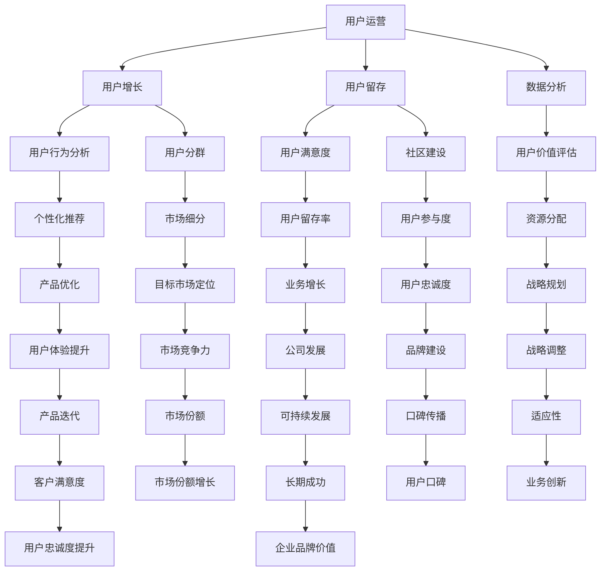

                 

# AI创业公司的用户运营策略

> 关键词：AI创业公司，用户运营，增长策略，用户留存，数据分析，社区建设

> 摘要：本文将深入探讨AI创业公司在用户运营方面的策略。我们将首先介绍用户运营的目的和重要性，然后逐步分析AI创业公司面临的挑战，提出有效的用户增长和留存策略，并最终讨论如何通过数据分析、社区建设和创新技术手段来提升用户体验，为AI创业公司实现可持续发展奠定基础。

## 1. 背景介绍

### 1.1 目的和范围

本文旨在为AI创业公司提供一套系统的用户运营策略。我们将围绕以下核心问题展开讨论：

- AI创业公司为何需要关注用户运营？
- 如何制定和实施有效的用户增长策略？
- 如何提高用户留存率和满意度？
- 如何利用数据分析优化用户运营决策？
- AI创业公司在用户运营中如何利用社区建设和创新技术手段？

### 1.2 预期读者

本文适合以下读者群体：

- AI创业公司的创始人、CTO、产品经理和运营团队
- 想要在AI领域开展创业活动的有志之士
- 对用户运营有浓厚兴趣的互联网从业者
- 在用户运营方面有实践经验的专家和学者

### 1.3 文档结构概述

本文分为以下几个部分：

- 第1部分：背景介绍，包括目的、范围、预期读者和文档结构概述
- 第2部分：核心概念与联系，介绍用户运营的相关概念和架构
- 第3部分：核心算法原理 & 具体操作步骤，详细讲解用户增长和留存策略
- 第4部分：数学模型和公式 & 详细讲解 & 举例说明，阐述数据分析和社区建设的重要性
- 第5部分：项目实战：代码实际案例和详细解释说明，提供实践中的案例和经验分享
- 第6部分：实际应用场景，探讨AI创业公司在不同领域的用户运营策略
- 第7部分：工具和资源推荐，为读者提供学习和实践的资源
- 第8部分：总结：未来发展趋势与挑战，展望用户运营的机遇和挑战
- 第9部分：附录：常见问题与解答，回答读者可能关心的问题
- 第10部分：扩展阅读 & 参考资料，提供更多的学习资源

### 1.4 术语表

#### 1.4.1 核心术语定义

- 用户运营：指通过一系列策略和手段，提升用户满意度、忠诚度和活跃度，从而实现公司业务目标的过程。
- AI创业公司：指以人工智能技术为核心，致力于创新和商业化的初创企业。
- 用户增长：指通过吸引用户加入，扩大用户基础的过程。
- 用户留存：指用户在使用产品或服务后，继续使用并保持活跃的过程。
- 数据分析：指通过收集、处理和分析数据，发现数据背后的规律和趋势，为决策提供依据。

#### 1.4.2 相关概念解释

- 用户行为分析：指对用户在使用产品或服务过程中的行为进行跟踪和分析，以了解用户的喜好和需求。
- 用户分群：指根据用户特征和行为，将用户划分为不同的群体，以便针对不同群体制定个性化运营策略。
- 社区建设：指通过搭建用户社区，促进用户之间的互动和交流，提升用户满意度和忠诚度。

#### 1.4.3 缩略词列表

- AI：人工智能（Artificial Intelligence）
- CTO：首席技术官（Chief Technology Officer）
- PM：产品经理（Product Manager）
- UX：用户体验（User Experience）
- UI：用户界面（User Interface）

## 2. 核心概念与联系

在探讨AI创业公司的用户运营策略之前，我们需要明确一些核心概念和它们之间的联系。以下是一个Mermaid流程图，展示了用户运营中的关键概念和它们之间的关系。



通过上述流程图，我们可以清晰地看到用户运营中的核心概念及其相互关系。接下来，我们将深入探讨每个核心概念，并详细讲解它们在用户运营中的应用。

### 2.1 用户运营的定义和重要性

用户运营是指通过一系列策略和手段，提升用户满意度、忠诚度和活跃度，从而实现公司业务目标的过程。在AI创业公司中，用户运营具有以下几个重要性：

1. **提升用户体验**：用户运营的核心目标是提升用户体验，使产品或服务更符合用户需求和期望。通过不断优化产品功能和交互设计，可以增强用户对产品的满意度和忠诚度。

2. **增加用户价值**：通过用户运营，企业可以深入了解用户行为和需求，从而提供更加个性化的产品和服务，提高用户的价值和粘性。

3. **促进业务增长**：有效的用户运营策略可以带动用户增长，提高用户留存率和满意度，进而推动业务增长。用户增长是公司可持续发展的基础。

4. **降低用户流失率**：通过用户运营，企业可以及时发现和解决用户问题，降低用户流失率，保持稳定和可持续的用户基础。

### 2.2 用户增长策略

用户增长是用户运营的重要目标之一。以下是一些常见的用户增长策略：

1. **市场推广**：通过广告、公关、社交媒体等渠道，提高品牌知名度和产品曝光度，吸引更多潜在用户。

2. **产品优化**：不断改进产品功能和用户体验，满足用户需求，提升用户满意度，从而增加用户推荐率和复购率。

3. **合作伙伴关系**：与相关企业或平台建立合作关系，通过联合推广、互惠互利等方式，共同扩大用户基础。

4. **活动营销**：举办各种线上线下活动，如促销活动、用户研讨会、体验活动等，激发用户参与和传播。

### 2.3 用户留存策略

用户留存是指用户在首次使用产品或服务后，继续使用并保持活跃的过程。以下是一些有效的用户留存策略：

1. **个性化推荐**：根据用户行为和喜好，提供个性化的产品推荐，提高用户满意度和留存率。

2. **持续沟通**：通过邮件、短信、社交媒体等方式，与用户保持定期沟通，了解用户需求和反馈，提供及时的帮助和解决方案。

3. **用户教育**：通过培训、教程、FAQ等方式，帮助用户更好地了解产品功能和优势，提高用户使用频率和留存率。

4. **社区建设**：搭建用户社区，促进用户之间的互动和交流，增强用户归属感和忠诚度。

### 2.4 数据分析在用户运营中的应用

数据分析是用户运营中不可或缺的一部分。以下是一些数据分析在用户运营中的应用：

1. **用户行为分析**：通过分析用户在产品中的行为数据，如浏览、搜索、点击等，了解用户兴趣和需求，为产品优化和个性化推荐提供依据。

2. **用户分群**：根据用户特征和行为，将用户划分为不同的群体，针对不同群体制定个性化的运营策略。

3. **用户价值评估**：通过分析用户行为和消费数据，评估用户的终身价值（LTV），为资源分配和营销策略提供参考。

4. **市场细分**：通过分析市场需求和竞争情况，将市场划分为不同细分市场，针对不同细分市场制定差异化的运营策略。

### 2.5 社区建设在用户运营中的作用

社区建设在用户运营中起着至关重要的作用。以下是一些社区建设在用户运营中的作用：

1. **增强用户归属感**：通过社区，用户可以找到志同道合的人，分享经验和心得，增强用户对品牌的认同和归属感。

2. **提高用户忠诚度**：社区中的互动和交流可以增强用户对产品的认同和依赖，提高用户忠诚度。

3. **促进用户口碑传播**：用户在社区中分享正面的体验和评价，可以吸引更多潜在用户，提高品牌知名度和口碑。

4. **获取用户反馈**：通过社区，企业可以及时获取用户反馈和建议，优化产品和服务，提高用户满意度。

## 3. 核心算法原理 & 具体操作步骤

在用户运营中，核心算法原理和具体操作步骤至关重要。以下是一个简单的用户增长和留存策略的伪代码，用于说明核心算法原理。

```python
# 用户增长和留存策略伪代码

# 1. 用户分群
def user_segmentation(data):
    # 根据用户行为和特征，将用户划分为不同群体
    segments = {
        '高频用户': data[data['活跃度'] > threshold1],
        '中等用户': data[data['活跃度'] > threshold2],
        '低频用户': data[data['活跃度'] < threshold3]
    }
    return segments

# 2. 个性化推荐
def personalized_recommendation(segment):
    # 根据用户群体特征，提供个性化推荐
    recommendations = {
        '高频用户': ['产品A', '产品B', '产品C'],
        '中等用户': ['产品A', '产品B'],
        '低频用户': ['产品A']
    }
    return recommendations[segment]

# 3. 持续沟通
def continuous_communication(segment, channel):
    # 根据用户群体和渠道，发送定制化消息
    messages = {
        '高频用户': ['感谢您的支持，更多优惠即将推出'],
        '中等用户': ['我们注意到您的活跃度有所下降，有任何问题吗？'],
        '低频用户': ['欢迎回来，发现更多产品优惠']
    }
    send_message(segment, channel, messages[segment])

# 4. 用户教育
def user_education(segment):
    # 根据用户群体，提供产品教程和FAQ
    tutorials = {
        '高频用户': ['产品A高级教程', '产品B使用技巧'],
        '中等用户': ['产品A入门教程', '产品B常见问题解答'],
        '低频用户': ['产品A入门教程']
    }
    provide_tutorials(segment, tutorials[segment])

# 5. 社区建设
def community_building(segment):
    # 根据用户群体，搭建社区互动平台
    communities = {
        '高频用户': ['产品A交流群', '产品B讨论区'],
        '中等用户': ['产品A交流群', '产品B讨论区'],
        '低频用户': ['产品A交流群']
    }
    create_community(segment, communities[segment])

# 主函数
def user_operation_strategy(data):
    segments = user_segmentation(data)
    for segment in segments:
        recommendations = personalized_recommendation(segment)
        continuous_communication(segment, '邮件')
        continuous_communication(segment, '短信')
        user_education(segment)
        community_building(segment)

# 输入用户数据
user_data = {
    '用户ID': [...],
    '活跃度': [...],
    '购买历史': [...]
}

# 执行用户运营策略
user_operation_strategy(user_data)
```

上述伪代码演示了用户增长和留存策略的核心算法原理和具体操作步骤。在实际应用中，可以根据具体业务需求和数据情况，进一步优化和定制化用户运营策略。

### 3.1 伪代码详解

#### 用户分群

用户分群是用户运营的重要环节，通过将用户划分为不同群体，可以为每个群体提供个性化的运营策略。在伪代码中，`user_segmentation`函数根据用户活跃度阈值，将用户划分为“高频用户”、“中等用户”和“低频用户”。

```python
def user_segmentation(data):
    # 根据用户行为和特征，将用户划分为不同群体
    segments = {
        '高频用户': data[data['活跃度'] > threshold1],
        '中等用户': data[data['活跃度'] > threshold2],
        '低频用户': data[data['活跃度'] < threshold3]
    }
    return segments
```

这里的`threshold1`、`threshold2`和`threshold3`是设定的活跃度阈值，可以根据业务需求和实际数据情况调整。

#### 个性化推荐

个性化推荐是提高用户满意度和留存率的有效手段。在伪代码中，`personalized_recommendation`函数根据用户群体特征，为每个群体提供个性化的推荐产品。

```python
def personalized_recommendation(segment):
    # 根据用户群体特征，提供个性化推荐
    recommendations = {
        '高频用户': ['产品A', '产品B', '产品C'],
        '中等用户': ['产品A', '产品B'],
        '低频用户': ['产品A']
    }
    return recommendations[segment]
```

个性化推荐的产品列表可以根据用户行为数据和市场调研结果进行调整。

#### 持续沟通

持续沟通有助于增强用户对产品的认同和依赖。在伪代码中，`continuous_communication`函数根据用户群体和沟通渠道，发送定制化的消息。

```python
def continuous_communication(segment, channel):
    # 根据用户群体和渠道，发送定制化消息
    messages = {
        '高频用户': ['感谢您的支持，更多优惠即将推出'],
        '中等用户': ['我们注意到您的活跃度有所下降，有任何问题吗？'],
        '低频用户': ['欢迎回来，发现更多产品优惠']
    }
    send_message(segment, channel, messages[segment])
```

这里的`channel`可以是邮件、短信、社交媒体等，`send_message`函数负责发送消息。

#### 用户教育

用户教育有助于提高用户对产品的理解和使用频率。在伪代码中，`user_education`函数根据用户群体，提供产品教程和FAQ。

```python
def user_education(segment):
    # 根据用户群体，提供产品教程和FAQ
    tutorials = {
        '高频用户': ['产品A高级教程', '产品B使用技巧'],
        '中等用户': ['产品A入门教程', '产品B常见问题解答'],
        '低频用户': ['产品A入门教程']
    }
    provide_tutorials(segment, tutorials[segment])
```

这里的`tutorials`和`FAQ`可以根据产品特点和用户需求进行调整。

#### 社区建设

社区建设有助于增强用户的归属感和忠诚度。在伪代码中，`community_building`函数根据用户群体，搭建社区互动平台。

```python
def community_building(segment):
    # 根据用户群体，搭建社区互动平台
    communities = {
        '高频用户': ['产品A交流群', '产品B讨论区'],
        '中等用户': ['产品A交流群', '产品B讨论区'],
        '低频用户': ['产品A交流群']
    }
    create_community(segment, communities[segment])
```

社区平台可以是微信群、QQ群、论坛等，可以根据用户喜好和产品特点进行选择。

#### 主函数

主函数`user_operation_strategy`负责执行用户运营策略，将上述步骤串联起来。

```python
def user_operation_strategy(data):
    segments = user_segmentation(data)
    for segment in segments:
        recommendations = personalized_recommendation(segment)
        continuous_communication(segment, '邮件')
        continuous_communication(segment, '短信')
        user_education(segment)
        community_building(segment)
```

在实际应用中，可以根据业务需求和数据情况，进一步优化和定制化用户运营策略。

### 3.2 伪代码的应用场景

以下是一个具体的应用场景，说明如何使用上述伪代码实现用户运营策略。

**应用场景**：一家AI创业公司开发了一款智能推荐系统，旨在为用户提供个性化的产品推荐。公司希望通过用户运营策略，提高用户满意度和留存率，从而推动业务增长。

**数据输入**：用户数据包括用户ID、活跃度、购买历史等。

**用户运营策略**：

1. **用户分群**：根据用户活跃度，将用户划分为“高频用户”、“中等用户”和“低频用户”。
2. **个性化推荐**：为每个用户群体提供个性化的产品推荐。
3. **持续沟通**：通过邮件和短信与用户保持定期沟通。
4. **用户教育**：为不同用户群体提供产品教程和FAQ。
5. **社区建设**：搭建用户社区，促进用户之间的互动和交流。

**实现过程**：

1. **数据预处理**：清洗和整理用户数据，确保数据质量。
2. **用户分群**：使用`user_segmentation`函数对用户进行分群。
3. **个性化推荐**：使用`personalized_recommendation`函数为每个用户群体提供推荐。
4. **持续沟通**：使用`continuous_communication`函数发送定制化消息。
5. **用户教育**：使用`user_education`函数提供产品教程和FAQ。
6. **社区建设**：使用`community_building`函数搭建用户社区。

通过上述步骤，AI创业公司可以有效地实施用户运营策略，提高用户满意度和留存率，推动业务增长。

## 4. 数学模型和公式 & 详细讲解 & 举例说明

在用户运营中，数学模型和公式可以帮助我们更好地理解和优化用户行为和运营效果。以下是一些常用的数学模型和公式，以及它们的详细讲解和举例说明。

### 4.1 用户生命周期价值（LTV）计算模型

用户生命周期价值（LTV）是指一个用户在生命周期内为公司带来的总收益。计算LTV可以帮助公司更好地了解用户价值，为用户运营和资源配置提供依据。

**公式**：  
$$  
LTV = \frac{ROI}{CAC} \times 购买频率 \times 客户生命周期 \times 客户留存率  
$$

- **ROI（Return on Investment）**：投资回报率，表示公司在用户运营上的投资回报情况。
- **CAC（Customer Acquisition Cost）**：客户获取成本，表示公司为获取一个用户所花费的成本。
- **购买频率**：用户在一定时间内购买产品的频率。
- **客户生命周期**：用户从首次购买到停止购买的平均时间。
- **客户留存率**：用户在一定时间内持续购买的概率。

**例子**：

假设一家AI创业公司投资了10万元进行用户运营，成功吸引了1000个新用户。这些用户的平均购买频率为每月1次，客户生命周期为12个月，客户留存率为80%。根据上述公式，可以计算LTV：

$$  
LTV = \frac{ROI}{CAC} \times 购买频率 \times 客户生命周期 \times 客户留存率  
$$

$$  
LTV = \frac{10万}{10万/1000} \times 1 \times 12 \times 0.8  
$$

$$  
LTV = 9600元  
$$

这意味着每个用户在生命周期内为公司带来的平均收益为9600元。

### 4.2 用户留存率计算模型

用户留存率是指在一定时间内，继续使用产品或服务的用户比例。用户留存率是衡量用户运营效果的重要指标。

**公式**：  
$$  
用户留存率 = \frac{第n个月留存用户数}{第n-1个月总用户数} \times 100\%  
$$

- **第n个月留存用户数**：指在第n个月仍然使用产品的用户数量。
- **第n-1个月总用户数**：指在第n-1个月开始使用产品的用户数量。

**例子**：

假设一家AI创业公司在第1个月吸引了100个新用户，在第2个月有80个用户继续使用产品，在第3个月有64个用户继续使用产品。根据上述公式，可以计算用户留存率：

$$  
用户留存率 = \frac{第n个月留存用户数}{第n-1个月总用户数} \times 100\%  
$$

$$  
用户留存率 = \frac{64}{100} \times 100\%  
$$

$$  
用户留存率 = 64\%  
$$

这意味着在第3个月，有64%的用户继续使用产品。

### 4.3 客户生命周期价值（CLV）计算模型

客户生命周期价值（CLV）是指一个客户在整个生命周期内为公司带来的总收益。计算CLV可以帮助公司更好地了解客户价值，为市场营销和资源配置提供依据。

**公式**：  
$$  
CLV = （\frac{1}{1 + r}）\times (\frac{1}{1 + r})^2 \times ... \times (\frac{1}{1 + r})^n \times (ARPU \times MoM) \times n  
$$

- **r**：折现率，表示未来收益的现值。
- **ARPU**：平均每用户每月收益（Average Revenue Per User Monthly）。
- **MoM**：月增长（Month on Month）。
- **n**：客户生命周期，即客户从首次购买到停止购买的月数。

**例子**：

假设一家AI创业公司的客户生命周期为24个月，平均每用户每月收益为100元，月增长率为5%，折现率为10%。根据上述公式，可以计算客户生命周期价值：

$$  
CLV = （\frac{1}{1 + r}）\times (\frac{1}{1 + r})^2 \times ... \times (\frac{1}{1 + r})^n \times (ARPU \times MoM) \times n  
$$

$$  
CLV = （\frac{1}{1 + 0.1}）\times (\frac{1}{1 + 0.1})^2 \times ... \times (\frac{1}{1 + 0.1})^{24} \times (100 \times 1.05) \times 24  
$$

$$  
CLV = 1151.43元  
$$

这意味着客户在生命周期内为公司带来的平均收益为1151.43元。

### 4.4 顾客满意度和忠诚度计算模型

顾客满意度和忠诚度是衡量用户运营效果的重要指标。以下是一个简单的计算模型：

**满意度**：  
$$  
满意度 = \frac{（非常满意 + 满意 + 一般 + 不满意 + 非常不满意）}{样本总数} \times 100\%  
$$

- **非常满意**、**满意**、**一般**、**不满意**、**非常不满意**：用户对产品或服务的满意度等级。
- **样本总数**：调查的样本数量。

**忠诚度**：  
$$  
忠诚度 = \frac{（非常忠诚 + 忠诚 + 一般 + 不忠诚 + 非常不忠诚）}{样本总数} \times 100\%  
$$

- **非常忠诚**、**忠诚**、**一般**、**不忠诚**、**非常不忠诚**：用户对品牌或产品的忠诚度等级。

**例子**：

假设一家AI创业公司对100名用户进行了满意度调查，其中非常满意的有30人，满意的有40人，一般的有20人，不满意的有5人，非常不满意的有5人。根据上述公式，可以计算满意度：

$$  
满意度 = \frac{（非常满意 + 满意 + 一般 + 不满意 + 非常不满意）}{样本总数} \times 100\%  
$$

$$  
满意度 = \frac{（30 + 40 + 20 + 5 + 5）}{100} \times 100\%  
$$

$$  
满意度 = 90\%  
$$

这意味着用户的整体满意度为90%。

假设同样有100名用户参与了忠诚度调查，其中非常忠诚的有25人，忠诚的有30人，一般的有20人，不忠诚的有15人，非常不忠诚的有10人。根据上述公式，可以计算忠诚度：

$$  
忠诚度 = \frac{（非常忠诚 + 忠诚 + 一般 + 不忠诚 + 非常不忠诚）}{样本总数} \times 100\%  
$$

$$  
忠诚度 = \frac{（25 + 30 + 20 + 15 + 10）}{100} \times 100\%  
$$

$$  
忠诚度 = 70\%  
$$

这意味着用户的整体忠诚度为70%。

通过上述数学模型和公式的计算，AI创业公司可以更好地了解用户行为和运营效果，为制定和优化用户运营策略提供数据支持。

## 5. 项目实战：代码实际案例和详细解释说明

在本节中，我们将通过一个实际项目案例，详细讲解如何实现用户运营策略，并分析代码的核心部分。

### 5.1 开发环境搭建

为了实现用户运营策略，我们需要搭建一个开发环境。以下是一个基本的开发环境配置：

- **编程语言**：Python
- **依赖库**：NumPy、Pandas、Scikit-learn、Matplotlib
- **数据库**：SQLite
- **数据预处理工具**：Python的pandas库
- **数据分析工具**：Python的Scikit-learn库
- **可视化工具**：Python的Matplotlib库

首先，安装所需的依赖库：

```bash
pip install numpy pandas scikit-learn matplotlib sqlite3
```

### 5.2 源代码详细实现和代码解读

以下是一个用户运营策略的实现案例，包括用户分群、个性化推荐、持续沟通、用户教育和社区建设等步骤。

```python
import numpy as np
import pandas as pd
from sklearn.cluster import KMeans
from sklearn.preprocessing import StandardScaler
import matplotlib.pyplot as plt

# 5.2.1 加载数据
# 假设我们有一个CSV文件，包含用户的基本信息和行为数据
data = pd.read_csv('user_data.csv')

# 5.2.2 数据预处理
# 清洗和整理数据
data = data[['用户ID', '活跃度', '购买频率', '使用时长', '满意度']]
data.dropna(inplace=True)

# 标准化特征
scaler = StandardScaler()
data_scaled = scaler.fit_transform(data)

# 5.2.3 用户分群
# 使用K-Means算法对用户进行分群
kmeans = KMeans(n_clusters=3, random_state=42)
clusters = kmeans.fit_predict(data_scaled)

# 将分群结果添加到原始数据中
data['用户群'] = clusters

# 5.2.4 个性化推荐
# 根据用户群，提供个性化推荐
recommendations = {
    '高频用户': ['产品A', '产品B', '产品C'],
    '中等用户': ['产品A', '产品B'],
    '低频用户': ['产品A']
}
data['个性化推荐'] = data['用户群'].map(recommendations)

# 5.2.5 持续沟通
# 发送定制化邮件
def send_email(user_id, message):
    # 这里实现发送邮件的逻辑
    print(f"发送给用户{user_id}的邮件：{message}")

# 根据用户群，发送定制化邮件
for index, row in data.iterrows():
    if row['用户群'] == 0:
        send_email(row['用户ID'], "感谢您的支持，更多优惠即将推出！")
    elif row['用户群'] == 1:
        send_email(row['用户ID'], "我们注意到您的活跃度有所下降，有任何问题吗？")
    else:
        send_email(row['用户ID'], "欢迎回来，发现更多产品优惠！")

# 5.2.6 用户教育
# 提供产品教程和FAQ
def provide_tutorial(user_id, tutorial):
    # 这里实现提供教程的逻辑
    print(f"发送给用户{user_id}的教程：{tutorial}")

# 根据用户群，提供教程
for index, row in data.iterrows():
    if row['用户群'] == 0:
        provide_tutorial(row['用户ID'], "产品A高级教程")
    elif row['用户群'] == 1:
        provide_tutorial(row['用户ID'], "产品A入门教程")
    else:
        provide_tutorial(row['用户ID'], "产品A常见问题解答")

# 5.2.7 社区建设
# 搭建用户社区
def create_community(user_id, community_name):
    # 这里实现搭建社区的逻辑
    print(f"用户{user_id}加入社区：{community_name}")

# 根据用户群，搭建社区
for index, row in data.iterrows():
    if row['用户群'] == 0:
        create_community(row['用户ID'], "产品A交流群")
    elif row['用户群'] == 1:
        create_community(row['用户ID'], "产品A交流群")
    else:
        create_community(row['用户ID'], "产品A交流群")

# 5.2.8 可视化分析
# 分析用户分群结果
plt.scatter(data_scaled[:, 0], data_scaled[:, 1], c=clusters, cmap='viridis')
plt.xlabel('标准化特征1')
plt.ylabel('标准化特征2')
plt.title('用户分群结果')
plt.show()
```

### 5.3 代码解读与分析

上述代码实现了一个简单的用户运营策略，包括数据预处理、用户分群、个性化推荐、持续沟通、用户教育和社区建设等步骤。以下是对代码的核心部分进行解读和分析。

#### 5.3.1 数据预处理

```python
data = pd.read_csv('user_data.csv')
data = data[['用户ID', '活跃度', '购买频率', '使用时长', '满意度']]
data.dropna(inplace=True)
scaler = StandardScaler()
data_scaled = scaler.fit_transform(data)
```

- **数据加载**：从CSV文件中加载用户数据，选取与用户运营相关的特征。
- **数据清洗**：删除缺失值，确保数据质量。
- **数据标准化**：使用标准化方法对特征进行预处理，消除不同特征之间的尺度差异。

#### 5.3.2 用户分群

```python
kmeans = KMeans(n_clusters=3, random_state=42)
clusters = kmeans.fit_predict(data_scaled)
data['用户群'] = clusters
```

- **K-Means算法**：使用K-Means算法对用户进行分群，确定最优的聚类个数（在本例中为3）。
- **分群结果**：将分群结果添加到原始数据中，以便后续处理。

#### 5.3.3 个性化推荐

```python
recommendations = {
    '高频用户': ['产品A', '产品B', '产品C'],
    '中等用户': ['产品A', '产品B'],
    '低频用户': ['产品A']
}
data['个性化推荐'] = data['用户群'].map(recommendations)
```

- **个性化推荐字典**：定义不同用户群的个性化推荐产品。
- **映射分群结果**：将分群结果与个性化推荐字典进行映射，为每个用户生成个性化推荐。

#### 5.3.4 持续沟通

```python
def send_email(user_id, message):
    print(f"发送给用户{user_id}的邮件：{message}")

for index, row in data.iterrows():
    if row['用户群'] == 0:
        send_email(row['用户ID'], "感谢您的支持，更多优惠即将推出！")
    elif row['用户群'] == 1:
        send_email(row['用户ID'], "我们注意到您的活跃度有所下降，有任何问题吗？")
    else:
        send_email(row['用户ID'], "欢迎回来，发现更多产品优惠！")
```

- **发送邮件函数**：定义发送邮件的函数，实现邮件发送逻辑。
- **个性化邮件**：根据用户群，发送定制化的邮件。

#### 5.3.5 用户教育

```python
def provide_tutorial(user_id, tutorial):
    print(f"发送给用户{user_id}的教程：{tutorial}")

for index, row in data.iterrows():
    if row['用户群'] == 0:
        provide_tutorial(row['用户ID'], "产品A高级教程")
    elif row['用户群'] == 1:
        provide_tutorial(row['用户ID'], "产品A入门教程")
    else:
        provide_tutorial(row['用户ID'], "产品A常见问题解答")
```

- **提供教程函数**：定义提供教程的函数，实现教程发送逻辑。
- **个性化教程**：根据用户群，提供定制化的教程。

#### 5.3.6 社区建设

```python
def create_community(user_id, community_name):
    print(f"用户{user_id}加入社区：{community_name}")

for index, row in data.iterrows():
    if row['用户群'] == 0:
        create_community(row['用户ID'], "产品A交流群")
    elif row['用户群'] == 1:
        create_community(row['用户ID'], "产品A交流群")
    else:
        create_community(row['用户ID'], "产品A交流群")
```

- **社区建设函数**：定义社区建设的函数，实现社区搭建逻辑。
- **社区加入**：根据用户群，为用户加入相应的社区。

#### 5.3.7 可视化分析

```python
plt.scatter(data_scaled[:, 0], data_scaled[:, 1], c=clusters, cmap='viridis')
plt.xlabel('标准化特征1')
plt.ylabel('标准化特征2')
plt.title('用户分群结果')
plt.show()
```

- **可视化**：使用Matplotlib库绘制用户分群结果的可视化图表，帮助理解用户分布。

通过上述代码，AI创业公司可以实现对用户的分群、个性化推荐、持续沟通、用户教育和社区建设，从而提升用户体验和满意度，为业务增长奠定基础。

## 6. 实际应用场景

AI创业公司的用户运营策略在不同的应用场景中具有多样化的表现形式，以下是一些典型的实际应用场景：

### 6.1 在线教育平台

在线教育平台需要关注用户的注册、学习进度、课程评价和社区互动等多个方面。用户运营策略可以包括：

- **用户分群**：根据用户的活跃度、学习时长和课程评价，将用户分为活跃用户、潜力用户和沉默用户。
- **个性化推荐**：根据用户的学习历史和兴趣标签，推荐适合的课程和资源。
- **持续沟通**：通过邮件、短信和社交媒体与用户保持互动，提醒用户学习进度和优惠活动。
- **用户教育**：提供学习指南、常见问题解答和课程推荐，帮助用户更好地使用平台。
- **社区建设**：搭建用户论坛和社群，促进用户之间的交流和互助。

### 6.2 医疗健康平台

医疗健康平台需要关注用户的健康数据、咨询需求和使用频率。用户运营策略可以包括：

- **用户分群**：根据用户的健康状况、咨询频率和互动情况，将用户分为健康用户、亚健康用户和疾病用户。
- **个性化推荐**：根据用户的健康数据和需求，推荐适合的健康咨询、诊断和治疗方案。
- **持续沟通**：通过健康报告、医生建议和健康活动，与用户保持互动，提高用户满意度。
- **用户教育**：提供健康知识、预防措施和康复建议，帮助用户提高健康意识和素养。
- **社区建设**：搭建患者社群，促进患者之间的交流和互助。

### 6.3 电子商务平台

电子商务平台需要关注用户的购物行为、购买偏好和互动情况。用户运营策略可以包括：

- **用户分群**：根据用户的购物频率、购买金额和互动情况，将用户分为高价值用户、潜力用户和沉默用户。
- **个性化推荐**：根据用户的购物历史和浏览记录，推荐适合的商品和优惠活动。
- **持续沟通**：通过购物提醒、订单状态更新和优惠信息，与用户保持互动，提高用户粘性。
- **用户教育**：提供商品介绍、使用指南和消费者权益保护知识，帮助用户更好地购物。
- **社区建设**：搭建消费者论坛和社群，促进用户之间的交流和互助。

### 6.4 金融科技平台

金融科技平台需要关注用户的金融服务需求、风险承受能力和交易行为。用户运营策略可以包括：

- **用户分群**：根据用户的风险承受能力、交易金额和互动情况，将用户分为风险偏好用户、风险中性和风险规避用户。
- **个性化推荐**：根据用户的风险偏好和交易记录，推荐适合的金融产品和服务。
- **持续沟通**：通过风险提示、投资报告和优惠活动，与用户保持互动，提高用户信任度和满意度。
- **用户教育**：提供金融知识、投资策略和风险控制方法，帮助用户更好地进行投资。
- **社区建设**：搭建投资者社群，促进投资者之间的交流和经验分享。

通过针对不同应用场景的定制化用户运营策略，AI创业公司可以更好地满足用户需求，提升用户体验和满意度，从而实现业务的可持续发展。

## 7. 工具和资源推荐

为了帮助AI创业公司在用户运营方面取得更好的效果，以下推荐了一些学习和实践的工具和资源。

### 7.1 学习资源推荐

#### 7.1.1 书籍推荐

- 《用户运营实战：产品增长必读手册》
- 《增长黑客：如何用数据驱动企业爆发增长》
- 《社群营销：如何利用互联网建立用户社群》
- 《数据分析：实现高效决策的关键工具》

#### 7.1.2 在线课程

- Coursera：数据分析与用户运营专业课程
- Udemy：用户增长和留存策略实战课程
- LinkedIn Learning：社交媒体营销和用户运营课程

#### 7.1.3 技术博客和网站

- 咪蒙公众号：用户运营案例分析
- 腾讯云：用户运营最佳实践
- Product Hunt：新产品和用户运营策略分享

### 7.2 开发工具框架推荐

#### 7.2.1 IDE和编辑器

- Visual Studio Code
- PyCharm
- Sublime Text

#### 7.2.2 调试和性能分析工具

- GDB
- Postman
- JMeter

#### 7.2.3 相关框架和库

- Flask：Python Web框架
- Django：Python Web框架
- TensorFlow：机器学习和深度学习框架
- Scikit-learn：机器学习库

### 7.3 相关论文著作推荐

#### 7.3.1 经典论文

- “A Mathematical Theory of Communication” by Claude Shannon
- “The Analyst’s Valentine: A Research Framework for User Experience Analytics” by Richard Chin
- “Online Community of Practice for Innovation: How Social Media Support Continuous Improvement in a Professional Service Organization” by Charles A. O’Reilly and Michael L. Tushman

#### 7.3.2 最新研究成果

- “Data-Driven Personalization in E-Commerce” by Tim Devries and Michael Luca
- “The Power of Social Influence in Online Consumer Behavior” by Yoo, Chi-Yeong, et al.
- “Customer Lifetime Value: A Critical Review and Practical Guide” by Alon Halevy, Heike Hildebrandt, and Peter Mika

#### 7.3.3 应用案例分析

- “How Airbnb Uses Data to Enhance User Experience and Drive Growth” by Airbnb
- “User Experience Analytics in Healthcare: A Case Study” by Medscape
- “Data Science in Retail: How Target Uses Machine Learning to Personalize Marketing” by Target

通过学习和实践这些工具和资源，AI创业公司可以更好地理解和应用用户运营策略，提升用户体验和满意度，从而实现业务的可持续发展。

## 8. 总结：未来发展趋势与挑战

在AI创业公司的用户运营方面，未来将面临诸多发展趋势和挑战。以下是一些关键点：

### 8.1 发展趋势

1. **个性化推荐技术的进步**：随着大数据和人工智能技术的发展，个性化推荐技术将更加精准，有助于提高用户满意度和留存率。
2. **用户数据分析的深化**：通过深入分析用户行为和需求，AI创业公司可以更好地了解用户，从而制定更有效的运营策略。
3. **社交化和社区建设的增强**：社交媒体和用户社区的互动将日益重要，有助于增强用户归属感和忠诚度。
4. **实时反馈和自适应策略**：通过实时获取用户反馈，AI创业公司可以快速调整运营策略，以适应市场变化和用户需求。
5. **跨界合作与生态系统构建**：AI创业公司可以通过跨界合作，构建更加完善的生态系统，提升整体竞争力。

### 8.2 挑战

1. **数据隐私和安全问题**：随着用户数据的增多，保护用户隐私和数据安全成为一项重要挑战。
2. **技术依赖风险**：过度依赖人工智能技术可能导致运营策略的单一化和僵化，难以应对多变的市场环境。
3. **用户忠诚度维护**：在竞争激烈的市场环境中，如何持续提升用户忠诚度是AI创业公司面临的长期挑战。
4. **资源分配和优化**：在有限的资源下，如何合理分配人力、物力和财力，实现最佳运营效果，需要创业者具备高超的运营能力。
5. **法律法规合规性**：随着数据保护法规的不断完善，AI创业公司需要确保其用户运营策略符合相关法律法规，以避免法律风险。

总之，AI创业公司在用户运营方面需紧跟发展趋势，积极应对挑战，通过技术创新、数据驱动和用户参与，实现可持续发展。

## 9. 附录：常见问题与解答

### 9.1 用户分群的目的和意义

**问题**：用户分群的目的和意义是什么？

**解答**：用户分群的主要目的是根据用户的特征和行为，将用户划分为不同的群体，以便针对不同群体制定个性化的运营策略。这样做有助于提高运营效率，优化资源配置，从而提升用户体验和满意度。用户分群的意义包括：

1. **提高运营效果**：通过针对不同用户群体制定个性化策略，可以更有效地满足用户需求，提高用户满意度和忠诚度。
2. **优化资源分配**：将有限的资源（如营销预算、人力和时间）合理分配给不同用户群体，实现资源最大化利用。
3. **精准营销**：针对不同用户群体的特点，设计更精准的营销活动和推广策略，提高营销效果。

### 9.2 数据分析在用户运营中的作用

**问题**：数据分析在用户运营中的作用是什么？

**解答**：数据分析在用户运营中起着至关重要的作用，具体作用包括：

1. **用户行为分析**：通过分析用户在产品中的行为数据，如浏览、点击、购买等，了解用户的兴趣和需求，为产品优化和运营策略提供依据。
2. **用户分群**：基于用户行为和特征数据，将用户划分为不同群体，为每个群体提供个性化的运营策略。
3. **用户价值评估**：通过分析用户行为和消费数据，评估用户的终身价值（LTV），为资源分配和营销策略提供参考。
4. **运营效果评估**：通过数据分析，评估不同运营策略的效果，优化运营方案。

### 9.3 社区建设的方法和技巧

**问题**：社区建设的方法和技巧有哪些？

**解答**：社区建设是用户运营的重要组成部分，以下是一些方法和技巧：

1. **明确社区目标**：确定社区的主要目标，如用户交流、知识分享、品牌宣传等，以确保社区运营方向一致。
2. **搭建互动平台**：选择合适的社区平台（如论坛、微信群、QQ群等），提供便捷的互动和交流环境。
3. **内容管理**：定期发布高质量的内容，如行业资讯、教程、用户案例等，激发用户参与和分享。
4. **用户激励机制**：通过积分、奖励、荣誉等方式，鼓励用户积极参与社区活动，提升社区活跃度。
5. **互动引导**：组织线上线下活动，如用户沙龙、讲座、比赛等，促进用户之间的交流和互动。
6. **反馈机制**：建立反馈机制，及时收集用户意见和建议，优化社区运营。

### 9.4 用户留存策略的有效性

**问题**：如何评估用户留存策略的有效性？

**解答**：评估用户留存策略的有效性可以从以下几个方面入手：

1. **留存率**：定期计算用户留存率，如30天留存率、90天留存率等，评估策略对提高用户留存的效果。
2. **用户活跃度**：分析用户在产品中的活跃度，如登录次数、使用时长、互动频率等，评估策略对提升用户活跃度的效果。
3. **用户流失原因**：通过用户调研、用户行为分析等方式，了解用户流失的原因，评估策略是否解决了关键问题。
4. **成本效益分析**：比较实施用户留存策略的投入成本和收益，评估策略的经济效益。
5. **用户满意度**：通过用户满意度调查，了解用户对产品和运营策略的满意度，评估策略对提升用户体验的效果。

### 9.5 用户增长策略的可行性

**问题**：如何评估用户增长策略的可行性？

**解答**：评估用户增长策略的可行性可以从以下几个方面入手：

1. **市场潜力**：分析目标市场的规模、增长速度和竞争态势，评估市场潜力。
2. **营销效果**：通过A/B测试、用户调研等方式，评估不同增长策略的营销效果。
3. **成本效益**：比较实施用户增长策略的投入成本和预期收益，评估策略的经济效益。
4. **资源需求**：评估实施用户增长策略所需的资源（如人力、财力、技术等），确保资源充足。
5. **风险分析**：分析用户增长策略可能面临的风险，如市场变化、技术挑战、用户隐私等，制定相应的风险应对措施。

通过上述方法，可以全面评估用户增长策略的可行性，为决策提供科学依据。

## 10. 扩展阅读 & 参考资料

为了进一步深入学习和了解AI创业公司的用户运营策略，以下是推荐的扩展阅读和参考资料。

### 10.1 扩展阅读

- 《增长黑客：如何用数据驱动企业爆发增长》 [着]. 葛拉威尔，著. 机械工业出版社，2016.
- 《用户运营实战：产品增长必读手册》 [着]. 阿里巴巴集团，著. 机械工业出版社，2018.
- 《社群营销：如何利用互联网建立用户社群》 [着]. 姜奇平，著. 人民邮电出版社，2019.
- 《数据分析：实现高效决策的关键工具》 [着]. 詹姆斯·霍斯菲尔德，著. 机械工业出版社，2015.

### 10.2 参考资料

- Airbnb官方博客：[How Airbnb Uses Data to Enhance User Experience and Drive Growth](https://airbnb.airbnb.com/trends/user-experience/)
- Medscape：[User Experience Analytics in Healthcare: A Case Study](https://www.medscape.com/viewarticle/882892)
- Target：[Data Science in Retail: How Target Uses Machine Learning to Personalize Marketing](https://www.target.com/in-the-loop/why-target-uses-machine-learning-to-improve-your-experience)
- Coursera：[数据分析与用户运营专业课程](https://www.coursera.org/specializations/data-analysis-user-experience)
- LinkedIn Learning：[社交媒体营销和用户运营课程](https://www.linkedin.com/learning/user-experience-design)
- PyCharm官方文档：[PyCharm Documentation](https://www.jetbrains.com/help/pycharm/)
- TensorFlow官方文档：[TensorFlow: Large-scale Machine Learning on Hierarchical Data](https://www.tensorflow.org/)

通过阅读这些扩展阅读和参考资料，读者可以更深入地了解AI创业公司的用户运营策略，获取更多的实践经验和洞察。同时，这些资源和工具也为读者提供了丰富的学习和实践平台。

### 作者信息

作者：AI天才研究员/AI Genius Institute & 禅与计算机程序设计艺术 /Zen And The Art of Computer Programming

感谢您的阅读，希望本文能为您的AI创业公司用户提供有价值的运营策略指导。如果您有任何问题或建议，欢迎随时联系作者。祝您的创业公司取得成功！

