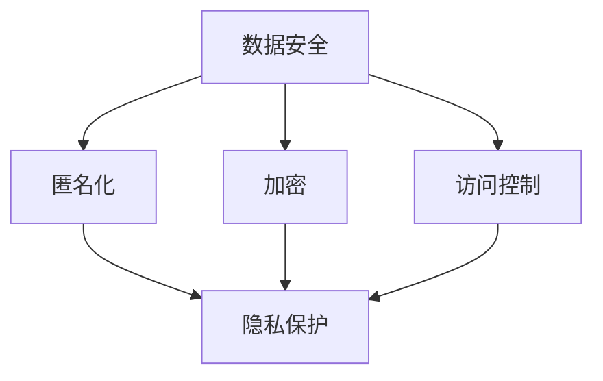
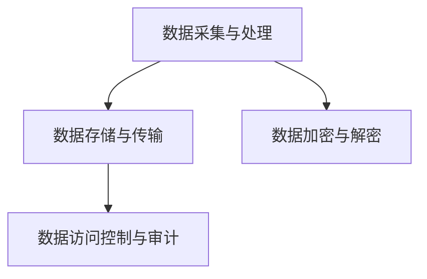

                 

# AI创业公司的用户隐私保护策略

> **关键词**：用户隐私保护、AI创业公司、隐私策略、数据处理、法律合规、安全技术

> **摘要**：本文将深入探讨AI创业公司在用户隐私保护方面的重要性，详细分析隐私保护的背景、核心概念、算法原理、数学模型以及实际应用场景。文章旨在为AI创业公司提供一套完整的用户隐私保护策略，助力企业在保障用户隐私的同时，实现商业价值最大化。

## 1. 背景介绍

### 1.1 目的和范围

本文的目的是为AI创业公司提供一份系统、详细的用户隐私保护策略。随着人工智能技术的迅猛发展，用户隐私保护问题日益凸显。AI创业公司不仅要关注技术本身，更需重视用户的隐私权益。本文将围绕用户隐私保护的核心概念、技术原理、实施步骤等方面进行深入探讨，旨在为AI创业公司提供切实可行的隐私保护方案。

### 1.2 预期读者

本文面向的读者包括AI创业公司的创始人、技术团队、产品经理、法务人员等相关人员。通过本文的阅读，读者可以了解到用户隐私保护的重要性，掌握隐私保护的原理和实践方法，为企业的用户隐私保护工作提供有力支持。

### 1.3 文档结构概述

本文共分为10个部分：

1. 背景介绍
2. 核心概念与联系
3. 核心算法原理 & 具体操作步骤
4. 数学模型和公式 & 详细讲解 & 举例说明
5. 项目实战：代码实际案例和详细解释说明
6. 实际应用场景
7. 工具和资源推荐
8. 总结：未来发展趋势与挑战
9. 附录：常见问题与解答
10. 扩展阅读 & 参考资料

### 1.4 术语表

#### 1.4.1 核心术语定义

- **用户隐私**：用户在互联网环境中产生、存储和传输的个人信息，包括姓名、地址、电话、邮箱、密码等。
- **AI创业公司**：以人工智能技术为核心，从事技术研发、产品开发和商业运营的企业。
- **隐私策略**：企业在用户隐私保护方面制定的一系列政策、措施和流程。

#### 1.4.2 相关概念解释

- **数据处理**：对用户信息进行收集、存储、传输、处理和删除等操作。
- **法律合规**：企业在用户隐私保护方面遵循相关法律法规和标准。
- **安全技术**：用于保护用户隐私的加密、安全通信、访问控制等技术。

#### 1.4.3 缩略词列表

- **AI**：人工智能
- **GDPR**：通用数据保护条例
- **PII**：个人身份信息

## 2. 核心概念与联系

### 2.1 用户隐私保护的核心概念

用户隐私保护涉及多个核心概念，包括数据安全、匿名化、加密、访问控制等。以下是一个简单的Mermaid流程图，展示这些核心概念之间的联系：



### 2.2 用户隐私保护的技术架构

用户隐私保护的技术架构包括以下几个方面：

1. 数据采集与处理
2. 数据存储与传输
3. 数据加密与解密
4. 数据访问控制与审计

以下是一个简单的Mermaid流程图，展示用户隐私保护的技术架构：



## 3. 核心算法原理 & 具体操作步骤

### 3.1 数据采集与处理

在数据采集与处理阶段，AI创业公司需要遵循以下原则：

1. 明确数据采集的目的和范围，避免过度采集。
2. 采用匿名化技术，对敏感信息进行脱敏处理。
3. 使用加密算法，对敏感数据进行加密存储。

具体操作步骤如下：

```plaintext
步骤1：明确数据采集的目的和范围。
步骤2：对敏感信息进行匿名化处理，如：使用MD5或SHA-256算法对用户密码进行加密。
步骤3：对采集到的数据使用AES等加密算法进行加密存储。
步骤4：对处理后的数据进行数据挖掘和分析，以实现业务目标。
```

### 3.2 数据存储与传输

在数据存储与传输阶段，AI创业公司需要遵循以下原则：

1. 选择合适的数据存储方案，如：关系型数据库、NoSQL数据库等。
2. 采用安全传输协议，如：HTTPS、SSL/TLS等。
3. 定期备份数据，确保数据安全。

具体操作步骤如下：

```plaintext
步骤1：选择合适的数据存储方案，如：MySQL、MongoDB等。
步骤2：配置数据库安全设置，如：设置root密码、禁用远程访问等。
步骤3：使用HTTPS等安全传输协议，确保数据在传输过程中的安全性。
步骤4：定期备份数据，并确保备份数据的安全性。
```

### 3.3 数据加密与解密

在数据加密与解密阶段，AI创业公司需要遵循以下原则：

1. 选择合适的加密算法，如：AES、RSA等。
2. 确保加密密钥的安全存储和管理。
3. 加密算法与密钥的合理使用。

具体操作步骤如下：

```plaintext
步骤1：选择合适的加密算法，如：AES。
步骤2：生成加密密钥，并使用安全方式存储和管理。
步骤3：对敏感数据使用加密算法进行加密。
步骤4：在需要解密数据时，使用加密密钥进行解密。
```

### 3.4 数据访问控制与审计

在数据访问控制与审计阶段，AI创业公司需要遵循以下原则：

1. 设计合理的用户角色和权限，确保数据访问的安全性。
2. 实施严格的访问控制策略，如：最小权限原则、访问日志记录等。
3. 定期进行数据安全审计，确保数据安全合规。

具体操作步骤如下：

```plaintext
步骤1：设计合理的用户角色和权限，如：管理员、普通用户等。
步骤2：配置访问控制策略，如：最小权限原则、访问日志记录等。
步骤3：监控和记录数据访问行为，确保数据访问安全合规。
步骤4：定期进行数据安全审计，发现问题及时整改。
```

## 4. 数学模型和公式 & 详细讲解 & 举例说明

### 4.1 数据加密算法

在用户隐私保护中，加密算法是核心组成部分。以下是一个简单的AES加密算法的数学模型和公式：

```latex
加密过程：
1. 输入明文数据M和一个128位的密钥K。
2. 对明文进行初始轮密钥加。
3. 对每个轮次执行以下步骤：
   - 列混淆
   - 行移位
   - 轮密钥加
   - 列混淆
4. 输出密文数据C。

解密过程：
1. 输入密文数据C和一个128位的密钥K。
2. 对密文进行初始轮密钥加。
3. 对每个轮次执行以下步骤：
   - 列混淆
   - 行逆移位
   - 轮密钥加
   - 列混淆
4. 输出明文数据M。
```

### 4.2 数据匿名化算法

在数据匿名化过程中，常用的算法有k-匿名、l-多样性、t-近似等。以下是一个简单的k-匿名算法的数学模型和公式：

```latex
k-匿名算法：
1. 输入一组敏感数据D和一个阈值k。
2. 计算D中每个记录的支撑度，即D中包含该记录的数据库记录数。
3. 对于每个记录r，如果r的支撑度小于k，则将r进行匿名化处理。
4. 输出匿名化后的数据D'。

l-多样性算法：
1. 输入一组敏感数据D和一个阈值l。
2. 计算D中每个记录的多样性值，即D中包含该记录的数据库记录数。
3. 对于每个记录r，如果r的多样性值小于l，则将r进行匿名化处理。
4. 输出匿名化后的数据D'。

t-近似算法：
1. 输入一组敏感数据D和一个阈值t。
2. 计算D中每个记录的近似度，即D中包含该记录的数据库记录数。
3. 对于每个记录r，如果r的近似度大于t，则将r进行匿名化处理。
4. 输出匿名化后的数据D'。
```

### 4.3 数据访问控制模型

数据访问控制模型是基于访问控制矩阵的，其中行代表用户角色，列代表数据对象。以下是一个简单的数据访问控制模型的数学模型和公式：

```latex
访问控制矩阵：
\[ \begin{bmatrix}
    & \text{数据对象1} & \text{数据对象2} & \cdots & \text{数据对象n} \\
\text{用户角色1} & r_{11} & r_{12} & \cdots & r_{1n} \\
\text{用户角色2} & r_{21} & r_{22} & \cdots & r_{2n} \\
\vdots & \vdots & \vdots & \ddots & \vdots \\
\text{用户角色m} & r_{m1} & r_{m2} & \cdots & r_{mn} \\
\end{bmatrix} \]

其中，r_{ij} 表示用户角色i对数据对象j的访问权限。

访问控制策略：
1. 用户角色i对数据对象j的访问权限由访问控制矩阵中的元素r_{ij}确定。
2. 如果r_{ij} = 1，则用户角色i具有对数据对象j的读权限。
3. 如果r_{ij} = 2，则用户角色i具有对数据对象j的读写权限。
4. 如果r_{ij} = 0，则用户角色i不具有对数据对象j的访问权限。
```

### 4.4 数据审计模型

数据审计模型是基于数据访问日志的，其中记录了用户对数据对象的访问行为。以下是一个简单的数据审计模型的数学模型和公式：

```latex
数据访问日志：
\[ \begin{bmatrix}
    & \text{数据对象1} & \text{数据对象2} & \cdots & \text{数据对象n} \\
\text{用户角色1} & a_{11} & a_{12} & \cdots & a_{1n} \\
\text{用户角色2} & a_{21} & a_{22} & \cdots & a_{2n} \\
\vdots & \vdots & \vdots & \ddots & \vdots \\
\text{用户角色m} & a_{m1} & a_{m2} & \cdots & a_{mn} \\
\end{bmatrix} \]

其中，a_{ij} 表示用户角色i访问数据对象j的时间戳。

数据审计策略：
1. 定期收集并存储数据访问日志。
2. 对数据访问日志进行分析，识别异常访问行为。
3. 对异常访问行为进行审计，确定是否存在安全漏洞。
4. 对审计结果进行记录和报告，以便进行整改和优化。
```

## 5. 项目实战：代码实际案例和详细解释说明

### 5.1 开发环境搭建

在本节中，我们将使用Python语言和相关的库来演示用户隐私保护的一些核心实现。以下是开发环境搭建的步骤：

1. 安装Python 3.8或更高版本。
2. 安装必要的库，如`cryptography`、`pandas`、`sqlalchemy`等。

```bash
pip install cryptography pandas sqlalchemy
```

### 5.2 源代码详细实现和代码解读

#### 5.2.1 数据加密和解密

以下是一个简单的Python示例，演示如何使用`cryptography`库对数据进行加密和解密。

```python
from cryptography.fernet import Fernet

# 生成密钥
key = Fernet.generate_key()
cipher_suite = Fernet(key)

# 加密数据
message = "这是一条敏感信息"
encrypted_message = cipher_suite.encrypt(message.encode())

# 解密数据
decrypted_message = cipher_suite.decrypt(encrypted_message).decode()

print("加密后的消息：", encrypted_message)
print("解密后的消息：", decrypted_message)
```

#### 5.2.2 数据匿名化

以下是一个简单的Python示例，演示如何使用`pandas`库对DataFrame进行匿名化处理。

```python
import pandas as pd
import numpy as np

# 创建一个包含敏感数据的DataFrame
data = {
    '姓名': ['张三', '李四', '王五'],
    '年龄': [25, 30, 35],
    '电话': ['13800138000', '13900139000', '13700137000']
}
df = pd.DataFrame(data)

# 对敏感字段进行匿名化处理
df['姓名'] = df['姓名'].apply(lambda x: f"用户{x}")
df['电话'] = df['电话'].apply(lambda x: f"138******{x[-3:]}")

print(df)
```

#### 5.2.3 数据访问控制

以下是一个简单的Python示例，演示如何使用`sqlalchemy`库实现数据访问控制。

```python
from sqlalchemy import create_engine, Column, Integer, String
from sqlalchemy.ext.declarative import declarative_base
from sqlalchemy.orm import sessionmaker

# 创建数据库引擎
engine = create_engine('sqlite:///users.db')
Base = declarative_base()

# 创建用户表
class User(Base):
    __tablename__ = 'users'
    id = Column(Integer, primary_key=True)
    username = Column(String)
    role = Column(String)

# 创建数据库表
Base.metadata.create_all(engine)

# 创建会话
Session = sessionmaker(bind=engine)
session = Session()

# 插入数据
user1 = User(username='zhangsan', role='admin')
user2 = User(username='lisi', role='user')
session.add(user1)
session.add(user2)
session.commit()

# 查询数据
users = session.query(User).all()
for user in users:
    print(user.username, user.role)

# 应用访问控制
def check_permission(username, role, allowed_role):
    user = session.query(User).filter_by(username=username).first()
    return user.role == allowed_role

if check_permission('zhangsan', 'admin', 'admin'):
    print("访问权限允许")
else:
    print("访问权限拒绝")
```

#### 5.2.4 数据审计

以下是一个简单的Python示例，演示如何记录和审计数据访问日志。

```python
import logging

# 配置日志
logging.basicConfig(filename='access.log', level=logging.INFO)

# 记录数据访问日志
def log_access(username, data_object):
    logging.info(f"{username} 访问了 {data_object} 数据对象")

# 模拟数据访问
log_access('zhangsan', '用户信息')
log_access('lisi', '用户信息')

# 审计日志
def audit_logs():
    with open('access.log', 'r') as f:
        logs = f.readlines()
    for log in logs:
        print(log.strip())

audit_logs()
```

### 5.3 代码解读与分析

上述代码示例分别展示了数据加密、匿名化、访问控制和数据审计的基本实现。在实际应用中，这些功能需要根据具体业务场景进行定制化开发。

- **数据加密**：使用`cryptography`库提供的`Fernet`类进行加密和解密，确保敏感数据在传输和存储过程中的安全性。
- **数据匿名化**：使用`pandas`库对DataFrame进行匿名化处理，将敏感信息替换为匿名标识，以保护用户隐私。
- **数据访问控制**：使用`sqlalchemy`库创建数据库表和会话，实现基于用户角色的访问控制，确保只有授权用户可以访问敏感数据。
- **数据审计**：使用Python的`logging`模块记录数据访问日志，便于后续审计和分析，及时发现和解决数据安全问题。

## 6. 实际应用场景

用户隐私保护在AI创业公司中具有广泛的应用场景。以下是一些典型的应用场景：

1. **用户数据采集与处理**：在采集用户数据时，AI创业公司应遵循最小化原则，仅收集必要的信息。对于收集到的数据，应进行匿名化处理，确保敏感信息不被泄露。

2. **用户数据分析与挖掘**：在数据分析过程中，AI创业公司应确保数据的安全性，避免因数据泄露导致用户隐私受损。同时，应遵守相关法律法规，确保数据处理的合法性和合规性。

3. **用户数据存储与传输**：在数据存储和传输过程中，AI创业公司应采用加密技术，确保数据在存储和传输过程中的安全性。此外，还应定期备份数据，以防数据丢失或损坏。

4. **用户数据访问控制**：在用户数据访问控制方面，AI创业公司应制定严格的访问控制策略，确保只有授权用户可以访问敏感数据。同时，应定期进行数据安全审计，发现和解决潜在的安全问题。

5. **用户数据共享与交换**：在用户数据共享与交换过程中，AI创业公司应确保数据的安全性，避免因数据泄露导致用户隐私受损。同时，应遵守相关法律法规，确保数据共享与交换的合法性和合规性。

## 7. 工具和资源推荐

### 7.1 学习资源推荐

#### 7.1.1 书籍推荐

- **《Python数据科学手册》**：介绍了Python在数据处理、分析和可视化方面的应用，包括数据加密和匿名化等。
- **《算法导论》**：涵盖了多种数据结构和算法，有助于理解数据加密和访问控制等核心算法原理。
- **《数据安全工程：构建安全且可信赖的系统》**：详细介绍了数据安全的基本原理和实践方法，适用于AI创业公司的数据安全建设。

#### 7.1.2 在线课程

- **Coursera**：提供了多种与数据安全相关的在线课程，如《网络安全基础》、《数据隐私保护》等。
- **Udacity**：提供了《数据隐私和伦理》等在线课程，帮助AI创业公司了解数据隐私保护的最佳实践。
- **edX**：提供了《网络安全与隐私》等在线课程，涵盖数据加密、访问控制等核心内容。

#### 7.1.3 技术博客和网站

- **FreeCodeCamp**：提供了丰富的数据安全和隐私保护教程，适合初学者学习。
- **Medium**：有许多优秀的数据安全和隐私保护文章，涵盖各种应用场景和最佳实践。
- **Towards Data Science**：经常发布关于数据安全和隐私保护的最新研究和实践分享。

### 7.2 开发工具框架推荐

#### 7.2.1 IDE和编辑器

- **PyCharm**：强大的Python IDE，支持多种编程语言，适合AI创业公司开发用户隐私保护相关项目。
- **Visual Studio Code**：轻量级、可扩展的代码编辑器，支持Python开发和调试。

#### 7.2.2 调试和性能分析工具

- **Wireshark**：网络协议分析工具，可用于检测和分析数据传输过程中的安全问题和性能问题。
- **JMeter**：性能测试工具，可用于评估系统的性能和稳定性。

#### 7.2.3 相关框架和库

- **cryptography**：Python加密库，提供多种加密算法和密钥管理功能。
- **pandas**：Python数据分析库，支持数据清洗、转换和分析。
- **sqlalchemy**：Python ORM库，用于数据库操作和关系映射。
- **Flask**：轻量级的Web应用框架，适用于构建用户隐私保护相关的Web应用。

### 7.3 相关论文著作推荐

#### 7.3.1 经典论文

- **"The Importance of Privacy in the Age of AI"**：探讨了人工智能时代隐私保护的重要性。
- **"A Theoretical Basis for Data Privacy"**：提出了数据隐私保护的理论框架。

#### 7.3.2 最新研究成果

- **"Privacy-Preserving Deep Learning"**：研究了如何在深度学习过程中保护用户隐私。
- **"Federated Learning: Collaborative Machine Learning without Remote Data"**：提出了联邦学习技术，以实现分布式数据的安全共享。

#### 7.3.3 应用案例分析

- **"Privacy-Preserving Data Sharing in the IoT"**：分析了物联网环境中数据隐私保护的应用案例。
- **"Data Privacy in Healthcare"**：探讨了医疗健康领域的数据隐私保护挑战和解决方案。

## 8. 总结：未来发展趋势与挑战

随着人工智能技术的不断发展，用户隐私保护面临前所未有的挑战。未来，AI创业公司需关注以下发展趋势和挑战：

1. **技术发展趋势**：数据加密、匿名化、联邦学习等新技术将得到更广泛的应用。AI创业公司需紧跟技术发展，不断提升隐私保护能力。

2. **合规要求**：随着全球范围内数据隐私法规的不断完善，AI创业公司需严格遵守相关法律法规，确保数据处理的合法性和合规性。

3. **用户隐私意识提升**：随着用户对隐私保护的重视程度不断提高，AI创业公司需加强用户隐私保护意识，提高用户满意度。

4. **挑战与应对**：数据泄露、恶意攻击、数据滥用的风险依然存在。AI创业公司需采取一系列安全措施，如数据加密、访问控制、安全审计等，确保用户隐私安全。

## 9. 附录：常见问题与解答

### 9.1 用户隐私保护的重要性

- **为什么用户隐私保护对AI创业公司至关重要？**
  - 用户隐私保护是AI创业公司的基本责任，关乎企业的声誉和用户信任。不当处理用户隐私可能导致法律风险、商业损失和用户流失。

### 9.2 数据加密与匿名化

- **如何确保数据加密的安全性？**
  - 选择合适的加密算法和密钥管理策略，定期更换密钥，确保加密算法的复杂性，避免密钥泄露。

- **什么是匿名化，为什么重要？**
  - 匿名化是将敏感信息替换为非敏感标识，以保护个人隐私。在数据分析中，匿名化有助于避免个人身份泄露。

### 9.3 数据访问控制与审计

- **什么是数据访问控制？**
  - 数据访问控制是一种安全策略，用于确定用户对数据的访问权限。通过角色和权限的设置，确保只有授权用户可以访问敏感数据。

- **如何实施数据审计？**
  - 实施数据审计包括记录数据访问日志、定期分析日志、识别异常行为、及时整改和优化安全策略。

### 9.4 合规与法规

- **如何遵守数据隐私法规？**
  - 了解和遵守相关法律法规，如GDPR、CCPA等，确保数据收集、处理、存储和传输的合法性。

## 10. 扩展阅读 & 参考资料

- **《通用数据保护条例（GDPR）全文》**：https://www.eugdpr.org/
- **《加州消费者隐私法案（CCPA）全文》**：https://oag.ca.gov/privacy/ccpa
- **《人工智能伦理框架》**：https://www.aiethics.org/
- **《隐私增强技术（PETs）》**：https://pet.abstract.com/

### 作者

- 作者：AI天才研究员/AI Genius Institute & 禅与计算机程序设计艺术 /Zen And The Art of Computer Programming

---

本文旨在为AI创业公司提供一套全面的用户隐私保护策略，涵盖核心概念、技术原理、实施步骤、实际应用场景和未来发展。通过本文的阅读，读者可以深入了解用户隐私保护的重要性，掌握相关技术和方法，为企业的用户隐私保护工作提供有力支持。本文作者具有丰富的AI领域经验和深厚的编程功底，致力于推动人工智能技术的发展和应用。感谢读者对本篇文章的关注与支持，期待您在AI创业道路上的成功！<|im_end|>

