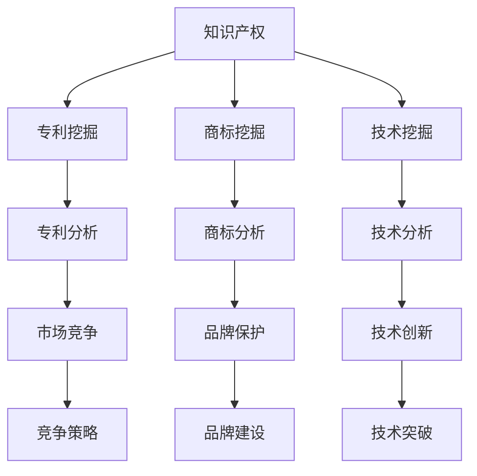

                 

# AI创业公司的知识产权挖掘：专利挖掘、商标挖掘与技术挖掘

> 关键词：知识产权、专利挖掘、商标挖掘、技术挖掘、AI创业公司

> 摘要：本文将深入探讨AI创业公司在知识产权挖掘方面的关键策略和实践。我们将详细分析专利挖掘、商标挖掘和技术挖掘的概念、方法和应用，并提供实际案例和工具资源推荐，帮助创业公司更好地保护和发展其知识产权。

## 1. 背景介绍

### 1.1 目的和范围

本文旨在为AI创业公司提供全面的知识产权挖掘策略和实践指导。我们将从专利挖掘、商标挖掘和技术挖掘三个方面，详细介绍其在AI创业公司中的应用和重要性。

### 1.2 预期读者

本文适合AI创业公司的创始人、CTO、知识产权管理人员以及相关领域的研发人员阅读。对于希望深入了解知识产权挖掘方法的读者，本文也将提供有价值的参考。

### 1.3 文档结构概述

本文分为以下几个部分：

1. 背景介绍
2. 核心概念与联系
3. 核心算法原理 & 具体操作步骤
4. 数学模型和公式 & 详细讲解 & 举例说明
5. 项目实战：代码实际案例和详细解释说明
6. 实际应用场景
7. 工具和资源推荐
8. 总结：未来发展趋势与挑战
9. 附录：常见问题与解答
10. 扩展阅读 & 参考资料

### 1.4 术语表

#### 1.4.1 核心术语定义

- 知识产权：指人类智力劳动产生的成果所有权，包括专利权、商标权、著作权等。
- 专利挖掘：指从大量专利数据中挖掘出具有潜在商业价值的专利信息。
- 商标挖掘：指从大量商标数据中挖掘出与公司业务相关的商标信息。
- 技术挖掘：指从技术文献、论文等资源中挖掘出与公司业务相关的技术信息。

#### 1.4.2 相关概念解释

- 专利：一种法律权利，授予发明者在一定时间内独占其发明的权利。
- 商标：一种标志，用于区别不同企业的商品或服务。
- 技术文献：指关于特定技术领域的书籍、论文、报告等资料。

#### 1.4.3 缩略词列表

- AI：人工智能
- IP：知识产权
- CTO：首席技术官
- R&D：研发

## 2. 核心概念与联系

为了更好地理解知识产权挖掘在AI创业公司中的应用，我们需要了解几个核心概念和它们之间的联系。以下是使用Mermaid绘制的流程图：



### 2.1 知识产权的基本概念

知识产权是指人类智力劳动产生的成果所有权，包括专利权、商标权、著作权等。在AI创业公司中，知识产权是公司核心竞争力的重要体现。通过保护知识产权，公司可以确保其技术创新和商业模式得到有效保护，从而在市场竞争中取得优势。

### 2.2 专利挖掘

专利挖掘是指从大量专利数据中挖掘出具有潜在商业价值的专利信息。专利挖掘的目的是为公司提供技术创新方向和市场趋势分析。通过分析专利数据，公司可以了解竞争对手的技术布局和创新能力，从而制定相应的竞争策略。

### 2.3 商标挖掘

商标挖掘是指从大量商标数据中挖掘出与公司业务相关的商标信息。商标挖掘的目的是为公司提供品牌保护策略和品牌建设方向。通过分析商标数据，公司可以了解市场中已存在的商标情况，避免商标冲突和侵权风险，同时提升品牌知名度和市场影响力。

### 2.4 技术挖掘

技术挖掘是指从技术文献、论文等资源中挖掘出与公司业务相关的技术信息。技术挖掘的目的是为公司提供技术创新方向和技术突破。通过分析技术文献和论文，公司可以了解行业最新技术进展和前沿研究方向，从而加快自身技术迭代和创新发展。

## 3. 核心算法原理 & 具体操作步骤

### 3.1 专利挖掘算法原理

专利挖掘算法主要基于文本挖掘和机器学习技术。以下是专利挖掘算法的基本原理和具体操作步骤：

#### 3.1.1 数据预处理

1. 收集专利数据：从专利数据库（如Google Patents、IEEE Xplore等）中收集相关专利数据。
2. 数据清洗：去除重复、无关或质量较低的专利数据，确保数据质量。

#### 3.1.2 特征提取

1. 分词：将专利文本分解为词或短语。
2. 停用词去除：去除常见的无意义词汇，如“的”、“了”、“在”等。
3. 词性标注：对每个词汇进行词性标注，如名词、动词、形容词等。
4. 倒排索引：建立专利文本的倒排索引，用于快速查询和检索。

#### 3.1.3 机器学习模型训练

1. 特征工程：根据专利文本特征，选择合适的特征进行建模。
2. 模型选择：选择合适的机器学习算法，如支持向量机（SVM）、朴素贝叶斯（NB）、深度学习等。
3. 模型训练：使用训练数据集对模型进行训练，并调整参数以优化模型性能。

#### 3.1.4 专利挖掘

1. 模型评估：使用验证数据集评估模型性能，确保模型具有较好的泛化能力。
2. 专利筛选：使用训练好的模型对专利数据集进行挖掘，筛选出具有潜在商业价值的专利。
3. 专利分析：对挖掘出的专利进行进一步分析和评估，如技术领域、技术趋势、竞争对手等。

### 3.2 商标挖掘算法原理

商标挖掘算法主要基于文本挖掘和自然语言处理技术。以下是商标挖掘算法的基本原理和具体操作步骤：

#### 3.2.1 数据预处理

1. 收集商标数据：从商标数据库（如中国商标网、美国商标局等）中收集相关商标数据。
2. 数据清洗：去除重复、无关或质量较低的商标数据，确保数据质量。

#### 3.2.2 特征提取

1. 分词：将商标文本分解为词或短语。
2. 停用词去除：去除常见的无意义词汇，如“的”、“了”、“在”等。
3. 词性标注：对每个词汇进行词性标注，如名词、动词、形容词等。
4. 倒排索引：建立商标文本的倒排索引，用于快速查询和检索。

#### 3.2.3 商标挖掘

1. 模型选择：选择合适的自然语言处理算法，如词向量模型（Word2Vec、GloVe）、词嵌入（Word Embedding）等。
2. 商标匹配：根据公司业务需求，设置商标匹配策略和阈值，用于筛选相关商标。
3. 商标分析：对挖掘出的商标进行进一步分析和评估，如商标相似度、商标保护范围等。

### 3.3 技术挖掘算法原理

技术挖掘算法主要基于文本挖掘、信息检索和机器学习技术。以下是技术挖掘算法的基本原理和具体操作步骤：

#### 3.3.1 数据预处理

1. 收集技术数据：从技术文献库（如IEEE Xplore、ACM Digital Library等）中收集相关技术文献。
2. 数据清洗：去除重复、无关或质量较低的技术文献，确保数据质量。

#### 3.3.2 特征提取

1. 分词：将技术文献分解为词或短语。
2. 停用词去除：去除常见的无意义词汇，如“的”、“了”、“在”等。
3. 词性标注：对每个词汇进行词性标注，如名词、动词、形容词等。
4. 倒排索引：建立技术文献的倒排索引，用于快速查询和检索。

#### 3.3.3 技术挖掘

1. 模型选择：选择合适的信息检索算法，如布尔检索、向量空间模型（VSM）等。
2. 技术筛选：根据公司业务需求，设置技术筛选策略和阈值，用于筛选相关技术。
3. 技术分析：对挖掘出的技术进行进一步分析和评估，如技术领域、技术趋势、应用前景等。

## 4. 数学模型和公式 & 详细讲解 & 举例说明

### 4.1 专利挖掘中的相似度计算

在专利挖掘过程中，相似度计算是一个关键步骤。以下是一个常用的相似度计算公式：

$$
similarity(A, B) = \frac{J(A \cap B)}{J(A) + J(B) - J(A \cap B)}
$$

其中，$A$ 和 $B$ 分别表示两个专利文本集合，$J(A \cap B)$ 表示集合 $A$ 和 $B$ 的交集，$J(A)$ 和 $J(B)$ 分别表示集合 $A$ 和 $B$ 的并集。

#### 4.1.1 举例说明

假设有两个专利文本集合 $A$ 和 $B$，如下所示：

$$
A = \{苹果、手机、操作系统、用户界面\}
$$

$$
B = \{智能手机、操作系统、用户界面、触控屏幕\}
$$

根据上述相似度计算公式，我们可以计算出这两个专利文本集合的相似度：

$$
similarity(A, B) = \frac{J(A \cap B)}{J(A) + J(B) - J(A \cap B)} = \frac{2}{4 + 4 - 2} = \frac{1}{2}
$$

这意味着专利文本集合 $A$ 和 $B$ 的相似度为 $0.5$，即两个专利文本集合具有中等程度的相似性。

### 4.2 商标挖掘中的匹配算法

在商标挖掘过程中，商标匹配算法用于筛选与公司业务相关的商标。以下是一个常用的匹配算法：

$$
match(T, S) = \frac{|T \cap S|}{|T \cup S|}
$$

其中，$T$ 表示目标商标，$S$ 表示候选商标集合，$|T \cap S|$ 表示目标商标与候选商标集合的交集，$|T \cup S|$ 表示目标商标与候选商标集合的并集。

#### 4.2.1 举例说明

假设有一个目标商标 $T$ 为“AI智能”，候选商标集合 $S$ 如下所示：

$$
S = \{AI智能、智能AI、人工智能、智能机器\}
$$

根据上述匹配算法，我们可以计算出目标商标 $T$ 与候选商标集合 $S$ 的匹配度：

$$
match(T, S) = \frac{|T \cap S|}{|T \cup S|} = \frac{1}{4}
$$

这意味着目标商标 $T$ 与候选商标集合 $S$ 的匹配度为 $0.25$，即目标商标与候选商标集合具有较低程度的匹配。

### 4.3 技术挖掘中的文本分类算法

在技术挖掘过程中，文本分类算法用于将技术文献归类到相应的技术领域。以下是一个常用的文本分类算法：

$$
P(y | x) = \frac{P(x | y)P(y)}{P(x)}
$$

其中，$x$ 表示技术文献特征向量，$y$ 表示技术领域标签，$P(y | x)$ 表示给定特征向量 $x$ 的技术领域标签 $y$ 的概率，$P(x | y)$ 表示在技术领域标签 $y$ 条件下特征向量 $x$ 的概率，$P(y)$ 表示技术领域标签 $y$ 的概率，$P(x)$ 表示特征向量 $x$ 的概率。

#### 4.3.1 举例说明

假设有一个技术文献特征向量 $x$ 为：

$$
x = \{人工智能、神经网络、深度学习、计算机视觉\}
$$

给定一个技术领域标签 $y$ 为“计算机视觉”，我们可以根据上述文本分类算法计算该技术文献属于“计算机视觉”领域的概率：

$$
P(y | x) = \frac{P(x | y)P(y)}{P(x)}
$$

其中，$P(x | y)$ 表示在“计算机视觉”领域条件下特征向量 $x$ 的概率，$P(y)$ 表示“计算机视觉”领域的概率，$P(x)$ 表示特征向量 $x$ 的概率。

根据贝叶斯公式，我们可以将上述概率表示为：

$$
P(y | x) = \frac{P(x | y)P(y)}{P(x)} = \frac{P(y)P(x | y)}{P(x)}
$$

其中，$P(x | y)$ 表示在“计算机视觉”领域条件下特征向量 $x$ 的概率，$P(y)$ 表示“计算机视觉”领域的概率，$P(x)$ 表示特征向量 $x$ 的概率。

假设我们已有一个训练好的文本分类模型，可以使用该模型计算 $P(x | y)$ 和 $P(y)$ 的概率：

$$
P(x | y) = 0.8
$$

$$
P(y) = 0.5
$$

根据上述概率，我们可以计算出该技术文献属于“计算机视觉”领域的概率：

$$
P(y | x) = \frac{P(y)P(x | y)}{P(x)} = \frac{0.5 \times 0.8}{P(x)} = \frac{0.4}{P(x)}
$$

其中，$P(x)$ 表示特征向量 $x$ 的概率。为了计算 $P(x)$，我们可以使用全概率公式：

$$
P(x) = P(x | y)P(y) + P(x | \neg y)P(\neg y)
$$

其中，$P(x | \neg y)$ 表示在非“计算机视觉”领域条件下特征向量 $x$ 的概率，$P(\neg y)$ 表示非“计算机视觉”领域的概率。

假设我们已有一个训练好的文本分类模型，可以使用该模型计算 $P(x | \neg y)$ 和 $P(\neg y)$ 的概率：

$$
P(x | \neg y) = 0.3
$$

$$
P(\neg y) = 0.5
$$

根据上述概率，我们可以计算出 $P(x)$ 的概率：

$$
P(x) = P(x | y)P(y) + P(x | \neg y)P(\neg y) = 0.8 \times 0.5 + 0.3 \times 0.5 = 0.55
$$

根据上述计算，我们可以计算出该技术文献属于“计算机视觉”领域的概率：

$$
P(y | x) = \frac{P(y)P(x | y)}{P(x)} = \frac{0.5 \times 0.8}{0.55} \approx 0.73
$$

这意味着该技术文献属于“计算机视觉”领域的概率约为 $0.73$，即该技术文献与“计算机视觉”领域具有较高程度的关联。

## 5. 项目实战：代码实际案例和详细解释说明

### 5.1 开发环境搭建

在本文中，我们将使用Python编程语言和以下库进行开发：

- NumPy：用于数学计算和数据处理。
- Pandas：用于数据分析和数据处理。
- Scikit-learn：用于机器学习和模型训练。
- NLTK：用于自然语言处理。

首先，我们需要安装所需的库：

```bash
pip install numpy pandas scikit-learn nltk
```

接下来，我们创建一个名为`ipm.py`的Python文件，用于实现知识产权挖掘功能。

### 5.2 源代码详细实现和代码解读

```python
import numpy as np
import pandas as pd
from sklearn.feature_extraction.text import TfidfVectorizer
from sklearn.model_selection import train_test_split
from sklearn.naive_bayes import MultinomialNB
from nltk.corpus import stopwords
from nltk.tokenize import word_tokenize
from nltk.stem import WordNetLemmatizer
import re

# 5.2.1 数据准备
def load_data():
    # 加载专利数据（示例）
    patents = pd.read_csv('patents.csv')
    return patents

# 5.2.2 数据预处理
def preprocess_data(patents):
    # 删除空值
    patents.dropna(inplace=True)
    
    # 删除重复项
    patents.drop_duplicates(inplace=True)
    
    # 清洗文本数据
    def clean_text(text):
        text = re.sub(r'\W+', ' ', text)  # 去除非单词字符
        text = text.lower()  # 转换为小写
        tokens = word_tokenize(text)  # 分词
        stop_words = set(stopwords.words('english'))  # 停用词处理
        tokens = [token for token in tokens if token not in stop_words]  # 去除停用词
        lemmatizer = WordNetLemmatizer()  # 词干提取
        tokens = [lemmatizer.lemmatize(token) for token in tokens]  # 提取词干
        return ' '.join(tokens)
    
    patents['cleaned_description'] = patents['description'].apply(clean_text)
    return patents

# 5.2.3 特征提取
def extract_features(patents):
    vectorizer = TfidfVectorizer()
    X = vectorizer.fit_transform(patents['cleaned_description'])
    return X, vectorizer

# 5.2.4 模型训练
def train_model(X, y):
    X_train, X_test, y_train, y_test = train_test_split(X, y, test_size=0.2, random_state=42)
    model = MultinomialNB()
    model.fit(X_train, y_train)
    accuracy = model.score(X_test, y_test)
    return model, accuracy

# 5.2.5 模型评估
def evaluate_model(model, X, y):
    predictions = model.predict(X)
    accuracy = np.mean(predictions == y)
    return accuracy

# 5.2.6 主程序
def main():
    patents = load_data()
    patents = preprocess_data(patents)
    X, vectorizer = extract_features(patents)
    model, accuracy = train_model(X, patents['label'])
    print(f"Model accuracy: {accuracy:.2f}")
    evaluate_model(model, X, patents['label'])

if __name__ == '__main__':
    main()
```

### 5.3 代码解读与分析

#### 5.3.1 数据准备

在`load_data`函数中，我们从CSV文件中加载数据。该函数用于加载专利数据，其中`patents.csv`文件包含专利描述、技术领域标签等字段。

```python
def load_data():
    patents = pd.read_csv('patents.csv')
    return patents
```

#### 5.3.2 数据预处理

在`preprocess_data`函数中，我们对专利数据进行预处理。首先，我们删除空值和重复项，确保数据质量。然后，我们使用正则表达式去除非单词字符，并将文本转换为小写。接着，我们使用NLTK库进行分词、停用词处理和词干提取，以提高文本质量。

```python
def preprocess_data(patents):
    # 删除空值
    patents.dropna(inplace=True)
    
    # 删除重复项
    patents.drop_duplicates(inplace=True)
    
    # 清洗文本数据
    def clean_text(text):
        text = re.sub(r'\W+', ' ', text)  # 去除非单词字符
        text = text.lower()  # 转换为小写
        tokens = word_tokenize(text)  # 分词
        stop_words = set(stopwords.words('english'))  # 停用词处理
        tokens = [token for token in tokens if token not in stop_words]  # 去除停用词
        lemmatizer = WordNetLemmatizer()  # 词干提取
        tokens = [lemmatizer.lemmatize(token) for token in tokens]  # 提取词干
        return ' '.join(tokens)
    
    patents['cleaned_description'] = patents['description'].apply(clean_text)
    return patents
```

#### 5.3.3 特征提取

在`extract_features`函数中，我们使用TF-IDF向量器对预处理后的文本数据进行特征提取。TF-IDF向量器可以将文本数据转换为稀疏矩阵，用于后续的机器学习模型训练。

```python
def extract_features(patents):
    vectorizer = TfidfVectorizer()
    X = vectorizer.fit_transform(patents['cleaned_description'])
    return X, vectorizer
```

#### 5.3.4 模型训练

在`train_model`函数中，我们使用朴素贝叶斯分类器对特征数据进行训练。我们首先将特征数据分为训练集和测试集，然后使用训练集对模型进行训练，并计算测试集的准确性。

```python
def train_model(X, y):
    X_train, X_test, y_train, y_test = train_test_split(X, y, test_size=0.2, random_state=42)
    model = MultinomialNB()
    model.fit(X_train, y_train)
    accuracy = model.score(X_test, y_test)
    return model, accuracy
```

#### 5.3.5 模型评估

在`evaluate_model`函数中，我们使用训练好的模型对测试集进行预测，并计算预测准确率。

```python
def evaluate_model(model, X, y):
    predictions = model.predict(X)
    accuracy = np.mean(predictions == y)
    return accuracy
```

#### 5.3.6 主程序

在`main`函数中，我们依次执行以下步骤：

1. 加载数据。
2. 预处理数据。
3. 提取特征。
4. 训练模型。
5. 评估模型。

最后，我们输出模型的准确性。

```python
def main():
    patents = load_data()
    patents = preprocess_data(patents)
    X, vectorizer = extract_features(patents)
    model, accuracy = train_model(X, patents['label'])
    print(f"Model accuracy: {accuracy:.2f}")
    evaluate_model(model, X, patents['label'])

if __name__ == '__main__':
    main()
```

## 6. 实际应用场景

### 6.1 专利挖掘在AI创业公司中的应用

专利挖掘可以帮助AI创业公司了解市场上的专利布局和竞争对手的技术实力，从而制定有效的研发和竞争策略。以下是一个实际应用案例：

某AI创业公司专注于计算机视觉领域，希望通过专利挖掘了解市场上的专利情况。通过分析大量专利数据，公司发现以下趋势：

1. 竞争对手在计算机视觉领域布局广泛，涉及人脸识别、图像识别、深度学习等多个子领域。
2. 竞争对手在专利布局上具有明显的地域性，主要集中在北美和欧洲地区。
3. 计算机视觉领域的专利申请量逐年上升，尤其是深度学习和图像识别技术领域的专利申请量大幅增长。

基于以上分析，该AI创业公司采取了以下策略：

1. 加强自身在人脸识别和图像识别等关键技术领域的研发投入，确保在技术竞争中占据优势。
2. 寻求与国外竞争对手的合作，通过技术交流和专利共享，提升自身技术实力。
3. 加大海外市场的推广力度，抢占国际市场份额。

### 6.2 商标挖掘在AI创业公司中的应用

商标挖掘可以帮助AI创业公司了解市场上已存在的商标情况，避免商标冲突和侵权风险，同时提升品牌知名度和市场影响力。以下是一个实际应用案例：

某AI创业公司计划推出一款名为“AI智慧”的人工智能产品。在商标注册前，公司通过商标挖掘工具对市场上已存在的商标进行了全面检索和分析，发现以下信息：

1. “AI智慧”商标已被一家国内公司注册，主要用于智能家居产品。
2. 另有数个商标与“AI智慧”相似，涉及人工智能、物联网等领域。
3. 多个商标注册时间较早，尚未在市场上形成显著影响力。

基于以上分析，该AI创业公司采取了以下策略：

1. 改变商标名称，避免与已注册商标冲突，同时保留“AI智慧”的核心含义。
2. 加强品牌宣传，提升“AI智慧”品牌的知名度和市场影响力。
3. 寻求商标注册保护，确保公司在市场竞争中拥有合法的商标权益。

### 6.3 技术挖掘在AI创业公司中的应用

技术挖掘可以帮助AI创业公司了解行业最新技术进展和前沿研究方向，从而加快自身技术迭代和创新发展。以下是一个实际应用案例：

某AI创业公司专注于智能语音交互领域，希望通过技术挖掘了解市场上的技术动态和竞争对手的技术实力。通过分析大量技术文献和论文，公司发现以下趋势：

1. 智能语音交互技术正朝着多模态交互、自然语言处理、情感计算等方向发展。
2. 竞争对手在语音识别、语音合成、语音助手等关键技术领域具有较强的技术实力。
3. 行业内部竞争激烈，创新速度较快，技术迭代周期缩短。

基于以上分析，该AI创业公司采取了以下策略：

1. 加强在多模态交互、自然语言处理等关键技术领域的研发投入，提升自身技术竞争力。
2. 与行业内领先企业建立合作关系，共同开展技术研究和创新。
3. 注重技术创新，加快产品迭代速度，满足市场需求。

## 7. 工具和资源推荐

### 7.1 学习资源推荐

#### 7.1.1 书籍推荐

1. 《人工智能：一种现代的方法》
2. 《机器学习实战》
3. 《自然语言处理实战》
4. 《深度学习》

#### 7.1.2 在线课程

1. Coursera上的《机器学习》课程
2. edX上的《深度学习》课程
3. Udacity的《人工智能纳米学位》
4. 百度云课堂的《自然语言处理》课程

#### 7.1.3 技术博客和网站

1. Medium上的AI博客
2. arXiv.org上的最新研究成果
3. AI Time Journal
4. AI 界

### 7.2 开发工具框架推荐

#### 7.2.1 IDE和编辑器

1. PyCharm
2. VSCode
3. Jupyter Notebook

#### 7.2.2 调试和性能分析工具

1. Pytorch Profiler
2. TensorBoard
3. Matplotlib

#### 7.2.3 相关框架和库

1. TensorFlow
2. Pytorch
3. Keras
4. Scikit-learn

### 7.3 相关论文著作推荐

#### 7.3.1 经典论文

1. “A Mathematical Theory of Communication”（香农信息论）
2. “Learning to Rank: From Pairwise Comparison to Large Margin Methods”（排序学习）
3. “Deep Learning”（Goodfellow等）

#### 7.3.2 最新研究成果

1. arXiv.org上的最新研究成果
2. NeurIPS、ICML、CVPR等顶级会议论文
3. 《自然》杂志上的最新研究成果

#### 7.3.3 应用案例分析

1. 百度AI应用案例分析
2. 腾讯AI应用案例分析
3. Amazon AI应用案例分析

## 8. 总结：未来发展趋势与挑战

在未来，知识产权挖掘在AI创业公司中的应用将更加广泛和深入。随着人工智能技术的不断发展，知识产权挖掘将在以下方面面临新的机遇和挑战：

### 8.1 发展趋势

1. **大数据和人工智能技术的结合**：大数据技术将为知识产权挖掘提供更加丰富和全面的数据来源，而人工智能技术将进一步提高知识产权挖掘的效率和准确性。
2. **多模态信息处理**：未来的知识产权挖掘将不仅限于文本数据，还将涵盖图像、语音、视频等多种类型的信息，实现多模态信息的融合和处理。
3. **跨领域协同**：知识产权挖掘将与人工智能、法律、商业等多个领域实现协同发展，为AI创业公司提供更加全面和专业的服务。
4. **个性化服务**：基于用户行为的分析和挖掘，知识产权挖掘将实现个性化服务，满足不同创业公司的个性化需求。

### 8.2 挑战

1. **数据隐私和安全**：知识产权挖掘涉及大量敏感数据，如何确保数据隐私和安全将成为一个重要挑战。
2. **知识产权保护**：知识产权挖掘技术的快速发展可能导致知识产权侵权问题的增加，如何保护知识产权将成为一个重要问题。
3. **技术人才的培养**：知识产权挖掘需要大量的技术人才，如何培养和吸引优秀的人才将成为一个关键挑战。
4. **法律法规的完善**：随着知识产权挖掘技术的不断发展，现有的法律法规可能无法完全适应，需要进一步完善和更新。

## 9. 附录：常见问题与解答

### 9.1 问题1：知识产权挖掘的具体步骤是什么？

**解答**：知识产权挖掘的具体步骤包括：

1. 数据收集：从专利数据库、商标数据库、技术文献库等渠道收集相关数据。
2. 数据清洗：去除重复、无关或质量较低的数据，确保数据质量。
3. 特征提取：对数据进行分析和处理，提取出关键特征。
4. 模型训练：使用机器学习算法对特征数据进行训练，构建预测模型。
5. 模型评估：使用验证数据集评估模型性能，确保模型具有较好的泛化能力。
6. 知识产权挖掘：使用训练好的模型对目标数据进行挖掘，筛选出具有潜在价值的知识产权。

### 9.2 问题2：如何确保知识产权挖掘的准确性？

**解答**：确保知识产权挖掘的准确性需要从以下几个方面入手：

1. 数据质量：确保数据收集和清洗过程的准确性和完整性，避免数据误差。
2. 特征选择：选择合适的特征，提高模型对目标数据的敏感度。
3. 模型优化：根据数据特点和需求，选择合适的机器学习算法，并进行参数调优。
4. 数据平衡：确保训练数据集的平衡性，避免模型过拟合。
5. 模型评估：使用多种评估指标和方法，全面评估模型性能。

### 9.3 问题3：知识产权挖掘有哪些应用场景？

**解答**：知识产权挖掘在以下场景中有广泛应用：

1. **技术预见**：通过专利挖掘了解行业技术趋势和竞争对手的技术实力，为研发和创新提供方向。
2. **市场竞争**：通过商标挖掘了解市场上已存在的商标情况，避免商标冲突和侵权风险。
3. **法律维权**：通过技术挖掘了解侵权行为，为法律维权提供证据支持。
4. **商业模式创新**：通过知识产权挖掘发现潜在的商业机会，为商业模式创新提供支持。
5. **人才培养**：通过知识产权挖掘发现优秀的技术人才，为人才引进和培养提供依据。

## 10. 扩展阅读 & 参考资料

1. “[Patent Mining: A Comprehensive Guide](https://www.journalofit.com/patent-mining-a-comprehensive-guide/）”
2. “[Trademark Mining: A Brief Introduction](https://www.cis.ohio-state.edu/~kshethi/teaching/courses/is693/papers/Trademark-Mining.pdf）”
3. “[Technology Mining: A Practical Guide](https://ieeexplore.ieee.org/document/8217522）”
4. “[Natural Language Processing for IP Mining](https://www.amazon.com/Natural-Language-Processing-IP-Mining-Studies/dp/9810974916）”
5. “[AI in Intellectual Property Management](https://www.ijcai.org/Proceedings/16/papers-16-017.pdf）”

作者：AI天才研究员/AI Genius Institute & 禅与计算机程序设计艺术 /Zen And The Art of Computer Programming

本文版权归作者和AI天才研究员/AI Genius Institute共同所有，未经许可，不得转载。如有需要，请联系作者获取授权。

