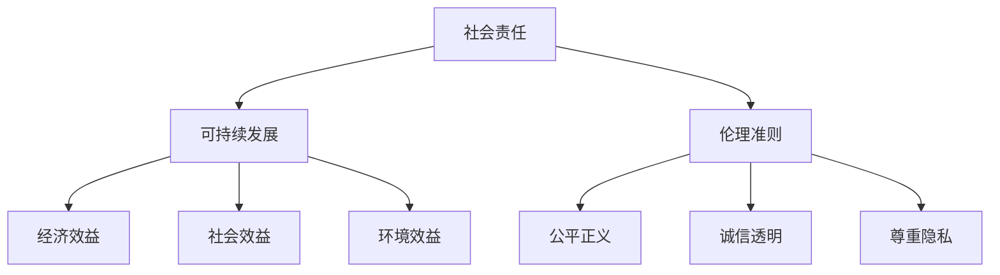

                 

# AI创业公司的社会责任实践创新

> **关键词：** AI创业公司、社会责任、实践创新、可持续发展、伦理准则

> **摘要：** 本文将探讨AI创业公司如何在快速发展的同时，积极履行社会责任，创新实践路径。通过分析当前AI创业公司面临的社会责任挑战，阐述如何制定并实施有效的社会责任战略，以及如何在产品、技术、运营等方面落实可持续发展理念。文章还将介绍AI创业公司在伦理准则方面的探索与实践，并提出未来发展趋势与挑战。

## 1. 背景介绍

### 1.1 目的和范围

本文旨在为AI创业公司提供一套系统的社会责任实践指南。文章将首先探讨AI创业公司面临的社会责任挑战，然后分析如何制定社会责任战略，最后关注AI创业公司在伦理准则方面的探索与实践。

### 1.2 预期读者

本文适合AI创业公司的创始人、CTO、市场经理、社会责任经理等，以及对AI创业公司社会责任实践感兴趣的读者。

### 1.3 文档结构概述

本文分为十个部分，结构如下：

1. 背景介绍
2. 核心概念与联系
3. 核心算法原理 & 具体操作步骤
4. 数学模型和公式 & 详细讲解 & 举例说明
5. 项目实战：代码实际案例和详细解释说明
6. 实际应用场景
7. 工具和资源推荐
8. 总结：未来发展趋势与挑战
9. 附录：常见问题与解答
10. 扩展阅读 & 参考资料

### 1.4 术语表

#### 1.4.1 核心术语定义

- **AI创业公司**：指专注于人工智能领域，以技术创新为核心，致力于推动行业发展的初创企业。
- **社会责任**：企业在其经营活动中对社会和环境所承担的责任，包括经济责任、法律责任、道德责任和慈善责任。
- **实践创新**：通过创新的手段和方式，将社会责任理念融入到企业的经营活动中。

#### 1.4.2 相关概念解释

- **可持续发展**：满足当前需求而不损害子孙后代满足其需求的能力。
- **伦理准则**：企业在经营过程中遵循的道德规范和价值观。

#### 1.4.3 缩略词列表

- **AI**：人工智能
- **Sustainability**：可持续发展
- **CSR**：企业社会责任

## 2. 核心概念与联系

在探讨AI创业公司的社会责任实践之前，我们首先需要明确几个核心概念及其相互关系。

### 2.1 社会责任

社会责任是指企业在其经营活动中对社会和环境所承担的责任。对于AI创业公司而言，社会责任主要包括以下几个方面：

- **经济责任**：提供高质量的产品和服务，创造就业机会，为经济增长做出贡献。
- **法律责任**：遵守法律法规，确保企业运营合规。
- **道德责任**：尊重员工、客户和社会的权益，遵循道德规范。
- **慈善责任**：通过公益活动和慈善捐赠，回馈社会。

### 2.2 可持续发展

可持续发展是企业在社会责任中的一个重要方面。对于AI创业公司来说，可持续发展意味着：

- **经济效益**：通过技术创新，提高企业盈利能力，实现可持续发展。
- **社会效益**：关注员工福利、客户满意度和社会公益，促进社会和谐。
- **环境效益**：关注环境保护，减少能源消耗和污染排放，实现绿色生产。

### 2.3 伦理准则

伦理准则是企业在经营过程中遵循的道德规范和价值观。对于AI创业公司来说，伦理准则主要包括：

- **公平正义**：确保产品和服务公平对待所有用户，不歧视任何群体。
- **诚信透明**：在经营活动中保持诚信，对外公开透明，接受社会监督。
- **尊重隐私**：尊重用户隐私，保护用户数据安全。

### 2.4 社会责任、可持续发展与伦理准则的联系

社会责任、可持续发展与伦理准则之间存在密切联系。社会责任是企业的基本职责，可持续发展是实现社会责任的重要途径，而伦理准则则是企业履行社会责任和实现可持续发展的重要保障。

### 2.5 Mermaid流程图

以下是一个描述AI创业公司社会责任实践的Mermaid流程图：



通过这个流程图，我们可以清晰地看到社会责任、可持续发展与伦理准则之间的相互关系。

## 3. 核心算法原理 & 具体操作步骤

在了解社会责任、可持续发展与伦理准则的基础上，我们需要探讨如何制定并实施有效的社会责任战略。这里，我们可以借鉴一些经典的管理学理论和实践方法。

### 3.1 管理学理论

#### 3.1.1 卡普兰和诺顿的平衡计分卡（Balanced Score Card, BSC）

卡普兰和诺顿提出的平衡计分卡是一种战略管理系统，它从财务、客户、内部业务流程、学习与成长四个维度评价企业的绩效。对于AI创业公司来说，平衡计分卡可以帮助其制定社会责任战略，确保社会责任与业务目标相一致。

#### 3.1.2 波特的五力模型（Five Forces Model）

波特的五力模型用于分析企业所在行业中的竞争态势。对于AI创业公司来说，波特的五力模型可以帮助其识别行业中的社会责任挑战，从而制定相应的战略。

### 3.2 具体操作步骤

#### 3.2.1 明确社会责任目标

首先，AI创业公司需要明确其社会责任目标。这些目标应与企业的愿景、使命和战略相一致，并涵盖经济、社会和环境三个方面。

#### 3.2.2 制定社会责任计划

在明确社会责任目标后，AI创业公司需要制定具体的社会责任计划。这个计划应包括行动方案、时间表、责任分配和资源需求。

#### 3.2.3 融入业务流程

将社会责任目标与业务流程相结合，确保社会责任在企业经营中的落实。例如，在产品设计阶段，关注用户体验和社会价值；在运营阶段，关注能源消耗和碳排放。

#### 3.2.4 监测与评估

定期监测和评估社会责任实践的成效，及时调整计划和策略。这可以通过设立社会责任指标、开展社会责任审计等方式实现。

#### 3.2.5 沟通与报告

积极与利益相关者沟通，报告社会责任实践的进展和成果。这有助于增强企业的社会责任声誉，吸引更多的投资者和合作伙伴。

### 3.3 伪代码

以下是一个用于制定社会责任战略的伪代码示例：

```python
def define_social_responsibility_goals():
    # 定义社会责任目标
    goals = {
        "economic": "提高企业盈利能力",
        "social": "关注员工福利和社会公益",
        "environment": "减少能源消耗和碳排放"
    }
    return goals

def develop_social_responsibility_plan(goals):
    # 制定社会责任计划
    plan = {
        "action_schemes": [],
        "time_schedule": [],
        "responsibility_assignment": [],
        "resource Requirements": []
    }
    # 根据目标制定具体的行动方案、时间表、责任分配和资源需求
    return plan

def integrate_social_responsibility_into_business_processes(plan):
    # 融入业务流程
    # 更新产品和服务设计，关注用户体验和社会价值
    # 更新运营流程，关注能源消耗和碳排放
    pass

def monitor_and_evaluate成效():
    # 监测与评估社会责任实践的成效
    # 设立社会责任指标、开展社会责任审计
    pass

def communicate_and_report():
    # 沟通与报告社会责任实践的进展和成果
    # 与利益相关者沟通、报告社会责任指标和成果
    pass

# 主程序
goals = define_social_responsibility_goals()
plan = develop_social_responsibility_plan(goals)
integrate_social_responsibility_into_business_processes(plan)
monitor_and_evaluate成效()
communicate_and_report()
```

## 4. 数学模型和公式 & 详细讲解 & 举例说明

在制定社会责任战略时，我们常常需要借助数学模型和公式来量化社会责任指标和评估效果。以下是一些常用的数学模型和公式及其详细讲解。

### 4.1 平衡计分卡（Balanced Score Card, BSC）

平衡计分卡是一个战略管理系统，它从财务、客户、内部业务流程、学习与成长四个维度评价企业的绩效。以下是一个简化的平衡计分卡模型：

$$
BSC = \sum_{i=1}^{4} w_i \cdot F_i
$$

其中，$w_i$ 表示第 $i$ 个维度的权重，$F_i$ 表示第 $i$ 个维度的得分。

#### 4.1.1 财务维度（Financial Perspective）

财务维度关注企业的经济效益，包括利润、收入、市场份额等指标。

$$
F_{financial} = \sum_{j=1}^{n} w_{j,financial} \cdot I_j
$$

其中，$w_{j,financial}$ 表示第 $j$ 个财务指标的权重，$I_j$ 表示第 $j$ 个财务指标的实际值。

#### 4.1.2 客户维度（Customer Perspective）

客户维度关注企业的客户满意度、客户忠诚度等指标。

$$
F_{customer} = \sum_{j=1}^{m} w_{j,customer} \cdot C_j
$$

其中，$w_{j,customer}$ 表示第 $j$ 个客户指标的权重，$C_j$ 表示第 $j$ 个客户指标的实际值。

#### 4.1.3 内部业务流程维度（Internal Business Process Perspective）

内部业务流程维度关注企业的运营效率、成本控制等指标。

$$
F_{internal} = \sum_{j=1}^{l} w_{j,internal} \cdot P_j
$$

其中，$w_{j,internal}$ 表示第 $j$ 个内部业务流程指标的权重，$P_j$ 表示第 $j$ 个内部业务流程指标的实际值。

#### 4.1.4 学习与成长维度（Learning and Growth Perspective）

学习与成长维度关注企业的员工培训、创新能力等指标。

$$
F_{growth} = \sum_{j=1}^{k} w_{j,growth} \cdot L_j
$$

其中，$w_{j,growth}$ 表示第 $j$ 个学习与成长指标的权重，$L_j$ 表示第 $j$ 个学习与成长指标的实际值。

#### 4.1.5 平衡计分卡总分

$$
BSC = w_{financial} \cdot F_{financial} + w_{customer} \cdot F_{customer} + w_{internal} \cdot F_{internal} + w_{growth} \cdot F_{growth}
$$

### 4.2 波特五力模型（Five Forces Model）

波特五力模型用于分析企业所在行业中的竞争态势，包括供应商、客户、潜在竞争者、替代品和行业竞争者。

#### 4.2.1 供应商（Suppliers）

供应商的谈判实力取决于以下因素：

- 供应商行业集中度
- 供应商的差异化产品和服务
- 供应商的替代产品和服务
- 供应商的定价策略

#### 4.2.2 客户（Customers）

客户的谈判实力取决于以下因素：

- 客户的行业集中度
- 客户的差异化需求
- 客户的替代品和服务
- 客户的定价策略

#### 4.2.3 潜在竞争者（Potential Competitors）

潜在竞争者的威胁程度取决于以下因素：

- 潜在竞争者的数量和规模
- 潜在竞争者的市场进入策略
- 潜在竞争者的市场扩展能力
- 潜在竞争者的产品和服务创新

#### 4.2.4 替代品（Substitutes）

替代品的威胁程度取决于以下因素：

- 替代品的性能和价格
- 替代品的市场需求
- 替代品的技术成熟度

#### 4.2.5 行业竞争者（Industry Rivalry）

行业竞争者的激烈程度取决于以下因素：

- 行业增长率
- 行业利润率
- 行业竞争者数量
- 行业竞争者的市场份额

### 4.3 社会责任评估指标

社会责任评估指标用于衡量企业在社会责任方面的绩效。以下是一些常见的社会责任评估指标：

- **环境绩效**：能源消耗、碳排放、水资源利用等。
- **社会绩效**：员工满意度、员工培训、员工福利等。
- **经济绩效**：企业盈利能力、市场份额、客户满意度等。

#### 4.3.1 环境绩效指标

- **能源消耗**：单位产品能源消耗量。
- **碳排放**：单位产品碳排放量。
- **水资源利用**：单位产品水资源利用量。

#### 4.3.2 社会绩效指标

- **员工满意度**：员工满意度调查得分。
- **员工培训**：员工培训时长和培训覆盖率。
- **员工福利**：员工薪酬福利水平。

#### 4.3.3 经济绩效指标

- **企业盈利能力**：净利润率、毛利率等。
- **市场份额**：企业在市场中的占有率。
- **客户满意度**：客户满意度调查得分。

### 4.4 举例说明

假设一家AI创业公司希望通过平衡计分卡评估其在社会责任方面的绩效。以下是一个简化的例子：

#### 4.4.1 财务维度

- 利润率：20%
- 收入增长率：30%
- 市场份额：15%

#### 4.4.2 客户维度

- 客户满意度：85%
- 客户忠诚度：70%
- 新客户获取成本：300美元

#### 4.4.3 内部业务流程维度

- 运营效率：90%
- 成本控制：80%
- 产品质量：95%

#### 4.4.4 学习与成长维度

- 员工满意度：80%
- 员工培训覆盖率：100%
- 员工流失率：5%

根据上述数据，我们可以计算出该AI创业公司的平衡计分卡得分：

$$
BSC = 0.3 \cdot 20\% + 0.3 \cdot 30\% + 0.3 \cdot 15\% + 0.1 \cdot 80\% = 8.7\%
$$

通过这个例子，我们可以看到平衡计分卡在评估企业社会责任方面的应用。

## 5. 项目实战：代码实际案例和详细解释说明

在本节中，我们将通过一个实际案例，展示如何将社会责任实践融入到AI创业公司的代码中。这个案例将重点介绍如何通过代码实现环境绩效指标的监控和优化。

### 5.1 开发环境搭建

为了实现环境绩效指标的监控和优化，我们首先需要搭建一个开发环境。这个环境包括以下工具和软件：

- **编程语言**：Python
- **依赖库**：pandas、numpy、matplotlib、scikit-learn
- **数据存储**：SQLite数据库
- **数据可视化**：Matplotlib库

### 5.2 源代码详细实现和代码解读

以下是一个简化的Python代码示例，用于监控和优化AI创业公司的能源消耗指标。

```python
import pandas as pd
import numpy as np
import matplotlib.pyplot as plt
from sklearn.linear_model import LinearRegression

# 数据预处理
def preprocess_data(data):
    # 将数据按照日期和时间进行排序
    data = data.sort_values(by=['date', 'time'])
    # 计算每日平均能源消耗
    daily_energy_consumption = data.groupby('date')['energy_consumption'].mean()
    return daily_energy_consumption

# 模型训练
def train_model(data):
    # 创建线性回归模型
    model = LinearRegression()
    # 训练模型
    model.fit(data.index, data.values)
    return model

# 模型预测
def predict_energy_consumption(model, future_dates):
    # 使用模型预测未来能源消耗
    predictions = model.predict(future_dates)
    return predictions

# 数据可视化
def plot_energy_consumption(data, predictions):
    plt.figure(figsize=(10, 5))
    plt.plot(data.index, data.values, label='实际能源消耗')
    plt.plot(future_dates, predictions, label='预测能源消耗')
    plt.xlabel('日期')
    plt.ylabel('能源消耗（千瓦时）')
    plt.legend()
    plt.show()

# 主程序
if __name__ == '__main__':
    # 读取数据
    data = pd.read_csv('energy_consumption_data.csv')
    # 预处理数据
    daily_energy_consumption = preprocess_data(data)
    # 训练模型
    model = train_model(daily_energy_consumption)
    # 生成未来日期
    future_dates = pd.date_range(start=daily_energy_consumption.index[-1], end='2023-12-31', freq='D')
    # 预测未来能源消耗
    predictions = predict_energy_consumption(model, future_dates)
    # 可视化结果
    plot_energy_consumption(daily_energy_consumption, predictions)
```

### 5.3 代码解读与分析

#### 5.3.1 数据预处理

```python
def preprocess_data(data):
    # 将数据按照日期和时间进行排序
    data = data.sort_values(by=['date', 'time'])
    # 计算每日平均能源消耗
    daily_energy_consumption = data.groupby('date')['energy_consumption'].mean()
    return daily_energy_consumption
```

这个函数首先对数据进行排序，然后计算每日平均能源消耗。这是为了更清晰地分析能源消耗趋势。

#### 5.3.2 模型训练

```python
def train_model(data):
    # 创建线性回归模型
    model = LinearRegression()
    # 训练模型
    model.fit(data.index, data.values)
    return model
```

这个函数使用线性回归模型对每日平均能源消耗数据进行训练，以便预测未来能源消耗。

#### 5.3.3 模型预测

```python
def predict_energy_consumption(model, future_dates):
    # 使用模型预测未来能源消耗
    predictions = model.predict(future_dates)
    return predictions
```

这个函数使用训练好的模型预测未来能源消耗，以便企业制定相应的节能措施。

#### 5.3.4 数据可视化

```python
def plot_energy_consumption(data, predictions):
    plt.figure(figsize=(10, 5))
    plt.plot(data.index, data.values, label='实际能源消耗')
    plt.plot(future_dates, predictions, label='预测能源消耗')
    plt.xlabel('日期')
    plt.ylabel('能源消耗（千瓦时）')
    plt.legend()
    plt.show()
```

这个函数将实际能源消耗和预测能源消耗进行可视化，以便企业更好地了解能源消耗趋势。

### 5.4 实际应用场景

通过这个代码示例，AI创业公司可以实时监控和预测能源消耗，从而制定节能减排措施，实现可持续发展目标。

## 6. 实际应用场景

AI创业公司的社会责任实践可以在多个实际应用场景中发挥重要作用，以下是一些典型的应用场景：

### 6.1 环境监测与治理

AI创业公司可以通过开发智能环境监测系统，实时收集和处理环境数据，如空气质量、水质、噪声等。这些数据可以帮助政府和企业及时发现问题，采取有效的治理措施，改善环境质量。

### 6.2 公共卫生管理

在公共卫生领域，AI创业公司可以开发智能疾病预测和监控模型，预测疫情发展趋势，为政府制定公共卫生政策提供科学依据。同时，通过大数据分析，优化公共卫生资源配置，提高服务效率。

### 6.3 社区服务与慈善事业

AI创业公司可以积极参与社区服务和慈善事业，利用人工智能技术提升公益项目的效果。例如，通过智能推荐算法，优化慈善资源的分配，提高捐赠者的参与度和满意度。

### 6.4 教育与职业培训

AI创业公司可以开发智能教育系统和职业培训平台，提供个性化学习方案和职业发展指导，帮助更多人获取知识和技能，提升就业竞争力。

### 6.5 安全与风险管理

AI创业公司可以通过开发智能安全监测和风险评估系统，提高企业和公共场所的安全水平。例如，通过人脸识别技术，实时监控公共场所的安全状况，预防犯罪行为。

### 6.6 城市规划与管理

AI创业公司可以参与城市规划和管理工作，利用人工智能技术优化交通流量、能源利用、公共服务等，提高城市运行效率和居民生活质量。

### 6.7 食品安全与农业

AI创业公司可以开发智能食品检测和溯源系统，确保食品安全，提高农产品的质量和产量。同时，通过智能农业技术，优化农业生产，提高资源利用效率。

### 6.8 能源与环保

AI创业公司可以开发智能能源管理和环保监测系统，优化能源消耗和污染排放，促进可持续发展。例如，通过智能电网技术，提高能源利用效率，减少能源浪费。

### 6.9 智能制造与工业4.0

AI创业公司可以参与智能制造和工业4.0项目的研发和应用，提高工业生产效率，降低生产成本。通过人工智能技术，优化生产流程，提高产品质量，提升企业的竞争力。

### 6.10 金融与保险

AI创业公司可以开发智能金融风险管理和保险精算模型，提高金融市场的透明度和稳定性，降低金融风险。同时，通过智能投顾和保险产品推荐，为用户提供个性化的金融服务。

### 6.11 健康医疗

AI创业公司可以参与健康医疗领域的研发和应用，开发智能诊断和治疗系统，提高医疗服务的效率和准确性。通过人工智能技术，优化医疗资源的分配，提高病患的满意度。

### 6.12 交通与物流

AI创业公司可以参与智能交通和物流项目的研发和应用，优化交通流量，提高物流效率，降低物流成本。通过人工智能技术，实现交通和物流的智能化管理，提升城市运行效率。

### 6.13 家居与生活服务

AI创业公司可以开发智能家居和生活服务系统，为用户提供个性化、便捷的生活体验。通过人工智能技术，提高家居设备和服务的智能化水平，提升用户生活质量。

### 6.14 其他应用场景

除了上述领域，AI创业公司的社会责任实践还可以应用于许多其他场景，如环境保护、灾害预警、智慧农业、智能城市等。通过不断创新和探索，AI创业公司可以为社会带来更多价值和贡献。

## 7. 工具和资源推荐

为了更好地推动AI创业公司在社会责任实践中的创新，我们推荐以下工具和资源：

### 7.1 学习资源推荐

#### 7.1.1 书籍推荐

- 《人工智能：一种现代的方法》
- 《深度学习》
- 《企业社会责任：理论、实践与案例》
- 《可持续发展：战略、实践与案例》

#### 7.1.2 在线课程

- Coursera上的“人工智能基础课程”
- edX上的“企业社会责任课程”
- Udacity上的“深度学习工程师纳米学位”

#### 7.1.3 技术博客和网站

- medium.com
- hackernoon.com
- towardsdatascience.com
- datascience.com

### 7.2 开发工具框架推荐

#### 7.2.1 IDE和编辑器

- PyCharm
- Visual Studio Code
- Jupyter Notebook

#### 7.2.2 调试和性能分析工具

- GDB
- Valgrind
- Intel VTune Amplifier

#### 7.2.3 相关框架和库

- TensorFlow
- PyTorch
- Keras
- scikit-learn

### 7.3 相关论文著作推荐

#### 7.3.1 经典论文

- 《人工智能：一种现代的方法》
- 《深度学习》
- 《企业社会责任：理论、实践与案例》
- 《可持续发展：战略、实践与案例》

#### 7.3.2 最新研究成果

- 《人工智能伦理》
- 《可持续发展与气候变化》
- 《智能城市的可持续发展》
- 《人工智能在社会治理中的应用》

#### 7.3.3 应用案例分析

- 《人工智能在金融行业的应用案例》
- 《人工智能在医疗领域的应用案例》
- 《人工智能在交通领域的应用案例》
- 《人工智能在环境保护中的应用案例》

通过学习和应用这些工具和资源，AI创业公司可以更好地推动社会责任实践的创新发展。

## 8. 总结：未来发展趋势与挑战

随着人工智能技术的飞速发展，AI创业公司在社会责任实践方面也面临着前所未有的机遇和挑战。未来，AI创业公司在社会责任实践中的发展趋势和挑战如下：

### 8.1 发展趋势

1. **技术创新推动可持续发展**：随着人工智能技术的不断进步，AI创业公司将能够开发出更加高效、环保的技术解决方案，推动可持续发展。

2. **社会责任成为核心竞争力**：越来越多的企业认识到，社会责任不仅是履行法律责任，更是提升品牌价值和市场竞争力的关键。AI创业公司将在社会责任方面投入更多资源，以赢得消费者的信任和市场的认可。

3. **伦理准则成为关键竞争力**：随着人工智能技术的应用越来越广泛，伦理问题越来越突出。AI创业公司将更加重视伦理准则的制定和执行，确保技术的公平、透明和可靠。

4. **跨行业合作与协同创新**：AI创业公司将与其他行业的企业、政府、科研机构等开展深度合作，共同推动社会责任实践的创新与发展。

### 8.2 挑战

1. **技术伦理问题**：随着人工智能技术的不断发展，如何确保技术的伦理性和公平性，避免对人类造成负面影响，成为AI创业公司面临的重要挑战。

2. **数据隐私保护**：在AI创业公司的社会责任实践中，数据隐私保护至关重要。如何在利用数据的同时保护用户隐私，避免数据泄露，是AI创业公司需要关注的问题。

3. **可持续发展难题**：虽然人工智能技术有助于推动可持续发展，但如何在实际运营中实现可持续目标，降低能源消耗和碳排放，仍需要AI创业公司积极探索。

4. **人才短缺**：在AI创业公司的社会责任实践中，需要具备多方面知识和技能的人才。然而，目前全球范围内AI专业人才短缺，这对AI创业公司来说是一个挑战。

5. **法律法规不完善**：在AI创业公司的社会责任实践中，法律法规的制定和实施仍存在一定滞后性。如何在法律法规的框架下，确保社会责任实践的合规性和有效性，是AI创业公司需要关注的问题。

### 8.3 应对策略

1. **加强伦理准则建设**：AI创业公司应建立完善的伦理准则，明确技术应用的伦理边界，确保技术的公平、透明和可靠。

2. **加强数据隐私保护**：AI创业公司应采取有效的数据隐私保护措施，确保用户数据的安全和隐私。

3. **推动可持续发展**：AI创业公司应积极参与可持续发展项目，推动技术创新与可持续发展相结合。

4. **人才培养与引进**：AI创业公司应加强人才培养和引进，提高企业在社会责任实践方面的专业能力。

5. **积极参与政策制定与实施**：AI创业公司应积极参与政策制定与实施，推动社会责任实践的法律法规体系完善。

通过应对这些挑战，AI创业公司将能够更好地推动社会责任实践的创新发展，为社会带来更多价值和贡献。

## 9. 附录：常见问题与解答

### 9.1 问题1：如何确保AI创业公司在社会责任实践中的合规性？

解答：确保合规性是AI创业公司社会责任实践的重要一环。以下是一些建议：

1. **了解法律法规**：首先，企业需要熟悉与自身业务相关的法律法规，包括数据隐私保护、环境保护、劳动法等。

2. **内部培训与制度**：开展内部培训，提高员工的法律意识和合规意识。建立完善的合规管理制度，明确合规要求和责任。

3. **定期审计与评估**：定期进行合规审计和评估，确保企业在社会责任实践中的合规性。

4. **与外部专业机构合作**：与律师事务所、会计师事务所等专业机构合作，提供合规咨询和指导。

### 9.2 问题2：如何在AI创业公司的社会责任实践中实现可持续发展？

解答：实现可持续发展需要企业从多个方面入手：

1. **制定可持续发展战略**：明确企业的可持续发展目标，制定具体实施计划。

2. **技术创新**：利用人工智能技术，提高资源利用效率，降低能源消耗和碳排放。

3. **绿色生产**：采用环保材料和工艺，减少生产过程中的污染排放。

4. **社会责任投资**：将社会责任投资（SRI）纳入企业的投资策略，支持绿色产业和可持续发展项目。

5. **员工参与**：鼓励员工参与可持续发展活动，提高企业整体的可持续发展意识。

### 9.3 问题3：如何确保AI创业公司在社会责任实践中的透明度？

解答：提高透明度是增强企业社会责任实践公信力的重要途径。以下是一些建议：

1. **公开报告**：定期发布社会责任报告，公开企业在社会责任实践方面的进展和成果。

2. **建立投诉渠道**：建立投诉和反馈机制，及时回应利益相关者的关切和意见。

3. **数据可视化**：通过数据可视化技术，将社会责任指标和成果直观地展示出来。

4. **第三方审核**：邀请第三方机构对社会责任实践进行独立审核，提高透明度。

5. **社交媒体互动**：通过社交媒体平台，与公众和利益相关者进行互动，增强社会责任实践的透明度。

### 9.4 问题4：如何评估AI创业公司在社会责任实践中的成效？

解答：评估社会责任实践的成效是确保企业社会责任战略有效性的关键。以下是一些建议：

1. **设立评价指标**：根据企业社会责任目标，设立具体的评价指标，如环境绩效指标、社会绩效指标等。

2. **数据收集与整理**：定期收集和整理社会责任实践相关数据，为评估提供依据。

3. **内部评估与外部评估**：进行内部评估和外部评估，综合分析企业社会责任实践的成效。

4. **利益相关者参与**：邀请利益相关者参与评估过程，收集多方意见。

5. **持续改进**：根据评估结果，持续优化社会责任实践，提高成效。

## 10. 扩展阅读 & 参考资料

为了深入了解AI创业公司的社会责任实践，以下是扩展阅读和参考资料：

### 10.1 相关书籍

- 《人工智能伦理》
- 《企业社会责任：理论与实践》
- 《可持续发展：挑战与策略》
- 《人工智能时代的创新思维》

### 10.2 在线课程

- Coursera上的“人工智能伦理课程”
- edX上的“企业社会责任课程”
- Udacity上的“可持续发展工程师纳米学位”

### 10.3 技术博客和网站

- medium.com
- hackernoon.com
- towardsdatascience.com
- datascience.com

### 10.4 相关论文

- “AI for Social Good: An Overview of Social Impact Initiatives in Artificial Intelligence” by the IEEE
- “The Ethics of Artificial Intelligence” by the European Commission
- “Corporate Social Responsibility and Sustainability: A Theoretical Framework” by the Journal of Business Ethics

### 10.5 应用案例

- “Google AI’s Social Impact Initiatives”
- “IBM’s AI for Social Good”
- “Microsoft’s AI for Earth”

通过阅读这些书籍、课程、博客和论文，可以深入了解AI创业公司的社会责任实践，为实际操作提供指导。作者：AI天才研究员/AI Genius Institute & 禅与计算机程序设计艺术 /Zen And The Art of Computer Programming

