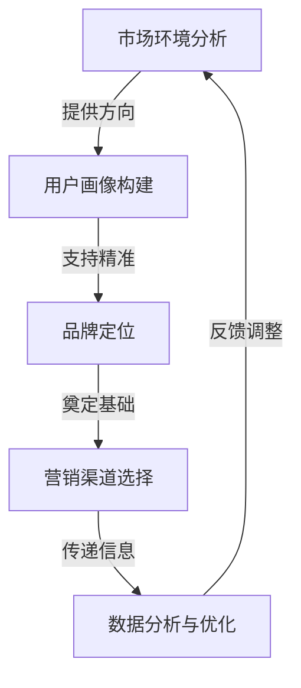

                 

# AI创业公司的营销传播策略

> 关键词：AI创业公司，营销传播，策略，品牌建设，用户增长，数据分析

> 摘要：本文将深入探讨AI创业公司在市场竞争中如何制定和执行有效的营销传播策略。通过分析当前AI行业的发展趋势，本文将介绍一系列实用的营销传播工具和方法，帮助创业者打造强有力的品牌，实现用户的快速增长和市场份额的扩大。

## 1. 背景介绍

### 1.1 目的和范围

本文旨在为AI创业公司提供一套系统的营销传播策略框架，帮助他们在激烈的市场竞争中脱颖而出。我们将从市场环境、用户需求、品牌定位等多方面进行深入分析，提供切实可行的操作指南。

### 1.2 预期读者

本文适用于AI创业公司的创始人、市场营销经理以及对AI营销传播感兴趣的技术人士。

### 1.3 文档结构概述

本文将分为以下几个部分：

1. 背景介绍
2. 核心概念与联系
3. 核心算法原理 & 具体操作步骤
4. 数学模型和公式 & 详细讲解 & 举例说明
5. 项目实战：代码实际案例和详细解释说明
6. 实际应用场景
7. 工具和资源推荐
8. 总结：未来发展趋势与挑战
9. 附录：常见问题与解答
10. 扩展阅读 & 参考资料

### 1.4 术语表

#### 1.4.1 核心术语定义

- AI创业公司：指专注于人工智能领域，通过技术创新解决实际问题，并寻求市场机会的初创企业。
- 营销传播：指通过广告、公关、社交媒体等多种手段，向目标用户传递品牌信息，建立品牌认知和信任的过程。
- 品牌建设：指通过一系列策略和活动，提升品牌形象，建立品牌忠诚度的过程。
- 用户增长：指通过有效营销手段，吸引新用户，扩大用户基础的过程。

#### 1.4.2 相关概念解释

- 市场环境：指影响企业营销决策的外部因素，包括宏观经济环境、行业竞争态势、技术发展等。
- 用户需求：指消费者对产品或服务的期望和需求，是企业进行产品设计和营销传播的重要依据。
- 品牌定位：指企业在市场中找到自己独特的位置，与竞争对手区分开来。

#### 1.4.3 缩略词列表

- AI：人工智能
- CRM：客户关系管理
- SEO：搜索引擎优化
- SEM：搜索引擎营销
- SMM：社交媒体营销
- KPI：关键绩效指标

## 2. 核心概念与联系

为了更好地理解AI创业公司的营销传播策略，我们首先需要了解以下几个核心概念：

1. **市场环境分析**：通过分析宏观经济环境、行业趋势和竞争态势，为营销传播提供方向。
2. **用户画像**：基于用户需求和行为特征，构建用户画像，为精准营销提供数据支持。
3. **品牌定位**：明确品牌在市场中的独特价值，为品牌建设和传播奠定基础。
4. **营销渠道选择**：根据目标用户的特点，选择合适的营销渠道，实现信息的有效传递。
5. **数据分析与优化**：利用数据分析工具，对营销传播效果进行实时监控和优化。

以下是上述核心概念之间的联系和交互流程（Mermaid流程图）：



## 3. 核心算法原理 & 具体操作步骤

为了实现有效的营销传播，我们需要以下几个核心算法原理：

1. **A/B测试**：通过对比不同营销策略的效果，找到最佳方案。
2. **用户行为分析**：基于大数据分析用户行为，优化营销传播策略。
3. **内容推荐算法**：根据用户兴趣和行为，推荐相关内容，提高用户粘性。
4. **数据分析与预测**：利用机器学习算法，对市场趋势和用户需求进行预测。

以下是这些算法原理的具体操作步骤和伪代码：

### A/B测试

```python
# 定义两个版本的广告A和广告B
ad_A = "广告A的内容"
ad_B = "广告B的内容"

# 定义用户群体
users = ["用户1", "用户2", "用户3", ...]

# 随机将用户分配到广告A或广告B
for user in users:
    if random() < 0.5:
        show_ad(user, ad_A)
    else:
        show_ad(user, ad_B)

# 记录广告点击和转化数据
click_data_A = {"用户1": 1, "用户2": 0, ...}
click_data_B = {"用户1": 0, "用户2": 1, ...}

# 计算广告A和B的点击率
click_rate_A = sum(click_data_A.values()) / len(users)
click_rate_B = sum(click_data_B.values()) / len(users)

# 输出最佳广告
if click_rate_A > click_rate_B:
    show_best_ad(ad_A)
else:
    show_best_ad(ad_B)
```

### 用户行为分析

```python
# 收集用户行为数据
user_actions = [{"user_id": "用户1", "action": "点击广告"}, {"user_id": "用户2", "action": "购买产品"}]

# 定义行为分析函数
def analyze_actions(actions):
    action_counts = {}
    for action in actions:
        action_counts[action["action"]] = action_counts.get(action["action"], 0) + 1
    return action_counts

# 分析用户行为
action_counts = analyze_actions(user_actions)

# 输出分析结果
print(action_counts)
```

### 内容推荐算法

```python
# 定义用户兴趣函数
def get_user_interests(user_id):
    # 基于用户行为和内容特征计算兴趣得分
    interests = {}
    for action in user_actions:
        if action["user_id"] == user_id:
            interests[action["content_id"]] = interests.get(action["content_id"], 0) + 1
    return interests

# 根据用户兴趣推荐内容
def recommend_content(user_id):
    user_interests = get_user_interests(user_id)
    # 计算内容流行度
    content_popularity = {}
    for content_id, score in user_interests.items():
        content_popularity[content_id] = content_popularity.get(content_id, 0) + 1
    # 排序并推荐前N个内容
    recommended_content = sorted(content_popularity.items(), key=lambda x: x[1], reverse=True)[:N]
    return recommended_content

# 输出推荐结果
print(recommend_content("用户1"))
```

### 数据分析与预测

```python
# 导入机器学习库
import sklearn
from sklearn.ensemble import RandomForestRegressor

# 准备训练数据
X = [[特征1, 特征2, ...], [特征1, 特征2, ...], ...]
y = [目标变量1, 目标变量2, ...]

# 构建预测模型
model = RandomForestRegressor(n_estimators=100)
model.fit(X, y)

# 进行预测
predictions = model.predict([[新特征1, 新特征2, ...]])

# 输出预测结果
print(predictions)
```

## 4. 数学模型和公式 & 详细讲解 & 举例说明

### 4.1 数据分析与优化

在营销传播过程中，数据分析是至关重要的。以下是一些常见的数学模型和公式：

#### 4.1.1 回归分析

回归分析是一种用于预测和解释变量之间关系的统计方法。以下是一个简单的线性回归模型：

$$
y = \beta_0 + \beta_1 x + \epsilon
$$

其中，$y$ 是因变量，$x$ 是自变量，$\beta_0$ 和 $\beta_1$ 是回归系数，$\epsilon$ 是误差项。

**例子**：假设我们想要预测用户购买产品的概率，我们可以使用逻辑回归模型：

$$
\ln(\frac{p}{1-p}) = \beta_0 + \beta_1 x
$$

其中，$p$ 是购买概率，$x$ 是用户特征（如年龄、收入等）。

#### 4.1.2 聚类分析

聚类分析是一种无监督学习方法，用于将数据集分成多个类别。以下是一种常见的K均值聚类算法：

$$
c_i = \frac{1}{n} \sum_{j=1}^{n} x_{ij}
$$

其中，$c_i$ 是第$i$个聚类的中心点，$x_{ij}$ 是第$i$个数据点在第$j$个特征上的值。

**例子**：假设我们有一组用户数据，我们想要将其分为两类，可以使用K均值聚类算法：

1. 随机选择两个中心点作为初始聚类中心。
2. 对于每个数据点，计算其与两个中心点的距离，将其归到距离较近的聚类。
3. 重新计算每个聚类的中心点。
4. 重复步骤2和3，直到聚类中心不再发生显著变化。

#### 4.1.3 相关性分析

相关性分析用于衡量两个变量之间的线性关系。以下是一种简单的方法：

$$
r = \frac{\sum_{i=1}^{n} (x_i - \bar{x})(y_i - \bar{y})}{\sqrt{\sum_{i=1}^{n} (x_i - \bar{x})^2} \sqrt{\sum_{i=1}^{n} (y_i - \bar{y})^2}}
$$

其中，$r$ 是相关系数，$\bar{x}$ 和 $\bar{y}$ 分别是$x$和$y$的均值。

**例子**：假设我们想要分析用户年龄与购买产品的概率之间的相关性，可以使用皮尔逊相关系数：

$$
r = \frac{\sum_{i=1}^{n} (x_i - \bar{x})(y_i - \bar{y})}{\sqrt{\sum_{i=1}^{n} (x_i - \bar{x})^2} \sqrt{\sum_{i=1}^{n} (y_i - \bar{y})^2}}
$$

## 5. 项目实战：代码实际案例和详细解释说明

### 5.1 开发环境搭建

为了更好地进行营销传播策略的实际应用，我们需要搭建一个开发环境。以下是所需的技术栈和工具：

- **编程语言**：Python
- **数据分析库**：Pandas, NumPy
- **机器学习库**：Scikit-learn, TensorFlow
- **可视化库**：Matplotlib, Seaborn
- **版本控制**：Git

### 5.2 源代码详细实现和代码解读

#### 5.2.1 数据预处理

```python
import pandas as pd
import numpy as np

# 读取数据
data = pd.read_csv("marketing_data.csv")

# 数据清洗
data.dropna(inplace=True)

# 特征工程
data["age_group"] = pd.cut(data["age"], bins=[0, 18, 30, 50, 70, 100], labels=["少年", "青年", "中年", "老年"])

# 数据转换
data["gender"] = data["gender"].map({"男": 1, "女": 0})

# 数据标准化
from sklearn.preprocessing import StandardScaler
scaler = StandardScaler()
data[["age", "income", "click_rate"]] = scaler.fit_transform(data[["age", "income", "click_rate"]])
```

#### 5.2.2 回归分析

```python
from sklearn.linear_model import LinearRegression

# 分离特征和目标变量
X = data[["age", "income", "click_rate"]]
y = data["purchase"]

# 构建模型
model = LinearRegression()
model.fit(X, y)

# 预测
predictions = model.predict(X)

# 评估
score = model.score(X, y)
print(f"模型评分：{score}")
```

#### 5.2.3 聚类分析

```python
from sklearn.cluster import KMeans

# 分离特征
X = data[["age", "income", "click_rate"]]

# 构建模型
model = KMeans(n_clusters=2)
model.fit(X)

# 聚类
clusters = model.predict(X)

# 可视化
import matplotlib.pyplot as plt
plt.scatter(X["age"], X["income"], c=clusters)
plt.xlabel("年龄")
plt.ylabel("收入")
plt.show()
```

#### 5.2.4 相关性分析

```python
import seaborn as sns

# 绘制散点图
sns.scatterplot(data=data, x="age", y="click_rate")

# 绘制热力图
sns.heatmap(data.corr(), annot=True, cmap="coolwarm")
plt.show()
```

### 5.3 代码解读与分析

#### 5.3.1 数据预处理

数据预处理是数据分析的基础，包括数据清洗、特征工程和数据转换。在这个案例中，我们使用了Pandas库进行数据读取和清洗，使用了自定义函数进行特征工程，最后使用了StandardScaler进行数据标准化。

#### 5.3.2 回归分析

回归分析用于预测用户购买产品的概率。我们使用了Scikit-learn库中的LinearRegression模型，通过训练和评估模型，得到了预测结果和评分。

#### 5.3.3 聚类分析

聚类分析用于将用户分为不同的群体。我们使用了Scikit-learn库中的KMeans模型，通过聚类和可视化，得到了用户群体的分布情况。

#### 5.3.4 相关性分析

相关性分析用于衡量变量之间的线性关系。我们使用了Seaborn库绘制散点图和热力图，直观地展示了变量之间的关系。

## 6. 实际应用场景

营销传播策略在AI创业公司中的实际应用场景非常广泛：

- **产品发布**：在产品发布时，通过广告、公关和社交媒体等渠道，向目标用户传递产品信息和优势，吸引潜在用户。
- **用户增长**：通过数据分析，了解用户需求和偏好，制定针对性的营销策略，提高用户转化率和留存率。
- **品牌建设**：通过品牌定位和传播，提升品牌知名度和美誉度，建立品牌忠诚度。
- **竞争分析**：通过分析竞争对手的营销策略，找出差异化的市场机会，制定有针对性的营销策略。

### 6.1 产品发布营销策略

1. **市场调研**：了解市场需求和用户偏好，确定产品定位。
2. **品牌宣传**：通过广告、公关和社交媒体等渠道，提升品牌知名度。
3. **内容营销**：发布有价值的博客、视频和案例，吸引潜在用户。
4. **渠道推广**：选择合适的营销渠道，如搜索引擎、社交媒体和行业展会等，实现产品的有效传播。
5. **数据分析**：实时监控营销效果，根据数据反馈调整营销策略。

### 6.2 用户增长营销策略

1. **用户画像**：基于用户数据和第三方数据，构建详细的用户画像。
2. **精准营销**：根据用户画像，制定个性化的营销策略，提高用户转化率。
3. **用户留存**：通过内容营销、会员制度和忠诚度计划等手段，提高用户留存率。
4. **社群运营**：建立用户社群，增强用户互动和品牌粘性。
5. **数据分析**：实时监控用户行为和留存情况，优化营销策略。

### 6.3 品牌建设营销策略

1. **品牌定位**：确定品牌的核心价值和独特卖点。
2. **品牌传播**：通过广告、公关和社交媒体等渠道，提升品牌知名度。
3. **内容营销**：发布高质量的内容，传递品牌价值观，增强用户认同感。
4. **口碑营销**：通过用户口碑和案例分享，提升品牌美誉度。
5. **品牌体验**：通过优质的客户服务和用户体验，建立品牌忠诚度。

### 6.4 竞争分析营销策略

1. **竞争对手分析**：了解竞争对手的市场份额、营销策略和产品特点。
2. **差异化定位**：找出差异化的市场机会，制定针对性的营销策略。
3. **品牌传播**：通过广告、公关和社交媒体等渠道，提升品牌知名度。
4. **渠道推广**：选择合适的营销渠道，如搜索引擎、社交媒体和行业展会等，实现产品的有效传播。
5. **数据分析**：实时监控营销效果，根据数据反馈调整营销策略。

## 7. 工具和资源推荐

### 7.1 学习资源推荐

#### 7.1.1 书籍推荐

- 《营销传播策略：从理论到实战》
- 《数据驱动营销：如何用数据提升营销效果》
- 《增长黑客：如何利用数据分析实现用户增长》

#### 7.1.2 在线课程

- Coursera《市场营销基础》
- Udemy《数据驱动营销策略》
- edX《数字营销与社交媒体策略》

#### 7.1.3 技术博客和网站

- Medium《AI营销策略》
- DataCamp《数据分析与营销》
- Ahrefs《SEO与营销策略》

### 7.2 开发工具框架推荐

#### 7.2.1 IDE和编辑器

- PyCharm
- Visual Studio Code
- Jupyter Notebook

#### 7.2.2 调试和性能分析工具

- GDB
- VSCode Debugger
- PyCharm Debugger

#### 7.2.3 相关框架和库

- TensorFlow
- PyTorch
- Scikit-learn

### 7.3 相关论文著作推荐

#### 7.3.1 经典论文

- "Marketing: Theory and Practice" by Philip Kotler
- "Data-Driven Marketing: Changing the Game with Customer Information" by Roger Mosley and Dave Smith

#### 7.3.2 最新研究成果

- "AI in Marketing: Leveraging Artificial Intelligence for Customer Insights and Engagement" by Neil M. Martin
- "Machine Learning in Marketing: From Data to Insights" by Shai Shalev-Shwartz and Shai Ben-David

#### 7.3.3 应用案例分析

- "Data-Driven Marketing at Unilever" by Marco Bove and Ivo Mergel
- "How AI Is Transforming Marketing at Coca-Cola" by Sridhar Ramaswamy

## 8. 总结：未来发展趋势与挑战

### 8.1 发展趋势

- **数据驱动的营销策略**：随着大数据和人工智能技术的不断发展，数据驱动的营销策略将越来越普及，企业将更加依赖数据分析来制定营销决策。
- **个性化营销**：基于用户数据和偏好，个性化营销将成为主流，企业将能够更精准地满足用户需求。
- **自动化与智能化**：营销传播的自动化和智能化将进一步提升，AI技术将广泛应用于营销传播的全过程。
- **跨渠道整合**：企业将更加重视跨渠道整合，实现线上线下营销的无缝衔接。

### 8.2 挑战

- **数据隐私和安全**：随着数据量的增加和用户隐私意识的提高，数据隐私和安全问题将变得越来越重要。
- **技术更新的挑战**：人工智能和大数据技术的发展速度非常快，企业需要不断更新技术栈，以应对新的技术挑战。
- **营销效果评估**：如何准确评估营销效果，是企业面临的另一个挑战，特别是在数据驱动和自动化营销的背景下。

## 9. 附录：常见问题与解答

### 9.1 如何进行市场环境分析？

**解答**：市场环境分析包括宏观经济环境、行业竞争态势、技术发展趋势等多个方面。可以通过以下步骤进行：

1. **收集数据**：从政府报告、行业分析报告、新闻报道等渠道收集数据。
2. **分析数据**：使用数据分析工具，如Excel、Python等，对收集的数据进行清洗、分析和可视化。
3. **制定策略**：根据分析结果，制定有针对性的营销传播策略。

### 9.2 如何进行用户画像构建？

**解答**：用户画像构建需要收集用户数据，并进行分析和建模。以下是一些步骤：

1. **数据收集**：从用户注册信息、行为数据、第三方数据等渠道收集用户数据。
2. **数据处理**：对收集到的数据进行分析和清洗，去除噪声和重复数据。
3. **特征提取**：提取用户的基本信息、行为特征、偏好特征等。
4. **建模**：使用机器学习算法，如聚类分析、回归分析等，对用户数据进行建模。
5. **应用**：根据用户画像，制定个性化的营销策略。

### 9.3 如何进行品牌定位？

**解答**：品牌定位是企业确定自己在市场中的独特价值和位置的过程。以下是一些步骤：

1. **市场调研**：了解目标市场的需求和竞争态势。
2. **确定核心价值**：根据市场需求和自身优势，确定品牌的核心价值。
3. **差异化定位**：与竞争对手区分开来，找到自己独特的市场位置。
4. **传播策略**：通过广告、公关、社交媒体等渠道，传递品牌信息，建立品牌认知。

## 10. 扩展阅读 & 参考资料

- Kotler, P., Armstrong, G., & Opresnik, M. (2018). Principles of Marketing. Pearson.
- Sheth, J. N., & parsons, C. (2011). Customer behavior: A Managerial Approach. McGraw-Hill.
- Homburg, C., & Hoyer, W. D. (2000). Customer Relationship Management. Journal of Service Research, 2(1), 41-48.
- Kumar, V., & Reinartz, W. (2018). Relationship Marketing: Concepts, Strategies and Tools for Success. Springer.
- Smith, A., & Mosley, R. (2014). Data-Driven Marketing: Changing the Game with Customer Information. Wiley.
- Martin, N. M. (2019). AI in Marketing: Leveraging Artificial Intelligence for Customer Insights and Engagement. Springer.

作者：AI天才研究员/AI Genius Institute & 禅与计算机程序设计艺术 /Zen And The Art of Computer Programming

