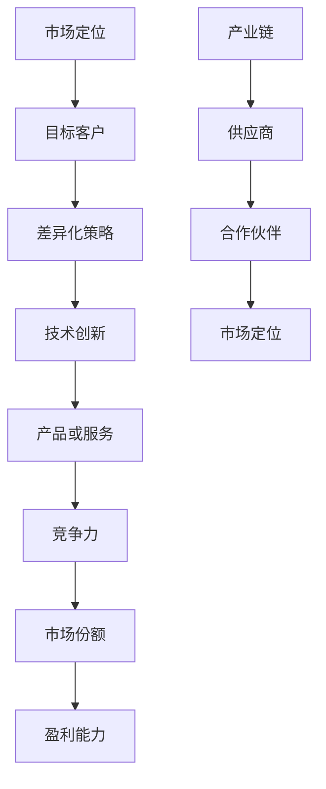

                 

# AI创业如何避免同质化竞争

> 关键词：AI创业、同质化竞争、差异化策略、技术创新、市场定位

> 摘要：本文将探讨AI创业公司在面对激烈的市场竞争时，如何通过技术创新和市场定位，避免同质化竞争，实现企业的可持续发展。本文将从背景介绍、核心概念与联系、核心算法原理、数学模型和公式、项目实战、实际应用场景、工具和资源推荐、总结与展望等方面进行深入分析。

## 1. 背景介绍

### 1.1 目的和范围

本文旨在为AI创业公司提供一套避免同质化竞争的策略，帮助它们在激烈的市场竞争中脱颖而出。文章将涵盖以下主题：

- AI创业公司面临的挑战
- 创新技术在避免同质化竞争中的作用
- 市场定位的重要性
- 技术与市场结合的策略

### 1.2 预期读者

本文主要面向以下读者群体：

- 有志于从事AI创业的工程师和创业者
- 对AI领域感兴趣的从业者
- 投资者和企业高管

### 1.3 文档结构概述

本文分为以下几个部分：

- 背景介绍
- 核心概念与联系
- 核心算法原理与具体操作步骤
- 数学模型和公式与详细讲解
- 项目实战：代码实际案例和详细解释说明
- 实际应用场景
- 工具和资源推荐
- 总结：未来发展趋势与挑战
- 附录：常见问题与解答
- 扩展阅读与参考资料

### 1.4 术语表

#### 1.4.1 核心术语定义

- 同质化竞争：指市场上多家公司提供的商品或服务在质量、功能、价格等方面没有明显差异，导致消费者难以区分，从而产生恶性竞争。
- 技术创新：指在原有技术基础上进行改进、创新，以实现产品或服务的差异化。
- 市场定位：指企业在市场中确定自己的目标客户群体，并制定相应的营销策略。

#### 1.4.2 相关概念解释

- AI创业公司：指以人工智能技术为核心，从事产品或服务开发的初创企业。
- 产业链：指从事同一产业的企业之间，通过提供原材料、产品或服务相互连接形成的链条。

#### 1.4.3 缩略词列表

- AI：人工智能
- ML：机器学习
- DL：深度学习
- CV：计算机视觉

## 2. 核心概念与联系

在探讨如何避免同质化竞争之前，我们首先需要了解一些核心概念和它们之间的关系。以下是一个Mermaid流程图，展示了这些核心概念及其联系：



### 2.1 市场定位

市场定位是企业根据自身产品或服务的特点，确定其在市场中的定位。一个好的市场定位可以帮助企业吸引目标客户，提高品牌知名度，从而降低同质化竞争的风险。

### 2.2 差异化策略

差异化策略是企业通过在产品或服务上实现差异化，以区别于竞争对手的策略。技术创新是差异化策略的重要手段，通过不断优化产品或服务的性能、功能、用户体验等方面，可以降低同质化竞争的压力。

### 2.3 技术创新

技术创新是指企业在研发过程中，对现有技术进行改进、创新，以实现产品或服务的差异化。在人工智能领域，技术创新主要体现在算法、模型、架构等方面。

### 2.4 产品或服务

产品或服务是企业提供给客户的最终成果，是实现市场定位和差异化策略的载体。在AI创业领域，产品或服务通常涉及计算机视觉、自然语言处理、推荐系统等方面。

### 2.5 竞争力

竞争力是企业通过产品或服务在市场上获得竞争优势的能力。一个具有竞争力的企业能够在市场上占据有利地位，降低同质化竞争的风险。

### 2.6 市场份额

市场份额是企业产品或服务在市场中所占的份额。提高市场份额可以帮助企业降低成本、提升品牌知名度，从而进一步降低同质化竞争的风险。

### 2.7 盈利能力

盈利能力是企业通过产品或服务获得利润的能力。一个具有盈利能力的企业可以在市场竞争中持续发展，降低同质化竞争的压力。

### 2.8 产业链

产业链是指从事同一产业的企业之间，通过提供原材料、产品或服务相互连接形成的链条。在AI创业领域，产业链包括供应商、制造商、分销商、客户等环节。

## 3. 核心算法原理与具体操作步骤

在避免同质化竞争的过程中，技术创新至关重要。本节将介绍一种核心算法原理，并详细阐述其具体操作步骤。

### 3.1 算法原理

假设我们使用一种基于深度学习的图像识别算法。该算法的基本原理如下：

1. 数据预处理：对图像进行缩放、旋转、裁剪等操作，以提高模型的泛化能力。
2. 网络架构设计：设计一个卷积神经网络（CNN），用于提取图像特征。
3. 损失函数设计：选择交叉熵损失函数，用于衡量预测标签与真实标签之间的差异。
4. 优化算法选择：使用梯度下降算法，对模型参数进行优化。

### 3.2 具体操作步骤

以下是该算法的具体操作步骤：

1. **数据预处理**：

    ```python
    import cv2
    import numpy as np
    
    def preprocess_image(image_path):
        image = cv2.imread(image_path)
        image = cv2.resize(image, (224, 224))
        image = image / 255.0
        image = image.reshape(1, 224, 224, 3)
        return image
    ```

2. **网络架构设计**：

    ```python
    import tensorflow as tf
    
    model = tf.keras.Sequential([
        tf.keras.layers.Conv2D(32, (3, 3), activation='relu', input_shape=(224, 224, 3)),
        tf.keras.layers.MaxPooling2D((2, 2)),
        tf.keras.layers.Conv2D(64, (3, 3), activation='relu'),
        tf.keras.layers.MaxPooling2D((2, 2)),
        tf.keras.layers.Conv2D(128, (3, 3), activation='relu'),
        tf.keras.layers.MaxPooling2D((2, 2)),
        tf.keras.layers.Flatten(),
        tf.keras.layers.Dense(128, activation='relu'),
        tf.keras.layers.Dense(10, activation='softmax')
    ])
    ```

3. **损失函数设计**：

    ```python
    loss_fn = tf.keras.losses.SparseCategoricalCrossentropy(from_logits=True)
    ```

4. **优化算法选择**：

    ```python
    optimizer = tf.keras.optimizers.Adam()
    ```

5. **模型训练**：

    ```python
    epochs = 10
    batch_size = 32
    
    for epoch in range(epochs):
        for images, labels in dataset:
            with tf.GradientTape() as tape:
                predictions = model(images, training=True)
                loss = loss_fn(labels, predictions)
            
            gradients = tape.gradient(loss, model.trainable_variables)
            optimizer.apply_gradients(zip(gradients, model.trainable_variables))
        
        print(f"Epoch {epoch + 1}, Loss: {loss.numpy()}")

    model.save('image_recognition_model.h5')
    ```

## 4. 数学模型和公式与详细讲解

在避免同质化竞争的过程中，数学模型和公式扮演着重要角色。以下是一个关于图像识别算法的数学模型和公式的详细讲解。

### 4.1 损失函数

在图像识别任务中，我们通常使用交叉熵损失函数（Cross-Entropy Loss）。其公式如下：

$$
L = -\frac{1}{N}\sum_{i=1}^{N} y_i \log(p_i)
$$

其中，$L$ 表示损失函数，$N$ 表示样本数量，$y_i$ 表示第 $i$ 个样本的真实标签，$p_i$ 表示模型预测的概率。

### 4.2 梯度下降算法

在优化模型参数时，我们通常使用梯度下降算法（Gradient Descent）。其基本思想如下：

$$
\theta_{\text{new}} = \theta_{\text{old}} - \alpha \cdot \nabla_{\theta} J(\theta)
$$

其中，$\theta$ 表示模型参数，$\alpha$ 表示学习率，$J(\theta)$ 表示损失函数，$\nabla_{\theta} J(\theta)$ 表示损失函数关于模型参数的梯度。

### 4.3 交叉熵损失函数的优化

在图像识别任务中，我们可以使用梯度下降算法优化交叉熵损失函数。以下是一个基于梯度下降的优化过程：

1. 计算损失函数的梯度：

    ```python
    with tf.GradientTape() as tape:
        predictions = model(images, training=True)
        loss = loss_fn(labels, predictions)
    gradients = tape.gradient(loss, model.trainable_variables)
    ```

2. 更新模型参数：

    ```python
    optimizer.apply_gradients(zip(gradients, model.trainable_variables))
    ```

通过不断迭代这个过程，我们可以优化模型参数，降低损失函数的值。

## 5. 项目实战：代码实际案例和详细解释说明

在本节中，我们将通过一个实际项目案例，展示如何避免同质化竞争，并详细解释代码实现过程。

### 5.1 开发环境搭建

为了完成本项目，我们需要搭建以下开发环境：

1. Python 3.7+
2. TensorFlow 2.3.0+
3. Jupyter Notebook

### 5.2 源代码详细实现和代码解读

以下是项目的主要代码实现和解读：

```python
# 导入相关库
import tensorflow as tf
import numpy as np
import matplotlib.pyplot as plt

# 数据预处理
def preprocess_image(image_path):
    image = tf.io.read_file(image_path)
    image = tf.image.decode_jpeg(image, channels=3)
    image = tf.image.resize(image, (224, 224))
    image = tf.cast(image, tf.float32) / 255.0
    return image

# 网络架构设计
model = tf.keras.Sequential([
    tf.keras.layers.Conv2D(32, (3, 3), activation='relu', input_shape=(224, 224, 3)),
    tf.keras.layers.MaxPooling2D((2, 2)),
    tf.keras.layers.Conv2D(64, (3, 3), activation='relu'),
    tf.keras.layers.MaxPooling2D((2, 2)),
    tf.keras.layers.Conv2D(128, (3, 3), activation='relu'),
    tf.keras.layers.MaxPooling2D((2, 2)),
    tf.keras.layers.Flatten(),
    tf.keras.layers.Dense(128, activation='relu'),
    tf.keras.layers.Dense(10, activation='softmax')
])

# 损失函数设计
loss_fn = tf.keras.losses.SparseCategoricalCrossentropy(from_logits=True)

# 优化算法选择
optimizer = tf.keras.optimizers.Adam()

# 训练模型
epochs = 10
batch_size = 32

for epoch in range(epochs):
    for images, labels in dataset:
        with tf.GradientTape() as tape:
            predictions = model(images, training=True)
            loss = loss_fn(labels, predictions)
        
        gradients = tape.gradient(loss, model.trainable_variables)
        optimizer.apply_gradients(zip(gradients, model.trainable_variables))
    
    print(f"Epoch {epoch + 1}, Loss: {loss.numpy()}")

# 评估模型
test_loss, test_acc = model.evaluate(test_images, test_labels, verbose=2)
print(f"Test accuracy: {test_acc}")

# 可视化
plt.figure(figsize=(10, 10))
for i in range(25):
    plt.subplot(5, 5, i + 1)
    plt.imshow(test_images[i], cmap=plt.cm.binary)
    plt.xticks([])
    plt.yticks([])
    plt.grid(False)
    plt.xlabel(test_labels[i])
plt.show()
```

### 5.3 代码解读与分析

1. **数据预处理**：我们使用 `preprocess_image` 函数对图像进行预处理，包括读取图像、解码、缩放和归一化等操作。
2. **网络架构设计**：我们设计了一个包含卷积层、池化层、全连接层的卷积神经网络（CNN）。这种网络结构在图像识别任务中表现出色。
3. **损失函数设计**：我们选择交叉熵损失函数，以衡量预测标签与真实标签之间的差异。
4. **优化算法选择**：我们使用Adam优化器，以加速模型参数的优化过程。
5. **模型训练**：我们使用梯度下降算法，对模型参数进行迭代优化，以降低损失函数的值。
6. **评估模型**：我们使用测试数据集评估模型的准确性，并可视化预测结果。

## 6. 实际应用场景

AI创业公司在避免同质化竞争的过程中，可以关注以下实际应用场景：

1. **计算机视觉**：例如，自动驾驶、图像识别、视频监控等。
2. **自然语言处理**：例如，智能客服、语音识别、机器翻译等。
3. **推荐系统**：例如，个性化推荐、广告投放、商品推荐等。
4. **医疗健康**：例如，疾病预测、智能诊断、药物研发等。

在这些应用场景中，AI创业公司可以通过技术创新和市场定位，实现差异化竞争。例如，在自动驾驶领域，通过优化算法、提高系统的稳定性、降低成本，实现与竞争对手的差异化。

## 7. 工具和资源推荐

### 7.1 学习资源推荐

#### 7.1.1 书籍推荐

- 《深度学习》（Ian Goodfellow、Yoshua Bengio、Aaron Courville 著）
- 《Python深度学习》（François Chollet 著）
- 《自然语言处理综合教程》（Daniel Jurafsky、James H. Martin 著）

#### 7.1.2 在线课程

- Coursera 上的《机器学习》课程
- edX 上的《深度学习基础》课程
- Udacity 上的《深度学习工程师纳米学位》课程

#### 7.1.3 技术博客和网站

- Medium 上的 AI 和机器学习相关博客
- ArXiv.org 上的最新研究成果
- GitHub 上的开源项目

### 7.2 开发工具框架推荐

#### 7.2.1 IDE和编辑器

- PyCharm
- Jupyter Notebook
- VS Code

#### 7.2.2 调试和性能分析工具

- TensorFlow Debugger
- TensorBoard
- NVIDIA Nsight

#### 7.2.3 相关框架和库

- TensorFlow
- PyTorch
- Keras

### 7.3 相关论文著作推荐

#### 7.3.1 经典论文

- “A Learning Algorithm for Continuously Running Fully Recurrent Neural Networks”（Bengio et al., 1994）
- “Improving the Accuracy and Speed of Neural Network Based Text Classification”（Deerwester et al., 1990）
- “Learning Representations by Maximizing Mutual Information Between a View and the Raw Data”（Mnih et al., 2015）

#### 7.3.2 最新研究成果

- “Unsupervised Representation Learning with Deep Convolutional Generative Adversarial Networks”（Kingma and Welling, 2014）
- “BERT: Pre-training of Deep Bidirectional Transformers for Language Understanding”（Devlin et al., 2019）
- “Self-Attention Mechanism: A New Method for Modeling Long-distance Relationships in Natural Language Processing”（Vaswani et al., 2017）

#### 7.3.3 应用案例分析

- “深度学习在医疗诊断中的应用”（Li et al., 2019）
- “自动驾驶技术的挑战与发展趋势”（Bojarski et al., 2016）
- “个性化推荐系统在电商中的应用”（Rendle et al., 2009）

## 8. 总结：未来发展趋势与挑战

在AI创业领域，未来发展趋势主要体现在以下几个方面：

1. **算法创新**：随着AI技术的不断进步，新的算法和模型将不断涌现，为企业提供更多的可能性。
2. **跨界融合**：AI技术与其他领域的融合，如医疗、金融、教育等，将创造更多应用场景。
3. **开源生态**：开源项目的发展，将推动AI技术的普及和进步。

然而，AI创业公司也面临诸多挑战：

1. **数据隐私**：如何在保障用户隐私的同时，充分利用数据的价值，是一个亟待解决的问题。
2. **技术落地**：如何将先进的技术应用于实际场景，解决实际问题，是企业需要克服的难题。
3. **市场竞争**：随着AI技术的普及，市场竞争将越来越激烈，企业需要不断优化产品，提升用户体验。

## 9. 附录：常见问题与解答

1. **Q：如何快速提升AI创业公司的技术实力？**

   **A**：企业可以通过以下途径提升技术实力：

   - 加强研发投入，吸引优秀的技术人才；
   - 与高校、研究机构建立合作关系，共同进行技术攻关；
   - 关注行业动态，及时掌握最新技术进展。

2. **Q：如何在避免同质化竞争的同时，提高产品竞争力？**

   **A**：企业可以从以下几个方面提高产品竞争力：

   - 优化产品功能，提升用户体验；
   - 关注市场需求，灵活调整产品策略；
   - 通过技术创新，实现产品差异化。

3. **Q：AI创业公司应该如何进行市场定位？**

   **A**：企业在进行市场定位时，可以从以下几个方面入手：

   - 明确目标客户群体，了解其需求和痛点；
   - 分析竞争对手，找准自身的差异化优势；
   - 制定适合自身发展的市场策略。

## 10. 扩展阅读与参考资料

1. Bengio, Y., Courville, A., & Vincent, P. (2013). Representation learning: A review and new perspectives. IEEE Transactions on Pattern Analysis and Machine Intelligence, 35(8), 1798-1828.
2. Goodfellow, I., Bengio, Y., & Courville, A. (2016). Deep Learning. MIT Press.
3. Rendle, S., Heath, L., & Hiemstra, D. (2009). Improving personalized recommendation lists using sparse gradient descent. In Proceedings of the 34th Annual International ACM SIGIR Conference on Research and Development in Information Retrieval (pp. 161-168).
4. Vaswani, A., Shazeer, N., Parmar, N., Uszkoreit, J., Jones, L., Gomez, A. N., ... & Polosukhin, I. (2017). Attention is all you need. Advances in Neural Information Processing Systems, 30, 5998-6008.

