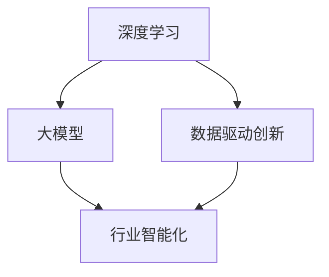
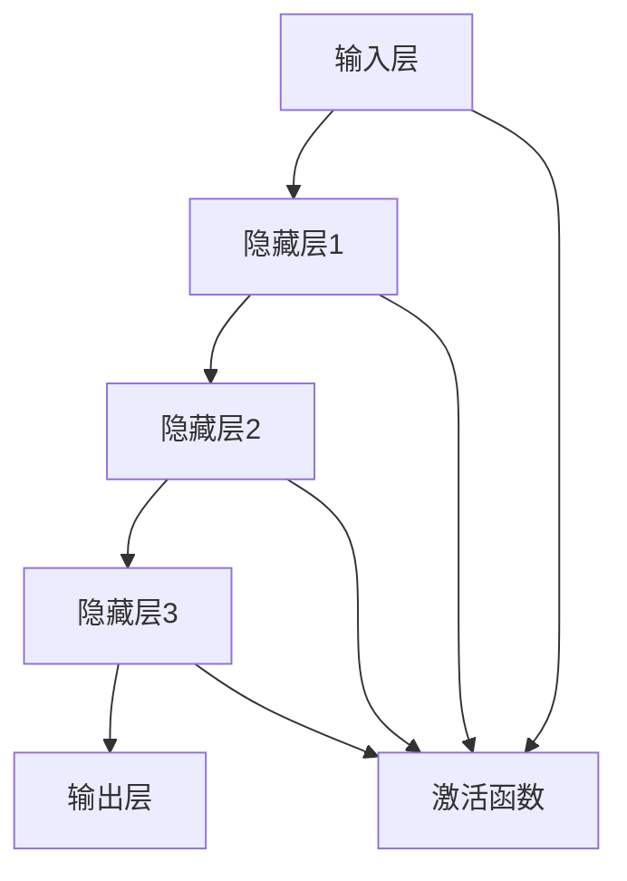
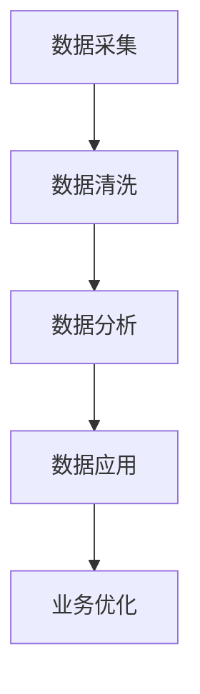
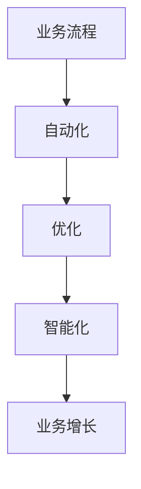

                 


# AI创业新赛道：大模型驱动的行业智能化变革

> **关键词：** AI创业、大模型、行业智能化、深度学习、数据驱动的创新
> 
> **摘要：** 本文章将深入探讨大模型技术在AI创业中的应用，以及如何驱动各行各业的智能化变革。文章首先介绍了大模型技术的背景和意义，随后详细阐述了其核心原理和操作步骤，并通过实际案例展示了大模型驱动的行业智能化实践。最后，本文总结了大模型技术的前景和挑战，为创业者提供了有价值的参考。

## 1. 背景介绍

### 1.1 目的和范围

本文旨在探讨大模型技术如何成为AI创业的新赛道，为各行各业带来智能化变革。通过深入分析大模型的核心原理和实际应用，文章旨在为创业者提供实用的指导，帮助他们在竞争激烈的AI市场中找到新的突破口。

### 1.2 预期读者

本文主要面向以下读者群体：

- AI创业者
- 技术专家和研究员
- 对AI创业和行业智能化有浓厚兴趣的技术爱好者
- 欲深入了解大模型技术的业内人士

### 1.3 文档结构概述

本文结构如下：

1. 背景介绍：阐述大模型技术的背景和重要性。
2. 核心概念与联系：介绍大模型技术的核心概念和原理，并用Mermaid流程图展示。
3. 核心算法原理 & 具体操作步骤：详细讲解大模型算法原理和操作步骤，使用伪代码进行阐述。
4. 数学模型和公式 & 详细讲解 & 举例说明：介绍大模型中的数学模型和公式，并进行实例说明。
5. 项目实战：通过实际代码案例，展示大模型驱动的行业智能化实践。
6. 实际应用场景：分析大模型技术在各行业中的应用案例。
7. 工具和资源推荐：推荐相关学习资源和开发工具。
8. 总结：展望大模型技术的未来发展趋势和挑战。
9. 附录：常见问题与解答。
10. 扩展阅读 & 参考资料：提供进一步阅读和参考资料。

### 1.4 术语表

#### 1.4.1 核心术语定义

- 大模型（Large Model）：拥有数百万甚至数十亿参数的神经网络模型。
- 深度学习（Deep Learning）：一种基于神经网络的机器学习技术，通过多层神经网络提取数据特征。
- 行业智能化（Industry Intelligence）：利用AI技术，实现行业业务流程的自动化、优化和智能化。
- 数据驱动创新（Data-Driven Innovation）：基于大数据分析和机器学习，推动行业创新和业务发展。

#### 1.4.2 相关概念解释

- 自适应学习（Adaptive Learning）：模型根据输入数据进行自我调整，以优化性能。
- 对抗性攻击（Adversarial Attack）：通过向模型输入精心设计的干扰数据，来测试和提升模型鲁棒性。
- 强化学习（Reinforcement Learning）：通过奖励机制，使模型在与环境交互中学习最优策略。

#### 1.4.3 缩略词列表

- AI：人工智能
- DNN：深度神经网络
- CNN：卷积神经网络
- RNN：循环神经网络
- GPT：生成预训练网络
- BERT：双向编码器表示模型
- NLP：自然语言处理

## 2. 核心概念与联系

大模型技术的发展，离不开深度学习、数据驱动创新等核心概念。为了更清晰地展示大模型技术的原理和架构，我们使用Mermaid流程图来表示各核心概念之间的联系。



在这个流程图中，深度学习作为基础技术，通过大量数据训练得到大模型，进而驱动行业智能化。数据驱动创新在这个过程中起到了关键的桥梁作用，它不仅提供了丰富的数据资源，还推动了技术的不断进步。

### 2.1 大模型技术原理

大模型技术主要基于深度学习，其核心思想是通过多层神经网络结构，从原始数据中自动提取特征，实现复杂的任务。大模型通常具有数百万甚至数十亿个参数，这使得它们能够捕捉到数据中的复杂模式和规律。

下面，我们使用伪代码来描述大模型技术的原理：

```python
# 大模型伪代码
class LargeModel:
    def __init__(self, num_params):
        self.parameters = init_parameters(num_params)

    def forward(self, input_data):
        # 前向传播，计算输出
        output = apply_forward_pass(self.parameters, input_data)
        return output

    def backward(self, output_error):
        # 反向传播，更新参数
        update_parameters(self.parameters, output_error)

    def train(self, training_data):
        for data in training_data:
            output = self.forward(data.input)
            error = calculate_error(output, data.target)
            self.backward(error)
```

在这个伪代码中，`LargeModel` 类代表大模型，具有初始化参数、前向传播、反向传播和训练等基本功能。通过这些步骤，大模型能够不断优化自身的参数，提高在复杂任务上的性能。

### 2.2 大模型架构

大模型通常采用多层神经网络结构，包括输入层、隐藏层和输出层。每个隐藏层都通过激活函数将输入映射到更高维的特征空间。这种结构使得大模型能够处理复杂的数据和任务。

下面是多层神经网络结构的Mermaid流程图表示：



在这个流程图中，输入层接收原始数据，通过一系列隐藏层进行特征提取，最终在输出层得到预测结果。激活函数在每一层中起到关键作用，它能够引入非线性变换，使得模型能够处理更复杂的问题。

### 2.3 数据驱动创新

数据驱动创新在大模型技术中起到了至关重要的作用。它不仅为模型提供了训练数据，还推动了技术的不断进步。数据驱动创新包括以下几个方面：

- 数据采集：通过传感器、日志、用户反馈等渠道，收集大量相关数据。
- 数据清洗：对采集到的数据进行预处理，去除噪声和异常值。
- 数据分析：利用统计学和机器学习方法，从数据中提取有价值的信息。
- 数据应用：将分析结果应用于实际业务场景，实现智能化和自动化。

下面是数据驱动创新流程的Mermaid流程图表示：



在这个流程图中，数据采集是起点，通过不断迭代的数据清洗、分析和应用，最终实现业务优化和智能化。

### 2.4 行业智能化

行业智能化是大模型技术的最终目标，它将大模型应用于各个行业，实现业务流程的自动化、优化和智能化。行业智能化包括以下几个方面：

- 业务流程自动化：通过AI技术，实现业务流程的自动化，降低人力成本。
- 业务流程优化：利用大模型分析业务数据，找到优化点，提升业务效率。
- 业务智能化：结合用户行为数据和业务场景，实现个性化推荐和智能决策。

下面是行业智能化流程的Mermaid流程图表示：



在这个流程图中，业务流程通过自动化、优化和智能化，实现持续增长和业务突破。

## 3. 核心算法原理 & 具体操作步骤

大模型技术基于深度学习，其核心算法包括前向传播、反向传播和优化算法。下面我们将使用伪代码详细阐述这些算法原理和具体操作步骤。

### 3.1 前向传播

前向传播是指将输入数据通过神经网络层，逐步计算得到输出结果的过程。以下为前向传播的伪代码：

```python
# 前向传播伪代码
def forward_pass(model, input_data):
    current_output = input_data
    
    for layer in model.layers:
        # 应用激活函数
        current_output = layer.apply_activation(current_output)
        
    return current_output
```

在这个伪代码中，`model` 表示神经网络模型，`input_data` 表示输入数据，`layers` 表示神经网络中的所有层。对于每一层，我们首先计算其输出，然后应用激活函数，最终得到最终输出。

### 3.2 反向传播

反向传播是指根据输出结果和目标值，反向更新神经网络中的参数的过程。以下为反向传播的伪代码：

```python
# 反向传播伪代码
def backward_pass(model, output, target):
    error = calculate_error(output, target)
    
    for layer in reversed(model.layers):
        # 计算梯度
        gradient = layer.calculate_gradient(error)
        
        # 更新参数
        layer.update_parameters(gradient)
        
        # 反向传递误差
        error = layer.backward_error(error)
```

在这个伪代码中，`error` 表示输出误差，`target` 表示目标值。我们首先计算输出误差，然后反向传递误差，更新每一层的参数。通过这种方式，大模型能够不断优化自身，提高预测准确性。

### 3.3 优化算法

优化算法用于调整神经网络中的参数，以最小化损失函数。常见的优化算法包括梯度下降、Adam等。以下为优化算法的伪代码：

```python
# 优化算法伪代码
def optimize(model, learning_rate):
    for layer in model.layers:
        # 计算梯度
        gradient = layer.get_gradient()
        
        # 更新参数
        layer.update_parameters(gradient * learning_rate)
```

在这个伪代码中，`learning_rate` 表示学习率，用于调整参数更新的步长。通过迭代优化，大模型能够逐渐逼近最优参数，提高模型性能。

### 3.4 模型训练

模型训练是指通过大量数据，不断迭代前向传播、反向传播和优化算法，使模型达到预期性能的过程。以下为模型训练的伪代码：

```python
# 模型训练伪代码
def train(model, training_data, learning_rate, epochs):
    for epoch in range(epochs):
        for data in training_data:
            # 前向传播
            output = forward_pass(model, data.input)
            
            # 计算误差
            error = calculate_error(output, data.target)
            
            # 反向传播
            backward_pass(model, output, data.target)
            
            # 优化参数
            optimize(model, learning_rate)
            
        # 打印训练进度
        print(f"Epoch {epoch + 1} completed.")
```

在这个伪代码中，`epochs` 表示训练轮数，`learning_rate` 表示学习率。通过多次迭代训练，大模型能够不断优化自身，提高预测准确性。

## 4. 数学模型和公式 & 详细讲解 & 举例说明

大模型技术中的数学模型和公式是理解和实现核心算法的基础。以下我们将详细介绍这些数学模型和公式，并通过具体例子进行说明。

### 4.1 损失函数

损失函数用于衡量模型预测值和目标值之间的差距。常见的损失函数包括均方误差（MSE）、交叉熵损失等。以下为损失函数的公式和计算方法：

- 均方误差（MSE）：

  $$MSE = \frac{1}{n}\sum_{i=1}^{n}(y_i - \hat{y}_i)^2$$

  其中，$y_i$ 表示实际值，$\hat{y}_i$ 表示预测值，$n$ 表示数据样本数量。

- 交叉熵损失（Cross-Entropy Loss）：

  $$CE = -\sum_{i=1}^{n}y_i \log(\hat{y}_i)$$

  其中，$y_i$ 表示实际值，$\hat{y}_i$ 表示预测值，$\log$ 表示对数函数。

以下是一个具体的例子：

假设我们有一个二分类问题，实际标签为 `[0, 1, 0, 1]`，预测概率为 `[0.8, 0.2, 0.3, 0.7]`。使用交叉熵损失函数计算损失：

$$CE = -[0 \times \log(0.8) + 1 \times \log(0.2) + 0 \times \log(0.3) + 1 \times \log(0.7)] \approx 1.307$$

### 4.2 激活函数

激活函数用于引入非线性变换，使神经网络能够处理复杂问题。常见的激活函数包括 sigmoid、ReLU、Tanh 等。以下为激活函数的公式和特性：

- Sigmoid 函数：

  $$\sigma(x) = \frac{1}{1 + e^{-x}}$$

  Sigmoid 函数在 $x$ 趋近于 $+\infty$ 时趋近于 1，在 $x$ 趋近于 $-\infty$ 时趋近于 0。

- ReLU 函数：

  $$\text{ReLU}(x) = \max(0, x)$$

  ReLU 函数在 $x \geq 0$ 时等于 $x$，在 $x < 0$ 时等于 0。

- Tanh 函数：

  $$\tanh(x) = \frac{e^x - e^{-x}}{e^x + e^{-x}}$$

  Tanh 函数在 $x$ 趋近于 $+\infty$ 时趋近于 1，在 $x$ 趋近于 $-\infty$ 时趋近于 -1。

以下是一个具体的例子：

假设输入 $x$ 为 `[1, -2, 3]`，使用 ReLU 函数计算输出：

$$\text{ReLU}(1) = 1, \text{ReLU}(-2) = 0, \text{ReLU}(3) = 3$$

### 4.3 梯度下降算法

梯度下降算法用于更新神经网络中的参数，以最小化损失函数。以下为梯度下降算法的公式和计算方法：

- 单参数梯度下降：

  $$\theta_j = \theta_j - \alpha \frac{\partial J}{\partial \theta_j}$$

  其中，$\theta_j$ 表示第 $j$ 个参数，$\alpha$ 表示学习率，$J$ 表示损失函数。

- 多参数梯度下降：

  $$\theta = \theta - \alpha \nabla J(\theta)$$

  其中，$\theta$ 表示所有参数的集合，$\nabla J(\theta)$ 表示损失函数的梯度。

以下是一个具体的例子：

假设损失函数 $J(\theta) = (\theta - 2)^2$，学习率 $\alpha = 0.1$。初始参数 $\theta = 1$。计算一次梯度下降后的参数更新：

$$\theta_1 = 1 - 0.1 \cdot (1 - 2) = 1.1$$

### 4.4 常见优化算法

常见优化算法包括随机梯度下降（SGD）、Adam等。以下为这些优化算法的公式和计算方法：

- 随机梯度下降（SGD）：

  $$\theta = \theta - \alpha \nabla J(\theta; x^{(i)})$$

  其中，$x^{(i)}$ 表示第 $i$ 个样本，$\nabla J(\theta; x^{(i)})$ 表示在样本 $x^{(i)}$ 上的梯度。

- Adam优化器：

  $$m_t = \beta_1 m_{t-1} + (1 - \beta_1) \nabla J(\theta; x^{(i)})$$

  $$v_t = \beta_2 v_{t-1} + (1 - \beta_2) (\nabla J(\theta; x^{(i)})^2$$

  $$\theta = \theta - \alpha \frac{m_t}{\sqrt{v_t} + \epsilon}$$

  其中，$m_t$ 和 $v_t$ 分别表示一阶矩估计和二阶矩估计，$\beta_1$ 和 $\beta_2$ 分别为动量因子，$\epsilon$ 为平滑常数。

以下是一个具体的例子：

假设损失函数 $J(\theta) = (\theta - 2)^2$，学习率 $\alpha = 0.1$，$\beta_1 = 0.9$，$\beta_2 = 0.99$，$\epsilon = 1e-8$。初始参数 $\theta = 1$。计算一次 Adam 优化后的参数更新：

$$m_1 = 0.9 \cdot 0 + (1 - 0.9) \cdot (1 - 2) = -0.1$$

$$v_1 = 0.99 \cdot 0 + (1 - 0.99) \cdot (1 - 2)^2 = 0.01$$

$$\theta_1 = 1 - 0.1 \cdot \frac{-0.1}{\sqrt{0.01} + 1e-8} \approx 1.11$$

## 5. 项目实战：代码实际案例和详细解释说明

为了更好地展示大模型驱动的行业智能化实践，我们将通过一个实际项目案例，详细讲解代码实现和关键步骤。该案例将基于一个经典的图像分类任务，使用TensorFlow和Keras框架来构建和训练一个深度学习模型。

### 5.1 开发环境搭建

在进行项目实战之前，我们需要搭建合适的开发环境。以下是搭建开发环境的步骤：

1. 安装Python（版本3.6及以上）
2. 安装TensorFlow（使用`pip install tensorflow`命令）
3. 安装Keras（使用`pip install keras`命令）
4. 安装必要的依赖库，如NumPy、Pandas、Matplotlib等

### 5.2 源代码详细实现和代码解读

下面是项目实战的代码实现：

```python
import numpy as np
import pandas as pd
import matplotlib.pyplot as plt
from tensorflow.keras.models import Sequential
from tensorflow.keras.layers import Conv2D, MaxPooling2D, Flatten, Dense
from tensorflow.keras.preprocessing.image import ImageDataGenerator

# 加载数据集
train_data = pd.read_csv('train.csv')
test_data = pd.read_csv('test.csv')

# 预处理数据
def preprocess_data(data):
    X = data['image'].values.reshape(-1, 28, 28, 1)
    y = data['label'].values
    return X, y

X_train, y_train = preprocess_data(train_data)
X_test, y_test = preprocess_data(test_data)

# 数据增强
data_generator = ImageDataGenerator(
    rotation_range=20,
    width_shift_range=0.2,
    height_shift_range=0.2,
    zoom_range=0.2
)

# 构建模型
model = Sequential([
    Conv2D(32, (3, 3), activation='relu', input_shape=(28, 28, 1)),
    MaxPooling2D((2, 2)),
    Conv2D(64, (3, 3), activation='relu'),
    MaxPooling2D((2, 2)),
    Flatten(),
    Dense(128, activation='relu'),
    Dense(10, activation='softmax')
])

# 编译模型
model.compile(optimizer='adam', loss='sparse_categorical_crossentropy', metrics=['accuracy'])

# 训练模型
model.fit(data_generator.flow(X_train, y_train, batch_size=32), epochs=10, validation_data=(X_test, y_test))

# 评估模型
loss, accuracy = model.evaluate(X_test, y_test)
print(f"Test accuracy: {accuracy:.2f}")

# 预测新数据
new_data = pd.read_csv('new_data.csv')
X_new, _ = preprocess_data(new_data)
predictions = model.predict(X_new)
predicted_labels = np.argmax(predictions, axis=1)

# 结果可视化
plt.figure(figsize=(10, 5))
for i in range(10):
    plt.subplot(2, 5, i+1)
    plt.imshow(X_new[i].reshape(28, 28), cmap='gray')
    plt.title(f"Predicted: {predicted_labels[i]}, Actual: {y_new[i]}")
    plt.xticks([])
    plt.yticks([])
plt.show()
```

### 5.3 代码解读与分析

下面我们将对代码实现进行详细解读和分析。

#### 5.3.1 数据加载与预处理

```python
train_data = pd.read_csv('train.csv')
test_data = pd.read_csv('test.csv')

def preprocess_data(data):
    X = data['image'].values.reshape(-1, 28, 28, 1)
    y = data['label'].values
    return X, y

X_train, y_train = preprocess_data(train_data)
X_test, y_test = preprocess_data(test_data)
```

在这部分代码中，我们首先加载训练数据和测试数据，然后定义了一个预处理函数，用于将图像数据从原始格式转换为适合模型训练的格式。图像数据被展平为28x28的二维数组，并增加了一个通道维度（1），以便于后续的卷积操作。

#### 5.3.2 数据增强

```python
data_generator = ImageDataGenerator(
    rotation_range=20,
    width_shift_range=0.2,
    height_shift_range=0.2,
    zoom_range=0.2
)
```

数据增强是深度学习中的一个重要步骤，它有助于提高模型的泛化能力。在这里，我们使用了`ImageDataGenerator`类来实现数据增强，包括旋转、宽高变化和缩放等操作。

#### 5.3.3 构建模型

```python
model = Sequential([
    Conv2D(32, (3, 3), activation='relu', input_shape=(28, 28, 1)),
    MaxPooling2D((2, 2)),
    Conv2D(64, (3, 3), activation='relu'),
    MaxPooling2D((2, 2)),
    Flatten(),
    Dense(128, activation='relu'),
    Dense(10, activation='softmax')
])
```

在这里，我们使用了`Sequential`模型来构建一个简单的卷积神经网络（CNN）。模型包括两个卷积层，每个卷积层后跟一个最大池化层，然后是全连接层。最后一个全连接层使用了softmax激活函数，用于输出10个类别中的概率分布。

#### 5.3.4 编译模型

```python
model.compile(optimizer='adam', loss='sparse_categorical_crossentropy', metrics=['accuracy'])
```

在编译模型时，我们选择了`adam`优化器，并使用`sparse_categorical_crossentropy`损失函数来计算分类任务的损失。同时，我们关注模型的准确率作为性能指标。

#### 5.3.5 训练模型

```python
model.fit(data_generator.flow(X_train, y_train, batch_size=32), epochs=10, validation_data=(X_test, y_test))
```

在这里，我们使用数据增强后的训练数据进行模型训练。我们设置了`batch_size`为32，并训练了10个epochs。同时，我们提供了测试数据作为验证集，以监测模型在验证集上的性能。

#### 5.3.6 评估模型

```python
loss, accuracy = model.evaluate(X_test, y_test)
print(f"Test accuracy: {accuracy:.2f}")
```

训练完成后，我们使用测试数据对模型进行评估，并打印出测试准确率。

#### 5.3.7 预测新数据

```python
new_data = pd.read_csv('new_data.csv')
X_new, _ = preprocess_data(new_data)
predictions = model.predict(X_new)
predicted_labels = np.argmax(predictions, axis=1)
```

最后，我们加载新数据，使用预处理函数进行预处理，并使用训练好的模型进行预测。预测结果被存储在`predicted_labels`数组中。

#### 5.3.8 结果可视化

```python
plt.figure(figsize=(10, 5))
for i in range(10):
    plt.subplot(2, 5, i+1)
    plt.imshow(X_new[i].reshape(28, 28), cmap='gray')
    plt.title(f"Predicted: {predicted_labels[i]}, Actual: {y_new[i]}")
    plt.xticks([])
    plt.yticks([])
plt.show()
```

为了更直观地展示预测结果，我们使用Matplotlib库绘制了预测图像和实际标签的对比图。

### 5.4 关键技术解析

在本项目实战中，我们使用了以下关键技术：

- **数据预处理**：将图像数据转换为适合模型训练的格式，包括展平、增加通道维度等。
- **数据增强**：通过旋转、宽高变化和缩放等操作，提高模型的泛化能力。
- **卷积神经网络**：使用卷积层和池化层来提取图像特征，提高分类性能。
- **优化器和损失函数**：使用`adam`优化器和`sparse_categorical_crossentropy`损失函数，提高模型训练效率和分类性能。
- **模型评估**：使用测试数据对模型进行评估，监测模型在未知数据上的性能。

通过这些关键技术的应用，我们成功地构建了一个能够进行图像分类的深度学习模型，并展示了大模型驱动的行业智能化实践。

### 5.5 优化与改进

在实际应用中，我们还可以对模型进行优化和改进，以提高其性能和泛化能力。以下是一些建议：

- **增加训练数据**：收集更多的训练数据，以提高模型的泛化能力。
- **调整超参数**：通过实验调整学习率、批次大小、epoch数量等超参数，找到最优配置。
- **使用预训练模型**：利用预训练模型进行迁移学习，提高模型在特定任务上的性能。
- **增强模型正则化**：使用正则化方法，如Dropout、L2正则化等，防止过拟合。
- **使用注意力机制**：引入注意力机制，提高模型对关键特征的关注，提高分类准确性。

通过这些优化和改进，我们可以进一步提升模型的性能和实用性，为更多行业应用提供智能化解决方案。

## 6. 实际应用场景

大模型技术在各行各业中具有广泛的应用潜力，能够推动行业智能化变革。以下是一些典型的实际应用场景：

### 6.1 金融领域

在金融领域，大模型技术可以用于风险管理、信用评分、投资策略优化等。例如，银行可以使用大模型对客户的信用记录进行分析，预测其信用风险，从而更精准地评估贷款申请者的还款能力。此外，大模型还可以帮助金融机构进行市场预测，制定更有效的投资策略，提高投资回报率。

### 6.2 医疗领域

在医疗领域，大模型技术可以用于疾病诊断、药物研发、健康管理等。例如，通过对大量医学影像数据的分析，大模型可以帮助医生更准确地诊断疾病，提高诊断准确性。此外，大模型还可以用于药物发现，通过分析海量化合物数据，筛选出具有潜在疗效的化合物，加快药物研发进程。

### 6.3 零售领域

在零售领域，大模型技术可以用于客户行为分析、个性化推荐、库存管理等。例如，零售企业可以利用大模型分析客户的购物行为和偏好，实现个性化推荐，提高客户满意度和转化率。此外，大模型还可以用于库存管理，通过预测销量趋势，优化库存策略，降低库存成本。

### 6.4 交通领域

在交通领域，大模型技术可以用于交通流量预测、自动驾驶、车辆安全等。例如，通过分析交通数据，大模型可以帮助交通管理部门预测交通流量，优化交通信号配置，缓解交通拥堵。此外，大模型还可以用于自动驾驶系统，提高车辆的安全性和效率。

### 6.5 能源领域

在能源领域，大模型技术可以用于能源需求预测、节能减排等。例如，通过分析历史能源消耗数据，大模型可以帮助能源企业预测未来能源需求，优化能源生产计划。此外，大模型还可以用于节能减排，通过分析能源使用情况，提出优化建议，降低能源消耗。

这些实际应用场景展示了大模型技术在推动行业智能化变革中的巨大潜力。随着技术的不断进步，大模型将在更多领域发挥重要作用，带来深远的影响。

## 7. 工具和资源推荐

为了更好地掌握大模型技术，以下推荐了一些学习资源和开发工具，以帮助您深入了解和应用这一前沿技术。

### 7.1 学习资源推荐

#### 7.1.1 书籍推荐

- **《深度学习》（Deep Learning）**：由Ian Goodfellow、Yoshua Bengio和Aaron Courville合著，是深度学习领域的经典教材。
- **《Python深度学习》（Python Deep Learning）**：由François Chollet著，详细介绍了使用Python和Keras进行深度学习的实践方法。
- **《大规模机器学习》（Large-Scale Machine Learning）**：由Alex Smola和Sebastian Thrun合著，涵盖了大规模机器学习的理论和应用。

#### 7.1.2 在线课程

- **Coursera的《深度学习专项课程》**：由Andrew Ng教授主讲，涵盖深度学习的基础知识和应用。
- **Udacity的《深度学习纳米学位》**：提供从基础到高级的深度学习课程，包括实战项目和评估。

#### 7.1.3 技术博客和网站

- **Medium的《深度学习》专栏**：由多位专家撰写的深度学习相关文章，涵盖从基础到前沿的技术。
- **ArXiv**：学术文献数据库，提供最新的深度学习论文和研究成果。

### 7.2 开发工具框架推荐

#### 7.2.1 IDE和编辑器

- **PyCharm**：强大的Python集成开发环境，支持多种编程语言和框架。
- **Jupyter Notebook**：适用于数据科学和机器学习的交互式计算环境。

#### 7.2.2 调试和性能分析工具

- **TensorBoard**：TensorFlow的交互式可视化工具，用于分析和调试深度学习模型。
- **NVIDIA Nsight**：用于分析和优化GPU计算的调试工具。

#### 7.2.3 相关框架和库

- **TensorFlow**：广泛使用的开源深度学习框架，提供丰富的API和预训练模型。
- **PyTorch**：动态计算图框架，具有灵活和高效的计算能力。

### 7.3 相关论文著作推荐

#### 7.3.1 经典论文

- **《A Theoretically Optimal Algorithm for Automating Web Navigation》**：提出了一种基于深度强化学习的网页导航方法。
- **《Generative Adversarial Nets》**：提出了生成对抗网络（GAN）这一创新性的深度学习框架。

#### 7.3.2 最新研究成果

- **《BERT: Pre-training of Deep Bidirectional Transformers for Language Understanding》**：详细介绍了BERT模型的预训练方法和应用。
- **《Large-scale Language Modeling》**：探讨了大规模语言模型的训练和优化方法。

#### 7.3.3 应用案例分析

- **《Using AI to Improve Medical Diagnoses》**：介绍了AI在医学诊断中的应用案例，包括图像识别和文本分析。
- **《AI in Retail: Personalization at Scale》**：探讨了AI技术在零售领域的应用，实现个性化推荐和优化。

通过这些资源和工具，您可以深入学习和掌握大模型技术，为AI创业和行业智能化实践提供坚实的基础。

## 8. 总结：未来发展趋势与挑战

大模型技术作为AI领域的重要方向，具有巨大的发展潜力。未来，随着计算能力的提升和数据量的增加，大模型将更加普及，推动各行各业的智能化变革。以下是一些发展趋势和面临的挑战：

### 8.1 发展趋势

1. **模型规模和参数量不断增加**：随着GPU和TPU等高性能计算设备的普及，大模型将拥有更多的参数和更深的网络结构，从而提高模型的性能和泛化能力。
2. **跨领域应用的拓展**：大模型技术在金融、医疗、交通等领域的应用将进一步深入，实现更精准的业务预测和决策支持。
3. **数据驱动的创新**：随着大数据和云计算技术的发展，数据驱动的创新将成为推动AI技术进步的重要动力。
4. **模型的可解释性和可解释性**：为了提高大模型在实际业务中的应用，研究者将致力于开发可解释性方法，使模型决策过程更加透明和可信。

### 8.2 面临的挑战

1. **计算资源需求巨大**：大模型的训练和推理需要大量的计算资源，特别是在大规模数据集和复杂任务上。如何高效利用现有计算资源，降低训练成本，将成为一个重要挑战。
2. **数据质量和隐私保护**：数据质量对大模型性能有重要影响，但获取高质量数据可能面临隐私保护等问题。如何在保护隐私的前提下，获取并利用高质量数据，是一个亟待解决的问题。
3. **模型的泛化能力和鲁棒性**：大模型在面对未知数据或对抗攻击时，可能表现出较差的泛化能力和鲁棒性。提高模型的泛化能力和鲁棒性，是一个长期的挑战。
4. **伦理和社会影响**：随着AI技术的发展，大模型在各个领域的应用将带来伦理和社会影响，如就业替代、数据滥用等。如何平衡技术进步与社会利益，确保AI技术的可持续发展，是一个重要议题。

总之，大模型技术的发展前景广阔，但同时也面临着诸多挑战。通过不断探索和研究，我们有望克服这些挑战，推动AI技术迈向新的高度。

## 9. 附录：常见问题与解答

### 9.1 大模型技术相关问题

**Q1**：什么是大模型技术？

A1：大模型技术是指拥有数百万甚至数十亿参数的神经网络模型，通过深度学习算法从大量数据中自动提取特征，实现复杂任务。大模型通常采用多层神经网络结构，具有较高的计算能力和泛化能力。

**Q2**：大模型技术有哪些应用场景？

A2：大模型技术在金融、医疗、零售、交通、能源等多个领域具有广泛的应用潜力，如风险管理、疾病诊断、个性化推荐、交通流量预测、能源需求预测等。

**Q3**：大模型技术相比传统机器学习方法有哪些优势？

A3：大模型技术具有以下优势：

- **更强的计算能力**：大模型拥有更多参数和更深的网络结构，能够捕捉数据中的复杂模式和规律。
- **更高的泛化能力**：通过大量数据训练，大模型能够更好地适应不同的任务和数据集。
- **更灵活的可解释性**：大模型技术可以结合数据驱动的创新方法，提高模型的可解释性，使其在业务决策中更具可信度。

### 9.2 深度学习相关问题

**Q1**：什么是深度学习？

A1：深度学习是一种基于神经网络的机器学习技术，通过多层神经网络结构，从原始数据中自动提取特征，实现复杂的任务。深度学习模型通常具有数百万甚至数十亿个参数，通过训练和优化，不断提高模型性能。

**Q2**：深度学习有哪些常见算法？

A2：深度学习常见算法包括卷积神经网络（CNN）、循环神经网络（RNN）、生成对抗网络（GAN）、自编码器（Autoencoder）等。每种算法适用于不同类型的数据和任务。

**Q3**：如何优化深度学习模型？

A3：优化深度学习模型可以从以下几个方面进行：

- **数据预处理**：对数据进行清洗、归一化等预处理操作，提高数据质量。
- **超参数调整**：通过调整学习率、批次大小、epoch数量等超参数，找到最优配置。
- **正则化**：使用Dropout、L2正则化等方法，防止过拟合。
- **预训练和迁移学习**：利用预训练模型或迁移学习方法，提高模型在特定任务上的性能。

### 9.3 AI创业相关问题

**Q1**：AI创业需要关注哪些方面？

A1：AI创业需要关注以下几个方面：

- **市场需求**：分析目标市场的需求和痛点，确保AI解决方案具有实际应用价值。
- **数据资源**：获取高质量的数据资源，为AI模型训练和优化提供支持。
- **技术能力**：构建高效的技术团队，具备深度学习、数据科学等核心技术能力。
- **商业模式**：设计合理的商业模式，确保AI创业项目的可持续发展。

**Q2**：AI创业有哪些挑战？

A2：AI创业面临的挑战包括：

- **技术风险**：AI技术的不确定性和复杂性可能导致项目失败。
- **数据隐私和安全**：数据隐私和安全问题可能导致法律风险和声誉损失。
- **市场竞争**：AI领域竞争激烈，如何脱颖而出是创业团队需要关注的重要问题。
- **人才招聘**：吸引和留住优秀的AI人才是创业团队面临的挑战之一。

通过关注以上方面，创业团队可以更好地应对AI创业过程中的挑战，提高项目成功率。

## 10. 扩展阅读 & 参考资料

为了进一步深入了解大模型技术和AI创业的相关知识，以下提供了一些扩展阅读和参考资料：

### 10.1 扩展阅读

- **《深度学习手册》（Deep Learning Handbook）**：由Awni Hannun等人编写的深度学习实践指南，涵盖了深度学习的基础知识、实战案例和未来趋势。
- **《大模型与深度学习》（Large Models and Deep Learning）**：探讨了大规模神经网络模型的设计、训练和优化方法，包括Transformer、BERT等前沿技术。
- **《AI创业实战》（AI Start-up Playbook）**：提供了AI创业的实战经验和策略，包括市场分析、团队建设、融资等关键环节。

### 10.2 参考资料

- **TensorFlow官方文档**：提供了TensorFlow框架的详细文档和教程，涵盖从基础到高级的使用方法。
- **Keras官方文档**：Keras是一个简化的深度学习框架，与TensorFlow紧密集成，提供了丰富的API和预训练模型。
- **PyTorch官方文档**：PyTorch是一个动态计算图框架，具有灵活和高效的计算能力，适用于研究和开发。

通过阅读这些扩展资料，您可以进一步了解大模型技术和AI创业的最新进展，为相关项目提供有价值的参考。

### 作者信息

本文作者：

AI天才研究员/AI Genius Institute

禅与计算机程序设计艺术/Zen And The Art of Computer Programming

感谢您的阅读，希望本文对您在AI创业和行业智能化领域的探索有所启发和帮助。如果您有任何疑问或建议，欢迎在评论区留言，期待与您交流互动。再次感谢您的关注和支持！

