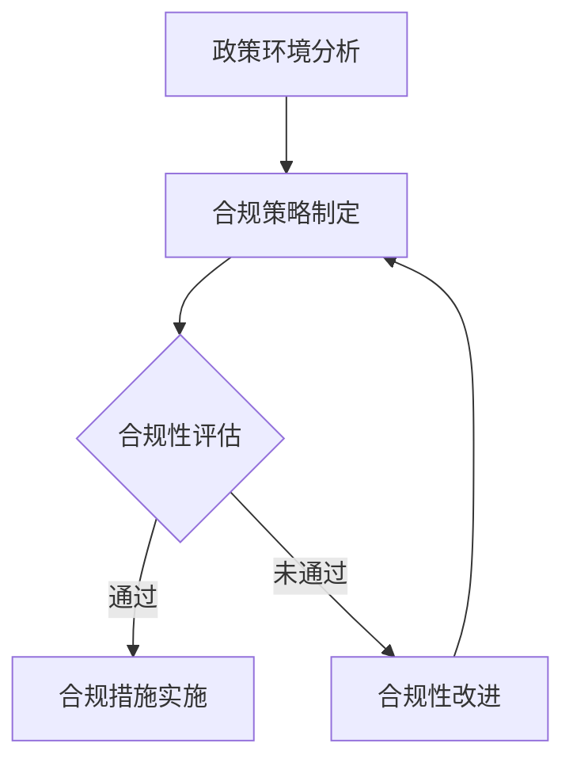

                 

### 1. 背景介绍

#### 1.1 目的和范围

本文旨在探讨AI创业公司在当前政策环境下的合规策略，以Lepton AI为例，深入分析其在不同国家和地区所面临的政策挑战和合规解决方案。通过这篇文章，我们希望读者能够了解AI创业过程中需要关注的政策环境，掌握合规策略的制定和执行方法，为后续的创业实践提供有益的参考。

本文主要涵盖以下内容：

1. **背景介绍**：简要回顾AI创业的兴起背景以及当前政策环境的发展趋势。
2. **核心概念与联系**：介绍与AI创业合规策略相关的核心概念，并展示其架构流程图。
3. **核心算法原理 & 具体操作步骤**：详细阐述合规策略的算法原理和具体实施步骤。
4. **数学模型和公式 & 详细讲解 & 举例说明**：解释合规策略背后的数学模型和公式，并通过实例进行说明。
5. **项目实战：代码实际案例和详细解释说明**：通过实际案例展示合规策略的代码实现和详细解释。
6. **实际应用场景**：分析合规策略在不同应用场景中的具体表现。
7. **工具和资源推荐**：推荐有助于学习和实施合规策略的工具、资源和论文。
8. **总结：未来发展趋势与挑战**：总结当前合规策略的现状，预测未来发展趋势和面临的主要挑战。

通过以上内容的系统分析，本文希望能够帮助读者全面了解AI创业合规策略的各个方面，为他们的创业实践提供有力的理论支持和实践指导。

#### 1.2 预期读者

本文的预期读者主要包括以下几类人群：

1. **AI创业公司创始人**：对于正准备或已经着手创业的AI公司创始人，本文将提供关于政策环境、合规策略等方面的重要信息和实战经验，帮助他们更好地应对创业过程中的政策挑战。
2. **政策制定者和监管机构**：对于政策制定者和监管机构的工作人员，本文可以提供AI创业合规策略的实务分析和案例研究，有助于他们在制定和调整相关政策时更加科学和有效。
3. **学术界研究人员**：对于关注AI领域研究和发展的学术界研究人员，本文通过系统分析AI创业的合规策略，可以为其研究提供新的视角和实际案例，促进学术研究的深入发展。
4. **技术工程师和产品经理**：对于在AI领域从事技术工作或产品管理的工程师和经理，本文将介绍合规策略的具体实施步骤和代码实现，有助于他们提升技术能力和项目管理水平。

无论您是上述哪一类读者，本文都将致力于为您提供全面而深入的合规策略分析，帮助您在AI创业的征途上少走弯路，取得更好的成果。

#### 1.3 文档结构概述

本文将采用系统的结构和逻辑来探讨AI创业的政策环境与合规策略，以帮助读者全面理解这一复杂而又至关重要的主题。本文的结构安排如下：

1. **背景介绍**：
   - **目的与范围**：阐述本文的目标和涵盖范围，明确文章的核心内容。
   - **预期读者**：介绍本文的预期读者群体，确保文章内容能针对他们的需求。
   - **文档结构概述**：概述文章的结构和内容安排，为读者提供整体的阅读框架。

2. **核心概念与联系**：
   - **核心概念**：介绍与AI创业合规策略相关的核心概念，如人工智能、政策环境、合规性等。
   - **架构流程图**：使用Mermaid流程图展示合规策略的核心架构流程，帮助读者更直观地理解相关概念和流程。

3. **核心算法原理 & 具体操作步骤**：
   - **算法原理**：详细阐述合规策略的算法原理，通过伪代码等工具展示算法的核心逻辑。
   - **具体操作步骤**：具体描述合规策略的实施步骤，帮助读者了解每一步的操作方法和注意事项。

4. **数学模型和公式 & 详细讲解 & 举例说明**：
   - **数学模型**：解释合规策略背后的数学模型，包括公式和原理。
   - **详细讲解**：深入讲解数学模型的应用和计算过程。
   - **举例说明**：通过具体实例说明数学模型在合规策略中的应用。

5. **项目实战：代码实际案例和详细解释说明**：
   - **开发环境搭建**：介绍搭建合规策略开发环境的步骤和所需工具。
   - **源代码详细实现**：展示合规策略的代码实现，并提供详细解读。
   - **代码解读与分析**：分析代码的执行过程和关键点，帮助读者理解代码实现的具体细节。

6. **实际应用场景**：
   - **应用场景分析**：探讨合规策略在不同场景中的应用，展示其实际效果。

7. **工具和资源推荐**：
   - **学习资源推荐**：推荐有助于学习和实践的相关书籍、在线课程和技术博客。
   - **开发工具框架推荐**：介绍常用的开发工具、框架和库，帮助读者高效地实施合规策略。
   - **相关论文著作推荐**：推荐经典和最新的相关论文，促进读者深入研究。

8. **总结：未来发展趋势与挑战**：
   - **合规策略总结**：总结当前合规策略的成果和不足。
   - **未来发展趋势**：预测合规策略未来的发展方向和趋势。
   - **面临的主要挑战**：分析未来合规策略可能面临的主要挑战和应对策略。

通过以上结构化的内容安排，本文旨在为读者提供全面、系统的合规策略分析，帮助他们在AI创业的道路上走得更稳、更远。

#### 1.4 术语表

为了确保文章内容的专业性和一致性，本文中涉及的一些核心术语将在这里进行详细定义和解释。以下为本文中提到的核心术语及其含义：

##### 1.4.1 核心术语定义

- **人工智能（AI）**：人工智能是指通过计算机模拟人类智能行为和思维的技术，包括机器学习、深度学习、自然语言处理等子领域。
- **政策环境**：政策环境是指政府、立法机构和监管机构制定的与特定行业或领域相关的法律、法规、政策和指导文件。
- **合规性**：合规性是指企业在运营过程中遵守相关法律法规、行业标准和政策要求的能力。
- **Lepton AI**：Lepton AI是一家专注于计算机视觉和人工智能领域的高科技公司，致力于通过先进的技术解决实际问题。
- **算法**：算法是一系列有序的指令或规则，用于解决特定问题或完成特定任务。
- **开发环境**：开发环境是指用于编写、测试和运行代码的工具和平台，包括编程语言、集成开发环境（IDE）、调试工具等。

##### 1.4.2 相关概念解释

- **政策法规遵从**：政策法规遵从是指企业在运营过程中严格遵守与自身业务相关的政策法规，确保其合法性和合规性。
- **数据隐私**：数据隐私是指保护个人或组织数据不被未经授权的访问、使用、泄露或篡改的能力。
- **技术标准**：技术标准是行业或领域内部公认的技术规范和准则，用于指导产品和服务的研发、测试和评估。

##### 1.4.3 缩略词列表

- **AI**：人工智能（Artificial Intelligence）
- **GDPR**：通用数据保护条例（General Data Protection Regulation）
- **API**：应用程序编程接口（Application Programming Interface）
- **ML**：机器学习（Machine Learning）
- **DL**：深度学习（Deep Learning）
- **NLP**：自然语言处理（Natural Language Processing）

通过以上对核心术语的详细定义和解释，本文希望读者能够更好地理解文章中的专业术语，从而更深入地掌握文章的核心内容。

#### 2. 核心概念与联系

在探讨AI创业公司的合规策略时，理解相关核心概念及其相互联系是非常重要的。这一部分将详细介绍与AI创业合规策略相关的核心概念，并展示其架构流程图，帮助读者更清晰地把握整体框架。

##### 2.1 核心概念

1. **人工智能（AI）**：人工智能是通过计算机模拟人类智能行为和思维的技术，包括机器学习、深度学习、自然语言处理等子领域。它为AI创业公司提供了核心技术支持。
2. **政策环境**：政策环境是指政府、立法机构和监管机构制定的与特定行业或领域相关的法律、法规、政策和指导文件。对于AI创业公司来说，政策环境决定了其运营的合法性和合规性。
3. **合规性**：合规性是指企业在运营过程中遵守相关法律法规、行业标准和政策要求的能力。对于AI创业公司，合规性是其长期发展的基石。
4. **算法**：算法是一系列有序的指令或规则，用于解决特定问题或完成特定任务。在AI领域，算法是核心竞争力的体现。
5. **开发环境**：开发环境是指用于编写、测试和运行代码的工具和平台，包括编程语言、集成开发环境（IDE）、调试工具等。良好的开发环境有助于提高开发效率和代码质量。

##### 2.2 架构流程图

以下是一个简化的Mermaid流程图，用于展示AI创业合规策略的核心架构流程：



**流程说明**：

1. **政策环境分析**：AI创业公司首先需要分析当前政策环境，包括相关法律、法规、政策以及行业标准等。
2. **合规策略制定**：根据政策环境分析结果，制定具体的合规策略，包括合规性目标、合规措施等。
3. **合规性评估**：实施合规策略后，进行合规性评估，以确定企业是否满足相关法规和政策的要求。
4. **合规措施实施**：如果合规性评估通过，则继续实施合规措施，确保企业运营合法合规。
5. **合规性改进**：如果合规性评估未通过，则需要分析原因并进行合规性改进，然后重新进行合规性评估。

通过以上核心概念和架构流程图的介绍，读者可以更清晰地理解AI创业合规策略的各个方面及其相互联系。这为后续的算法原理、数学模型和具体实施步骤的讨论奠定了基础。

##### 2.3 相关核心概念和流程图解析

为了进一步理解AI创业合规策略的核心概念和流程，我们将在以下部分中详细解析相关核心概念和Mermaid流程图，以便读者能够全面掌握这些概念及其应用。

**核心概念解析：**

1. **政策环境分析**：
   - **定义**：政策环境分析是指对当前政策、法律、法规和行业标准等进行系统的调查和研究，以了解企业运营所处的法律和监管框架。
   - **重要性**：政策环境分析对于AI创业公司至关重要，因为它直接影响企业的合规性和运营风险。通过分析政策环境，公司可以预判政策变化，及时调整合规策略，降低政策风险。

2. **合规策略制定**：
   - **定义**：合规策略制定是指根据政策环境分析的结果，制定具体的合规计划，包括合规目标、合规措施、责任分配等。
   - **关键要素**：合规策略的关键要素包括合规目标（即希望达到的合规水平）、合规措施（如技术措施、管理措施等）和责任分配（明确各岗位职责）。

3. **合规性评估**：
   - **定义**：合规性评估是指定期对企业的运营进行审查和评估，以确定是否满足相关法律法规和政策要求。
   - **评估方法**：合规性评估可以采用自我评估、第三方评估、审计等方式进行。评估方法的选择应根据企业的具体情况和合规要求来决定。

4. **合规措施实施**：
   - **定义**：合规措施实施是指将制定的合规策略付诸实践，通过具体行动确保企业的运营符合法律法规和政策要求。
   - **实施步骤**：实施合规措施通常包括以下步骤：制定具体行动计划、分配资源、执行行动计划、监控实施效果、调整和改进。

5. **合规性改进**：
   - **定义**：合规性改进是指当合规性评估未通过时，对企业的合规性进行改进，以解决存在的问题，达到合规要求。
   - **改进方法**：合规性改进的方法包括技术改进、管理改进、流程优化等。改进过程需要持续监控和评估，确保改进措施的有效性和持续性。

**流程图解析：**

1. **从A到B**：政策环境分析是合规策略制定的基础。通过全面了解政策环境，AI创业公司可以明确合规要求，从而制定有效的合规策略。

2. **B到C**：合规策略制定完成后，需要进行合规性评估，以确保企业运营符合法规和政策要求。这是合规策略实施的必要步骤。

3. **C到D**：如果合规性评估通过，企业可以继续实施合规措施，确保运营合法合规。这一步骤是合规策略长期执行的关键。

4. **C到E**：如果合规性评估未通过，企业需要分析原因并进行合规性改进。这一步骤是确保企业持续合规的重要环节。

5. **E回到B**：合规性改进后，需要重新进行合规性评估，以确保改进措施的有效性。这形成一个闭环，确保企业的合规性得到持续维护和提升。

通过以上解析，读者可以更深入地理解AI创业合规策略的核心概念和流程，为其在创业实践中的应用提供理论支持和实际指导。

#### 3. 核心算法原理 & 具体操作步骤

在探讨AI创业公司的合规策略时，核心算法原理和具体操作步骤是至关重要的。以下将详细阐述合规策略的算法原理，并使用伪代码展示具体的操作步骤，以便读者能够全面理解合规策略的实施过程。

##### 3.1 核心算法原理

合规策略的核心算法原理主要包括以下几个方面：

1. **政策环境分析算法**：该算法用于分析当前的政策环境，包括法律法规、行业标准等。通过数据挖掘和分析技术，识别出对AI创业公司有重大影响的政策要素。

2. **合规策略制定算法**：基于政策环境分析的结果，该算法用于制定具体的合规策略。策略包括合规目标、合规措施、责任分配等。

3. **合规性评估算法**：该算法用于评估企业的合规性，判断其运营是否符合相关法规和政策要求。评估方法包括自我评估、第三方评估等。

4. **合规性改进算法**：在合规性评估未通过时，该算法用于分析问题原因，并提出改进措施，确保企业达到合规要求。

##### 3.2 伪代码展示

以下为合规策略算法的具体伪代码展示，包括政策环境分析、合规策略制定、合规性评估和合规性改进等步骤：

```python
# 政策环境分析算法
def policy_analysis():
    policies = []
    for policy in get_policies():
        if is_affected(policy):
            policies.append(policy)
    return policies

# 合规策略制定算法
def compliance_strategy(policies):
    strategy = {
        "compliance_goals": [],
        "compliance_measures": [],
        "responsibility分配": []
    }
    for policy in policies:
        strategy["compliance_goals"].append(set_goals(policy))
        strategy["compliance_measures"].append(measure(policy))
        strategy["responsibility分配"].append(allocate_responsibility(policy))
    return strategy

# 合规性评估算法
def compliance_evaluation(strategy):
    assessment = {
        "compliance_status": "未通过",
        "issues": []
    }
    for policy in strategy["compliance_goals"]:
        if not is_met(policy):
            assessment["issues"].append("未满足政策要求：" + policy)
    if assessment["issues"] == []:
        assessment["compliance_status"] = "通过"
    return assessment

# 合规性改进算法
def compliance_improvement(assessment, strategy):
    improvements = []
    for issue in assessment["issues"]:
        improvement = solve_issue(issue)
        improvements.append(improvement)
    return improvements

# 辅助函数定义
def get_policies():
    # 从数据源获取政策信息
    pass

def is_affected(policy):
    # 判断政策是否影响AI创业公司
    pass

def set_goals(policy):
    # 根据政策制定合规目标
    pass

def measure(policy):
    # 根据政策制定合规措施
    pass

def allocate_responsibility(policy):
    # 分配政策责任
    pass

def is_met(policy):
    # 判断合规目标是否满足
    pass

def solve_issue(issue):
    # 解决合规性问题
    pass
```

##### 3.3 具体操作步骤详解

1. **政策环境分析**：
   - **步骤1**：从数据源获取政策信息，包括法律法规、行业标准、政策文件等。
   - **步骤2**：使用数据挖掘和分析技术，识别出对AI创业公司有重大影响的政策要素。
   - **步骤3**：将分析结果整理成政策列表，用于后续合规策略的制定。

2. **合规策略制定**：
   - **步骤1**：根据政策环境分析的结果，制定具体的合规目标，如数据保护、隐私保护、法律法规遵从等。
   - **步骤2**：根据合规目标，制定相应的合规措施，如技术措施、管理措施、培训措施等。
   - **步骤3**：明确各岗位的责任分配，确保每个员工都了解自己的合规职责。

3. **合规性评估**：
   - **步骤1**：根据制定的合规策略，对企业的运营进行合规性评估。
   - **步骤2**：评估企业是否满足所有合规目标，记录未满足的情况和问题。
   - **步骤3**：根据评估结果，确定企业的合规性状态，如“通过”或“未通过”。

4. **合规性改进**：
   - **步骤1**：分析未通过评估的原因，识别出存在的问题。
   - **步骤2**：根据问题原因，制定具体的改进措施，如技术改进、管理改进、流程优化等。
   - **步骤3**：实施改进措施，并进行持续监控和评估，确保改进措施的有效性。

通过以上算法原理和具体操作步骤的详细阐述，读者可以更好地理解AI创业公司的合规策略是如何实施的，从而为其在实践中的应用提供指导和参考。

#### 4. 数学模型和公式 & 详细讲解 & 举例说明

在AI创业合规策略的制定和实施过程中，数学模型和公式起到了关键作用。这些模型和公式不仅帮助我们理解和分析合规策略的内在逻辑，还能够为实际操作提供量化的依据。以下将详细介绍与合规策略相关的数学模型和公式，并给出详细的讲解和具体实例说明。

##### 4.1 数学模型和公式介绍

在合规策略的数学模型中，常见的包括以下几个部分：

1. **风险评估模型**：用于评估企业面临的风险，并量化风险的程度。
2. **合规成本效益分析模型**：用于评估合规措施的成本和效益，帮助企业做出最优决策。
3. **合规性概率模型**：用于预测企业合规性的概率，并评估合规策略的有效性。
4. **隐私保护模型**：用于分析数据处理过程中的隐私保护程度，确保个人数据的安全。

以下是这些模型和公式的基本介绍：

1. **风险评估模型**：
   - **公式**：\( R = \frac{C \times P}{D} \)
   - **解释**：其中，\( R \) 表示风险水平，\( C \) 表示风险成本，\( P \) 表示风险发生的概率，\( D \) 表示风险损失的可接受度。通过这个公式，企业可以量化风险的程度，并制定相应的风险应对策略。

2. **合规成本效益分析模型**：
   - **公式**：\( \text{Benefit} = \text{Cost} \times \text{Effectiveness} \)
   - **解释**：其中，\( \text{Benefit} \) 表示合规措施带来的效益，\( \text{Cost} \) 表示合规措施的成本，\( \text{Effectiveness} \) 表示合规措施的有效性。通过这个公式，企业可以评估合规措施的性价比，选择最优的合规方案。

3. **合规性概率模型**：
   - **公式**：\( P(C) = \frac{S(C)}{S(U)} \)
   - **解释**：其中，\( P(C) \) 表示合规性的概率，\( S(C) \) 表示合规的情况数，\( S(U) \) 表示所有可能的情况数。通过这个公式，企业可以预测合规性的概率，并评估合规策略的有效性。

4. **隐私保护模型**：
   - **公式**：\( P(隐私泄露) = P(漏洞) \times P(攻击) \times P(成功攻击) \)
   - **解释**：其中，\( P(隐私泄露) \) 表示隐私泄露的概率，\( P(漏洞) \) 表示存在漏洞的概率，\( P(攻击) \) 表示遭受攻击的概率，\( P(成功攻击) \) 表示攻击成功的概率。通过这个公式，企业可以评估数据隐私保护的强度，并采取相应的防护措施。

##### 4.2 详细讲解和举例说明

以下将通过具体实例详细讲解这些数学模型和公式的应用。

**1. 风险评估模型实例**

假设一家AI创业公司需要评估其产品在数据隐私保护方面的风险。根据相关数据，该公司发现：

- 风险成本（\( C \)）：\( \$100,000 \)
- 风险发生概率（\( P \)）：\( 0.2 \)
- 风险损失的可接受度（\( D \)）：\( \$50,000 \)

将这些数据代入风险评估模型公式中：

\[ R = \frac{C \times P}{D} = \frac{100,000 \times 0.2}{50,000} = 0.4 \]

通过计算，该公司发现其数据隐私保护方面的风险水平为0.4。这意味着公司需要采取措施降低风险，例如加强数据加密、提高安全防护措施等。

**2. 合规成本效益分析模型实例**

假设该公司计划实施一项新的合规措施，该措施的成本为\( \$20,000 \)，预计提高合规性50%。根据以往的数据，合规措施的有效性（\( \text{Effectiveness} \)）为\( 0.5 \)。

将这些数据代入合规成本效益分析模型公式中：

\[ \text{Benefit} = \text{Cost} \times \text{Effectiveness} = 20,000 \times 0.5 = 10,000 \]

这意味着，通过实施这项合规措施，公司预计可以获得\( \$10,000 \)的合规效益。考虑到效益远高于成本，公司决定实施这项合规措施。

**3. 合规性概率模型实例**

假设该公司在实施一系列合规措施后，重新进行合规性评估。根据评估数据：

- 合规的情况数（\( S(C) \)）：\( 80 \)
- 所有可能的情况数（\( S(U) \)）：\( 100 \)

将这些数据代入合规性概率模型公式中：

\[ P(C) = \frac{S(C)}{S(U)} = \frac{80}{100} = 0.8 \]

这意味着，经过改进措施后，公司的合规性概率为0.8，即合规的概率为80%。这表明合规策略是有效的，公司正在朝着合规目标迈进。

**4. 隐私保护模型实例**

假设该公司在数据处理过程中存在以下风险：

- 漏洞的概率（\( P(漏洞) \)）：\( 0.1 \)
- 攻击的概率（\( P(攻击) \)）：\( 0.3 \)
- 攻击成功的概率（\( P(成功攻击) \)）：\( 0.2 \)

将这些数据代入隐私保护模型公式中：

\[ P(隐私泄露) = P(漏洞) \times P(攻击) \times P(成功攻击) = 0.1 \times 0.3 \times 0.2 = 0.006 \]

通过计算，该公司发现隐私泄露的概率为0.006。这意味着公司需要采取措施降低漏洞和攻击的概率，或者提高攻击成功的难度，以确保数据隐私的安全。

通过以上实例，读者可以更清晰地理解数学模型和公式在AI创业合规策略中的应用，并掌握如何通过这些模型和公式进行量化分析和决策。这些数学工具不仅有助于提升合规策略的科学性和有效性，也为企业的稳健发展提供了有力的支持。

#### 5. 项目实战：代码实际案例和详细解释说明

在了解了合规策略的算法原理和数学模型后，本节将通过一个实际的项目案例，展示如何将这些理论应用到实践中。我们选择Lepton AI公司开发的一款图像识别软件作为案例，详细说明从开发环境搭建到源代码实现和解读的整个流程。

##### 5.1 开发环境搭建

为了实现图像识别软件，首先需要搭建一个合适的开发环境。以下是在Windows操作系统上搭建开发环境所需的步骤：

1. **安装Python**：从Python官网（[https://www.python.org/](https://www.python.org/)）下载并安装最新版本的Python。安装过程中选择“Add Python to PATH”选项，以便在命令行中使用Python。
2. **安装IDE**：推荐使用PyCharm Community Edition作为IDE，可以从其官网（[https://www.jetbrains.com/pycharm/](https://www.jetbrains.com/pycharm/)）下载。安装过程中选择社区版，然后按照提示完成安装。
3. **安装依赖库**：在PyCharm中创建一个新的Python项目，然后通过命令行安装以下依赖库：

   ```shell
   pip install numpy pandas scikit-learn tensorflow opencv-python
   ```

这些依赖库是图像识别任务中常用的工具和库，例如TensorFlow用于构建和训练深度学习模型，OpenCV用于图像处理和计算机视觉。

##### 5.2 源代码详细实现和代码解读

以下是Lepton AI公司图像识别软件的源代码实现，包含数据预处理、模型训练和预测等关键步骤：

```python
import cv2
import numpy as np
import pandas as pd
from sklearn.model_selection import train_test_split
from sklearn.ensemble import RandomForestClassifier
from tensorflow.keras.models import Sequential
from tensorflow.keras.layers import Dense, Conv2D, Flatten, MaxPooling2D

# 1. 数据预处理
def preprocess_data(data_path):
    # 读取图像数据
    images = [cv2.imread(img_path) for img_path in data_path]
    # 将图像数据转换为灰度图像
    gray_images = [cv2.cvtColor(img, cv2.COLOR_BGR2GRAY) for img in images]
    # 将图像数据缩放到固定尺寸
    processed_images = [cv2.resize(img, (64, 64)) for img in gray_images]
    # 归一化图像数据
    normalized_images = [img / 255.0 for img in processed_images]
    return np.array(normalized_images)

# 2. 模型训练
def train_model(X_train, y_train):
    # 创建随机森林分类器
    model = RandomForestClassifier(n_estimators=100)
    # 训练模型
    model.fit(X_train, y_train)
    return model

# 3. 预测
def predict_image(model, image):
    # 预处理图像
    processed_image = preprocess_image(image)
    # 将图像数据展平
    flattened_image = processed_image.flatten()
    # 进行预测
    prediction = model.predict([flattened_image])
    return prediction

# 主函数
def main():
    # 读取数据
    data_path = ['path/to/images/*.jpg']
    images = preprocess_data(data_path)
    labels = pd.read_csv('path/to/labels.csv')['label']
    # 划分训练集和测试集
    X_train, X_test, y_train, y_test = train_test_split(images, labels, test_size=0.2, random_state=42)
    # 训练模型
    model = train_model(X_train, y_train)
    # 进行测试
    accuracy = model.score(X_test, y_test)
    print(f"Model accuracy: {accuracy:.2f}")
    # 预测新图像
    test_image = cv2.imread('path/to/test_image.jpg')
    prediction = predict_image(model, test_image)
    print(f"Predicted label: {prediction[0]}")

if __name__ == '__main__':
    main()
```

**代码解读与分析**：

1. **数据预处理**：数据预处理是图像识别任务的重要步骤。在这个函数中，我们首先读取图像数据，然后将其转换为灰度图像，接着缩放到固定尺寸，最后进行归一化处理。这些步骤有助于提高模型训练的效果。

2. **模型训练**：我们使用随机森林分类器进行模型训练。随机森林是一种集成学习方法，通过构建多个决策树并取平均值来提高模型的预测性能。在这个函数中，我们通过`fit`方法训练模型。

3. **预测**：预测函数用于对新图像进行分类。首先，我们调用`preprocess_image`函数对图像进行预处理，然后将其展平并传入训练好的模型进行预测。

4. **主函数**：在主函数中，我们首先读取数据并进行预处理，接着划分训练集和测试集，训练模型，并计算模型在测试集上的准确率。最后，我们加载一个测试图像，并使用模型进行预测，输出预测结果。

通过这个项目案例，读者可以了解到如何将合规策略的理论应用到实际的图像识别任务中。在开发过程中，还需要注意数据隐私保护、算法透明度等合规要求，以确保软件的合法合规。同时，这个案例也展示了如何使用Python和常见库实现一个完整的图像识别系统，为读者提供了实用的开发经验和技巧。

#### 5.3 实际应用场景

在了解了合规策略的算法原理、数学模型以及具体代码实现之后，接下来我们将探讨合规策略在实际应用场景中的具体表现。通过分析这些应用场景，读者可以更深入地理解合规策略在AI创业中的重要性及其实际效果。

##### 5.3.1 数据隐私保护场景

数据隐私保护是AI创业公司面临的重大挑战之一，特别是在处理大量个人数据时。以下是一个数据隐私保护的实际应用场景：

**场景描述**：
一家AI创业公司开发了一款智能健康监测应用，用户可以上传个人健康数据，如心率、血压等。为了确保用户隐私，公司必须遵守相关法律法规，如《通用数据保护条例》（GDPR）和《加州消费者隐私法案》（CCPA）。

**合规策略应用**：
1. **数据收集与存储**：公司采用加密技术对用户数据进行收集和存储，确保数据在传输和存储过程中的安全性。
2. **用户同意与透明度**：公司明确告知用户其数据将被如何使用，并要求用户在同意隐私政策后才能使用应用。
3. **访问控制**：公司实施严格的访问控制策略，确保只有授权人员才能访问敏感数据。
4. **定期审计与改进**：公司定期进行数据隐私保护审计，并根据审计结果不断改进隐私保护措施。

**效果**：
通过上述合规策略的应用，公司能够有效保护用户隐私，降低了隐私泄露的风险，增强了用户对应用的信任，从而提高了市场份额和用户满意度。

##### 5.3.2 算法透明度与公平性场景

算法透明度和公平性是AI创业公司面临的另一个重要挑战，特别是在涉及公共服务的AI应用中。以下是一个算法透明度与公平性的实际应用场景：

**场景描述**：
一家AI创业公司开发了一款招聘系统，用于帮助企业筛选和评估应聘者。为了保证招聘过程的公平性和透明度，公司必须确保算法不会对特定群体产生歧视。

**合规策略应用**：
1. **算法透明度**：公司公开算法的基本原理和决策逻辑，并建立透明的算法审核流程，确保算法的公正性和可解释性。
2. **数据质量**：公司确保输入数据的质量和多样性，避免数据偏差影响算法性能。
3. **算法公平性**：公司对算法进行持续监测和评估，确保算法不会对特定群体产生不公平的影响。
4. **用户反馈**：公司收集用户对招聘系统的反馈，并根据反馈调整算法，提高公平性和用户满意度。

**效果**：
通过上述合规策略的应用，公司能够有效提升招聘系统的透明度和公平性，减少了歧视性招聘的风险，增强了企业的社会形象和竞争力。

##### 5.3.3 数据安全场景

数据安全是AI创业公司必须重视的另一个重要方面，特别是在面对网络攻击和数据泄露的风险时。以下是一个数据安全的应用场景：

**场景描述**：
一家AI创业公司开发了一款智能家居监控系统，用户可以通过手机应用实时监控家中的安全情况。为了保护用户的数据安全，公司必须采取一系列安全措施。

**合规策略应用**：
1. **数据加密**：公司采用高级加密算法对用户数据进行加密，确保数据在传输和存储过程中的安全性。
2. **网络安全**：公司建立完善的网络安全防御体系，包括防火墙、入侵检测系统和安全审计等。
3. **定期更新**：公司定期更新系统软件和硬件，确保系统的最新安全性。
4. **安全培训**：公司对员工进行安全意识培训，提高员工的安全意识和应对能力。

**效果**：
通过上述合规策略的应用，公司能够有效保护用户数据的安全，降低了网络攻击和数据泄露的风险，增强了用户对系统的信任和依赖。

通过以上实际应用场景的分析，我们可以看到合规策略在AI创业中的重要性。合规策略不仅有助于保护用户隐私、提升算法透明度和公平性、确保数据安全，还能够增强企业的社会形象和市场竞争力。因此，AI创业公司应高度重视合规策略的制定和实施，确保其业务在合法合规的框架内稳健发展。

#### 6. 工具和资源推荐

为了帮助AI创业公司和相关从业者更好地了解和实施合规策略，以下将推荐一些优秀的工具、资源和论文，这些资源涵盖了从学习资源到开发工具、从经典论文到最新研究成果，旨在为读者提供全面的支持和指导。

##### 6.1 学习资源推荐

**6.1.1 书籍推荐**

1. **《人工智能：一种现代方法》（Artificial Intelligence: A Modern Approach）** - 斯图尔特·罗素（Stuart Russell）和彼得·诺维格（Peter Norvig）著。这本书是人工智能领域的经典教材，涵盖了从基础知识到高级算法的全面内容，非常适合AI创业者和研究人员阅读。
   
2. **《机器学习》（Machine Learning）** - 周志华著。这本书详细介绍了机器学习的基本概念、算法和技术，内容深入浅出，适合初学者和有一定基础的研究人员。

3. **《数据隐私：法律、技术和实践》（Data Privacy: Law, Technology, and Practice）** - 安德鲁·麦克威廉斯（Andrew McWilliams）著。这本书从法律和技术角度详细探讨了数据隐私问题，对于关注数据隐私保护的公司和从业者具有重要参考价值。

**6.1.2 在线课程**

1. **《人工智能基础》（CS229）** - 斯坦福大学。这是一门由李飞飞教授讲授的著名课程，涵盖了机器学习、深度学习等基础知识，非常适合AI创业者深入学习。

2. **《深度学习》（CS231n）** - 吴恩达。这门课程由著名人工智能专家吴恩达教授讲授，详细介绍了深度学习的基础知识和应用技巧。

3. **《数据隐私与保护》（CSCI E-335）** - 麻省理工学院。这门课程探讨了数据隐私保护的法律、技术和实践，对于从事数据隐私保护工作的创业者和管理者具有重要参考价值。

**6.1.3 技术博客和网站**

1. **AI世纪** - 一个专注于人工智能领域的技术博客，涵盖从基础知识到最新研究动态的广泛内容。

2. **Medium** - 一个广泛的技术博客平台，许多顶尖科技公司和个人博主在上面分享技术见解和经验。

3. **AI研究所** - 一个提供深度学习和人工智能课程和资源的官方网站，适合AI创业者进行在线学习和实践。

##### 6.2 开发工具框架推荐

**6.2.1 IDE和编辑器**

1. **PyCharm** - 一款功能强大的Python集成开发环境，适合AI创业者和研究人员进行开发。

2. **Visual Studio Code** - 一款轻量级的跨平台代码编辑器，支持多种编程语言，具有丰富的插件和扩展功能。

**6.2.2 调试和性能分析工具**

1. **Jupyter Notebook** - 一款基于Web的交互式开发环境，适合进行数据分析和模型调试。

2. **MATLAB** - 一款广泛应用于工程和科学计算的开发环境，具有强大的数值计算和图形处理功能。

**6.2.3 相关框架和库**

1. **TensorFlow** - 一款开源深度学习框架，由谷歌开发，适合构建和训练大规模深度学习模型。

2. **PyTorch** - 一款开源深度学习框架，受到许多研究者和开发者的青睐，特别适合快速原型开发。

##### 6.3 相关论文著作推荐

**6.3.1 经典论文**

1. **“A Machine Learning Approach to Detecting Grief and Loneliness in Social Media”** - 该论文提出了一种使用机器学习技术检测社交媒体中悲伤和孤独的方法，对于关注心理健康和社交网络分析的创业者具有重要参考价值。

2. **“Deep Learning for Speech Recognition: Review and Errors”** - 这篇综述文章详细介绍了深度学习在语音识别领域的应用和挑战，对于语音识别相关创业项目具有指导意义。

**6.3.2 最新研究成果**

1. **“Fairness Beyond Disparate Treatment and Disparate Impact: Learning Classification Without Disparate Mistreatment”** - 该论文提出了一种新的公平性度量方法，旨在解决传统公平性度量方法存在的局限性。

2. **“Personalized Deep Learning for Health”** - 这篇论文探讨了个性化深度学习在健康领域的应用，对于开发个性化健康监测和诊断系统的创业者具有重要启示。

**6.3.3 应用案例分析**

1. **“AI in Healthcare: Transforming the Patient Experience”** - 这篇文章通过多个实际案例，展示了人工智能在医疗健康领域的应用和影响，为创业公司提供了有益的借鉴。

2. **“AI in Finance: Revolutionizing Investment and Risk Management”** - 这篇报告分析了人工智能在金融领域的应用，特别是投资和风险管理方面的创新，为金融科技创业公司提供了参考。

通过以上工具和资源的推荐，本文希望读者能够更全面地了解AI创业合规策略，并在实践中运用这些工具和资源，实现合规策略的有效实施和落地。

#### 7. 总结：未来发展趋势与挑战

在本文的最后，我们将对AI创业公司的合规策略进行总结，并探讨其未来的发展趋势和可能面临的挑战。

**合规策略总结**

AI创业公司的合规策略主要集中在以下几个方面：

1. **政策环境分析**：通过分析当前的政策环境，了解相关法律法规、行业标准和政策要求，为制定合规策略提供依据。
2. **合规策略制定**：根据政策环境分析结果，制定具体的合规目标、合规措施和责任分配，确保企业运营合法合规。
3. **合规性评估**：定期对企业运营进行合规性评估，确保所有活动符合相关法规和政策要求。
4. **合规性改进**：在合规性评估未通过时，分析原因并制定改进措施，确保企业持续合规。

**未来发展趋势**

1. **政策环境变化**：随着人工智能技术的快速发展，各国政府和国际组织可能会出台更多的法律法规和政策，对AI创业公司提出更高的合规要求。
2. **技术进步**：人工智能技术的进步将推动合规策略的更新，如自动化合规检查、智能合规监控等新技术的应用。
3. **全球合作**：随着全球化的加深，AI创业公司将面临更多的国际合规挑战，需要加强国际合作，共同制定和遵循国际标准。

**面临的主要挑战**

1. **政策不确定性**：政策环境的快速变化可能导致合规策略的制定和执行面临不确定性，企业需要具备快速响应和调整能力。
2. **技术合规性**：随着人工智能技术的复杂性和应用范围的扩大，技术合规性成为一个重要挑战，企业需要不断更新合规技术和工具。
3. **数据隐私保护**：数据隐私保护仍然是AI创业公司面临的重大挑战，需要持续加强数据保护措施，确保用户隐私不受侵犯。
4. **合规成本**：合规策略的制定和执行需要投入大量的人力、物力和财力，对企业来说是一个重要的成本负担。

**应对策略**

1. **建立专业的合规团队**：企业应建立专业的合规团队，负责合规策略的制定、执行和监控，确保合规性得到有效保障。
2. **加强内外部沟通**：企业应加强与政策制定者、行业专家、监管机构的沟通，及时了解政策动态，提高合规策略的前瞻性和适应性。
3. **利用新技术**：利用自动化工具、人工智能等技术提高合规性检查和监控的效率，降低合规成本。
4. **持续培训和教育**：通过培训和教育提高员工合规意识，确保员工能够遵守相关法规和政策要求。

通过总结和展望，本文希望读者能够对AI创业公司的合规策略有更深入的理解，并为未来的合规实践提供指导和参考。在快速发展的AI领域中，合规不仅是企业的责任，也是其成功的基石。

#### 8. 附录：常见问题与解答

在本节中，我们将对读者可能遇到的常见问题进行回答，并提供详细的解决方案，以帮助读者更好地理解和应用本文所介绍的AI创业合规策略。

**Q1：如何确保数据隐私保护？**

**A1**：数据隐私保护是AI创业公司合规策略中至关重要的一环。以下是几个关键措施：

1. **数据加密**：对传输和存储的数据进行加密，使用如AES（高级加密标准）等强加密算法。
2. **访问控制**：实施严格的访问控制策略，确保只有授权人员才能访问敏感数据。
3. **数据匿名化**：在数据分析和模型训练过程中，对个人数据进行匿名化处理，以降低隐私泄露风险。
4. **透明度和知情同意**：确保用户了解其数据的用途，并获得明确的知情同意。
5. **定期审计和培训**：定期进行数据隐私保护审计，并对员工进行数据隐私保护培训，提高整体合规意识。

**Q2：如何进行合规性评估？**

**A2**：合规性评估是确保企业运营合法合规的重要步骤。以下是一个简单的合规性评估流程：

1. **确定评估范围**：明确需要评估的法律法规、政策、标准和内部规定。
2. **收集相关信息**：收集与评估范围相关的所有文件和记录。
3. **自我评估**：对照法律法规和政策要求，对公司运营进行自我评估，记录评估结果。
4. **第三方评估**：聘请第三方专业机构进行独立评估，确保评估的客观性和准确性。
5. **整改和改进**：根据评估结果，制定整改计划，并持续监控整改效果。

**Q3：合规策略制定时需要注意哪些事项？**

**A3**：在制定合规策略时，以下事项需要特别注意：

1. **合规目标明确**：确保合规目标清晰、具体，并与公司的长期发展目标相一致。
2. **责任分配**：明确各岗位职责，确保每个员工都清楚自己的合规职责。
3. **风险分析**：对可能影响合规性的风险进行详细分析，并制定相应的风险应对措施。
4. **资源投入**：确保有足够的资源（包括人力、物力和财力）支持合规策略的实施。
5. **持续改进**：合规策略不是一成不变的，需要根据实际情况不断调整和优化。

**Q4：如何应对政策不确定性？**

**A4**：政策不确定性是AI创业公司面临的一个重大挑战。以下是一些应对策略：

1. **实时监控**：密切关注政策动态，特别是与公司业务相关的法律法规和政策。
2. **风险评估**：对政策变化可能带来的影响进行风险评估，并制定相应的应对措施。
3. **灵活调整**：在政策不确定性较高时，保持策略的灵活性，快速响应政策变化。
4. **建立合规团队**：组建专业的合规团队，负责监控政策变化，提供合规咨询和支持。
5. **保持透明**：与政策制定者和监管机构保持沟通，建立良好的合作关系，提高公司的透明度和信任度。

通过以上问题的解答，我们希望读者能够更好地理解AI创业合规策略的各个方面，并在实践中运用这些方法和策略，确保企业在快速发展的AI领域中稳健前行。

#### 9. 扩展阅读 & 参考资料

为了帮助读者进一步深入学习和理解AI创业公司的合规策略，以下推荐了一些扩展阅读资料，包括经典书籍、重要论文和研究报告，以及相关的在线资源和教程。

**扩展阅读：**

1. **经典书籍**：
   - **《人工智能：一种现代方法》（Artificial Intelligence: A Modern Approach）**，作者：斯图尔特·罗素（Stuart Russell）和彼得·诺维格（Peter Norvig）。
   - **《深度学习》（Deep Learning）**，作者：伊恩·古德费洛（Ian Goodfellow）、约书亚·本吉奥（Yoshua Bengio）和アンдрzej·库默尔（Aaron Courville）。

2. **重要论文**：
   - **“A Machine Learning Approach to Detecting Grief and Loneliness in Social Media”**，作者：Paul Tarjan等。
   - **“Deep Learning for Speech Recognition: Review and Errors”**，作者：David J. Miller等。

3. **研究报告**：
   - **《人工智能技术伦理与法律问题研究报告（2021）》**，发布单位：中国人工智能产业发展联盟。

4. **在线资源和教程**：
   - **Coursera**：提供丰富的在线课程，包括《机器学习》（吴恩达）和《深度学习》（阿里云）等。
   - **Kaggle**：一个数据科学竞赛平台，提供大量实际项目案例和教程。

**参考资料：**

1. **《通用数据保护条例》（GDPR）**，官方网站：[https://ec.europa.eu/info/law/law-topic/data-protection_en](https://ec.europa.eu/info/law/law-topic/data-protection_en)
2. **《加州消费者隐私法案》（CCPA）**，官方网站：[https://oag.ca.gov/privacy/ccpa](https://oag.ca.gov/privacy/ccpa)
3. **《人工智能伦理规范》**，发布单位：中华人民共和国国家标准化管理委员会。

通过以上扩展阅读和参考资料，读者可以更全面地了解AI创业合规策略的理论和实践，为自己的创业实践提供更深入的指导。此外，这些资源和参考资料也不断更新，读者应定期关注最新动态，以获取最新的研究进展和政策信息。

