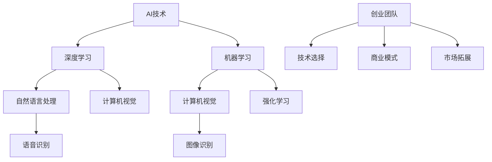

                 

# AI创业码头故事：95后创始人的选择

> **关键词：** AI创业、95后创始人、技术选择、商业模式、团队建设、成功案例

> **摘要：** 本文将深入探讨一位95后AI创业者的成长之路，分析他在技术选择、商业模式设计、团队建设和市场拓展等方面的决策过程，以及其成功的原因和面临的挑战。

## 1. 背景介绍

### 1.1 目的和范围

本文旨在通过分析一位95后AI创业者的案例，探讨在AI领域创业过程中，技术选择、商业模式、团队建设和市场拓展等方面的重要性。通过这篇案例分析，我们希望能够为有志于AI创业的年轻人提供一些有益的启示和参考。

### 1.2 预期读者

本文适合以下读者群体：

1. 有志于AI领域创业的年轻人
2. 对AI技术有浓厚兴趣的技术人员
3. 希望了解AI行业最新动态和趋势的从业者
4. 对创业过程和团队管理感兴趣的读者

### 1.3 文档结构概述

本文将分为以下几个部分：

1. 背景介绍：介绍文章的目的、预期读者、文档结构和相关术语。
2. 核心概念与联系：阐述AI领域的一些核心概念和联系，并使用Mermaid流程图展示。
3. 核心算法原理 & 具体操作步骤：详细讲解创业者在技术选择方面所做的决策。
4. 数学模型和公式 & 详细讲解 & 举例说明：介绍创业者在商业模式设计方面所采用的数学模型。
5. 项目实战：代码实际案例和详细解释说明。
6. 实际应用场景：探讨创业者在市场拓展方面所面临的挑战和应对策略。
7. 工具和资源推荐：推荐一些有助于学习和实践的资源和工具。
8. 总结：未来发展趋势与挑战。
9. 附录：常见问题与解答。
10. 扩展阅读 & 参考资料：提供更多相关阅读材料。

### 1.4 术语表

#### 1.4.1 核心术语定义

- AI创业：指在人工智能领域开展创业活动，通过技术、商业模式和市场拓展等方式实现商业价值。
- 95后创始人：指在1995年后出生的创业者。
- 技术选择：指在创业过程中，选择适合业务需求和发展方向的技术方案。
- 商业模式：指企业通过产品或服务实现盈利的方式。
- 团队建设：指在创业过程中，组建、管理和激励团队的过程。
- 市场拓展：指在创业过程中，开拓新市场、增加业务规模的过程。

#### 1.4.2 相关概念解释

- 人工智能（AI）：一种模拟人类智能行为的计算机技术，包括机器学习、深度学习、自然语言处理等领域。
- 深度学习（DL）：一种基于多层神经网络的人工智能技术，通过训练大量的数据来实现智能决策。
- 机器学习（ML）：一种让计算机通过数据自动学习的方法，从而实现智能化的过程。

#### 1.4.3 缩略词列表

- AI：人工智能
- DL：深度学习
- ML：机器学习

## 2. 核心概念与联系

在AI创业过程中，核心概念和联系至关重要。以下我们将使用Mermaid流程图展示一些核心概念及其相互关系。



- AI技术：包括深度学习、机器学习、自然语言处理、计算机视觉等领域。
- 深度学习：与计算机视觉和强化学习密切相关。
- 机器学习：与自然语言处理、计算机视觉、强化学习等领域相互联系。
- 创业团队：围绕技术选择、商业模式和市场拓展等方面进行协同工作。

通过上述核心概念和联系的阐述，我们为后续的技术选择、商业模式设计等讨论奠定了基础。

## 3. 核心算法原理 & 具体操作步骤

在AI创业过程中，技术选择是关键决策之一。以下我们将详细分析创业者在核心算法原理方面所做的具体操作步骤。

### 3.1 深度学习

创业者选择了深度学习作为核心技术，因为深度学习在图像识别、语音识别等任务中表现优异。以下是深度学习的核心原理和具体操作步骤：

#### 3.1.1 核心原理

- 深度学习基于多层神经网络，通过逐层提取特征来实现智能决策。
- 前向传播：将输入数据传递到神经网络，逐层计算得到输出。
- 反向传播：根据输出与实际结果之间的误差，反向调整网络权重，优化模型。

#### 3.1.2 具体操作步骤

1. 数据收集与预处理：收集大量图像、语音等数据，并进行预处理，如归一化、缩放等。
2. 构建神经网络模型：选择合适的神经网络结构，如卷积神经网络（CNN）、循环神经网络（RNN）等。
3. 模型训练：通过前向传播和反向传播，调整模型参数，优化模型性能。
4. 模型评估：使用验证集测试模型性能，调整模型参数，确保模型在实际应用中的表现优异。
5. 模型部署：将训练好的模型部署到生产环境中，实现实时预测和决策。

### 3.2 机器学习

在深度学习之外，创业者还选择了机器学习作为核心技术。以下是机器学习的核心原理和具体操作步骤：

#### 3.2.1 核心原理

- 机器学习通过训练数据集，使计算机自动识别数据中的规律，实现智能预测和决策。
- 监督学习：有标签的数据集进行训练，预测未知数据的标签。
- 无监督学习：无标签的数据集进行训练，发现数据中的潜在结构和规律。

#### 3.2.2 具体操作步骤

1. 数据收集与预处理：收集大量数据，并进行预处理，如去噪、缺失值填充等。
2. 特征提取：从原始数据中提取有用的特征，提高模型的泛化能力。
3. 模型选择：选择合适的机器学习算法，如线性回归、决策树、支持向量机等。
4. 模型训练：通过训练数据集，调整模型参数，优化模型性能。
5. 模型评估：使用验证集测试模型性能，调整模型参数，确保模型在实际应用中的表现优异。
6. 模型部署：将训练好的模型部署到生产环境中，实现实时预测和决策。

通过上述核心算法原理和具体操作步骤的阐述，我们为创业者在技术选择方面提供了清晰的指导。

## 4. 数学模型和公式 & 详细讲解 & 举例说明

在AI创业过程中，创业者需要掌握一定的数学模型和公式，以便更好地进行商业模式设计和决策。以下我们将介绍创业者所采用的数学模型和公式，并进行详细讲解和举例说明。

### 4.1 深度学习中的损失函数

深度学习中，损失函数用于衡量模型预测值与实际值之间的误差。以下是一个常见的损失函数——均方误差（MSE）：

$$
MSE = \frac{1}{n} \sum_{i=1}^{n} (y_i - \hat{y}_i)^2
$$

其中，$y_i$ 表示第 $i$ 个样本的实际值，$\hat{y}_i$ 表示第 $i$ 个样本的预测值，$n$ 表示样本总数。

#### 4.1.1 详细讲解

均方误差（MSE）是深度学习中常用的损失函数，它通过计算预测值与实际值之间的差的平方和来衡量模型的性能。MSE 越小，表示模型预测值与实际值越接近，模型性能越好。

#### 4.1.2 举例说明

假设有一个分类问题，数据集包含 100 个样本，使用神经网络模型进行预测。以下是预测值与实际值之间的均方误差：

$$
MSE = \frac{1}{100} \sum_{i=1}^{100} (y_i - \hat{y}_i)^2
$$

通过计算得到的均方误差为 0.1，表示模型预测值与实际值之间的误差较小。

### 4.2 机器学习中的分类评价指标

在机器学习中，分类评价指标用于衡量分类模型的性能。以下是一些常见的分类评价指标：

- 精确率（Precision）：表示预测为正例的样本中，实际为正例的占比。
- 召回率（Recall）：表示实际为正例的样本中，被预测为正例的占比。
- F1 分数（F1 Score）：表示精确率和召回率的调和平均。

$$
F1\ Score = \frac{2 \times Precision \times Recall}{Precision + Recall}
$$

#### 4.2.1 详细讲解

精确率和召回率是衡量分类模型性能的重要指标。精确率表示预测为正例的样本中，实际为正例的占比；召回率表示实际为正例的样本中，被预测为正例的占比。F1 分数是精确率和召回率的调和平均，能够更全面地评估分类模型的性能。

#### 4.2.2 举例说明

假设有一个二分类问题，数据集包含 100 个样本，其中正例样本有 60 个，预测结果如下：

- 预测为正例的样本：70 个
- 实际为正例的样本：60 个

根据上述数据，计算精确率、召回率和 F1 分数：

$$
Precision = \frac{60}{70} = 0.8571 \\
Recall = \frac{60}{100} = 0.6 \\
F1\ Score = \frac{2 \times 0.8571 \times 0.6}{0.8571 + 0.6} = 0.7143
$$

通过计算得到的精确率为 0.8571，召回率为 0.6，F1 分数为 0.7143，表示模型在预测正例样本方面的性能较为优秀。

通过以上数学模型和公式的详细讲解和举例说明，我们为创业者在商业模式设计方面提供了有力的支持。

## 5. 项目实战：代码实际案例和详细解释说明

为了更好地展示创业者在实际项目中的应用，以下我们将介绍一个实际案例，并详细解释代码的实现过程。

### 5.1 开发环境搭建

在项目开发过程中，创业者选择了 Python 作为主要编程语言，并使用了以下开发工具和库：

- Python 3.8
- TensorFlow 2.5
- Keras 2.5

开发者需要在本地安装 Python 和相关库，并配置好开发环境。

### 5.2 源代码详细实现和代码解读

以下是一个基于深度学习实现的图像分类项目的源代码，用于分类交通标志。

```python
import tensorflow as tf
from tensorflow.keras.models import Sequential
from tensorflow.keras.layers import Conv2D, MaxPooling2D, Flatten, Dense

# 数据预处理
(x_train, y_train), (x_test, y_test) = tf.keras.datasets.cifar10.load_data()
x_train, x_test = x_train / 255.0, x_test / 255.0

# 构建卷积神经网络
model = Sequential([
    Conv2D(32, (3, 3), activation='relu', input_shape=(32, 32, 3)),
    MaxPooling2D((2, 2)),
    Conv2D(64, (3, 3), activation='relu'),
    MaxPooling2D((2, 2)),
    Conv2D(64, (3, 3), activation='relu'),
    Flatten(),
    Dense(64, activation='relu'),
    Dense(10, activation='softmax')
])

# 编译模型
model.compile(optimizer='adam',
              loss='sparse_categorical_crossentropy',
              metrics=['accuracy'])

# 训练模型
model.fit(x_train, y_train, epochs=10, validation_split=0.2)

# 评估模型
test_loss, test_acc = model.evaluate(x_test, y_test, verbose=2)
print('\nTest accuracy:', test_acc)
```

#### 5.2.1 代码解读

1. 导入相关库：导入 TensorFlow 和 Keras 库，用于构建和训练神经网络。
2. 数据预处理：加载数据集，并进行归一化处理。
3. 构建卷积神经网络：使用 `Sequential` 类构建神经网络，包括卷积层、池化层和全连接层。
4. 编译模型：设置优化器、损失函数和评价指标，为模型编译。
5. 训练模型：使用训练数据集训练模型，并设置训练轮数和验证比例。
6. 评估模型：使用测试数据集评估模型性能，并输出测试准确率。

通过以上代码，创业者实现了交通标志分类项目，展示了深度学习在图像识别任务中的应用。

### 5.3 代码解读与分析

1. **数据预处理**：在深度学习中，数据预处理非常重要。该代码使用了 CIFAR-10 数据集，该数据集包含 10 个类别，共 50000 个训练样本和 10000 个测试样本。通过对数据进行归一化处理，将像素值缩放到 [0, 1] 范围内，有助于加快模型训练速度和提升模型性能。
2. **神经网络结构**：该代码构建了一个卷积神经网络（CNN），包括 3 个卷积层、2 个池化层和 2 个全连接层。卷积层用于提取图像特征，池化层用于降低特征维度和减少过拟合。全连接层用于分类和决策。
3. **优化器和损失函数**：该代码使用了 Adam 优化器，具有较高的收敛速度和稳定性。损失函数选择了稀疏分类交叉熵（sparse_categorical_crossentropy），适合多分类问题。
4. **训练与评估**：模型训练过程中，设置了 10 个训练轮数（epochs），并使用了 20% 的数据作为验证集。在训练完成后，使用测试数据集评估模型性能，输出测试准确率。

通过以上分析，我们了解到创业者是如何利用深度学习技术实现交通标志分类项目的，以及代码中的关键环节和优化策略。

## 6. 实际应用场景

在AI创业过程中，创业者需要面对各种实际应用场景，并采取相应的策略。以下我们将探讨一些常见应用场景及创业者所采取的应对策略。

### 6.1 技术研发与产品迭代

在技术研发方面，创业者需要不断优化算法、提升模型性能，以满足市场需求。以下是一些应对策略：

- **持续学习与研究**：创业者需要关注最新的研究动态和技术趋势，积极参加相关学术会议和研讨会，了解前沿技术。
- **数据驱动**：通过收集用户反馈和业务数据，指导产品迭代和算法优化，实现持续改进。
- **团队合作**：组建一支高水平的技术团队，充分发挥团队成员的专业技能和创造力，共同攻克技术难题。

### 6.2 商业模式设计

在商业模式设计方面，创业者需要考虑市场需求、竞争环境、盈利模式等因素。以下是一些应对策略：

- **市场调研**：深入了解目标用户的需求和痛点，为商业模式设计提供有力支持。
- **差异化竞争**：通过技术创新或独特的产品设计，形成差异化竞争优势。
- **灵活调整**：根据市场需求和竞争环境的变化，灵活调整商业模式，以适应不断变化的市场环境。

### 6.3 团队建设与管理

在团队建设与管理方面，创业者需要关注团队成员的招聘、培训、激励等方面。以下是一些应对策略：

- **选拔优秀人才**：通过招聘和内部推荐，选拔具备专业技能和敬业精神的人才。
- **培训与成长**：为团队成员提供培训和学习机会，促进个人成长和团队协作。
- **激励机制**：设置合理的激励机制，激发团队成员的工作积极性和创造力。

### 6.4 市场拓展与推广

在市场拓展与推广方面，创业者需要采取有效的营销策略和渠道布局。以下是一些应对策略：

- **精准定位**：明确目标用户群体，制定精准的营销策略。
- **线上线下结合**：通过线上线下渠道，扩大品牌影响力和市场覆盖范围。
- **合作与联盟**：与其他企业或组织建立合作关系，实现共赢发展。

通过以上实际应用场景及应对策略的探讨，我们了解到创业者在各个方面的努力和成果，为其他创业者提供了有益的借鉴。

## 7. 工具和资源推荐

在AI创业过程中，创业者需要掌握一定的工具和资源，以提高开发效率、降低成本、拓展视野。以下我们将推荐一些有助于学习和实践的资源和工具。

### 7.1 学习资源推荐

#### 7.1.1 书籍推荐

1. **《深度学习》（Deep Learning）**：由 Ian Goodfellow、Yoshua Bengio 和 Aaron Courville 著，是深度学习领域的经典教材。
2. **《Python机器学习》（Python Machine Learning）**：由 Sebastian Raschka 和 Vahid Mirjalili 著，介绍了机器学习在 Python 中的实现和应用。
3. **《人工智能：一种现代方法》（Artificial Intelligence: A Modern Approach）**：由 Stuart J. Russell 和 Peter Norvig 著，是人工智能领域的权威教材。

#### 7.1.2 在线课程

1. **Coursera 上的《机器学习》（Machine Learning）**：由 Andrew Ng 老师主讲，内容全面、深入浅出，适合初学者。
2. **edX 上的《深度学习专项课程》（Deep Learning Specialization）**：由 Andrew Ng 老师主讲，涵盖深度学习的基础理论和实战应用。
3. **Udacity 上的《AI纳米学位》（Artificial Intelligence Nanodegree）**：涵盖人工智能的多个领域，包括机器学习、深度学习等。

#### 7.1.3 技术博客和网站

1. **Medium 上的 AI 博客**：有许多优秀的 AI 博客，涵盖深度学习、机器学习、自然语言处理等领域的最新研究和技术应用。
2. **Reddit 上的 r/MachineLearning**：讨论机器学习和深度学习的最新动态和资源。
3. **arXiv.org**：人工智能领域的顶级学术预印本平台，发布最新的研究成果。

### 7.2 开发工具框架推荐

#### 7.2.1 IDE和编辑器

1. **PyCharm**：功能强大的 Python 集成开发环境，支持代码调试、版本控制和自动化测试。
2. **Jupyter Notebook**：交互式的 Python 编辑器，适合数据分析和模型原型设计。
3. **VSCode**：轻量级的跨平台编辑器，支持多种编程语言和插件，适合深度学习和机器学习项目开发。

#### 7.2.2 调试和性能分析工具

1. **TensorBoard**：TensorFlow 的可视化工具，用于分析模型性能和调试。
2. **Wandb**：模型训练和性能监控平台，提供丰富的可视化功能和数据分析工具。
3. **TensorRT**：NVIDIA 提供的深度学习推理优化工具，用于提升模型推理速度。

#### 7.2.3 相关框架和库

1. **TensorFlow**：广泛使用的深度学习框架，适用于各种任务和应用场景。
2. **PyTorch**：动态图深度学习框架，易于调试和实验。
3. **Scikit-learn**：经典的机器学习库，提供丰富的算法和工具。

通过以上工具和资源的推荐，我们为创业者在AI创业过程中提供了有力的支持和指导。

## 8. 总结：未来发展趋势与挑战

在AI创业领域，未来发展趋势和挑战并存。随着技术的不断进步和应用的深入，创业者需要不断调整和优化自己的商业模式、团队建设和市场拓展策略。

### 8.1 发展趋势

1. **技术创新**：深度学习、强化学习等前沿技术将继续推动AI创业领域的发展。
2. **跨学科融合**：AI 与其他领域（如生物、医学、金融等）的融合将带来更多创新应用。
3. **数据驱动**：数据质量和数据量将成为创业成功的关键因素，创业者需要重视数据收集、处理和分析。
4. **商业模式创新**：基于AI技术的创新商业模式将不断涌现，如订阅模式、平台模式等。

### 8.2 挑战

1. **技术门槛**：AI技术的复杂性和专业性使得创业者在技术层面面临较高的门槛。
2. **数据隐私**：随着数据隐私法规的日益严格，创业者需要确保用户数据的安全和隐私。
3. **市场竞争**：AI领域竞争激烈，创业者需要具备敏锐的市场洞察力和快速响应能力。
4. **人才短缺**：AI领域人才稀缺，创业者需要吸引和留住优秀的人才。

### 8.3 应对策略

1. **持续学习**：创业者需要不断关注技术动态，提高自身的专业素养。
2. **跨界合作**：与其他领域的专家和企业建立合作关系，实现优势互补。
3. **技术创新**：保持技术领先，不断优化产品和服务。
4. **灵活应对**：面对市场变化和挑战，创业者需要具备快速调整和适应的能力。

通过以上分析，我们为创业者在AI创业领域的未来发展提供了有益的启示。

## 9. 附录：常见问题与解答

在AI创业过程中，创业者可能会遇到一些常见问题。以下我们将针对这些问题进行解答。

### 9.1 技术选型问题

**Q：如何选择适合自己项目的AI技术？**

**A：选择适合自己项目的AI技术需要考虑以下因素：**
1. **业务需求**：了解业务场景和目标，明确需要解决的问题类型，如图像识别、自然语言处理、预测等。
2. **数据规模**：根据数据规模选择合适的算法，如深度学习适用于大规模数据，机器学习适用于中小规模数据。
3. **性能要求**：考虑模型性能和实时性要求，如实时性要求较高的应用，可以选择轻量级模型。
4. **可解释性**：根据应用场景，选择具有较高可解释性的算法，以便进行模型解释和优化。

### 9.2 团队建设问题

**Q：如何组建和管理一个高效的AI团队？**

**A：组建和管理一个高效的AI团队需要考虑以下方面：**
1. **选拔人才**：注重候选人的专业技能、项目经验和团队协作能力，确保团队具备高水平的研发能力。
2. **培训与发展**：为团队成员提供培训和学习机会，促进个人成长和团队协作。
3. **激励机制**：设置合理的激励机制，激发团队成员的工作积极性和创造力。
4. **团队文化**：营造积极向上、互助合作的团队氛围，提高团队凝聚力和执行力。

### 9.3 市场拓展问题

**Q：如何拓展AI市场的业务范围？**

**A：拓展AI市场的业务范围需要考虑以下策略：**
1. **市场调研**：深入了解目标市场、竞争对手和用户需求，为业务拓展提供有力支持。
2. **差异化竞争**：通过技术创新或独特的产品设计，形成差异化竞争优势。
3. **合作与联盟**：与其他企业或组织建立合作关系，实现共赢发展。
4. **品牌建设**：加强品牌宣传和推广，提高品牌知名度和影响力。

通过以上解答，我们为创业者在AI创业过程中遇到的常见问题提供了有益的参考。

## 10. 扩展阅读 & 参考资料

为了帮助读者更深入地了解AI创业领域的相关知识和实践，以下提供一些扩展阅读和参考资料。

### 10.1 经典书籍

1. **《深度学习》（Deep Learning）**：Ian Goodfellow、Yoshua Bengio 和 Aaron Courville 著
2. **《Python机器学习》（Python Machine Learning）**：Sebastian Raschka 和 Vahid Mirjalili 著
3. **《人工智能：一种现代方法》（Artificial Intelligence: A Modern Approach）**：Stuart J. Russell 和 Peter Norvig 著

### 10.2 在线课程

1. **Coursera 上的《机器学习》（Machine Learning）**：Andrew Ng 老师主讲
2. **edX 上的《深度学习专项课程》（Deep Learning Specialization）**：Andrew Ng 老师主讲
3. **Udacity 上的《AI纳米学位》（Artificial Intelligence Nanodegree）**

### 10.3 技术博客和网站

1. **Medium 上的 AI 博客**
2. **Reddit 上的 r/MachineLearning**
3. **arXiv.org**

### 10.4 开发工具和框架

1. **TensorFlow**
2. **PyTorch**
3. **Scikit-learn**

通过以上扩展阅读和参考资料，读者可以进一步学习AI创业领域的知识，提升自己的实践能力。

---

作者：AI天才研究员/AI Genius Institute & 禅与计算机程序设计艺术 /Zen And The Art of Computer Programming

