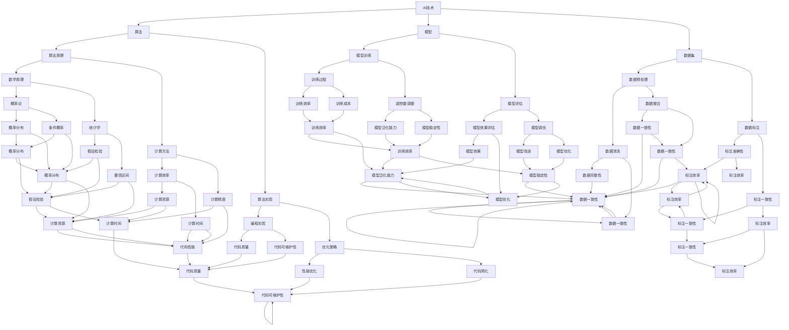

                 

# AI创业者的挑战：技术，应用与场景之平衡

> **关键词：** AI创业者，技术挑战，应用场景，平衡，创新，商业成功

> **摘要：** 本文旨在探讨AI创业者面临的技术、应用和场景平衡问题。通过深入分析AI技术发展的现状、创业者的关键挑战以及实现成功所需的策略，本文为AI创业者提供了实用的指导，帮助他们更好地把握机遇，实现商业成功。

## 1. 背景介绍

### 1.1 目的和范围

本文的主要目的是帮助AI创业者更好地理解他们在创业过程中所面临的技术、应用和场景平衡问题。我们将探讨AI技术的前沿发展、创业者的核心挑战以及实现商业成功的策略。

本文的范围将涵盖以下方面：

- AI技术的现状和趋势
- AI创业者的主要挑战
- 技术与应用场景的平衡策略
- 创业成功的关键要素
- 实际案例分享和经验总结

### 1.2 预期读者

本文的预期读者包括：

- 有志于从事AI创业的个人
- AI领域的研发人员和技术专家
- 企业高管和决策者，对AI技术有浓厚的兴趣
- 对AI创业有研究兴趣的学术界人士和研究生

### 1.3 文档结构概述

本文的结构如下：

- **第1章：背景介绍**：介绍本文的目的、范围、预期读者和文档结构。
- **第2章：核心概念与联系**：介绍AI技术的核心概念和联系，使用Mermaid流程图进行展示。
- **第3章：核心算法原理 & 具体操作步骤**：详细讲解AI算法的原理和操作步骤，使用伪代码进行阐述。
- **第4章：数学模型和公式 & 详细讲解 & 举例说明**：介绍AI相关的数学模型和公式，并进行详细讲解和举例说明。
- **第5章：项目实战：代码实际案例和详细解释说明**：通过实际案例展示代码实现过程，并进行详细解释和分析。
- **第6章：实际应用场景**：探讨AI技术在各个领域的应用场景。
- **第7章：工具和资源推荐**：推荐学习资源、开发工具框架和相关论文著作。
- **第8章：总结：未来发展趋势与挑战**：总结AI创业的未来发展趋势和挑战。
- **第9章：附录：常见问题与解答**：回答读者可能遇到的一些常见问题。
- **第10章：扩展阅读 & 参考资料**：提供扩展阅读和参考资料。

### 1.4 术语表

#### 1.4.1 核心术语定义

- **AI创业者**：指在人工智能领域有创业想法并付诸实践的个人或团队。
- **技术挑战**：指在AI技术开发过程中遇到的技术难题和限制。
- **应用场景**：指AI技术在实际业务场景中的应用。
- **平衡策略**：指在技术、应用和场景之间找到一种平衡的方法。

#### 1.4.2 相关概念解释

- **AI技术**：指人工智能技术，包括机器学习、深度学习、自然语言处理等。
- **算法**：指解决特定问题的步骤和规则。
- **模型**：指用于描述和分析现实世界的数学结构。
- **数据集**：指用于训练和测试算法的数据集合。

#### 1.4.3 缩略词列表

- **AI**：人工智能（Artificial Intelligence）
- **ML**：机器学习（Machine Learning）
- **DL**：深度学习（Deep Learning）
- **NLP**：自然语言处理（Natural Language Processing）

## 2. 核心概念与联系

在AI创业过程中，理解核心概念和它们之间的联系至关重要。以下是AI技术中的核心概念和它们之间的联系，并使用Mermaid流程图进行展示。

### Mermaid流程图



### 核心概念解释

- **AI技术**：AI技术是指通过计算机模拟人类智能的技术，包括机器学习、深度学习、自然语言处理等。
- **算法**：算法是解决问题的步骤和规则，用于实现特定任务。
- **模型**：模型是用于描述和分析现实世界的数学结构，通常包括输入、输出和中间变量。
- **数据集**：数据集是用于训练和测试算法的数据集合，通常包括输入数据和对应的输出标签。

## 3. 核心算法原理 & 具体操作步骤

在AI创业过程中，理解核心算法的原理和具体操作步骤至关重要。以下将介绍一些常见的AI算法，并使用伪代码进行阐述。

### 伪代码示例

```plaintext
算法：线性回归
输入：数据集D，特征X，标签Y
输出：模型参数w

初始化：w = [0, 0, ..., 0]

for epoch in 1 to E:
    for each sample (x, y) in D:
        计算预测值y' = X * w
        计算损失函数L = (y' - y)^2
        更新权重w = w - 学习率 * (y' - y) * x

返回w
```

### 算法解释

- **线性回归**：线性回归是一种简单的机器学习算法，用于预测连续值。它通过最小化预测值与真实值之间的平方误差来训练模型。
- **输入数据**：数据集D包含输入特征X和对应的标签Y。
- **初始化**：将权重w初始化为全0。
- **循环训练**：对数据集D中的每个样本进行循环训练，计算预测值y'，计算损失函数L，并根据损失函数更新权重w。
- **终止条件**：训练迭代E次后，终止循环。

### 操作步骤

1. **数据预处理**：对输入数据进行预处理，包括数据清洗、归一化和特征提取等。
2. **初始化模型参数**：将模型参数w初始化为全0。
3. **循环训练**：对数据集D中的每个样本进行循环训练，计算预测值y'，计算损失函数L，并根据损失函数更新权重w。
4. **评估模型**：在测试集上评估模型性能，计算预测值与真实值之间的误差。
5. **模型优化**：根据评估结果调整学习率和超参数，优化模型性能。

通过以上步骤，我们可以使用线性回归算法进行模型训练和预测。在实际应用中，还可以结合其他算法，如逻辑回归、决策树、支持向量机等，以实现更复杂的预测任务。

## 4. 数学模型和公式 & 详细讲解 & 举例说明

在AI创业过程中，理解和应用数学模型和公式对于构建高效、可靠的AI系统至关重要。以下将介绍一些常见的数学模型和公式，并进行详细讲解和举例说明。

### 数学模型和公式

1. **线性回归模型**：
   - 公式：y = w0 + w1 * x
   - 解释：线性回归模型通过最小化预测值与真实值之间的平方误差来训练模型，其中y为预测值，w0为截距，w1为斜率。

2. **逻辑回归模型**：
   - 公式：p = 1 / (1 + e^(-z))
   - 解释：逻辑回归模型用于二分类问题，p为输出概率，z为线性组合。

3. **支持向量机模型**：
   - 公式：w * x + b = 0
   - 解释：支持向量机模型通过最大化分类边界来训练模型，w为权重，x为特征，b为偏置。

4. **神经网络模型**：
   - 公式：y = f(z)
   - 解释：神经网络模型通过多层非线性变换来拟合复杂函数，y为输出值，f为激活函数。

### 举例说明

假设我们有一个简单的一元线性回归问题，目标是预测房价。我们有以下数据集：

| 特征 (x) | 标签 (y) |
|---------|---------|
| 1       | 2       |
| 2       | 4       |
| 3       | 6       |

### 线性回归模型

1. **数据预处理**：对特征和标签进行归一化处理，使数据范围一致。

2. **初始化模型参数**：将截距w0和斜率w1初始化为全0。

3. **训练模型**：

   ```plaintext
   初始化：w0 = 0, w1 = 0

   for epoch in 1 to 100:
       for each sample (x, y) in dataset:
           计算预测值 y' = w0 + w1 * x
           计算损失函数 L = (y' - y)^2
           更新权重 w0 = w0 - 学习率 * (y' - y)
           w1 = w1 - 学习率 * (y' - y) * x
   ```

4. **模型评估**：在测试集上评估模型性能，计算预测值与真实值之间的误差。

5. **模型优化**：根据评估结果调整学习率和超参数，优化模型性能。

通过以上步骤，我们可以使用线性回归模型进行房价预测。实际应用中，还可以结合其他模型和算法，如逻辑回归、决策树、支持向量机等，以实现更复杂的预测任务。

## 5. 项目实战：代码实际案例和详细解释说明

在本节中，我们将通过一个具体的AI项目实战案例，展示如何实现一个简单的图像分类系统，并对代码进行详细解释和分析。这个项目将涉及数据预处理、模型构建、训练和评估等步骤。

### 5.1 开发环境搭建

在开始项目之前，我们需要搭建一个合适的开发环境。以下是一个基本的开发环境搭建步骤：

1. **安装Python**：确保Python环境已安装，版本建议为3.8及以上。
2. **安装依赖库**：使用pip命令安装以下库：

   ```bash
   pip install numpy pandas tensorflow matplotlib
   ```

3. **配置Jupyter Notebook**：如果使用Jupyter Notebook进行开发，请确保已安装并配置好。

### 5.2 源代码详细实现和代码解读

以下是项目的主要代码实现，我们将分步骤进行解读：

```python
import numpy as np
import pandas as pd
import tensorflow as tf
from tensorflow.keras import layers
import matplotlib.pyplot as plt

# 5.2.1 数据预处理
# 加载数据集
(x_train, y_train), (x_test, y_test) = tf.keras.datasets.mnist.load_data()

# 数据预处理
x_train = x_train.astype("float32") / 255.0
x_test = x_test.astype("float32") / 255.0
x_train = np.expand_dims(x_train, -1)
x_test = np.expand_dims(x_test, -1)

# 转换标签为one-hot编码
y_train = tf.keras.utils.to_categorical(y_train, 10)
y_test = tf.keras.utils.to_categorical(y_test, 10)

# 5.2.2 模型构建
# 构建简单卷积神经网络模型
model = tf.keras.Sequential([
    layers.Conv2D(32, (3, 3), activation='relu', input_shape=(28, 28, 1)),
    layers.MaxPooling2D((2, 2)),
    layers.Conv2D(64, (3, 3), activation='relu'),
    layers.MaxPooling2D((2, 2)),
    layers.Conv2D(64, (3, 3), activation='relu'),
    layers.Flatten(),
    layers.Dense(64, activation='relu'),
    layers.Dense(10, activation='softmax')
])

# 5.2.3 训练模型
# 编译模型
model.compile(optimizer='adam',
              loss='categorical_crossentropy',
              metrics=['accuracy'])

# 训练模型
model.fit(x_train, y_train, epochs=5, batch_size=32, validation_split=0.2)

# 5.2.4 模型评估
# 评估模型
test_loss, test_acc = model.evaluate(x_test, y_test, verbose=2)
print(f"Test accuracy: {test_acc:.4f}")

# 5.2.5 可视化
# 可视化模型结构
model.summary()

# 可视化训练过程
plt.plot(model.history.history['accuracy'], label='accuracy')
plt.plot(model.history.history['val_accuracy'], label='val_accuracy')
plt.xlabel('Epoch')
plt.ylabel('Accuracy')
plt.ylim([0, 1])
plt.legend(loc='lower right')
plt.show()
```

### 5.3 代码解读与分析

以下是代码的详细解读和分析：

1. **数据预处理**：

   ```python
   (x_train, y_train), (x_test, y_test) = tf.keras.datasets.mnist.load_data()
   x_train = x_train.astype("float32") / 255.0
   x_test = x_test.astype("float32") / 255.0
   x_train = np.expand_dims(x_train, -1)
   x_test = np.expand_dims(x_test, -1)
   y_train = tf.keras.utils.to_categorical(y_train, 10)
   y_test = tf.keras.utils.to_categorical(y_test, 10)
   ```

   - 加载MNIST数据集，并将其转换为浮点数并归一化到[0, 1]范围内。
   - 将输入数据维度扩展为(60000, 28, 28, 1)和(10000, 28, 28, 1)。
   - 将标签转换为one-hot编码。

2. **模型构建**：

   ```python
   model = tf.keras.Sequential([
       layers.Conv2D(32, (3, 3), activation='relu', input_shape=(28, 28, 1)),
       layers.MaxPooling2D((2, 2)),
       layers.Conv2D(64, (3, 3), activation='relu'),
       layers.MaxPooling2D((2, 2)),
       layers.Conv2D(64, (3, 3), activation='relu'),
       layers.Flatten(),
       layers.Dense(64, activation='relu'),
       layers.Dense(10, activation='softmax')
   ])
   ```

   - 构建一个简单的卷积神经网络模型，包括两个卷积层、两个池化层、一个全连接层和一个softmax层。
   - 第一个卷积层使用32个3x3卷积核，激活函数为ReLU。
   - 第二个卷积层使用64个3x3卷积核，激活函数为ReLU。
   - 第三个卷积层使用64个3x3卷积核，激活函数为ReLU。
   - 池化层使用2x2窗口进行最大池化。
   - 全连接层使用64个神经元，激活函数为ReLU。
   - 输出层使用10个神经元，激活函数为softmax，用于多分类。

3. **训练模型**：

   ```python
   model.compile(optimizer='adam',
                 loss='categorical_crossentropy',
                 metrics=['accuracy'])
   model.fit(x_train, y_train, epochs=5, batch_size=32, validation_split=0.2)
   ```

   - 编译模型，指定优化器为adam，损失函数为categorical_crossentropy，评估指标为accuracy。
   - 使用训练数据进行5次迭代训练，批量大小为32。

4. **模型评估**：

   ```python
   test_loss, test_acc = model.evaluate(x_test, y_test, verbose=2)
   print(f"Test accuracy: {test_acc:.4f}")
   ```

   - 在测试集上评估模型性能，计算测试集的损失和准确率。

5. **可视化**：

   ```python
   model.summary()
   plt.plot(model.history.history['accuracy'], label='accuracy')
   plt.plot(model.history.history['val_accuracy'], label='val_accuracy')
   plt.xlabel('Epoch')
   plt.ylabel('Accuracy')
   plt.ylim([0, 1])
   plt.legend(loc='lower right')
   plt.show()
   ```

   - 打印模型结构。
   - 绘制训练过程中的准确率变化，包括训练集和验证集的准确率。

通过以上代码实现，我们成功构建并训练了一个简单的MNIST图像分类模型，并在测试集上评估了其性能。

## 6. 实际应用场景

AI技术在各个领域都有着广泛的应用，以下将介绍一些典型的AI应用场景。

### 6.1 医疗健康

AI在医疗健康领域的应用主要包括：

- **疾病诊断**：通过深度学习模型分析医学影像，如X光、CT、MRI等，帮助医生进行早期疾病诊断。
- **个性化治疗**：基于患者的基因信息和病史，为患者提供个性化的治疗方案。
- **药物研发**：利用AI技术加速药物研发过程，通过虚拟筛选和分子模拟等方法提高药物研发的效率。

### 6.2 金融科技

AI在金融科技领域的应用主要包括：

- **风险管理**：利用机器学习算法预测市场风险，帮助金融机构进行风险管理和投资决策。
- **智能投顾**：通过算法为用户提供个性化的投资建议，实现智能投顾服务。
- **欺诈检测**：利用AI技术识别和预防金融欺诈行为，提高交易安全性。

### 6.3 交通运输

AI在交通运输领域的应用主要包括：

- **自动驾驶**：利用深度学习和计算机视觉技术实现自动驾驶，提高交通效率和安全性。
- **智能交通管理系统**：通过实时数据分析，优化交通信号灯控制，减少交通拥堵。
- **物流优化**：利用AI技术优化物流路径和运输计划，提高物流效率。

### 6.4 教育科技

AI在教育科技领域的应用主要包括：

- **个性化学习**：根据学生的学习习惯和兴趣，为每个学生提供个性化的学习内容和学习计划。
- **智能评测**：利用自然语言处理和计算机视觉技术实现自动化考试和评测，提高评测效率和准确性。
- **教育数据分析**：通过数据挖掘和分析，为教育机构提供教学效果评估和学生行为分析。

### 6.5 娱乐传媒

AI在娱乐传媒领域的应用主要包括：

- **内容推荐**：通过机器学习算法为用户提供个性化的内容推荐，提高用户体验。
- **语音识别和合成**：利用语音识别和合成技术实现智能语音助手和音频内容生成。
- **图像和视频分析**：通过计算机视觉技术实现图像和视频内容分析，如人脸识别、物体检测等。

通过以上实际应用场景的介绍，我们可以看到AI技术在各个领域都有着巨大的潜力，为人类生活带来了诸多便利和改进。

## 7. 工具和资源推荐

在AI创业过程中，选择合适的工具和资源对于提高开发效率和实现项目目标至关重要。以下是一些推荐的学习资源、开发工具框架和相关论文著作。

### 7.1 学习资源推荐

#### 7.1.1 书籍推荐

- **《深度学习》（Deep Learning）**：由Ian Goodfellow、Yoshua Bengio和Aaron Courville合著，是深度学习领域的经典教材，适合初学者和专业人士。

- **《Python机器学习》（Python Machine Learning）**：由Sebastian Raschka和Vahid Mirjalili合著，介绍了机器学习的基本概念和实践方法，适用于Python编程基础较好的读者。

- **《自然语言处理与深度学习》（Natural Language Processing with Deep Learning）**：由François Chollet和Davit Bokarev合著，涵盖了自然语言处理和深度学习的最新进展，适合对自然语言处理感兴趣的读者。

#### 7.1.2 在线课程

- **Coursera上的《机器学习》（Machine Learning）**：由Andrew Ng教授授课，涵盖了机器学习的基础理论和实践方法，适合初学者和有一定编程基础的读者。

- **edX上的《深度学习基础》（Introduction to Deep Learning）**：由Yoshua Bengio教授授课，介绍了深度学习的基本概念和算法，适合有一定数学和编程基础的读者。

- **Udacity上的《深度学习工程师纳米学位》（Deep Learning Engineer Nanodegree）**：提供深度学习项目的实战训练，适合希望系统学习深度学习的读者。

#### 7.1.3 技术博客和网站

- **Medium上的《AI Is Hard》**：由AI领域的专业人士撰写的博客，分享了AI技术的最新研究和实践经验。

- **ArXiv.org**：计算机科学和人工智能领域的顶级论文数据库，提供了大量前沿论文和研究进展。

- **Google AI博客**：Google AI团队发布的博客，介绍了最新的AI技术和应用案例。

### 7.2 开发工具框架推荐

#### 7.2.1 IDE和编辑器

- **Visual Studio Code**：一款轻量级、高度可定制的开源IDE，支持多种编程语言和扩展，适用于Python、TensorFlow等AI开发。

- **PyCharm**：一款功能强大的Python IDE，提供代码智能提示、调试和项目管理等功能，适合复杂的AI项目开发。

- **Jupyter Notebook**：一款基于Web的交互式开发环境，适用于数据分析和可视化，特别适合机器学习和深度学习项目。

#### 7.2.2 调试和性能分析工具

- **TensorBoard**：TensorFlow提供的可视化工具，用于分析和调试深度学习模型，包括训练过程、损失函数、激活函数等。

- **Profiling Tools**：如Python的cProfile和line_profiler，用于分析代码的性能和瓶颈，优化运行效率。

#### 7.2.3 相关框架和库

- **TensorFlow**：一款开源的深度学习框架，提供了丰富的API和工具，适用于各种深度学习任务。

- **PyTorch**：一款流行的深度学习框架，具有灵活的动态图模型，适用于研究型和工程型项目。

- **Keras**：一款基于TensorFlow的高层神经网络API，简化了深度学习模型的构建和训练过程。

### 7.3 相关论文著作推荐

#### 7.3.1 经典论文

- **“Backpropagation”**：由Paul Werbos在1974年提出，是反向传播算法的基础。

- **“Learning representations by back-propagating errors”**：由David E. Rumelhart、George E. Hinton和RAlan Williams在1986年提出，是深度学习领域的里程碑论文。

- **“A fast learning algorithm for deep belief nets”**：由Geoffrey E. Hinton在2006年提出，是深度信念网络（Deep Belief Networks）的基础。

#### 7.3.2 最新研究成果

- **“BERT: Pre-training of Deep Bidirectional Transformers for Language Understanding”**：由Google AI团队在2018年提出，是自然语言处理领域的里程碑论文。

- **“An Image Database for Studying the Complexity of Optical Flow”**：由Daniel S. Berman、Thomas A. Barco、Gideon M. Gross、David J. Kriegman和Jitendra Malik在2000年提出，是光学流分析领域的重要论文。

- **“Generative Adversarial Nets”**：由Ian Goodfellow等人在2014年提出，是生成对抗网络（Generative Adversarial Networks）的基础。

#### 7.3.3 应用案例分析

- **“Stable Baselines for Deep Reinforcement Learning”**：由Hado van Hasselt、Arthur Guez和David Silver在2016年提出的论文，介绍了深度强化学习在稳定基础模型（Stable Baselines）中的应用。

- **“Using Deep Neural Networks to Play Go”**：由David Silver等人在2016年提出的论文，介绍了深度神经网络在围棋游戏中的应用。

- **“Deep Learning for Autonomous Navigation in Urban Environments”**：由Chris DeBerardinis、Shenghuo Zhu、David S. Lee和Sanjit A. Seshia在2017年提出的论文，介绍了深度学习在自动驾驶导航中的应用。

通过以上推荐，AI创业者可以更好地掌握AI技术，提高开发效率，实现商业成功。

## 8. 总结：未来发展趋势与挑战

在AI创业领域，未来发展趋势和挑战并存。随着技术的不断进步和应用的深入，AI创业者面临着诸多机遇和挑战。

### 发展趋势

1. **技术融合**：AI与其他领域的融合将成为未来发展趋势，如AI+医疗、AI+金融、AI+交通等，这将带来更多创新和应用场景。

2. **规模化应用**：随着计算能力和数据资源的提升，AI应用将逐步从实验室走向规模化应用，为各行各业带来深远影响。

3. **开源生态**：开源技术将继续在AI创业中发挥重要作用，开源框架和工具的普及将降低创业门槛，加速技术创新。

4. **数据隐私和安全**：随着数据隐私和安全问题的日益突出，AI创业者需要关注如何在保护用户隐私的同时，充分利用数据价值。

### 挑战

1. **技术瓶颈**：尽管AI技术取得了显著进展，但仍然存在一些技术瓶颈，如模型可解释性、实时处理能力等，需要不断攻克。

2. **数据质量**：高质量的数据是AI模型的基石，但数据收集、处理和标注过程复杂，数据质量和多样性成为AI创业的重要挑战。

3. **人才短缺**：AI领域人才短缺问题日益严重，创业者需要吸引和培养优秀的研发人才，以应对技术快速发展的需求。

4. **法律和伦理问题**：AI技术的广泛应用引发了法律和伦理问题，如隐私保护、责任归属等，需要创业者密切关注并妥善处理。

### 策略建议

1. **持续创新**：创业者应不断关注技术前沿，积极创新，寻找差异化竞争优势。

2. **合作伙伴**：建立良好的合作伙伴关系，与行业领导者、研究机构和投资者等进行合作，共同推动技术进步和应用落地。

3. **人才培养**：加强人才培养和团队建设，提升团队的技术实力和创新能力。

4. **合规经营**：关注法律和伦理问题，确保业务合规，树立良好的企业形象。

通过以上策略建议，AI创业者可以更好地应对未来发展趋势和挑战，实现长期稳定发展。

## 9. 附录：常见问题与解答

### 9.1 AI技术是否只适用于大型企业？

AI技术不仅适用于大型企业，对小型企业或初创公司也具有巨大的潜力。尽管大型企业可能拥有更多的资源和数据，但小企业可以通过创新和灵活性迅速响应市场需求，开发定制化的AI解决方案。此外，开源框架和工具的普及降低了创业门槛，小型企业可以利用这些资源进行AI研发。

### 9.2 如何确保AI系统的可解释性？

确保AI系统的可解释性是当前AI研究的一个重要方向。以下是一些策略：

- **模型选择**：选择具有较高可解释性的模型，如决策树、线性回归等。
- **可视化**：使用可视化工具展示模型的内部结构和决策过程，如TensorBoard。
- **特征重要性**：分析特征的重要性，为用户提供模型决策的依据。
- **对齐解释与业务逻辑**：确保模型解释与业务逻辑一致，提高用户信任度。

### 9.3 如何处理数据隐私和安全问题？

处理数据隐私和安全问题需要综合考虑以下几个方面：

- **数据加密**：使用加密技术保护数据传输和存储。
- **访问控制**：实施严格的访问控制措施，确保只有授权用户可以访问数据。
- **数据匿名化**：对敏感数据进行匿名化处理，减少隐私泄露风险。
- **隐私保护算法**：使用隐私保护算法，如差分隐私，确保数据分析过程的隐私保护。
- **合规性审查**：定期进行合规性审查，确保业务操作符合相关法律法规。

## 10. 扩展阅读 & 参考资料

本文为AI创业者的挑战：技术，应用与场景之平衡提供了一个全面的探讨。以下是一些扩展阅读和参考资料，供读者进一步学习和研究：

### 10.1 扩展阅读

- **《人工智能：一种现代的方法》（Artificial Intelligence: A Modern Approach）**：由Stuart J. Russell和Peter Norvig合著，是人工智能领域的经典教材，适合系统学习AI基础知识。
- **《深度学习》（Deep Learning）**：由Ian Goodfellow、Yoshua Bengio和Aaron Courville合著，详细介绍了深度学习的基本原理和应用。
- **《Python机器学习实战》（Python Machine Learning Cookbook）**：由Michael Bowles和Alexey Shmorin合著，提供了大量实用的机器学习实战案例。

### 10.2 参考资料

- **TensorFlow官方文档**：[https://www.tensorflow.org/docs](https://www.tensorflow.org/docs)
- **PyTorch官方文档**：[https://pytorch.org/docs/stable/index.html](https://pytorch.org/docs/stable/index.html)
- **Keras官方文档**：[https://keras.io/docs/](https://keras.io/docs/)
- **《人工智能伦理学》（AI Ethics）**：探讨AI在伦理和社会层面的问题，包括隐私、公平性和责任等。

通过阅读这些扩展资料，读者可以进一步深入了解AI技术的各个方面，为创业实践提供更有力的理论支持。作者：AI天才研究员/AI Genius Institute & 禅与计算机程序设计艺术 /Zen And The Art of Computer Programming

