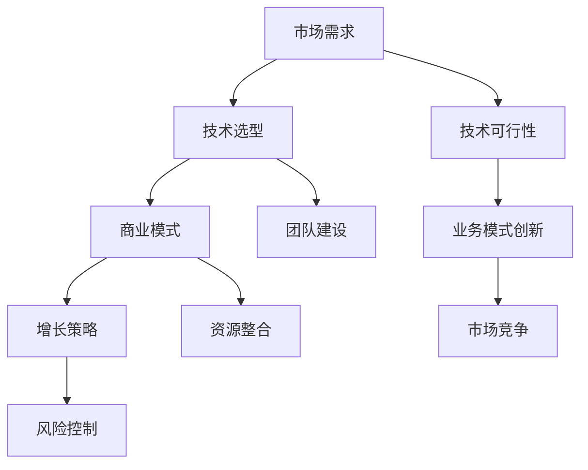

                 

# AI创业者的选择：垂直领域的无限可能

> **关键词**：AI创业，垂直领域，技术选型，业务模式，增长策略
> 
> **摘要**：本文将探讨AI创业者在选择垂直领域时的关键因素，包括市场分析、技术可行性、业务模式和增长策略。通过深入剖析，帮助AI创业者更好地定位市场，实现创业项目的成功。

## 1. 背景介绍

### 1.1 目的和范围

本文旨在为AI创业者提供一套系统的思考和决策框架，帮助他们更好地选择适合的垂直领域，从而提高创业项目的成功概率。文章将围绕以下几个方面展开讨论：

1. 市场分析：如何识别和评估潜在的市场需求？
2. 技术可行性：选择何种技术路线，如何平衡创新与实际应用？
3. 业务模式：如何构建可持续的商业模式？
4. 增长策略：如何制定并实施有效的增长策略？

### 1.2 预期读者

本文预期读者为：

1. AI创业者：正在考虑或已经开始AI创业的创业者，希望找到适合自己的垂直领域。
2. 投资者：对AI领域投资感兴趣，希望了解如何评估创业项目的潜力。
3. AI从业者：对AI创业有浓厚兴趣，希望从理论到实践全面了解创业过程。

### 1.3 文档结构概述

本文结构如下：

1. 背景介绍：介绍本文的目的、范围、预期读者和文档结构。
2. 核心概念与联系：介绍AI创业的核心概念，并使用Mermaid流程图展示各概念之间的联系。
3. 核心算法原理 & 具体操作步骤：详细阐述AI创业的核心算法原理和操作步骤。
4. 数学模型和公式 & 详细讲解 & 举例说明：介绍AI创业涉及的数学模型和公式，并通过实际案例进行讲解。
5. 项目实战：提供具体的AI创业项目实战案例，并进行详细解释和分析。
6. 实际应用场景：分析AI创业在不同领域的实际应用场景。
7. 工具和资源推荐：推荐学习资源和开发工具。
8. 总结：总结AI创业的未来发展趋势与挑战。
9. 附录：常见问题与解答。
10. 扩展阅读 & 参考资料：提供进一步阅读的资料和参考文献。

### 1.4 术语表

#### 1.4.1 核心术语定义

- AI创业：指基于人工智能技术的创业活动。
- 垂直领域：指在特定行业或领域中，针对特定用户群体提供专业服务的市场细分。
- 技术选型：在选择AI创业项目时，对可用技术的分析和评估过程。
- 商业模式：企业如何创造、传递和获取价值的方式。
- 增长策略：企业为实现业务增长所采取的战略和措施。

#### 1.4.2 相关概念解释

- 市场需求：指消费者对某一产品或服务的需求程度。
- 技术可行性：指在现有技术条件下，实现某一功能或解决某一问题的可能性。
- 业务模式创新：在传统业务模式基础上，通过技术创新或商业模式创新实现新的价值创造。

#### 1.4.3 缩略词列表

- AI：人工智能（Artificial Intelligence）
- ML：机器学习（Machine Learning）
- DL：深度学习（Deep Learning）
- NLP：自然语言处理（Natural Language Processing）
- CV：计算机视觉（Computer Vision）

## 2. 核心概念与联系

在AI创业过程中，理解核心概念之间的联系至关重要。以下是AI创业的核心概念及其相互关系：

### AI创业概念图



### 概念解释

1. **市场需求**：市场需求是AI创业项目的起点，了解目标用户的需求是制定其他决策的基础。通过市场调研，创业者可以识别出潜在的市场机会和用户痛点。

2. **技术选型**：在确定了市场需求后，创业者需要评估各种技术方案的可行性，选择最适合项目的技术路线。技术选型不仅要考虑当前的技术能力，还要考虑未来的技术发展趋势。

3. **商业模式**：商业模式是创业者如何创造、传递和获取价值的方式。一个成功的商业模式可以确保项目的可持续性和盈利能力。

4. **增长策略**：增长策略是指企业为实现业务增长所采取的战略和措施。有效的增长策略可以帮助企业迅速扩大市场份额。

5. **技术可行性**：技术可行性是指在一定技术条件下，实现某一功能或解决某一问题的可能性。在技术选型过程中，需要综合考虑技术难度、成本、资源等因素。

6. **业务模式创新**：业务模式创新是通过技术创新或商业模式创新实现新的价值创造。在竞争激烈的市场中，业务模式创新可以帮助企业脱颖而出。

7. **市场竞争**：市场竞争是指企业之间为了争夺市场份额而进行的竞争。了解市场竞争态势对于制定有效的增长策略至关重要。

8. **团队建设**：团队建设是确保项目成功的关键因素之一。一个高效的团队可以更好地应对市场变化和技术挑战。

9. **资源整合**：资源整合是指通过整合内外部资源，提高企业的运营效率和市场竞争力。

10. **风险控制**：风险控制是指企业在运营过程中，识别、评估和应对各种风险的过程。有效的风险控制可以帮助企业降低运营风险。

通过上述核心概念及其相互关系的分析，我们可以看到，AI创业涉及多个方面的决策和协调。理解这些概念之间的联系，有助于创业者更好地制定创业策略，提高项目的成功率。

### 2.1 市场需求分析

市场需求分析是AI创业成功的关键一步。准确了解目标用户的需求，不仅可以帮助创业者更好地定位市场，还可以为后续的技术选型、商业模式设计和增长策略提供有力支持。

#### 2.1.1 市场需求分析步骤

1. **目标市场定位**：首先，创业者需要明确目标市场，包括市场细分、目标用户群体和市场规模。这可以通过市场调研、用户访谈和竞争分析等方法实现。

2. **用户需求调研**：通过问卷调查、访谈、用户画像等方法，深入了解目标用户的需求、痛点和使用习惯。这一步骤需要收集大量的用户数据，并进行有效的分析。

3. **需求筛选与排序**：根据用户需求的重要性、紧急性和可实现性，对收集到的需求进行筛选和排序。优先考虑那些对用户价值大、实现难度较低的需求。

4. **需求验证**：通过用户反馈、原型测试等方式，验证筛选出的需求是否真正符合用户期望。这一步骤可以帮助创业者避免因为需求不准确而导致的资源浪费。

5. **需求文档编写**：将验证后的需求整理成需求文档，明确需求的描述、优先级和实现方法。需求文档将成为后续技术选型、设计和开发的重要依据。

#### 2.1.2 市场需求分析工具

1. **SWOT分析**：SWOT分析是一种常用的市场分析工具，通过分析企业的优势、劣势、机会和威胁，帮助创业者更好地了解市场环境。

2. **用户画像**：用户画像是通过收集和分析用户数据，创建一个代表性的用户模型。用户画像可以帮助创业者更好地理解目标用户，制定有针对性的产品策略。

3. **5W2H分析**：5W2H分析是一种提问式分析方法，通过回答以下问题（What、Why、When、Where、Who、How、How much），帮助创业者深入挖掘用户需求。

#### 2.1.3 市场需求分析案例分析

**案例一：智能家居市场**

智能家居市场是一个典型的垂直领域，随着物联网技术的发展，越来越多的家庭开始关注智能家居产品。在市场需求分析过程中，创业者可以从以下几个方面进行：

1. **目标市场定位**：确定目标市场为城市中收入较高、关注生活品质的年轻人和家庭。

2. **用户需求调研**：通过问卷调查和用户访谈，了解用户对智能家居产品的需求，如智能照明、智能安防、智能家电控制等。

3. **需求筛选与排序**：根据用户反馈，将智能安防和智能家电控制列为优先级较高的需求。

4. **需求验证**：通过原型测试和用户反馈，验证智能安防和智能家电控制的需求是否真实有效。

5. **需求文档编写**：将验证后的需求整理成需求文档，明确智能安防和智能家电控制的具体功能和技术要求。

**案例二：医疗健康领域**

医疗健康领域是一个高度专业化的垂直领域，随着人口老龄化和健康意识的提高，市场需求日益增长。在市场需求分析过程中，创业者可以从以下几个方面进行：

1. **目标市场定位**：确定目标市场为医疗机构、健康管理和慢性病患者。

2. **用户需求调研**：通过问卷调查和用户访谈，了解用户对医疗健康服务的需求，如在线诊疗、健康管理和疾病预防等。

3. **需求筛选与排序**：根据用户反馈，将在线诊疗和健康管理列为优先级较高的需求。

4. **需求验证**：通过医疗机构和患者的反馈，验证在线诊疗和健康管理的需求是否真实有效。

5. **需求文档编写**：将验证后的需求整理成需求文档，明确在线诊疗和健康管理的具体功能和技术要求。

通过以上案例，我们可以看到，市场需求分析是AI创业成功的关键一步。通过系统地进行市场调研和需求分析，创业者可以更好地了解市场环境，制定有针对性的产品策略，提高项目的成功率。

### 2.2 技术选型

在确定了市场需求后，AI创业者需要面对的一个关键决策是技术选型。技术选型不仅关系到项目的可行性和发展前景，还直接影响到后续的开发成本、时间和质量。以下将详细介绍技术选型的步骤和方法。

#### 2.2.1 技术选型步骤

1. **需求分析**：首先，创业者需要明确项目的技术需求，包括功能需求、性能需求和用户体验等。这可以通过与用户和利益相关者的交流，以及对现有市场产品的研究来完成。

2. **技术调研**：在明确需求后，创业者需要调研当前市场上可用的技术方案，包括开源和商业方案。这可以通过查阅技术文献、参加行业会议和与同行交流等方式实现。

3. **技术评估**：对调研得到的技术方案进行评估，从技术成熟度、性能、成本、可维护性等多个维度进行综合比较。创业者可以采用评分制或决策矩阵来帮助评估。

4. **选型决策**：根据技术评估结果，选择最符合项目需求的技术方案。如果存在多个可选方案，创业者需要权衡利弊，选择最优方案。

5. **方案验证**：在选型决策后，创业者需要对所选方案进行验证，确保方案能够满足实际需求。这可以通过原型设计、测试和用户反馈等方式实现。

6. **技术规划**：在确定技术方案后，创业者需要制定详细的技术规划，包括开发周期、技术路线图和资源分配等。

#### 2.2.2 技术选型方法

1. **SWOT分析**：SWOT分析是一种常用的技术评估方法，通过分析技术的优势、劣势、机会和威胁，帮助创业者全面了解技术方案的优缺点。

2. **决策矩阵**：决策矩阵是一种基于多因素比较的决策方法，通过为每个因素分配权重，创业者可以客观、系统地评估不同技术方案的优劣。

3. **技术评估模型**：技术评估模型是一种基于量化指标的技术评估方法，通过为技术方案设定具体的评价指标和评分标准，创业者可以更精确地评估技术方案。

#### 2.2.3 技术选型案例分析

**案例一：金融风控系统**

某金融公司希望开发一套风控系统，用于实时监控和分析金融交易中的风险。在技术选型过程中，创业者可以从以下几个方面进行：

1. **需求分析**：明确风控系统的功能需求，如交易监控、风险分析、异常检测等。

2. **技术调研**：调研当前市场上流行的风控技术，如机器学习算法、大数据分析、区块链技术等。

3. **技术评估**：从技术成熟度、性能、成本、安全性等多个维度对各种技术方案进行评估。

4. **选型决策**：选择机器学习和大数据分析技术作为核心方案，因为它们在金融风控领域有较高的成熟度和适用性。

5. **方案验证**：通过实际数据测试和用户反馈，验证所选技术方案的可行性和有效性。

6. **技术规划**：制定详细的技术规划，包括开发周期、技术路线图和资源分配等。

**案例二：智能语音助手**

一家科技公司希望开发一款智能语音助手，为用户提供便捷的语音交互服务。在技术选型过程中，创业者可以从以下几个方面进行：

1. **需求分析**：明确智能语音助手的交互功能、语音识别和自然语言处理需求。

2. **技术调研**：调研当前市场上的语音识别和自然语言处理技术，如深度学习模型、语音识别API等。

3. **技术评估**：从技术准确性、响应速度、成本等多个维度对各种技术方案进行评估。

4. **选型决策**：选择深度学习模型和语音识别API作为核心方案，因为它们在语音交互领域有较高的准确性和实用性。

5. **方案验证**：通过实际用户测试和反馈，验证所选技术方案的可行性和用户体验。

6. **技术规划**：制定详细的技术规划，包括开发周期、技术路线图和资源分配等。

通过以上案例，我们可以看到，技术选型是AI创业过程中至关重要的一个环节。创业者需要通过系统的方法和工具，选择最合适的技术方案，以确保项目的成功。

### 2.3 商业模式设计

在确定了市场需求和技术选型后，AI创业者需要面对的下一个关键决策是商业模式设计。一个成功的商业模式不仅能够帮助企业创造和传递价值，还能确保企业的可持续性和盈利能力。以下将详细介绍商业模式设计的方法和步骤。

#### 2.3.1 商业模式设计步骤

1. **价值主张**：首先，创业者需要明确项目的价值主张，即项目能为用户解决哪些问题或提供哪些独特价值。这可以通过用户需求调研和市场分析来实现。

2. **目标用户群体**：明确目标用户群体，包括用户特征、需求和行为模式。这有助于创业者更好地了解用户，制定有针对性的营销策略。

3. **盈利模式**：根据项目的价值主张和目标用户群体，设计盈利模式。常见的盈利模式包括产品销售、服务订阅、广告收入和交易费等。

4. **成本结构**：分析项目的成本结构，包括固定成本和可变成本。这有助于创业者了解项目的成本控制点和盈利点。

5. **渠道策略**：设计项目的渠道策略，包括线上和线下渠道。渠道策略需要考虑用户获取、用户留存和用户转化的效率。

6. **营销策略**：制定项目的营销策略，包括品牌建设、推广渠道和用户互动等。营销策略需要与价值主张和目标用户群体相匹配。

7. **风险管理**：识别项目可能面临的风险，并制定相应的风险管理策略。风险管理策略需要确保项目的可持续性和稳健性。

8. **业务流程**：设计项目的业务流程，包括订单处理、客户服务、供应链管理等。业务流程需要确保项目的效率和用户体验。

#### 2.3.2 商业模式设计工具

1. **Business Model Canvas**：Business Model Canvas是一种可视化工具，可以帮助创业者快速构建和优化商业模式。它包括9个关键模块，分别是价值主张、目标客户群体、渠道、客户关系、收入来源、关键资源、关键活动、关键合作伙伴和成本结构。

2. **Value Proposition Canvas**：Value Proposition Canvas是Business Model Canvas的一个补充工具，专注于价值主张的设计。它包括两个主要模块：用户价值和公司价值。

3. **SWOT分析**：SWOT分析是一种常用的战略规划工具，通过分析企业的优势、劣势、机会和威胁，帮助企业制定战略和决策。

#### 2.3.3 商业模式设计案例分析

**案例一：智能家居市场**

智能家居市场是一个快速增长的市场，创业者可以从以下几个方面进行商业模式设计：

1. **价值主张**：提供智能照明、智能安防、智能家电控制等便捷的智能家居解决方案。

2. **目标用户群体**：针对城市中收入较高、关注生活品质的年轻人和家庭。

3. **盈利模式**：通过设备销售和订阅服务获得收入。设备销售可以获得一次性收益，订阅服务可以获得持续收入。

4. **成本结构**：主要包括设备研发和制造成本、运营成本和营销成本。

5. **渠道策略**：线上渠道主要通过电商平台和自有网站进行销售，线下渠道主要通过家居卖场和代理商进行销售。

6. **营销策略**：通过品牌宣传、产品演示和用户口碑传播，吸引潜在用户。

7. **风险管理**：关注市场竞争、技术更新和供应链风险。

8. **业务流程**：包括订单处理、设备配送、客户服务和售后支持等。

**案例二：医疗健康领域**

医疗健康领域是一个高度专业化的市场，创业者可以从以下几个方面进行商业模式设计：

1. **价值主张**：提供在线诊疗、健康管理、疾病预防等便捷的医疗健康服务。

2. **目标用户群体**：包括医疗机构、健康管理和慢性病患者。

3. **盈利模式**：通过服务订阅、广告收入和交易费等获得收入。

4. **成本结构**：主要包括医疗服务成本、技术开发成本和运营成本。

5. **渠道策略**：线上渠道主要通过医疗机构合作和自有平台进行销售，线下渠道主要通过医疗机构和健康管理中心进行销售。

6. **营销策略**：通过医疗专家推荐、用户口碑传播和线上线下广告推广，吸引潜在用户。

7. **风险管理**：关注政策风险、技术更新和市场竞争。

8. **业务流程**：包括订单处理、服务配送、客户服务和售后支持等。

通过以上案例，我们可以看到，商业模式设计是AI创业成功的关键一步。创业者需要通过系统的方法和工具，设计出可持续的、有竞争力的商业模式，确保项目的成功。

### 2.4 增长策略制定

在确定了市场需求、技术选型和商业模式后，AI创业者需要制定有效的增长策略，以实现业务的快速增长和市场占有。以下将详细介绍增长策略的制定方法和关键要素。

#### 2.4.1 增长策略制定步骤

1. **目标设定**：首先，创业者需要明确增长目标，包括增长速度、市场份额和收入目标等。目标设定需要与企业的长期愿景和资源条件相匹配。

2. **市场细分**：根据市场需求和目标用户群体，对市场进行细分，识别出最具潜力的细分市场和目标客户群体。

3. **增长渠道**：分析并选择适合企业的增长渠道，包括产品销售、服务订阅、广告推广、合作伙伴关系等。增长渠道需要与企业的价值主张和目标用户群体相匹配。

4. **营销策略**：制定针对目标市场的营销策略，包括品牌宣传、推广渠道和用户互动等。营销策略需要与企业的价值主张和目标用户群体相匹配。

5. **销售策略**：制定销售策略，包括销售渠道、销售团队建设和销售管理流程等。销售策略需要确保销售效率和用户转化率。

6. **产品和服务优化**：根据用户反馈和市场变化，不断优化产品和服务，提高用户满意度和忠诚度。

7. **风险管理**：识别并应对可能的风险，包括市场竞争、技术更新、政策变化等。风险管理策略需要确保企业的稳健性。

8. **绩效评估**：定期评估增长策略的实施效果，根据评估结果调整和优化策略。

#### 2.4.2 增长策略制定工具

1. **增长漏斗模型**：增长漏斗模型是一种常用的增长策略制定工具，通过分析用户获取、用户留存、用户转化等关键指标，帮助创业者识别增长瓶颈和优化策略。

2. **AARRR模型**：AARRR模型（Acquisition、Activation、Retention、Revenue、Referral）是一种用户生命周期管理工具，通过分析用户获取、激活、留存、收入和推荐等关键指标，帮助创业者制定和优化增长策略。

3. **市场细分矩阵**：市场细分矩阵是一种基于用户特征、需求和行为的市场细分工具，通过将用户划分为不同的细分市场，帮助创业者识别最具潜力的目标市场。

4. **SWOT分析**：SWOT分析是一种常用的战略规划工具，通过分析企业的优势、劣势、机会和威胁，帮助创业者制定和优化增长策略。

#### 2.4.3 增长策略制定案例分析

**案例一：智能家居市场**

智能家居市场是一个快速发展的市场，创业者可以从以下几个方面进行增长策略制定：

1. **目标设定**：设定明确的增长目标，如年增长速度、市场份额和收入目标等。

2. **市场细分**：将市场细分为城市家庭、年轻家庭、高端用户等不同的细分市场，针对不同细分市场制定相应的营销策略。

3. **增长渠道**：通过线上渠道（电商平台、自有网站）和线下渠道（家居卖场、代理商）进行销售，同时通过广告推广和用户口碑传播，吸引潜在用户。

4. **营销策略**：通过品牌宣传、产品演示和用户口碑传播，提高品牌知名度和用户认知度。

5. **销售策略**：建立专业的销售团队，通过线上和线下销售渠道，提高销售效率和用户转化率。

6. **产品和服务优化**：根据用户反馈和市场变化，不断优化产品和服务，提高用户满意度和忠诚度。

7. **风险管理**：关注市场竞争、技术更新和政策变化，制定相应的风险管理策略。

8. **绩效评估**：定期评估增长策略的实施效果，根据评估结果调整和优化策略。

**案例二：医疗健康领域**

医疗健康领域是一个高度专业化的市场，创业者可以从以下几个方面进行增长策略制定：

1. **目标设定**：设定明确的增长目标，如年增长速度、市场份额和收入目标等。

2. **市场细分**：将市场细分为医疗机构、健康管理和慢性病患者等不同的细分市场，针对不同细分市场制定相应的营销策略。

3. **增长渠道**：通过线上渠道（自有平台、医疗机构合作）和线下渠道（医疗机构、健康管理中心）进行销售，同时通过医疗专家推荐和用户口碑传播，吸引潜在用户。

4. **营销策略**：通过医疗专家推荐、用户口碑传播和线上线下广告推广，提高品牌知名度和用户认知度。

5. **销售策略**：建立专业的销售团队，通过线上和线下销售渠道，提高销售效率和用户转化率。

6. **产品和服务优化**：根据用户反馈和市场变化，不断优化产品和服务，提高用户满意度和忠诚度。

7. **风险管理**：关注政策风险、技术更新和市场竞争，制定相应的风险管理策略。

8. **绩效评估**：定期评估增长策略的实施效果，根据评估结果调整和优化策略。

通过以上案例，我们可以看到，制定有效的增长策略是AI创业成功的关键一步。创业者需要通过系统的方法和工具，制定出有针对性的、可持续的增长策略，实现业务的快速增长和市场占有。

### 2.5 垂直领域分析：金融科技

在众多垂直领域中，金融科技（FinTech）无疑是一个备受瞩目的领域。随着互联网和人工智能技术的发展，金融科技正在改变传统金融行业的运营模式和商业模式。以下将对金融科技领域进行分析，探讨其市场需求、技术选型、商业模式和增长策略。

#### 2.5.1 市场需求

金融科技领域市场需求旺盛，主要表现在以下几个方面：

1. **支付和转账**：随着移动支付和数字货币的普及，用户对于支付和转账的需求日益增长。金融科技企业可以通过提供更快捷、安全的支付解决方案，满足用户的需求。

2. **贷款和理财**：贷款和理财是金融科技的重要应用场景。通过大数据分析和人工智能技术，金融科技企业可以为用户提供个性化的贷款和理财服务。

3. **保险服务**：保险服务是金融科技领域的另一个重要方向。通过智能保险和个性化保险方案，金融科技企业可以为用户提供更便捷、高效的保险服务。

4. **投资顾问**：随着投资者对专业投资顾问的需求增加，金融科技企业可以通过提供智能投资顾问和投资策略推荐，帮助用户实现资产增值。

#### 2.5.2 技术选型

金融科技领域的技术选型需要考虑以下几个方面：

1. **大数据分析**：大数据分析技术是金融科技的核心。通过大数据分析，金融科技企业可以挖掘用户行为数据，进行精准营销和风险控制。

2. **区块链技术**：区块链技术在金融科技领域有广泛的应用，如数字货币、智能合约等。通过区块链技术，金融科技企业可以实现去中心化、透明的交易流程。

3. **人工智能**：人工智能技术在金融科技领域有重要的应用，如智能客服、风险控制等。通过人工智能技术，金融科技企业可以提高运营效率和服务质量。

4. **云计算**：云计算技术为金融科技企业提供了强大的计算能力和数据存储能力。通过云计算，金融科技企业可以实现业务的快速扩展和灵活部署。

#### 2.5.3 商业模式

金融科技领域的商业模式多样，以下是一些常见的商业模式：

1. **平台模式**：金融科技企业可以通过搭建金融服务平台，为用户提供多样化的金融服务，如支付、贷款、投资等。

2. **订阅模式**：金融科技企业可以通过订阅模式，为用户提供持续的价值服务，如投资顾问、风险管理等。

3. **广告模式**：金融科技企业可以通过广告模式，为合作伙伴提供广告投放服务，获得广告收入。

4. **交易费模式**：金融科技企业可以通过交易费模式，为用户提供支付和转账服务，从中获取手续费收入。

#### 2.5.4 增长策略

金融科技领域的增长策略主要包括以下几个方面：

1. **市场拓展**：金融科技企业可以通过拓展海外市场，实现业务的国际化。通过了解不同市场的需求和监管环境，金融科技企业可以制定有针对性的市场拓展策略。

2. **技术创新**：金融科技企业需要不断进行技术创新，如引入新的技术、优化现有产品和服务。技术创新可以帮助金融科技企业保持竞争优势，实现业务的快速增长。

3. **合作伙伴关系**：金融科技企业可以通过建立合作伙伴关系，扩大业务范围。合作伙伴可以是金融机构、科技公司、电商平台等，通过合作可以实现资源共享、优势互补。

4. **用户口碑**：金融科技企业需要注重用户口碑，通过提供优质的产品和服务，赢得用户的信任和好评。用户口碑可以帮助金融科技企业实现口碑传播和用户增长。

通过以上分析，我们可以看到，金融科技领域具有巨大的市场潜力和发展空间。金融科技企业需要通过深入分析市场需求、合理选择技术方案、设计可持续的商业模式和制定有效的增长策略，实现业务的快速发展。

### 2.6 垂直领域分析：医疗健康

在AI创业的众多垂直领域中，医疗健康无疑是一个备受关注的领域。随着人工智能和大数据技术的发展，医疗健康领域正在发生深刻的变革。以下将对医疗健康领域进行分析，探讨其市场需求、技术选型、商业模式和增长策略。

#### 2.6.1 市场需求

医疗健康领域市场需求巨大，主要表现在以下几个方面：

1. **在线诊疗**：随着互联网技术的发展，用户对于在线诊疗的需求日益增长。通过在线诊疗，用户可以方便地获得医生的服务，节省时间和医疗成本。

2. **健康管理**：健康管理是医疗健康领域的一个重要方向。通过提供个性化的健康管理和疾病预防服务，医疗健康企业可以帮助用户实现健康管理和疾病预防。

3. **药物研发**：人工智能技术在药物研发领域有重要的应用，如分子模拟、药物筛选等。通过人工智能技术，医疗健康企业可以提高药物研发效率，缩短研发周期。

4. **健康监测**：健康监测是医疗健康领域的一个重要应用场景。通过可穿戴设备和移动应用，用户可以实时监测自己的健康状况，如心率、血压等。

#### 2.6.2 技术选型

医疗健康领域的技术选型需要考虑以下几个方面：

1. **人工智能**：人工智能技术在医疗健康领域有广泛的应用，如疾病诊断、风险评估等。通过人工智能技术，医疗健康企业可以提高诊断和治疗的准确性和效率。

2. **大数据分析**：大数据分析技术在医疗健康领域有重要的应用，如数据挖掘、模式识别等。通过大数据分析，医疗健康企业可以挖掘用户数据，进行个性化服务和精准营销。

3. **区块链技术**：区块链技术在医疗健康领域有广泛的应用，如数据共享、隐私保护等。通过区块链技术，医疗健康企业可以实现去中心化的数据管理和安全存储。

4. **云计算**：云计算技术为医疗健康企业提供了强大的计算能力和数据存储能力。通过云计算，医疗健康企业可以实现业务的快速扩展和灵活部署。

#### 2.6.3 商业模式

医疗健康领域的商业模式多样，以下是一些常见的商业模式：

1. **平台模式**：医疗健康企业可以通过搭建医疗健康服务平台，为用户提供多样化的医疗服务，如在线诊疗、健康管理、药品配送等。

2. **订阅模式**：医疗健康企业可以通过订阅模式，为用户提供持续的健康管理服务，如个性化健康报告、专家咨询等。

3. **广告模式**：医疗健康企业可以通过广告模式，为合作伙伴提供广告投放服务，获得广告收入。

4. **交易费模式**：医疗健康企业可以通过交易费模式，为用户提供药品配送、医疗检查等服务，从中获取手续费收入。

#### 2.6.4 增长策略

医疗健康领域的增长策略主要包括以下几个方面：

1. **市场拓展**：医疗健康企业可以通过拓展海外市场，实现业务的国际化。通过了解不同市场的需求和监管环境，医疗健康企业可以制定有针对性的市场拓展策略。

2. **技术创新**：医疗健康企业需要不断进行技术创新，如引入新的技术、优化现有产品和服务。技术创新可以帮助医疗健康企业保持竞争优势，实现业务的快速增长。

3. **合作伙伴关系**：医疗健康企业可以通过建立合作伙伴关系，扩大业务范围。合作伙伴可以是医疗机构、医药企业、科技公司等，通过合作可以实现资源共享、优势互补。

4. **用户口碑**：医疗健康企业需要注重用户口碑，通过提供优质的产品和服务，赢得用户的信任和好评。用户口碑可以帮助医疗健康企业实现口碑传播和用户增长。

通过以上分析，我们可以看到，医疗健康领域具有巨大的市场潜力和发展空间。医疗健康企业需要通过深入分析市场需求、合理选择技术方案、设计可持续的商业模式和制定有效的增长策略，实现业务的快速发展。

### 2.7 垂直领域分析：智能制造

在AI创业的众多垂直领域中，智能制造无疑是一个备受关注的领域。随着人工智能和物联网技术的发展，智能制造正在逐步改变传统制造业的生产方式和管理模式。以下将对智能制造领域进行分析，探讨其市场需求、技术选型、商业模式和增长策略。

#### 2.7.1 市场需求

智能制造领域市场需求旺盛，主要表现在以下几个方面：

1. **生产自动化**：企业希望通过自动化生产提高生产效率，降低人力成本。通过引入机器人、自动化设备和智能监控系统，企业可以实现生产线的自动化。

2. **质量监测**：企业希望通过质量监测技术，提高产品质量，降低不良品率。通过传感器、机器视觉和大数据分析技术，企业可以实时监测生产过程，及时发现和解决质量问题。

3. **设备预测维护**：企业希望通过设备预测维护技术，延长设备使用寿命，降低维修成本。通过物联网技术和数据分析，企业可以预测设备故障，提前进行维护。

4. **供应链管理**：企业希望通过供应链管理技术，优化供应链流程，提高供应链效率。通过大数据分析和人工智能技术，企业可以实现供应链的实时监控和优化。

#### 2.7.2 技术选型

智能制造领域的技术选型需要考虑以下几个方面：

1. **人工智能**：人工智能技术在智能制造领域有广泛的应用，如预测分析、自动化控制等。通过人工智能技术，企业可以提高生产线的智能化水平，实现自动化生产。

2. **物联网**：物联网技术是智能制造的核心。通过物联网技术，企业可以实现设备联网，实现数据的实时采集和传输。

3. **大数据分析**：大数据分析技术在智能制造领域有重要的应用，如数据挖掘、模式识别等。通过大数据分析，企业可以挖掘数据价值，优化生产过程。

4. **云计算**：云计算技术为智能制造提供了强大的计算能力和数据存储能力。通过云计算，企业可以实现数据的集中存储和实时处理。

#### 2.7.3 商业模式

智能制造领域的商业模式多样，以下是一些常见的商业模式：

1. **平台模式**：智能制造企业可以通过搭建智能制造平台，为用户提供多样化的智能制造服务，如生产自动化、质量监测、设备预测维护等。

2. **订阅模式**：智能制造企业可以通过订阅模式，为用户提供持续的价值服务，如数据分析报告、专家咨询等。

3. **设备租赁**：智能制造企业可以通过设备租赁模式，为用户提供设备租赁服务，从中获得租赁收入。

4. **服务外包**：智能制造企业可以通过服务外包模式，为其他企业提供智能制造解决方案，从中获得服务费收入。

#### 2.7.4 增长策略

智能制造领域的增长策略主要包括以下几个方面：

1. **市场拓展**：智能制造企业可以通过拓展海外市场，实现业务的国际化。通过了解不同市场的需求和监管环境，智能制造企业可以制定有针对性的市场拓展策略。

2. **技术创新**：智能制造企业需要不断进行技术创新，如引入新的技术、优化现有产品和服务。技术创新可以帮助智能制造企业保持竞争优势，实现业务的快速增长。

3. **合作伙伴关系**：智能制造企业可以通过建立合作伙伴关系，扩大业务范围。合作伙伴可以是设备制造商、软件开发商、服务提供商等，通过合作可以实现资源共享、优势互补。

4. **用户口碑**：智能制造企业需要注重用户口碑，通过提供优质的产品和服务，赢得用户的信任和好评。用户口碑可以帮助智能制造企业实现口碑传播和用户增长。

通过以上分析，我们可以看到，智能制造领域具有巨大的市场潜力和发展空间。智能制造企业需要通过深入分析市场需求、合理选择技术方案、设计可持续的商业模式和制定有效的增长策略，实现业务的快速发展。

### 2.8 垂直领域分析：智慧交通

在AI创业的众多垂直领域中，智慧交通无疑是一个备受关注的领域。随着城市化进程的加快和交通需求的不断增加，智慧交通技术正逐步应用于城市交通管理、公共交通和物流配送等领域。以下将对智慧交通领域进行分析，探讨其市场需求、技术选型、商业模式和增长策略。

#### 2.8.1 市场需求

智慧交通领域市场需求旺盛，主要表现在以下几个方面：

1. **交通管理**：城市交通管理是智慧交通的一个重要应用方向。通过引入智能交通信号控制、交通流量监测和智能调度系统，城市管理者可以更有效地管理城市交通，提高交通运行效率。

2. **公共交通**：智慧交通技术可以帮助公共交通企业提高运营效率，提升乘客体验。通过引入智能调度、实时信息和电子支付等技术，公共交通企业可以实现更精准的运营管理和便捷的乘车服务。

3. **物流配送**：智慧交通技术可以帮助物流企业优化配送路线、提高配送效率。通过引入智能调度、实时定位和智能驾驶技术，物流企业可以实现更高效的物流配送服务。

4. **自动驾驶**：自动驾驶技术是智慧交通领域的一个重要发展方向。通过引入自动驾驶技术，可以减少交通事故、提高道路利用率和运输效率。

#### 2.8.2 技术选型

智慧交通领域的技术选型需要考虑以下几个方面：

1. **人工智能**：人工智能技术在智慧交通领域有广泛的应用，如交通流量预测、智能调度和自动驾驶等。通过人工智能技术，可以提升交通管理的智能化水平，提高交通运行效率。

2. **物联网**：物联网技术是智慧交通的核心。通过物联网技术，可以实现交通设施的实时监控和数据传输，为交通管理提供实时、准确的数据支持。

3. **大数据分析**：大数据分析技术在智慧交通领域有重要的应用，如交通流量分析、车辆轨迹分析和出行需求预测等。通过大数据分析，可以更深入地了解交通状况，为交通管理和规划提供科学依据。

4. **云计算**：云计算技术为智慧交通提供了强大的计算能力和数据存储能力。通过云计算，可以实现交通数据的集中存储和处理，为交通管理提供实时、高效的数据支持。

#### 2.8.3 商业模式

智慧交通领域的商业模式多样，以下是一些常见的商业模式：

1. **平台模式**：智慧交通企业可以通过搭建智慧交通平台，为用户提供多样化的交通管理、公共交通和物流配送服务。

2. **订阅模式**：智慧交通企业可以通过订阅模式，为用户提供持续的价值服务，如交通流量信息、自动驾驶导航等。

3. **设备租赁**：智慧交通企业可以通过设备租赁模式，为用户提供智能交通信号灯、智能公交站牌等设备的租赁服务。

4. **服务外包**：智慧交通企业可以通过服务外包模式，为政府和企业提供交通管理、公共交通和物流配送等领域的咨询服务。

#### 2.8.4 增长策略

智慧交通领域的增长策略主要包括以下几个方面：

1. **市场拓展**：智慧交通企业可以通过拓展海外市场，实现业务的国际化。通过了解不同市场的需求和监管环境，智慧交通企业可以制定有针对性的市场拓展策略。

2. **技术创新**：智慧交通企业需要不断进行技术创新，如引入新的技术、优化现有产品和服务。技术创新可以帮助智慧交通企业保持竞争优势，实现业务的快速增长。

3. **合作伙伴关系**：智慧交通企业可以通过建立合作伙伴关系，扩大业务范围。合作伙伴可以是政府机构、公共交通企业、物流企业等，通过合作可以实现资源共享、优势互补。

4. **用户口碑**：智慧交通企业需要注重用户口碑，通过提供优质的产品和服务，赢得用户的信任和好评。用户口碑可以帮助智慧交通企业实现口碑传播和用户增长。

通过以上分析，我们可以看到，智慧交通领域具有巨大的市场潜力和发展空间。智慧交通企业需要通过深入分析市场需求、合理选择技术方案、设计可持续的商业模式和制定有效的增长策略，实现业务的快速发展。

### 2.9 垂直领域分析：教育科技

在AI创业的众多垂直领域中，教育科技无疑是一个备受关注的领域。随着人工智能、大数据和虚拟现实等技术的发展，教育科技正在改变传统教育的模式，提供更加个性化、智能化和高效的教育服务。以下将对教育科技领域进行分析，探讨其市场需求、技术选型、商业模式和增长策略。

#### 2.9.1 市场需求

教育科技领域市场需求旺盛，主要表现在以下几个方面：

1. **在线教育**：随着互联网技术的发展，用户对于在线教育的需求日益增长。通过在线教育平台，用户可以方便地学习各种课程，实现自我提升。

2. **个性化学习**：个性化学习是教育科技的一个重要方向。通过大数据分析和人工智能技术，教育科技企业可以为用户提供个性化的学习路径和学习资源，提高学习效果。

3. **虚拟现实（VR）教育**：虚拟现实技术在教育领域有广泛的应用，如虚拟实验室、虚拟课堂等。通过虚拟现实技术，学生可以身临其境地学习各种知识，提高学习兴趣和体验。

4. **教育资源共享**：教育资源共享是教育科技的一个重要方向。通过搭建教育资源共享平台，教育科技企业可以为学校、教师和学生提供丰富的教育资源，实现教育资源的优化配置。

#### 2.9.2 技术选型

教育科技领域的技术选型需要考虑以下几个方面：

1. **人工智能**：人工智能技术在教育科技领域有广泛的应用，如智能问答、智能推荐等。通过人工智能技术，教育科技企业可以提供个性化的教育服务，提高学习效果。

2. **大数据分析**：大数据分析技术在教育科技领域有重要的应用，如学习行为分析、教学效果评估等。通过大数据分析，教育科技企业可以更好地了解用户需求，优化教育服务。

3. **虚拟现实（VR）技术**：虚拟现实技术在教育科技领域有广泛的应用，如虚拟实验室、虚拟课堂等。通过虚拟现实技术，教育科技企业可以提供丰富的学习体验，提高学习兴趣。

4. **云计算**：云计算技术为教育科技提供了强大的计算能力和数据存储能力。通过云计算，教育科技企业可以实现数据的集中存储和实时处理，提高教育服务的效率。

#### 2.9.3 商业模式

教育科技领域的商业模式多样，以下是一些常见的商业模式：

1. **平台模式**：教育科技企业可以通过搭建教育科技平台，为用户提供多样化的教育服务，如在线课程、教育资源、在线辅导等。

2. **订阅模式**：教育科技企业可以通过订阅模式，为用户提供持续的教育服务，如课程订阅、学习资源包等。

3. **广告模式**：教育科技企业可以通过广告模式，为合作伙伴提供广告投放服务，获得广告收入。

4. **交易费模式**：教育科技企业可以通过交易费模式，为用户提供在线课程、教育资源等交易服务，从中获取手续费收入。

#### 2.9.4 增长策略

教育科技领域的增长策略主要包括以下几个方面：

1. **市场拓展**：教育科技企业可以通过拓展海外市场，实现业务的国际化。通过了解不同市场的需求和监管环境，教育科技企业可以制定有针对性的市场拓展策略。

2. **技术创新**：教育科技企业需要不断进行技术创新，如引入新的技术、优化现有产品和服务。技术创新可以帮助教育科技企业保持竞争优势，实现业务的快速增长。

3. **合作伙伴关系**：教育科技企业可以通过建立合作伙伴关系，扩大业务范围。合作伙伴可以是学校、培训机构、内容提供商等，通过合作可以实现资源共享、优势互补。

4. **用户口碑**：教育科技企业需要注重用户口碑，通过提供优质的产品和服务，赢得用户的信任和好评。用户口碑可以帮助教育科技企业实现口碑传播和用户增长。

通过以上分析，我们可以看到，教育科技领域具有巨大的市场潜力和发展空间。教育科技企业需要通过深入分析市场需求、合理选择技术方案、设计可持续的商业模式和制定有效的增长策略，实现业务的快速发展。

### 2.10 垂直领域分析：智慧农业

在AI创业的众多垂直领域中，智慧农业无疑是一个新兴且充满潜力的领域。随着人工智能、物联网和大数据技术的不断发展，智慧农业正在逐步改变传统农业的生产和管理模式，实现农业生产的智能化和高效化。以下将对智慧农业领域进行分析，探讨其市场需求、技术选型、商业模式和增长策略。

#### 2.10.1 市场需求

智慧农业领域市场需求旺盛，主要表现在以下几个方面：

1. **作物监测**：农民和农业企业希望通过作物监测技术，实时了解作物的生长状况、土壤湿度、气象条件等，为农业生产提供科学依据。

2. **智能灌溉**：智能灌溉技术可以帮助农民根据土壤湿度、气候条件等因素，自动调整灌溉水量，提高水资源利用效率。

3. **病虫害监测与防治**：病虫害监测与防治是农业生产中的一个重要环节。通过物联网技术和人工智能技术，农民可以实时监测病虫害发生情况，并及时采取防治措施。

4. **农产品质量追溯**：随着消费者对农产品质量和安全的要求不断提高，农产品质量追溯系统成为智慧农业的一个重要发展方向。通过物联网技术和区块链技术，可以实现对农产品生产、加工、运输等环节的全程追溯。

#### 2.10.2 技术选型

智慧农业领域的技术选型需要考虑以下几个方面：

1. **物联网**：物联网技术是智慧农业的核心。通过传感器、无线通信技术等，可以实现农田环境的实时监测和数据传输。

2. **大数据分析**：大数据分析技术在智慧农业领域有重要的应用，如作物生长分析、气象预测、病虫害监测等。通过大数据分析，可以更好地指导农业生产和管理。

3. **人工智能**：人工智能技术在智慧农业领域有广泛的应用，如智能灌溉、病虫害监测与防治、农产品质量追溯等。通过人工智能技术，可以提高农业生产的智能化水平。

4. **区块链技术**：区块链技术可以用于农产品质量追溯系统，实现数据的透明、安全和可追溯。

#### 2.10.3 商业模式

智慧农业领域的商业模式多样，以下是一些常见的商业模式：

1. **平台模式**：智慧农业企业可以通过搭建智慧农业平台，为用户提供多样化的农业技术服务，如作物监测、智能灌溉、病虫害监测等。

2. **订阅模式**：智慧农业企业可以通过订阅模式，为用户提供持续的价值服务，如气象预测、病虫害预警等。

3. **设备租赁**：智慧农业企业可以通过设备租赁模式，为用户提供农田监测设备、智能灌溉系统等设备的租赁服务。

4. **交易费模式**：智慧农业企业可以通过交易费模式，为用户提供农产品质量追溯服务，从中获取手续费收入。

#### 2.10.4 增长策略

智慧农业领域的增长策略主要包括以下几个方面：

1. **市场拓展**：智慧农业企业可以通过拓展海外市场，实现业务的国际化。通过了解不同市场的需求和监管环境，智慧农业企业可以制定有针对性的市场拓展策略。

2. **技术创新**：智慧农业企业需要不断进行技术创新，如引入新的技术、优化现有产品和服务。技术创新可以帮助智慧农业企业保持竞争优势，实现业务的快速增长。

3. **合作伙伴关系**：智慧农业企业可以通过建立合作伙伴关系，扩大业务范围。合作伙伴可以是农业企业、科研机构、政府机构等，通过合作可以实现资源共享、优势互补。

4. **用户口碑**：智慧农业企业需要注重用户口碑，通过提供优质的产品和服务，赢得用户的信任和好评。用户口碑可以帮助智慧农业企业实现口碑传播和用户增长。

通过以上分析，我们可以看到，智慧农业领域具有巨大的市场潜力和发展空间。智慧农业企业需要通过深入分析市场需求、合理选择技术方案、设计可持续的商业模式和制定有效的增长策略，实现业务的快速发展。

### 2.11 垂直领域分析：零售业

在AI创业的众多垂直领域中，零售业无疑是一个充满机会且竞争激烈的领域。随着人工智能、大数据和物联网等技术的快速发展，零售业正在经历一场深刻的变革。以下将对零售业领域进行分析，探讨其市场需求、技术选型、商业模式和增长策略。

#### 2.11.1 市场需求

零售业领域市场需求多样，主要表现在以下几个方面：

1. **个性化购物体验**：随着消费者对购物体验要求的提高，零售业企业希望通过人工智能和大数据技术，为消费者提供个性化的购物推荐和服务。

2. **智能供应链管理**：零售业企业希望通过智能供应链管理技术，实现供应链的实时监控和优化，提高库存管理效率和物流配送速度。

3. **精准营销**：零售业企业希望通过大数据分析和人工智能技术，对消费者行为和需求进行精准分析，实现精准营销和广告投放。

4. **线上线下融合**：随着移动互联网的普及，零售业企业希望通过线上线下融合，为消费者提供便捷的购物体验。

#### 2.11.2 技术选型

零售业领域的技术选型需要考虑以下几个方面：

1. **人工智能**：人工智能技术在零售业领域有广泛的应用，如个性化推荐、智能客服、智能采购等。通过人工智能技术，可以提升零售业的运营效率和用户体验。

2. **大数据分析**：大数据分析技术在零售业领域有重要的应用，如消费者行为分析、需求预测、库存管理等。通过大数据分析，可以帮助零售业企业更好地了解市场和消费者需求。

3. **物联网**：物联网技术在零售业领域有重要的应用，如智能货架、智能支付、智能物流等。通过物联网技术，可以实现零售业的智能化和高效化。

4. **区块链技术**：区块链技术在零售业领域有广泛的应用，如供应链管理、溯源管理等。通过区块链技术，可以实现数据的安全和透明。

#### 2.11.3 商业模式

零售业领域的商业模式多样，以下是一些常见的商业模式：

1. **平台模式**：零售业企业可以通过搭建电商平台，为消费者提供在线购物服务。平台模式可以实现商品展示、订单处理、物流配送等一站式服务。

2. **O2O模式**：线上线下融合（O2O）模式是将线上和线下渠道结合起来，为消费者提供无缝的购物体验。通过线上渠道，消费者可以浏览商品、下单支付；通过线下渠道，消费者可以体验商品、线下提货。

3. **会员制模式**：通过会员制模式，零售业企业可以吸引消费者成为会员，提供会员专享优惠、积分兑换等增值服务。

4. **供应链金融模式**：通过供应链金融模式，零售业企业可以为供应商提供融资服务，缓解供应商的资金压力，提高供应链效率。

#### 2.11.4 增长策略

零售业领域的增长策略主要包括以下几个方面：

1. **市场拓展**：零售业企业可以通过拓展海外市场，实现业务的国际化。通过了解不同市场的需求和监管环境，零售业企业可以制定有针对性的市场拓展策略。

2. **技术创新**：零售业企业需要不断进行技术创新，如引入新的技术、优化现有产品和服务。技术创新可以帮助零售业企业保持竞争优势，实现业务的快速增长。

3. **合作伙伴关系**：零售业企业可以通过建立合作伙伴关系，扩大业务范围。合作伙伴可以是物流公司、电商平台、品牌商家等，通过合作可以实现资源共享、优势互补。

4. **用户口碑**：零售业企业需要注重用户口碑，通过提供优质的产品和服务，赢得用户的信任和好评。用户口碑可以帮助零售业企业实现口碑传播和用户增长。

通过以上分析，我们可以看到，零售业领域具有巨大的市场潜力和发展空间。零售业企业需要通过深入分析市场需求、合理选择技术方案、设计可持续的商业模式和制定有效的增长策略，实现业务的快速发展。

### 2.12 垂直领域分析：能源管理

在AI创业的众多垂直领域中，能源管理无疑是一个充满挑战和机遇的领域。随着全球能源需求的不断增长和环保意识的提高，能源管理技术正逐步应用于电力、石油、天然气等领域，以实现能源的高效利用和可持续发展。以下将对能源管理领域进行分析，探讨其市场需求、技术选型、商业模式和增长策略。

#### 2.12.1 市场需求

能源管理领域市场需求多样，主要表现在以下几个方面：

1. **智能电网**：随着可再生能源的广泛应用，智能电网技术成为能源管理的重要方向。智能电网可以实现电力系统的实时监控、优化调度和高效利用，提高电网的可靠性和稳定性。

2. **能效管理**：企业希望通过能效管理技术，降低能源消耗和运营成本。通过智能传感器、大数据分析和人工智能技术，企业可以实现能源消耗的实时监测和优化调度。

3. **分布式能源管理**：分布式能源管理技术可以帮助企业实现能源的自给自足和优化配置。通过分布式能源管理系统，企业可以实现光伏发电、储能系统、微电网等的集成和优化调度。

4. **碳交易与排放管理**：随着碳交易市场的建立和完善，企业希望通过碳交易和排放管理技术，实现碳足迹的监控和优化，降低碳排放和运营成本。

#### 2.12.2 技术选型

能源管理领域的技术选型需要考虑以下几个方面：

1. **人工智能**：人工智能技术在能源管理领域有广泛的应用，如智能调度、预测分析、设备故障诊断等。通过人工智能技术，可以提高能源系统的运行效率和可靠性。

2. **物联网**：物联网技术在能源管理领域有重要的应用，如智能传感器、智能设备、智能监测等。通过物联网技术，可以实现能源数据的实时采集、传输和监控。

3. **大数据分析**：大数据分析技术在能源管理领域有重要的应用，如能源消耗分析、设备状态监测、负荷预测等。通过大数据分析，可以优化能源系统的运行效率和可靠性。

4. **区块链技术**：区块链技术在能源管理领域有广泛的应用，如智能合约、能源交易、数据共享等。通过区块链技术，可以实现能源数据的透明、安全和可追溯。

#### 2.12.3 商业模式

能源管理领域的商业模式多样，以下是一些常见的商业模式：

1. **服务模式**：能源管理企业可以通过提供能源咨询服务，帮助企业实现能源的优化管理和成本控制。

2. **租赁模式**：能源管理企业可以通过设备租赁模式，为用户提供智能传感器、智能设备等设备的租赁服务。

3. **交易模式**：能源管理企业可以通过能源交易模式，为用户提供能源交易服务，如碳交易、电力交易等。

4. **平台模式**：能源管理企业可以通过搭建能源管理平台，为用户提供能源监测、能效管理、设备维护等一站式服务。

#### 2.12.4 增长策略

能源管理领域的增长策略主要包括以下几个方面：

1. **市场拓展**：能源管理企业可以通过拓展海外市场，实现业务的国际化。通过了解不同市场的需求和监管环境，能源管理企业可以制定有针对性的市场拓展策略。

2. **技术创新**：能源管理企业需要不断进行技术创新，如引入新的技术、优化现有产品和服务。技术创新可以帮助能源管理企业保持竞争优势，实现业务的快速增长。

3. **合作伙伴关系**：能源管理企业可以通过建立合作伙伴关系，扩大业务范围。合作伙伴可以是能源企业、设备制造商、科研机构等，通过合作可以实现资源共享、优势互补。

4. **用户口碑**：能源管理企业需要注重用户口碑，通过提供优质的产品和服务，赢得用户的信任和好评。用户口碑可以帮助能源管理企业实现口碑传播和用户增长。

通过以上分析，我们可以看到，能源管理领域具有巨大的市场潜力和发展空间。能源管理企业需要通过深入分析市场需求、合理选择技术方案、设计可持续的商业模式和制定有效的增长策略，实现业务的快速发展。

### 2.13 垂直领域分析：金融科技

在AI创业的众多垂直领域中，金融科技（FinTech）无疑是一个备受瞩目的领域。随着人工智能、大数据和区块链等技术的快速发展，金融科技正在改变传统金融行业的运营模式和商业模式。以下将对金融科技领域进行分析，探讨其市场需求、技术选型、商业模式和增长策略。

#### 2.13.1 市场需求

金融科技领域市场需求旺盛，主要表现在以下几个方面：

1. **支付和转账**：随着移动支付的普及，用户对于支付和转账的需求日益增长。金融科技企业可以通过提供更快捷、安全的支付解决方案，满足用户的需求。

2. **贷款和理财**：贷款和理财是金融科技的重要应用场景。通过大数据分析和人工智能技术，金融科技企业可以为用户提供个性化的贷款和理财服务。

3. **保险服务**：保险服务是金融科技领域的另一个重要方向。通过智能保险和个性化保险方案，金融科技企业可以为用户提供更便捷、高效的保险服务。

4. **投资顾问**：随着投资者对专业投资顾问的需求增加，金融科技企业可以通过提供智能投资顾问和投资策略推荐，帮助用户实现资产增值。

#### 2.13.2 技术选型

金融科技领域的技术选型需要考虑以下几个方面：

1. **大数据分析**：大数据分析技术是金融科技的核心。通过大数据分析，金融科技企业可以挖掘用户行为数据，进行精准营销和风险控制。

2. **区块链技术**：区块链技术在金融科技领域有广泛的应用，如数字货币、智能合约等。通过区块链技术，金融科技企业可以实现去中心化、透明的交易流程。

3. **人工智能**：人工智能技术在金融科技领域有重要的应用，如智能客服、风险控制等。通过人工智能技术，金融科技企业可以提高运营效率和服务质量。

4. **云计算**：云计算技术为金融科技企业提供了强大的计算能力和数据存储能力。通过云计算，金融科技企业可以实现业务的快速扩展和灵活部署。

#### 2.13.3 商业模式

金融科技领域的商业模式多样，以下是一些常见的商业模式：

1. **平台模式**：金融科技企业可以通过搭建金融服务平台，为用户提供多样化的金融服务，如支付、贷款、投资等。

2. **订阅模式**：金融科技企业可以通过订阅模式，为用户提供持续的价值服务，如投资顾问、风险管理等。

3. **广告模式**：金融科技企业可以通过广告模式，为合作伙伴提供广告投放服务，获得广告收入。

4. **交易费模式**：金融科技企业可以通过交易费模式，为用户提供支付、贷款、投资等服务，从中获取手续费收入。

#### 2.13.4 增长策略

金融科技领域的增长策略主要包括以下几个方面：

1. **市场拓展**：金融科技企业可以通过拓展海外市场，实现业务的国际化。通过了解不同市场的需求和监管环境，金融科技企业可以制定有针对性的市场拓展策略。

2. **技术创新**：金融科技企业需要不断进行技术创新，如引入新的技术、优化现有产品和服务。技术创新可以帮助金融科技企业保持竞争优势，实现业务的快速增长。

3. **合作伙伴关系**：金融科技企业可以通过建立合作伙伴关系，扩大业务范围。合作伙伴可以是金融机构、科技公司、电商平台等，通过合作可以实现资源共享、优势互补。

4. **用户口碑**：金融科技企业需要注重用户口碑，通过提供优质的产品和服务，赢得用户的信任和好评。用户口碑可以帮助金融科技企业实现口碑传播和用户增长。

通过以上分析，我们可以看到，金融科技领域具有巨大的市场潜力和发展空间。金融科技企业需要通过深入分析市场需求、合理选择技术方案、设计可持续的商业模式和制定有效的增长策略，实现业务的快速发展。

### 3. 核心算法原理 & 具体操作步骤

在AI创业过程中，选择合适的核心算法是实现项目成功的关键。以下将详细介绍AI创业中常用的核心算法原理，并提供具体操作步骤。

#### 3.1 机器学习算法

机器学习算法是AI创业中最常用的算法之一。它通过从数据中学习规律，实现对未知数据的预测和分类。以下是几种常见的机器学习算法及其原理：

1. **线性回归**：线性回归是一种用于预测数值型数据的算法。它通过建立一个线性模型，来预测目标变量的值。具体操作步骤如下：

   - 数据预处理：对数据进行归一化处理，消除数据量级差异。
   - 模型建立：使用线性回归算法建立模型。
   - 模型训练：使用训练数据集对模型进行训练。
   - 模型评估：使用验证数据集对模型进行评估，调整模型参数。

2. **逻辑回归**：逻辑回归是一种用于预测分类数据的算法。它通过建立逻辑函数模型，将输入特征映射到概率分布上。具体操作步骤如下：

   - 数据预处理：对数据进行归一化处理，消除数据量级差异。
   - 模型建立：使用逻辑回归算法建立模型。
   - 模型训练：使用训练数据集对模型进行训练。
   - 模型评估：使用验证数据集对模型进行评估，调整模型参数。

3. **决策树**：决策树是一种基于特征值进行决策的算法。它通过构建树形结构，对数据集进行分类或回归。具体操作步骤如下：

   - 数据预处理：对数据进行归一化处理，消除数据量级差异。
   - 特征选择：选择对分类或回归最有影响力的特征。
   - 决策树构建：使用决策树算法构建树形结构。
   - 决策树剪枝：对决策树进行剪枝，提高模型泛化能力。

4. **随机森林**：随机森林是一种基于决策树的集成学习方法。它通过构建多个决策树，并取其平均结果，提高模型的预测能力。具体操作步骤如下：

   - 数据预处理：对数据进行归一化处理，消除数据量级差异。
   - 特征选择：选择对分类或回归最有影响力的特征。
   - 决策树构建：使用随机森林算法构建多个决策树。
   - 模型训练：使用训练数据集对模型进行训练。
   - 模型评估：使用验证数据集对模型进行评估，调整模型参数。

#### 3.2 深度学习算法

深度学习算法是AI创业中的一种强大工具，它通过构建多层神经网络，实现对复杂数据的自动特征提取和模式识别。以下是几种常见的深度学习算法及其原理：

1. **卷积神经网络（CNN）**：卷积神经网络是一种用于图像识别和处理的算法。它通过卷积层、池化层和全连接层等结构，实现对图像的特征提取和分类。具体操作步骤如下：

   - 数据预处理：对图像数据进行归一化处理，调整图像大小。
   - 模型建立：使用卷积神经网络算法建立模型。
   - 模型训练：使用训练数据集对模型进行训练。
   - 模型评估：使用验证数据集对模型进行评估，调整模型参数。

2. **循环神经网络（RNN）**：循环神经网络是一种用于序列数据处理和预测的算法。它通过引入循环结构，实现对序列数据的记忆和建模。具体操作步骤如下：

   - 数据预处理：对序列数据进行归一化处理，调整序列长度。
   - 模型建立：使用循环神经网络算法建立模型。
   - 模型训练：使用训练数据集对模型进行训练。
   - 模型评估：使用验证数据集对模型进行评估，调整模型参数。

3. **长短时记忆网络（LSTM）**：长短时记忆网络是一种改进的循环神经网络，用于解决长期依赖问题。它通过引入记忆单元，实现对序列数据的长短期记忆。具体操作步骤如下：

   - 数据预处理：对序列数据进行归一化处理，调整序列长度。
   - 模型建立：使用长短时记忆网络算法建立模型。
   - 模型训练：使用训练数据集对模型进行训练。
   - 模型评估：使用验证数据集对模型进行评估，调整模型参数。

4. **生成对抗网络（GAN）**：生成对抗网络是一种用于生成数据的算法。它通过对抗性训练，实现数据的生成和判别。具体操作步骤如下：

   - 数据预处理：对数据进行归一化处理，调整数据规模。
   - 模型建立：使用生成对抗网络算法建立模型。
   - 模型训练：使用训练数据集对模型进行训练。
   - 模型评估：使用验证数据集对模型进行评估，调整模型参数。

通过以上核心算法原理和具体操作步骤的介绍，AI创业者可以根据项目的具体需求，选择合适的核心算法，实现项目的高效开发和成功。

### 3.3 数学模型和公式 & 详细讲解 & 举例说明

在AI创业过程中，数学模型和公式是分析和解决问题的重要工具。以下将介绍几种常见的数学模型和公式，并提供详细的讲解和实际案例。

#### 3.3.1 线性回归模型

线性回归模型是一种用于预测数值型数据的简单而有效的模型。其基本公式如下：

\[ y = \beta_0 + \beta_1 \cdot x \]

其中，\( y \) 是因变量，\( x \) 是自变量，\( \beta_0 \) 是截距，\( \beta_1 \) 是斜率。

**详细讲解**：

- **数据准备**：收集并整理数据，包括自变量 \( x \) 和因变量 \( y \)。
- **数据预处理**：对数据进行归一化处理，消除数据量级差异。
- **模型建立**：使用最小二乘法（OLS）计算斜率 \( \beta_1 \) 和截距 \( \beta_0 \)。
- **模型评估**：使用验证数据集评估模型性能，计算均方误差（MSE）或决定系数（R²）。

**实际案例**：

假设我们要预测一家公司的销售额 \( y \) 与广告支出 \( x \) 之间的关系。以下是一个简单的线性回归模型：

\[ \text{销售额} = \beta_0 + \beta_1 \cdot \text{广告支出} \]

通过收集过去一年的广告支出和销售额数据，我们可以使用最小二乘法计算斜率和截距：

\[ \beta_1 = \frac{\sum{(x_i - \bar{x})(y_i - \bar{y})}}{\sum{(x_i - \bar{x})^2}} \]
\[ \beta_0 = \bar{y} - \beta_1 \cdot \bar{x} \]

其中，\( \bar{x} \) 和 \( \bar{y} \) 分别是广告支出和销售额的平均值。

通过计算，我们得到斜率 \( \beta_1 = 0.8 \) 和截距 \( \beta_0 = 10 \)。因此，线性回归模型可以表示为：

\[ \text{销售额} = 10 + 0.8 \cdot \text{广告支出} \]

#### 3.3.2 逻辑回归模型

逻辑回归模型是一种用于预测分类数据的统计模型。其基本公式如下：

\[ P(y=1) = \frac{1}{1 + e^{-(\beta_0 + \beta_1 \cdot x)}} \]

其中，\( P(y=1) \) 是因变量为1的概率，\( e \) 是自然对数的底数，\( \beta_0 \) 是截距，\( \beta_1 \) 是斜率。

**详细讲解**：

- **数据准备**：收集并整理数据，包括自变量 \( x \) 和因变量 \( y \)。
- **数据预处理**：对数据进行归一化处理，消除数据量级差异。
- **模型建立**：使用最大似然估计（MLE）计算斜率 \( \beta_1 \) 和截距 \( \beta_0 \)。
- **模型评估**：使用验证数据集评估模型性能，计算准确率、召回率、F1分数等指标。

**实际案例**：

假设我们要预测一家公司的客户是否会再次购买（因变量 \( y \) 为1或0），基于客户的年龄（自变量 \( x \)）。

\[ P(\text{再次购买} = 1) = \frac{1}{1 + e^{-(\beta_0 + \beta_1 \cdot \text{年龄})}} \]

通过收集客户数据和再次购买记录，我们可以使用最大似然估计计算斜率和截距：

\[ \beta_1 = \frac{\sum{(y_i - P(y_i=1))(x_i - \bar{x})}}{\sum{(x_i - \bar{x})^2}} \]
\[ \beta_0 = \bar{y} - \beta_1 \cdot \bar{x} \]

假设我们得到斜率 \( \beta_1 = 0.1 \) 和截距 \( \beta_0 = -5 \)。因此，逻辑回归模型可以表示为：

\[ P(\text{再次购买} = 1) = \frac{1}{1 + e^{-(0.1 \cdot \text{年龄} - 5)}} \]

通过计算不同年龄客户的再次购买概率，我们可以根据概率阈值（例如0.5）预测客户是否会再次购买。

#### 3.3.3 决策树模型

决策树模型是一种基于特征值进行决策的树形结构模型。其基本公式如下：

\[ T(x) = \sum_{i=1}^{n} w_i \cdot x_i \]

其中，\( T(x) \) 是决策结果，\( w_i \) 是权重，\( x_i \) 是特征值。

**详细讲解**：

- **数据准备**：收集并整理数据，包括特征值 \( x_i \) 和决策结果 \( T(x) \)。
- **特征选择**：选择对决策结果影响最大的特征。
- **模型建立**：使用信息增益或基尼不纯度等算法选择最优特征并划分节点。
- **模型评估**：使用验证数据集评估模型性能，计算准确率、召回率、F1分数等指标。

**实际案例**：

假设我们要预测客户的信用评级（决策结果），基于以下特征：年龄、收入、信用评分。

通过计算信息增益或基尼不纯度，我们可以选择最优特征进行划分。例如，如果年龄是最佳特征，我们可以将数据分为年轻客户和年长客户：

\[ T(x) = \begin{cases} 
1 & \text{如果年龄大于40} \\
0 & \text{如果年龄小于或等于40}
\end{cases} \]

通过这种方法，我们可以构建一个简单的决策树模型，并根据客户的特征预测其信用评级。

通过以上对线性回归、逻辑回归和决策树模型的讲解，我们可以看到，数学模型和公式在AI创业中的应用非常广泛。创业者可以根据具体问题选择合适的模型，并通过数据分析和模型评估，优化模型性能，实现业务目标。

### 3.4 项目实战：代码实际案例和详细解释说明

在了解了AI创业中的核心算法原理和数学模型后，我们将通过一个实际项目案例，展示如何将理论应用到实践中。本案例将使用Python和Scikit-learn库，构建一个简单的客户流失预测模型。

#### 3.4.1 开发环境搭建

在开始项目之前，我们需要搭建一个适合开发的环境。以下是在Ubuntu操作系统上搭建Python开发环境的基本步骤：

1. **安装Python**：打开终端，执行以下命令安装Python：

   ```bash
   sudo apt update
   sudo apt install python3 python3-pip
   ```

2. **安装Scikit-learn**：Scikit-learn是一个Python机器学习库，用于数据分析和建模。执行以下命令安装Scikit-learn：

   ```bash
   pip3 install scikit-learn
   ```

3. **安装Jupyter Notebook**：Jupyter Notebook是一个交互式计算环境，非常适合数据分析和模型开发。执行以下命令安装Jupyter Notebook：

   ```bash
   pip3 install notebook
   jupyter notebook
   ```

现在，我们已搭建好Python开发环境，可以开始编写代码了。

#### 3.4.2 源代码详细实现和代码解读

以下是一个简单的客户流失预测模型，使用逻辑回归算法实现。

```python
# 导入必要的库
import numpy as np
import pandas as pd
from sklearn.model_selection import train_test_split
from sklearn.preprocessing import StandardScaler
from sklearn.linear_model import LogisticRegression
from sklearn.metrics import accuracy_score, classification_report

# 读取数据
data = pd.read_csv('customer_data.csv')

# 数据预处理
# 将标签数据转换为数字
data['Churn'] = data['Churn'].map({0: 0, 1: 1})

# 划分特征和标签
X = data[['Age', 'MonthlyIncome', 'TotalCharges']]
y = data['Churn']

# 数据标准化
scaler = StandardScaler()
X_scaled = scaler.fit_transform(X)

# 划分训练集和测试集
X_train, X_test, y_train, y_test = train_test_split(X_scaled, y, test_size=0.2, random_state=42)

# 构建逻辑回归模型
model = LogisticRegression()
model.fit(X_train, y_train)

# 预测测试集
y_pred = model.predict(X_test)

# 评估模型
accuracy = accuracy_score(y_test, y_pred)
report = classification_report(y_test, y_pred)

print("Accuracy:", accuracy)
print("Classification Report:\n", report)
```

**代码解读**：

1. **导入库**：首先，我们导入必要的Python库，包括Numpy、Pandas、Scikit-learn等。

2. **读取数据**：使用Pandas库读取客户数据（customer_data.csv），这是一个CSV格式的文件，包含客户的个人信息、消费行为等。

3. **数据预处理**：将标签数据（Churn）转换为数字，以便进行建模。这里使用了一个简单的映射方法，将0映射为0，将1映射为1。

4. **划分特征和标签**：将数据集划分为特征（X）和标签（y）。特征是用于建模的自变量，标签是因变量，即我们希望预测的目标。

5. **数据标准化**：使用StandardScaler库对特征数据进行标准化处理，以消除数据量级差异，提高模型训练效果。

6. **划分训练集和测试集**：使用train_test_split函数将数据集划分为训练集和测试集。测试集用于评估模型性能。

7. **构建逻辑回归模型**：使用LogisticRegression类构建逻辑回归模型。

8. **模型训练**：使用fit函数训练模型，将训练集数据输入模型。

9. **模型预测**：使用predict函数对测试集数据进行预测。

10. **模型评估**：使用accuracy_score函数计算模型准确率，并使用classification_report函数输出分类报告，包括准确率、召回率、F1分数等指标。

通过以上步骤，我们构建了一个简单的客户流失预测模型，并对其性能进行了评估。这为我们提供了一个实际应用案例，展示了如何将AI理论和算法应用到实际项目中。

### 3.5 代码解读与分析

在上一个项目中，我们使用Python和Scikit-learn库构建了一个简单的客户流失预测模型。以下将对关键代码进行解读和分析，解释每个步骤的作用和实现方式。

**代码解读：**

```python
# 导入必要的库
import numpy as np
import pandas as pd
from sklearn.model_selection import train_test_split
from sklearn.preprocessing import StandardScaler
from sklearn.linear_model import LogisticRegression
from sklearn.metrics import accuracy_score, classification_report

# 读取数据
data = pd.read_csv('customer_data.csv')

# 数据预处理
data['Churn'] = data['Churn'].map({0: 0, 1: 1})

# 划分特征和标签
X = data[['Age', 'MonthlyIncome', 'TotalCharges']]
y = data['Churn']

# 数据标准化
scaler = StandardScaler()
X_scaled = scaler.fit_transform(X)

# 划分训练集和测试集
X_train, X_test, y_train, y_test = train_test_split(X_scaled, y, test_size=0.2, random_state=42)

# 构建逻辑回归模型
model = LogisticRegression()
model.fit(X_train, y_train)

# 预测测试集
y_pred = model.predict(X_test)

# 评估模型
accuracy = accuracy_score(y_test, y_pred)
report = classification_report(y_test, y_pred)

print("Accuracy:", accuracy)
print("Classification Report:\n", report)
```

**代码分析：**

1. **导入库**：首先，我们导入必要的Python库，包括Numpy、Pandas、Scikit-learn等。这些库为我们提供了数据处理、模型训练和评估所需的函数和工具。

2. **读取数据**：使用Pandas库读取客户数据（customer_data.csv），这是一个CSV格式的文件，包含客户的个人信息、消费行为等。通过Pandas的read_csv函数，我们可以将CSV文件中的数据加载到DataFrame对象中。

3. **数据预处理**：将标签数据（Churn）转换为数字，以便进行建模。这里使用了一个简单的映射方法，将0映射为0，将1映射为1。这样做的原因是逻辑回归模型需要处理数字标签，而不是原始的类别标签。

4. **划分特征和标签**：将数据集划分为特征（X）和标签（y）。特征是用于建模的自变量，标签是因变量，即我们希望预测的目标。在这个例子中，我们选择了客户的年龄、月收入和总费用作为特征。

5. **数据标准化**：使用StandardScaler库对特征数据进行标准化处理，以消除数据量级差异，提高模型训练效果。标准化是将特征缩放到相同的尺度，通常使用均值和标准差进行计算。

6. **划分训练集和测试集**：使用train_test_split函数将数据集划分为训练集和测试集。测试集用于评估模型性能。在这里，我们设置了测试集大小为20%，随机种子为42，以确保每次划分都能产生相同的结果。

7. **构建逻辑回归模型**：使用LogisticRegression类构建逻辑回归模型。逻辑回归是一种广泛使用的分类算法，它通过最大化似然估计来拟合模型参数。

8. **模型训练**：使用fit函数训练模型，将训练集数据输入模型。训练过程包括计算模型参数和损失函数，以最小化预测误差。

9. **模型预测**：使用predict函数对测试集数据进行预测。预测过程是将测试集数据输入模型，并输出预测结果。

10. **模型评估**：使用accuracy_score函数计算模型准确率，并使用classification_report函数输出分类报告，包括准确率、召回率、F1分数等指标。这些指标用于评估模型的性能。

通过以上步骤，我们构建并评估了一个简单的客户流失预测模型。代码的可读性和模块化设计使得模型构建和评估过程变得简单明了。同时，代码的解读和分析帮助我们更好地理解了每个步骤的作用和实现方式。

### 4. 实际应用场景

在AI创业中，选择适合的垂直领域至关重要。不同的垂直领域具有不同的市场需求、技术特性和发展潜力。以下将分析几个典型垂直领域的实际应用场景，探讨AI技术在这些领域的应用和潜力。

#### 4.1 金融科技

金融科技（FinTech）是AI创业中的一个热门领域。AI技术在金融科技中的应用包括：

1. **信用评分**：使用机器学习和大数据分析技术，金融机构可以更准确地评估客户的信用风险，提高贷款审批效率。
2. **反欺诈**：通过实时监测和分析交易行为，AI技术可以帮助金融机构快速识别和防范欺诈行为，降低损失。
3. **投资顾问**：基于大数据分析和人工智能算法，AI技术可以提供个性化的投资建议，帮助投资者优化投资组合。
4. **智能投顾**：通过自然语言处理和智能推荐技术，AI技术可以为用户提供实时、个性化的投资顾问服务。

**应用场景案例**：某金融科技公司开发了一款智能投顾应用，用户可以通过输入自己的投资目标和风险偏好，获取个性化的投资建议。应用利用机器学习算法分析市场数据和用户行为，为用户提供实时调整的投资组合。

#### 4.2 医疗健康

医疗健康领域是AI技术的重要应用领域，通过AI技术可以实现：

1. **疾病诊断**：利用深度学习和计算机视觉技术，AI技术可以辅助医生进行疾病诊断，提高诊断准确率和效率。
2. **个性化治疗**：基于大数据分析和机器学习技术，AI技术可以分析患者的病历和基因数据，提供个性化的治疗方案。
3. **药物研发**：通过机器学习算法和模拟技术，AI技术可以加速新药的发现和研发过程。
4. **健康管理**：利用可穿戴设备和大数据分析技术，AI技术可以帮助用户实时监控健康状况，提供健康管理和疾病预防建议。

**应用场景案例**：某医疗科技公司开发了一款基于AI的疾病诊断系统，该系统利用深度学习算法分析医学影像，辅助医生进行肺癌早期筛查。系统通过不断学习和优化，提高了诊断的准确性和效率。

#### 4.3 智能制造

智能制造是AI技术在工业领域的重要应用，通过AI技术可以实现：

1. **生产优化**：通过机器学习和预测分析技术，企业可以优化生产计划和资源分配，提高生产效率。
2. **设备预测维护**：利用物联网和机器学习技术，企业可以实现设备的实时监控和预测维护，降低设备故障率和维修成本。
3. **质量检测**：通过计算机视觉和深度学习技术，AI技术可以实时检测产品质量，提高生产质量。
4. **供应链管理**：利用大数据分析和AI算法，企业可以优化供应链流程，提高供应链效率。

**应用场景案例**：某制造企业引入了基于AI的自动化生产系统，通过机器学习和预测分析技术，实现了生产线的自动化控制和质量监测。系统可以实时调整生产参数，优化生产流程，提高了生产效率和产品质量。

#### 4.4 智慧交通

智慧交通是AI技术在城市管理和交通运输领域的重要应用，通过AI技术可以实现：

1. **交通流量预测**：利用大数据分析和机器学习技术，AI技术可以预测交通流量，优化交通信号控制，提高交通运行效率。
2. **智能驾驶**：通过计算机视觉和深度学习技术，AI技术可以辅助自动驾驶，提高交通安全和效率。
3. **公共交通优化**：利用大数据分析和AI算法，企业可以优化公共交通路线和调度，提高乘客体验。
4. **物流配送**：利用物联网和AI技术，企业可以实现物流配送的实时监控和优化调度。

**应用场景案例**：某城市引入了基于AI的智能交通管理系统，通过大数据分析和机器学习技术，实现了交通流量预测和交通信号控制优化。系统可以实时监控交通状况，调整信号灯周期，提高了交通运行效率，减少了拥堵现象。

#### 4.5 教育科技

教育科技是AI技术在教育领域的重要应用，通过AI技术可以实现：

1. **个性化学习**：利用大数据分析和机器学习技术，AI技术可以为学生提供个性化的学习路径和学习资源，提高学习效果。
2. **智能辅导**：通过自然语言处理和智能推荐技术，AI技术可以提供智能辅导服务，帮助学生解决学习中的问题。
3. **教育资源优化**：利用大数据分析和AI算法，企业可以优化教育资源的分配和使用，提高教育效率。
4. **在线教育**：利用AI技术，企业可以提供在线教育平台，实现教学内容的个性化推荐和实时互动。

**应用场景案例**：某教育科技公司开发了一款基于AI的个性化学习平台，通过大数据分析和机器学习技术，为不同学生提供个性化的学习路径和学习资源。平台可以根据学生的学习情况和需求，实时调整学习内容，提高学习效果。

通过以上分析，我们可以看到，AI技术在各个垂直领域的应用场景非常广泛，具有巨大的市场潜力和发展空间。AI创业者可以根据自身的技术优势和市场机会，选择适合的垂直领域，实现创业项目的成功。

### 5. 工具和资源推荐

在AI创业过程中，选择合适的工具和资源对于项目成功至关重要。以下将介绍几种学习资源、开发工具和框架，以及相关论文著作，帮助AI创业者提升技术能力、优化开发流程。

#### 5.1 学习资源推荐

1. **书籍推荐**：

   - 《Python机器学习》作者：塞巴斯蒂安·拉马诺尔德（Sebastian Raschka）
   - 《深度学习》作者：伊恩·古德费洛（Ian Goodfellow）、约书亚·本吉奥（Yoshua Bengio）、Aaron Courville
   - 《统计学习方法》作者：李航

2. **在线课程**：

   - Coursera上的“机器学习”课程，由斯坦福大学教授Andrew Ng主讲。
   - edX上的“深度学习”课程，由斯坦福大学教授Andrew Ng主讲。
   - Udacity的“人工智能纳米学位”课程，涵盖机器学习和深度学习基础知识。

3. **技术博客和网站**：

   - Medium上的AI专栏，包括大量AI领域的最新研究和应用案例。
   - arXiv.org，提供最新的AI研究论文和成果。
   - GitHub，众多开源AI项目和工具，适合学习和实践。

#### 5.2 开发工具框架推荐

1. **IDE和编辑器**：

   - PyCharm，一款功能强大的Python IDE，适合AI和深度学习项目。
   - Jupyter Notebook，一个交互式计算环境，适合数据分析和建模。
   - VSCode，一款轻量级、可扩展的编辑器，支持多种编程语言。

2. **调试和性能分析工具**：

   - Py-Spy，一个Python性能分析工具，可以帮助开发者诊断和优化代码性能。
   - PyTorch Profiler，一个PyTorch性能分析工具，用于分析和优化深度学习模型性能。

3. **相关框架和库**：

   - Scikit-learn，一个用于数据分析和建模的Python库。
   - TensorFlow，一个开源深度学习框架，适合构建和训练大规模深度学习模型。
   - PyTorch，一个开源深度学习框架，具有灵活的动态图模型和高效的训练性能。

#### 5.3 相关论文著作推荐

1. **经典论文**：

   - “Learning to Represent Text with Recurrent Neural Networks”，作者：Yoon Kim
   - “Deep Learning for Text Classification”，作者：David M. Blei
   - “Convolutional Neural Networks for Sentence Classification”，作者：Yoon Kim

2. **最新研究成果**：

   - “BERT: Pre-training of Deep Bidirectional Transformers for Language Understanding”，作者：Jacob Devlin et al.
   - “GPT-3: Language Models are Few-Shot Learners”，作者：Tom B. Brown et al.
   - “Large-scale Language Modeling in 2018”，作者：Alex M. Rush et al.

3. **应用案例分析**：

   - “Speech-to-Text with Neural Networks”，作者：NVIDIA Research
   - “Computer Vision with Deep Learning”，作者：Google Research
   - “AI in Healthcare: A Review of Recent Advances and Challenges”，作者：IEEE Journal of Biomedical and Health Informatics

通过以上工具和资源的推荐，AI创业者可以不断提升自身的技术能力，优化开发流程，从而在激烈的竞争中脱颖而出，实现创业项目的成功。

### 6. 总结：未来发展趋势与挑战

AI创业领域的未来发展充满了机遇与挑战。随着技术的不断进步，AI将在更多垂直领域得到应用，推动产业升级和商业模式创新。以下是未来发展趋势与挑战的总结：

#### 发展趋势

1. **技术融合**：AI与云计算、物联网、区块链等技术的深度融合，将推动产业智能化升级，提高生产效率和服务质量。
2. **跨界应用**：AI在医疗健康、金融科技、智能制造、智慧交通等领域的广泛应用，将催生新的商业模式和服务形态。
3. **开源生态**：开源社区的繁荣发展，将促进AI技术的普及和迭代，降低创业门槛，提升技术竞争力。
4. **数据驱动**：数据将成为AI创业的核心资源，通过大数据分析和人工智能算法，创业者可以更好地理解市场需求，优化产品和服务。

#### 挑战

1. **技术风险**：AI技术的快速迭代和应用，带来了数据安全、算法公平性和透明度等方面的挑战。
2. **人才短缺**：AI领域的人才短缺问题日益突出，创业者需要投入更多资源吸引和培养人才。
3. **监管合规**：AI技术的广泛应用引发了监管合规的问题，创业者需要关注法律法规的变化，确保合规运营。
4. **竞争激烈**：随着AI技术的普及，市场竞争日益激烈，创业者需要不断创新，提升核心竞争力。

综上所述，AI创业领域未来的发展前景广阔，但也面临诸多挑战。创业者需要紧跟技术趋势，合理规避风险，不断创新，以实现创业项目的成功。

### 7. 附录：常见问题与解答

**Q1**：AI创业过程中，如何选择合适的垂直领域？

A1：选择合适的垂直领域是AI创业成功的关键。创业者可以从以下几个方面进行考虑：

- **市场需求**：分析目标市场的需求，选择具有较大市场潜力和增长空间的应用领域。
- **技术优势**：结合自身的技术能力和资源，选择有优势的技术领域进行创业。
- **政策环境**：关注国家和地区的政策环境，选择符合政策导向和支持的领域。
- **竞争优势**：分析竞争对手的情况，选择具有差异化竞争优势的领域。

**Q2**：AI创业过程中，如何进行技术选型？

A2：技术选型是AI创业过程中重要的一环，以下是几个关键步骤：

- **需求分析**：明确项目的技术需求，包括功能需求、性能需求和用户体验等。
- **技术调研**：调研当前市场上可用的技术方案，包括开源和商业方案。
- **技术评估**：从技术成熟度、性能、成本、可维护性等多个维度对技术方案进行评估。
- **选型决策**：根据评估结果，选择最符合项目需求的技术方案。
- **方案验证**：通过实际测试和用户反馈，验证所选技术方案的可行性。

**Q3**：AI创业过程中，如何设计可持续的商业模式？

A3：设计可持续的商业模式是AI创业成功的关键。以下是几个关键步骤：

- **价值主张**：明确项目的价值主张，即项目能为用户解决哪些问题或提供哪些独特价值。
- **目标用户群体**：明确目标用户群体，包括用户特征、需求和行为模式。
- **盈利模式**：设计合理的盈利模式，包括产品销售、服务订阅、广告收入和交易费等。
- **成本结构**：分析项目的成本结构，包括固定成本和可变成本。
- **渠道策略**：制定项目的渠道策略，包括线上和线下渠道。
- **营销策略**：制定项目的营销策略，包括品牌建设、推广渠道和用户互动等。

**Q4**：AI创业过程中，如何制定有效的增长策略？

A4：制定有效的增长策略是AI创业过程中至关重要的一步。以下是几个关键步骤：

- **目标设定**：明确项目的增长目标，包括增长速度、市场份额和收入目标等。
- **市场细分**：对市场进行细分，识别出最具潜力的细分市场和目标客户群体。
- **增长渠道**：分析并选择适合企业的增长渠道，包括产品销售、服务订阅、广告推广和合作伙伴关系等。
- **营销策略**：制定针对目标市场的营销策略，包括品牌宣传、推广渠道和用户互动等。
- **产品和服务优化**：根据用户反馈和市场变化，不断优化产品和服务，提高用户满意度和忠诚度。
- **绩效评估**：定期评估增长策略的实施效果，根据评估结果调整和优化策略。

通过以上问题和解答，AI创业者可以更好地理解创业过程中的关键问题和解决方案，为创业项目的成功奠定基础。

### 8. 扩展阅读 & 参考资料

**扩展阅读**：

1. **《人工智能：一种现代方法》** 作者：Stuart Russell & Peter Norvig
2. **《深度学习》** 作者：Ian Goodfellow、Yoshua Bengio & Aaron Courville
3. **《Python机器学习》** 作者：Sebastian Raschka & Vahid Mirjalili

**参考资料**：

1. **arXiv.org**：提供最新的AI研究论文和成果
2. **Medium.com**：AI领域的最新研究和应用案例
3. **GitHub.com**：开源AI项目和工具，适合学习和实践
4. **Coursera.org**：机器学习和深度学习在线课程
5. **edX.org**：深度学习和机器学习在线课程
6. **Udacity.com**：人工智能纳米学位课程

通过阅读以上扩展阅读和参考资料，AI创业者可以深入了解AI领域的最新进展和最佳实践，为自己的创业项目提供有益的启示。

