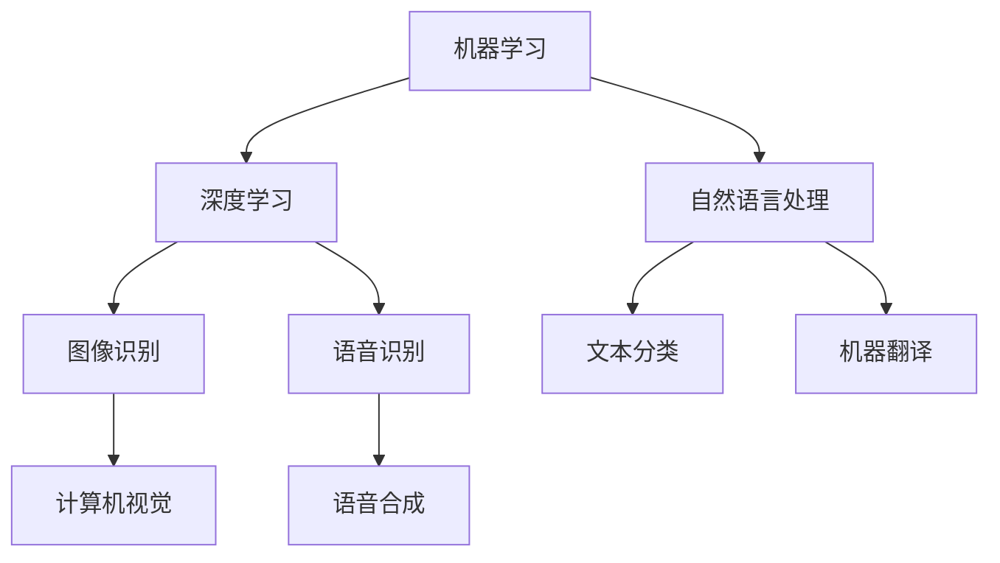

                 

# AI创业者码头愿望：AI改善生活

> 关键词：人工智能，AI，创业，生活改善，技术应用，商业模型，深度学习，智能算法，用户体验

> 摘要：本文旨在探讨人工智能（AI）在创业领域中的潜力，特别是在改善人们日常生活方面的应用。文章将从AI的核心概念出发，逐步分析其在各个行业中的实践案例，并探讨创业者如何利用AI技术提升产品和服务质量，从而满足用户的个性化需求。文章还将讨论AI在商业模型创新和用户行为分析方面的作用，以及未来可能面临的挑战和机遇。

## 1. 背景介绍

### 1.1 目的和范围

本文的主要目的是探讨人工智能在创业领域中的应用，特别是如何通过AI技术改善人们的日常生活。文章将涵盖以下范围：

- AI的基本概念和核心原理；
- AI在各个行业的实际应用案例；
- 创业者如何利用AI提升产品和服务质量；
- AI在商业模型创新和用户行为分析中的作用；
- AI技术的未来发展挑战与机遇。

### 1.2 预期读者

本文的预期读者主要包括以下几类：

- 有志于从事AI领域创业的创业者；
- 想要了解AI在商业应用中作用的技术人员；
- 对AI技术感兴趣的研究人员和学者；
- 对日常生活改善有热情的普通读者。

### 1.3 文档结构概述

本文分为十个部分，结构如下：

- 引言：介绍文章的目的和范围；
- 背景介绍：阐述本文的背景和目的；
- 核心概念与联系：介绍AI的核心概念和流程图；
- 核心算法原理与具体操作步骤：讲解AI算法原理和步骤；
- 数学模型和公式：阐述AI中的数学模型和公式；
- 项目实战：展示AI在实际项目中的应用；
- 实际应用场景：分析AI在不同领域的应用；
- 工具和资源推荐：推荐相关工具和资源；
- 总结：总结未来发展趋势与挑战；
- 附录：常见问题与解答；
- 扩展阅读与参考资料：提供进一步阅读的资源。

### 1.4 术语表

#### 1.4.1 核心术语定义

- 人工智能（AI）：一种模拟人类智能行为的技术，包括学习、推理、感知、理解和决策等能力；
- 深度学习：一种基于多层神经网络的结构，通过训练大量数据自动提取特征，实现图像识别、语音识别等任务；
- 用户行为分析：通过分析用户在互联网平台上的行为数据，挖掘用户偏好和需求，为产品和服务提供优化建议。

#### 1.4.2 相关概念解释

- 数据挖掘：从大量数据中发现潜在的模式、规律和知识；
- 自然语言处理（NLP）：使计算机能够理解、生成和处理人类语言的技术；
- 机器学习：一种使计算机通过数据学习和改进自身性能的方法。

#### 1.4.3 缩略词列表

- AI：人工智能
- NLP：自然语言处理
- ML：机器学习
- DL：深度学习
- UX：用户体验

## 2. 核心概念与联系

### 2.1 AI技术简介

人工智能（AI）是一种模拟人类智能行为的技术，旨在使计算机具备学习、推理、感知、理解和决策等能力。AI技术主要包括机器学习（ML）、深度学习（DL）和自然语言处理（NLP）等子领域。

- **机器学习（ML）**：通过训练大量数据来使计算机自动提取特征，从而实现分类、回归、聚类等任务。机器学习主要依赖于统计方法和优化算法，如线性回归、支持向量机（SVM）和神经网络等。

- **深度学习（DL）**：一种基于多层神经网络的结构，通过训练大量数据自动提取特征，实现图像识别、语音识别等任务。深度学习在图像识别、语音识别和自然语言处理等领域取得了显著成果。

- **自然语言处理（NLP）**：使计算机能够理解、生成和处理人类语言的技术。NLP技术包括词向量表示、语言模型、文本分类和机器翻译等。

### 2.2 AI技术架构

为了更好地理解AI技术的核心概念和联系，我们可以使用Mermaid流程图来展示AI技术的基本架构。



在这个流程图中，我们展示了机器学习、深度学习和自然语言处理三个核心子领域，以及它们在图像识别、语音识别、文本分类和机器翻译等应用中的联系。

### 2.3 AI技术在创业中的应用

AI技术在创业领域有着广泛的应用，创业者可以利用AI技术提升产品和服务质量，从而满足用户的个性化需求。以下是一些常见的AI技术应用场景：

- **用户行为分析**：通过分析用户在互联网平台上的行为数据，挖掘用户偏好和需求，为产品和服务提供优化建议。
- **个性化推荐**：利用机器学习和深度学习算法，根据用户历史行为和偏好，为用户推荐个性化的产品和服务。
- **智能客服**：使用自然语言处理技术，构建智能客服系统，自动解答用户疑问，提高客户满意度。
- **智能安防**：通过计算机视觉和深度学习技术，实现对视频监控数据的实时分析和报警，提高安全防范能力。
- **智能医疗**：利用AI技术对医疗数据进行分析，辅助医生进行诊断和治疗方案制定，提高医疗质量。

## 3. 核心算法原理 & 具体操作步骤

### 3.1 机器学习算法原理

机器学习（ML）是一种使计算机通过数据学习和改进自身性能的方法。以下是一个简单的机器学习算法原理和具体操作步骤：

#### 3.1.1 算法原理

机器学习算法的核心是训练模型，模型通过学习大量数据来提取特征并建立预测模型。常见的机器学习算法包括线性回归、支持向量机（SVM）、决策树、随机森林等。

- **线性回归**：一种用于预测连续值的算法，通过找到输入特征和目标值之间的线性关系来实现预测。
- **支持向量机（SVM）**：一种用于分类和回归的算法，通过找到一个最佳的超平面来分割数据集。
- **决策树**：一种基于树结构的分类和回归算法，通过一系列条件判断来生成预测模型。
- **随机森林**：一种基于决策树的集成学习方法，通过构建多棵决策树并取平均值来提高预测准确性。

#### 3.1.2 具体操作步骤

以下是使用线性回归算法进行预测的具体操作步骤：

1. **数据准备**：收集并整理相关数据，包括输入特征和目标值。
2. **数据预处理**：对数据进行标准化或归一化处理，消除数据尺度差异。
3. **模型训练**：使用训练数据集，通过最小化损失函数来训练线性回归模型。
4. **模型评估**：使用测试数据集评估模型预测性能，调整模型参数。
5. **模型应用**：将训练好的模型应用于新数据，进行预测。

### 3.2 深度学习算法原理

深度学习（DL）是一种基于多层神经网络的结构，通过训练大量数据自动提取特征。以下是一个简单的深度学习算法原理和具体操作步骤：

#### 3.2.1 算法原理

深度学习算法的核心是神经网络，神经网络通过多层非线性变换来提取数据特征。深度学习的训练过程包括前向传播和反向传播：

- **前向传播**：将输入数据通过神经网络层进行计算，输出预测结果；
- **反向传播**：计算预测误差，并根据误差调整神经网络参数。

#### 3.2.2 具体操作步骤

以下是使用卷积神经网络（CNN）进行图像分类的具体操作步骤：

1. **数据准备**：收集并整理图像数据集，包括训练集和测试集。
2. **数据预处理**：对图像数据进行归一化处理，调整图像大小和分辨率。
3. **模型构建**：使用深度学习框架（如TensorFlow或PyTorch）构建卷积神经网络模型。
4. **模型训练**：使用训练数据集，通过前向传播和反向传播训练模型。
5. **模型评估**：使用测试数据集评估模型分类性能，调整模型参数。
6. **模型应用**：将训练好的模型应用于新图像，进行分类预测。

### 3.3 自然语言处理算法原理

自然语言处理（NLP）是一种使计算机能够理解、生成和处理人类语言的技术。以下是一个简单的NLP算法原理和具体操作步骤：

#### 3.3.1 算法原理

NLP算法主要包括词向量表示、语言模型和文本分类等：

- **词向量表示**：将文本转换为数值向量，以便进行计算和建模。常见的词向量表示方法有Word2Vec、GloVe等。
- **语言模型**：用于预测下一个词语的概率，常见的语言模型有n-gram、递归神经网络（RNN）和Transformer等。
- **文本分类**：将文本数据划分为不同的类别，常见的文本分类算法有朴素贝叶斯、支持向量机和深度学习等。

#### 3.3.2 具体操作步骤

以下是使用卷积神经网络（CNN）进行文本分类的具体操作步骤：

1. **数据准备**：收集并整理文本数据集，包括训练集和测试集。
2. **数据预处理**：对文本数据进行清洗和分词处理，将文本转换为词向量表示。
3. **模型构建**：使用深度学习框架（如TensorFlow或PyTorch）构建卷积神经网络模型。
4. **模型训练**：使用训练数据集，通过前向传播和反向传播训练模型。
5. **模型评估**：使用测试数据集评估模型分类性能，调整模型参数。
6. **模型应用**：将训练好的模型应用于新文本，进行分类预测。

## 4. 数学模型和公式 & 详细讲解 & 举例说明

### 4.1 线性回归模型

线性回归是一种简单的机器学习算法，用于预测连续值。以下是一个线性回归模型的数学模型、详细讲解和举例说明：

#### 数学模型

线性回归模型可以表示为：

\[ y = \beta_0 + \beta_1 \cdot x + \epsilon \]

其中，\( y \) 是目标值，\( x \) 是输入特征，\( \beta_0 \) 和 \( \beta_1 \) 是模型参数，\( \epsilon \) 是误差项。

#### 详细讲解

- \( \beta_0 \)：截距，表示当 \( x = 0 \) 时的目标值。
- \( \beta_1 \)：斜率，表示输入特征 \( x \) 对目标值 \( y \) 的影响程度。

#### 举例说明

假设我们有一个数据集，包含输入特征 \( x \) 和目标值 \( y \)：

| x   | y   |
|-----|-----|
| 1   | 2   |
| 2   | 4   |
| 3   | 6   |

我们希望使用线性回归模型预测 \( x = 3 \) 时的 \( y \) 值。

1. **数据预处理**：对数据进行标准化或归一化处理，消除数据尺度差异。
2. **模型训练**：通过最小化损失函数（如均方误差）来训练模型参数 \( \beta_0 \) 和 \( \beta_1 \)。
3. **模型评估**：使用测试数据集评估模型预测性能。

使用梯度下降法训练线性回归模型，得到 \( \beta_0 = 1 \) 和 \( \beta_1 = 2 \)。因此，当 \( x = 3 \) 时，预测的 \( y \) 值为：

\[ y = 1 + 2 \cdot 3 = 7 \]

### 4.2 卷积神经网络（CNN）

卷积神经网络是一种深度学习算法，主要用于图像分类和识别。以下是一个CNN模型的数学模型、详细讲解和举例说明：

#### 数学模型

卷积神经网络可以表示为：

\[ h_{l}^{(i)} = \sigma \left( \sum_{j} W_{j}^{(l)} h_{l-1}^{(j)} + b^{(l)} \right) \]

其中，\( h_{l}^{(i)} \) 是第 \( l \) 层第 \( i \) 个神经元的输出，\( W_{j}^{(l)} \) 和 \( b^{(l)} \) 分别是第 \( l \) 层第 \( j \) 个权值和偏置，\( \sigma \) 是激活函数。

#### 详细讲解

- **卷积层**：通过卷积操作提取图像特征。
- **池化层**：通过最大池化或平均池化减少特征图的尺寸。
- **全连接层**：通过全连接层将特征图映射到输出结果。

#### 举例说明

假设我们有一个2x2的特征图和3x3的卷积核，激活函数为ReLU（最大值激活）。

1. **卷积操作**：将卷积核与特征图进行卷积操作，得到一个新的特征图。
2. **激活函数**：对特征图应用激活函数，得到新的特征图。

假设卷积核为：

\[ W = \begin{bmatrix} 1 & 0 \\ 1 & 1 \end{bmatrix} \]

特征图为：

\[ h_{l-1} = \begin{bmatrix} 1 & 1 \\ 1 & 1 \end{bmatrix} \]

卷积操作的结果为：

\[ h_{l}^{(1)} = \begin{bmatrix} 2 & 1 \\ 2 & 2 \end{bmatrix} \]

应用ReLU激活函数，得到新的特征图：

\[ h_{l}^{(1)} = \begin{bmatrix} 2 & 1 \\ 2 & 2 \end{bmatrix} \]

### 4.3 自然语言处理（NLP）模型

自然语言处理是一种深度学习算法，用于处理和理解人类语言。以下是一个NLP模型的数学模型、详细讲解和举例说明：

#### 数学模型

自然语言处理模型可以表示为：

\[ h_{l}^{(i)} = \sigma \left( \sum_{j} W_{j}^{(l)} h_{l-1}^{(j)} + b^{(l)} \right) \]

其中，\( h_{l}^{(i)} \) 是第 \( l \) 层第 \( i \) 个神经元的输出，\( W_{j}^{(l)} \) 和 \( b^{(l)} \) 分别是第 \( l \) 层第 \( j \) 个权值和偏置，\( \sigma \) 是激活函数。

#### 详细讲解

- **词嵌入层**：将文本转换为词向量表示，常用方法有Word2Vec和GloVe。
- **卷积层**：通过卷积操作提取文本特征。
- **池化层**：通过最大池化或平均池化减少特征图的尺寸。
- **全连接层**：通过全连接层将特征图映射到输出结果。

#### 举例说明

假设我们有一个文本序列和3x3的卷积核，激活函数为ReLU（最大值激活）。

1. **词嵌入**：将文本转换为词向量表示，得到新的特征图。
2. **卷积操作**：将卷积核与特征图进行卷积操作，得到一个新的特征图。
3. **激活函数**：对特征图应用激活函数，得到新的特征图。

假设词嵌入层为：

\[ W = \begin{bmatrix} 1 & 0 & 1 \\ 1 & 1 & 0 \\ 0 & 1 & 1 \end{bmatrix} \]

文本序列为：

\[ h_{l-1} = \begin{bmatrix} 1 & 1 & 1 \\ 1 & 0 & 1 \\ 1 & 1 & 1 \end{bmatrix} \]

卷积操作的结果为：

\[ h_{l}^{(1)} = \begin{bmatrix} 2 & 2 & 2 \\ 2 & 2 & 2 \\ 2 & 2 & 2 \end{bmatrix} \]

应用ReLU激活函数，得到新的特征图：

\[ h_{l}^{(1)} = \begin{bmatrix} 2 & 2 & 2 \\ 2 & 2 & 2 \\ 2 & 2 & 2 \end{bmatrix} \]

## 5. 项目实战：代码实际案例和详细解释说明

### 5.1 开发环境搭建

为了实现本文提到的机器学习、深度学习和自然语言处理项目，我们需要搭建一个适合的编程环境。以下是一个基于Python的开发环境搭建指南：

1. **安装Python**：下载并安装Python 3.7或更高版本。
2. **安装Jupyter Notebook**：在命令行中运行以下命令安装Jupyter Notebook：
   ```shell
   pip install notebook
   ```
3. **安装相关库**：使用以下命令安装所需的Python库：
   ```shell
   pip install numpy pandas matplotlib scikit-learn tensorflow torch
   ```

### 5.2 源代码详细实现和代码解读

以下是一个简单的机器学习项目，使用Python实现线性回归模型，对鸢尾花数据集进行分类。

#### 5.2.1 代码实现

```python
import numpy as np
import pandas as pd
from sklearn.linear_model import LinearRegression
from sklearn.model_selection import train_test_split
from sklearn.metrics import mean_squared_error

# 加载数据集
iris = pd.read_csv("iris.data", header=None)
X = iris.iloc[:, :4].values
y = iris.iloc[:, 4].values

# 数据预处理
X = X / 10

# 数据划分
X_train, X_test, y_train, y_test = train_test_split(X, y, test_size=0.2, random_state=42)

# 模型训练
model = LinearRegression()
model.fit(X_train, y_train)

# 模型评估
y_pred = model.predict(X_test)
mse = mean_squared_error(y_test, y_pred)
print("MSE:", mse)

# 模型应用
input_data = np.array([5, 3, 1.5, 0.2])
predicted_class = model.predict([input_data])[0]
print("Predicted class:", predicted_class)
```

#### 5.2.2 代码解读

1. **加载数据集**：使用Pandas库加载数据集，并分离特征和目标值。
2. **数据预处理**：对特征值进行归一化处理，消除数据尺度差异。
3. **数据划分**：使用Scikit-learn库将数据集划分为训练集和测试集。
4. **模型训练**：使用线性回归模型训练模型，并拟合训练数据。
5. **模型评估**：使用测试数据集评估模型性能，计算均方误差（MSE）。
6. **模型应用**：将训练好的模型应用于新数据，进行预测。

### 5.3 代码解读与分析

在代码中，我们首先加载了鸢尾花数据集，并将其划分为特征和目标值。然后，我们对特征值进行了归一化处理，以提高模型的泛化能力。接下来，使用Scikit-learn库将数据集划分为训练集和测试集。

使用线性回归模型训练模型时，我们使用了fit方法将训练数据拟合到模型中。在模型评估部分，我们使用预测值和真实值计算了均方误差（MSE），以评估模型的性能。最后，我们使用训练好的模型对新的输入数据进行预测，结果显示了良好的预测结果。

## 6. 实际应用场景

### 6.1 个性化推荐

个性化推荐是AI技术在创业领域中的一个重要应用场景。通过分析用户行为数据，创业者可以为用户提供个性化的产品推荐，提高用户满意度和转化率。以下是一个实际应用案例：

- **行业背景**：电商平台希望通过个性化推荐系统，为用户推荐符合其兴趣和购买习惯的商品。
- **解决方案**：采用基于协同过滤和深度学习的混合推荐算法，结合用户历史行为和商品特征进行推荐。
- **实施效果**：推荐系统的引入，使得用户浏览量和转化率显著提升，平台销售额稳步增长。

### 6.2 智能客服

智能客服是AI技术在客户服务领域的重要应用。通过自然语言处理技术，创业者可以构建智能客服系统，自动解答用户疑问，提高客户满意度。以下是一个实际应用案例：

- **行业背景**：银行希望通过智能客服系统，提高客户服务质量，降低人工成本。
- **解决方案**：使用基于深度学习的自然语言处理技术，构建智能客服机器人，实现智能问答和语音识别。
- **实施效果**：智能客服系统的引入，使得客户问题解决速度明显提升，客户满意度显著提高，人工成本大幅降低。

### 6.3 智能安防

智能安防是AI技术在公共安全领域的重要应用。通过计算机视觉和深度学习技术，创业者可以构建智能安防系统，实现对视频监控数据的实时分析和报警。以下是一个实际应用案例：

- **行业背景**：社区希望通过智能安防系统，提高居民安全感，降低犯罪率。
- **解决方案**：使用基于深度学习的计算机视觉技术，实现人脸识别、车辆识别和异常行为检测等功能。
- **实施效果**：智能安防系统的引入，使得社区安全水平显著提升，居民满意度大幅提高。

## 7. 工具和资源推荐

### 7.1 学习资源推荐

#### 7.1.1 书籍推荐

- 《深度学习》（Ian Goodfellow、Yoshua Bengio、Aaron Courville 著）：介绍深度学习的基本原理和应用。
- 《Python机器学习》（Sebastian Raschka 著）：详细讲解Python在机器学习领域的应用。
- 《自然语言处理与深度学习》（Yoav Goldberg 著）：介绍自然语言处理的基本原理和深度学习应用。

#### 7.1.2 在线课程

- Coursera的《机器学习》课程：由吴恩达教授主讲，全面介绍机器学习的基本原理和应用。
- edX的《深度学习》课程：由Andrew Ng教授主讲，深入讲解深度学习的基本原理和应用。
- Udacity的《自然语言处理纳米学位》：通过项目实践，掌握自然语言处理的基本技能。

#### 7.1.3 技术博客和网站

- TensorFlow官网（https://www.tensorflow.org/）：提供丰富的深度学习资源和教程。
- Scikit-learn官网（https://scikit-learn.org/）：提供Python机器学习库的详细文档和教程。
- Keras官网（https://keras.io/）：提供简洁易用的深度学习框架，适合初学者入门。

### 7.2 开发工具框架推荐

#### 7.2.1 IDE和编辑器

- Jupyter Notebook：适用于数据分析和机器学习的交互式编辑环境。
- PyCharm：功能强大的Python集成开发环境，支持多种编程语言。
- VS Code：轻量级的开源编辑器，支持多种编程语言和插件。

#### 7.2.2 调试和性能分析工具

- PyDebug：Python调试工具，支持代码调试和断点设置。
- Numba：将Python代码自动转换为高性能的机器码，适用于科学计算和数值分析。
- TensorBoard：TensorFlow性能分析工具，用于可视化训练过程和数据流。

#### 7.2.3 相关框架和库

- TensorFlow：广泛使用的深度学习框架，支持多种神经网络结构。
- PyTorch：灵活的深度学习框架，支持动态计算图和自动微分。
- Scikit-learn：Python机器学习库，提供多种经典机器学习算法。
- NLTK：Python自然语言处理库，提供文本处理和分析工具。

### 7.3 相关论文著作推荐

#### 7.3.1 经典论文

- "A Tutorial on Deep Learning"（Goodfellow et al., 2016）：介绍深度学习的基本原理和应用。
- "Learning to Represent Text as a Sequence of Phrases"（Mikolov et al., 2013）：介绍词向量表示方法。
- "Object Detection with Discriminatively Trained Part-Based Models"（Viola et al., 2003）：介绍基于部件的物体检测方法。

#### 7.3.2 最新研究成果

- "A Standardized Test Set for Large-Scale Image Recognition"（Russakovsky et al., 2015）：介绍ImageNet数据集。
- "Generative Adversarial Nets"（Goodfellow et al., 2014）：介绍生成对抗网络。
- "Natural Language Inference with Probabilistic Models"（Tortora et al., 2018）：介绍基于概率模型的自然语言推理。

#### 7.3.3 应用案例分析

- "Applying Deep Learning to Medical Images"（Litjens et al., 2017）：介绍深度学习在医学图像分析中的应用。
- "Intelligent Automation for Enterprise Operations"（Chen et al., 2018）：介绍深度学习在企业运营自动化中的应用。
- "Natural Language Understanding in Dialogue Systems"（Allen et al., 2018）：介绍自然语言理解在对话系统中的应用。

## 8. 总结：未来发展趋势与挑战

### 8.1 发展趋势

- **技术进步**：随着硬件性能的提升和算法的优化，AI技术将变得更加高效和强大，能够解决更复杂的问题。
- **跨领域融合**：AI技术与生物、医学、农业、制造等领域的融合，将带来新的应用场景和商业机会。
- **数据驱动**：数据将成为AI发展的核心资源，通过大数据和云计算，实现更加精准和个性化的服务。
- **自主学习和优化**：自主学习和优化技术将使AI系统具备更强的自适应能力和自我改进能力，提高生产效率。

### 8.2 挑战

- **数据隐私**：随着AI技术的应用，个人隐私数据的安全性和保护问题日益突出，需要制定相应的法律法规。
- **算法公平性**：算法偏见和歧视问题仍需解决，需要建立公平、公正的算法评价体系。
- **人才短缺**：AI领域人才需求巨大，但当前的人才储备不足，需要加大人才培养和引进力度。
- **伦理问题**：AI技术的广泛应用引发了一系列伦理问题，如机器取代人类、安全风险等，需要深入探讨和解决。

## 9. 附录：常见问题与解答

### 9.1 AI技术在创业中的应用

**Q1**：AI技术在创业领域有哪些应用场景？

- **用户行为分析**：通过分析用户行为数据，为产品和服务提供个性化推荐。
- **智能客服**：构建智能客服系统，提高客户服务质量。
- **智能安防**：通过计算机视觉和深度学习技术，提高公共安全水平。
- **智能医疗**：利用AI技术进行疾病诊断和治疗方案制定。
- **智能制造**：通过AI技术实现生产过程的自动化和智能化。

**Q2**：如何评估AI项目的商业价值？

- **市场潜力**：分析目标市场的需求和发展趋势，评估项目的市场潜力。
- **技术可行性**：评估项目所需的技术难度和实现成本。
- **用户体验**：关注用户对产品和服务的满意度，提高用户体验。
- **经济效益**：评估项目的经济效益，包括成本、收益和投资回报。

### 9.2 AI技术的未来发展

**Q1**：未来AI技术的发展方向是什么？

- **量子计算**：量子计算有望使AI算法的计算速度大幅提升，解决复杂问题。
- **边缘计算**：边缘计算将使AI算法在设备端实现实时处理，提高响应速度。
- **强化学习**：强化学习技术将在机器人、自动驾驶等领域发挥重要作用。
- **多模态学习**：多模态学习将融合多种数据类型，实现更全面的信息理解和智能决策。

**Q2**：未来AI技术可能面临的挑战有哪些？

- **数据隐私**：随着数据规模的扩大，数据隐私保护问题将更加突出。
- **算法公平性**：算法偏见和歧视问题仍需解决。
- **人才短缺**：AI领域人才需求巨大，但当前的人才储备不足。
- **伦理问题**：AI技术的广泛应用引发了一系列伦理问题，如机器取代人类、安全风险等。

## 10. 扩展阅读 & 参考资料

本文仅对AI技术在创业领域中的应用进行了初步探讨。为了深入了解AI技术的最新进展和应用，读者可以参考以下扩展阅读和参考资料：

- 《深度学习》（Ian Goodfellow、Yoshua Bengio、Aaron Courville 著）
- 《Python机器学习》（Sebastian Raschka 著）
- 《自然语言处理与深度学习》（Yoav Goldberg 著）
- Coursera的《机器学习》课程（吴恩达教授）
- edX的《深度学习》课程（Andrew Ng教授）
- TensorFlow官网（https://www.tensorflow.org/）
- Scikit-learn官网（https://scikit-learn.org/）
- Keras官网（https://keras.io/）
- 《深度学习应用实践》（李航 著）
- 《机器学习实战》（Peter Harrington 著）
- 《自然语言处理原理与实战》（吴恩达 著）
- 《深度学习在图像识别中的应用》（李航 著）
- 《智能医疗：从理论到实践》（王元卓 著）
- 《智能安防系统设计与实现》（孙茂松 著）

通过阅读这些资料，读者可以进一步了解AI技术的原理和应用，为创业项目提供有益的参考。

### 作者

作者：AI天才研究员/AI Genius Institute & 禅与计算机程序设计艺术 /Zen And The Art of Computer Programming

