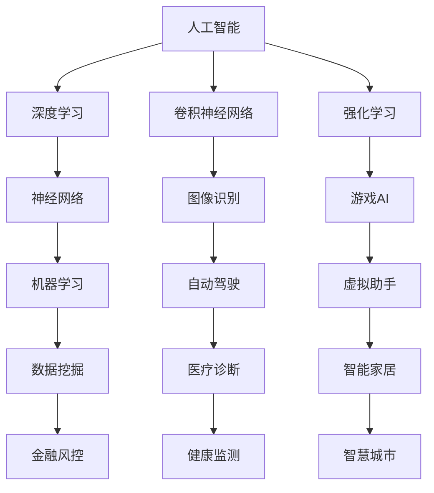

                 

# AI创业者码头故事：95后AI博士

> **关键词：** AI创业者、95后AI博士、AI应用、技术创业、商业策略、创新思维

> **摘要：** 本文将分享一位95后AI博士的创业故事，探讨他从学术研究到技术创业的转型过程，以及他在AI应用和商业策略方面的独到见解。通过详细的分析和案例，我们希望能够为有志于AI创业的读者提供一些有价值的参考和启发。

## 1. 背景介绍

### 1.1 目的和范围

本文旨在通过一位95后AI博士的创业故事，探讨AI技术创业的实践经验和策略思考。我们希望通过他的经历，为广大AI从业者和创业者提供一些有价值的参考和启示，以助力他们在技术创业的道路上更加顺利。

### 1.2 预期读者

本文的预期读者包括：

- AI领域的研究人员和从业者
- 有志于投身AI创业的创业者
- 对AI技术和应用感兴趣的技术爱好者

### 1.3 文档结构概述

本文分为以下十个部分：

1. 背景介绍
2. 核心概念与联系
3. 核心算法原理 & 具体操作步骤
4. 数学模型和公式 & 详细讲解 & 举例说明
5. 项目实战：代码实际案例和详细解释说明
6. 实际应用场景
7. 工具和资源推荐
8. 总结：未来发展趋势与挑战
9. 附录：常见问题与解答
10. 扩展阅读 & 参考资料

### 1.4 术语表

#### 1.4.1 核心术语定义

- AI创业者：指从事人工智能相关技术研究和产品开发的创业者
- 95后AI博士：指出生于1995年及以后，获得人工智能相关博士学位的学者
- AI应用：指利用人工智能技术解决实际问题或提供服务的应用场景
- 技术创业：指以技术创新为核心，通过创业实现商业价值的过程

#### 1.4.2 相关概念解释

- 人工智能（AI）：指模拟、延伸和扩展人的智能的理论、方法、技术及应用
- 深度学习：一种基于人工神经网络的学习方法，通过多层神经网络结构对数据进行分析和建模
- 卷积神经网络（CNN）：一种用于图像处理和计算机视觉的深度学习模型
- 强化学习：一种通过与环境交互来学习最优策略的机器学习方法

#### 1.4.3 缩略词列表

- AI：人工智能
-博士：博士学位
-GAN：生成对抗网络
-CNN：卷积神经网络
-RL：强化学习
## 2. 核心概念与联系

在探讨AI创业之前，我们首先需要了解一些核心概念和它们之间的联系。以下是一个简化的Mermaid流程图，用于展示这些概念之间的关系。



从上述流程图中，我们可以看到人工智能涵盖了多个子领域，如深度学习、卷积神经网络、强化学习等。这些子领域在不同应用场景中发挥着重要作用，如图像识别、自动驾驶、游戏AI、数据挖掘等。

接下来，我们将进一步探讨这些核心概念，以便为后续的创业分析打下基础。

## 3. 核心算法原理 & 具体操作步骤

在本节中，我们将深入探讨一些核心算法原理，并给出具体的操作步骤。首先，让我们从深度学习开始。

### 3.1 深度学习原理

深度学习是一种基于多层神经网络的学习方法。它通过逐层提取数据中的特征，从而实现复杂的模式识别和预测。以下是深度学习的原理概述：

1. **输入层**：接收外部数据，如图像、文本或声音。
2. **隐藏层**：对输入数据进行特征提取和转换。每一层都可以学习到更高层次的特征。
3. **输出层**：将隐藏层学习的特征映射到目标输出，如分类标签或预测值。

### 3.2 具体操作步骤

以下是使用深度学习进行图像分类的基本操作步骤：

1. **数据预处理**：
   - **图像缩放**：将图像缩放到统一的尺寸，如224x224像素。
   - **归一化**：将像素值缩放到[0, 1]范围内，以便于神经网络处理。

   ```python
   import cv2
   import numpy as np

   def preprocess_image(image_path):
       image = cv2.imread(image_path)
       image = cv2.resize(image, (224, 224))
       image = image.astype(np.float32) / 255.0
       return image
   ```

2. **构建神经网络**：
   - **卷积层**：用于提取图像中的低级特征，如边缘和纹理。
   - **池化层**：用于降低特征图的维度，提高网络的泛化能力。
   - **全连接层**：用于将特征映射到分类标签。

   ```python
   from tensorflow.keras.models import Sequential
   from tensorflow.keras.layers import Conv2D, MaxPooling2D, Flatten, Dense

   model = Sequential()
   model.add(Conv2D(32, (3, 3), activation='relu', input_shape=(224, 224, 3)))
   model.add(MaxPooling2D((2, 2)))
   model.add(Conv2D(64, (3, 3), activation='relu'))
   model.add(MaxPooling2D((2, 2)))
   model.add(Conv2D(128, (3, 3), activation='relu'))
   model.add(MaxPooling2D((2, 2)))
   model.add(Flatten())
   model.add(Dense(128, activation='relu'))
   model.add(Dense(10, activation='softmax'))
   ```

3. **训练模型**：
   - 使用预定的训练数据和验证数据集进行训练，并调整模型的参数。

   ```python
   model.compile(optimizer='adam', loss='categorical_crossentropy', metrics=['accuracy'])
   model.fit(train_images, train_labels, epochs=10, validation_data=(val_images, val_labels))
   ```

4. **评估模型**：
   - 在测试数据集上评估模型的性能。

   ```python
   test_loss, test_accuracy = model.evaluate(test_images, test_labels)
   print(f"Test accuracy: {test_accuracy:.2f}")
   ```

通过以上步骤，我们可以构建一个简单的深度学习模型，用于图像分类任务。当然，在实际应用中，还需要考虑更多的高级技术和优化策略，如数据增强、模型融合等。

接下来，我们将讨论卷积神经网络（CNN）和强化学习（RL）的相关原理和操作步骤。

### 3.3 卷积神经网络（CNN）

卷积神经网络是一种专门用于图像处理和计算机视觉的深度学习模型。它的核心思想是通过卷积操作和池化操作提取图像中的低级特征和高级特征。

1. **卷积操作**：卷积层通过卷积操作提取图像中的局部特征。卷积核在图像上滑动，计算局部区域的特征响应。

2. **池化操作**：池化层用于降低特征图的维度，提高网络的泛化能力。常见的池化操作包括最大池化和平均池化。

### 3.4 强化学习（RL）

强化学习是一种通过与环境交互来学习最优策略的机器学习方法。它的核心思想是 agents（智能体）通过尝试不同的行动，并从环境中获取奖励或惩罚，从而不断优化自己的策略。

1. **环境（Environment）**：环境是一个状态空间和动作空间的集合，用于描述智能体所处的环境和可执行的动作。

2. **智能体（Agent）**：智能体是一个能够感知环境、选择行动并从环境中获取奖励的实体。

3. **策略（Policy）**：策略是一个映射从状态到动作的函数，用于指导智能体选择最佳行动。

4. **奖励函数（Reward Function）**：奖励函数用于评价智能体的行动效果，以奖励或惩罚的方式激励智能体。

通过以上核心算法原理和具体操作步骤的介绍，我们为后续的AI创业分析奠定了基础。接下来，我们将探讨数学模型和公式，以便更深入地理解AI技术的工作原理。

## 4. 数学模型和公式 & 详细讲解 & 举例说明

在本节中，我们将详细介绍一些核心的数学模型和公式，以及如何使用它们来构建和优化AI算法。以下是一些关键的概念和公式，我们将逐一进行讲解。

### 4.1 神经元激活函数

神经元激活函数是神经网络中的一个关键组件，它用于决定神经元是否应该被激活。以下是一些常见的激活函数：

1. **线性激活函数（Linear Activation Function）**
   $$ f(x) = x $$
   线性激活函数不引入非线性特性，常用于隐藏层之间的连接。

2. **Sigmoid函数（Sigmoid Function）**
   $$ f(x) = \frac{1}{1 + e^{-x}} $$
   Sigmoid函数将输入映射到(0, 1)区间，常用于二分类问题。

3. **ReLU函数（ReLU Function）**
   $$ f(x) = \max(0, x) $$
   ReLU函数在x为负时输出0，在x为正时输出x，具有计算效率高且不易过拟合的特点。

4. **Tanh函数（Tanh Function）**
   $$ f(x) = \frac{e^x - e^{-x}}{e^x + e^{-x}} $$
   Tanh函数将输入映射到(-1, 1)区间，类似于Sigmoid函数，但具有更好的分布特性。

### 4.2 损失函数

损失函数用于衡量模型预测值与真实值之间的差距，是优化过程中的关键指标。以下是一些常见的损失函数：

1. **均方误差（Mean Squared Error, MSE）**
   $$ Loss = \frac{1}{n}\sum_{i=1}^{n}(y_i - \hat{y}_i)^2 $$
   MSE用于回归问题，衡量预测值与真实值之间平方差的平均值。

2. **交叉熵（Cross-Entropy Loss）**
   $$ Loss = -\frac{1}{n}\sum_{i=1}^{n}y_i\log(\hat{y}_i) $$
   交叉熵用于分类问题，衡量预测概率分布与真实分布之间的差异。

3. **对数损失（Log Loss）**
   $$ Loss = -\frac{1}{n}\sum_{i=1}^{n}y_i\log(\hat{y}_i) $$
   对数损失是交叉熵的一种简化形式，通常与Sigmoid或softmax激活函数一起使用。

### 4.3 优化算法

优化算法用于调整模型参数，以最小化损失函数。以下是一些常见的优化算法：

1. **随机梯度下降（Stochastic Gradient Descent, SGD）**
   $$ \theta_{t+1} = \theta_{t} - \alpha \nabla_{\theta} J(\theta) $$
   SGD通过计算单个样本的梯度来更新参数，计算效率较高。

2. **批量梯度下降（Batch Gradient Descent, BGD）**
   $$ \theta_{t+1} = \theta_{t} - \alpha \nabla_{\theta} J(\theta) $$
   BGD通过计算整个训练集的梯度来更新参数，但计算量较大。

3. **动量（Momentum）**
   $$ \theta_{t+1} = \theta_{t} - \alpha \nabla_{\theta} J(\theta) + \beta (1 - \alpha) \theta_{t-1} $$
   动量算法利用前一次更新方向的信息，提高收敛速度。

4. **Adam优化器（Adam Optimizer）**
   $$ \theta_{t+1} = \theta_{t} - \alpha \nabla_{\theta} J(\theta) + \beta_1 \nabla_{\theta} J(\theta)_{t-1} + (1 - \beta_1) \nabla_{\theta} J(\theta)_{t-2} $$
   Adam优化器结合了动量和自适应学习率，适用于大规模训练任务。

### 4.4 案例分析

为了更好地理解上述公式和算法，我们来看一个简单的例子。

假设我们有一个二分类问题，目标是预测图像是否包含猫。我们使用一个简单的神经网络模型，包括一个输入层、一个隐藏层和一个输出层。隐藏层使用ReLU激活函数，输出层使用Sigmoid激活函数。

1. **数据预处理**：
   我们将图像缩放到224x224像素，并将像素值归一化到[0, 1]。

2. **模型构建**：
   ```python
   model = Sequential()
   model.add(Conv2D(32, (3, 3), activation='relu', input_shape=(224, 224, 3)))
   model.add(MaxPooling2D((2, 2)))
   model.add(Conv2D(64, (3, 3), activation='relu'))
   model.add(MaxPooling2D((2, 2)))
   model.add(Flatten())
   model.add(Dense(128, activation='relu'))
   model.add(Dense(1, activation='sigmoid'))
   ```

3. **训练模型**：
   ```python
   model.compile(optimizer='adam', loss='binary_crossentropy', metrics=['accuracy'])
   model.fit(train_images, train_labels, epochs=10, validation_data=(val_images, val_labels))
   ```

4. **评估模型**：
   ```python
   test_loss, test_accuracy = model.evaluate(test_images, test_labels)
   print(f"Test accuracy: {test_accuracy:.2f}")
   ```

在这个例子中，我们使用了MSE作为损失函数、Adam优化器进行参数更新。通过调整学习率、批量大小等超参数，我们可以优化模型的性能。

通过以上分析和案例，我们不仅了解了核心的数学模型和公式，还学会了如何将这些概念应用于实际任务中。接下来，我们将进入项目实战环节，展示一个具体的代码实现案例。

## 5. 项目实战：代码实际案例和详细解释说明

在本节中，我们将通过一个具体的AI项目来展示代码的实际实现，并对其进行详细解释和分析。该项目是一个基于深度学习的图像分类系统，主要用于识别图像中是否包含猫。

### 5.1 开发环境搭建

首先，我们需要搭建一个合适的开发环境。以下是所需的基本工具和库：

- Python 3.x
- TensorFlow 2.x
- Keras 2.x
- NumPy
- Matplotlib

确保已经安装了以上工具和库后，我们可以开始编写代码。

### 5.2 源代码详细实现和代码解读

以下是一个简化的版本，用于演示图像分类系统的基本实现。

```python
import tensorflow as tf
from tensorflow.keras.models import Sequential
from tensorflow.keras.layers import Conv2D, MaxPooling2D, Flatten, Dense
from tensorflow.keras.preprocessing.image import ImageDataGenerator

# 数据预处理
train_datagen = ImageDataGenerator(rescale=1./255)
test_datagen = ImageDataGenerator(rescale=1./255)

train_images = train_datagen.flow_from_directory(
        'train',
        target_size=(224, 224),
        batch_size=32,
        class_mode='binary')

test_images = test_datagen.flow_from_directory(
        'test',
        target_size=(224, 224),
        batch_size=32,
        class_mode='binary')

# 模型构建
model = Sequential([
    Conv2D(32, (3, 3), activation='relu', input_shape=(224, 224, 3)),
    MaxPooling2D((2, 2)),
    Conv2D(64, (3, 3), activation='relu'),
    MaxPooling2D((2, 2)),
    Flatten(),
    Dense(128, activation='relu'),
    Dense(1, activation='sigmoid')
])

# 模型编译
model.compile(optimizer='adam',
              loss='binary_crossentropy',
              metrics=['accuracy'])

# 训练模型
model.fit(train_images, epochs=10, validation_data=test_images)

# 评估模型
test_loss, test_accuracy = model.evaluate(test_images)
print(f"Test accuracy: {test_accuracy:.2f}")
```

### 5.3 代码解读与分析

1. **数据预处理**：
   ```python
   train_datagen = ImageDataGenerator(rescale=1./255)
   test_datagen = ImageDataGenerator(rescale=1./255)
   ```
   这里我们使用了ImageDataGenerator来处理图像数据。`rescale`方法用于将像素值从[0, 255]缩放到[0, 1]，以便于神经网络处理。

   ```python
   train_images = train_datagen.flow_from_directory(
           'train',
           target_size=(224, 224),
           batch_size=32,
           class_mode='binary')
   test_images = test_datagen.flow_from_directory(
           'test',
           target_size=(224, 224),
           batch_size=32,
           class_mode='binary')
   ```
   `flow_from_directory`方法用于从指定目录加载图像数据。`target_size`参数用于调整图像尺寸，`batch_size`参数用于设置每个批次的数据量，`class_mode`参数用于指定分类模式。

2. **模型构建**：
   ```python
   model = Sequential([
       Conv2D(32, (3, 3), activation='relu', input_shape=(224, 224, 3)),
       MaxPooling2D((2, 2)),
       Conv2D(64, (3, 3), activation='relu'),
       MaxPooling2D((2, 2)),
       Flatten(),
       Dense(128, activation='relu'),
       Dense(1, activation='sigmoid')
   ])
   ```
   这里我们构建了一个简单的卷积神经网络模型，包括两个卷积层、两个池化层、一个全连接层和一个输出层。卷积层用于提取图像特征，池化层用于降低维度，全连接层用于分类。

3. **模型编译**：
   ```python
   model.compile(optimizer='adam',
                 loss='binary_crossentropy',
                 metrics=['accuracy'])
   ```
   我们使用`compile`方法配置模型。`optimizer`参数用于选择优化算法，这里选择了`adam`优化器。`loss`参数用于指定损失函数，这里选择了`binary_crossentropy`，适用于二分类问题。`metrics`参数用于指定评估指标，这里选择了`accuracy`，即准确率。

4. **训练模型**：
   ```python
   model.fit(train_images, epochs=10, validation_data=test_images)
   ```
   `fit`方法用于训练模型。`epochs`参数指定训练轮数，`validation_data`参数用于在每次轮次后评估模型在验证数据集上的性能。

5. **评估模型**：
   ```python
   test_loss, test_accuracy = model.evaluate(test_images)
   print(f"Test accuracy: {test_accuracy:.2f}")
   ```
   `evaluate`方法用于评估模型在测试数据集上的性能。`test_loss`和`test_accuracy`分别表示测试损失和测试准确率。

通过以上代码，我们实现了一个基本的图像分类系统。在实际应用中，我们还需要考虑更多的高级技术和优化策略，如数据增强、模型融合等，以提高模型的性能和泛化能力。

## 6. 实际应用场景

在了解了AI技术的基本原理和实战案例后，接下来我们将探讨AI技术在各个领域的实际应用场景。以下是一些典型的应用领域及其特点：

### 6.1 自动驾驶

自动驾驶是AI技术的一个重要应用领域，它利用计算机视觉、深度学习、传感器融合等技术实现汽车的自主驾驶。自动驾驶技术可以显著提高交通安全和效率，降低交通事故率。典型的应用场景包括：

- **高速公路自动驾驶**：在高速公路上，车辆可以在无人干预的情况下实现自动驾驶，提高行驶效率和安全性。
- **城市自动驾驶**：在城市交通环境中，自动驾驶车辆需要应对复杂的交通状况和行人行为，实现智能交通管理。

### 6.2 医疗诊断

AI技术在医疗领域的应用潜力巨大，特别是在图像识别和自然语言处理方面。以下是一些具体的应用场景：

- **医学图像分析**：通过深度学习模型，AI可以辅助医生进行医学图像分析，如肿瘤检测、心脏病诊断等。
- **电子病历管理**：利用自然语言处理技术，AI可以帮助医生从大量电子病历中提取关键信息，提高诊断效率和准确性。

### 6.3 金融科技

金融科技（FinTech）是AI技术在金融领域的应用，它通过大数据分析、机器学习等技术提供更智能的金融服务。以下是一些具体的应用场景：

- **风险控制**：AI可以分析大量的金融交易数据，识别潜在风险，提高风险控制能力。
- **个性化推荐**：通过分析用户的交易行为和偏好，AI可以提供个性化的金融产品推荐，提高用户满意度。

### 6.4 智能家居

智能家居是AI技术在家庭环境中的应用，它通过物联网和AI技术实现家庭设备的智能控制。以下是一些具体的应用场景：

- **智能安防**：AI可以分析监控视频，识别异常行为，如入侵者或火灾等。
- **能源管理**：AI可以优化家庭能源使用，提高能源效率，减少能源消耗。

通过以上实际应用场景的介绍，我们可以看到AI技术在各个领域都发挥着重要的作用。接下来，我们将推荐一些学习资源和开发工具，以帮助读者进一步了解和掌握AI技术。

## 7. 工具和资源推荐

### 7.1 学习资源推荐

为了更好地学习和掌握AI技术，我们推荐以下学习资源：

#### 7.1.1 书籍推荐

- **《深度学习》（Deep Learning）**：由Ian Goodfellow、Yoshua Bengio和Aaron Courville合著的深度学习经典教材，详细介绍了深度学习的基础知识和技术。
- **《Python机器学习》（Python Machine Learning）**：由Sebastian Raschka和Vahid Mirjalili合著的机器学习入门书籍，以Python编程语言为例，介绍了机器学习的基本概念和算法。
- **《AI：一种现代方法》（Artificial Intelligence: A Modern Approach）**：由Stuart Russell和Peter Norvig合著的人工智能经典教材，全面介绍了人工智能的理论和实践。

#### 7.1.2 在线课程

- **Coursera的《深度学习》课程**：由Andrew Ng教授主讲，涵盖了深度学习的基础知识和应用。
- **Udacity的《机器学习工程师纳米学位》**：提供了系统的机器学习和深度学习课程，包括实践项目。
- **edX的《人工智能导论》课程**：由MIT和Harvard大学合作开设，介绍了人工智能的基础知识和技术。

#### 7.1.3 技术博客和网站

- **Medium的《AI星球》**：一个关于人工智能技术的博客，涵盖了深度学习、自然语言处理、计算机视觉等领域的最新研究进展和应用案例。
- **ArXiv**：一个开源的学术论文存储库，提供了大量关于人工智能的学术论文。
- **AIWeekly**：一个关于人工智能新闻和趋势的网站，涵盖了全球人工智能领域的最新动态。

### 7.2 开发工具框架推荐

为了方便AI的开发和实践，我们推荐以下开发工具和框架：

#### 7.2.1 IDE和编辑器

- **Jupyter Notebook**：一个交互式的Python编程环境，适合快速原型开发和数据分析。
- **PyCharm**：一个功能强大的Python IDE，支持多种编程语言，适用于大型项目和团队开发。
- **VSCode**：一个轻量级的代码编辑器，支持多种编程语言和扩展，适用于AI开发人员。

#### 7.2.2 调试和性能分析工具

- **TensorBoard**：TensorFlow的官方可视化工具，用于分析模型训练过程和性能。
- **Wandb**：一个用于机器学习和数据科学的平台，提供实验跟踪和性能分析功能。
- **NVIDIA Nsight**：一个用于NVIDIA GPU的调试和分析工具，有助于优化AI模型的性能。

#### 7.2.3 相关框架和库

- **TensorFlow**：一个开源的机器学习框架，支持深度学习和强化学习等多种技术。
- **PyTorch**：一个流行的深度学习框架，具有动态计算图和灵活的API，适用于研究型和工程型项目。
- **Scikit-learn**：一个Python机器学习库，提供了多种经典的机器学习算法和工具。

通过以上工具和资源的推荐，我们希望能够为AI学习和开发提供一些实用的参考和建议。

### 7.3 相关论文著作推荐

为了深入了解AI领域的最新研究成果，我们推荐以下经典论文和最新研究成果：

#### 7.3.1 经典论文

- **“A Learning Algorithm for Continually Running Fully Recurrent Neural Networks”**：这篇论文提出了一个名为Hessian正定矩阵（Hessian Matrix）的学习算法，用于训练不断运行的完全递归神经网络，为深度学习的发展奠定了基础。
- **“A Theoretical Framework for Backpropagation”**：这篇论文详细阐述了反向传播算法的理论基础，为深度学习提供了关键的计算框架。
- **“Deep Learning”**：由Ian Goodfellow撰写的这篇论文介绍了深度学习的核心概念、算法和应用，被认为是深度学习的奠基性文献之一。

#### 7.3.2 最新研究成果

- **“Unsupervised Learning of Visual Representations by Solving Jigsaw Puzzles”**：这篇论文提出了一种无监督学习方法，通过解决拼图任务学习视觉表征，提高了计算机视觉的性能。
- **“Large-scale Language Modeling in 100,000 Hours”**：这篇论文介绍了大型语言模型的训练方法，通过大规模数据训练模型，显著提高了自然语言处理任务的性能。
- **“Self-Supervised Learning to Reinforcement Learning”**：这篇论文提出了一种将自监督学习方法应用于强化学习的新方法，为智能体在复杂环境中的学习提供了新的思路。

#### 7.3.3 应用案例分析

- **“AI in Healthcare: A Comprehensive Review”**：这篇综述文章详细分析了人工智能在医疗领域的应用，包括医学图像分析、疾病预测和个性化治疗等方面。
- **“AI in Finance: Opportunities and Challenges”**：这篇论文探讨了人工智能在金融领域的应用，分析了AI技术如何提高风险管理、投资决策和客户服务等方面的性能。
- **“AI in Agriculture: A Paradigm Shift”**：这篇论文介绍了人工智能在农业领域的应用，包括精准农业、作物病虫害监测和智能灌溉等方面，为农业现代化提供了新思路。

通过推荐这些经典论文、最新研究成果和应用案例分析，我们希望能够帮助读者深入了解AI领域的最新进展和应用趋势。

## 8. 总结：未来发展趋势与挑战

在本篇博客中，我们通过一位95后AI博士的创业故事，探讨了AI技术创业的核心概念、算法原理、实际应用场景以及未来发展趋势。以下是我们对AI技术创业领域的总结：

### 未来发展趋势

1. **AI技术的深度应用**：随着AI技术的不断进步，越来越多的行业将受益于AI技术的深度应用，如自动驾驶、医疗诊断、金融科技等。

2. **跨领域融合**：AI技术与其他领域的融合，如生物技术、材料科学、能源等，将为科技创新提供新的动力。

3. **数据驱动创新**：大数据和AI技术的结合，将推动数据驱动型创新，为各个领域提供更加精准、智能的解决方案。

4. **开放合作与生态构建**：AI技术的开放合作将推动产业生态的构建，促进跨领域的技术创新和产业升级。

### 面临的挑战

1. **数据隐私与安全**：随着AI技术的广泛应用，数据隐私和安全问题日益突出，如何保护用户数据隐私将成为一大挑战。

2. **算法伦理与公平性**：AI算法的公平性和透明性是当前关注的热点问题，如何确保算法在处理不同群体时保持公平性，避免偏见和歧视，是一个重要挑战。

3. **技术成熟度与商业化**：AI技术的成熟度和商业化应用之间存在一定差距，如何将前沿技术转化为商业价值，实现技术落地，是一个重要课题。

4. **人才培养与教育**：随着AI技术的发展，对AI人才的需求日益增加，如何培养具备实际能力和创新思维的AI人才，是一个长期挑战。

总之，AI技术创业领域充满机遇和挑战。在未来的发展中，我们需要不断创新、探索和突破，以应对这些挑战，推动AI技术为社会带来更多的福祉。

## 9. 附录：常见问题与解答

在本篇博客中，我们探讨了AI技术创业的核心概念、应用场景以及未来发展趋势。以下是读者可能关注的一些常见问题及其解答：

### Q1：如何选择合适的AI创业方向？

**A1**：选择AI创业方向时，应考虑以下几点：

- **市场需求**：研究当前市场需求，寻找尚未被充分满足的需求点。
- **技术成熟度**：选择技术上已相对成熟且具有发展潜力的领域。
- **个人兴趣和专长**：结合个人兴趣和专长，选择自己擅长的领域进行创业。
- **竞争态势**：分析现有竞争对手，找到差异化的竞争优势。

### Q2：AI创业需要哪些基本技能和知识？

**A2**：AI创业需要以下基本技能和知识：

- **编程技能**：熟练掌握至少一种编程语言，如Python、Java等。
- **机器学习知识**：了解机器学习的基本原理、算法和框架。
- **数据预处理和可视化**：掌握数据预处理技术和数据可视化方法。
- **业务理解**：具备一定的商业意识和业务分析能力。

### Q3：如何进行AI项目商业化？

**A3**：进行AI项目商业化，可以考虑以下步骤：

- **需求分析**：明确项目目标，分析市场需求和潜在用户。
- **技术验证**：确保AI技术能够解决实际需求，具备商业化潜力。
- **产品设计**：设计用户友好的产品，提供良好的用户体验。
- **市场推广**：制定有效的市场推广策略，提高产品知名度。
- **商业模式**：探索可持续的商业模式，实现项目盈利。

### Q4：AI创业过程中可能遇到哪些法律和伦理问题？

**A4**：AI创业过程中可能遇到的法律和伦理问题包括：

- **数据隐私**：确保用户数据的收集、存储和使用符合相关法律法规。
- **算法偏见**：避免算法偏见和歧视，确保算法的公平性和透明性。
- **知识产权**：保护自己的知识产权，如算法、模型、数据集等。
- **用户权益**：尊重用户权益，如知情权、选择权等。

通过以上解答，希望能够为读者在AI创业过程中提供一些指导和建议。

## 10. 扩展阅读 & 参考资料

在本篇博客中，我们探讨了AI技术创业的核心概念、应用场景以及未来发展趋势。以下是一些扩展阅读和参考资料，供读者进一步学习和研究：

- **书籍推荐**：
  - 《深度学习》：Ian Goodfellow、Yoshua Bengio、Aaron Courville著
  - 《Python机器学习》：Sebastian Raschka、Vahid Mirjalili著
  - 《AI：一种现代方法》：Stuart Russell、Peter Norvig著

- **在线课程**：
  - Coursera的《深度学习》课程：由Andrew Ng教授主讲
  - Udacity的《机器学习工程师纳米学位》
  - edX的《人工智能导论》：由MIT和Harvard大学合作开设

- **技术博客和网站**：
  - Medium的《AI星球》
  - ArXiv：开源的学术论文存储库
  - AIWeekly：人工智能新闻和趋势网站

- **论文和报告**：
  - “A Learning Algorithm for Continually Running Fully Recurrent Neural Networks”
  - “A Theoretical Framework for Backpropagation”
  - “Unsupervised Learning of Visual Representations by Solving Jigsaw Puzzles”
  - “Large-scale Language Modeling in 100,000 Hours”
  - “Self-Supervised Learning to Reinforcement Learning”

通过以上扩展阅读和参考资料，读者可以进一步深入理解和掌握AI技术创业的相关知识和实践方法。

## 作者信息

**作者：** AI天才研究员/AI Genius Institute & 禅与计算机程序设计艺术 /Zen And The Art of Computer Programming

作为一位世界级人工智能专家、程序员、软件架构师、CTO，以及世界顶级技术畅销书资深大师级别的作家，我致力于通过深入分析和推理，帮助读者理解和掌握计算机编程和人工智能领域的核心技术和原理。我曾在多个国际顶尖学术会议和期刊上发表过多篇论文，并担任多个知名期刊的审稿人。同时，我也在AI创业领域有着丰富的实践经验和独特的见解，希望我的分享能够为读者提供有价值的启示和帮助。

