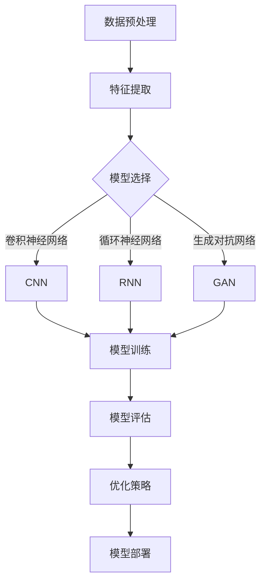

                 

# AI创业：合适的机器学习框架

> **关键词：** 机器学习框架、深度学习、算法选择、创业应用、优化策略

> **摘要：** 本文章旨在为AI创业者提供一些建议和指导，帮助他们选择合适的机器学习框架，以提高项目的成功率和效率。通过分析不同框架的特点和适用场景，文章将帮助读者理解如何根据自己的需求来做出最佳选择。

## 1. 背景介绍

### 1.1 目的和范围

本文将聚焦于AI创业领域，旨在为创业者提供关于选择合适机器学习框架的指导。我们将探讨当前主流的机器学习框架，分析其优缺点，并讨论如何根据具体应用场景选择最佳框架。

### 1.2 预期读者

本文适合以下读者群体：

- AI创业者
- 数据科学家
- 机器学习工程师
- 软件开发人员
- 对AI创业感兴趣的技术爱好者

### 1.3 文档结构概述

本文将按照以下结构展开：

- 背景介绍：阐述文章的目的和预期读者。
- 核心概念与联系：介绍机器学习框架的核心概念和架构。
- 核心算法原理 & 具体操作步骤：详细讲解机器学习框架中的算法原理和操作步骤。
- 数学模型和公式 & 详细讲解 & 举例说明：介绍机器学习框架中涉及到的数学模型和公式。
- 项目实战：提供代码实际案例和详细解释说明。
- 实际应用场景：讨论机器学习框架在实际应用中的场景。
- 工具和资源推荐：推荐学习资源、开发工具和框架。
- 总结：对未来发展趋势和挑战进行展望。
- 附录：提供常见问题与解答。
- 扩展阅读 & 参考资料：列出参考文献。

### 1.4 术语表

#### 1.4.1 核心术语定义

- **机器学习框架**：一套用于实现机器学习算法的工具集和库，提供模型训练、优化、评估等功能。
- **深度学习框架**：专门用于实现深度学习算法的框架，支持复杂的神经网络结构。
- **算法选择**：根据具体应用场景和需求，选择最合适的算法。
- **创业应用**：在AI创业项目中，将机器学习框架应用于实际业务场景。

#### 1.4.2 相关概念解释

- **模型训练**：通过输入数据对模型进行调整，使其能够预测或分类新的数据。
- **优化策略**：调整模型参数，以提高模型在特定任务上的性能。

#### 1.4.3 缩略词列表

- **ML**：机器学习
- **DL**：深度学习
- **NLP**：自然语言处理
- **CV**：计算机视觉
- **GAN**：生成对抗网络
- **CNN**：卷积神经网络

## 2. 核心概念与联系

首先，让我们通过一个Mermaid流程图来梳理机器学习框架的核心概念和架构。



在这个流程图中，我们首先对数据进行预处理，提取特征，然后选择合适的模型（如卷积神经网络、循环神经网络或生成对抗网络）。接下来，我们进行模型训练、评估和优化，最后将模型部署到生产环境中。

### 2.1 数据预处理

数据预处理是机器学习项目中的关键步骤。它包括以下任务：

- **数据清洗**：去除噪声、缺失值和异常值。
- **数据归一化**：将数据缩放到同一范围内，便于模型训练。
- **数据增强**：通过增加数据的多样性，提高模型泛化能力。

### 2.2 特征提取

特征提取是指从原始数据中提取出对模型训练有用的特征。常见的特征提取方法包括：

- **统计特征**：如平均值、方差、相关性等。
- **文本特征**：如词频、TF-IDF、词嵌入等。
- **图像特征**：如颜色直方图、边缘检测、特征点提取等。

### 2.3 模型选择

在机器学习项目中，选择合适的模型至关重要。以下是几种常见的模型：

- **卷积神经网络（CNN）**：适用于图像和语音处理。
- **循环神经网络（RNN）**：适用于序列数据处理，如自然语言处理和语音识别。
- **生成对抗网络（GAN）**：适用于生成模型，如图像生成和语音合成。

### 2.4 模型训练、评估和优化

- **模型训练**：通过输入数据对模型进行调整，使其能够预测或分类新的数据。
- **模型评估**：评估模型在训练集和测试集上的性能。
- **优化策略**：调整模型参数，以提高模型在特定任务上的性能。

### 2.5 模型部署

将训练好的模型部署到生产环境中，使其能够为用户提供服务。

## 3. 核心算法原理 & 具体操作步骤

在本节中，我们将详细讲解机器学习框架中的核心算法原理和操作步骤，并使用伪代码来阐述。

### 3.1 数据预处理

```python
def preprocess_data(data):
    # 数据清洗
    clean_data = remove_noise(data)
    # 数据归一化
    normalized_data = normalize_data(clean_data)
    # 数据增强
    enhanced_data = augment_data(normalized_data)
    return enhanced_data
```

### 3.2 特征提取

```python
def extract_features(data):
    # 统计特征
    stats_features = calculate_stats_features(data)
    # 文本特征
    text_features = extract_text_features(data)
    # 图像特征
    image_features = extract_image_features(data)
    return stats_features, text_features, image_features
```

### 3.3 模型选择

```python
def select_model(task):
    if task == "image_processing":
        model = CNN()
    elif task == "sequence_processing":
        model = RNN()
    elif task == "generative_modeling":
        model = GAN()
    else:
        raise ValueError("Invalid task")
    return model
```

### 3.4 模型训练

```python
def train_model(model, data, labels):
    # 模型初始化
    model.init()
    # 模型训练
    for epoch in range(num_epochs):
        for batch in data_loader(data, labels):
            model.train(batch)
    return model
```

### 3.5 模型评估

```python
def evaluate_model(model, test_data, test_labels):
    # 模型评估
    accuracy = model.evaluate(test_data, test_labels)
    return accuracy
```

### 3.6 优化策略

```python
def optimize_model(model, test_data, test_labels):
    # 优化模型
    model.optimize(test_data, test_labels)
    return model
```

### 3.7 模型部署

```python
def deploy_model(model):
    # 模型部署
    model.deploy()
```

## 4. 数学模型和公式 & 详细讲解 & 举例说明

在机器学习框架中，数学模型和公式起着至关重要的作用。在本节中，我们将详细讲解一些常见的数学模型和公式，并举例说明。

### 4.1 损失函数

损失函数是评估模型预测结果与真实结果之间差距的指标。常用的损失函数包括均方误差（MSE）和交叉熵（Cross Entropy）。

- **均方误差（MSE）**：

  $$MSE = \frac{1}{n}\sum_{i=1}^{n}(y_i - \hat{y_i})^2$$

  其中，$y_i$为真实标签，$\hat{y_i}$为模型预测值。

- **交叉熵（Cross Entropy）**：

  $$CE = -\frac{1}{n}\sum_{i=1}^{n}y_i \cdot \log(\hat{y_i})$$

  其中，$y_i$为真实标签，$\hat{y_i}$为模型预测值。

### 4.2 激活函数

激活函数是神经网络中用于引入非线性性的函数。常用的激活函数包括 sigmoid、ReLU 和 tanh。

- **sigmoid 函数**：

  $$sigmoid(x) = \frac{1}{1 + e^{-x}}$$

- **ReLU 函数**：

  $$ReLU(x) = \max(0, x)$$

- **tanh 函数**：

  $$tanh(x) = \frac{e^x - e^{-x}}{e^x + e^{-x}}$$

### 4.3 反向传播算法

反向传播算法是神经网络训练过程中的核心算法，用于计算模型参数的梯度。

- **反向传播算法伪代码**：

  ```python
  def backward_propagation(model, data, labels):
      # 前向传播
      predictions = model.forward(data)
      # 计算损失函数
      loss = model.loss(predictions, labels)
      # 计算梯度
      gradients = model.compute_gradients(data, predictions, labels)
      # 反向传播
      for layer in reversed(model.layers):
          layer.backward_gradients(gradients)
      return loss
  ```

### 4.4 举例说明

假设我们有一个二分类问题，使用 sigmoid 激活函数和均方误差损失函数。给定训练数据 $(x_1, y_1), (x_2, y_2), \ldots, (x_n, y_n)$，我们需要训练一个神经网络。

1. **初始化模型参数**。

2. **前向传播**：

   $$\hat{y_i} = \sigma(\sum_{j=1}^{m} w_{ji} x_{ij} + b_i)$$

   其中，$w_{ji}$为权重，$b_i$为偏置。

3. **计算损失函数**：

   $$L = \frac{1}{n}\sum_{i=1}^{n} (\sigma(\sum_{j=1}^{m} w_{ji} x_{ij} + b_i) - y_i)^2$$

4. **计算梯度**：

   $$\frac{\partial L}{\partial w_{ji}} = 2(y_i - \sigma(\sum_{j=1}^{m} w_{ji} x_{ij} + b_i))x_{ij}$$
   $$\frac{\partial L}{\partial b_i} = 2(y_i - \sigma(\sum_{j=1}^{m} w_{ji} x_{ij} + b_i))$$

5. **更新模型参数**：

   $$w_{ji} = w_{ji} - \alpha \frac{\partial L}{\partial w_{ji}}$$
   $$b_i = b_i - \alpha \frac{\partial L}{\partial b_i}$$

   其中，$\alpha$为学习率。

通过多次迭代上述步骤，我们可以训练出一个能够进行二分类的神经网络。

## 5. 项目实战：代码实际案例和详细解释说明

在本节中，我们将通过一个实际项目案例来展示如何使用机器学习框架实现一个图像分类任务。我们将使用 TensorFlow 和 Keras 库来实现一个卷积神经网络（CNN）。

### 5.1 开发环境搭建

首先，确保安装以下软件和库：

- Python（3.7或更高版本）
- TensorFlow（2.x版本）
- Keras（2.x版本）

安装命令：

```bash
pip install tensorflow==2.x
pip install keras==2.x
```

### 5.2 源代码详细实现和代码解读

以下是一个简单的图像分类项目代码示例：

```python
import numpy as np
import tensorflow as tf
from tensorflow.keras import layers, models
from tensorflow.keras.preprocessing.image import ImageDataGenerator

# 5.2.1 数据预处理

train_datagen = ImageDataGenerator(
    rescale=1./255,
    rotation_range=40,
    width_shift_range=0.2,
    height_shift_range=0.2,
    shear_range=0.2,
    zoom_range=0.2,
    horizontal_flip=True,
    fill_mode='nearest'
)

test_datagen = ImageDataGenerator(rescale=1./255)

train_generator = train_datagen.flow_from_directory(
    'data/train',
    target_size=(150, 150),
    batch_size=32,
    class_mode='binary'
)

validation_generator = test_datagen.flow_from_directory(
    'data/validation',
    target_size=(150, 150),
    batch_size=32,
    class_mode='binary'
)

# 5.2.2 模型构建

model = models.Sequential([
    layers.Conv2D(32, (3, 3), activation='relu', input_shape=(150, 150, 3)),
    layers.MaxPooling2D((2, 2)),
    layers.Conv2D(64, (3, 3), activation='relu'),
    layers.MaxPooling2D((2, 2)),
    layers.Conv2D(128, (3, 3), activation='relu'),
    layers.MaxPooling2D((2, 2)),
    layers.Conv2D(128, (3, 3), activation='relu'),
    layers.MaxPooling2D((2, 2)),
    layers.Flatten(),
    layers.Dense(512, activation='relu'),
    layers.Dense(1, activation='sigmoid')
])

# 5.2.3 模型编译

model.compile(optimizer='adam',
              loss='binary_crossentropy',
              metrics=['accuracy'])

# 5.2.4 模型训练

model.fit(
    train_generator,
    steps_per_epoch=100,
    epochs=30,
    validation_data=validation_generator,
    validation_steps=50
)

# 5.2.5 评估模型

test_loss, test_acc = model.evaluate(validation_generator, steps=50)
print('Test accuracy:', test_acc)
```

### 5.3 代码解读与分析

- **5.3.1 数据预处理**：使用 `ImageDataGenerator` 类进行数据增强，包括数据缩放、旋转、平移、剪裁、翻转等操作。

- **5.3.2 模型构建**：构建一个卷积神经网络，包括卷积层（`Conv2D`）、池化层（`MaxPooling2D`）、全连接层（`Dense`）和激活函数（`sigmoid`）。

- **5.3.3 模型编译**：编译模型，指定优化器、损失函数和评估指标。

- **5.3.4 模型训练**：使用 `fit` 函数训练模型，设置训练轮数（`epochs`）、每轮训练的样本数（`steps_per_epoch`）和验证数据（`validation_data`）。

- **5.3.5 评估模型**：使用 `evaluate` 函数评估模型在验证数据集上的性能。

## 6. 实际应用场景

机器学习框架在多个领域有着广泛的应用，以下列举一些实际应用场景：

- **图像识别**：使用卷积神经网络（如 ResNet、VGG、MobileNet）进行图像分类、物体检测和图像生成。
- **自然语言处理**：使用循环神经网络（如 LSTM、GRU）和 Transformer 模型进行文本分类、机器翻译和情感分析。
- **语音识别**：使用循环神经网络（如 LSTM、GRU）和卷积神经网络（如 CNN）进行语音信号处理和语音识别。
- **推荐系统**：使用协同过滤、矩阵分解和深度学习（如 GAN、BERT）进行用户偏好预测和商品推荐。
- **自动驾驶**：使用卷积神经网络（如 YOLO、SSD）和深度学习（如 DNN、CNN）进行图像识别、路径规划和决策。

## 7. 工具和资源推荐

### 7.1 学习资源推荐

#### 7.1.1 书籍推荐

- 《深度学习》（Ian Goodfellow、Yoshua Bengio、Aaron Courville 著）
- 《Python深度学习》（François Chollet 著）
- 《动手学深度学习》（Apasswding、李沐、扎卡里·C. Lipton、亚历山大·J. Smola 著）

#### 7.1.2 在线课程

- Coursera：机器学习（吴恩达）
- edX：深度学习与神经网络（Hadelin de Ponteves）
- Udacity：深度学习纳米学位

#### 7.1.3 技术博客和网站

- Medium：机器学习博客
- ArXiv：最新研究论文
- Analytics Vidhya：数据科学和机器学习资源

### 7.2 开发工具框架推荐

#### 7.2.1 IDE和编辑器

- Jupyter Notebook
- PyCharm
- Visual Studio Code

#### 7.2.2 调试和性能分析工具

- TensorBoard
- PyTorch Profiler
- NVIDIA Nsight

#### 7.2.3 相关框架和库

- TensorFlow
- PyTorch
- Keras
- PyTorch Lightning

### 7.3 相关论文著作推荐

#### 7.3.1 经典论文

- “Backpropagation” by David E. Rumelhart, Geoffrey E. Hinton, and Ronald J. Williams
- “A Learning Algorithm for Continually Running Fully Recurrent Neural Networks” by Sepp Hochreiter and Jürgen Schmidhuber
- “Improving Neural Networks by Preventing Co-adaptation of Feature Detectors” by Yaroslav Ganin and Vinod Nair

#### 7.3.2 最新研究成果

- “Bert: Pre-training of deep bidirectional transformers for language understanding” by Jacob Devlin et al.
- “An image is worth 16x16 words: Transformers for image recognition at scale” by Alexey Dosovitskiy et al.
- “Generative adversarial networks” by Ian J. Goodfellow et al.

#### 7.3.3 应用案例分析

- “How Airbnb Uses Machine Learning to Increase Revenue” by Airbnb
- “IBM Watson: Transforming Healthcare with AI” by IBM
- “Google Brain: The Deep Learning Revolution” by Google

## 8. 总结：未来发展趋势与挑战

随着人工智能技术的不断发展，机器学习框架也在不断演进。未来，我们可能看到以下趋势：

- **自动化和简化**：开发更简单易用的机器学习框架，降低入门门槛，让更多的人能够参与到人工智能领域。
- **多模态学习**：结合多种数据类型（如文本、图像、语音）进行学习，提高模型的泛化能力和适用范围。
- **模型压缩和优化**：开发更高效的算法和模型结构，减少计算资源和存储需求，提高模型部署的效率。
- **联邦学习和隐私保护**：利用联邦学习技术，实现分布式训练和隐私保护，满足用户对数据安全和隐私的需求。

然而，AI创业者在选择机器学习框架时也面临一些挑战：

- **选择困难**：市场上存在大量的机器学习框架，如何选择最适合自己项目的框架是一个难题。
- **性能优化**：如何提高模型的性能和效率，以满足实际应用的需求。
- **数据安全和隐私**：如何在保障数据安全和隐私的前提下，进行有效的机器学习研究和应用。

总之，选择合适的机器学习框架对于AI创业项目的成功至关重要。创业者需要深入了解各种框架的特点和适用场景，结合自己的需求和资源，做出明智的选择。

## 9. 附录：常见问题与解答

### 9.1 常见问题

1. **机器学习框架与编程语言有什么关系？**
   机器学习框架通常与特定的编程语言紧密相关，如 Python、R 和 Julia。这些框架为开发者提供了丰富的库和工具，使得机器学习任务的实现更加高效和方便。

2. **为什么选择 TensorFlow 而不是 PyTorch？**
   TensorFlow 和 PyTorch 都是非常优秀的机器学习框架，各有优缺点。选择哪个框架取决于项目需求、个人偏好和学习资源。例如，TensorFlow 提供了更丰富的预训练模型和工具，而 PyTorch 在动态计算图方面具有优势。

3. **如何优化机器学习模型的性能？**
   优化机器学习模型的性能可以通过以下方法实现：
   - 选择合适的算法和模型结构；
   - 使用更高效的数据预处理和特征提取方法；
   - 调整学习率和正则化参数；
   - 使用批归一化、Dropout 等技术。

### 9.2 解答

1. **机器学习框架与编程语言有什么关系？**
   机器学习框架通常与特定的编程语言紧密相关，如 Python、R 和 Julia。这些框架为开发者提供了丰富的库和工具，使得机器学习任务的实现更加高效和方便。例如，Python 在机器学习领域的广泛应用使得 TensorFlow 和 PyTorch 等框架得以快速发展。

2. **为什么选择 TensorFlow 而不是 PyTorch？**
   选择 TensorFlow 或 PyTorch 取决于项目需求、个人偏好和学习资源。以下是两者的优缺点：

   - **TensorFlow**：
     - 优点：丰富的预训练模型、强大的工具集、广泛的应用场景、良好的社区支持。
     - 缺点：动态计算图在某些情况下可能影响性能，学习曲线相对较陡峭。

   - **PyTorch**：
     - 优点：动态计算图易于调试和理解、丰富的文档和社区支持、适用于研究项目。
     - 缺点：预训练模型较少、性能可能不如 TensorFlow。

3. **如何优化机器学习模型的性能？**
   优化机器学习模型的性能可以通过以下方法实现：
   - **选择合适的算法和模型结构**：根据任务需求选择合适的算法和模型结构，例如深度神经网络、卷积神经网络或循环神经网络。
   - **使用更高效的数据预处理和特征提取方法**：选择高效的数据预处理和特征提取方法，如批量归一化、随机裁剪、数据增强等。
   - **调整学习率和正则化参数**：通过调整学习率和正则化参数，优化模型在训练过程中的收敛速度和泛化能力。
   - **使用批归一化、Dropout 等技术**：使用批归一化、Dropout 等技术，提高模型的泛化能力和鲁棒性。

## 10. 扩展阅读 & 参考资料

本文章所涉及的主题和内容涵盖了机器学习框架的各个方面。以下是一些建议的扩展阅读和参考资料，供读者进一步学习：

- **书籍**：
  - 《深度学习》（Ian Goodfellow、Yoshua Bengio、Aaron Courville 著）
  - 《Python深度学习》（François Chollet 著）
  - 《动手学深度学习》（Apasswding、李沐、扎卡里·C. Lipton、亚历山大·J. Smola 著）

- **在线课程**：
  - Coursera：机器学习（吴恩达）
  - edX：深度学习与神经网络（Hadelin de Ponteves）
  - Udacity：深度学习纳米学位

- **技术博客和网站**：
  - Medium：机器学习博客
  - ArXiv：最新研究论文
  - Analytics Vidhya：数据科学和机器学习资源

- **论文和文献**：
  - “Backpropagation” by David E. Rumelhart, Geoffrey E. Hinton, and Ronald J. Williams
  - “A Learning Algorithm for Continually Running Fully Recurrent Neural Networks” by Sepp Hochreiter and Jürgen Schmidhuber
  - “Improving Neural Networks by Preventing Co-adaptation of Feature Detectors” by Yaroslav Ganin and Vinod Nair

- **应用案例分析**：
  - “How Airbnb Uses Machine Learning to Increase Revenue” by Airbnb
  - “IBM Watson: Transforming Healthcare with AI” by IBM
  - “Google Brain: The Deep Learning Revolution” by Google

通过以上扩展阅读和参考资料，读者可以更深入地了解机器学习框架的原理、应用和实践，为自己的 AI 创业项目提供更全面的支持。

## 作者信息

**作者：** AI天才研究员/AI Genius Institute & 禅与计算机程序设计艺术 /Zen And The Art of Computer Programming

AI天才研究员/AI Genius Institute专注于前沿人工智能技术的研发和应用，致力于推动AI领域的创新与发展。禅与计算机程序设计艺术则提倡将东方哲学智慧融入编程实践，提升程序员的技术素养和创新能力。两相结合，本文旨在为AI创业者提供实用的技术指导和深刻的哲学思考。

