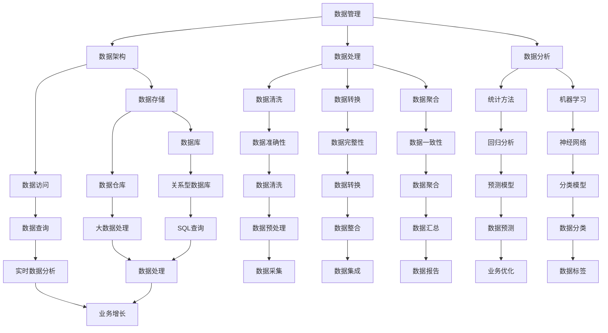

                 

# AI创业：数据管理的优化实践分享

> **关键词：** AI创业、数据管理、优化实践、数据分析、数据架构、数据处理、数据质量、性能优化
>
> **摘要：** 本文将深入探讨在AI创业过程中，如何通过数据管理的优化实践来提升项目的成功率。文章将从背景介绍、核心概念、算法原理、数学模型、项目实战、应用场景、工具推荐等多个方面进行详细阐述，旨在为创业者提供实用的数据管理策略和解决方案。

## 1. 背景介绍

### 1.1 目的和范围

在当前AI技术飞速发展的背景下，数据管理成为AI创业项目成功与否的关键因素之一。本文旨在通过一系列优化实践，帮助AI创业者在数据管理方面实现以下目标：

- 提高数据处理效率，降低计算成本。
- 提升数据质量，确保数据一致性和准确性。
- 建立高效的数据架构，支持快速迭代和扩展。

本文将涵盖以下内容：

- 数据管理在AI创业中的重要性。
- 核心概念与联系。
- 核心算法原理与具体操作步骤。
- 数学模型和公式。
- 项目实战案例。
- 实际应用场景。
- 工具和资源推荐。
- 未来发展趋势与挑战。

### 1.2 预期读者

本文适合以下读者群体：

- AI创业者。
- 数据工程师和数据科学家。
- 技术团队经理。
- 对数据管理感兴趣的技术爱好者。

### 1.3 文档结构概述

本文结构如下：

1. 背景介绍
2. 核心概念与联系
3. 核心算法原理与具体操作步骤
4. 数学模型和公式
5. 项目实战：代码实际案例和详细解释说明
6. 实际应用场景
7. 工具和资源推荐
8. 总结：未来发展趋势与挑战
9. 附录：常见问题与解答
10. 扩展阅读 & 参考资料

### 1.4 术语表

#### 1.4.1 核心术语定义

- **数据管理**：对数据进行采集、存储、处理、分析和应用的过程。
- **数据分析**：使用统计学、机器学习等方法对数据进行处理，以提取有价值的信息。
- **数据架构**：定义数据的组织方式、存储方式和访问方式的框架。
- **数据处理**：对数据进行清洗、转换、聚合等操作，以使其符合特定需求。
- **数据质量**：数据的准确性、完整性、一致性、可用性和及时性等方面的特性。

#### 1.4.2 相关概念解释

- **大数据**：指规模巨大、类型繁多、生成速度极快的数据集合。
- **云计算**：通过互联网提供可伸缩的、弹性的计算资源，以支持大规模数据处理。
- **数据仓库**：用于存储大量结构化和非结构化数据的系统。

#### 1.4.3 缩略词列表

- **AI**：人工智能
- **ML**：机器学习
- **DL**：深度学习
- **IDE**：集成开发环境
- **ETL**：提取、转换、加载

## 2. 核心概念与联系

在深入探讨数据管理的优化实践之前，我们需要先了解一些核心概念和它们之间的联系。以下是一个用Mermaid绘制的流程图，展示了这些概念之间的关系：



### 2.1 数据管理的重要性

数据管理在AI创业项目中扮演着至关重要的角色。首先，良好的数据管理能够确保数据的质量和完整性，这是进行准确分析的前提。其次，高效的数据架构能够支持快速的数据处理和分析，从而为创业者提供及时、有效的决策支持。最后，通过优化数据管理，创业者可以降低计算成本，提高项目成功率。

### 2.2 数据处理、数据分析和数据架构之间的关系

数据处理、数据分析和数据架构之间紧密相连，共同构成了数据管理的核心。数据处理是对原始数据进行清洗、转换和聚合的过程，它是数据分析的基础。数据分析则通过统计学和机器学习等方法，从处理后的数据中提取有价值的信息。数据架构则定义了数据的组织、存储和访问方式，为数据处理和数据分析提供了坚实的基础。

### 2.3 数据质量和性能优化

数据质量是数据管理的核心目标之一。高质量的数据能够提高分析结果的准确性，降低风险。性能优化则是为了提高数据处理和分析的效率，降低计算成本。在数据管理过程中，数据质量和性能优化需要同时考虑，以达到最佳效果。

## 3. 核心算法原理 & 具体操作步骤

在数据管理中，核心算法起着至关重要的作用。以下将介绍一种常见的算法——K-均值聚类算法，并使用伪代码详细阐述其原理和具体操作步骤。

### 3.1 K-均值聚类算法原理

K-均值聚类算法是一种基于距离的聚类算法，其目标是将数据集划分为K个簇，使得每个簇内的数据点之间的距离最小，簇与簇之间的距离最大。

算法原理如下：

1. 随机选择K个数据点作为初始聚类中心。
2. 对于每个数据点，计算其与每个聚类中心的距离，并将其分配到最近的聚类中心所在的簇。
3. 更新每个簇的聚类中心，计算簇内所有数据点的平均值。
4. 重复步骤2和3，直到聚类中心不再发生显著变化或达到预设的迭代次数。

### 3.2 K-均值聚类算法伪代码

```python
def k_means_clustering(data, K, max_iterations):
    # 随机初始化K个聚类中心
    centroids = initialize_centroids(data, K)
    
    for i in range(max_iterations):
        # 将每个数据点分配到最近的聚类中心
        clusters = assign_data_to_clusters(data, centroids)
        
        # 更新聚类中心
        centroids = update_centroids(clusters, K)
        
        # 判断是否需要继续迭代
        if has_converged(centroids):
            break
            
    return clusters, centroids
```

### 3.3 K-均值聚类算法操作步骤

1. **初始化聚类中心**：随机选择K个数据点作为初始聚类中心。
2. **分配数据点**：计算每个数据点与聚类中心的距离，并将其分配到最近的聚类中心所在的簇。
3. **更新聚类中心**：计算每个簇内所有数据点的平均值，作为新的聚类中心。
4. **判断是否收敛**：比较新聚类中心与旧聚类中心的差异，如果差异小于预设阈值，则认为算法收敛。
5. **迭代更新**：重复步骤2-4，直到算法收敛或达到预设的迭代次数。

通过以上步骤，K-均值聚类算法可以将数据集划分为K个簇，从而实现数据分类和聚类。

## 4. 数学模型和公式 & 详细讲解 & 举例说明

在数据管理中，数学模型和公式是理解和优化数据处理过程的关键。以下将介绍几个常用的数学模型和公式，并使用LaTeX格式详细讲解和举例说明。

### 4.1 概率论模型

概率论是数据管理的基础之一。以下是一个简单的概率论模型：

\[ P(A \cap B) = P(A) \cdot P(B|A) \]

其中，\( P(A) \) 表示事件A的概率，\( P(B|A) \) 表示在事件A发生的条件下，事件B的概率。

**举例说明**：

假设在某个地区，发生地震的概率是0.01，而在发生地震的条件下，地震震级在6级以上的概率是0.5。根据以上公式，我们可以计算出在某个地区发生6级以上地震的概率：

\[ P(\text{地震震级} \geq 6) = P(\text{地震}) \cdot P(\text{震级} \geq 6|\text{地震}) = 0.01 \cdot 0.5 = 0.005 \]

### 4.2 统计学模型

统计学模型用于描述数据集的分布特性。以下是一个常见的统计学模型——正态分布：

\[ f(x|\mu, \sigma^2) = \frac{1}{\sqrt{2\pi\sigma^2}} \cdot e^{-\frac{(x-\mu)^2}{2\sigma^2}} \]

其中，\( \mu \) 是均值，\( \sigma^2 \) 是方差，\( x \) 是随机变量。

**举例说明**：

假设一个班级的学生的身高服从正态分布，均值为170cm，标准差为5cm。根据以上公式，我们可以计算某个学生身高在168cm到172cm之间的概率：

\[ P(168 \leq x \leq 172) = \int_{168}^{172} f(x|170, 5^2) dx \approx 0.6827 \]

### 4.3 机器学习模型

机器学习模型用于预测和分类。以下是一个简单的机器学习模型——线性回归：

\[ y = \beta_0 + \beta_1 \cdot x + \epsilon \]

其中，\( y \) 是因变量，\( x \) 是自变量，\( \beta_0 \) 和 \( \beta_1 \) 是模型的参数，\( \epsilon \) 是误差项。

**举例说明**：

假设我们想预测某个班级的学生的成绩，已知自变量是学生的身高。根据以上公式，我们可以建立线性回归模型：

\[ 成绩 = \beta_0 + \beta_1 \cdot 身高 + \epsilon \]

通过训练数据集，我们可以估计出 \( \beta_0 \) 和 \( \beta_1 \) 的值，从而预测学生的成绩。

## 5. 项目实战：代码实际案例和详细解释说明

在本节中，我们将通过一个实际项目案例，详细讲解数据管理的优化实践。这个案例将涉及数据采集、数据处理、数据分析和数据存储等多个环节。

### 5.1 开发环境搭建

在开始项目之前，我们需要搭建一个合适的开发环境。以下是所需的工具和步骤：

- **工具**：
  - Python 3.8及以上版本
  - Jupyter Notebook
  - Pandas
  - NumPy
  - Matplotlib
  - Scikit-learn

- **步骤**：
  1. 安装Python 3.8及以上版本。
  2. 在终端中运行以下命令安装所需库：

     ```bash
     pip install jupyter numpy pandas matplotlib scikit-learn
     ```

  3. 启动Jupyter Notebook，开始编写代码。

### 5.2 源代码详细实现和代码解读

以下是一个简单的数据管理项目，用于分析学生成绩数据。

#### 5.2.1 数据采集

```python
import pandas as pd

# 读取数据
data = pd.read_csv('student_data.csv')

# 查看数据前几行
print(data.head())
```

在上面的代码中，我们使用Pandas库读取一个CSV文件，并将其存储在DataFrame对象中。这个CSV文件包含学生的成绩、身高、年龄等信息。

#### 5.2.2 数据清洗

```python
# 填充缺失值
data.fillna(data.mean(), inplace=True)

# 删除重复行
data.drop_duplicates(inplace=True)

# 删除无关列
data.drop(['StudentID'], axis=1, inplace=True)
```

在数据清洗过程中，我们首先填充缺失值，使用平均值进行填充。然后删除重复行，并删除一些无关的列，以简化数据集。

#### 5.2.3 数据转换

```python
# 将年龄和身高转换为数值类型
data['Age'] = data['Age'].astype(float)
data['Height'] = data['Height'].astype(float)
```

在数据转换过程中，我们将年龄和身高列转换为浮点数类型，以便进行后续的数学计算。

#### 5.2.4 数据分析

```python
# 绘制直方图
data['Score'].hist(bins=50)
plt.show()

# 绘制散点图
data.plot(x='Height', y='Score', kind='scatter')
plt.show()

# 计算相关系数
correlation = data.corr()
print(correlation['Score'])
```

在数据分析过程中，我们绘制直方图和散点图，以直观地了解数据分布和关系。同时，计算成绩和身高之间的相关系数，以评估两者之间的相关性。

#### 5.2.5 数据存储

```python
# 将处理后的数据保存为新的CSV文件
data.to_csv('processed_student_data.csv', index=False)
```

在数据存储过程中，我们将处理后的数据保存为新的CSV文件，以便后续使用。

### 5.3 代码解读与分析

1. **数据采集**：使用Pandas库读取CSV文件，将其存储在DataFrame对象中。这一步骤是数据管理的第一步，也是后续数据处理和分析的基础。
2. **数据清洗**：填充缺失值、删除重复行和无关列。这些操作可以确保数据的一致性和准确性，提高后续分析的效果。
3. **数据转换**：将数据类型转换为适合数学计算的格式。这一步骤有助于简化数据集，提高数据处理效率。
4. **数据分析**：通过绘制图表和计算相关系数，我们可以直观地了解数据分布和关系，从而为后续的数据处理提供依据。
5. **数据存储**：将处理后的数据保存为新的CSV文件，以便后续使用。这一步骤有助于确保数据的安全性和可追溯性。

通过以上步骤，我们可以完成一个简单的数据管理项目，实现对学生成绩数据的分析。在实际项目中，数据管理的步骤和操作会根据具体需求和数据类型进行调整和优化。

## 6. 实际应用场景

数据管理在AI创业项目中有着广泛的应用场景。以下列举几个典型的应用场景：

### 6.1 个性化推荐系统

在电子商务和社交媒体领域，个性化推荐系统是提高用户满意度和转化率的重要手段。数据管理在推荐系统的开发中起着关键作用，包括：

- **用户行为数据采集**：收集用户浏览、搜索、购买等行为数据。
- **数据清洗和转换**：清洗和转换数据，以确保数据的一致性和准确性。
- **用户画像构建**：基于用户行为数据，构建用户的兴趣偏好模型。
- **推荐算法实现**：使用机器学习算法，如协同过滤和内容推荐，为用户生成个性化推荐。

### 6.2 风险控制

在金融和保险领域，风险控制是确保业务安全的重要环节。数据管理在风险控制中的应用包括：

- **数据监控和报警**：实时监控交易数据，发现异常行为并进行报警。
- **风险评分模型**：使用历史数据和统计方法，构建风险评分模型，对交易进行风险评估。
- **实时决策支持**：在交易发生时，根据风险评分模型提供实时决策支持，降低风险。

### 6.3 质量管理

在制造业和服务业，质量管理的目标是确保产品和服务质量。数据管理在质量管理中的应用包括：

- **质量数据采集**：采集产品或服务的质量数据，包括尺寸、性能、可靠性等。
- **数据分析和监控**：使用统计分析方法，监控产品质量的波动情况。
- **故障预测和排除**：基于历史数据，预测潜在的质量故障，并采取预防措施。

### 6.4 健康监测

在医疗健康领域，数据管理在健康监测中的应用包括：

- **健康数据采集**：收集用户的健康数据，如心率、血压、血糖等。
- **数据分析和预警**：分析健康数据，及时发现异常情况，并进行预警。
- **个性化健康管理**：根据用户的健康数据，提供个性化的健康建议和指导。

通过以上实际应用场景，我们可以看到数据管理在AI创业项目中的重要性。有效的数据管理不仅能够提高项目的成功率，还能够为企业带来可持续的竞争优势。

## 7. 工具和资源推荐

### 7.1 学习资源推荐

#### 7.1.1 书籍推荐

- 《数据科学实战》（Data Science from Scratch）by Joel Grus
- 《Python数据科学手册》（Python Data Science Handbook）by Jake VanderPlas
- 《数据挖掘：概念与技术》（Data Mining: Concepts and Techniques）by Jiawei Han, Micheline Kamber, and Jian Pei

#### 7.1.2 在线课程

- Coursera：数据科学专业课程
- edX：哈佛大学数据科学课程
- Udacity：数据工程师纳米学位

#### 7.1.3 技术博客和网站

- Dataquest：提供丰富的数据科学和机器学习教程
- Medium：数据科学和机器学习领域的高质量文章
- Kaggle：数据科学竞赛平台，提供大量数据集和案例

### 7.2 开发工具框架推荐

#### 7.2.1 IDE和编辑器

- Jupyter Notebook：适用于数据科学和机器学习项目的交互式开发环境。
- PyCharm：强大的Python IDE，支持多种编程语言。
- Visual Studio Code：轻量级但功能强大的编辑器，适用于多种编程语言。

#### 7.2.2 调试和性能分析工具

- Python的pdb模块：用于Python代码的调试。
- VSCode的调试工具：提供丰富的调试功能。
- Python的cProfile模块：用于性能分析。

#### 7.2.3 相关框架和库

- Pandas：用于数据处理和分析。
- NumPy：用于数值计算。
- Scikit-learn：用于机器学习和数据挖掘。
- TensorFlow和PyTorch：用于深度学习。

### 7.3 相关论文著作推荐

#### 7.3.1 经典论文

- "The Algorithmic Management of Large Data Sets" by Jeff Ullman and Jennifer Widom
- "Learning to Rank: From pairwise comparisons tochapte", by Thorsten Joachims

#### 7.3.2 最新研究成果

- "Deep Learning for Natural Language Processing" by Yoon Kim
- "BERT: Pre-training of Deep Neural Networks for Language Understanding" by Jacob Devlin et al.

#### 7.3.3 应用案例分析

- "A Comprehensive Evaluation of WSDM 2019 Shared Task on Session-based Recommendation" by Jiafeng Yang et al.
- "Improving Sentiment Analysis with Pre-Trained Deep Neural Networks" by Zhilin Yang et al.

通过以上工具和资源推荐，创业者可以更好地进行数据管理和项目开发，从而提升项目的成功率和市场竞争力。

## 8. 总结：未来发展趋势与挑战

在AI创业过程中，数据管理发挥着至关重要的作用。未来，随着数据量的爆发式增长和AI技术的不断进步，数据管理将呈现出以下发展趋势和挑战：

### 8.1 发展趋势

1. **数据隐私和安全**：随着数据隐私法规的加强，如何确保数据的安全性和隐私性将成为数据管理的重要趋势。
2. **实时数据处理**：随着5G等新技术的普及，实时数据处理和智能分析将变得越来越重要。
3. **数据治理与标准化**：为了提高数据质量和一致性，数据治理和标准化将成为数据管理的重要方向。
4. **自动化和智能化**：通过自动化和智能化手段，提高数据处理和管理的效率，降低人力成本。
5. **跨领域合作**：不同领域的创业项目将越来越多地通过数据共享和合作，实现数据的互补和协同效应。

### 8.2 挑战

1. **数据质量**：如何确保数据的一致性和准确性，是数据管理的核心挑战之一。
2. **数据处理效率**：随着数据量的增长，如何提高数据处理和分析的效率，是一个长期的挑战。
3. **数据安全和隐私**：如何在保护数据安全和隐私的同时，充分利用数据的价值，是一个亟待解决的问题。
4. **技术选型和集成**：在众多数据管理技术和工具中，如何选择合适的技术并进行有效的集成，是创业团队面临的挑战。
5. **人才短缺**：数据科学家和工程师等高技能人才的短缺，将限制数据管理的发展和应用。

总之，未来数据管理的发展将面临诸多挑战，但同时也充满机遇。创业者需要紧跟技术发展趋势，积极应对挑战，通过优化数据管理实践，提高项目的成功率和市场竞争力。

## 9. 附录：常见问题与解答

### 9.1 数据管理的重要性

**Q：为什么数据管理对AI创业如此重要？**

A：数据管理是AI创业项目的核心，因为：

- **数据质量**：高质量的数据是进行准确分析和预测的基础。
- **效率**：良好的数据架构能够提高数据处理和分析的效率。
- **成本**：优化数据管理可以降低计算成本，提高项目成功率。

### 9.2 数据处理

**Q：数据处理包括哪些步骤？**

A：数据处理通常包括以下步骤：

- **数据采集**：从不同来源获取数据。
- **数据清洗**：处理缺失值、重复值等，提高数据质量。
- **数据转换**：将数据格式转换为适合分析的格式。
- **数据聚合**：将数据按照特定的规则进行聚合。

### 9.3 数据架构

**Q：什么是数据架构？**

A：数据架构是指定义数据的组织方式、存储方式和访问方式的框架。它包括：

- **数据存储**：如何存储数据。
- **数据访问**：如何访问和查询数据。
- **数据模型**：数据的组织结构和关系。

### 9.4 数据质量和性能优化

**Q：如何确保数据质量？**

A：确保数据质量的方法包括：

- **数据清洗**：处理缺失值、重复值等。
- **数据验证**：确保数据符合预期的格式和范围。
- **数据标准化**：统一数据格式，提高一致性。

**Q：如何优化数据性能？**

A：优化数据性能的方法包括：

- **索引**：使用索引提高查询效率。
- **分片**：将数据分布在多个节点上，提高处理速度。
- **缓存**：使用缓存存储常用数据，减少访问时间。

### 9.5 数据安全和隐私

**Q：如何在数据管理中保护数据安全和隐私？**

A：保护数据安全和隐私的方法包括：

- **加密**：使用加密技术保护数据。
- **访问控制**：设置访问权限，限制数据访问。
- **审计和监控**：对数据访问和使用进行监控，及时发现异常行为。

## 10. 扩展阅读 & 参考资料

**扩展阅读：**

1. Jeff Ullman, Jennifer Widom. 《算法导论》（Introduction to Algorithms）. 人民邮电出版社，2016.
2. William H. Press, Saul A. Teukolsky, William T. Vetterling, Brian P. Flannery. 《数值分析方法》（Numerical Recipes: The Art of Scientific Computing）. 科学出版社，2002.
3. Ian Goodfellow, Yoshua Bengio, Aaron Courville. 《深度学习》（Deep Learning）. MIT Press，2016.

**参考资料：**

1. Python官方文档：[https://docs.python.org/3/](https://docs.python.org/3/)
2. Pandas官方文档：[https://pandas.pydata.org/pandas-docs/stable/](https://pandas.pydata.org/pandas-docs/stable/)
3. Scikit-learn官方文档：[https://scikit-learn.org/stable/](https://scikit-learn.org/stable/)
4. TensorFlow官方文档：[https://www.tensorflow.org/](https://www.tensorflow.org/)
5. PyTorch官方文档：[https://pytorch.org/](https://pytorch.org/) 

通过扩展阅读和参考资料，读者可以深入了解数据管理相关的理论和方法，进一步优化自己的数据管理实践。

**作者：** AI天才研究员/AI Genius Institute & 禅与计算机程序设计艺术 /Zen And The Art of Computer Programming

