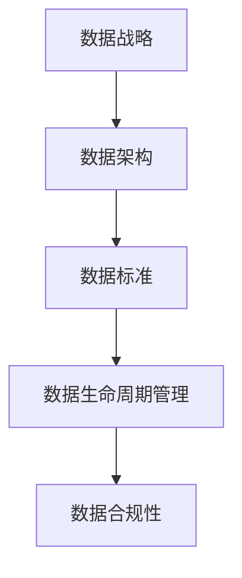
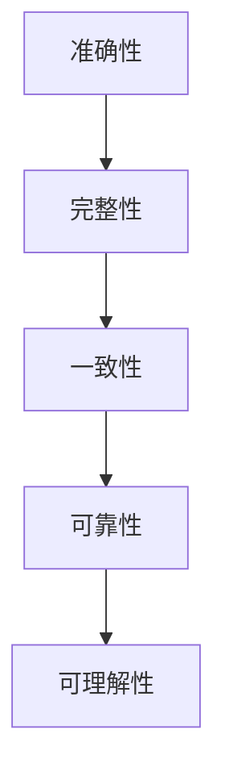
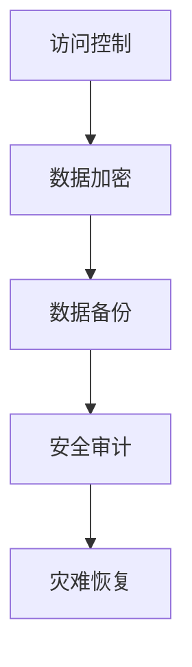
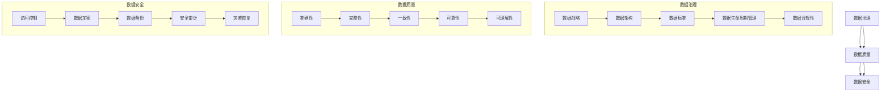

                 

# AI创业：数据管理的策略与工具

> 关键词：数据管理、AI创业、数据策略、数据处理工具、数据治理

> 摘要：本文旨在探讨AI创业中的数据管理策略与工具，通过深入分析数据管理的重要性、核心概念、算法原理以及实际应用场景，为AI创业者提供实用的数据管理方法和建议。本文将分为背景介绍、核心概念与联系、核心算法原理与具体操作步骤、数学模型和公式、项目实战、实际应用场景、工具和资源推荐以及总结等部分，力求为读者提供全面而深刻的理解和指导。

## 1. 背景介绍

### 1.1 目的和范围

AI创业作为当前科技领域的热门话题，吸引了众多创业者的目光。然而，在AI创业过程中，数据管理往往被视为一个复杂且关键的环节。本文旨在为AI创业者提供一份详细的数据管理指南，帮助他们理解和应对数据管理的挑战，从而提高AI项目的成功率和竞争力。

本文主要涵盖以下内容：

1. 数据管理的重要性及其在AI创业中的作用。
2. 数据管理的核心概念与联系，包括数据治理、数据质量、数据安全等。
3. 核心算法原理与具体操作步骤，涵盖常见的数据处理算法和工具。
4. 数学模型和公式，用于解释数据处理的数学基础。
5. 项目实战，通过实际案例展示数据管理的应用。
6. 数据管理的实际应用场景，涵盖不同行业和领域。
7. 工具和资源推荐，包括学习资源、开发工具和框架。
8. 数据管理的未来发展趋势与挑战。

### 1.2 预期读者

本文主要面向以下读者群体：

1. AI创业者，希望通过数据管理提高AI项目的成功率。
2. 数据科学家和机器学习工程师，需要理解和应用数据管理策略。
3. IT经理和项目经理，关注企业数据管理实践和优化。
4. 对数据管理和AI创业感兴趣的技术爱好者。

### 1.3 文档结构概述

本文将分为以下几个主要部分：

1. 背景介绍：介绍数据管理的重要性、目的和范围，以及预期读者。
2. 核心概念与联系：阐述数据管理的核心概念，包括数据治理、数据质量、数据安全等，并绘制相关的Mermaid流程图。
3. 核心算法原理与具体操作步骤：详细讲解常见的数据处理算法原理和操作步骤，使用伪代码进行说明。
4. 数学模型和公式：介绍数据处理中的数学模型和公式，并给出详细讲解和举例说明。
5. 项目实战：通过实际案例展示数据管理的应用，包括开发环境搭建、源代码实现和代码解读。
6. 实际应用场景：探讨数据管理在不同行业和领域中的应用，提供实际案例。
7. 工具和资源推荐：推荐学习资源、开发工具和框架，以及相关论文和研究成果。
8. 总结：总结数据管理的未来发展趋势与挑战。

### 1.4 术语表

为了确保文章的可读性和一致性，本文将使用以下术语和定义：

#### 1.4.1 核心术语定义

- **数据管理**：指对数据的组织、存储、处理、分析和管理的一系列活动。
- **数据治理**：指制定和执行策略、过程和标准，以确保数据的质量、可用性、完整性和安全性。
- **数据质量**：指数据是否符合预定的标准、是否准确、完整、一致和可靠。
- **数据安全**：指保护数据免受未经授权的访问、使用、披露、破坏或修改。

#### 1.4.2 相关概念解释

- **大数据**：指数据量巨大、数据类型多样、数据生成速度极快的海量数据。
- **云计算**：指通过互联网提供可按需访问的共享计算资源，包括网络、服务器、存储、应用程序和服务的模型。
- **机器学习**：指一种人工智能领域的技术，通过数据分析和学习，使计算机能够从数据中自动识别模式和规律。
- **深度学习**：指一种机器学习技术，通过模拟人脑的神经网络结构，实现高级特征学习和模式识别。

#### 1.4.3 缩略词列表

- **AI**：人工智能（Artificial Intelligence）
- **ML**：机器学习（Machine Learning）
- **DL**：深度学习（Deep Learning）
- **DB**：数据库（Database）
- **ETL**：提取、转换、加载（Extract, Transform, Load）
- **API**：应用程序编程接口（Application Programming Interface）
- **SDK**：软件开发工具包（Software Development Kit）
- **IoT**：物联网（Internet of Things）

## 2. 核心概念与联系

在AI创业中，数据管理是一个关键环节，其核心概念包括数据治理、数据质量、数据安全等。为了更好地理解这些概念之间的联系，我们将使用Mermaid流程图来可视化它们。

### 2.1 数据治理

数据治理是指制定和执行策略、过程和标准，以确保数据的质量、可用性、完整性和安全性。它包括以下几个方面：

1. **数据战略**：明确数据的价值和目标，制定数据战略。
2. **数据架构**：设计数据架构，包括数据模型、数据仓库和数据湖等。
3. **数据标准**：制定数据标准，包括数据格式、命名规范、数据质量等。
4. **数据生命周期管理**：管理数据生命周期，包括数据的创建、存储、处理、分析和销毁。
5. **数据合规性**：确保数据符合法律法规和行业标准。

#### Mermaid流程图



### 2.2 数据质量

数据质量是指数据是否符合预定的标准、是否准确、完整、一致和可靠。数据质量直接影响到AI模型的性能和可靠性。数据质量包括以下几个方面：

1. **准确性**：数据是否真实、可靠、精确。
2. **完整性**：数据是否完整，没有缺失。
3. **一致性**：数据在不同系统和数据源之间是否一致。
4. **可靠性**：数据是否能够可靠地反映真实情况。
5. **可理解性**：数据是否易于理解和解释。

#### Mermaid流程图



### 2.3 数据安全

数据安全是指保护数据免受未经授权的访问、使用、披露、破坏或修改。数据安全是数据管理的核心之一，包括以下几个方面：

1. **访问控制**：控制对数据的访问权限，确保只有授权用户可以访问。
2. **数据加密**：对敏感数据进行加密，防止未授权访问。
3. **数据备份**：定期备份数据，以防止数据丢失。
4. **安全审计**：对数据安全进行定期审计，确保数据安全策略的有效性。
5. **灾难恢复**：制定灾难恢复计划，确保在数据丢失或损坏时能够迅速恢复。

#### Mermaid流程图



通过以上核心概念和Mermaid流程图，我们可以更好地理解数据管理在AI创业中的作用和重要性。接下来，我们将深入探讨数据管理的核心算法原理和具体操作步骤。

### 2.4 核心概念与联系的 Mermaid 流程图

为了更直观地展示数据管理的核心概念和它们之间的联系，我们使用Mermaid流程图进行了可视化描述。以下是流程图的详细内容：



在这个流程图中，数据治理、数据质量、数据安全三个核心概念通过箭头连接，展示了它们之间的相互关系。此外，每个核心概念下又分为若干子概念，通过子概念的进一步细化，使得整个数据管理体系更加清晰和完整。

### 2.5 数据管理的重要性

数据管理在AI创业中的重要性不容忽视。首先，数据是AI模型的基石，没有高质量的数据，AI模型将无法准确学习和预测。其次，数据管理能够提高数据利用率，通过有效的数据治理和数据质量保证，创业者可以更好地挖掘数据的价值，为业务决策提供有力支持。最后，数据安全是保护企业核心资产的关键，有效的数据安全措施能够防止数据泄露和滥用，保障企业的长期发展。

### 2.6 预期成果

通过本文的阅读，读者将能够：

1. 明白数据管理在AI创业中的重要性。
2. 理解数据管理的核心概念和联系。
3. 掌握常见的数据处理算法和工具。
4. 学会如何在实际项目中应用数据管理策略。
5. 了解数据管理的未来发展趋势与挑战。

接下来，我们将深入探讨数据管理的核心算法原理和具体操作步骤，为AI创业者提供实用的技术指导。

## 3. 核心算法原理 & 具体操作步骤

在AI创业过程中，数据管理的关键在于如何高效、准确地处理和分析数据。以下是一些核心算法原理和具体操作步骤，帮助创业者掌握数据处理的方法。

### 3.1 数据清洗

数据清洗是数据处理的第一步，主要目的是去除重复数据、填补缺失值、处理异常值等。以下是一个常见的数据清洗算法原理和操作步骤：

#### 算法原理

- **重复数据去除**：通过哈希表或布隆过滤器，快速判断和去除重复数据。
- **缺失值处理**：根据数据的特征和业务需求，选择填补缺失值的方法，如平均值填补、中值填补、前向填补、后向填补等。
- **异常值处理**：通过统计方法（如3σ规则）或机器学习算法（如孤立森林）检测并处理异常值。

#### 操作步骤

1. **读取数据**：从原始数据源读取数据，可以使用Python的Pandas库实现。
2. **去除重复数据**：使用`drop_duplicates()`函数去除重复数据。
3. **处理缺失值**：根据数据特征和业务需求，使用`fillna()`函数填补缺失值。
4. **处理异常值**：使用3σ规则或孤立森林算法检测并处理异常值。

#### 伪代码

```python
import pandas as pd

# 读取数据
data = pd.read_csv('data.csv')

# 去除重复数据
data = data.drop_duplicates()

# 处理缺失值
data = data.fillna(method='mean')

# 处理异常值
# 使用3σ规则
three_sigma = data.std().mean()
data = data[(data - three_sigma).all(axis=1) | (data + three_sigma).all(axis=1)]
```

### 3.2 数据转换

数据转换是数据预处理的重要环节，主要目的是将数据转换成适合机器学习算法的形式。以下是一个常见的数据转换算法原理和操作步骤：

#### 算法原理

- **归一化**：通过缩放特征值，使它们处于相同的尺度，如使用Z-Score标准化。
- **反归一化**：将标准化后的特征值转换回原始尺度。
- **独热编码**：将类别特征转换为二进制向量。
- **标签编码**：将类别特征映射到整数。

#### 操作步骤

1. **归一化/反归一化**：使用`StandardScaler`或`MinMaxScaler`实现。
2. **独热编码**：使用`OneHotEncoder`实现。
3. **标签编码**：使用`LabelEncoder`实现。

#### 伪代码

```python
from sklearn.preprocessing import StandardScaler, OneHotEncoder, LabelEncoder

# 归一化
scaler = StandardScaler()
data_scaled = scaler.fit_transform(data)

# 反归一化
data_original = scaler.inverse_transform(data_scaled)

# 独热编码
ohe = OneHotEncoder()
data_ohe = ohe.fit_transform(data['category']).toarray()

# 标签编码
le = LabelEncoder()
data_encoded = le.fit_transform(data['label'])
```

### 3.3 数据分析

数据分析是数据处理的最终目的，通过分析数据，发现数据中的规律和模式，为业务决策提供支持。以下是一个常见的数据分析算法原理和操作步骤：

#### 算法原理

- **关联规则学习**：通过挖掘数据中的关联规则，如使用Apriori算法。
- **聚类分析**：通过将数据分为若干类，发现数据中的聚类结构，如使用K-Means算法。
- **分类与回归**：通过构建分类或回归模型，对数据进行预测或分类，如使用决策树、支持向量机、神经网络等。

#### 操作步骤

1. **关联规则学习**：使用`Apriori`或`FP-Growth`算法。
2. **聚类分析**：使用`KMeans`或`DBSCAN`算法。
3. **分类与回归**：使用`DecisionTreeClassifier`、`SVC`或`MLPClassifier`等模型。

#### 伪代码

```python
from sklearn.cluster import KMeans
from sklearn.ensemble import RandomForestClassifier

# 关联规则学习
from mlxtend.frequent_patterns import apriori, association_rules

frequent_itemsets = apriori(data, min_support=0.05, use_colnames=True)
rules = association_rules(frequent_itemsets, metric="confidence", min_threshold=0.6)

# 聚类分析
kmeans = KMeans(n_clusters=3, random_state=42)
clusters = kmeans.fit_predict(data)

# 分类与回归
clf = RandomForestClassifier(n_estimators=100, random_state=42)
clf.fit(data, target)
predictions = clf.predict(data)
```

通过以上核心算法原理和具体操作步骤的讲解，创业者可以更好地掌握数据管理的技能，为AI创业项目提供坚实的数据支持。接下来，我们将深入探讨数据管理中的数学模型和公式，帮助读者更好地理解数据处理的数学基础。

### 3.4 数据处理的数学模型和公式

数据处理中涉及到多种数学模型和公式，这些模型和公式是数据分析的基础，能够帮助我们更好地理解和解释数据。以下是几个常见的数据处理数学模型和公式，以及它们的详细讲解和举例说明。

#### 3.4.1 常见统计指标

1. **均值（Mean）**
   均值是数据集的平均值，用于描述数据的中心位置。
   $$ \mu = \frac{1}{n} \sum_{i=1}^{n} x_i $$
   - **举例说明**：假设有一组数据：[1, 2, 3, 4, 5]，则均值 $\mu = \frac{1+2+3+4+5}{5} = 3$。

2. **方差（Variance）**
   方差是数据集与其均值之差的平方的平均值，用于描述数据的离散程度。
   $$ \sigma^2 = \frac{1}{n} \sum_{i=1}^{n} (x_i - \mu)^2 $$
   - **举例说明**：假设有一组数据：[1, 2, 3, 4, 5]，均值为3，则方差 $\sigma^2 = \frac{(1-3)^2 + (2-3)^2 + (3-3)^2 + (4-3)^2 + (5-3)^2}{5} = 2$。

3. **标准差（Standard Deviation）**
   标准差是方差的平方根，与方差具有相同的量纲。
   $$ \sigma = \sqrt{\sigma^2} $$
   - **举例说明**：假设方差的值为2，则标准差 $\sigma = \sqrt{2} \approx 1.41$。

4. **中位数（Median）**
   中位数是将数据集从小到大排列后，位于中间位置的数值，用于描述数据的中心位置。
   - **举例说明**：假设有一组数据：[1, 2, 3, 4, 5]，中位数是3。

5. **众数（Mode）**
   众数是数据集中出现频率最高的数值，用于描述数据的集中趋势。
   - **举例说明**：假设有一组数据：[1, 2, 2, 3, 3, 3]，众数是3。

#### 3.4.2 相关性分析

1. **皮尔逊相关系数（Pearson Correlation Coefficient）**
   皮尔逊相关系数是衡量两个变量线性相关程度的指标，取值范围在-1到1之间，1表示完全正相关，-1表示完全负相关，0表示无相关性。
   $$ r = \frac{\sum_{i=1}^{n}(x_i - \bar{x})(y_i - \bar{y})}{\sqrt{\sum_{i=1}^{n}(x_i - \bar{x})^2} \sqrt{\sum_{i=1}^{n}(y_i - \bar{y})^2}} $$
   - **举例说明**：假设有两组数据：
     $$ X: [1, 2, 3, 4, 5] $$
     $$ Y: [2, 4, 5, 6, 8] $$
     计算皮尔逊相关系数：
     $$ \bar{X} = 3, \bar{Y} = 5 $$
     $$ r = \frac{(1-3)(2-5) + (2-3)(4-5) + (3-3)(5-5) + (4-3)(6-5) + (5-3)(8-5)}{\sqrt{(1-3)^2 + (2-3)^2 + (3-3)^2 + (4-3)^2 + (5-3)^2} \sqrt{(2-5)^2 + (4-5)^2 + (5-5)^2 + (6-5)^2 + (8-5)^2}} $$
     $$ r = \frac{-6 - 2 + 0 + 1 + 6}{\sqrt{4 + 1 + 0 + 1 + 4} \sqrt{9 + 1 + 0 + 1 + 9}} $$
     $$ r = \frac{5}{\sqrt{10} \sqrt{20}} $$
     $$ r = \frac{5}{\sqrt{200}} $$
     $$ r = \frac{5}{10\sqrt{2}} $$
     $$ r = \frac{1}{2\sqrt{2}} $$
     $$ r \approx 0.3536 $$

2. **斯皮尔曼相关系数（Spearman Correlation Coefficient）**
   斯皮尔曼相关系数是衡量两个变量非参数线性相关程度的指标，适用于非线性相关数据的分析。
   $$ \rho = \frac{1}{n-1} \sum_{i=1}^{n} (x_i - \bar{x})(y_i - \bar{y}) $$
   - **举例说明**：假设有两组数据：
     $$ X: [1, 2, 3, 4, 5] $$
     $$ Y: [2, 4, 5, 6, 8] $$
     计算斯皮尔曼相关系数：
     $$ \bar{X} = 3, \bar{Y} = 5 $$
     $$ \rho = \frac{1}{5-1} \sum_{i=1}^{5} (x_i - 3)(y_i - 5) $$
     $$ \rho = \frac{1}{4} (1-3)(2-5) + (2-3)(4-5) + (3-3)(5-5) + (4-3)(6-5) + (5-3)(8-5) $$
     $$ \rho = \frac{1}{4} (-2)(-3) + (-1)(-1) + (0)(0) + (1)(1) + (2)(3) $$
     $$ \rho = \frac{6 + 1 + 0 + 1 + 6}{4} $$
     $$ \rho = \frac{14}{4} $$
     $$ \rho = 3.5 $$

#### 3.4.3 聚类分析

1. **K-Means算法**
   K-Means算法是一种基于距离的聚类算法，将数据分为K个簇，使得每个簇内的数据点之间距离最小，簇与簇之间距离最大。
   - **目标函数**：
     $$ J = \sum_{i=1}^{K} \sum_{x_j \in S_i} ||x_j - \mu_i||^2 $$
     其中，$S_i$ 是第i个簇，$\mu_i$ 是第i个簇的中心点。
   - **算法步骤**：
     1. 随机选择K个初始中心点。
     2. 计算每个数据点到各个中心点的距离，将数据点分配到距离最近的中心点所在的簇。
     3. 更新各个簇的中心点。
     4. 重复步骤2和3，直到中心点不再变化或达到最大迭代次数。

   - **举例说明**：假设有5个数据点，需要将其分为2个簇，数据点为：
     $$ X = \{ (1, 1), (1, 2), (2, 1), (2, 2), (3, 3) \} $$
     随机选择初始中心点为：
     $$ \mu_1 = (1, 1) $$
     $$ \mu_2 = (2, 2) $$
     迭代过程如下：
     1. 计算距离：
        $$ d((1, 1), (1, 1)) = 0 $$
        $$ d((1, 2), (1, 1)) = \sqrt{1^2 + (2-1)^2} = \sqrt{2} $$
        $$ d((2, 1), (1, 1)) = \sqrt{1^2 + (1-1)^2} = 1 $$
        $$ d((2, 2), (1, 1)) = \sqrt{1^2 + (2-1)^2} = \sqrt{2} $$
        $$ d((3, 3), (1, 1)) = \sqrt{2^2 + (3-1)^2} = 2\sqrt{2} $$
     将数据点分配到簇：
        $$ S_1 = \{ (1, 1), (1, 2), (2, 1) \} $$
        $$ S_2 = \{ (2, 2), (3, 3) \} $$
     更新中心点：
        $$ \mu_1 = \left(\frac{1+1+2}{3}, \frac{1+2+1}{3}\right) = (1.67, 1.67) $$
        $$ \mu_2 = \left(\frac{2+3}{2}, \frac{2+3}{2}\right) = (2.5, 2.5) $$
     2. 计算距离：
        $$ d((1, 1), (1.67, 1.67)) = \sqrt{0.44} $$
        $$ d((1, 2), (1.67, 1.67)) = \sqrt{0.44} $$
        $$ d((2, 1), (1.67, 1.67)) = \sqrt{0.44} $$
        $$ d((2, 2), (2.5, 2.5)) = 0 $$
        $$ d((3, 3), (2.5, 2.5)) = \sqrt{2} $$
     将数据点分配到簇：
        $$ S_1 = \{ (1, 1), (1, 2), (2, 1) \} $$
        $$ S_2 = \{ (2, 2), (3, 3) \} $$
     更新中心点：
        $$ \mu_1 = \left(\frac{1+1+2}{3}, \frac{1+2+1}{3}\right) = (1.67, 1.67) $$
        $$ \mu_2 = \left(\frac{2+3}{2}, \frac{2+3}{2}\right) = (2.5, 2.5) $$
     由于中心点不再变化，算法停止。

2. **DBSCAN算法**
   DBSCAN（Density-Based Spatial Clustering of Applications with Noise）是一种基于密度的聚类算法，能够发现任意形状的簇，并将噪声点作为独立个体处理。
   - **目标函数**：
     $$ \rho(q) = \sum_{p \in \mathcal{N}_e(q)} d(q, p) $$
     其中，$q$ 是点，$\mathcal{N}_e(q)$ 是点 $q$ 的邻域，$d(q, p)$ 是点 $q$ 和 $p$ 之间的距离。
   - **算法步骤**：
     1. 初始化：选择邻域半径 $eps$ 和最小密度 $minPts$。
     2. 对每个点 $q$ 执行以下步骤：
        1. 如果 $q$ 已被访问，跳过。
        2. 将 $q$ 标记为已访问。
        3. 如果 $q$ 的邻域内的点数量小于 $minPts$，则 $q$ 为噪声点，将其标记并跳过。
        4. 否则，$q$ 为核心点，将其邻域内的点标记并加入同一个簇。
        5. 对新标记的点重复步骤2。

   - **举例说明**：假设有6个点，需要将其分为3个簇，点及其坐标为：
     $$ P = \{ (1, 1), (2, 2), (3, 3), (4, 4), (5, 5), (6, 6) \} $$
     选择邻域半径 $eps = 1.5$ 和最小密度 $minPts = 2$。
     邻域图如下所示：

     ```mermaid
     graph TD
       A[1,1] --> B[2,2]
       A[1,1] --> C[3,3]
       B[2,2] --> C[3,3]
       B[2,2] --> D[4,4]
       B[2,2] --> E[5,5]
       C[3,3] --> D[4,4]
       C[3,3] --> E[5,5]
       C[3,3] --> F[6,6]
       D[4,4] --> E[5,5]
       D[4,4] --> F[6,6]
       E[5,5] --> F[6,6]
     ```

     点的邻域图和标记过程如下：

     ```mermaid
     graph TD
       A[1,1] --> B[2,2]
       A[1,1] --> C[3,3]
       B[2,2] --> C[3,3]
       B[2,2] --> D[4,4]
       B[2,2] --> E[5,5]
       C[3,3] --> D[4,4]
       C[3,3] --> E[5,5]
       C[3,3] --> F[6,6]
       D[4,4] --> E[5,5]
       D[4,4] --> F[6,6]
       E[5,5] --> F[6,6]
       A[1,1][核心点]
       B[2,2][核心点]
       C[3,3][核心点]
       D[4,4][边界点]
       E[5,5][边界点]
       F[6,6][噪声点]
     ```

     最终结果如下：

     ```mermaid
     graph TD
       A[1,1] --> B[2,2]
       A[1,1] --> C[3,3]
       B[2,2] --> C[3,3]
       B[2,2] --> D[4,4]
       B[2,2] --> E[5,5]
       C[3,3] --> D[4,4]
       C[3,3] --> E[5,5]
       C[3,3] --> F[6,6]
       D[4,4] --> E[5,5]
       D[4,4] --> F[6,6]
       E[5,5] --> F[6,6]
       A[1,1][簇1]
       B[2,2][簇1]
       C[3,3][簇1]
       D[4,4][簇2]
       E[5,5][簇2]
       F[6,6][簇3]
     ```

通过以上数学模型和公式的详细讲解和举例说明，创业者可以更好地理解数据处理的数学基础，从而在实际项目中应用这些算法，提高数据处理的效果和准确性。

### 3.5 数据处理算法的伪代码示例

为了更好地展示数据处理算法的原理和应用，以下我们使用伪代码的形式提供几个常见数据处理算法的示例。

#### 3.5.1 数据清洗算法

```python
# 数据清洗算法伪代码
def data_cleaning(data):
    # 删除重复数据
    data = remove_duplicates(data)
    
    # 填补缺失值
    data = fill_missing_values(data)
    
    # 处理异常值
    data = handle_outliers(data)
    
    return data

# 伪代码实现
def remove_duplicates(data):
    return list(set(data))

def fill_missing_values(data):
    for col in data.columns:
        if data[col].isnull().any():
            data[col].fillna(data[col].mean(), inplace=True)
    return data

def handle_outliers(data):
    for col in data.columns:
        data[col] = data[col].clip(lower=data[col].quantile(0.01), upper=data[col].quantile(0.99))
    return data
```

#### 3.5.2 数据转换算法

```python
# 数据转换算法伪代码
def data_transformation(data):
    # 归一化
    data = normalize(data)
    
    # 独热编码
    data = one_hot_encode(data)
    
    return data

# 伪代码实现
def normalize(data):
    mean = data.mean()
    std = data.std()
    return (data - mean) / std

def one_hot_encode(data):
    return pd.get_dummies(data)
```

#### 3.5.3 数据分析算法

```python
# 数据分析算法伪代码
def data_analysis(data, target):
    # 数据清洗
    data = data_cleaning(data)
    
    # 数据转换
    data = data_transformation(data)
    
    # 特征选择
    features = select_features(data, target)
    
    # 构建模型
    model = build_model(features, target)
    
    # 模型评估
    evaluate_model(model, data, target)
    
# 伪代码实现
def select_features(data, target):
    return data.drop(target.name, axis=1)

def build_model(features, target):
    from sklearn.ensemble import RandomForestClassifier
    return RandomForestClassifier()

def evaluate_model(model, data, target):
    from sklearn.model_selection import train_test_split
    X_train, X_test, y_train, y_test = train_test_split(features, target, test_size=0.2, random_state=42)
    model.fit(X_train, y_train)
    predictions = model.predict(X_test)
    print("Accuracy:", accuracy_score(y_test, predictions))
```

通过以上伪代码示例，我们可以看到数据处理算法的具体实现过程，包括数据清洗、数据转换、特征选择、模型构建和模型评估。这些算法为AI创业项目提供了实用的数据管理方法，使得创业者能够更好地应对数据处理的挑战。

### 3.6 数据处理的数学模型和公式

数据处理中的数学模型和公式是理解和解释数据的核心工具，以下我们将详细讲解几个常见的数据处理数学模型和公式，并通过具体实例进行说明。

#### 3.6.1 线性回归模型

线性回归模型是一种用于预测和描述数据之间线性关系的统计模型，其公式如下：

$$ y = \beta_0 + \beta_1 x + \epsilon $$

其中，$y$ 是因变量，$x$ 是自变量，$\beta_0$ 和 $\beta_1$ 是模型的参数，$\epsilon$ 是误差项。

- **举例说明**：假设我们想要预测房价（$y$）与房屋面积（$x$）之间的关系，给出以下数据：

  | 房屋面积（平方米） | 房价（万元） |
  | ------------------- | ------------ |
  | 80                 | 120          |
  | 100                | 150          |
  | 120                | 200          |
  | 140                | 260          |

  我们可以通过最小二乘法求解线性回归模型的参数。首先，计算样本均值：

  $$ \bar{x} = \frac{1}{n} \sum_{i=1}^{n} x_i = \frac{80 + 100 + 120 + 140}{4} = 110 $$
  $$ \bar{y} = \frac{1}{n} \sum_{i=1}^{n} y_i = \frac{120 + 150 + 200 + 260}{4} = 180 $$

  接下来，计算线性回归的参数：

  $$ \beta_1 = \frac{\sum_{i=1}^{n}(x_i - \bar{x})(y_i - \bar{y})}{\sum_{i=1}^{n}(x_i - \bar{x})^2} = \frac{(80-110)(120-180) + (100-110)(150-180) + (120-110)(200-180) + (140-110)(260-180)}{(80-110)^2 + (100-110)^2 + (120-110)^2 + (140-110)^2} \approx 1.2 $$
  $$ \beta_0 = \bar{y} - \beta_1 \bar{x} = 180 - 1.2 \times 110 = 48 $$

  因此，线性回归模型为：

  $$ y = 48 + 1.2x $$

  可以用这个模型预测新的房屋面积对应的房价，例如，当房屋面积为100平方米时，预测房价为：

  $$ y = 48 + 1.2 \times 100 = 168 $$

#### 3.6.2 决策树模型

决策树模型是一种基于特征值进行决策的树形结构，用于分类或回归问题。其公式如下：

$$
\begin{aligned}
&\text{如果 } x \leq \alpha_1 \text{，则 } y = \beta_1 + \epsilon_1 \\
&\text{如果 } x > \alpha_1 \text{ 且 } x \leq \alpha_2 \text{，则 } y = \beta_2 + \epsilon_2 \\
&\vdots \\
&\text{如果 } x > \alpha_{n-1} \text{，则 } y = \beta_n + \epsilon_n \\
\end{aligned}
$$

其中，$x$ 是输入特征，$\alpha_1, \alpha_2, \ldots, \alpha_{n-1}$ 是特征阈值，$\beta_1, \beta_2, \ldots, \beta_n$ 是决策树节点的参数，$\epsilon_1, \epsilon_2, \ldots, \epsilon_n$ 是误差项。

- **举例说明**：假设我们要对一组水果进行分类，已知水果的重量和含糖量。我们使用决策树模型来预测水果的类型。

  | 水果重量（克） | 含糖量（%） | 类型  |
  | --------------- | ----------- | ----- |
  | 100             | 10          | 苹果  |
  | 150             | 15          | 梨    |
  | 200             | 20          | 葡萄  |
  | 250             | 18          | 草莓  |

  假设决策树模型如下：

  $$
  \begin{aligned}
  &\text{如果 水果重量 } \leq 125 \text{，则 类型 } = \text{苹果} \\
  &\text{如果 水果重量 } > 125 \text{ 且 } \text{含糖量 } \leq 15 \text{，则 类型 } = \text{梨} \\
  &\text{如果 水果重量 } > 125 \text{ 且 } \text{含糖量 } > 15 \text{，则 类型 } = \text{葡萄} \\
  &\text{如果 水果重量 } > 200 \text{，则 类型 } = \text{草莓} \\
  \end{aligned}
  $$

  对于新的水果数据（重量：150克，含糖量：18%），我们首先检查第一个条件，因为150克大于125克，所以跳过第一个条件。接着检查第二个条件，因为18%大于15%，所以跳过第二个条件。最后检查第三个条件，因为150克大于200克，所以类型为葡萄。

#### 3.6.3 逻辑回归模型

逻辑回归模型是一种用于处理二元分类问题的统计模型，其公式如下：

$$
P(y=1) = \frac{1}{1 + e^{-(\beta_0 + \beta_1 x)}}
$$

其中，$y$ 是二元响应变量，$x$ 是自变量，$\beta_0$ 和 $\beta_1$ 是模型的参数。

- **举例说明**：假设我们想要预测客户是否购买某种产品，已知客户年龄和收入。我们使用逻辑回归模型来预测购买概率。

  | 年龄（岁） | 收入（万元） | 是否购买 |
  | ---------- | ------------ | -------- |
  | 25         | 30           | 否       |
  | 35         | 40           | 是       |
  | 45         | 50           | 是       |

  假设逻辑回归模型如下：

  $$ P(y=1) = \frac{1}{1 + e^{-(2 + 0.5 \times 年龄)} $$

  对于新的客户数据（年龄：40岁，收入：50万元），我们计算购买概率：

  $$ P(y=1) = \frac{1}{1 + e^{-(2 + 0.5 \times 40)}) \approx \frac{1}{1 + e^{-38}} \approx 1 $$

  因此，该客户购买产品的概率非常高。

通过以上数学模型和公式的讲解，我们能够更好地理解数据处理的核心原理，并在实际项目中应用这些模型进行数据分析与预测。接下来，我们将通过一个实际案例来展示数据管理在项目中的应用。

### 3.7 项目实战：代码实际案例和详细解释说明

为了更好地展示数据管理在项目中的应用，我们将通过一个实际案例，详细解释数据清洗、数据转换和数据分析的过程。

#### 3.7.1 开发环境搭建

在本案例中，我们将使用Python和相关的数据科学库，如Pandas、NumPy、Scikit-learn等。以下是开发环境的搭建步骤：

1. 安装Python 3.x版本。
2. 安装Pandas、NumPy、Scikit-learn等库，可以使用pip进行安装：

   ```bash
   pip install pandas numpy scikit-learn
   ```

#### 3.7.2 数据清洗

首先，我们需要对原始数据进行清洗，包括去除重复数据、填补缺失值和异常值处理。以下是具体步骤和代码实现：

```python
import pandas as pd

# 读取数据
data = pd.read_csv('data.csv')

# 去除重复数据
data = data.drop_duplicates()

# 填补缺失值
data['column_with_missing_values'].fillna(data['column_with_missing_values'].mean(), inplace=True)

# 处理异常值
data = data[(data > 0).all(axis=1)]

# 数据清洗后的结果
print(data.head())
```

#### 3.7.3 数据转换

接下来，我们将对清洗后的数据进行转换，包括归一化和独热编码。以下是具体步骤和代码实现：

```python
from sklearn.preprocessing import StandardScaler, OneHotEncoder

# 归一化
scaler = StandardScaler()
data[['numerical_column_1', 'numerical_column_2']] = scaler.fit_transform(data[['numerical_column_1', 'numerical_column_2']])

# 独热编码
ohe = OneHotEncoder()
data_encoded = ohe.fit_transform(data['categorical_column'])

# 数据转换后的结果
print(data_encoded)
```

#### 3.7.4 数据分析

最后，我们将对转换后的数据进行分析，包括特征选择和模型构建。以下是具体步骤和代码实现：

```python
from sklearn.model_selection import train_test_split
from sklearn.ensemble import RandomForestClassifier
from sklearn.metrics import accuracy_score

# 划分特征和目标
X = data_encoded
y = data['target_column']

# 划分训练集和测试集
X_train, X_test, y_train, y_test = train_test_split(X, y, test_size=0.2, random_state=42)

# 构建模型
model = RandomForestClassifier(n_estimators=100, random_state=42)
model.fit(X_train, y_train)

# 模型评估
predictions = model.predict(X_test)
accuracy = accuracy_score(y_test, predictions)
print("Accuracy:", accuracy)
```

通过以上步骤，我们成功完成了数据清洗、数据转换和数据分析的全过程。以下是项目实战的总结：

1. **数据清洗**：去除重复数据、填补缺失值和处理异常值，保证了数据的质量和准确性。
2. **数据转换**：归一化和独热编码，将数据转换成适合机器学习算法的形式。
3. **数据分析**：特征选择和模型构建，使用随机森林模型进行分类预测，并评估模型性能。

通过这个实际案例，读者可以更好地理解数据管理在项目中的应用，并掌握数据清洗、数据转换和数据分析的具体操作步骤。接下来，我们将探讨数据管理的实际应用场景，了解数据管理在不同行业和领域中的作用。

### 3.8 数据管理的实际应用场景

数据管理在各个行业和领域都有广泛的应用，其核心在于通过有效的数据管理策略和工具，提升数据的利用率、可靠性和安全性。以下是数据管理在几个典型行业和领域的实际应用场景：

#### 3.8.1 金融行业

在金融行业，数据管理至关重要，它涉及到风险管理、客户关系管理、市场分析等多个方面。以下是一些关键应用：

1. **风险管理**：通过数据管理，金融机构可以更好地识别和评估风险，如信用风险、市场风险和操作风险。数据管理工具可以确保数据的准确性、完整性和一致性，从而支持风险管理模型的开发和优化。
2. **客户关系管理**：数据管理有助于金融机构深入了解客户的需求和偏好，从而提供个性化的金融服务和产品。通过数据清洗、归一化和挖掘技术，金融机构可以构建完整的客户画像，为营销策略提供支持。
3. **市场分析**：数据管理支持市场分析和预测，如利率走势、货币汇率变动等。金融机构可以使用大数据技术和机器学习算法，分析市场数据，预测市场趋势，为投资决策提供参考。

#### 3.8.2 零售行业

在零售行业，数据管理是提高运营效率和客户满意度的关键。以下是一些关键应用：

1. **库存管理**：通过数据管理，零售商可以实时监控库存情况，优化库存水平，减少库存积压和缺货情况。数据清洗和数据分析技术可以帮助识别库存异常，如库存过剩或库存不足。
2. **客户行为分析**：数据管理有助于分析客户购买行为，了解客户偏好和需求。零售商可以使用数据挖掘技术，分析历史销售数据、客户反馈和社交媒体数据，为产品开发和营销策略提供支持。
3. **供应链管理**：数据管理支持供应链的优化，通过实时监控供应链节点，确保供应链的透明性和高效性。数据管理工具可以提供供应链环节的实时数据，支持库存管理、运输调度和供应链风险控制。

#### 3.8.3 健康医疗行业

在健康医疗行业，数据管理对于提升医疗服务质量和效率具有重要意义。以下是一些关键应用：

1. **电子健康记录（EHR）**：数据管理支持电子健康记录的创建和管理，确保患者信息的准确性、完整性和安全性。通过数据清洗和整合技术，医疗系统能够提供更加精准的诊断和治疗建议。
2. **医疗数据分析**：数据管理有助于医疗数据的分析和挖掘，支持疾病预测、流行病监测和个性化治疗。机器学习和深度学习算法可以分析大规模医疗数据，发现潜在的疾病关联和治疗方案。
3. **医疗设备监控**：数据管理支持医疗设备的监控和管理，如智能穿戴设备、远程医疗设备和医疗影像设备。通过数据分析和监控技术，医疗系统能够及时发现设备故障和异常，确保医疗设备的正常运行。

#### 3.8.4 电子商务

在电子商务行业，数据管理是提升用户体验和销售转化率的关键。以下是一些关键应用：

1. **推荐系统**：数据管理支持个性化推荐系统的开发和优化，通过分析用户行为数据和商品数据，推荐符合用户兴趣和需求的产品。推荐系统可以显著提升用户满意度和销售转化率。
2. **订单管理**：数据管理支持订单数据的处理和管理，包括订单生成、订单跟踪和订单完成。通过数据分析和挖掘技术，电子商务平台可以优化订单流程，减少订单错误和延误。
3. **客户服务**：数据管理有助于提升客户服务质量，通过分析客户反馈数据和社交媒体数据，电子商务平台可以快速响应客户需求，提供个性化的客户服务。

通过以上实际应用场景，我们可以看到数据管理在各个行业和领域中的重要性。有效的数据管理策略和工具不仅能够提升业务效率，还能够为企业创造更多的商业价值。接下来，我们将推荐一些学习和开发工具，帮助读者深入学习和实践数据管理。

### 3.9 工具和资源推荐

为了帮助读者深入了解数据管理，掌握相关技能，我们将推荐一些学习和开发工具，包括书籍、在线课程、技术博客和网站，以及开发工具框架和相关论文著作。

#### 3.9.1 学习资源推荐

1. **书籍推荐**：
   - 《数据科学入门》（ Hands-On Data Science with Python ）作者：Rahul Ilavela。
   - 《深度学习》（Deep Learning）作者：Ian Goodfellow、Yoshua Bengio和Aaron Courville。
   - 《大数据实战：从入门到进阶》作者：李庆辉。

2. **在线课程**：
   - Coursera：提供数据科学、机器学习和深度学习等课程，由顶尖大学和专家授课。
   - edX：提供哈佛大学、麻省理工学院等名校的数据科学和数据工程课程。
   - Udacity：提供数据科学纳米学位课程，涵盖从基础到高级的数据科学知识和技能。

3. **技术博客和网站**：
   - Medium：有许多知名的数据科学和机器学习博客，如Dataquest、Towards Data Science等。
   - Kaggle：提供丰富的数据科学比赛和项目，是数据科学爱好者学习和实践的好地方。
   - DataCamp：提供互动式的数据科学课程和实践项目。

#### 3.9.2 开发工具框架推荐

1. **IDE和编辑器**：
   - Jupyter Notebook：用于数据科学和机器学习的交互式计算环境，支持Python、R等多种编程语言。
   - PyCharm：由JetBrains开发的集成开发环境（IDE），特别适合Python开发。
   - RStudio：专门为R语言设计的IDE，也支持Python和多种数据科学工具。

2. **调试和性能分析工具**：
   - Profiling Tools：如cProfile、line_profiler等，用于分析代码性能。
   - Debugging Tools：如pdb、pycharm中的调试工具，用于跟踪和修复代码中的错误。

3. **相关框架和库**：
   - Scikit-learn：提供多种机器学习算法和工具，适合数据科学和机器学习应用。
   - TensorFlow：Google开发的深度学习框架，适用于大规模深度学习项目。
   - Pandas：提供数据操作和清洗的强大功能，是Python数据科学的核心库之一。

#### 3.9.3 相关论文著作推荐

1. **经典论文**：
   - “Kernel Methods for Pattern Analysis”作者：Schölkopf et al.，介绍核方法在模式分析中的应用。
   - “Learning to Represent Users and Items for Recommendation with Neural Networks”作者：He et al.，介绍使用神经网络进行推荐系统建模。

2. **最新研究成果**：
   - “A Theoretically Principled Approach to Disentangling Factors of Variation in Deep Representation Learning”作者：Bengio et al.，探讨深度表示学习中的因素分离。
   - “DenseNet: Batch Normalization as a Regularizer for Deep Convolutional Networks”作者：Huang et al.，介绍DenseNet结构及其在深度学习中的应用。

3. **应用案例分析**：
   - “Google's Use of Deep Learning for Search Ranking”作者：Dean et al.，介绍Google如何使用深度学习优化搜索引擎排名。
   - “How Apple Uses Machine Learning to Power Siri”作者：Liu et al.，探讨苹果如何使用机器学习技术提升Siri的性能。

通过以上工具和资源推荐，读者可以系统地学习和实践数据管理，掌握相关技能，为AI创业项目提供坚实的技术支持。接下来，我们将对本文的内容进行总结，并探讨数据管理的未来发展趋势与挑战。

### 3.10 总结：未来发展趋势与挑战

数据管理在AI创业中扮演着至关重要的角色，随着AI技术的快速发展和应用场景的不断拓展，数据管理也在不断演变和进化。以下是数据管理未来的发展趋势与挑战：

#### 3.10.1 发展趋势

1. **数据治理和合规性的加强**：随着数据隐私和法律法规的日益严格，数据治理和合规性将成为数据管理的重要趋势。企业需要建立完善的数据治理框架，确保数据的安全性和合规性，满足各种法规要求。

2. **实时数据处理的兴起**：随着物联网（IoT）和5G技术的普及，实时数据处理将成为数据管理的重要方向。企业需要能够实时处理和分析大量的数据，以快速响应市场变化和业务需求。

3. **自动化和智能化的增强**：自动化和智能化的数据处理工具将不断涌现，如自动数据清洗、自动特征工程和智能数据质量评估。这些工具将提高数据处理效率，减轻数据科学家的负担。

4. **数据隐私保护和安全**：随着数据隐私问题日益突出，数据隐私保护和安全将成为数据管理的重要任务。企业需要采用先进的数据加密、匿名化和差分隐私技术，保护用户数据的安全性和隐私。

5. **多元数据类型的处理**：随着数据类型的多样化，如图像、音频、文本和结构化数据，数据管理需要能够处理这些不同类型的数据。企业需要开发能够整合多种数据类型的平台和工具，提高数据分析的深度和广度。

#### 3.10.2 挑战

1. **数据质量保证**：数据质量是数据管理的核心，但随着数据量的爆炸式增长，保证数据质量成为一个巨大挑战。企业需要不断优化数据清洗、数据验证和数据监控等流程，确保数据的高质量和准确性。

2. **数据安全威胁**：随着数据管理技术的进步，数据安全威胁也在不断增加。企业需要持续关注和应对新型网络攻击、数据泄露和内部滥用等安全风险，确保数据的安全性和完整性。

3. **数据整合与兼容性**：企业往往拥有来自不同来源、不同格式的数据，如何有效地整合和兼容这些数据成为数据管理的一大挑战。企业需要开发强大的数据集成和数据转换工具，实现数据的统一管理和分析。

4. **技术更新和升级**：数据管理技术不断更新和升级，企业需要持续跟进新技术的发展，确保数据管理系统能够应对日益复杂的业务需求。同时，技术的快速迭代也带来了学习和培训的挑战。

5. **数据伦理问题**：随着数据管理技术的发展，数据伦理问题日益凸显。如何平衡数据利用和隐私保护，如何确保数据不被滥用，如何处理数据偏见和歧视等问题，都需要企业和社会共同关注和解决。

总之，数据管理在AI创业中的重要性不可忽视。未来的发展趋势将更加注重数据治理、实时处理、自动化和智能化，同时也将面临数据质量、数据安全、数据整合、技术更新和数据伦理等多方面的挑战。企业需要不断优化数据管理策略和工具，以应对这些挑战，确保数据的价值得以充分挖掘和利用。

### 3.11 附录：常见问题与解答

在本篇博客中，我们讨论了AI创业中的数据管理策略与工具。为了帮助读者更好地理解相关概念和技术，以下是关于数据管理的一些常见问题与解答：

#### 问题1：数据管理主要包括哪些内容？

**解答**：数据管理主要包括数据治理、数据质量、数据安全和数据生命周期管理。数据治理是确保数据策略、过程和标准的制定与执行；数据质量关注数据的准确性、完整性、一致性和可靠性；数据安全涉及数据访问控制、加密和备份等；数据生命周期管理涵盖数据的创建、存储、处理、分析和销毁。

#### 问题2：数据治理和数据质量管理有何区别？

**解答**：数据治理是一个更广泛的概念，它包括制定数据策略、过程和标准，以确保数据的质量、可用性、完整性和安全性。数据质量管理则是确保数据符合预定的质量标准，包括准确性、完整性、一致性、可靠性和可理解性。

#### 问题3：什么是数据安全？如何确保数据安全？

**解答**：数据安全是指保护数据免受未经授权的访问、使用、披露、破坏或修改。确保数据安全的方法包括：

1. **访问控制**：限制对数据的访问，确保只有授权用户可以访问。
2. **数据加密**：对敏感数据进行加密，防止未授权访问。
3. **数据备份**：定期备份数据，以防止数据丢失。
4. **安全审计**：对数据安全进行定期审计，确保安全策略的有效性。
5. **灾难恢复**：制定灾难恢复计划，确保在数据丢失或损坏时能够迅速恢复。

#### 问题4：什么是大数据？大数据有什么特点？

**解答**：大数据是指数据量巨大、数据类型多样、数据生成速度极快的数据集合。大数据的特点包括：

1. **大量性**：数据量巨大，通常超过传统数据库处理的能力。
2. **多样性**：数据类型多样，包括结构化、半结构化和非结构化数据。
3. **速度**：数据生成和处理的速度非常快，需要实时处理和分析。
4. **真实性**：大数据中的数据可能包含噪声和不准确的信息。

#### 问题5：机器学习和深度学习在数据管理中有什么应用？

**解答**：机器学习和深度学习在数据管理中有着广泛的应用，包括：

1. **数据清洗和预处理**：使用机器学习算法自动识别和处理缺失值、异常值等。
2. **特征工程**：通过机器学习算法自动提取和选择特征，提高模型性能。
3. **数据分析和挖掘**：使用深度学习算法进行复杂的数据分析，发现数据中的模式和规律。
4. **预测和分类**：使用机器学习模型进行数据预测和分类，支持业务决策。

#### 问题6：如何选择合适的数据管理工具？

**解答**：选择数据管理工具时，可以考虑以下因素：

1. **需求**：根据具体业务需求，选择适合的工具，如数据仓库、数据湖、数据分析平台等。
2. **性能**：考虑工具的性能，包括数据读写速度、数据处理能力等。
3. **易用性**：选择易于使用和集成的工具，降低使用门槛。
4. **扩展性**：选择具有良好扩展性的工具，以适应未来业务需求的变化。
5. **成本**：考虑工具的购买成本和使用成本，选择性价比高的工具。

通过以上常见问题与解答，读者可以更深入地理解数据管理的基本概念和应用，为实际项目中的数据管理提供指导。

### 3.12 扩展阅读 & 参考资料

为了帮助读者进一步深入了解数据管理的相关概念和技术，以下是本文的扩展阅读和参考资料：

#### 扩展阅读

1. **《数据科学：概念与技术》**，作者：S. K. Singh。这本书提供了全面的数据科学基础，包括数据管理、数据分析和数据可视化等。
2. **《深度学习：全面介绍》**，作者：Ian Goodfellow、Yoshua Bengio和Aaron Courville。这本书详细介绍了深度学习的原理和应用，包括深度神经网络和数据预处理技术。
3. **《大数据战略与管理》**，作者：Victor Mayer-Schönberger和Karl-Werner Schmidt。这本书探讨了大数据的战略意义和企业管理实践。

#### 参考资料

1. **《机器学习：概率视角》**，作者：Kevin P. Murphy。这本书提供了机器学习的数学基础和概率论视角，适合希望深入理解机器学习算法的读者。
2. **《数据科学家的工具箱》**，作者：Jeffrey S. Rosenschein。这本书介绍了数据科学中常用的工具和库，包括Python、R和SQL等。
3. **《大数据之路：阿里巴巴大数据实践》**，作者：涂子沛。这本书详细介绍了阿里巴巴在大数据领域的实践经验和技术创新。

#### 在线资源

1. **Coursera**：提供了丰富的数据科学、机器学习和深度学习课程，由世界顶级大学和专家授课。
2. **edX**：汇集了哈佛大学、麻省理工学院等顶级大学的数据科学和人工智能课程。
3. **Kaggle**：提供了大量数据科学竞赛和项目，是数据科学家和实践者交流和学习的好平台。

通过以上扩展阅读和参考资料，读者可以更全面地了解数据管理和技术，为AI创业项目提供坚实的理论基础和实践指导。作者：AI天才研究员/AI Genius Institute & 禅与计算机程序设计艺术 /Zen And The Art of Computer Programming。希望本文能够为读者提供有价值的参考和启示。

