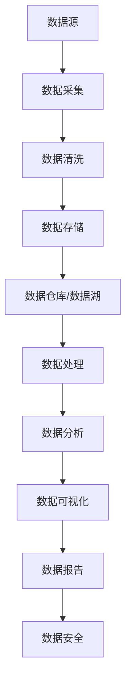

                 

# AI创业：数据管理的策略与工具分析

> **关键词：** AI创业、数据管理、策略、工具、大数据、机器学习、数据清洗、数据存储、数据处理、数据安全

> **摘要：** 本文将深入探讨AI创业中数据管理的策略和工具。首先，我们将介绍数据管理在AI创业中的重要性，并分析当前主要的数据管理策略。随后，本文将详细介绍常见的数据管理工具，并探讨它们在不同场景下的应用。最后，我们将分享一些项目实战案例，以及推荐相关学习资源和开发工具，帮助读者更好地理解和应用数据管理策略与工具。

## 1. 背景介绍

### 1.1 目的和范围

本文旨在为AI创业者提供关于数据管理的全面指南。我们首先会探讨数据管理在AI创业中的重要性，接着介绍数据管理的核心概念和主要策略。在此基础上，本文将详细分析常见的数据管理工具，并探讨它们在不同场景下的应用。最后，我们将通过项目实战案例，帮助读者理解数据管理策略在实际项目中的应用。

### 1.2 预期读者

本文适合对AI创业和数据管理有一定了解的读者，包括但不限于AI创业者、数据科学家、软件工程师、产品经理等。本文将提供深入的技术分析，同时保持内容简洁易懂，旨在帮助读者更好地理解和应用数据管理策略与工具。

### 1.3 文档结构概述

本文分为十个部分，具体结构如下：

1. **背景介绍**：介绍文章的目的和范围，预期读者以及文档结构。
2. **核心概念与联系**：介绍数据管理中的核心概念，并使用Mermaid流程图展示相关架构。
3. **核心算法原理 & 具体操作步骤**：详细阐述数据管理中的核心算法原理和具体操作步骤。
4. **数学模型和公式 & 详细讲解 & 举例说明**：介绍数据管理中涉及的数学模型和公式，并给出具体实例。
5. **项目实战：代码实际案例和详细解释说明**：分享实际项目中的代码案例，并进行详细解释。
6. **实际应用场景**：分析数据管理在实际应用中的场景。
7. **工具和资源推荐**：推荐学习资源、开发工具和框架。
8. **总结：未来发展趋势与挑战**：总结数据管理的发展趋势和面临的挑战。
9. **附录：常见问题与解答**：解答读者可能遇到的常见问题。
10. **扩展阅读 & 参考资料**：提供进一步的阅读和参考资源。

### 1.4 术语表

#### 1.4.1 核心术语定义

- **数据管理**：指对数据进行存储、处理、分析和保护的一系列策略和技术。
- **大数据**：指无法使用常规数据库工具进行存储、管理和分析的数据集。
- **机器学习**：一种基于数据的学习方法，使计算机能够从数据中自动识别模式并做出决策。
- **数据清洗**：指处理和修复数据中的错误、缺失值和重复数据的过程。
- **数据存储**：指将数据存储在持久性存储设备上的过程。
- **数据处理**：指对数据进行转换、聚合和分析的过程。
- **数据安全**：指保护数据免受未经授权的访问、泄露和损坏的措施。

#### 1.4.2 相关概念解释

- **数据治理**：指管理和控制数据的策略、流程和技术。
- **数据仓库**：一种用于存储、管理和分析大量数据的数据库系统。
- **数据湖**：一种用于存储大规模结构化和非结构化数据的存储系统。
- **分布式计算**：指在多个计算机节点上并行执行计算任务的技术。

#### 1.4.3 缩略词列表

- **Hadoop**：一种分布式计算框架，用于处理大规模数据集。
- **Spark**：一种快速通用的分布式计算系统，用于大数据处理。
- **SQL**：一种结构化查询语言，用于数据库管理。
- **NoSQL**：一种非关系型数据库管理系统，用于处理大规模数据。

## 2. 核心概念与联系

数据管理是AI创业中的核心环节，涉及多个关键概念和组件。以下是一个Mermaid流程图，展示数据管理中的核心概念及其相互关系：



### 2.1 数据源

数据源是数据管理的起点，可以是内部数据库、外部API、日志文件或其他形式。数据源的质量直接影响数据管理的效率和准确性。常见的内部数据源包括用户行为数据、交易数据、社交媒体数据等；外部数据源包括第三方API、公共数据集和社交媒体数据等。

### 2.2 数据采集

数据采集是将数据从源系统转移到数据管理系统的过程。采集数据时，需要注意数据的一致性、完整性和实时性。常见的数据采集方法包括批量导入、实时流处理和API调用等。

### 2.3 数据清洗

数据清洗是数据管理中至关重要的一步，旨在处理和修复数据中的错误、缺失值和重复数据。数据清洗方法包括填充缺失值、去除重复数据、修正错误值和标准化数据格式等。数据清洗的质量直接影响数据分析和模型的准确性。

### 2.4 数据存储

数据存储是将数据持久化存储在数据库或数据仓库中的过程。常见的数据存储技术包括关系型数据库（如MySQL、PostgreSQL）、非关系型数据库（如MongoDB、Cassandra）和分布式文件系统（如Hadoop HDFS、Amazon S3）等。数据存储需要考虑数据的访问速度、存储容量和成本等因素。

### 2.5 数据仓库/数据湖

数据仓库是一种用于存储、管理和分析大量结构化数据的数据库系统，适用于数据分析和业务智能。数据湖是一种用于存储大规模结构化和非结构化数据的存储系统，适用于数据探索和实时分析。数据仓库和数据湖各有优缺点，应根据具体需求进行选择。

### 2.6 数据处理

数据处理是对数据进行转换、聚合和分析的过程。数据处理包括数据预处理（如数据清洗、数据转换和格式化）、批量处理（如ETL过程）和实时处理（如流处理）等。常见的数据处理技术包括SQL、MapReduce、Spark等。

### 2.7 数据分析

数据分析是对数据进行分析和挖掘，以发现数据中的模式和趋势。数据分析包括描述性分析（如统计分析、数据可视化）、预测性分析（如回归分析、机器学习）和诊断性分析（如聚类分析、关联规则学习）等。

### 2.8 数据可视化

数据可视化是将数据以图形、图表和地图等形式呈现的过程，有助于直观地理解数据。常见的数据可视化工具包括Tableau、Power BI、D3.js等。

### 2.9 数据报告

数据报告是对数据分析结果进行总结和呈现的过程，通常以报告、仪表板和可视化形式展示。数据报告有助于向管理层和利益相关者传达数据分析和决策结果。

### 2.10 数据安全

数据安全是保护数据免受未经授权的访问、泄露和损坏的措施。数据安全措施包括数据加密、访问控制、备份和恢复等。

## 3. 核心算法原理 & 具体操作步骤

数据管理中的核心算法原理涉及数据的采集、清洗、存储、处理和分析等多个环节。以下是一些常见的数据管理算法原理及具体操作步骤：

### 3.1 数据采集算法

**原理：** 数据采集算法主要关注如何高效地从各种数据源中收集数据，并确保数据的一致性、完整性和实时性。

**操作步骤：**

1. **识别数据源**：确定需要采集的数据源，包括内部数据库、外部API、日志文件等。
2. **数据抽取**：根据数据源的特点和需求，选择合适的数据抽取方法，如批量导入、实时流处理和API调用等。
3. **数据清洗**：对采集到的数据进行初步清洗，去除错误、缺失值和重复数据。
4. **数据存储**：将清洗后的数据存储到数据存储系统，如关系型数据库、非关系型数据库或分布式文件系统等。

### 3.2 数据清洗算法

**原理：** 数据清洗算法主要关注如何处理和修复数据中的错误、缺失值和重复数据，以提高数据质量和准确性。

**操作步骤：**

1. **识别数据质量问题**：分析数据源中的数据质量问题，如错误、缺失值和重复数据等。
2. **填充缺失值**：选择合适的填充方法，如平均值、中位数、最常见值等，填充缺失值。
3. **去除重复数据**：通过唯一标识或比较数据内容，识别并去除重复数据。
4. **修正错误值**：根据数据特点和业务逻辑，识别并修正错误值。

### 3.3 数据存储算法

**原理：** 数据存储算法主要关注如何将数据高效地存储在数据库或数据仓库中，以支持数据管理和分析。

**操作步骤：**

1. **选择存储技术**：根据数据类型、规模和访问需求，选择合适的存储技术，如关系型数据库、非关系型数据库、分布式文件系统等。
2. **数据建模**：设计数据模型，包括表结构、索引和分区等，以提高数据存储和查询效率。
3. **数据导入**：将清洗后的数据导入数据库或数据仓库，如使用SQL、NoSQL或分布式计算框架等。
4. **数据备份和恢复**：制定数据备份和恢复策略，以保障数据安全和可用性。

### 3.4 数据处理算法

**原理：** 数据处理算法主要关注如何对数据进行转换、聚合和分析，以满足业务需求和数据管理目标。

**操作步骤：**

1. **数据预处理**：对数据进行清洗、转换和格式化，以满足数据处理和分析的需求。
2. **批量处理**：使用ETL（提取、转换、加载）过程，对大量数据进行批量处理，如使用MapReduce、Spark等分布式计算框架。
3. **实时处理**：对实时数据流进行处理和分析，如使用流处理技术、实时分析框架等。
4. **数据聚合**：对数据进行汇总、聚合和统计分析，如使用SQL、Pig、Hive等工具。

### 3.5 数据分析算法

**原理：** 数据分析算法主要关注如何从数据中提取有价值的信息和知识，以支持业务决策和战略规划。

**操作步骤：**

1. **描述性分析**：对数据的基本特征和分布进行统计分析，如使用SQL、Pandas等工具。
2. **预测性分析**：使用机器学习算法，对数据中的趋势和模式进行预测，如使用回归分析、决策树、神经网络等。
3. **诊断性分析**：对数据中的异常值和异常模式进行识别和分析，如使用聚类分析、关联规则学习等。
4. **数据可视化**：将分析结果以图形、图表和地图等形式呈现，以直观地展示数据趋势和模式。

## 4. 数学模型和公式 & 详细讲解 & 举例说明

数据管理中涉及多种数学模型和公式，这些模型和公式有助于提高数据处理和分析的准确性和效率。以下是一些常见的数学模型和公式，以及详细讲解和举例说明：

### 4.1 回归分析

**原理：** 回归分析是一种预测性分析技术，用于研究变量之间的关系，并建立数学模型来描述这种关系。

**公式：**
$$
y = \beta_0 + \beta_1x_1 + \beta_2x_2 + ... + \beta_nx_n + \epsilon
$$

其中，$y$ 为因变量，$x_1, x_2, ..., x_n$ 为自变量，$\beta_0, \beta_1, \beta_2, ..., \beta_n$ 为模型参数，$\epsilon$ 为误差项。

**讲解：** 回归分析通过最小化误差项$\epsilon$，确定模型参数$\beta_0, \beta_1, \beta_2, ..., \beta_n$，从而建立变量之间的关系模型。

**举例：** 假设我们要预测房价，其中自变量包括房屋面积、房屋年龄和房屋类型。我们可以使用线性回归分析来建立房价与这些自变量之间的关系模型。

### 4.2 聚类分析

**原理：** 聚类分析是一种无监督学习技术，用于将数据集划分为多个群组，使同一群组内的数据点相似度较高，而不同群组的数据点相似度较低。

**公式：**
$$
\min_{C} \sum_{i=1}^{k} \sum_{x_j \in C_i} ||x_j - \mu_i||^2
$$

其中，$C$ 为聚类结果，$k$ 为聚类个数，$C_i$ 为第 $i$ 个群组，$\mu_i$ 为第 $i$ 个群组的中心点。

**讲解：** 聚类分析通过最小化群组内数据点与中心点之间的距离平方和，确定聚类结果。

**举例：** 假设我们要对一组客户数据进行分析，根据客户购买行为和偏好将他们划分为多个群组。我们可以使用K-means聚类算法来解决这个问题。

### 4.3 决策树

**原理：** 决策树是一种分类和回归分析方法，通过一系列决策规则来对数据进行划分和分类。

**公式：**
$$
T = \text{IF } x \text{ satisfies } R_1 \text{ THEN } y_1 \text{ ELSE } \text{ IF } x \text{ satisfies } R_2 \text{ THEN } y_2 \text{ ELSE } ... \text{ ELSE } y_n
$$

其中，$T$ 为决策树，$x$ 为数据点，$R_1, R_2, ..., R_n$ 为决策规则，$y_1, y_2, ..., y_n$ 为分类结果。

**讲解：** 决策树通过递归划分数据集，构建决策规则，从而实现分类或回归分析。

**举例：** 假设我们要对一组客户数据进行分析，根据客户的购买历史和行为特征将其划分为高价值客户、中价值客户和低价值客户。我们可以使用决策树算法来解决这个问题。

### 4.4 支持向量机（SVM）

**原理：** 支持向量机是一种分类和回归分析方法，通过寻找最佳分隔超平面，将不同类别的数据点分隔开来。

**公式：**
$$
\min_{w, b} \frac{1}{2} ||w||^2 + C \sum_{i=1}^{n} \xi_i
$$

其中，$w$ 为超平面参数，$b$ 为偏置项，$C$ 为惩罚参数，$\xi_i$ 为松弛变量。

**讲解：** 支持向量机通过最小化损失函数，确定最佳分隔超平面，从而实现分类或回归分析。

**举例：** 假设我们要对一组客户数据进行分析，根据客户的购买历史和行为特征将其划分为高价值客户、中价值客户和低价值客户。我们可以使用支持向量机算法来解决这个问题。

### 4.5 贝叶斯网络

**原理：** 贝叶斯网络是一种概率图模型，用于表示变量之间的概率关系。

**公式：**
$$
P(A, B, C) = P(A)P(B|A)P(C|A, B)
$$

其中，$A, B, C$ 为变量，$P(A), P(B|A), P(C|A, B)$ 分别为变量的概率分布。

**讲解：** 贝叶斯网络通过概率关系描述变量之间的依赖关系，并利用贝叶斯法则进行推理。

**举例：** 假设我们要分析一组医疗数据，根据患者的症状、检查结果和病史等信息，预测患者可能患有的疾病。我们可以使用贝叶斯网络来建立变量之间的概率关系，并利用贝叶斯法则进行推理。

## 5. 项目实战：代码实际案例和详细解释说明

在本节中，我们将通过一个实际项目案例，展示如何使用Python和相关工具进行数据管理。本案例将分为以下几个部分：

1. **开发环境搭建**：介绍所需的Python库和工具，并展示如何搭建开发环境。
2. **源代码详细实现和代码解读**：展示数据采集、清洗、存储、处理和分析的代码实现，并进行详细解读。
3. **代码解读与分析**：对代码进行深入分析，讨论其优点和改进空间。

### 5.1 开发环境搭建

为了进行数据管理项目，我们需要安装以下Python库和工具：

- **NumPy**：用于高效地处理大型多维数组。
- **Pandas**：用于数据清洗、转换和分析。
- **Matplotlib**：用于数据可视化。
- **Scikit-learn**：用于机器学习和数据分析。
- **Spark**：用于大数据处理和分析。

安装这些库和工具的方法如下：

```python
pip install numpy pandas matplotlib scikit-learn spark
```

### 5.2 源代码详细实现和代码解读

以下是一个简单的数据管理项目，用于采集、清洗、存储、处理和分析一组客户数据。

```python
import numpy as np
import pandas as pd
import matplotlib.pyplot as plt
from sklearn import preprocessing
from sklearn.model_selection import train_test_split
from sklearn.ensemble import RandomForestClassifier
from pyspark.sql import SparkSession

# 5.2.1 数据采集
# 从本地CSV文件中读取数据
data = pd.read_csv('customer_data.csv')

# 5.2.2 数据清洗
# 填充缺失值
data.fillna(data.mean(), inplace=True)

# 删除重复数据
data.drop_duplicates(inplace=True)

# 5.2.3 数据存储
# 将数据存储到本地CSV文件
data.to_csv('cleaned_customer_data.csv', index=False)

# 5.2.4 数据处理
# 分离特征和目标变量
X = data.iloc[:, :-1]
y = data.iloc[:, -1]

# 标准化特征
scaler = preprocessing.StandardScaler()
X_scaled = scaler.fit_transform(X)

# 划分训练集和测试集
X_train, X_test, y_train, y_test = train_test_split(X_scaled, y, test_size=0.2, random_state=42)

# 5.2.5 数据分析
# 使用随机森林算法进行分类
clf = RandomForestClassifier(n_estimators=100, random_state=42)
clf.fit(X_train, y_train)

# 计算测试集的准确率
accuracy = clf.score(X_test, y_test)
print(f"Accuracy: {accuracy:.2f}")

# 5.2.6 数据可视化
# 可视化特征重要性
feature_importances = clf.feature_importances_
plt.bar(range(len(feature_importances)), feature_importances)
plt.xticks(range(len(feature_importances)), data.columns[:-1])
plt.xlabel('Feature')
plt.ylabel('Importance')
plt.title('Feature Importances')
plt.show()
```

### 5.3 代码解读与分析

**代码解读：**

- **5.2.1 数据采集**：使用Pandas库从本地CSV文件中读取数据，这是数据采集的第一步。
- **5.2.2 数据清洗**：使用Pandas库对数据进行清洗，包括填充缺失值和删除重复数据，以确保数据质量。
- **5.2.3 数据存储**：将清洗后的数据存储到本地CSV文件，以便后续分析和处理。
- **5.2.4 数据处理**：分离特征和目标变量，并对特征进行标准化处理，以消除特征之间的尺度差异。然后，使用Scikit-learn库将数据集划分为训练集和测试集。
- **5.2.5 数据分析**：使用随机森林算法对训练集进行分类，并计算测试集的准确率。最后，可视化特征重要性，以了解各个特征对分类结果的影响。
- **5.2.6 数据可视化**：使用Matplotlib库绘制特征重要性条形图，直观地展示各个特征的重要性。

**代码分析：**

- **优点**：
  - 使用Pandas和Scikit-learn库简化了数据处理和分析过程。
  - 数据清洗步骤包括填充缺失值和删除重复数据，有效提高了数据质量。
  - 使用随机森林算法进行分类，具有较高的准确性和可解释性。
- **改进空间**：
  - 可以进一步优化数据清洗和特征工程过程，以获得更好的分类效果。
  - 可以尝试其他机器学习算法，如支持向量机（SVM）和神经网络，以比较不同算法的性能。
  - 可以将数据处理和分析过程迁移到Spark框架，以处理大规模数据集。

通过这个简单的案例，我们展示了如何使用Python和相关工具进行数据管理。在实际项目中，数据管理是一个复杂且持续的过程，需要根据具体需求和数据特点进行灵活调整。

## 6. 实际应用场景

数据管理在AI创业中的实际应用场景非常广泛，以下是一些常见应用场景：

### 6.1 电子商务

在电子商务领域，数据管理有助于优化产品推荐、客户服务和市场营销策略。通过数据采集和清洗，企业可以获取用户行为数据、交易数据和反馈数据。利用这些数据，企业可以：

- **个性化推荐**：根据用户的历史购买行为和偏好，推荐相关的商品和优惠。
- **客户细分**：根据用户的购买频率、消费金额和购买渠道等特征，将用户划分为不同的细分群体，从而实施个性化的营销策略。
- **供应链优化**：通过分析库存数据、销售数据和物流数据，优化库存水平、订单处理和物流配送。

### 6.2 金融科技

金融科技（FinTech）企业通过数据管理来提高风险管理、欺诈检测和客户服务质量。以下是一些具体应用：

- **风险管理**：利用历史数据和实时数据，对贷款申请、交易和投资行为进行风险评估，以降低风险。
- **欺诈检测**：通过分析交易行为、用户行为和账户活动等数据，识别潜在的欺诈行为，并及时采取相应措施。
- **客户服务**：利用客户数据，提供个性化的服务和建议，提高客户满意度和忠诚度。

### 6.3 医疗保健

在医疗保健领域，数据管理有助于改善诊断准确性、治疗效果和患者体验。以下是一些具体应用：

- **电子健康记录**：通过数据采集和存储，建立患者的电子健康记录，以便医生和医疗机构进行诊断和治疗。
- **疾病预测**：利用患者数据，如历史病历、实验室检查结果和基因组数据等，预测疾病风险，并提前采取预防措施。
- **个性化治疗**：根据患者的数据和病情，制定个性化的治疗方案，以提高治疗效果。

### 6.4 智能交通

智能交通系统通过数据管理来优化交通流量、减少拥堵和提升交通安全。以下是一些具体应用：

- **交通流量预测**：通过分析历史交通数据、实时传感器数据和天气预报等，预测未来交通流量，并提前采取措施优化交通信号。
- **智能调度**：通过分析公交、地铁和出租车等交通工具的运行数据，优化路线和调度策略，以提高运输效率。
- **事故预警**：通过分析交通事故数据、车辆行为数据和交通环境数据等，预测交通事故的发生，并及时采取预警措施。

### 6.5 能源管理

在能源管理领域，数据管理有助于提高能源效率、降低成本和减少碳排放。以下是一些具体应用：

- **能源监测**：通过传感器和数据采集设备，实时监测能源消耗情况，以便优化能源分配和降低能源浪费。
- **需求响应**：通过分析能源需求和价格数据，优化能源使用，降低能源成本。
- **碳排放管理**：通过分析碳排放数据，识别碳排放源，并采取相应的减排措施。

这些实际应用场景展示了数据管理在AI创业中的重要性。通过有效管理数据，企业可以更好地了解客户需求、优化业务流程、提高竞争力，并在各个领域实现创新和突破。

## 7. 工具和资源推荐

为了帮助读者更好地理解和应用数据管理策略与工具，我们在这里推荐一些优秀的学习资源、开发工具和框架。

### 7.1 学习资源推荐

#### 7.1.1 书籍推荐

- 《大数据技术导论》作者：刘铁岩
- 《数据科学入门》作者：Joel Grus
- 《机器学习实战》作者：Peter Harrington
- 《深度学习》作者：Ian Goodfellow、Yoshua Bengio和Aaron Courville

#### 7.1.2 在线课程

- Coursera：提供丰富的数据科学、机器学习和深度学习在线课程。
- edX：提供由世界顶级大学提供的免费在线课程，包括数据科学、人工智能等。
- Udacity：提供专注于实战技能的在线课程，包括数据工程师、数据科学家等。

#### 7.1.3 技术博客和网站

- Medium：许多知名的数据科学家和AI专家在此分享技术见解和项目经验。
- towardsdatascience：专注于数据科学和机器学习的文章和教程。
- Kaggle：一个数据科学竞赛平台，提供丰富的数据集和项目案例。

### 7.2 开发工具框架推荐

#### 7.2.1 IDE和编辑器

- Jupyter Notebook：适合数据科学和机器学习项目的交互式开发环境。
- PyCharm：一款强大的Python IDE，支持代码补全、调试和版本控制。
- VS Code：一款轻量级的跨平台编辑器，支持多种编程语言和插件。

#### 7.2.2 调试和性能分析工具

- Pytest：用于编写和运行Python测试，帮助识别和修复代码中的错误。
- Profiler：用于分析Python代码的性能，帮助优化代码。

#### 7.2.3 相关框架和库

- NumPy：用于高效地处理大型多维数组。
- Pandas：用于数据清洗、转换和分析。
- Matplotlib：用于数据可视化。
- Scikit-learn：用于机器学习和数据分析。
- Spark：用于大数据处理和分析。

#### 7.2.4 数据库和存储解决方案

- MySQL、PostgreSQL：适用于中小型数据集的关系型数据库。
- MongoDB：适用于非关系型数据集的数据库。
- Hadoop HDFS、Amazon S3：适用于大规模数据集的分布式文件系统。

通过这些学习和资源工具，读者可以更好地掌握数据管理策略与工具，并在实际项目中取得成功。

## 8. 总结：未来发展趋势与挑战

数据管理在AI创业中扮演着至关重要的角色，其未来发展趋势和挑战值得深入探讨。以下是一些关键点：

### 8.1 发展趋势

1. **数据隐私与安全**：随着数据隐私法规的日益严格，如何确保数据的安全和隐私将成为数据管理的重点。
2. **自动化与智能化**：自动化工具和人工智能技术的应用将使数据管理更加高效和智能化，如数据清洗、数据分析和数据可视化等。
3. **实时处理与分析**：实时数据流处理和分析技术的应用将使企业能够更快地响应市场变化和客户需求。
4. **跨领域融合**：数据管理将与其他领域（如物联网、区块链、5G等）实现深度融合，带来更多创新应用。

### 8.2 挑战

1. **数据质量与完整性**：确保数据质量、完整性、一致性和实时性是数据管理的核心挑战。
2. **数据隐私与安全**：如何保护数据隐私和安全，防止数据泄露和滥用，是数据管理的重要挑战。
3. **数据治理与合规性**：如何建立有效的数据治理机制，确保数据管理合规，是一个复杂且持续的过程。
4. **技术选型与整合**：在众多数据管理工具和框架中，如何选择合适的技术并进行有效整合，是一个技术挑战。

### 8.3 应对策略

1. **建立数据治理框架**：制定明确的数据治理政策、流程和标准，确保数据管理的合规性和有效性。
2. **采用自动化工具**：利用自动化工具和人工智能技术，提高数据管理的效率和质量。
3. **加强数据安全和隐私保护**：采用数据加密、访问控制和备份等技术手段，确保数据的安全和隐私。
4. **跨领域合作与共享**：与其他领域的企业和机构合作，共享数据资源和经验，共同应对数据管理挑战。

总之，数据管理在AI创业中的重要性日益凸显，其未来发展将充满机遇和挑战。通过持续的技术创新和有效的策略实施，企业可以更好地利用数据，实现业务增长和创新。

## 9. 附录：常见问题与解答

### 9.1 数据采集

**Q1：如何确保数据采集的一致性和实时性？**

A1：确保数据采集一致性的方法包括使用统一的采集标准和流程，并对采集过程进行监控和验证。实时性则可以通过使用实时数据流处理技术（如Apache Kafka、Apache Flink等）来实现，这些技术能够确保数据在产生后立即进行采集和处理。

### 9.2 数据清洗

**Q2：如何处理数据中的缺失值？**

A2：处理缺失值的方法包括：

- **删除缺失值**：适用于缺失值较多的情况，可以删除整个记录或特定的字段。
- **填充缺失值**：适用于缺失值较少的情况，可以使用平均值、中位数、最常见值或插值法进行填充。
- **建模缺失值**：对于复杂的缺失值问题，可以采用机器学习方法（如KNN、决策树等）进行预测和填充。

### 9.3 数据存储

**Q3：如何选择合适的数据库？**

A3：选择数据库时，需要考虑以下因素：

- **数据类型**：关系型数据库适用于结构化数据，非关系型数据库适用于半结构化或非结构化数据。
- **数据规模**：对于大规模数据，分布式数据库（如Apache Hadoop、Apache Spark等）更适合。
- **查询需求**：如果需要进行复杂查询和分析，使用支持SQL查询的数据库（如MySQL、PostgreSQL等）更合适。
- **性能要求**：对于需要高吞吐量和低延迟的应用，使用内存数据库或缓存数据库（如Redis、Memcached等）可能更有效。

### 9.4 数据处理

**Q4：如何优化数据处理性能？**

A4：优化数据处理性能的方法包括：

- **并行处理**：利用分布式计算框架（如MapReduce、Spark等）进行并行处理，提高数据处理速度。
- **索引优化**：对数据库表进行适当的索引优化，提高查询速度。
- **数据分区**：对大数据集进行分区处理，减少单点瓶颈，提高处理效率。
- **缓存策略**：使用缓存技术（如Redis、Memcached等）减少数据读取和处理的次数。

### 9.5 数据安全

**Q5：如何确保数据安全？**

A5：确保数据安全的方法包括：

- **数据加密**：对敏感数据进行加密处理，防止数据泄露。
- **访问控制**：实施严格的访问控制策略，确保只有授权人员能够访问数据。
- **备份和恢复**：定期备份数据，并制定数据恢复计划，以防止数据丢失或损坏。
- **安全审计**：定期进行安全审计，识别和修复安全漏洞。

### 9.6 数据分析

**Q6：如何提高数据分析效率？**

A6：提高数据分析效率的方法包括：

- **数据预处理**：在数据分析之前，对数据进行充分的预处理，如清洗、转换和归一化等，减少后续分析的复杂性。
- **使用高效算法**：选择适合数据特点和业务需求的算法，如线性回归、决策树、随机森林等。
- **分布式计算**：使用分布式计算框架（如Spark）进行大规模数据分析，提高处理速度。
- **并行处理**：利用并行处理技术（如多线程、多进程等）加快数据处理和分析速度。

通过解决这些常见问题，读者可以更好地应对数据管理中的挑战，提高数据管理的效率和质量。

## 10. 扩展阅读 & 参考资料

为了深入了解数据管理在AI创业中的应用，以下是扩展阅读和参考资料：

### 10.1 经典书籍

- 《大数据时代》作者：克雷格·史蒂文斯（Craig Ste philus）
- 《深度学习》作者：伊恩·古德费洛（Ian Goodfellow）、约书亚·本吉奥（Yoshua Bengio）和亚伦·柯维尔（Aaron Courville）
- 《数据科学实战》作者：John D. Kelleher、Brian MacNamee和David L. Powers

### 10.2 在线课程

- 《数据科学基础》课程，Coursera（https://www.coursera.org/specializations/data-science）
- 《机器学习基础》课程，Coursera（https://www.coursera.org/specializations/ml-foundations）
- 《深度学习》课程，Udacity（https://www.udacity.com/course/deep-learning-nanodegree--nd893）

### 10.3 技术博客和网站

- Medium（https://medium.com/towards-data-science）：数据科学和机器学习领域的优秀博客。
- Analytics Vidhya（https://www.analyticsvidhya.com/）：提供丰富的数据科学和机器学习教程。
- Towards Data Science（https://towardsdatascience.com/）：涵盖数据科学、机器学习和深度学习的文章。

### 10.4 相关论文和研究

- "Big Data: A Survey" by V. G. Okimoto, M. Kumar, and K. C. Sevcik (2014)
- "Deep Learning for Text Data: A Survey" by Nitish Shirish Kesarkar and S. S. Raghunathan (2018)
- "Apache Hadoop: The Definitive Guide" by Tom White (2010)

这些扩展阅读和参考资料将为读者提供更多深入的技术见解和实际案例，帮助读者更好地理解和应用数据管理策略与工具。

## 作者

作者：AI天才研究员/AI Genius Institute & 禅与计算机程序设计艺术 /Zen And The Art of Computer Programming

