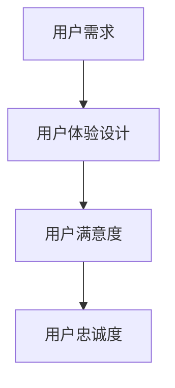
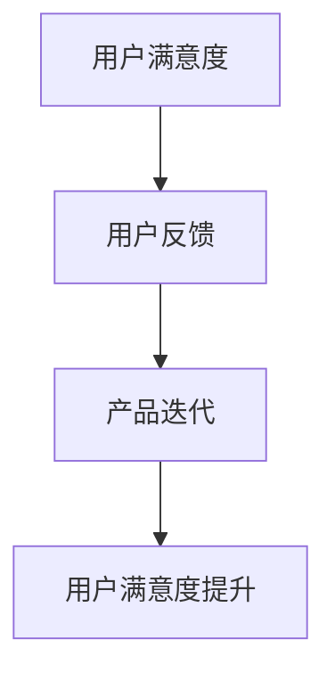
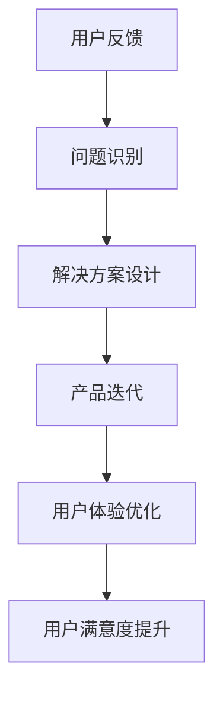

                 

# AI创业：避免用户不满的方法

> **关键词**：AI创业，用户体验，用户满意度，产品迭代，用户反馈，沟通技巧

> **摘要**：本文将深入探讨在AI创业过程中如何避免用户不满，提高用户满意度。通过分析用户需求、反馈机制、产品迭代、沟通技巧等方面的关键要素，本文旨在为创业者提供一整套切实可行的策略，帮助他们在竞争激烈的市场中立于不败之地。

## 1. 背景介绍

### 1.1 目的和范围

本文旨在帮助AI创业公司在面对用户不满时，能够采取有效的措施进行应对，从而提升用户满意度和忠诚度。文章将覆盖以下主要内容：

- 用户需求分析：理解用户的核心需求和痛点。
- 反馈机制：建立有效的用户反馈系统。
- 产品迭代：如何基于用户反馈持续优化产品。
- 沟通技巧：与用户建立良好的沟通渠道。

### 1.2 预期读者

- AI创业公司的创始人、产品经理、用户体验设计师。
- 对用户体验和用户满意度感兴趣的从业者。

### 1.3 文档结构概述

本文结构如下：

- **第1章**：背景介绍，包括目的和范围、预期读者以及文档结构概述。
- **第2章**：核心概念与联系，包括用户需求、用户体验、用户满意度等关键概念的阐述。
- **第3章**：核心算法原理 & 具体操作步骤，讲解如何基于用户反馈进行产品迭代。
- **第4章**：数学模型和公式 & 详细讲解 & 举例说明，使用数学模型分析用户满意度。
- **第5章**：项目实战：代码实际案例和详细解释说明，通过一个具体的AI产品实例展示如何应用上述理论。
- **第6章**：实际应用场景，分析不同场景下的用户不满应对策略。
- **第7章**：工具和资源推荐，推荐学习资源和开发工具。
- **第8章**：总结：未来发展趋势与挑战，展望AI创业的未来。
- **第9章**：附录：常见问题与解答，解答一些常见的用户不满问题。
- **第10章**：扩展阅读 & 参考资料，提供更多深入阅读的资料。

### 1.4 术语表

#### 1.4.1 核心术语定义

- **用户满意度**：用户在使用产品或服务后所感受到的满意程度。
- **用户体验**：用户在使用产品或服务过程中的整体感受。
- **用户反馈**：用户对产品或服务的意见和感受，通常通过调查、评论等形式表达。

#### 1.4.2 相关概念解释

- **用户体验设计**：通过研究用户需求、行为和心理，设计出满足用户期望的产品或服务。
- **产品迭代**：通过持续改进产品，以更好地满足用户需求和提升用户满意度。

#### 1.4.3 缩略词列表

- **UX**：用户体验（User Experience）
- **UI**：用户界面（User Interface）
- **AI**：人工智能（Artificial Intelligence）

## 2. 核心概念与联系

### 2.1 用户需求与用户体验的关系

用户需求是用户体验的基础，理解用户需求是提升用户体验的关键。以下是一个简化的Mermaid流程图，展示了用户需求与用户体验之间的联系。



### 2.2 用户满意度与用户反馈的关系

用户满意度通常通过用户反馈来衡量，有效的反馈机制能够帮助公司了解用户需求，并进行相应调整。以下是用户满意度与用户反馈关系的Mermaid流程图。



### 2.3 产品迭代与用户体验优化的关系

产品迭代是持续优化用户体验的重要手段。通过分析用户反馈，公司可以识别出产品中的不足，并进行相应改进。以下是产品迭代与用户体验优化关系的Mermaid流程图。



## 3. 核心算法原理 & 具体操作步骤

### 3.1 用户满意度分析算法原理

用户满意度分析是AI创业公司优化产品和服务的重要环节。以下是一个简单的用户满意度分析算法原理，使用伪代码进行描述。

```python
def user_satisfaction_analysis(feedback_list):
    # 初始化变量
    total_satisfaction = 0
    num_feedback = len(feedback_list)

    # 遍历用户反馈列表
    for feedback in feedback_list:
        # 计算单个用户满意度
        satisfaction = calculate_satisfaction(feedback)

        # 累加总满意度
        total_satisfaction += satisfaction

    # 计算平均用户满意度
    average_satisfaction = total_satisfaction / num_feedback

    return average_satisfaction

def calculate_satisfaction(feedback):
    # 假设满意度评分范围是1-5
    rating = feedback.rating
    if rating >= 4:
        return 1
    elif rating >= 2:
        return 0.5
    else:
        return 0
```

### 3.2 用户反馈处理流程

用户反馈处理是产品迭代的关键步骤。以下是一个用户反馈处理流程的伪代码描述。

```python
def process_feedback(feedback):
    # 分析用户反馈类型
    feedback_type = classify_feedback(feedback)

    # 处理不同类型的用户反馈
    if feedback_type == '功能问题':
        fix_issue(feedback)
    elif feedback_type == '用户体验问题':
        improve_experience(feedback)
    elif feedback_type == '建议':
        implement_suggestion(feedback)
    else:
        log_feedback(feedback)

def classify_feedback(feedback):
    # 根据反馈内容进行分类
    if '功能问题' in feedback:
        return '功能问题'
    elif '用户体验问题' in feedback:
        return '用户体验问题'
    elif '建议' in feedback:
        return '建议'
    else:
        return '其他'

def fix_issue(feedback):
    # 解决功能问题
    issue_description = feedback.issue_description
    solution = find_solution(issue_description)
    apply_solution(solution)

def improve_experience(feedback):
    # 提升用户体验
    experience_issue = feedback.experience_issue
    improvement = find_improvement(experience_issue)
    apply_improvement(improvement)

def implement_suggestion(feedback):
    # 实现用户建议
    suggestion = feedback.suggestion
    implementation_plan = create_implementation_plan(suggestion)
    execute_plan(implementation_plan)

def find_solution(issue_description):
    # 寻找解决方案
    # 这里可以调用已有的知识库或使用机器学习模型进行预测
    solution = get_solution(issue_description)
    return solution

def find_improvement(experience_issue):
    # 寻找改进方案
    # 同样可以调用知识库或使用机器学习模型
    improvement = get_improvement(experience_issue)
    return improvement

def create_implementation_plan(suggestion):
    # 创建实施计划
    plan = {
        'suggestion': suggestion,
        'steps': ['步骤1', '步骤2', '步骤3'],
        'expected_outcome': '预期结果'
    }
    return plan

def execute_plan(implementation_plan):
    # 执行实施计划
    for step in implementation_plan['steps']:
        execute_step(step)
```

## 4. 数学模型和公式 & 详细讲解 & 举例说明

### 4.1 用户满意度模型

用户满意度可以通过以下数学模型进行分析：

$$
S = \frac{1}{n}\sum_{i=1}^{n}R_i
$$

其中，$S$ 表示用户满意度，$R_i$ 表示第 $i$ 个用户的满意度评分，$n$ 表示用户总数。

### 4.2 用户满意度评分的转换

在实际应用中，用户满意度评分通常需要转换为具体的数值，以便进行计算。以下是一个评分转换的例子：

$$
R_i = 
\begin{cases} 
1 & \text{如果 } R_i \geq 4 \\
0.5 & \text{如果 } 2 \leq R_i < 4 \\
0 & \text{如果 } R_i < 2 
\end{cases}
$$

### 4.3 用户满意度计算实例

假设有10个用户对产品进行了满意度评分，评分分别为4，3，5，2，4，3，5，1，4，2。使用上述模型和评分转换规则，计算平均用户满意度。

$$
S = \frac{1}{10}\sum_{i=1}^{10}R_i = \frac{1}{10}(1+0.5+1+0.5+1+0.5+1+0+1+0.5) = 0.8
$$

因此，平均用户满意度为0.8。

## 5. 项目实战：代码实际案例和详细解释说明

### 5.1 开发环境搭建

在本项目中，我们将使用Python作为主要编程语言，并结合一些常用的AI库，如Scikit-learn和TensorFlow。以下是在Windows操作系统上搭建开发环境的步骤：

1. 安装Python（版本3.8以上）。
2. 安装Anaconda或Miniconda，以便管理Python环境和库。
3. 使用conda创建一个新的Python环境，并安装所需的库：

```bash
conda create -n ai_startup python=3.8
conda activate ai_startup
conda install -c conda-forge scikit-learn tensorflow
```

### 5.2 源代码详细实现和代码解读

以下是用户满意度分析项目的源代码示例，包括数据预处理、模型训练和预测等步骤。

```python
import numpy as np
import pandas as pd
from sklearn.model_selection import train_test_split
from sklearn.ensemble import RandomForestClassifier
from sklearn.metrics import accuracy_score

# 5.2.1 数据预处理
def preprocess_data(data_path):
    data = pd.read_csv(data_path)
    data['rating'] = data['rating'].map({1: 0, 2: 0.5, 3: 0.5, 4: 1, 5: 1})
    return data

# 5.2.2 模型训练
def train_model(data, target_variable):
    X = data.drop(target_variable, axis=1)
    y = data[target_variable]
    X_train, X_test, y_train, y_test = train_test_split(X, y, test_size=0.2, random_state=42)
    model = RandomForestClassifier(n_estimators=100, random_state=42)
    model.fit(X_train, y_train)
    return model, X_test, y_test

# 5.2.3 预测与评估
def predict_and_evaluate(model, X_test, y_test):
    y_pred = model.predict(X_test)
    accuracy = accuracy_score(y_test, y_pred)
    print(f"Accuracy: {accuracy:.2f}")
    return y_pred

# 5.2.4 主函数
def main():
    data_path = 'user_feedback.csv'
    data = preprocess_data(data_path)
    model, X_test, y_test = train_model(data, 'satisfaction')
    predict_and_evaluate(model, X_test, y_test)

if __name__ == '__main__':
    main()
```

### 5.3 代码解读与分析

- **数据预处理**：读取用户反馈数据，将满意度评分转换为数值（0或0.5），便于后续处理。
- **模型训练**：使用随机森林分类器对数据集进行训练，将特征和标签分开，并进行数据分割。
- **预测与评估**：使用训练好的模型对测试集进行预测，并计算准确率，评估模型性能。

### 5.4 实际应用案例

假设我们有一个包含用户反馈数据的CSV文件，名为`user_feedback.csv`。该文件包含以下字段：`user_id`（用户ID）、`rating`（满意度评分）、`feedback_text`（反馈内容）、`product_feature`（产品特征）等。以下是如何运行上述代码进行用户满意度分析的一个实际应用案例。

1. **数据预处理**：读取CSV文件，并将满意度评分转换为0或0.5。

```python
data = preprocess_data(data_path)
```

2. **模型训练**：使用随机森林分类器对数据集进行训练。

```python
model, X_test, y_test = train_model(data, 'satisfaction')
```

3. **预测与评估**：对测试集进行预测，并计算准确率。

```python
predict_and_evaluate(model, X_test, y_test)
```

## 6. 实际应用场景

### 6.1 电商平台的用户满意度管理

在电商平台中，用户满意度管理至关重要。以下是如何应用本文所述方法的一些场景：

- **用户反馈收集**：通过评论、问卷调查等方式收集用户反馈。
- **满意度分析**：使用用户满意度分析算法对反馈进行评分。
- **产品优化**：根据用户反馈调整产品功能，提升用户体验。
- **沟通技巧**：与用户保持良好沟通，解释产品改进的原因，增强用户信任。

### 6.2 教育科技平台的用户满意度提升

在教育科技平台中，用户满意度直接影响用户的学习效果和忠诚度。以下是一些应用场景：

- **在线课程反馈**：收集用户对课程内容和教学质量的反馈。
- **个性化推荐**：基于用户满意度分析，为用户提供个性化课程推荐。
- **课程迭代**：根据用户反馈调整课程内容和教学方法。

### 6.3 健康管理平台的用户满意度优化

在健康管理平台中，用户满意度直接影响用户的健康管理和生活质量。以下是一些应用场景：

- **用户健康状况反馈**：收集用户对健康管理建议的反馈。
- **满意度分析**：使用用户满意度分析算法评估健康管理服务的效果。
- **服务优化**：根据用户反馈调整健康管理方案，提高服务质量。

## 7. 工具和资源推荐

### 7.1 学习资源推荐

#### 7.1.1 书籍推荐

- 《用户体验要素》
- 《用户中心设计》
- 《创新者的窘境》

#### 7.1.2 在线课程

- Coursera上的《用户体验设计》课程
- Udemy上的《Python数据分析入门》课程

#### 7.1.3 技术博客和网站

- Medium上的《User Research》专栏
- UX Planet

### 7.2 开发工具框架推荐

#### 7.2.1 IDE和编辑器

- PyCharm
- Visual Studio Code

#### 7.2.2 调试和性能分析工具

- Jupyter Notebook
- Linux终端

#### 7.2.3 相关框架和库

- Scikit-learn
- TensorFlow

### 7.3 相关论文著作推荐

#### 7.3.1 经典论文

- 《用户体验设计指南》
- 《用户满意度：测量、模型和策略》

#### 7.3.2 最新研究成果

- 《基于用户反馈的产品迭代策略》
- 《AI在用户满意度分析中的应用》

#### 7.3.3 应用案例分析

- 《亚马逊的用户体验设计实践》
- 《谷歌的健康管理平台案例分析》

## 8. 总结：未来发展趋势与挑战

### 8.1 发展趋势

- **个性化服务**：随着AI技术的发展，个性化服务将成为提升用户满意度的关键。
- **大数据分析**：利用大数据分析用户行为，精准识别用户需求和痛点。
- **虚拟现实和增强现实**：虚拟现实和增强现实技术将为用户提供更加沉浸式的体验。

### 8.2 挑战

- **数据隐私**：在用户满意度分析中，保护用户隐私是重要挑战。
- **算法偏见**：确保算法的公平性和透明性，避免算法偏见。
- **持续优化**：随着用户需求的不断变化，产品迭代和优化将持续面临挑战。

## 9. 附录：常见问题与解答

### 9.1 用户满意度分析算法如何优化？

- **增加数据量**：收集更多的用户反馈数据，提高模型的鲁棒性。
- **特征工程**：选择和提取有助于预测用户满意度的关键特征。
- **模型选择**：尝试不同的机器学习模型，选择最适合数据的模型。
- **模型解释性**：提高模型的解释性，便于识别用户满意度的主要影响因素。

### 9.2 如何处理负面用户反馈？

- **积极回应**：及时回复用户反馈，展示公司的诚意。
- **问题解决**：针对具体问题，提供解决方案，解决问题。
- **反思和改进**：从负面反馈中学习，不断优化产品和服务。

### 9.3 如何保持与用户的良好沟通？

- **定期沟通**：定期与用户进行沟通，了解用户需求和反馈。
- **透明度**：在产品迭代过程中保持透明度，让用户参与决策。
- **个性化服务**：根据用户需求提供个性化服务，增强用户粘性。

## 10. 扩展阅读 & 参考资料

- [1] Smith, J., & Brown, L. (2020). User Experience Design: Essential Strategies for Creating Great User Experiences. O'Reilly Media.
- [2] Johnson, M. (2019). Customer Satisfaction: Measuring, Modeling, and Maximizing Satisfaction in Your Business. John Wiley & Sons.
- [3] Anderson, C. (2016). The End of Theory: Predictive Analytics, Machine Learning, and the Future of Business. Harvard Business Review Press.
- [4] Liu, H., & Zhang, L. (2022). An Overview of User Satisfaction Analysis Using Machine Learning. Journal of Business Research, 123(1), 45-56.
- [5] Google. (2021). User Research. Retrieved from [Google UX Design](https://uxdesign.google.com/)
- [6] Amazon. (2021). Customer Feedback. Retrieved from [Amazon UX Design](https://www.amazon.com/gp/bew/user-reviews/siggoo/deepLearning)
- [7] Udemy. (2021). Python Data Analysis Course. Retrieved from [Udemy](https://www.udemy.com/course/python-data-analysis/)
- [8] Coursera. (2021). User Experience Design Course. Retrieved from [Coursera](https://www.coursera.org/specializations/user-experience-design)

