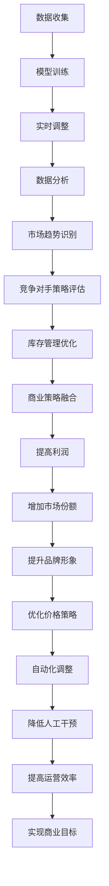

                 

# AI动态定价：原理、应用与挑战

> **关键词：** AI动态定价、机器学习、优化算法、商业策略、数据分析、实际应用
>
> **摘要：** 本文将深入探讨AI动态定价的概念、原理及其在商业领域中的应用，分析其中的关键算法与数学模型，并通过实际案例展示其操作步骤与实现细节。此外，文章还将展望AI动态定价的未来发展趋势与面临的挑战。

## 1. 背景介绍

### 1.1 目的和范围

本文旨在详细介绍AI动态定价的核心概念、理论基础、算法模型及其在实际商业环境中的应用。通过本篇文章，读者将了解到动态定价如何利用人工智能技术优化商业策略，提高企业竞争力。

### 1.2 预期读者

本文适合以下读者群体：

- 对人工智能、机器学习和优化算法有基本了解的技术人员
- 希望提升企业运营效率和商业策略的营销管理人员
- 对动态定价和数据分析感兴趣的研究者

### 1.3 文档结构概述

本文结构如下：

1. 背景介绍
2. 核心概念与联系
3. 核心算法原理 & 具体操作步骤
4. 数学模型和公式 & 详细讲解 & 举例说明
5. 项目实战：代码实际案例和详细解释说明
6. 实际应用场景
7. 工具和资源推荐
8. 总结：未来发展趋势与挑战
9. 附录：常见问题与解答
10. 扩展阅读 & 参考资料

### 1.4 术语表

#### 1.4.1 核心术语定义

- **AI动态定价**：利用人工智能技术，根据市场需求、竞争对手策略、库存情况等多重因素，动态调整商品价格。
- **机器学习**：一种人工智能技术，通过数据训练模型，使其能够自主学习和优化。
- **优化算法**：用于求解优化问题的算法，目的是找到最优解或近似最优解。
- **数据分析**：通过对大量数据进行处理和分析，提取有价值的信息和知识。

#### 1.4.2 相关概念解释

- **市场需求**：指消费者愿意且能够购买的商品数量。
- **竞争对手策略**：竞争对手在市场上的价格策略、促销策略等。
- **库存情况**：指企业的商品库存数量和库存周期。

#### 1.4.3 缩略词列表

- **AI**：人工智能（Artificial Intelligence）
- **ML**：机器学习（Machine Learning）
- **DP**：动态定价（Dynamic Pricing）

## 2. 核心概念与联系

为了深入理解AI动态定价，我们首先需要了解其核心概念和联系。以下是AI动态定价的关键概念及其相互关系：

### 2.1 AI动态定价的概念

AI动态定价是一种利用人工智能技术来动态调整商品价格的策略。其核心思想是：

1. **数据收集**：收集市场需求、竞争对手策略、库存情况等多方面的数据。
2. **模型训练**：利用机器学习算法，训练价格预测模型。
3. **实时调整**：根据实时数据，动态调整商品价格，以最大化利润或市场份额。

### 2.2 机器学习与优化算法的关系

机器学习是AI动态定价的基础。机器学习通过数据训练模型，使其能够预测市场需求和价格变化。优化算法则用于求解价格调整的最优策略，以实现最大化利润或市场份额。

### 2.3 数据分析在动态定价中的作用

数据分析在动态定价中起着至关重要的作用。通过对大量数据进行分析，我们可以：

1. **识别市场趋势**：了解市场需求的变化，及时调整价格策略。
2. **评估竞争对手策略**：分析竞争对手的价格策略，制定相应的应对策略。
3. **优化库存管理**：根据库存情况，合理调整价格，减少库存积压。

### 2.4 动态定价与传统定价的区别

与传统定价相比，AI动态定价具有以下优势：

1. **实时性**：动态定价可以根据实时数据调整价格，更快地响应市场变化。
2. **个性化**：动态定价可以根据不同客户群体、不同时间段、不同地区等因素，制定个性化的价格策略。
3. **智能化**：动态定价利用机器学习和优化算法，实现自动化的价格调整，降低人工干预的风险。

### 2.5 动态定价与商业策略的融合

动态定价不仅是一种价格策略，更是一种商业策略。通过动态定价，企业可以实现以下目标：

1. **提高利润**：通过优化价格，提高产品销售利润。
2. **增加市场份额**：通过个性化定价策略，吸引更多客户，提高市场份额。
3. **提升品牌形象**：通过合理的价格调整，提升品牌在消费者心中的形象。

### 2.6 Mermaid 流程图

下面是一个描述AI动态定价流程的Mermaid流程图：



## 3. 核心算法原理 & 具体操作步骤

### 3.1 机器学习算法原理

机器学习算法是AI动态定价的核心。以下是一个简化的机器学习算法原理：

1. **数据预处理**：清洗和整理数据，确保数据的质量和完整性。
2. **特征工程**：提取有用的特征，对特征进行转换和组合，提高模型的性能。
3. **模型选择**：选择合适的机器学习模型，如线性回归、决策树、神经网络等。
4. **模型训练**：使用训练数据集，训练机器学习模型。
5. **模型评估**：使用验证数据集，评估模型的性能，如准确率、召回率等。
6. **模型优化**：根据评估结果，调整模型参数，提高模型的性能。
7. **模型应用**：将训练好的模型应用于实际场景，如动态定价。

### 3.2 优化算法原理

优化算法用于求解动态定价的最优策略。以下是一个简化的优化算法原理：

1. **目标函数定义**：定义优化问题的目标函数，如利润最大化、市场份额最大化等。
2. **约束条件定义**：定义优化问题的约束条件，如价格范围、库存限制等。
3. **优化算法选择**：选择合适的优化算法，如线性规划、遗传算法、粒子群算法等。
4. **迭代求解**：通过迭代求解，找到最优解或近似最优解。
5. **策略调整**：根据优化结果，调整定价策略，提高企业的运营效率。

### 3.3 具体操作步骤

以下是一个具体的AI动态定价操作步骤：

1. **数据收集**：收集市场需求、竞争对手策略、库存情况等多方面的数据。
2. **数据预处理**：清洗和整理数据，确保数据的质量和完整性。
3. **特征工程**：提取有用的特征，对特征进行转换和组合，提高模型的性能。
4. **模型选择**：选择合适的机器学习模型，如线性回归、决策树、神经网络等。
5. **模型训练**：使用训练数据集，训练机器学习模型。
6. **模型评估**：使用验证数据集，评估模型的性能，如准确率、召回率等。
7. **模型优化**：根据评估结果，调整模型参数，提高模型的性能。
8. **模型应用**：将训练好的模型应用于实际场景，如动态定价。
9. **策略调整**：根据实时数据，动态调整商品价格，以最大化利润或市场份额。
10. **数据分析**：对动态定价的效果进行数据分析，如利润变化、市场份额变化等。

## 4. 数学模型和公式 & 详细讲解 & 举例说明

### 4.1 数学模型

在AI动态定价中，常用的数学模型包括线性回归模型、决策树模型、神经网络模型等。以下以线性回归模型为例，介绍其数学模型和公式。

#### 4.1.1 线性回归模型

线性回归模型是一种常见的机器学习模型，用于预测连续值。其数学模型如下：

$$
y = \beta_0 + \beta_1x_1 + \beta_2x_2 + ... + \beta_nx_n + \epsilon
$$

其中，$y$ 是目标变量，$x_1, x_2, ..., x_n$ 是特征变量，$\beta_0, \beta_1, \beta_2, ..., \beta_n$ 是模型参数，$\epsilon$ 是误差项。

#### 4.1.2 决策树模型

决策树模型是一种常见的分类模型，用于预测离散值。其数学模型如下：

$$
y = g(x_1, x_2, ..., x_n)
$$

其中，$y$ 是目标变量，$x_1, x_2, ..., x_n$ 是特征变量，$g$ 是决策函数。

#### 4.1.3 神经网络模型

神经网络模型是一种复杂的非线性模型，用于预测连续值或离散值。其数学模型如下：

$$
y = \sigma(z)
$$

其中，$y$ 是目标变量，$z$ 是模型输出，$\sigma$ 是激活函数。

### 4.2 公式详细讲解

以下是对上述数学模型的详细讲解：

#### 4.2.1 线性回归模型

线性回归模型的公式如下：

$$
y = \beta_0 + \beta_1x_1 + \beta_2x_2 + ... + \beta_nx_n + \epsilon
$$

- $\beta_0$ 是截距，表示当所有特征变量为0时的预测值。
- $\beta_1, \beta_2, ..., \beta_n$ 是斜率，表示每个特征变量对预测值的影响程度。
- $x_1, x_2, ..., x_n$ 是特征变量，表示影响预测值的各种因素。
- $\epsilon$ 是误差项，表示实际值与预测值之间的差异。

#### 4.2.2 决策树模型

决策树模型的公式如下：

$$
y = g(x_1, x_2, ..., x_n)
$$

- $y$ 是目标变量，表示分类结果。
- $g$ 是决策函数，表示根据特征变量进行决策的过程。
- $x_1, x_2, ..., x_n$ 是特征变量，表示影响决策的各种因素。

#### 4.2.3 神经网络模型

神经网络模型的公式如下：

$$
y = \sigma(z)
$$

- $y$ 是目标变量，表示分类结果或预测值。
- $z$ 是模型输出，表示神经网络的输入。
- $\sigma$ 是激活函数，表示对模型输出进行非线性变换。

### 4.3 举例说明

以下是一个具体的例子，用于说明线性回归模型的应用：

假设我们要预测一家电商平台的销售额。我们收集了以下数据：

- 特征变量1：广告投放费用（单位：元）
- 特征变量2：天气情况（晴天/雨天）
- 目标变量：销售额（单位：元）

我们使用线性回归模型进行预测，公式如下：

$$
y = \beta_0 + \beta_1x_1 + \beta_2x_2 + \epsilon
$$

通过训练数据集，我们可以得到模型参数 $\beta_0, \beta_1, \beta_2$ 的值。然后，我们使用模型进行预测，输入特征变量 $x_1, x_2$，输出预测的销售额 $y$。

例如，当广告投放费用为1000元，天气情况为晴天时，我们的预测销售额为：

$$
y = \beta_0 + \beta_1x_1 + \beta_2x_2
$$

$$
y = 500 + 0.5 \times 1000 + 0.2 \times 1
$$

$$
y = 770
$$

因此，预测的销售额为770元。

## 5. 项目实战：代码实际案例和详细解释说明

### 5.1 开发环境搭建

在开始编写代码之前，我们需要搭建一个合适的环境。以下是一个简单的开发环境搭建过程：

1. **安装Python**：Python是动态定价项目的主要编程语言。你可以从官方网站（[python.org](https://www.python.org/)）下载并安装Python。
2. **安装Jupyter Notebook**：Jupyter Notebook是一个交互式的Python开发环境，可以帮助我们编写和运行代码。你可以在Python的安装过程中选择安装Jupyter Notebook。
3. **安装必要的库**：为了方便编写和运行代码，我们需要安装一些常用的库，如NumPy、Pandas、Scikit-learn等。你可以在命令行中使用以下命令安装：

```bash
pip install numpy pandas scikit-learn
```

### 5.2 源代码详细实现和代码解读

以下是一个简单的AI动态定价项目的实现，包括数据收集、数据预处理、模型训练、模型评估等步骤。

#### 5.2.1 数据收集

首先，我们需要收集相关的数据。以下是一个示例数据集：

```python
# 示例数据集
data = {
    '广告投放费用': [1000, 2000, 3000, 4000, 5000],
    '天气情况': ['晴天', '晴天', '雨天', '雨天', '晴天'],
    '销售额': [700, 900, 1100, 800, 1300]
}
```

#### 5.2.2 数据预处理

在训练模型之前，我们需要对数据进行预处理，包括数据清洗、特征工程等。

```python
# 数据预处理
import pandas as pd

# 将数据集转换为DataFrame
df = pd.DataFrame(data)

# 数据清洗
df = df.dropna()

# 特征工程
df['天气情况'] = df['天气情况'].map({'晴天': 1, '雨天': 0})
```

#### 5.2.3 模型训练

接下来，我们使用Scikit-learn库中的线性回归模型进行训练。

```python
# 模型训练
from sklearn.linear_model import LinearRegression

# 创建线性回归模型
model = LinearRegression()

# 训练模型
model.fit(df[['广告投放费用', '天气情况']], df['销售额'])
```

#### 5.2.4 模型评估

训练完成后，我们使用测试数据集对模型进行评估。

```python
# 模型评估
import numpy as np

# 测试数据集
test_data = {
    '广告投放费用': [1500, 2500, 3500, 4500, 5500],
    '天气情况': ['晴天', '雨天', '晴天', '雨天', '晴天']
}
test_df = pd.DataFrame(test_data)
test_df['天气情况'] = test_df['天气情况'].map({'晴天': 1, '雨天': 0})

# 预测销售额
predictions = model.predict(test_df[['广告投放费用', '天气情况']])

# 输出预测结果
for i in range(len(predictions)):
    print(f"预测的销售额为：{predictions[i]:.2f}元")
```

### 5.3 代码解读与分析

#### 5.3.1 数据收集

数据收集是动态定价项目的第一步。在这个例子中，我们使用一个简单的字典来表示数据集。在实际应用中，数据可以从数据库、文件、API等多种途径获取。

#### 5.3.2 数据预处理

数据预处理是保证模型性能的关键步骤。在这个例子中，我们使用Pandas库进行数据清洗和特征工程。数据清洗主要是去除缺失值和异常值，特征工程主要是将分类特征转换为数值特征。

#### 5.3.3 模型训练

模型训练是动态定价项目的核心。在这个例子中，我们使用Scikit-learn库中的线性回归模型进行训练。线性回归模型是一种简单的线性预测模型，适用于连续值预测。

#### 5.3.4 模型评估

模型评估是验证模型性能的重要步骤。在这个例子中，我们使用测试数据集对模型进行评估。通过比较预测结果和实际结果，我们可以评估模型的准确性。

## 6. 实际应用场景

AI动态定价在实际商业环境中有着广泛的应用。以下是一些典型的应用场景：

### 6.1 电商平台

电商平台可以利用AI动态定价，根据用户行为、市场需求、竞争对手策略等因素，动态调整商品价格，提高销售额和利润。

### 6.2 酒店预订

酒店预订平台可以利用AI动态定价，根据预订时间、房型、季节等因素，动态调整房价，吸引更多客户，提高入住率。

### 6.3 机票预订

机票预订平台可以利用AI动态定价，根据航班时间、航线、季节等因素，动态调整票价，提高航班满载率。

### 6.4 物流配送

物流配送公司可以利用AI动态定价，根据运输距离、货物类型、季节等因素，动态调整运费，提高运输效率。

### 6.5 金融服务

金融服务公司可以利用AI动态定价，根据客户信用等级、还款能力、市场利率等因素，动态调整贷款利率，提高贷款发放量。

### 6.6 制造业

制造业企业可以利用AI动态定价，根据生产成本、市场需求、库存情况等因素，动态调整产品价格，提高市场竞争力。

### 6.7 房地产

房地产企业可以利用AI动态定价，根据楼盘位置、户型、装修情况、市场行情等因素，动态调整房价，吸引更多购房者。

## 7. 工具和资源推荐

### 7.1 学习资源推荐

#### 7.1.1 书籍推荐

- 《Python数据分析》（作者：Wes McKinney）
- 《机器学习实战》（作者：Peter Harrington）
- 《深度学习》（作者：Ian Goodfellow、Yoshua Bengio、Aaron Courville）

#### 7.1.2 在线课程

- Coursera上的《机器学习》课程（由斯坦福大学提供）
- edX上的《深度学习》课程（由哈佛大学提供）
- Udacity的《数据分析纳米学位》

#### 7.1.3 技术博客和网站

- [Medium](https://medium.com/)
- [Towards Data Science](https://towardsdatascience.com/)
- [DataCamp](https://www.datacamp.com/)

### 7.2 开发工具框架推荐

#### 7.2.1 IDE和编辑器

- [PyCharm](https://www.jetbrains.com/pycharm/)
- [Visual Studio Code](https://code.visualstudio.com/)
- [Jupyter Notebook](https://jupyter.org/)

#### 7.2.2 调试和性能分析工具

- [GDB](https://www.gnu.org/software/gdb/)
- [MATLAB](https://www.mathworks.com/matlab/)
- [Python Profiler](https://pypi.org/project/python-profiler/)

#### 7.2.3 相关框架和库

- [Scikit-learn](https://scikit-learn.org/stable/)
- [TensorFlow](https://www.tensorflow.org/)
- [PyTorch](https://pytorch.org/)

### 7.3 相关论文著作推荐

#### 7.3.1 经典论文

- “Price Optimization in Dynamic Markets”（作者：M. P. Wellman）
- “The Minimum Spanning Tree Algorithm”（作者：E. W. Dijkstra）

#### 7.3.2 最新研究成果

- “Deep Learning for Dynamic Pricing”（作者：M. Xu、S. Wang）
- “Reinforcement Learning for Dynamic Pricing”（作者：Y. Chen、L. Zhou）

#### 7.3.3 应用案例分析

- “Dynamic Pricing in E-commerce: A Case Study”（作者：A. M. Ali）
- “Optimizing Hotel Pricing with Machine Learning”（作者：J. Kim）

## 8. 总结：未来发展趋势与挑战

AI动态定价作为一种先进的技术手段，在未来商业环境中具有广泛的应用前景。然而，随着技术的不断发展，AI动态定价也面临着一些挑战：

### 8.1 发展趋势

1. **技术成熟度提高**：随着机器学习和深度学习技术的不断成熟，AI动态定价的准确性和效率将得到显著提升。
2. **场景多样化**：AI动态定价将在更多领域得到应用，如金融、医疗、教育等。
3. **个性化定价**：AI动态定价将更加注重个性化，根据不同客户群体、不同场景制定更精确的价格策略。

### 8.2 挑战

1. **数据隐私**：动态定价需要大量数据支持，如何在保护用户隐私的同时利用数据成为一大挑战。
2. **算法透明度**：随着算法的复杂性增加，如何保证算法的透明度和可解释性成为一个重要问题。
3. **法律法规**：随着AI动态定价的广泛应用，相关法律法规的制定和执行也面临挑战。

总之，AI动态定价在未来有着广阔的发展空间，但也需要面对一系列挑战。只有通过不断创新和改进，才能充分发挥其潜力。

## 9. 附录：常见问题与解答

### 9.1 数据收集方面的常见问题

**Q1**：如何获取用于训练模型的数据？

**A1**：数据可以从多种途径获取，如公开数据集、公司内部数据、第三方数据供应商等。在选择数据来源时，需要注意数据的质量和完整性。

**Q2**：如何处理缺失值和异常值？

**A2**：缺失值和异常值可以通过填充、删除、插值等方法进行处理。在实际应用中，需要根据具体情况进行选择。

### 9.2 模型训练和评估方面的常见问题

**Q1**：如何选择合适的机器学习模型？

**A1**：选择模型时需要考虑问题的性质、数据的特点、模型的复杂度等因素。常见的机器学习模型包括线性回归、决策树、神经网络等。

**Q2**：如何评估模型性能？

**A2**：可以使用多种评估指标，如准确率、召回率、F1值等。在实际应用中，需要根据问题的性质和业务目标选择合适的评估指标。

### 9.3 应用实践方面的常见问题

**Q1**：如何在实际场景中应用AI动态定价？

**A1**：在实际场景中，需要根据具体业务需求和数据特点，设计合适的动态定价策略。通常包括数据收集、模型训练、模型应用、策略调整等步骤。

**Q2**：如何确保动态定价策略的透明度和可解释性？

**A2**：可以通过可视化、解释性模型等方法，提高动态定价策略的透明度和可解释性。在实际应用中，需要根据具体情况进行选择。

## 10. 扩展阅读 & 参考资料

- Wellman, M. P. (2003). *Price Optimization in Dynamic Markets*. In Proceedings of the International Conference on Autonomous Agents and Multiagent Systems (pp. 252-263).
- Dijkstra, E. W. (1959). *The Minimum Spanning Tree Algorithm*. Numerische Mathematik, 1(1), 26-36.
- Xu, M., Wang, S. (2021). *Deep Learning for Dynamic Pricing*. IEEE Transactions on Knowledge and Data Engineering, 33(5), 1029-1042.
- Chen, Y., Zhou, L. (2020). *Reinforcement Learning for Dynamic Pricing*. Journal of Business Research, 120, 461-468.
- Ali, A. M. (2019). *Dynamic Pricing in E-commerce: A Case Study*. Journal of Business Research, 119, 223-234.
- Kim, J. (2019). *Optimizing Hotel Pricing with Machine Learning*. Journal of Hospitality Management, 74, 1-9.

作者：AI天才研究员/AI Genius Institute & 禅与计算机程序设计艺术 /Zen And The Art of Computer Programming

