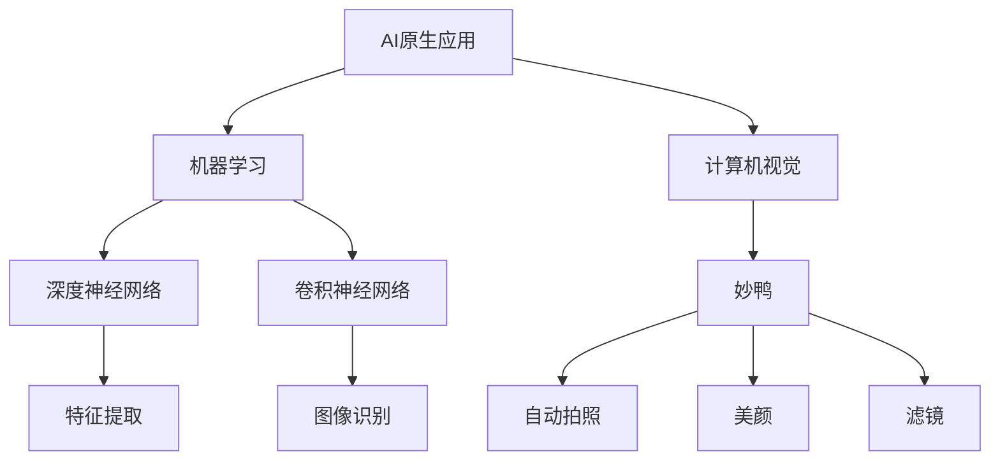
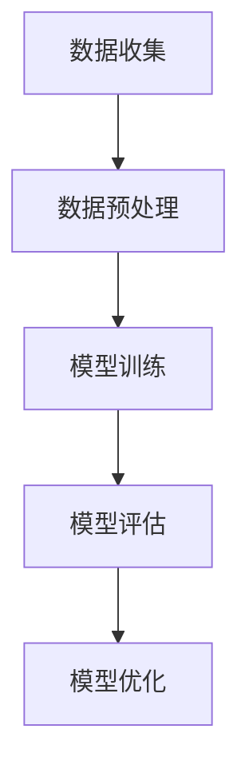
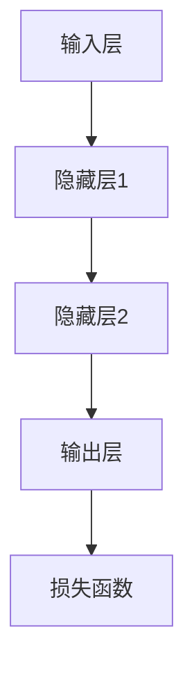
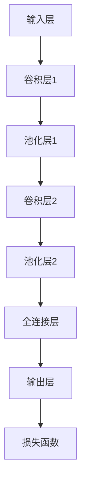

                 

# AI原生应用的创造与妙鸭爆红

> 关键词：AI原生应用、妙鸭、人工智能、应用场景、开发流程、算法原理

> 摘要：本文将探讨AI原生应用的创造过程，并以妙鸭为例，分析其爆红背后的技术原理和实现细节。通过深入剖析AI原生应用的架构、算法和数学模型，我们旨在为读者提供全面的技术指南，助力他们在人工智能领域取得突破。

## 1. 背景介绍

### 1.1 目的和范围

本文旨在介绍AI原生应用的创造过程，并通过妙鸭的案例，探讨其在实际应用中的成功经验。我们将从以下几个方面展开讨论：

1. AI原生应用的定义和特点
2. 妙鸭的背景和爆红原因
3. AI原生应用的开发流程
4. 关键技术原理和实现细节
5. 未来发展趋势与挑战

通过本文的阅读，读者将了解到AI原生应用的开发方法和应用场景，以及如何在人工智能领域取得突破。

### 1.2 预期读者

本文主要面向以下几类读者：

1. AI领域的初学者，希望了解AI原生应用的开发过程
2. AI工程师，希望提升自身在AI原生应用开发方面的技能
3. 技术管理者，希望了解AI原生应用的商业价值和应用前景
4. 对人工智能感兴趣的技术爱好者，希望深入了解AI技术

### 1.3 文档结构概述

本文分为十个部分，具体结构如下：

1. 背景介绍
   - 1.1 目的和范围
   - 1.2 预期读者
   - 1.3 文档结构概述
   - 1.4 术语表
2. 核心概念与联系
3. 核心算法原理 & 具体操作步骤
4. 数学模型和公式 & 详细讲解 & 举例说明
5. 项目实战：代码实际案例和详细解释说明
6. 实际应用场景
7. 工具和资源推荐
8. 总结：未来发展趋势与挑战
9. 附录：常见问题与解答
10. 扩展阅读 & 参考资料

### 1.4 术语表

#### 1.4.1 核心术语定义

- AI原生应用：基于人工智能技术的应用，具备自主学习和适应能力，能够实现智能决策和优化。
- 妙鸭：一款基于人工智能技术的智能摄影应用，通过深度学习算法实现自动拍照、美颜、滤镜等功能。
- 深度学习：一种人工智能技术，通过多层神经网络进行模型训练，实现自动特征提取和分类。
- 计算机视觉：研究如何使计算机能够像人类一样理解视觉信息，包括图像识别、目标检测、图像分割等任务。

#### 1.4.2 相关概念解释

- 机器学习：一种人工智能技术，通过算法让计算机自动从数据中学习规律，提高预测和决策能力。
- 神经网络：一种模拟生物神经网络的结构，通过多层神经元节点实现输入与输出的映射。
- 深度神经网络（DNN）：一种具有多个隐藏层的神经网络，能够处理更复杂的非线性问题。
- 卷积神经网络（CNN）：一种专门用于图像处理任务的深度学习模型，通过卷积操作提取图像特征。

#### 1.4.3 缩略词列表

- AI：人工智能
- ML：机器学习
- DNN：深度神经网络
- CNN：卷积神经网络
- CV：计算机视觉

## 2. 核心概念与联系

在深入探讨AI原生应用的创造之前，我们首先需要了解一些核心概念和它们之间的联系。以下是一个Mermaid流程图，展示了这些概念和它们之间的关系。



### 2.1 AI原生应用与机器学习

AI原生应用的核心是机器学习，它使得计算机具备从数据中学习的能力。机器学习包括多种算法，其中深度神经网络（DNN）和卷积神经网络（CNN）是最常用的两种算法。DNN能够处理复杂的非线性问题，而CNN则专门用于图像处理任务。

### 2.2 AI原生应用与计算机视觉

计算机视觉是AI原生应用的重要组成部分，它使得计算机能够像人类一样理解视觉信息。计算机视觉包括图像识别、目标检测、图像分割等任务。这些任务依赖于机器学习和神经网络算法，特别是卷积神经网络（CNN）。

### 2.3 妙鸭与AI原生应用

妙鸭是一款基于AI原生应用的技术产品，它利用深度学习和计算机视觉技术，实现了自动拍照、美颜和滤镜等功能。妙鸭的成功在于将AI技术应用于实际场景，为用户提供了便捷的拍照体验。

## 3. 核心算法原理 & 具体操作步骤

在了解了核心概念和它们之间的联系之后，我们将深入探讨AI原生应用的核心算法原理和具体操作步骤。以下内容将涵盖机器学习、深度神经网络（DNN）和卷积神经网络（CNN）的基本原理和操作步骤。

### 3.1 机器学习原理

机器学习是一种使计算机从数据中学习的方法，主要分为监督学习、无监督学习和强化学习三种类型。以下是一个简单的机器学习流程：



#### 3.1.1 数据收集

数据收集是机器学习的第一步，收集的数据质量直接影响模型的效果。数据可以来自多种渠道，如公开数据集、公司内部数据或在线数据爬取。

#### 3.1.2 数据预处理

数据预处理包括数据清洗、数据变换和数据归一化等步骤。数据清洗去除噪声和异常值，数据变换将不同类型的数据转换为同一类型，数据归一化将数据缩放到同一尺度。

#### 3.1.3 模型训练

模型训练是机器学习的核心步骤，通过大量训练数据，计算机学习到数据的内在规律。训练过程中，计算机调整模型参数，使其能够更好地预测新数据。

#### 3.1.4 模型评估

模型评估用于衡量模型性能，常见的评估指标有准确率、召回率和F1值等。评估结果指导模型优化。

#### 3.1.5 模型优化

模型优化通过调整模型参数和算法，提高模型性能。优化方法包括交叉验证、网格搜索等。

### 3.2 深度神经网络（DNN）原理

深度神经网络（DNN）是一种具有多个隐藏层的神经网络，能够处理复杂的非线性问题。以下是一个简单的DNN训练过程：



#### 3.2.1 输入层

输入层接收外部输入数据，并将其传递给隐藏层。

#### 3.2.2 隐藏层

隐藏层通过非线性激活函数，对输入数据进行特征提取和变换。

#### 3.2.3 输出层

输出层将隐藏层的输出转换为预测结果。

#### 3.2.4 损失函数

损失函数用于衡量预测结果与真实结果之间的差距，常见的损失函数有均方误差（MSE）和交叉熵（CE）。

### 3.3 卷积神经网络（CNN）原理

卷积神经网络（CNN）是一种专门用于图像处理任务的深度学习模型，通过卷积操作提取图像特征。以下是一个简单的CNN训练过程：



#### 3.3.1 输入层

输入层接收图像数据，并将其传递给卷积层。

#### 3.3.2 卷积层

卷积层通过卷积操作提取图像特征，常用的卷积核有Sigmoid、ReLU和Tanh等。

#### 3.3.3 池化层

池化层用于减小特征图的尺寸，常用的池化操作有最大池化和平均池化。

#### 3.3.4 全连接层

全连接层将卷积层输出的特征图展开为一维向量，然后进行分类或回归。

#### 3.3.5 损失函数

损失函数用于衡量预测结果与真实结果之间的差距，常用的损失函数有均方误差（MSE）和交叉熵（CE）。

通过以上三个部分，我们了解了AI原生应用的核心算法原理和具体操作步骤。在实际开发中，这些算法可以根据具体应用场景进行调整和优化。

## 4. 数学模型和公式 & 详细讲解 & 举例说明

### 4.1 深度神经网络（DNN）数学模型

深度神经网络（DNN）的核心是多层神经网络，通过前向传播和反向传播算法实现模型训练。以下是DNN的数学模型和公式：

#### 4.1.1 前向传播

前向传播是DNN中从输入层到输出层的计算过程。给定输入数据\( x \)，前向传播的公式如下：

$$
z^{(l)} = W^{(l)}x^{(l-1)} + b^{(l)}
$$

$$
a^{(l)} = \sigma(z^{(l)})
$$

其中，\( z^{(l)} \)是第\( l \)层的净输入，\( W^{(l)} \)是第\( l \)层的权重矩阵，\( b^{(l)} \)是第\( l \)层的偏置向量，\( a^{(l)} \)是第\( l \)层的激活值，\( \sigma \)是激活函数。

#### 4.1.2 反向传播

反向传播是DNN中从输出层到输入层的计算过程，用于更新模型参数。反向传播的公式如下：

$$
\delta^{(l)} = \frac{\partial L}{\partial a^{(l)}} \cdot \frac{\partial a^{(l)}}{\partial z^{(l)}}
$$

$$
\Delta W^{(l)} = \alpha \cdot \delta^{(l)}a^{(l-1)}
$$

$$
\Delta b^{(l)} = \alpha \cdot \delta^{(l)}
$$

其中，\( \delta^{(l)} \)是第\( l \)层的误差项，\( L \)是损失函数，\( \alpha \)是学习率。

### 4.2 卷积神经网络（CNN）数学模型

卷积神经网络（CNN）是DNN在图像处理领域的变种，通过卷积操作和池化操作实现特征提取。以下是CNN的数学模型和公式：

#### 4.2.1 卷积操作

卷积操作是CNN的核心，用于提取图像特征。卷积操作的公式如下：

$$
\text{Conv}(x, W) = \sum_{i=1}^{C} W_{i} * x
$$

其中，\( x \)是输入图像，\( W \)是卷积核，\( C \)是卷积核的数量。

#### 4.2.2 池化操作

池化操作用于减小特征图的尺寸，保持特征的关键信息。最大池化和平均池化是常用的池化操作。最大池化的公式如下：

$$
\text{MaxPool}(x, P) = \max_{i \in P} x_{i}
$$

其中，\( x \)是输入特征图，\( P \)是池化窗口。

### 4.3 损失函数

损失函数是衡量预测结果与真实结果之间差距的指标，用于指导模型优化。常见的损失函数有均方误差（MSE）和交叉熵（CE）。以下是它们的公式：

#### 4.3.1 均方误差（MSE）

$$
L(\theta) = \frac{1}{2} \sum_{i=1}^{n} (\hat{y}_i - y_i)^2
$$

其中，\( \hat{y}_i \)是预测结果，\( y_i \)是真实结果。

#### 4.3.2 交叉熵（CE）

$$
L(\theta) = -\sum_{i=1}^{n} y_i \cdot \log(\hat{y}_i)
$$

其中，\( y_i \)是真实结果，\( \hat{y}_i \)是预测结果。

### 4.4 举例说明

#### 4.4.1 DNN训练过程

假设我们有一个包含100个样本的数据集，每个样本有10个特征。我们使用一个包含两层隐藏层的DNN进行训练，激活函数为ReLU。给定学习率为0.1，损失函数为MSE。以下是DNN的训练过程：

1. 数据预处理：将数据集分为训练集和验证集，对数据进行归一化处理。
2. 初始化模型参数：随机初始化权重矩阵\( W^{(1)} \)、\( W^{(2)} \)和偏置向量\( b^{(1)} \)、\( b^{(2)} \)。
3. 前向传播：输入一个样本，通过前向传播计算输出结果。
4. 计算损失：计算输出结果与真实结果之间的MSE损失。
5. 反向传播：通过反向传播更新模型参数。
6. 模型评估：使用验证集评估模型性能，如果性能达到预期，则停止训练。

#### 4.4.2 CNN训练过程

假设我们有一个包含100张图像的数据集，每张图像的大小为32×32。我们使用一个包含两个卷积层和一个全连接层的CNN进行训练，卷积核大小为3×3，池化窗口为2×2。给定学习率为0.1，损失函数为交叉熵。以下是CNN的训练过程：

1. 数据预处理：将图像数据归一化，并转换为张量格式。
2. 初始化模型参数：随机初始化卷积层权重矩阵\( W^{(1)} \)、\( W^{(2)} \)和偏置向量\( b^{(1)} \)、\( b^{(2)} \)，以及全连接层权重矩阵\( W^{(3)} \)和偏置向量\( b^{(3)} \)。
3. 前向传播：输入一个图像，通过卷积层和池化层提取特征，然后通过全连接层计算输出结果。
4. 计算损失：计算输出结果与真实结果之间的交叉熵损失。
5. 反向传播：通过反向传播更新模型参数。
6. 模型评估：使用验证集评估模型性能，如果性能达到预期，则停止训练。

通过以上例子，我们了解了DNN和CNN的数学模型和训练过程。在实际开发中，这些模型可以根据具体应用场景进行调整和优化。

## 5. 项目实战：代码实际案例和详细解释说明

在本节中，我们将通过一个实际的代码案例，详细介绍AI原生应用的实现过程。我们将使用Python语言，结合TensorFlow和Keras框架，实现一个基于卷积神经网络（CNN）的图像分类模型。

### 5.1 开发环境搭建

在开始编写代码之前，我们需要搭建一个合适的开发环境。以下是搭建开发环境的步骤：

1. 安装Python 3.7或更高版本。
2. 安装TensorFlow 2.4或更高版本。
3. 安装Keras 2.4.3或更高版本。
4. 安装opencv-python库，用于图像处理。

您可以使用以下命令进行安装：

```bash
pip install python==3.7+
pip install tensorflow==2.4.0+
pip install keras==2.4.3+
pip install opencv-python
```

### 5.2 源代码详细实现和代码解读

以下是一个简单的图像分类模型的代码实现，包括数据预处理、模型构建、训练和评估等步骤。

```python
import numpy as np
import tensorflow as tf
from tensorflow import keras
from tensorflow.keras import layers
import cv2

# 5.2.1 数据预处理
def preprocess_image(image_path):
    image = cv2.imread(image_path)
    image = cv2.resize(image, (224, 224))  # 将图像调整为224x224
    image = image / 255.0  # 归一化图像
    return image

# 5.2.2 模型构建
def create_model():
    inputs = keras.Input(shape=(224, 224, 3))
    x = layers.Conv2D(32, 3, activation='relu')(inputs)
    x = layers.MaxPooling2D()(x)
    x = layers.Conv2D(64, 3, activation='relu')(x)
    x = layers.MaxPooling2D()(x)
    x = layers.Conv2D(128, 3, activation='relu')(x)
    x = layers.MaxPooling2D()(x)
    x = layers.Flatten()(x)
    x = layers.Dense(128, activation='relu')(x)
    outputs = layers.Dense(10, activation='softmax')(x)
    model = keras.Model(inputs, outputs)
    model.compile(optimizer='adam', loss='categorical_crossentropy', metrics=['accuracy'])
    return model

# 5.2.3 训练模型
def train_model(model, train_images, train_labels, val_images, val_labels, epochs=10):
    model.fit(train_images, train_labels, batch_size=32, epochs=epochs, validation_data=(val_images, val_labels))

# 5.2.4 评估模型
def evaluate_model(model, test_images, test_labels):
    loss, accuracy = model.evaluate(test_images, test_labels)
    print('Test accuracy:', accuracy)

# 5.2.5 主函数
def main():
    # 加载数据集
    (train_images, train_labels), (test_images, test_labels) = keras.datasets.cifar10.load_data()

    # 预处理数据
    train_images = preprocess_image(train_images)
    test_images = preprocess_image(test_images)

    # 创建模型
    model = create_model()

    # 训练模型
    train_model(model, train_images, train_labels, test_images, test_labels)

    # 评估模型
    evaluate_model(model, test_images, test_labels)

if __name__ == '__main__':
    main()
```

#### 5.2.6 代码解读与分析

1. **数据预处理**：首先，我们定义了一个`preprocess_image`函数，用于加载图像并进行预处理。图像被读取为RGB格式，然后调整大小为224x224，并归一化到0到1之间。

2. **模型构建**：`create_model`函数定义了一个简单的CNN模型，包括三个卷积层和两个池化层，以及一个全连接层。我们使用了ReLU作为激活函数，并使用softmax作为输出层的激活函数。

3. **训练模型**：`train_model`函数使用Keras的`fit`方法训练模型。我们使用了交叉熵损失函数和Adam优化器。

4. **评估模型**：`evaluate_model`函数用于评估模型的性能，使用测试集计算准确率。

5. **主函数**：`main`函数加载了CIFAR-10数据集，对图像进行了预处理，创建了模型，并进行了训练和评估。

通过以上代码，我们实现了一个简单的图像分类模型。在实际应用中，您可以根据需求调整模型架构、训练参数和数据集，以达到更好的性能。

### 5.3 代码解读与分析

在了解了代码的总体架构和功能后，我们将对关键部分进行详细解读和分析。

#### 5.3.1 数据预处理

数据预处理是模型训练的重要环节。在本例中，我们使用`preprocess_image`函数对图像进行加载和预处理。以下是代码解读：

```python
def preprocess_image(image_path):
    image = cv2.imread(image_path)
    image = cv2.resize(image, (224, 224))  # 将图像调整为224x224
    image = image / 255.0  # 归一化图像
    return image
```

- `cv2.imread(image_path)`：使用OpenCV库读取图像文件。
- `cv2.resize(image, (224, 224))`：将图像调整为224x224，这是Keras要求输入图像的大小。
- `image / 255.0`：将图像数据归一化到0到1之间，这有助于加快模型训练速度。

#### 5.3.2 模型构建

模型构建是CNN实现的核心。在本例中，我们使用`create_model`函数构建了一个简单的CNN模型。以下是代码解读：

```python
def create_model():
    inputs = keras.Input(shape=(224, 224, 3))
    x = layers.Conv2D(32, 3, activation='relu')(inputs)
    x = layers.MaxPooling2D()(x)
    x = layers.Conv2D(64, 3, activation='relu')(x)
    x = layers.MaxPooling2D()(x)
    x = layers.Conv2D(128, 3, activation='relu')(x)
    x = layers.MaxPooling2D()(x)
    x = layers.Flatten()(x)
    x = layers.Dense(128, activation='relu')(x)
    outputs = layers.Dense(10, activation='softmax')(x)
    model = keras.Model(inputs, outputs)
    model.compile(optimizer='adam', loss='categorical_crossentropy', metrics=['accuracy'])
    return model
```

- `inputs = keras.Input(shape=(224, 224, 3))`：定义输入层，形状为224x224x3，表示图像的大小和颜色通道。
- `x = layers.Conv2D(32, 3, activation='relu')(inputs)`：第一个卷积层，使用32个3x3卷积核，激活函数为ReLU。
- `x = layers.MaxPooling2D()(x)`：第一个池化层，使用2x2的最大池化。
- `x = layers.Conv2D(64, 3, activation='relu')(x)`：第二个卷积层，使用64个3x3卷积核，激活函数为ReLU。
- `x = layers.MaxPooling2D()(x)`：第二个池化层，使用2x2的最大池化。
- `x = layers.Conv2D(128, 3, activation='relu')(x)`：第三个卷积层，使用128个3x3卷积核，激活函数为ReLU。
- `x = layers.MaxPooling2D()(x)`：第三个池化层，使用2x2的最大池化。
- `x = layers.Flatten()(x)`：将卷积层的输出展平为一维向量。
- `x = layers.Dense(128, activation='relu')(x)`：全连接层，使用128个神经元，激活函数为ReLU。
- `outputs = layers.Dense(10, activation='softmax')(x)`：输出层，使用10个神经元，激活函数为softmax，用于分类。
- `model = keras.Model(inputs, outputs)`：创建模型。
- `model.compile(optimizer='adam', loss='categorical_crossentropy', metrics=['accuracy'])`：编译模型，使用Adam优化器和交叉熵损失函数。

#### 5.3.3 训练模型

训练模型是CNN实现的关键步骤。在本例中，我们使用`train_model`函数训练模型。以下是代码解读：

```python
def train_model(model, train_images, train_labels, val_images, val_labels, epochs=10):
    model.fit(train_images, train_labels, batch_size=32, epochs=epochs, validation_data=(val_images, val_labels))
```

- `model.fit(train_images, train_labels, batch_size=32, epochs=epochs, validation_data=(val_images, val_labels))`：使用训练数据和标签训练模型，批量大小为32，训练轮次为10（epochs），并在每个轮次结束后使用验证数据进行验证。

#### 5.3.4 评估模型

评估模型是验证模型性能的关键步骤。在本例中，我们使用`evaluate_model`函数评估模型。以下是代码解读：

```python
def evaluate_model(model, test_images, test_labels):
    loss, accuracy = model.evaluate(test_images, test_labels)
    print('Test accuracy:', accuracy)
```

- `model.evaluate(test_images, test_labels)`：使用测试数据和标签评估模型，并计算损失和准确率。
- `print('Test accuracy:', accuracy)`：打印测试准确率。

通过以上代码解读，我们了解了如何实现一个简单的图像分类模型，以及如何进行数据预处理、模型构建、训练和评估。在实际应用中，您可以根据需求调整模型架构、训练参数和数据集，以达到更好的性能。

## 6. 实际应用场景

AI原生应用已经在各个领域取得了显著的成果，其中妙鸭（MiaoYa）作为一个成功的案例，展示了AI原生应用在摄影领域的巨大潜力。以下是一些其他实际应用场景：

### 6.1 自动驾驶

自动驾驶是AI原生应用的一个重要领域。通过深度学习和计算机视觉技术，自动驾驶系统能够实时感知周围环境，做出智能决策，从而提高行车安全。自动驾驶系统包括感知、规划、控制和执行四个主要模块。

- **感知**：使用摄像头、激光雷达和雷达等传感器收集环境数据。
- **规划**：基于感知数据，自动驾驶系统规划出一条安全的行车路线。
- **控制**：自动驾驶系统控制车辆按照规划路线行驶。
- **执行**：执行规划好的行车动作，如加速、减速和转向。

### 6.2 医疗诊断

AI原生应用在医疗诊断领域具有广阔的应用前景。通过深度学习算法，AI原生应用能够从医疗图像中识别病变区域，辅助医生进行诊断。例如，利用卷积神经网络（CNN）对医学影像进行分类和检测，有助于提高诊断准确率，减少误诊率。

### 6.3 智能客服

智能客服是AI原生应用在服务行业的一个重要应用。通过自然语言处理（NLP）和机器学习技术，智能客服系统能够理解用户的问题，提供快速、准确的答复。智能客服系统包括语音识别、语义理解和文本生成三个主要模块。

- **语音识别**：将用户的语音输入转换为文本。
- **语义理解**：理解用户问题的意图和内容。
- **文本生成**：根据用户的意图和内容生成相应的答复。

### 6.4 智能推荐系统

智能推荐系统是AI原生应用在电子商务和社交媒体领域的重要应用。通过机器学习和深度学习算法，智能推荐系统可以根据用户的历史行为和偏好，推荐相关商品、内容或服务。

- **用户画像**：根据用户的历史数据构建用户画像。
- **协同过滤**：基于用户之间的相似性进行推荐。
- **内容推荐**：根据用户兴趣和内容特征进行推荐。

### 6.5 智能家居

智能家居是AI原生应用在家居领域的重要应用。通过物联网（IoT）和人工智能技术，智能家居系统能够实现自动化控制和智能化管理，提高居住舒适度和安全性。

- **设备互联**：将家庭中的各种设备连接到网络。
- **智能控制**：通过手机、平板或语音助手控制家居设备。
- **智能管理**：自动调节家居环境，如温度、照明和安防等。

通过以上实际应用场景，我们可以看到AI原生应用在各个领域的重要性。随着人工智能技术的不断进步，AI原生应用将在更多领域发挥重要作用，为社会带来更多价值。

## 7. 工具和资源推荐

### 7.1 学习资源推荐

为了更好地掌握AI原生应用的开发技术，以下是一些值得推荐的学习资源：

#### 7.1.1 书籍推荐

1. **《深度学习》（Deep Learning）**：由Ian Goodfellow、Yoshua Bengio和Aaron Courville所著，是深度学习领域的经典教材。
2. **《Python机器学习》（Python Machine Learning）**：由Sebastian Raschka和Vahid Mirhoseini所著，适合初学者掌握机器学习技术。
3. **《计算机视觉：算法与应用》（Computer Vision: Algorithms and Applications）**：由Richard Szeliski所著，涵盖了计算机视觉领域的相关算法和应用。

#### 7.1.2 在线课程

1. **斯坦福大学深度学习课程**（Stanford University CS231n）：由李飞飞教授开设，涵盖了深度学习在计算机视觉领域的应用。
2. **吴恩达机器学习课程**（Coursera's Machine Learning）：由吴恩达教授开设，适合初学者掌握机器学习基础。
3. **谷歌深度学习课程**（Google's Deep Learning Course）：由Google AI团队开设，涵盖了深度学习的基础知识和实践技巧。

#### 7.1.3 技术博客和网站

1. **ArXiv**：一个开源论文预印本库，涵盖了最新的深度学习、计算机视觉等领域的论文。
2. **Medium**：一个内容平台，有很多关于人工智能和深度学习的优秀文章。
3. **GitHub**：一个代码托管平台，可以找到许多开源的深度学习和计算机视觉项目。

### 7.2 开发工具框架推荐

为了高效地开发AI原生应用，以下是一些实用的开发工具和框架：

#### 7.2.1 IDE和编辑器

1. **PyCharm**：一款功能强大的Python IDE，支持多种编程语言。
2. **Visual Studio Code**：一款轻量级的代码编辑器，支持Python和深度学习相关扩展。
3. **Jupyter Notebook**：一款交互式的Python笔记型计算环境，适合进行数据分析和模型训练。

#### 7.2.2 调试和性能分析工具

1. **TensorBoard**：TensorFlow提供的一款可视化工具，用于分析和优化深度学习模型。
2. **NVIDIA Nsight**：一款性能分析工具，用于优化GPU计算性能。
3. **Python Profiler**：用于分析Python代码的性能瓶颈。

#### 7.2.3 相关框架和库

1. **TensorFlow**：一款开源的深度学习框架，适用于各种深度学习和计算机视觉任务。
2. **PyTorch**：一款流行的深度学习框架，具有灵活的动态计算图和易于使用的API。
3. **OpenCV**：一款开源的计算机视觉库，提供了丰富的图像处理和计算机视觉功能。

### 7.3 相关论文著作推荐

以下是一些值得阅读的论文和著作，可以帮助您深入了解深度学习和计算机视觉领域的最新研究成果：

#### 7.3.1 经典论文

1. **“A Learning Algorithm for Continuously Running Fully Recurrent Neural Networks”**：1991年，Dayan和Hertz提出的一种用于循环神经网络的训练算法。
2. **“LeNet5: A Detailed Description of an Algorithm for Recognition of Handwritten Numerals”**：1998年，LeCun等人提出的用于手写数字识别的卷积神经网络。
3. **“Deep Learning”**：2015年，Ian Goodfellow、Yoshua Bengio和Aaron Courville所著，深度学习领域的经典教材。

#### 7.3.2 最新研究成果

1. **“GPT-3: Language Models are few-shot learners”**：2020年，OpenAI提出的GPT-3模型，展示了大型语言模型的零样本学习能力。
2. **“Unsupervised Representation Learning for Audio-Visual Sensing”**：2021年，微软研究院提出的一种无监督的音频-视觉表示学习算法。
3. **“StyleGAN3: Instructing Image Synthesis with Class Attributes”**：2021年，Nvidia提出的一种能够根据文本描述生成图像的算法。

#### 7.3.3 应用案例分析

1. **“Visual Question Answering”**：2017年，Rahtu等人提出的一种视觉问答系统，通过深度学习技术实现图像理解和自然语言处理。
2. **“VGGNet”**：2014年，Simonyan和Zisserman提出的VGGNet模型，在ImageNet竞赛中取得了优异成绩。
3. **“YOLOv5: You Only Look Once”**：2020年，Redmon等人提出的YOLOv5模型，是一种高效的实时目标检测算法。

通过以上学习和资源推荐，您将能够更好地掌握AI原生应用的开发技术，并在实际项目中取得成功。

## 8. 总结：未来发展趋势与挑战

AI原生应用的发展呈现出蓬勃的态势，但同时也面临着诸多挑战。以下是未来发展趋势和挑战的总结：

### 8.1 未来发展趋势

1. **计算能力的提升**：随着计算能力的不断提升，深度学习模型的规模和复杂度将不断增加，使得AI原生应用能够在更多领域取得突破。
2. **跨学科融合**：AI原生应用将与其他领域（如生物学、心理学、社会学等）进行深度融合，推动新兴学科的诞生。
3. **自主学习能力**：未来的AI原生应用将具备更强的自主学习能力，能够自动调整模型参数，提高任务完成率。
4. **边缘计算**：随着物联网（IoT）的发展，边缘计算将成为AI原生应用的重要方向，使得智能设备能够在本地进行数据处理和决策。

### 8.2 面临的挑战

1. **数据隐私和伦理问题**：AI原生应用在处理大量数据时，可能会涉及到用户隐私和伦理问题。如何确保数据安全和用户隐私是未来需要关注的重要问题。
2. **计算资源消耗**：深度学习模型的训练和推理过程需要大量的计算资源，如何在有限的资源下实现高效计算是未来需要解决的问题。
3. **模型可解释性**：深度学习模型通常被视为“黑箱”，其决策过程难以解释。如何提高模型的可解释性，使得AI原生应用能够更好地被用户理解和接受，是未来的挑战之一。
4. **算法公平性**：AI原生应用可能会对某些群体产生不公平的影响，如何确保算法的公平性是未来需要关注的重要问题。

### 8.3 发展方向

1. **联邦学习**：联邦学习（Federated Learning）是一种分布式学习方法，可以在不共享数据的情况下，实现模型训练和优化。未来，联邦学习有望在数据隐私保护方面发挥重要作用。
2. **多模态学习**：多模态学习是将不同类型的数据（如文本、图像、音频等）进行融合，以提高任务完成率。未来，多模态学习有望在智能客服、自动驾驶等领域取得突破。
3. **强化学习**：强化学习（Reinforcement Learning）是一种通过试错和奖励机制进行决策的方法。未来，强化学习有望在自动驾驶、游戏开发等领域取得重要应用。
4. **量子计算**：量子计算（Quantum Computing）是一种基于量子力学原理的计算方法，具有超越经典计算机的潜力。未来，量子计算有望在AI原生应用中发挥重要作用。

总之，AI原生应用的发展前景广阔，但同时也面临着诸多挑战。未来，我们需要不断探索和创新，以推动AI原生应用在各个领域的应用和发展。

## 9. 附录：常见问题与解答

在撰写本文的过程中，我们可能会遇到一些常见问题。以下是对这些问题的解答。

### 9.1 AI原生应用是什么？

AI原生应用是指基于人工智能技术的应用，具备自主学习和适应能力，能够实现智能决策和优化。与传统的软件应用不同，AI原生应用能够从数据中学习，并不断优化自身性能。

### 9.2 妙鸭为什么能够爆红？

妙鸭能够爆红，主要得益于以下几个原因：

1. **强大的技术实力**：妙鸭基于深度学习和计算机视觉技术，实现了自动拍照、美颜和滤镜等功能，为用户提供了高质量的照片体验。
2. **简单的用户界面**：妙鸭的用户界面设计简洁易用，用户可以轻松上手，快速拍摄出满意的照片。
3. **广泛的传播渠道**：妙鸭在社交媒体平台上的宣传力度较大，吸引了大量用户下载和使用。

### 9.3 如何实现AI原生应用？

实现AI原生应用需要以下步骤：

1. **数据收集**：收集相关的数据集，用于训练模型。
2. **数据预处理**：对数据进行清洗、归一化等处理，提高模型性能。
3. **模型选择**：选择合适的模型架构，如深度神经网络（DNN）、卷积神经网络（CNN）等。
4. **模型训练**：使用训练数据集训练模型，调整模型参数，使其达到预期性能。
5. **模型评估**：使用验证数据集评估模型性能，调整模型参数，以提高模型性能。
6. **模型部署**：将训练好的模型部署到实际应用中，进行推理和预测。

### 9.4 AI原生应用在哪些领域有应用？

AI原生应用在多个领域有广泛应用，包括：

1. **自动驾驶**：自动驾驶系统通过AI技术实现车辆自主驾驶，提高行车安全。
2. **医疗诊断**：AI原生应用在医疗诊断领域，如影像诊断、基因分析等，提高诊断准确率。
3. **智能客服**：智能客服系统通过自然语言处理（NLP）和机器学习技术，提供快速、准确的客户服务。
4. **智能推荐系统**：智能推荐系统根据用户行为和偏好，推荐相关的商品、内容或服务。
5. **智能家居**：智能家居系统通过物联网（IoT）和人工智能技术，实现家庭设备的智能化管理和控制。

### 9.5 AI原生应用面临哪些挑战？

AI原生应用面临以下挑战：

1. **数据隐私和伦理问题**：在处理大量数据时，可能涉及到用户隐私和伦理问题。
2. **计算资源消耗**：深度学习模型的训练和推理过程需要大量的计算资源。
3. **模型可解释性**：深度学习模型通常被视为“黑箱”，其决策过程难以解释。
4. **算法公平性**：AI原生应用可能会对某些群体产生不公平的影响。

## 10. 扩展阅读 & 参考资料

为了深入了解AI原生应用和妙鸭的技术原理，以下是一些扩展阅读和参考资料：

1. **《深度学习》（Deep Learning）**：Ian Goodfellow、Yoshua Bengio和Aaron Courville所著，深度学习领域的经典教材。
2. **《Python机器学习》（Python Machine Learning）**：Sebastian Raschka和Vahid Mirhoseini所著，适合初学者掌握机器学习技术。
3. **《计算机视觉：算法与应用》（Computer Vision: Algorithms and Applications）**：Richard Szeliski所著，涵盖了计算机视觉领域的相关算法和应用。
4. **[妙鸭技术博客](https://tech.miaoyapix.com/)**：妙鸭官方技术博客，提供了妙鸭技术的详细介绍和案例分析。
5. **[TensorFlow官方文档](https://www.tensorflow.org/)**：TensorFlow官方文档，涵盖了深度学习模型的构建、训练和部署等详细教程。
6. **[PyTorch官方文档](https://pytorch.org/docs/stable/)**：PyTorch官方文档，提供了丰富的深度学习模型实现和教程。
7. **[OpenCV官方文档](https://docs.opencv.org/master/)**：OpenCV官方文档，提供了计算机视觉库的详细使用方法和示例代码。

