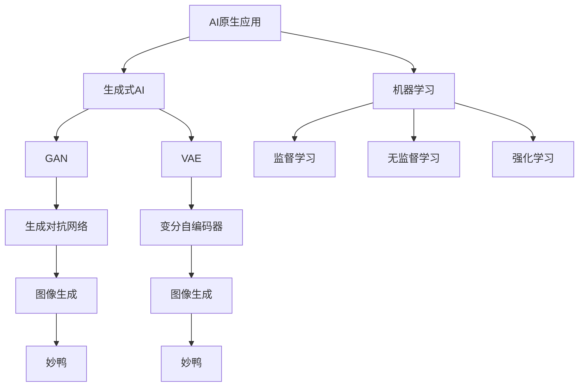

                 


# AI原生应用的创造与妙鸭爆红

> 关键词：AI原生应用、妙鸭、生成式AI、开发流程、应用场景、挑战与机遇

> 摘要：本文旨在探讨AI原生应用的创造过程，特别是妙鸭爆红的现象。我们将从背景介绍、核心概念、算法原理、数学模型、实际应用、工具推荐和未来发展趋势等方面，深入分析AI原生应用的发展与挑战，为读者提供全面的技术视角。

## 1. 背景介绍

### 1.1 目的和范围

本文的目标是帮助读者了解AI原生应用的概念、创造过程以及妙鸭爆红的现象。我们将探讨以下几个方面：

1. AI原生应用的定义与核心概念。
2. AI原生应用的开发流程。
3. 妙鸭的案例解析。
4. AI原生应用的数学模型和算法原理。
5. AI原生应用的实际应用场景。
6. 开发AI原生应用所需工具和资源。
7. AI原生应用的未来发展趋势与挑战。

### 1.2 预期读者

本文适用于对AI和机器学习有一定了解的开发者、技术爱好者以及对AI原生应用感兴趣的企业和研究者。无论您是初学者还是资深从业者，本文都将为您提供有价值的见解和实用信息。

### 1.3 文档结构概述

本文结构如下：

1. 引言：介绍AI原生应用与妙鸭现象。
2. 核心概念与联系：分析AI原生应用的核心概念原理和架构。
3. 核心算法原理 & 具体操作步骤：详细阐述AI原生应用的核心算法。
4. 数学模型和公式 & 详细讲解 & 举例说明：解释数学模型及其应用。
5. 项目实战：代码实际案例和详细解释说明。
6. 实际应用场景：分析AI原生应用在不同领域的应用。
7. 工具和资源推荐：推荐学习资源、开发工具和框架。
8. 总结：未来发展趋势与挑战。
9. 附录：常见问题与解答。
10. 扩展阅读 & 参考资料：提供进一步学习的资源。

### 1.4 术语表

#### 1.4.1 核心术语定义

- AI原生应用：在应用开发过程中，将人工智能（AI）作为核心组件，使得应用具有智能化特性的软件系统。
- 妙鸭：一个利用生成式AI技术制作食物图片的AI应用，迅速在社交网络上爆红。
- 生成式AI：一种能够生成新数据的人工智能技术，包括生成对抗网络（GANs）、变分自编码器（VAEs）等。

#### 1.4.2 相关概念解释

- 生成对抗网络（GAN）：一种由生成器和判别器组成的神经网络结构，用于生成逼真的数据。
- 变分自编码器（VAE）：一种能够生成数据的人工智能模型，通过优化概率分布来实现。

#### 1.4.3 缩略词列表

- GAN：生成对抗网络（Generative Adversarial Network）
- VAE：变分自编码器（Variational Autoencoder）
- AI：人工智能（Artificial Intelligence）

## 2. 核心概念与联系

在探讨AI原生应用之前，我们需要明确一些核心概念和它们之间的联系。以下是一个简单的Mermaid流程图，用于展示这些概念及其相互关系。



### 2.1 AI原生应用

AI原生应用是指在应用开发过程中，将人工智能（AI）作为核心组件，使得应用具有智能化特性的软件系统。这种应用不同于传统应用，它们不仅仅依靠用户输入和预先定义的规则，而是通过机器学习算法，从数据中自动学习和优化。

### 2.2 生成式AI

生成式AI是一种能够生成新数据的人工智能技术，包括生成对抗网络（GANs）和变分自编码器（VAEs）。生成式AI的核心思想是通过学习数据分布，生成新的、类似的数据。

### 2.3 机器学习

机器学习是使计算机系统能够从数据中学习并作出决策或预测的方法。机器学习可以分为监督学习、无监督学习和强化学习。监督学习使用标记数据来训练模型，无监督学习不使用标记数据，仅从数据中发现模式，强化学习则通过奖励机制来训练模型。

### 2.4 生成对抗网络（GAN）

生成对抗网络（GAN）是一种由生成器和判别器组成的神经网络结构。生成器尝试生成与真实数据相似的数据，而判别器则判断生成数据与真实数据的相似程度。通过这种对抗过程，生成器不断优化其生成的数据。

### 2.5 变分自编码器（VAE）

变分自编码器（VAE）是一种能够生成数据的人工智能模型，通过优化概率分布来实现。VAE的核心思想是将输入数据映射到一个潜在空间，然后在潜在空间中生成新的数据。

### 2.6 妙鸭

妙鸭是一个利用生成式AI技术制作食物图片的AI应用。它通过生成对抗网络（GAN）或变分自编码器（VAE）从大量食物图片中学习，生成逼真的新食物图片。妙鸭的爆红证明了AI原生应用的巨大潜力和吸引力。

## 3. 核心算法原理 & 具体操作步骤

### 3.1 生成对抗网络（GAN）

生成对抗网络（GAN）是一种强大的图像生成技术，其核心思想是通过生成器和判别器之间的对抗过程来学习数据分布。

#### 3.1.1 生成器（Generator）

生成器的目标是生成看起来真实的数据。在图像生成任务中，生成器通常是一个神经网络，它接收随机噪声作为输入，并生成图像。

伪代码：

```python
def generator(z):
    # 输入：噪声向量 z
    # 输出：生成的图像 image
    # 前向传播过程
    hidden = linear(z, hidden_size)
    image = tanh(linear(hidden, image_size))
    return image
```

#### 3.1.2 判别器（Discriminator）

判别器的目标是区分生成器生成的图像和真实图像。判别器也是一个神经网络，它接收图像作为输入，并输出一个概率值，表示图像是真实图像的概率。

伪代码：

```python
def discriminator(image):
    # 输入：图像 image
    # 输出：概率值 probability
    # 前向传播过程
    hidden = linear(image, hidden_size)
    probability = sigmoid(linear(hidden, 1))
    return probability
```

#### 3.1.3 损失函数

GAN的训练过程涉及两个主要损失函数：生成器损失和判别器损失。

- 生成器损失：表示生成器生成图像的质量，通常使用判别器对生成图像的概率值来衡量。
  ```python
  generator_loss = -E[log(D(G(z)))]  # G(z)为生成器的输出，D为判别器
  ```

- 判别器损失：表示判别器区分真实图像和生成图像的能力，通常使用判别器对真实图像和生成图像的概率值来衡量。
  ```python
  discriminator_loss = -E[log(D(x)) + log(1 - D(G(z)))]  # x为真实图像，G(z)为生成器的输出
  ```

#### 3.1.4 训练过程

GAN的训练过程是一个交替训练的过程，即先训练生成器，然后训练判别器。

1. 初始化生成器和判别器的参数。
2. 对生成器进行优化，使其生成的图像更逼真。
3. 对判别器进行优化，使其能更准确地判断图像是真实图像还是生成图像。
4. 重复步骤2和3，直到生成器生成的图像足够逼真。

### 3.2 变分自编码器（VAE）

变分自编码器（VAE）是一种能够生成数据的人工智能模型，通过优化概率分布来实现。

#### 3.2.1 潜在空间编码

VAE通过编码器将输入数据映射到一个潜在空间中的表示，这个表示是数据分布的概率参数。

伪代码：

```python
def encoder(x):
    # 输入：输入数据 x
    # 输出：潜在空间中的表示 z
    # 前向传播过程
    hidden = tanh(linear(x, hidden_size))
    z_mean = linear(hidden, latent_size)
    z_log_var = linear(hidden, latent_size)
    return z_mean, z_log_var
```

#### 3.2.2 潜在空间解码

VAE通过解码器从潜在空间中的表示生成新数据。

伪代码：

```python
def decoder(z):
    # 输入：潜在空间中的表示 z
    # 输出：生成的数据 x
    # 前向传播过程
    hidden = tanh(linear(z, hidden_size))
    x = sigmoid(linear(hidden, output_size))
    return x
```

#### 3.2.3 损失函数

VAE的训练过程涉及一个损失函数，称为重建损失，它衡量生成数据与原始数据之间的相似度。

伪代码：

```python
reconstruction_loss = -E[log(p(x|z))]  # p(x|z)为给定潜在空间中的表示 z，生成数据 x 的概率
```

#### 3.2.4 训练过程

VAE的训练过程如下：

1. 初始化编码器和解码器的参数。
2. 对编码器和解码器进行优化，使其生成的数据更接近原始数据。
3. 重复步骤2，直到编码器和解码器生成的数据足够逼真。

## 4. 数学模型和公式 & 详细讲解 & 举例说明

### 4.1 生成对抗网络（GAN）的数学模型

生成对抗网络（GAN）的核心在于生成器和判别器的对抗训练。以下是其主要数学模型：

#### 4.1.1 判别器损失函数

判别器损失函数通常采用二元交叉熵（Binary Cross-Entropy）损失：

$$
L_{D} = -[\log(D(x)) + \log(1 - D(G(z)))]
$$

其中，$D(x)$ 表示判别器对真实数据的概率估计，$D(G(z))$ 表示判别器对生成器生成数据的概率估计。

#### 4.1.2 生成器损失函数

生成器损失函数通常采用二元交叉熵（Binary Cross-Entropy）损失：

$$
L_{G} = -\log(D(G(z))}
$$

其中，$G(z)$ 表示生成器生成的数据。

#### 4.1.3 总损失函数

总损失函数是生成器和判别器损失函数的加权平均：

$$
L_{total} = \alpha L_{D} + (1 - \alpha) L_{G}
$$

其中，$\alpha$ 是权重系数。

### 4.2 变分自编码器（VAE）的数学模型

变分自编码器（VAE）的核心在于潜在空间编码和解码过程。以下是其主要数学模型：

#### 4.2.1 编码过程

编码过程涉及潜在空间中的表示 $z$，其概率分布由 $z_{mean}$ 和 $z_{log_var}$ 描述：

$$
z = \mu + \sigma \odot \epsilon
$$

其中，$\mu = z_{mean}$，$\sigma = \exp(z_{log_var} / 2)$，$\epsilon$ 是均值为0、方差为1的高斯噪声。

#### 4.2.2 解码过程

解码过程是将潜在空间中的表示 $z$ 还原为输入数据 $x$：

$$
x = \sigma(x|\mu) = \sigma(\sigma^{-1}(x) + \mu)
$$

其中，$\sigma(x|\mu)$ 是逻辑sigmoid函数。

#### 4.2.3 损失函数

VAE的损失函数是重建损失，它是输入数据 $x$ 与生成数据 $x'$ 之间的均方误差（MSE）：

$$
L_{reconstruction} = \frac{1}{N}\sum_{i=1}^{N} \frac{1}{2} \|x - x'\|^2
$$

### 4.3 举例说明

#### 4.3.1 生成对抗网络（GAN）的举例

假设我们有1000个样本的训练集，每个样本是一个28x28的灰度图像。我们使用一个生成器和判别器来训练GAN。

1. 初始化生成器和判别器的参数。
2. 对于每个训练样本 $x$，生成一个随机噪声向量 $z$。
3. 生成器生成图像 $G(z)$。
4. 判别器对真实图像 $x$ 和生成图像 $G(z)$ 进行判断，计算损失函数。
5. 使用梯度下降优化生成器和判别器的参数。
6. 重复步骤2-5，直到生成器生成的图像足够逼真。

#### 4.3.2 变分自编码器（VAE）的举例

假设我们有1000个样本的训练集，每个样本是一个32x32的彩色图像。

1. 初始化编码器和解码器的参数。
2. 对于每个训练样本 $x$，计算其潜在空间中的表示 $z$。
3. 使用解码器生成图像 $x'$。
4. 计算重建损失，并使用梯度下降优化编码器和解码器的参数。
5. 重复步骤2-4，直到解码器生成的图像足够逼真。

## 5. 项目实战：代码实际案例和详细解释说明

在本节中，我们将通过一个实际项目来展示如何开发一个AI原生应用。我们将使用生成对抗网络（GAN）来生成逼真的食物图片。以下是项目的开发流程：

### 5.1 开发环境搭建

1. 安装Python和TensorFlow库。
2. 准备训练数据集：下载一个包含大量食物图片的数据集，如CIFAR-10或Food-101。

### 5.2 源代码详细实现和代码解读

以下是一个简单的GAN实现示例，用于生成食物图片：

```python
import tensorflow as tf
from tensorflow.keras.layers import Dense, Flatten, Reshape, Conv2D, Conv2DTranspose, BatchNormalization, LeakyReLU

# 生成器
def generator(z, latent_dim):
    model = tf.keras.Sequential([
        Dense(128 * 7 * 7, input_dim=latent_dim),
        LeakyReLU(),
        BatchNormalization(),
        Reshape((7, 7, 128)),
        
        Conv2DTranspose(128, 5, strides=2, padding='same'),
        LeakyReLU(),
        BatchNormalization(),
        
        Conv2DTranspose(128, 5, strides=2, padding='same'),
        LeakyReLU(),
        BatchNormalization(),
        
        Conv2D(3, 7, activation='tanh', padding='same')
    ])
    
    return model(z)

# 判别器
def discriminator(x, discriminant_dim):
    model = tf.keras.Sequential([
        Conv2D(128, 3, strides=2, padding='same', input_shape=[28, 28, 1]),
        LeakyReLU(),
        BatchNormalization(),
        
        Conv2D(128, 3, strides=2, padding='same'),
        LeakyReLU(),
        BatchNormalization(),
        
        Flatten(),
        Dense(discriminant_dim),
        LeakyReLU(),
        Dense(1, activation='sigmoid')
    ])
    
    return model(x)

# GAN模型
def GAN(generator, discriminator):
    z = tf.keras.layers.Input(shape=(latent_dim,))
    img = generator(z)
    valid = discriminator(img)
    img_input = tf.keras.layers.Input(shape=[28, 28, 1])
    valid_real = discriminator(img_input)
    
    model = tf.keras.Model([z, img_input], [img, valid, valid_real])
    return model

# 损失函数
def loss_function(true, pred):
    return -tf.reduce_mean(tf.log(pred + 1e-9))

# 模型编译
generator.compile(optimizer=tf.keras.optimizers.Adam(0.0002), loss='binary_crossentropy')
discriminator.compile(optimizer=tf.keras.optimizers.Adam(0.0002), loss='binary_crossentropy')

# 训练GAN
for epoch in range(num_epochs):
    for i in range(num_batches):
        # 从数据集中随机抽取真实图像
        real_images = data_loader.load_batch(batch_size)
        # 生成随机噪声
        noise = np.random.normal(size=[batch_size, latent_dim])
        # 生成假图像
        fake_images = generator.predict(noise)
        
        # 训练判别器
        d_loss_real = loss_function(tf.ones_like(valid_real_real), discriminator.train_on_batch(real_images, tf.ones_like(valid_real_real)))
        d_loss_fake = loss_function(tf.zeros_like(valid_fake), discriminator.train_on_batch(fake_images, tf.zeros_like(valid_fake)))
        d_loss = 0.5 * np.add(d_loss_real, d_loss_fake)
        
        # 训练生成器
        g_loss = loss_function(tf.zeros_like(valid_fake), generator.train_on_batch(noise, tf.ones_like(valid_fake)))
        
        # 打印训练进度
        print(f"{epoch}/{num_epochs} epoch, D loss: {d_loss}, G loss: {g_loss}")
```

### 5.3 代码解读与分析

上述代码实现了一个简单的GAN模型，用于生成食物图片。以下是代码的关键部分及其解读：

- **生成器（Generator）**：生成器是一个深度神经网络，它将随机噪声向量映射为逼真的图像。生成器使用一系列的卷积层和转置卷积层来实现，其中每个卷积层后跟一个LeakyReLU激活函数和BatchNormalization层。
  
- **判别器（Discriminator）**：判别器也是一个深度神经网络，它用于区分真实图像和生成图像。判别器使用一系列的卷积层和全连接层来实现，其中每个卷积层后跟一个LeakyReLU激活函数和BatchNormalization层。

- **GAN模型（GAN）**：GAN模型结合了生成器和判别器，并定义了模型的输入和输出。生成器的输入是随机噪声向量，输出是生成的图像；判别器的输入是真实图像和生成图像，输出是概率值，表示图像是真实图像的概率。

- **损失函数（loss_function）**：损失函数用于计算生成器和判别器的损失。生成器的损失函数是二进制交叉熵（Binary Cross-Entropy），判别器的损失函数也是二进制交叉熵。

- **模型编译（模型编译）**：编译模型时，我们定义了生成器和判别器的优化器和学习率，以及损失函数。

- **训练GAN（训练GAN）**：训练GAN的过程包括两个步骤：训练判别器和训练生成器。首先，我们从数据集中随机抽取真实图像和生成随机噪声；然后，使用训练好的判别器分别训练判别器和生成器。训练过程中，我们打印训练进度，以便了解训练过程。

通过上述代码，我们可以实现一个简单的GAN模型，并使用它来生成逼真的食物图片。

## 6. 实际应用场景

AI原生应用在各个领域都有广泛的应用，以下是一些典型的实际应用场景：

### 6.1 虚拟现实与增强现实

AI原生应用可以用于虚拟现实（VR）和增强现实（AR）中，为用户提供逼真的交互体验。例如，生成式AI可以创建虚拟角色和场景，使虚拟世界更加真实和引人入胜。

### 6.2 虚拟试衣与时尚设计

生成式AI可以帮助用户在虚拟环境中试穿衣物，提供个性化的时尚建议。此外，时尚设计师可以使用AI原生应用来生成新的设计灵感，缩短设计周期。

### 6.3 医疗影像诊断

AI原生应用在医疗领域具有巨大的潜力，特别是在医疗影像诊断方面。生成式AI可以生成与实际病例相似的数据集，帮助医生进行疾病预测和诊断。

### 6.4 金融服务

在金融领域，AI原生应用可以用于风险评估、投资组合优化和个性化金融建议。例如，生成式AI可以生成新的金融数据集，帮助分析师进行市场预测。

### 6.5 智能家居与物联网

AI原生应用可以用于智能家居和物联网（IoT）设备中，为用户提供个性化的服务和智能化的家居体验。例如，生成式AI可以生成个性化的家庭场景，并根据用户行为进行优化。

### 6.6 娱乐与游戏

AI原生应用在娱乐和游戏领域具有广泛的应用，包括虚拟角色生成、场景设计和个性化游戏体验。生成式AI可以帮助开发者快速创建丰富多彩的游戏内容。

### 6.7 教育与培训

AI原生应用可以用于教育领域，为用户提供个性化的学习资源和教学方案。例如，生成式AI可以生成与实际课程相似的数据集，帮助教师进行教学设计和学生评估。

通过这些实际应用场景，我们可以看到AI原生应用在各个领域的巨大潜力。随着技术的不断进步，AI原生应用将在更多领域发挥重要作用。

## 7. 工具和资源推荐

### 7.1 学习资源推荐

#### 7.1.1 书籍推荐

1. 《深度学习》（Deep Learning） - Ian Goodfellow、Yoshua Bengio、Aaron Courville
2. 《生成对抗网络：理论、算法与应用》（Generative Adversarial Networks: Theory, Algorithms and Applications） - Ziwei Ji、Xiaowei Zhou、Xiang Wang
3. 《人工智能：一种现代方法》（Artificial Intelligence: A Modern Approach） - Stuart J. Russell、Peter Norvig

#### 7.1.2 在线课程

1. Coursera上的“深度学习”（Deep Learning）课程
2. Udacity上的“生成对抗网络”（Generative Adversarial Networks）课程
3. edX上的“人工智能基础”（Foundations of Artificial Intelligence）课程

#### 7.1.3 技术博客和网站

1.Towards Data Science
2. Medium上的“深度学习和机器学习”专栏
3. AI算法工程师博客（AI Algorithm Engineer）

### 7.2 开发工具框架推荐

#### 7.2.1 IDE和编辑器

1. PyCharm
2. Visual Studio Code
3. Jupyter Notebook

#### 7.2.2 调试和性能分析工具

1. TensorBoard
2. PyTorch Profiler
3. NVIDIA Nsight

#### 7.2.3 相关框架和库

1. TensorFlow
2. PyTorch
3. Keras

### 7.3 相关论文著作推荐

#### 7.3.1 经典论文

1. Ian Goodfellow et al. (2014). "Generative Adversarial Networks."
2. Yann LeCun et al. (2015). "Deep Learning."
3. David E. Cohn, Zoubin Ghahramani, and Michael I. Jordan (1995). "的概率图模型学习."

#### 7.3.2 最新研究成果

1. NeurIPS、ICML、ICLR等顶级会议的最新论文
2. arXiv上的最新研究论文

#### 7.3.3 应用案例分析

1. 《生成对抗网络在图像生成中的应用》（Generative Adversarial Networks for Image Generation） - Alexey Dosovitskiy et al. (2015)
2. 《生成对抗网络在文本生成中的应用》（Generative Adversarial Networks for Text Generation） - Alexander M. Mithun et al. (2016)

这些工具和资源将为开发者提供全面的技术支持和学习途径，帮助他们在AI原生应用的开发过程中取得成功。

## 8. 总结：未来发展趋势与挑战

AI原生应用的发展趋势是显而易见的。随着生成式AI技术的不断进步，AI原生应用将在更多领域得到广泛应用。未来，我们可以期待以下几个发展趋势：

1. **更逼真的图像和视频生成**：随着算法的优化和计算能力的提升，生成式AI将能够生成更逼真的图像和视频，为虚拟现实、增强现实和娱乐等领域带来更多创新。

2. **跨模态生成**：生成式AI将能够同时处理多种数据类型，如文本、图像、音频等，实现跨模态生成，为多媒体应用提供更丰富的内容。

3. **自动化应用开发**：AI原生应用将能够自动化地开发新的应用程序，通过学习和优化现有应用，提高开发效率和用户体验。

4. **个性化服务**：生成式AI将能够根据用户的行为和偏好，生成个性化的内容和推荐，为用户提供更定制化的服务。

然而，AI原生应用的发展也面临一些挑战：

1. **数据隐私和安全**：生成式AI在生成数据时，可能会暴露用户隐私，因此如何确保数据隐私和安全是一个重要挑战。

2. **伦理和法律问题**：生成式AI生成的图像和视频可能涉及伦理和法律问题，如版权侵犯、虚假信息传播等，需要制定相应的法律法规来规范。

3. **计算资源消耗**：生成式AI需要大量的计算资源，特别是在训练过程中，如何优化算法以降低计算成本是一个挑战。

4. **算法透明性和可解释性**：生成式AI的决策过程通常是非常复杂的，如何提高算法的透明性和可解释性，以便用户理解和使用，是一个重要问题。

总之，AI原生应用的发展前景广阔，但也面临诸多挑战。只有通过技术创新和规范化管理，才能实现AI原生应用的最佳效果。

## 9. 附录：常见问题与解答

### 9.1 问题1：生成对抗网络（GAN）如何训练？

**解答**：生成对抗网络（GAN）的训练过程涉及两个主要步骤：训练判别器和训练生成器。首先，随机生成噪声向量 $z$，使用生成器生成图像 $G(z)$。然后，使用真实图像 $x$ 和生成图像 $G(z)$ 分别训练判别器。判别器的目标是最大化判别损失函数，生成器的目标是最小化生成损失函数。通过交替训练判别器和生成器，最终实现生成逼真图像的目标。

### 9.2 问题2：变分自编码器（VAE）如何生成数据？

**解答**：变分自编码器（VAE）通过编码器将输入数据映射到一个潜在空间中的表示 $z$，然后通过解码器从潜在空间中的表示生成新数据。具体来说，编码器计算输入数据的均值和方差，将这两个值作为潜在空间中的表示 $z$。解码器使用潜在空间中的表示 $z$ 生成新数据。VAE通过优化重建损失函数来训练编码器和解码器，使其生成的数据更接近原始数据。

### 9.3 问题3：GAN和VAE有哪些区别？

**解答**：GAN（生成对抗网络）和VAE（变分自编码器）都是生成式AI模型，但它们的训练过程和目标不同。GAN由生成器和判别器组成，通过对抗过程训练，生成器试图生成逼真的图像，而判别器试图区分真实图像和生成图像。GAN的目标是最大化判别器的损失函数。VAE由编码器和解码器组成，通过优化潜在空间中的表示来训练，编码器将输入数据映射到潜在空间中的表示，解码器从潜在空间中的表示生成新数据。VAE的目标是最小化重建损失函数。

### 9.4 问题4：如何确保GAN生成图像的质量？

**解答**：确保GAN生成图像的质量可以通过以下方法实现：

1. **增加训练数据**：使用更多的训练数据可以提高生成图像的质量。
2. **调整超参数**：通过调整生成器和判别器的学习率、批量大小等超参数，可以优化GAN的训练过程。
3. **使用更复杂的网络结构**：增加生成器和判别器的层数和神经元数量可以提高模型的生成能力。
4. **使用预训练模型**：使用预训练的生成器和判别器可以减少训练时间，并提高生成图像的质量。

## 10. 扩展阅读 & 参考资料

### 10.1 书籍

1. Ian Goodfellow、Yoshua Bengio、Aaron Courville. 《深度学习》. 2016.
2. Ziwei Ji、Xiaowei Zhou、Xiang Wang. 《生成对抗网络：理论、算法与应用》. 2018.
3. Stuart J. Russell、Peter Norvig. 《人工智能：一种现代方法》. 2016.

### 10.2 论文

1. Ian Goodfellow et al. (2014). "Generative Adversarial Networks." NeurIPS.
2. Yann LeCun et al. (2015). "Deep Learning." JMLR.
3. David E. Cohn, Zoubin Ghahramani, and Michael I. Jordan (1995). "的概率图模型学习." Machine Learning.

### 10.3 网络资源

1. [TensorFlow官方文档](https://www.tensorflow.org/)
2. [PyTorch官方文档](https://pytorch.org/)
3. [Towards Data Science](https://towardsdatascience.com/)

### 10.4 技术博客

1. [AI算法工程师博客](https://www.ai-algorithm-engineer.com/)
2. [Deep Learning on Medium](https://medium.com/topic/deep-learning)
3. [AI in Real Life](https://www.aiinreallife.com/)

通过这些扩展阅读和参考资料，您可以深入了解AI原生应用的相关知识和技术细节，为您的学习和实践提供指导。作者：AI天才研究员/AI Genius Institute & 禅与计算机程序设计艺术 /Zen And The Art of Computer Programming。

