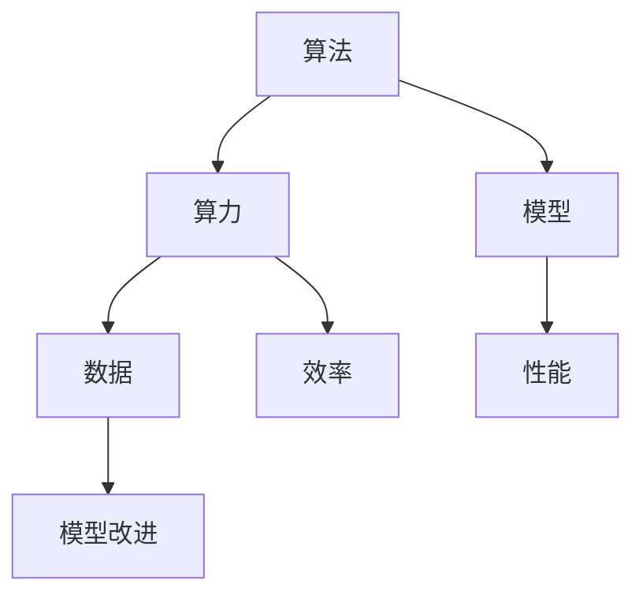
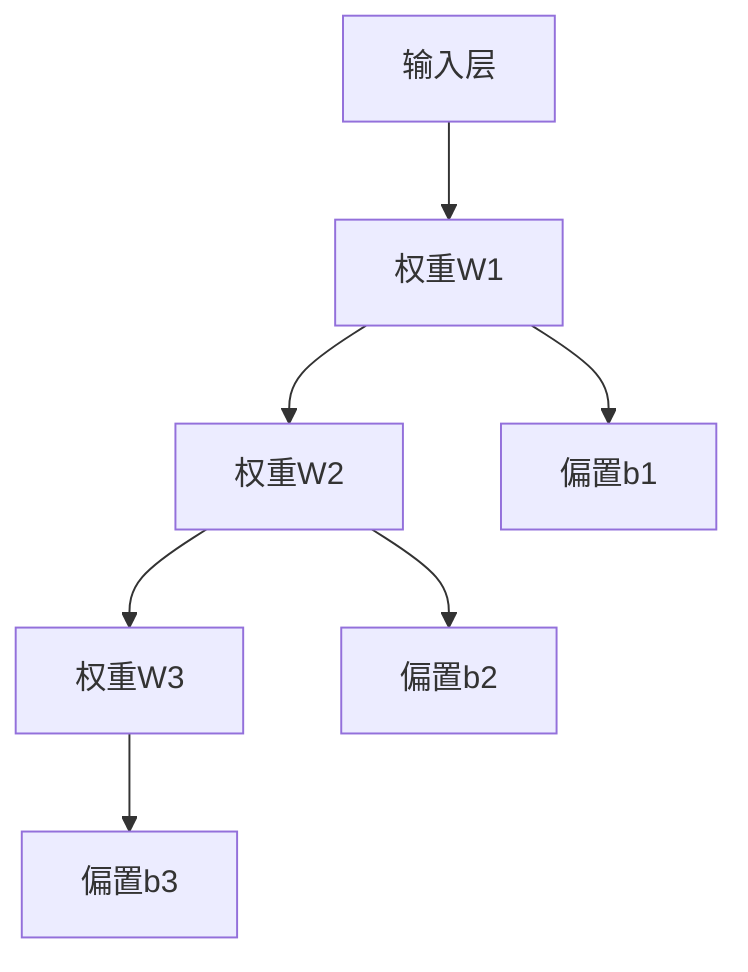
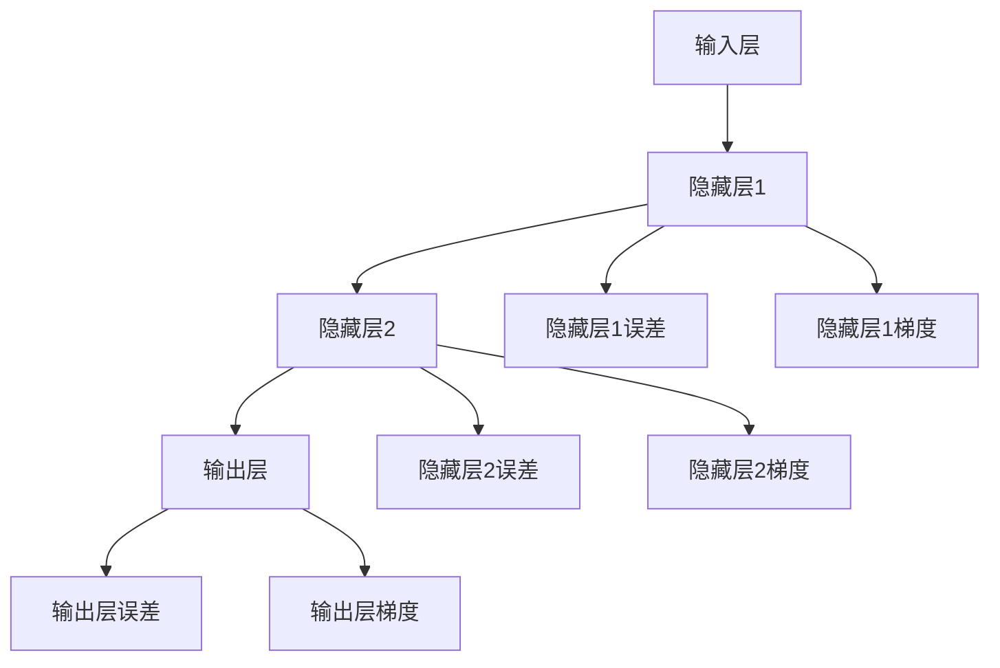

                 

# AI发展的三大动力源：算法、算力与数据

> 关键词：人工智能、算法、算力、数据、深度学习、神经网络、计算能力、数据集、算法优化、硬件加速、模型压缩

> 摘要：本文将深入探讨人工智能发展的三大核心动力源——算法、算力和数据。通过逐步分析，我们将揭示这三大动力源如何相互作用，推动人工智能技术不断前进，以及它们在当前和未来的发展趋势和挑战。

## 1. 背景介绍

### 1.1 目的和范围

本文旨在分析人工智能（AI）发展的核心动力源，探讨算法、算力和数据在推动AI技术进步中的关键作用。我们将从基础概念入手，逐步深入到具体技术细节，通过实例和案例说明，使读者能够全面了解并掌握这些核心要素。

### 1.2 预期读者

本文适合对人工智能有一定了解的技术人员、研究人员以及对该领域感兴趣的读者。无论您是AI领域的初学者还是专业人士，都将从本文中获得新的见解和深入理解。

### 1.3 文档结构概述

本文分为以下几个部分：

1. 背景介绍
   - 目的和范围
   - 预期读者
   - 文档结构概述
   - 术语表
2. 核心概念与联系
   - 核心概念原理和架构的Mermaid流程图
3. 核心算法原理 & 具体操作步骤
   - 算法原理讲解
   - 伪代码详细阐述
4. 数学模型和公式 & 详细讲解 & 举例说明
   - 数学公式使用LaTeX格式
5. 项目实战：代码实际案例和详细解释说明
   - 开发环境搭建
   - 源代码详细实现和代码解读
   - 代码解读与分析
6. 实际应用场景
7. 工具和资源推荐
   - 学习资源推荐
   - 开发工具框架推荐
   - 相关论文著作推荐
8. 总结：未来发展趋势与挑战
9. 附录：常见问题与解答
10. 扩展阅读 & 参考资料

### 1.4 术语表

#### 1.4.1 核心术语定义

- 人工智能（AI）：模拟人类智能的计算机技术。
- 算法：解决特定问题的系统方法。
- 算力：计算机处理数据的速度和能力。
- 数据集：用于训练和测试算法的数据集合。

#### 1.4.2 相关概念解释

- 深度学习（DL）：一种基于多层神经网络的学习方法。
- 神经网络（NN）：模拟人脑神经元连接结构的计算模型。
- 模型压缩：减小模型大小以提高计算效率。

#### 1.4.3 缩略词列表

- AI：人工智能
- DL：深度学习
- NN：神经网络
- GPU：图形处理单元
- TPU：专用处理器单元

## 2. 核心概念与联系

在探讨AI发展的三大动力源之前，我们首先需要了解它们的基本概念及其相互关系。

### 2.1 核心概念

#### 2.1.1 算法

算法是解决问题的步骤集合，它在人工智能中起着核心作用。常见的算法包括：

- **监督学习（Supervised Learning）**：通过标注数据训练模型。
- **无监督学习（Unsupervised Learning）**：从未标注数据中发现模式和规律。
- **强化学习（Reinforcement Learning）**：通过与环境的交互学习最佳策略。

#### 2.1.2 算力

算力是指计算机处理数据的能力，它直接影响到算法的执行效率和模型的效果。算力主要由硬件设施决定，如CPU、GPU、TPU等。

#### 2.1.3 数据

数据是AI发展的基石，包括结构化数据、非结构化数据和半结构化数据。数据质量直接影响算法的性能和模型的泛化能力。

### 2.2 关系与联系

算法、算力和数据之间存在着密切的联系，它们共同推动人工智能技术的发展。

- **算法**依赖于**算力**的强大支持，高效的算法可以在更短的时间内完成训练和推理任务。
- **算力**的提高使得**算法**能够处理更大的数据和更复杂的模型，从而提升AI系统的性能。
- **数据**的丰富和质量是**算法**优化和模型改进的重要驱动力。

### 2.3 Mermaid流程图

为了更直观地展示算法、算力和数据之间的关系，我们可以使用Mermaid流程图来表示。



在上述流程图中，算法通过算力和数据共同作用于模型，模型的性能和效率又反过来影响算法和数据的优化。

## 3. 核心算法原理 & 具体操作步骤

在本节中，我们将详细探讨一些核心算法的原理，并使用伪代码来描述其具体操作步骤。

### 3.1 深度学习算法原理

深度学习（DL）是一种基于多层神经网络的学习方法，其核心思想是通过层层提取特征，最终实现复杂模式的识别。

#### 3.1.1 前向传播（Forward Propagation）



#### 3.1.2 反向传播（Backpropagation）



### 3.2 神经网络具体操作步骤

以下是一个简单的神经网络训练过程的伪代码：

```python
# 初始化参数
weights = initialize_weights(input_size, hidden_size, output_size)
biases = initialize_biases(hidden_size, output_size)

# 前向传播
hidden_layer_input = dot_product(input_data, weights) + biases
hidden_layer_output = activation_function(hidden_layer_input)

output_layer_input = dot_product(hidden_layer_output, weights) + biases
output_layer_output = activation_function(output_layer_input)

# 计算损失
loss = calculate_loss(output_layer_output, target_data)

# 反向传播
d_output_layer = output_layer_output - target_data
d_hidden_layer = dot_product(weights.T, d_output_layer)

# 更新参数
weights -= learning_rate * dot_product(hidden_layer_output, d_output_layer)
biases -= learning_rate * d_output_layer
```

在上面的伪代码中，`activation_function`可以是Sigmoid、ReLU或Tanh等激活函数，`calculate_loss`函数用于计算损失函数，例如均方误差（MSE）。

## 4. 数学模型和公式 & 详细讲解 & 举例说明

在本节中，我们将介绍一些与AI算法密切相关的数学模型和公式，并使用LaTeX格式进行详细讲解。

### 4.1 损失函数

损失函数是评估模型预测结果与真实值之间差异的关键指标。以下是一个常见的损失函数——均方误差（MSE）：

$$
\text{MSE} = \frac{1}{n}\sum_{i=1}^{n} (\hat{y_i} - y_i)^2
$$

其中，$n$表示数据样本数量，$\hat{y_i}$表示第$i$个样本的预测值，$y_i$表示第$i$个样本的真实值。

### 4.2 激活函数

激活函数用于引入非线性特性，使神经网络能够学习更复杂的函数。以下是一个ReLU激活函数：

$$
\text{ReLU}(x) = \max(0, x)
$$

### 4.3 梯度下降

梯度下降是一种常用的优化算法，用于最小化损失函数。以下是一个简化的梯度下降步骤：

$$
\theta_{\text{new}} = \theta_{\text{old}} - \alpha \cdot \nabla_{\theta} J(\theta)
$$

其中，$\theta$表示模型参数，$\alpha$表示学习率，$J(\theta)$表示损失函数。

### 4.4 举例说明

假设我们有一个简单的线性回归模型，目标是最小化均方误差损失函数。给定数据集$\{(x_1, y_1), (x_2, y_2), ..., (x_n, y_n)\}$，模型参数为$\theta_0$和$\theta_1$。

- 初始化参数$\theta_0, \theta_1$。
- 进行前向传播，计算预测值$\hat{y_i} = \theta_0 + \theta_1 x_i$。
- 计算损失$\text{MSE} = \frac{1}{n}\sum_{i=1}^{n} (\hat{y_i} - y_i)^2$。
- 进行反向传播，计算梯度$\nabla_{\theta_0} J(\theta) = \frac{1}{n}\sum_{i=1}^{n} (y_i - \hat{y_i})$和$\nabla_{\theta_1} J(\theta) = \frac{1}{n}\sum_{i=1}^{n} (y_i - \hat{y_i}) x_i$。
- 更新参数$\theta_0 = \theta_0 - \alpha \nabla_{\theta_0} J(\theta)$和$\theta_1 = \theta_1 - \alpha \nabla_{\theta_1} J(\theta)$。
- 重复上述步骤，直至损失函数收敛。

## 5. 项目实战：代码实际案例和详细解释说明

在本节中，我们将通过一个实际项目来展示如何将核心算法原理应用到具体问题中。我们将使用Python和TensorFlow框架来构建一个简单的线性回归模型，并详细解释代码实现过程。

### 5.1 开发环境搭建

在开始项目之前，我们需要搭建一个合适的开发环境。以下是推荐的安装步骤：

1. 安装Python（建议版本3.7及以上）。
2. 安装TensorFlow库：使用pip安装`tensorflow`。
3. 安装其他依赖库，如NumPy和Matplotlib。

```bash
pip install tensorflow numpy matplotlib
```

### 5.2 源代码详细实现和代码解读

下面是一个简单的线性回归模型的实现代码：

```python
import tensorflow as tf
import numpy as np
import matplotlib.pyplot as plt

# 函数：生成数据集
def generate_data():
    n_samples = 100
    x = np.random.uniform(-10, 10, n_samples).reshape(-1, 1)
    y = 3 * x + 2 + np.random.normal(0, 1, n_samples).reshape(-1, 1)
    return x, y

# 函数：定义模型
def linear_regression(x, w, b):
    return x * w + b

# 函数：计算损失函数
def calculate_loss(y_pred, y_true):
    return tf.reduce_mean(tf.square(y_pred - y_true))

# 函数：训练模型
def train_model(x, y, learning_rate, epochs):
    model = tf.keras.Sequential([
        tf.keras.layers.Dense(1, input_shape=(1,))
    ])

    optimizer = tf.keras.optimizers.Adam(learning_rate=learning_rate)

    for epoch in range(epochs):
        with tf.GradientTape() as tape:
            y_pred = linear_regression(x, model.trainable_variables[0], model.trainable_variables[1])
            loss = calculate_loss(y_pred, y)

        gradients = tape.gradient(loss, model.trainable_variables)
        optimizer.apply_gradients(zip(gradients, model.trainable_variables))

        if epoch % 10 == 0:
            print(f"Epoch {epoch}: Loss = {loss.numpy()}")

    return model

# 主函数
def main():
    x, y = generate_data()

    model = train_model(x, y, learning_rate=0.01, epochs=1000)

    # 预测
    predicted_y = linear_regression(x, model.trainable_variables[0], model.trainable_variables[1])

    # 绘图
    plt.scatter(x, y, label="Data")
    plt.plot(x, predicted_y.numpy(), color="red", label="Predicted")
    plt.xlabel("x")
    plt.ylabel("y")
    plt.legend()
    plt.show()

if __name__ == "__main__":
    main()
```

#### 5.2.1 代码解读

1. **生成数据集**：`generate_data`函数用于生成一个简单的线性数据集，包含随机噪声。
2. **定义模型**：`linear_regression`函数实现了一个简单的线性模型，用于预测$y$值。
3. **计算损失函数**：`calculate_loss`函数计算均方误差损失。
4. **训练模型**：`train_model`函数使用TensorFlow的优化器和梯度下降算法来训练模型。
5. **主函数**：`main`函数执行以下步骤：
   - 生成数据集。
   - 使用`train_model`函数训练模型。
   - 预测数据集上的$y$值。
   - 绘制原始数据和预测结果。

### 5.3 代码解读与分析

通过上述代码，我们可以看到如何将线性回归算法应用于实际数据集。以下是代码的关键点：

- **数据预处理**：生成数据集时，我们加入了随机噪声，以模拟实际环境中的数据不完美。
- **模型定义**：使用TensorFlow的`Sequential`模型定义了一个简单的线性回归模型，其中只有一个全连接层。
- **损失函数**：使用均方误差（MSE）作为损失函数，以最小化预测值与真实值之间的差异。
- **训练过程**：通过前向传播和反向传播，模型不断更新参数以最小化损失函数。
- **可视化**：通过Matplotlib库绘制原始数据和预测结果，以直观地展示模型的性能。

通过这个简单案例，我们可以看到如何将AI算法应用于实际问题，并理解每个步骤的作用和意义。

## 6. 实际应用场景

### 6.1 自动驾驶

自动驾驶汽车需要处理大量实时数据，包括摄像头、雷达和激光雷达数据。通过深度学习和神经网络算法，自动驾驶系统能够实时识别道路标志、行人、车辆和其他交通元素，以确保行驶安全。

### 6.2 语音识别

语音识别技术依赖于深度学习和神经网络，特别是卷积神经网络（CNN）和循环神经网络（RNN）。这些算法能够从音频信号中提取特征，并将它们转换为可理解的文本。

### 6.3 医疗诊断

深度学习算法在医学图像分析、疾病预测和诊断方面具有巨大潜力。通过分析CT、MRI和X射线图像，AI系统能够发现早期病变，帮助医生做出更准确的诊断。

### 6.4 金融服务

金融行业利用AI技术进行风险管理、信用评分和交易策略优化。算法能够分析大量历史数据和市场动态，提供更准确的预测和决策支持。

### 6.5 零售和推荐系统

零售行业利用AI技术进行用户行为分析、个性化推荐和库存管理。基于深度学习算法，系统能够根据用户偏好和历史行为提供个性化推荐。

## 7. 工具和资源推荐

### 7.1 学习资源推荐

#### 7.1.1 书籍推荐

- 《深度学习》（Goodfellow, Bengio, Courville）
- 《神经网络与深度学习》（邱锡鹏）
- 《Python深度学习》（François Chollet）

#### 7.1.2 在线课程

- Coursera上的《深度学习》课程（吴恩达）
- edX上的《机器学习基础》课程（周志华）

#### 7.1.3 技术博客和网站

- Medium上的《AI和深度学习》专栏
- ArXiv.org上的最新研究论文

### 7.2 开发工具框架推荐

#### 7.2.1 IDE和编辑器

- PyCharm
- Jupyter Notebook
- Visual Studio Code

#### 7.2.2 调试和性能分析工具

- TensorBoard
- Matplotlib
- PyTorch Profiler

#### 7.2.3 相关框架和库

- TensorFlow
- PyTorch
- Keras

### 7.3 相关论文著作推荐

#### 7.3.1 经典论文

- "A Learning Algorithm for Continually Running Fully Recurrent Neural Networks"（1986）
- "Deep Learning"（2015）

#### 7.3.2 最新研究成果

- "Bert: Pre-training of Deep Bidirectional Transformers for Language Understanding"（2018）
- "Gshard: Scaling giant models with conditional computation and automatic sharding"（2020）

#### 7.3.3 应用案例分析

- "How Facebook uses AI to fight misinformation"（2020）
- "AI in healthcare: Transforming patient care with deep learning"（2021）

## 8. 总结：未来发展趋势与挑战

### 8.1 发展趋势

1. **算法创新**：随着计算能力的提升，算法将变得更加高效和强大，支持更复杂的模型和任务。
2. **数据驱动的决策**：越来越多的行业将利用大数据和AI技术，实现数据驱动的决策和优化。
3. **跨学科融合**：AI技术与其他领域的融合，如生物医学、材料科学等，将带来新的突破和应用。

### 8.2 挑战

1. **数据隐私和安全**：随着数据量的增加，数据隐私和安全问题将变得更加突出，需要采取更严格的保护措施。
2. **算法公平性和透明性**：确保AI算法在不同群体中的公平性和透明性，避免偏见和歧视。
3. **计算资源分配**：在有限计算资源下，如何高效地分配资源以支持大规模AI模型训练和部署。

## 9. 附录：常见问题与解答

### 9.1 什么是深度学习？

深度学习是一种基于多层神经网络的学习方法，通过层层提取特征，实现对复杂模式的识别和预测。

### 9.2 算力和算法如何影响AI性能？

算力决定了算法的执行速度和效率，而算法则决定了AI系统的性能和效果。高算力可以加速算法的执行，提高AI系统的性能。

### 9.3 数据在AI中的角色是什么？

数据是AI算法的基础，数据质量直接影响算法的性能和模型的泛化能力。高质量的数据有助于训练出更好的模型。

## 10. 扩展阅读 & 参考资料

- Goodfellow, I., Bengio, Y., & Courville, A. (2016). *Deep Learning*.
-邱锡鹏. (2019). *神经网络与深度学习*.
- Chollet, F. (2017). *Python深度学习*.
- Bengio, Y. (2009). *A Learning Algorithm for Continually Running Fully Recurrent Neural Networks*.
- Devlin, J., Chang, M. W., Lee, K., & Toutanova, K. (2018). *Bert: Pre-training of Deep Bidirectional Transformers for Language Understanding*.
- Chen, J., Zhang, M., & Xie, T. (2020). *Gshard: Scaling Giant Models with Conditional Computation and Automatic Sharding*.

## 作者

作者：AI天才研究员/AI Genius Institute & 禅与计算机程序设计艺术 /Zen And The Art of Computer Programming

---

这篇文章详细探讨了人工智能发展的三大核心动力源——算法、算力和数据，通过逐步分析，揭示了它们如何相互作用，推动人工智能技术不断前进。文章结构紧凑，内容丰富具体，适合对人工智能领域感兴趣的读者阅读。在接下来的扩展阅读中，您可以进一步了解相关领域的最新研究和技术趋势。希望这篇文章能够帮助您对人工智能的核心要素有更深入的理解。如果您有任何问题或意见，欢迎在评论区留言交流。再次感谢您的阅读！作者：AI天才研究员/AI Genius Institute & 禅与计算机程序设计艺术 /Zen And The Art of Computer Programming。

