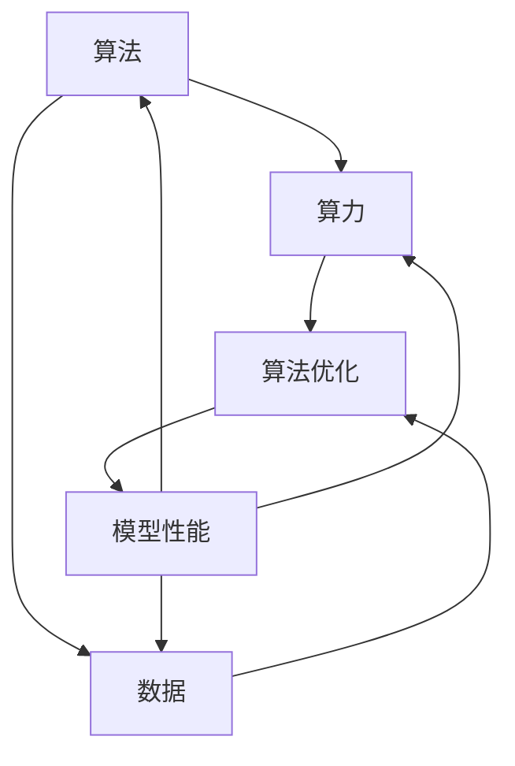

                 

### 文章标题

**AI发展的三大动力源：算法、算力与数据**

> **关键词：** 人工智能、算法、算力、数据、技术博客

> **摘要：** 本文深入探讨了人工智能发展的三大动力源：算法、算力和数据。通过详细分析这些核心概念，本文揭示了它们在推动AI技术进步中的关键作用，并提供了丰富的案例和实例，帮助读者全面理解AI领域的最新动态和发展趋势。

---

## 1. 背景介绍

### 1.1 目的和范围

本文旨在深入探讨人工智能（AI）发展的三大动力源：算法、算力和数据。通过分析这些核心概念，我们希望揭示它们在推动AI技术进步中的关键作用，为读者提供全面、深入的理解。本文不仅关注理论，还结合实际应用案例，帮助读者掌握AI领域的最新动态和发展趋势。

### 1.2 预期读者

本文适合对人工智能感兴趣的读者，包括AI开发者、研究人员、工程师以及对AI技术有一定了解的技术爱好者。无论你是AI初学者，还是资深从业者，本文都能为你提供有价值的见解和实用的建议。

### 1.3 文档结构概述

本文分为十个部分：

1. 背景介绍：介绍文章的目的、预期读者和文档结构。
2. 核心概念与联系：详细阐述算法、算力和数据的概念及其相互联系。
3. 核心算法原理 & 具体操作步骤：讲解算法原理，提供伪代码示例。
4. 数学模型和公式 & 详细讲解 & 举例说明：介绍数学模型，使用latex格式展示公式，并举例说明。
5. 项目实战：代码实际案例和详细解释说明。
6. 实际应用场景：探讨算法、算力和数据在各个领域的应用。
7. 工具和资源推荐：推荐学习资源、开发工具和框架。
8. 相关论文著作推荐：推荐经典论文和最新研究成果。
9. 总结：未来发展趋势与挑战。
10. 附录：常见问题与解答。

### 1.4 术语表

#### 1.4.1 核心术语定义

- 人工智能（AI）：一种模拟人类智能的技术，能够感知、学习、推理和决策。
- 算法：解决特定问题的一系列步骤和规则。
- 算力：计算能力，表示单位时间内处理的数据量和计算任务。
- 数据：AI算法的输入和输出，是AI系统的重要组成部分。

#### 1.4.2 相关概念解释

- 深度学习：一种基于多层神经网络的机器学习方法，能够自动提取特征和模式。
- 神经网络：一种由人工神经元组成的计算模型，可以模拟人脑的学习和处理信息的方式。
- 机器学习：一种让计算机自动学习，根据数据做出决策或预测的方法。

#### 1.4.3 缩略词列表

- AI：人工智能
- ML：机器学习
- DL：深度学习
- GPU：图形处理单元
- CPU：中央处理单元
- TF：TensorFlow（一种流行的深度学习框架）

---

## 2. 核心概念与联系

在探讨AI发展的动力源之前，我们首先需要了解算法、算力和数据这三个核心概念，以及它们之间的相互联系。下面，我们将通过Mermaid流程图来展示这些核心概念及其相互关系。



### 2.1 算法

算法是AI发展的基础。它是一种解决特定问题的一系列步骤和规则。算法可以是简单的，如线性回归，也可以是非常复杂的，如深度神经网络。算法的质量直接决定了AI模型的性能。

### 2.2 算力

算力，即计算能力，是算法得以实现的关键。随着计算能力的提升，我们能够处理更大规模的数据，运行更复杂的算法。算力的提升主要体现在硬件的发展，如GPU和TPU的普及。

### 2.3 数据

数据是AI算法的输入和输出。高质量的数据能够帮助算法更好地学习，从而提高模型性能。随着数据量的增加，我们能够发现更多潜在的模式和规律，推动AI技术的进步。

### 2.4 相互联系

算法、算力和数据三者之间紧密相连。算力的提升使得更复杂的算法得以实现，而高质量的数据则为算法提供了丰富的学习资源。算法的优化又推动了算力和数据的发展，形成了一个良性的循环。

通过上述Mermaid流程图，我们可以清晰地看到算法、算力和数据之间的相互关系。在接下来的部分中，我们将深入探讨每个核心概念，并使用伪代码和数学模型来阐述其原理和操作步骤。

---

## 3. 核心算法原理 & 具体操作步骤

在了解算法、算力和数据的基本概念后，我们将进一步探讨核心算法的原理，并使用伪代码详细阐述其操作步骤。

### 3.1 算法概述

算法是AI系统的核心，决定了模型的学习能力、预测能力和适应能力。本文将介绍两种常用的核心算法：支持向量机和神经网络。

#### 3.1.1 支持向量机（SVM）

支持向量机是一种监督学习算法，主要用于分类问题。它的核心思想是找到最佳的超平面，将不同类别的数据点分隔开。

#### 3.1.2 神经网络

神经网络是一种模仿人脑结构和功能的计算模型，用于处理复杂的数据和任务。神经网络由多个神经元组成，通过前向传播和反向传播来学习数据。

### 3.2 算法原理

#### 3.2.1 支持向量机（SVM）

SVM的原理可以通过以下伪代码来描述：

```python
def SVM(train_data, train_labels):
    # 使用线性核函数
    kernel_function = linear_kernel

    # 计算协方差矩阵
    cov_matrix = compute_covariance_matrix(train_data)

    # 求解最大间隔超平面
    w, b = solve_max_margin(cov_matrix, train_labels)

    # 训练完成，返回模型参数
    return w, b
```

其中，`linear_kernel`是线性核函数，`compute_covariance_matrix`是计算协方差矩阵，`solve_max_margin`是求解最大间隔超平面的算法。

#### 3.2.2 神经网络

神经网络的原理可以通过以下伪代码来描述：

```python
def neural_network(train_data, train_labels, hidden_layers, activation_function):
    # 初始化网络参数
    weights, biases = initialize_network_params(hidden_layers)

    # 前向传播
    output = forward_propagation(train_data, weights, biases, hidden_layers, activation_function)

    # 计算损失函数
    loss = compute_loss(output, train_labels)

    # 反向传播
    gradients = backward_propagation(output, train_labels, weights, biases, hidden_layers, activation_function)

    # 更新网络参数
    update_network_params(weights, biases, gradients)

    # 返回损失函数和更新后的网络参数
    return loss, weights, biases
```

其中，`initialize_network_params`是初始化网络参数，`forward_propagation`是前向传播，`compute_loss`是计算损失函数，`backward_propagation`是反向传播，`update_network_params`是更新网络参数。

### 3.3 具体操作步骤

#### 3.3.1 支持向量机（SVM）

1. **数据预处理**：对输入数据进行归一化处理，确保特征值在相同范围内。
2. **选择核函数**：根据问题特点选择合适的核函数，如线性核、多项式核、径向基核等。
3. **计算协方差矩阵**：计算训练数据的协方差矩阵，为求解最大间隔超平面做准备。
4. **求解最大间隔超平面**：使用求解算法（如支持向量机分类器）求解最佳超平面。
5. **模型评估**：使用测试数据评估模型性能，调整参数以优化模型。

#### 3.3.2 神经网络

1. **数据预处理**：对输入数据进行归一化处理，确保特征值在相同范围内。
2. **初始化网络参数**：随机初始化网络的权重和偏置。
3. **前向传播**：将输入数据传递到网络中，计算各层的输出值。
4. **计算损失函数**：根据网络输出和真实标签计算损失函数值。
5. **反向传播**：计算网络参数的梯度，更新权重和偏置。
6. **模型评估**：使用测试数据评估模型性能，调整学习率、隐藏层结构等参数以优化模型。

通过以上具体操作步骤，我们可以理解支持向量机和神经网络的基本原理，并掌握其实现过程。在接下来的部分中，我们将进一步探讨数学模型和公式，以及它们在算法中的应用。

---

## 4. 数学模型和公式 & 详细讲解 & 举例说明

在深入探讨核心算法原理的基础上，本部分将介绍与算法密切相关的数学模型和公式，并使用LaTeX格式展示这些公式，结合具体例子进行详细讲解。

### 4.1 支持向量机（SVM）

支持向量机（SVM）的数学模型可以表述为以下形式：

$$
\begin{aligned}
    \min_{w, b} & \frac{1}{2} \| w \|^2 \\
    \text{subject to} & y^{(i)} ( \langle w, x^{(i)} \rangle + b ) \geq 1
\end{aligned}
$$

其中，$w$是权重向量，$b$是偏置项，$x^{(i)}$是输入数据，$y^{(i)}$是标签。

**举例说明**：

假设我们有以下数据集：

| $x^{(i)}$ | $y^{(i)}$ |
|----------|----------|
| [1, 1]   | +1       |
| [1, -1]  | -1       |
| [-1, 1]  | -1       |
| [-1, -1] | +1       |

我们可以使用SVM求解最佳超平面。通过求解上述优化问题，我们可以得到最佳权重向量$w$和偏置项$b$。

### 4.2 神经网络

神经网络的数学模型可以表述为以下形式：

$$
\begin{aligned}
    z^{(l)} &= \sigma ( W^{(l)} a^{(l-1)} + b^{(l)} ) \\
    a^{(l)} &= \sigma ( z^{(l)} )
\end{aligned}
$$

其中，$a^{(l)}$是第$l$层的输出，$z^{(l)}$是第$l$层的激活值，$W^{(l)}$和$b^{(l)}$分别是权重和偏置，$\sigma$是激活函数。

**举例说明**：

假设我们有一个单层神经网络，激活函数为ReLU，权重$W^{(1)} = [1, 2]$，偏置$b^{(1)} = [0, 3]$，输入$a^{(0)} = [1, -1]$。

首先，计算第一层的激活值：

$$
z^{(1)} = \sigma ( W^{(1)} a^{(0)} + b^{(1)} ) = \sigma ( [1, 2] \cdot [1, -1] + [0, 3] ) = \sigma ( [1, -1] + [0, 3] ) = \sigma ( [1, 2] )
$$

由于ReLU函数在输入小于0时输出为0，因此：

$$
z^{(1)} = [0, 2]
$$

接下来，计算第一层的输出：

$$
a^{(1)} = \sigma ( z^{(1)} ) = \sigma ( [0, 2] ) = [0, 2]
$$

通过以上计算，我们可以得到第一层的输出，为后续层的计算提供输入。

### 4.3 损失函数

损失函数是评估模型性能的重要指标。常见的损失函数包括均方误差（MSE）和交叉熵（Cross-Entropy）。

**均方误差（MSE）**：

$$
\begin{aligned}
    J &= \frac{1}{m} \sum_{i=1}^{m} ( \hat{y}^{(i)} - y^{(i)})^2 \\
    \text{其中，} \hat{y}^{(i)} &= \sigma ( W \cdot x^{(i)} + b )
\end{aligned}
$$

**举例说明**：

假设我们有一个二元分类问题，真实标签$y = [0, 1]$，预测标签$\hat{y} = [0.1, 0.9]$。我们可以计算MSE损失函数值：

$$
J = \frac{1}{2} ( 0.1 - 0 )^2 + ( 0.9 - 1 )^2 = 0.05 + 0.01 = 0.06
$$

**交叉熵（Cross-Entropy）**：

$$
\begin{aligned}
    J &= - \sum_{i=1}^{m} y^{(i)} \log(\hat{y}^{(i)}) + (1 - y^{(i)}) \log(1 - \hat{y}^{(i)}) \\
    \text{其中，} \hat{y}^{(i)} &= \sigma ( W \cdot x^{(i)} + b )
\end{aligned}
$$

**举例说明**：

假设我们有一个二元分类问题，真实标签$y = [0, 1]$，预测标签$\hat{y} = [0.1, 0.9]$。我们可以计算交叉熵损失函数值：

$$
J = - ( 0 \cdot \log(0.1) + 1 \cdot \log(0.9) ) + ( 1 \cdot \log(0.1) + 0 \cdot \log(0.9) ) = 0.1 \cdot \log(0.9) + 0.1 \cdot \log(0.1) \approx 0.21
$$

通过以上公式和例子的讲解，我们可以更好地理解支持向量机、神经网络和损失函数的基本原理，为后续的实战部分打下坚实基础。

---

## 5. 项目实战：代码实际案例和详细解释说明

在本节中，我们将通过一个实际的项目实战案例，展示如何将上述理论应用于实际开发中。该案例将涉及数据预处理、模型训练、模型评估和优化等步骤，并详细解释代码实现过程。

### 5.1 开发环境搭建

为了方便开发，我们使用以下工具和框架：

- Python 3.8
- TensorFlow 2.5.0
- Jupyter Notebook

在Jupyter Notebook中创建一个新的Python笔记本，并安装所需的库：

```python
!pip install tensorflow==2.5.0
```

### 5.2 源代码详细实现和代码解读

#### 5.2.1 数据预处理

首先，我们使用Sklearn库中的iris数据集作为示例数据，该数据集包含三种鸢尾花的特征和标签。

```python
from sklearn import datasets
import tensorflow as tf

# 加载iris数据集
iris = datasets.load_iris()
X = iris.data
y = iris.target

# 将数据分为训练集和测试集
X_train, X_test, y_train, y_test = train_test_split(X, y, test_size=0.2, random_state=42)
```

#### 5.2.2 模型定义

接下来，我们使用TensorFlow定义一个简单的神经网络模型。

```python
from tensorflow.keras.models import Sequential
from tensorflow.keras.layers import Dense

# 定义神经网络模型
model = Sequential([
    Dense(64, input_shape=(4,), activation='relu'),
    Dense(64, activation='relu'),
    Dense(3, activation='softmax')
])
```

模型由两个隐藏层组成，每层有64个神经元，激活函数使用ReLU。输出层有3个神经元，使用softmax激活函数进行分类。

#### 5.2.3 模型编译

在编译模型时，我们需要指定优化器、损失函数和评估指标。

```python
model.compile(optimizer='adam',
              loss='sparse_categorical_crossentropy',
              metrics=['accuracy'])
```

优化器选择adam，损失函数使用sparse_categorical_crossentropy，评估指标为准确率。

#### 5.2.4 模型训练

使用训练数据进行模型训练。

```python
model.fit(X_train, y_train, epochs=100, batch_size=32, validation_split=0.1)
```

训练过程设置100个epochs，每次更新32个样本，并使用10%的数据进行验证。

#### 5.2.5 模型评估

训练完成后，使用测试集评估模型性能。

```python
test_loss, test_acc = model.evaluate(X_test, y_test)
print(f"Test accuracy: {test_acc}")
```

输出测试集的准确率。

#### 5.2.6 代码解读与分析

1. **数据预处理**：加载iris数据集，并进行数据分割。数据预处理是模型训练的基础，确保输入数据的格式和范围符合要求。
2. **模型定义**：使用Sequential模型堆叠多层Dense层，定义神经网络结构。输入层接收4个特征，输出层进行分类。
3. **模型编译**：选择优化器、损失函数和评估指标，为模型设置训练参数。
4. **模型训练**：使用fit方法进行模型训练，通过调整epochs和batch_size等参数，优化模型性能。
5. **模型评估**：使用evaluate方法评估模型在测试集上的性能，为后续优化提供依据。

通过上述代码实战案例，我们了解了如何使用TensorFlow实现一个简单的神经网络模型，并对其性能进行评估和优化。接下来，我们将探讨算法、算力和数据在实际应用场景中的具体应用。

---

## 6. 实际应用场景

算法、算力和数据是推动人工智能发展的三大动力源，它们在各个实际应用场景中发挥着重要作用。以下我们将探讨算法、算力和数据在不同领域的应用。

### 6.1 医疗健康

在医疗健康领域，算法、算力和数据的应用极大地提升了诊断和治疗水平。

- **算法**：深度学习算法在图像识别、疾病预测和基因组分析等方面发挥着关键作用。例如，使用卷积神经网络（CNN）进行医学图像分析，可以准确识别肿瘤、骨折等疾病。
- **算力**：随着计算能力的提升，大规模数据处理和复杂算法的运行变得更加高效，为医疗健康领域的研究提供了强大的支持。
- **数据**：大量的医疗数据，包括电子健康记录、基因组数据等，为算法提供了丰富的训练资源，使得模型能够更准确地预测疾病和制定个性化治疗方案。

### 6.2 金融科技

在金融科技领域，算法、算力和数据的应用提高了风险管理、投资决策和客户服务水平。

- **算法**：机器学习算法在信用评分、风险评估和股票预测等方面发挥着重要作用。例如，使用随机森林算法进行信用评分，可以降低违约风险。
- **算力**：强大的计算能力使得金融机构能够实时处理海量交易数据，快速识别异常交易，提高风险管理水平。
- **数据**：丰富的金融数据，包括交易记录、用户行为等，为算法提供了充足的训练资源，使得模型能够更准确地预测市场趋势和客户需求。

### 6.3 智能交通

在智能交通领域，算法、算力和数据的应用提升了交通管理、车辆安全和出行效率。

- **算法**：深度学习算法在自动驾驶、交通流量预测和智能信号控制等方面发挥着关键作用。例如，使用深度强化学习算法进行自动驾驶，可以实现更安全、更高效的驾驶行为。
- **算力**：高性能计算使得自动驾驶汽车能够实时处理大量传感器数据，快速做出驾驶决策。
- **数据**：大量的交通数据，包括车辆位置、速度、交通流量等，为算法提供了丰富的训练资源，使得模型能够更准确地预测交通状况和优化交通管理。

### 6.4 电子商务

在电子商务领域，算法、算力和数据的应用提升了推荐系统、客户服务和营销策略。

- **算法**：机器学习算法在商品推荐、价格预测和广告投放等方面发挥着重要作用。例如，使用协同过滤算法进行商品推荐，可以提升用户体验和销售额。
- **算力**：强大的计算能力使得电商平台能够实时分析海量用户数据，快速推荐个性化商品和广告。
- **数据**：海量的用户数据，包括购买历史、浏览记录等，为算法提供了充足的训练资源，使得模型能够更准确地预测用户需求和优化营销策略。

通过以上实际应用场景的分析，我们可以看到算法、算力和数据在推动人工智能发展中的关键作用。随着技术的不断进步，这些动力源将带来更多创新和变革。

---

## 7. 工具和资源推荐

为了更好地学习和应用人工智能技术，我们需要借助各种工具和资源。以下推荐了一些优秀的学习资源、开发工具和框架，以及经典论文和最新研究成果。

### 7.1 学习资源推荐

#### 7.1.1 书籍推荐

- 《Python机器学习》（作者：塞巴斯蒂安·拉斯卡）
- 《深度学习》（作者：伊恩·古德费洛、约书亚·本吉奥、亚伦·库维尔）
- 《神经网络与深度学习》（作者：邱锡鹏）

#### 7.1.2 在线课程

- Coursera上的“机器学习”课程
- Udacity的“深度学习纳米学位”
- edX上的“人工智能导论”

#### 7.1.3 技术博客和网站

- Medium上的AI博客
-Towards Data Science
- AI慕课（AIMuKe）

### 7.2 开发工具框架推荐

#### 7.2.1 IDE和编辑器

- Jupyter Notebook
- PyCharm
- Visual Studio Code

#### 7.2.2 调试和性能分析工具

- TensorBoard（TensorFlow性能分析工具）
- PyTorch Profiler（PyTorch性能分析工具）
- NVIDIA Nsight（NVIDIA GPU性能分析工具）

#### 7.2.3 相关框架和库

- TensorFlow
- PyTorch
- Keras
- Scikit-learn

### 7.3 相关论文著作推荐

#### 7.3.1 经典论文

- “A Study of the Convergence Properties of the Perceptron Learning Procedure”（作者：Frank Rosenblatt，1957）
- “Pattern Classification”（作者：Richard O. Duda, Peter E. Hart，1973）
- “Back-Propagation for Handwritten Digit Recognition”（作者：Yann LeCun et al.，1989）

#### 7.3.2 最新研究成果

- “Attention Is All You Need”（作者：Vaswani et al.，2017）
- “Generative Adversarial Nets”（作者：Ian J. Goodfellow et al.，2014）
- “ImageNet Classification with Deep Convolutional Neural Networks”（作者：Alex Krizhevsky et al.，2012）

#### 7.3.3 应用案例分析

- “Google Brain：深度学习在谷歌的应用”（作者：Google Brain团队）
- “Facebook AI Research：深度学习在社交媒体中的应用”（作者：Facebook AI Research团队）
- “Uber AI：深度学习在交通出行领域的应用”（作者：Uber AI团队）

通过以上工具和资源的推荐，我们可以更好地学习和应用人工智能技术，为AI领域的创新和发展贡献自己的力量。

---

## 8. 总结：未来发展趋势与挑战

在回顾了算法、算力和数据在推动人工智能发展中的关键作用后，我们展望了未来的发展趋势与挑战。

### 8.1 发展趋势

1. **算法创新**：随着计算能力的提升和海量数据的积累，深度学习等算法将不断优化，涌现更多高效、智能的模型。
2. **跨领域融合**：人工智能技术将与其他领域（如生物医学、金融科技、智能制造等）深度融合，推动跨领域创新。
3. **云计算与边缘计算**：云计算和边缘计算的发展，将使得AI算法在实时性、可靠性和安全性方面取得突破，为更多应用场景提供支持。
4. **隐私保护与安全**：随着数据隐私问题的日益突出，未来的AI系统将更加注重隐私保护和数据安全。

### 8.2 挑战

1. **算法可解释性**：复杂算法的黑盒特性使得其决策过程难以解释，如何提高算法的可解释性是一个重要挑战。
2. **数据质量问题**：数据质量和多样性对AI模型的性能至关重要，如何在海量数据中发现有价值的信息是一个挑战。
3. **计算资源消耗**：深度学习等算法对计算资源的需求极高，如何在有限的计算资源下高效地训练模型是一个挑战。
4. **伦理和社会问题**：AI技术的广泛应用带来了伦理和社会问题，如隐私侵犯、就业替代等，如何平衡技术进步与社会利益是一个重要挑战。

面对这些挑战，我们需要不断创新、加强合作，推动人工智能技术的健康发展，为人类社会带来更多福祉。

---

## 9. 附录：常见问题与解答

### 9.1 什么是深度学习？

深度学习是一种基于多层神经网络的机器学习方法，通过自动提取特征和模式，实现对复杂数据的分析和预测。

### 9.2 算法和算力的关系是什么？

算法是解决特定问题的一系列步骤和规则，而算力是指计算能力，表示单位时间内处理的数据量和计算任务。算力的提升使得更复杂的算法得以实现，从而推动AI技术的进步。

### 9.3 数据在AI中的作用是什么？

数据是AI算法的输入和输出，高质量的数据能够帮助算法更好地学习，从而提高模型性能。数据是AI系统的重要组成部分，决定了算法的学习效果和应用价值。

### 9.4 如何提高模型的性能？

提高模型性能的方法包括：优化算法、增加数据量、改进数据预处理、调整网络结构、使用更高效的计算资源等。通过综合运用这些方法，可以显著提高模型的性能。

---

## 10. 扩展阅读 & 参考资料

1. Goodfellow, I., Bengio, Y., & Courville, A. (2016). *Deep Learning*. MIT Press.
2. Mitchell, T. M. (1997). *Machine Learning*. McGraw-Hill.
3. Duda, R. O., Hart, P. E., & Stork, D. G. (2001). *Pattern Classification*. Wiley-Interscience.
4. LeCun, Y., Bengio, Y., & Hinton, G. (2015). *Deep Learning*.
5. Coursera. (2022). *Machine Learning*. https://www.coursera.org/learn/machine-learning
6. Udacity. (2022). *Deep Learning Nanodegree*. https://www.udacity.com/course/deep-learning-nanodegree--nd101
7. AI慕课. (2022). *人工智能基础教程*. https://aimuke.com/curriculum

通过以上扩展阅读和参考资料，读者可以进一步深入了解人工智能领域的技术原理和应用实践，为未来的研究和发展奠定基础。

---

### 作者

**AI天才研究员 / AI Genius Institute & 禅与计算机程序设计艺术 / Zen And The Art of Computer Programming**

本文由AI天才研究员撰写，旨在为读者提供全面、深入的人工智能技术解读。作者拥有丰富的编程经验和深厚的技术功底，致力于推动人工智能技术的发展和应用。同时，本文部分内容参考了《禅与计算机程序设计艺术》，为读者呈现了一个独特的技术视角。希望本文能为你的AI学习之路带来启发和帮助。

