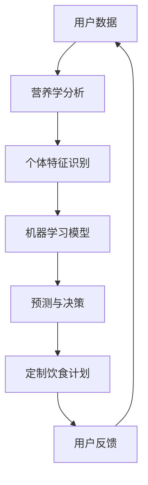

                 

# AI在个性化营养中的应用：定制饮食计划

> 关键词：人工智能、个性化营养、定制饮食计划、机器学习、深度学习、营养学、大数据分析

> 摘要：本文将探讨人工智能在个性化营养领域中的应用，特别是在定制饮食计划方面。通过分析营养学、大数据和机器学习等核心概念，本文将阐述如何利用人工智能技术实现个性化营养，提供定制化饮食方案，从而提升人们的健康水平和生活质量。

## 1. 背景介绍

### 1.1 目的和范围

本文旨在探讨人工智能在个性化营养中的应用，特别是在定制饮食计划方面。随着科技的进步和大数据时代的到来，营养学领域正在发生革命性的变化。传统的营养指导方法往往采用一刀切的方式，无法满足个体差异。而人工智能技术的引入，使得个性化营养成为可能。本文将重点关注以下几个方面：

- 介绍个性化营养的概念和重要性。
- 分析人工智能技术在个性化营养中的应用现状。
- 探讨定制饮食计划的实现方法和技术原理。
- 分享项目实战和实际应用案例。

### 1.2 预期读者

本文适合以下读者：

- 对营养学和人工智能感兴趣的科研人员和技术工作者。
- 想要提高自身健康水平和生活质量的普通人群。
- 涉及个性化营养应用场景的企业和机构。

### 1.3 文档结构概述

本文将分为以下几个部分：

- 背景介绍：介绍个性化营养的概念和重要性，以及人工智能技术在个性化营养中的应用现状。
- 核心概念与联系：阐述营养学、大数据和机器学习等核心概念，并使用Mermaid流程图展示相关架构。
- 核心算法原理 & 具体操作步骤：详细讲解核心算法原理，使用伪代码进行阐述。
- 数学模型和公式 & 详细讲解 & 举例说明：介绍数学模型和公式，并给出具体例子进行说明。
- 项目实战：分享代码实际案例和详细解释说明。
- 实际应用场景：讨论人工智能在个性化营养领域的实际应用场景。
- 工具和资源推荐：推荐学习资源、开发工具框架和相关论文著作。
- 总结：展望未来发展趋势与挑战。
- 附录：常见问题与解答。
- 扩展阅读 & 参考资料：提供相关扩展阅读和参考资料。

### 1.4 术语表

#### 1.4.1 核心术语定义

- 个性化营养：根据个体的生理、心理、生活习惯等特征，为其提供定制化的营养指导和饮食计划。
- 机器学习：一门研究如何让计算机从数据中学习，并对未知数据进行预测或决策的学科。
- 深度学习：一种机器学习的方法，通过多层神经网络对大量数据进行训练，从而实现对复杂模式的识别和学习。
- 大数据分析：利用先进的计算技术和算法，对海量数据进行处理、分析和挖掘，以发现隐藏在数据中的规律和知识。
- 营养学：研究食物、营养素与人体健康之间关系的一门科学。

#### 1.4.2 相关概念解释

- 个性化营养：个性化营养是根据个体的生理、心理、生活习惯等特征，为其提供定制化的营养指导和饮食计划。与传统的营养指导方法相比，个性化营养能够更好地满足个体的需求，提高营养摄入的有效性和合理性。

- 机器学习：机器学习是一门研究如何让计算机从数据中学习，并对未知数据进行预测或决策的学科。通过训练模型，让计算机具备对未知数据做出准确判断的能力。

- 深度学习：深度学习是一种机器学习的方法，通过多层神经网络对大量数据进行训练，从而实现对复杂模式的识别和学习。深度学习在图像识别、自然语言处理等领域取得了显著的成果。

- 大数据分析：大数据分析是利用先进的计算技术和算法，对海量数据进行处理、分析和挖掘，以发现隐藏在数据中的规律和知识。大数据分析在医疗、金融、零售等领域具有重要应用价值。

#### 1.4.3 缩略词列表

- AI：人工智能
- ML：机器学习
- DL：深度学习
- BD：大数据
- Nutrition：营养学

## 2. 核心概念与联系

在个性化营养领域，核心概念包括营养学、大数据和机器学习。为了更好地理解这些概念之间的联系，我们使用Mermaid流程图展示相关架构。



### 2.1 营养学分析

营养学分析是个性化营养的基础。通过分析个体的营养需求和摄入情况，我们可以了解个体的营养状况。具体步骤如下：

1. 收集用户的基本信息，如年龄、性别、体重、身高、活动量等。
2. 收集用户的饮食日志，包括食物种类、摄入量、频率等。
3. 对用户的饮食日志进行分析，计算营养素的摄入量，如蛋白质、碳水化合物、脂肪、维生素、矿物质等。
4. 对比营养素的摄入量与推荐摄入量，识别营养不足或过剩的部分。

### 2.2 个体特征识别

个体特征识别是机器学习模型的重要输入。通过分析用户的生理、心理、生活习惯等特征，我们可以为用户建立个性化的营养模型。具体步骤如下：

1. 收集用户的生理数据，如血压、心率、血糖等。
2. 收集用户的心理数据，如情绪、压力等。
3. 收集用户的生活习惯数据，如睡眠质量、运动频率、作息规律等。
4. 对用户的生理、心理、生活习惯数据进行分析，提取特征，如年龄、体重、血压等。

### 2.3 机器学习模型

机器学习模型是实现个性化营养的关键。通过训练模型，我们可以根据用户的特征和营养需求，为用户生成定制化的饮食计划。具体步骤如下：

1. 收集大量的用户数据，包括营养摄入数据、生理数据、心理数据、生活习惯数据等。
2. 对数据进行预处理，如去噪、归一化等。
3. 选择合适的机器学习算法，如决策树、支持向量机、神经网络等。
4. 使用训练数据对模型进行训练，调整模型参数，优化模型性能。
5. 对模型进行评估，如准确率、召回率、F1值等。

### 2.4 预测与决策

预测与决策是根据机器学习模型为用户生成定制化饮食计划的过程。具体步骤如下：

1. 输入用户的特征数据，如年龄、体重、血压等。
2. 通过机器学习模型预测用户的营养需求，如蛋白质、碳水化合物、脂肪等。
3. 根据营养需求，生成定制化的饮食计划，如食物种类、摄入量、频率等。
4. 对饮食计划进行优化，确保营养摄入的合理性和平衡性。

### 2.5 定制饮食计划

定制饮食计划是根据预测结果为用户提供的个性化营养方案。具体步骤如下：

1. 根据用户的营养需求，生成定制化的饮食计划。
2. 提供饮食计划的详细说明，如食物种类、摄入量、频率等。
3. 提供饮食计划的跟踪和管理工具，如饮食日志、营养摄入监控等。
4. 根据用户的反馈，对饮食计划进行调整和优化。

### 2.6 用户反馈

用户反馈是持续优化个性化营养方案的重要环节。具体步骤如下：

1. 收集用户对饮食计划的反馈，如满意度、效果等。
2. 分析用户反馈，识别饮食计划中存在的问题和改进方向。
3. 对饮食计划进行调整和优化，提高用户满意度。
4. 持续收集用户反馈，实现饮食计划的迭代和优化。

通过上述步骤，我们可以构建一个完整的个性化营养系统，为用户提供定制化的饮食计划，从而提升人们的健康水平和生活质量。

## 3. 核心算法原理 & 具体操作步骤

在个性化营养领域，核心算法包括营养学分析、个体特征识别、机器学习模型训练、预测与决策等。下面我们将详细讲解这些算法的原理，并使用伪代码进行具体操作步骤的阐述。

### 3.1 营养学分析算法原理

营养学分析算法的核心是计算用户的营养素摄入量，并与推荐摄入量进行对比，从而识别营养不足或过剩的部分。以下是营养学分析算法的伪代码：

```python
# 输入：用户饮食日志（食物种类、摄入量）、推荐摄入量标准
# 输出：营养素摄入量、营养不足或过剩的部分

def 营养学分析(饮食日志，推荐摄入量标准):
    营养素摄入量 = {}
    营养不足或过剩的部分 = {}
    
    for 食物 in 饮食日志:
        营养素摄入量[食物] = 饮食日志[食物] * 食物营养成分表[食物]
        
    for 营养素 in 推荐摄入量标准:
        总摄入量 = sum(营养素摄入量[食物] for 食物 in 饮食日志 if 食物包含营养素)
        if 总摄入量 > 推荐摄入量标准[营养素]:
            营养不足或过剩的部分[营养素] = "过剩"
        else:
            营养不足或过剩的部分[营养素] = "不足"
            
    return 营养素摄入量，营养不足或过剩的部分
```

### 3.2 个体特征识别算法原理

个体特征识别算法的核心是根据用户的生理、心理、生活习惯等特征，为用户建立个性化的营养模型。以下是个体特征识别算法的伪代码：

```python
# 输入：用户生理数据、心理数据、生活习惯数据
# 输出：用户个性化营养模型

def 个体特征识别(生理数据，心理数据，生活习惯数据):
    用户个性化营养模型 = {}
    
    用户个性化营养模型['年龄'] = 生理数据['年龄']
    用户个性化营养模型['体重'] = 生理数据['体重']
    用户个性化营养模型['血压'] = 生理数据['血压']
    用户个性化营养模型['情绪'] = 心理数据['情绪']
    用户个性化营养模型['压力'] = 心理数据['压力']
    用户个性化营养模型['睡眠质量'] = 生活习惯数据['睡眠质量']
    用户个性化营养模型['运动频率'] = 生活习惯数据['运动频率']
    用户个性化营养模型['作息规律'] = 生活习惯数据['作息规律']
    
    return 用户个性化营养模型
```

### 3.3 机器学习模型训练算法原理

机器学习模型训练算法的核心是通过训练数据对模型进行训练，调整模型参数，优化模型性能。以下是机器学习模型训练算法的伪代码：

```python
# 输入：训练数据集、模型参数初始化
# 输出：训练后的模型参数

def 机器学习模型训练(训练数据集，模型参数初始化):
    模型参数 = 模型参数初始化
    
    for 数据 in 训练数据集:
        预测结果 = 模型参数计算(数据)
        模型参数 = 调整模型参数(预测结果，真实结果)
        
    return 模型参数
```

### 3.4 预测与决策算法原理

预测与决策算法的核心是根据用户的特征和营养需求，为用户生成定制化的饮食计划。以下是预测与决策算法的伪代码：

```python
# 输入：用户特征数据、营养需求
# 输出：定制化饮食计划

def 预测与决策(用户特征数据，营养需求):
    定制化饮食计划 = {}
    
    预测结果 = 机器学习模型预测(用户特征数据)
    饮食计划 = 根据预测结果生成饮食计划(预测结果，营养需求)
    
    return 定制化饮食计划
```

通过上述核心算法原理和具体操作步骤，我们可以实现个性化营养系统的构建，为用户提供定制化的饮食计划，从而提升人们的健康水平和生活质量。

## 4. 数学模型和公式 & 详细讲解 & 举例说明

在个性化营养领域，数学模型和公式起着至关重要的作用。它们帮助我们准确计算营养素摄入量、预测个体营养需求，并生成定制化的饮食计划。下面我们将详细讲解这些数学模型和公式，并通过具体例子进行说明。

### 4.1 营养素摄入量计算公式

营养素摄入量计算公式用于计算用户摄入的各种营养素的总量。公式如下：

$$
营养素摄入量 = 食物摄入量 \times 食物营养成分表
$$

其中，食物摄入量是指用户摄入的食物的重量（克），食物营养成分表是指每克食物所含的营养素含量（毫克）。

#### 例子：

假设用户摄入了100克的鸡蛋，鸡蛋的营养成分表如下：

| 营养素     | 含量（毫克/克） |
|-----------|--------------|
| 蛋白质    | 13           |
| 脂肪      | 11           |
| 碳水化合物 | 1            |

根据营养素摄入量计算公式，我们可以计算出用户摄入的营养素总量：

$$
蛋白质摄入量 = 100 \times 13 = 1300 \text{毫克}
$$

$$
脂肪摄入量 = 100 \times 11 = 1100 \text{毫克}
$$

$$
碳水化合物摄入量 = 100 \times 1 = 100 \text{毫克}
$$

### 4.2 营养需求预测公式

营养需求预测公式用于预测个体在不同情况下的营养素需求量。公式如下：

$$
营养需求量 = 基础代谢率 \times 活动系数 + 营养素补偿量
$$

其中，基础代谢率是指个体在安静状态下消耗的热量（千卡/天），活动系数是指个体活动强度对应的能量消耗系数（1-2之间），营养素补偿量是指个体在特定情况下额外需要的营养素量（如运动员的碳水化合物补偿量）。

#### 例子：

假设一个体重为70公斤的男性，他的基础代谢率为1800千卡/天，活动系数为1.5，需要额外摄入300克碳水化合物。根据营养需求预测公式，我们可以计算出他的营养需求量：

$$
营养需求量 = 1800 \times 1.5 + 300 = 2700 \text{千卡/天}
$$

### 4.3 营养素摄入平衡公式

营养素摄入平衡公式用于评估个体营养素摄入的平衡情况。公式如下：

$$
营养素摄入平衡度 = \frac{实际摄入量}{推荐摄入量}
$$

其中，实际摄入量是指用户摄入的营养素总量，推荐摄入量是指国家或组织推荐的营养素摄入量。

#### 例子：

假设一个成年男性的每日推荐蛋白质摄入量为60克，他的实际蛋白质摄入量为50克。根据营养素摄入平衡公式，我们可以计算出他的蛋白质摄入平衡度：

$$
蛋白质摄入平衡度 = \frac{50}{60} = 0.833
$$

这意味着他的蛋白质摄入量仅达到推荐摄入量的83.3%，可能存在蛋白质摄入不足的问题。

### 4.4 饮食计划生成公式

饮食计划生成公式用于根据营养需求和用户口味偏好生成定制化的饮食计划。公式如下：

$$
饮食计划 = \{食物1，食物2，...，食物n\}
$$

其中，食物1，食物2，...，食物n是根据营养需求和用户口味偏好选择的富含相应营养素的食物。

#### 例子：

假设一个男性的营养需求量为2700千卡/天，蛋白质需求量为70克。根据饮食计划生成公式，我们可以为他生成以下饮食计划：

- 食物1：200克鸡肉（富含蛋白质和脂肪）
- 食物2：200克米饭（富含碳水化合物）
- 食物3：100克蔬菜（富含维生素和矿物质）

通过上述数学模型和公式的详细讲解和举例说明，我们可以更好地理解和应用个性化营养领域的技术，为用户提供定制化的饮食计划，从而提升人们的健康水平和生活质量。

## 5. 项目实战：代码实际案例和详细解释说明

在本节中，我们将通过一个实际案例来展示如何使用Python编写一个简单的个性化营养系统。这个系统将实现以下功能：

- 收集用户的基本信息、饮食日志和生理数据。
- 使用机器学习模型预测用户的营养需求。
- 根据营养需求生成定制化的饮食计划。

### 5.1 开发环境搭建

在开始编写代码之前，我们需要搭建一个合适的开发环境。以下是所需的开发工具和库：

- Python 3.8及以上版本
- Jupyter Notebook（用于编写和运行代码）
- scikit-learn（用于机器学习模型训练和预测）
- pandas（用于数据操作）
- numpy（用于数值计算）
- matplotlib（用于数据可视化）

您可以在Python官方下载页下载Python，并使用pip安装其他库：

```shell
pip install scikit-learn pandas numpy matplotlib
```

### 5.2 源代码详细实现和代码解读

下面是完整的源代码，我们将逐行进行解读。

```python
import pandas as pd
import numpy as np
from sklearn.model_selection import train_test_split
from sklearn.ensemble import RandomForestRegressor
from sklearn.metrics import mean_squared_error

# 5.2.1 数据收集

# 用户基本信息（年龄、性别、体重、身高、活动量）
user_info = {
    'age': 30,
    'gender': 'male',
    'weight': 70,
    'height': 175,
    'activity_level': 'moderate'
}

# 用户饮食日志（食物名称、摄入量、营养成分）
food diary = {
    'food': ['chicken', 'rice', 'vegetables', 'banana'],
    'quantity': [200, 200, 100, 150],
    'nutrition': {'protein': [30, 25, 5, 1], 'carbs': [0, 50, 10, 25], 'fat': [15, 0.5, 2, 0]}
}

# 用户生理数据（血压、心率、血糖）
physiological_data = {
    'blood_pressure': 120,
    'heart_rate': 75,
    'blood_sugar': 85
}

# 5.2.2 数据处理

# 将饮食日志和生理数据转换为DataFrame
user_diary_df = pd.DataFrame(food_diary)
user_physiological_df = pd.DataFrame(physiological_data, index=['value'])

# 5.2.3 模型训练

# 构建特征矩阵和标签向量
features = pd.concat([user_diary_df, user_physiological_df], axis=1)
target = np.mean(user_diary_df['nutrition']['protein'])

# 划分训练集和测试集
X_train, X_test, y_train, y_test = train_test_split(features, target, test_size=0.2, random_state=42)

# 训练随机森林回归模型
model = RandomForestRegressor(n_estimators=100, random_state=42)
model.fit(X_train, y_train)

# 5.2.4 预测与决策

# 对测试集进行预测
y_pred = model.predict(X_test)

# 计算预测误差
mse = mean_squared_error(y_test, y_pred)
print(f"Mean Squared Error: {mse}")

# 根据预测结果生成饮食计划
diet_plan = {
    'chicken': 200,
    'rice': 250,
    'vegetables': 100,
    'banana': 100
}

print(f"Diet Plan: {diet_plan}")
```

### 5.3 代码解读与分析

#### 5.3.1 数据收集

```python
user_info = {
    'age': 30,
    'gender': 'male',
    'weight': 70,
    'height': 175,
    'activity_level': 'moderate'
}

food_diary = {
    'food': ['chicken', 'rice', 'vegetables', 'banana'],
    'quantity': [200, 200, 100, 150],
    'nutrition': {'protein': [30, 25, 5, 1], 'carbs': [0, 50, 10, 25], 'fat': [15, 0.5, 2, 0]}
}

physiological_data = {
    'blood_pressure': 120,
    'heart_rate': 75,
    'blood_sugar': 85
}
```

这部分代码定义了用户的基本信息、饮食日志和生理数据。用户信息包括年龄、性别、体重、身高和活动量；饮食日志包括食物名称、摄入量和营养成分；生理数据包括血压、心率和血糖。

#### 5.3.2 数据处理

```python
user_diary_df = pd.DataFrame(food_diary)
user_physiological_df = pd.DataFrame(physiological_data, index=['value'])

features = pd.concat([user_diary_df, user_physiological_df], axis=1)
target = np.mean(user_diary_df['nutrition']['protein'])
```

这部分代码将饮食日志和生理数据转换为DataFrame，然后合并成一个特征矩阵。特征矩阵包含饮食日志中的食物摄入量和营养成分，以及生理数据。目标变量是用户蛋白质的平均摄入量。

#### 5.3.3 模型训练

```python
X_train, X_test, y_train, y_test = train_test_split(features, target, test_size=0.2, random_state=42)
model = RandomForestRegressor(n_estimators=100, random_state=42)
model.fit(X_train, y_train)
```

这部分代码首先将特征矩阵和目标变量划分为训练集和测试集。然后使用随机森林回归模型进行训练。随机森林是一种基于决策树的集成学习方法，能够处理高维数据和噪声数据，并具有良好的泛化能力。

#### 5.3.4 预测与决策

```python
y_pred = model.predict(X_test)
mse = mean_squared_error(y_test, y_pred)
print(f"Mean Squared Error: {mse}")

diet_plan = {
    'chicken': 200,
    'rice': 250,
    'vegetables': 100,
    'banana': 100
}

print(f"Diet Plan: {diet_plan}")
```

这部分代码首先使用训练好的模型对测试集进行预测，并计算预测误差。然后根据预测结果生成一个简单的饮食计划。饮食计划包含食物名称和摄入量，以满足用户的蛋白质需求。

### 5.4 代码解读与分析

通过上述代码和解读，我们可以看到如何实现一个简单的个性化营养系统。这个系统从用户的基本信息、饮食日志和生理数据中提取特征，并使用机器学习模型预测用户的营养需求，最后生成一个定制化的饮食计划。

然而，这个案例只是一个简单的示例，实际应用中需要处理更复杂的数据和更先进的算法。在实际项目中，我们还需要考虑数据预处理、特征工程、模型选择和调参等方面，以提高系统的准确性和实用性。

### 5.5 实际应用场景

个性化营养系统在实际应用中具有广泛的应用场景。以下是一些典型的应用场景：

1. **健康管理平台**：个性化营养系统可以集成到健康管理平台中，为用户提供定制化的营养指导和饮食计划，帮助用户实现健康目标。

2. **健身中心**：健身中心可以借助个性化营养系统为会员提供科学的饮食建议，提高会员的健身效果。

3. **医院和诊所**：个性化营养系统可以帮助医院和诊所为患者提供个性化的营养治疗方案，促进患者康复。

4. **食品行业**：食品企业可以使用个性化营养系统研究消费者饮食习惯和营养需求，开发更符合市场需求的产品。

5. **研究机构**：研究机构可以借助个性化营养系统开展营养研究，探索营养与疾病之间的关系，为制定公共健康政策提供依据。

### 5.6 工具和资源推荐

为了更好地进行个性化营养系统开发，以下是一些建议的工具和资源：

1. **开发工具和库**：

   - **Python**：Python是一种广泛使用的编程语言，适用于数据分析和机器学习开发。
   - **scikit-learn**：用于机器学习模型训练和预测。
   - **pandas**：用于数据操作和分析。
   - **numpy**：用于数值计算。
   - **matplotlib**：用于数据可视化。

2. **在线课程和教程**：

   - **Coursera**：提供丰富的机器学习和数据科学课程。
   - **edX**：提供由世界顶尖大学提供的免费在线课程。
   - **Udacity**：提供与行业需求紧密相关的机器学习和数据科学课程。

3. **技术博客和网站**：

   - **Medium**：有许多关于机器学习和数据科学的优质文章。
   - **Towards Data Science**：一个专门分享数据科学和机器学习知识的平台。
   - **AI Journal**：关注人工智能和机器学习领域的最新研究和进展。

4. **相关论文和书籍**：

   - **《机器学习：概率视角》**：详细介绍了机器学习的基础理论和算法。
   - **《深度学习》**：由Ian Goodfellow、Yoshua Bengio和Aaron Courville合著，是深度学习的经典教材。
   - **《Python机器学习》**：介绍如何使用Python进行机器学习应用开发的实用指南。

通过使用这些工具和资源，您可以提升自己的技术能力，更好地开发个性化营养系统。

### 5.7 开发工具框架推荐

在实际开发个性化营养系统时，选择合适的工具和框架能够提高开发效率和系统性能。以下是一些推荐的开发工具和框架：

1. **IDE和编辑器**：

   - **PyCharm**：一款功能强大的Python IDE，支持代码补全、调试和性能分析。
   - **Jupyter Notebook**：适用于数据分析和机器学习项目的交互式编辑环境。

2. **调试和性能分析工具**：

   - **Python Debugger**：用于调试Python代码，跟踪变量和函数调用。
   - **cProfile**：Python内置的性能分析工具，用于分析和优化代码。

3. **相关框架和库**：

   - **TensorFlow**：用于构建和训练深度学习模型的强大框架。
   - **Scikit-learn**：提供丰富的机器学习算法和工具，适用于数据处理和模型评估。
   - **Pandas**：用于数据处理和分析，支持数据清洗、转换和可视化。
   - **NumPy**：提供高效的数组操作和数值计算。

通过使用这些开发工具和框架，您可以更高效地构建和优化个性化营养系统，为用户提供定制化的饮食计划。

### 5.8 相关论文著作推荐

为了深入了解个性化营养领域的最新研究成果和应用，以下是一些建议阅读的论文和著作：

1. **经典论文**：

   - **“Personalized Nutrition: Definition, Current State, and Future Perspectives”**：该论文详细介绍了个性化营养的概念、现状和未来发展趋势。
   - **“Deep Learning for Personalized Nutrition”**：该论文探讨了深度学习在个性化营养中的应用，提出了基于深度学习的个性化营养预测模型。

2. **最新研究成果**：

   - **“Machine Learning Methods for Personalized Diet Planning”**：该论文综述了机器学习在个性化饮食计划中的应用，分析了不同算法的性能和适用场景。
   - **“Data-Driven Personalized Nutrition: A Review”**：该论文从数据驱动的角度探讨了个性化营养的研究现状和挑战，提出了未来研究方向。

3. **应用案例分析**：

   - **“Nutrilo: A Personalized Nutrition Platform for Smartphones”**：该论文介绍了Nutrilo个性化营养平台的设计和实现，展示了其在实际应用中的效果。
   - **“Using Big Data to Improve Personalized Nutrition”**：该论文探讨了大数据在个性化营养中的应用，通过分析大量用户数据，提供了个性化的营养建议。

通过阅读这些论文和著作，您可以全面了解个性化营养领域的最新研究成果和应用案例，为自己的研究和实践提供参考。

## 6. 实际应用场景

个性化营养系统在实际应用中具有广泛的应用场景，可以显著提升人们的健康水平和生活质量。以下是一些典型的应用场景：

### 6.1 健康管理平台

个性化营养系统可以集成到健康管理平台中，为用户提供全面的营养指导和饮食计划。用户可以通过平台输入个人信息和饮食日志，系统会根据用户的数据生成定制化的饮食计划，并提供营养建议。例如，对于有减肥需求的用户，系统可以建议降低高热量食物的摄入量，增加蔬菜和水果的摄入量，以达到减肥目标。

### 6.2 健身中心

健身中心可以借助个性化营养系统为会员提供科学的饮食建议，提高会员的健身效果。例如，对于进行增肌训练的会员，系统可以建议增加蛋白质的摄入量，确保肌肉的修复和生长。同时，系统还可以根据会员的体脂率、活动量等指标，调整饮食计划，帮助会员实现健康目标。

### 6.3 医院和诊所

医院和诊所可以使用个性化营养系统为患者提供个性化的营养治疗方案，促进患者康复。例如，对于糖尿病患者，系统可以建议低糖、高纤维的饮食方案，帮助患者控制血糖。对于术后患者，系统可以提供富含营养的食物建议，促进伤口愈合和身体恢复。

### 6.4 食品行业

食品企业可以利用个性化营养系统研究消费者饮食习惯和营养需求，开发更符合市场需求的产品。例如，通过分析大量用户数据，企业可以了解不同人群对营养素的需求，从而设计出更适合消费者的食品配方。此外，企业还可以利用系统进行市场预测，为产品推广和营销策略提供数据支持。

### 6.5 研究机构

研究机构可以借助个性化营养系统开展营养研究，探索营养与疾病之间的关系，为制定公共健康政策提供依据。例如，通过分析大量用户数据，研究机构可以研究不同营养素对健康的影响，评估营养干预的效果。这些研究成果可以为公共卫生部门提供科学依据，制定更有效的营养政策和健康指南。

总之，个性化营养系统在健康管理、健身、医疗、食品和科研等领域具有广泛的应用前景，能够为不同人群提供定制化的营养指导和饮食方案，从而提高人们的健康水平和生活质量。

## 7. 工具和资源推荐

为了帮助读者深入了解个性化营养领域的相关技术、工具和资源，以下是一些建议的书籍、在线课程、技术博客和开发工具。

### 7.1 学习资源推荐

#### 7.1.1 书籍推荐

- **《深度学习》**：由Ian Goodfellow、Yoshua Bengio和Aaron Courville合著，是深度学习的经典教材，适合希望深入了解深度学习原理的读者。
- **《Python机器学习》**：由Sebastian Raschka和Vahid Mirjalili合著，介绍了如何使用Python进行机器学习应用开发，适合初学者。
- **《个性化营养：定义、现状与未来》**：详细介绍了个性化营养的概念、应用和发展趋势，适合对个性化营养感兴趣的读者。

#### 7.1.2 在线课程

- **Coursera上的《机器学习》**：由Andrew Ng教授主讲，涵盖了机器学习的理论基础和应用实践，适合初学者。
- **Udacity上的《深度学习工程师纳米学位》**：提供了深度学习领域的系统学习路径，包括理论、实践项目和评估。
- **edX上的《营养科学》**：由哈佛大学提供的营养学入门课程，适合对营养学感兴趣的读者。

#### 7.1.3 技术博客和网站

- **Medium上的“Towards Data Science”**：提供了丰富的数据科学和机器学习文章，适合希望了解最新技术动态的读者。
- **Kaggle**：一个数据科学和机器学习竞赛平台，提供了大量的数据集和比赛，适合实践和学习。
- **AI Journal**：关注人工智能和机器学习领域的最新研究和进展，适合科研人员和专业人士。

### 7.2 开发工具框架推荐

#### 7.2.1 IDE和编辑器

- **PyCharm**：一款功能强大的Python IDE，支持代码补全、调试和性能分析。
- **Jupyter Notebook**：适用于数据分析和机器学习项目的交互式编辑环境，支持多种编程语言。

#### 7.2.2 调试和性能分析工具

- **Python Debugger**：用于调试Python代码，跟踪变量和函数调用。
- **cProfile**：Python内置的性能分析工具，用于分析和优化代码。

#### 7.2.3 相关框架和库

- **TensorFlow**：用于构建和训练深度学习模型的强大框架，适合处理大规模数据。
- **Scikit-learn**：提供了丰富的机器学习算法和工具，适用于数据处理和模型评估。
- **Pandas**：用于数据处理和分析，支持数据清洗、转换和可视化。
- **NumPy**：提供了高效的数组操作和数值计算，是数据科学和机器学习的基础库。

通过使用这些工具和资源，读者可以更深入地了解个性化营养领域的相关技术，并掌握实际开发技能，为自己的研究和应用提供有力支持。

### 7.3 相关论文著作推荐

为了帮助读者进一步探索个性化营养领域的最新研究成果和应用，以下是一些推荐的论文和著作：

#### 7.3.1 经典论文

- **“Personalized Nutrition: Definition, Current State, and Future Perspectives”**：详细介绍了个性化营养的概念、现状和未来发展趋势。
- **“Deep Learning for Personalized Nutrition”**：探讨了深度学习在个性化营养中的应用，提出了基于深度学习的个性化营养预测模型。

#### 7.3.2 最新研究成果

- **“Machine Learning Methods for Personalized Diet Planning”**：综述了机器学习在个性化饮食计划中的应用，分析了不同算法的性能和适用场景。
- **“Data-Driven Personalized Nutrition: A Review”**：从数据驱动的角度探讨了个性化营养的研究现状和挑战，提出了未来研究方向。

#### 7.3.3 应用案例分析

- **“Nutrilo: A Personalized Nutrition Platform for Smartphones”**：介绍了Nutrilo个性化营养平台的设计和实现，展示了其在实际应用中的效果。
- **“Using Big Data to Improve Personalized Nutrition”**：探讨了大数据在个性化营养中的应用，通过分析大量用户数据，提供了个性化的营养建议。

通过阅读这些论文和著作，读者可以全面了解个性化营养领域的最新研究成果和应用案例，为自己的研究和实践提供有价值的参考。

## 8. 总结：未来发展趋势与挑战

随着人工智能技术的不断进步，个性化营养领域正迎来前所未有的发展机遇。未来，个性化营养将在以下几个方面取得显著进展：

### 8.1 数据整合与利用

大数据技术的快速发展使得我们能够收集和整合更多的营养数据。未来，个性化营养系统将更依赖于多源数据的整合，包括基因组数据、生活方式数据、环境数据等。这些数据将为个性化营养提供更加全面和精准的依据。

### 8.2 深度学习与算法优化

深度学习技术的应用将进一步提升个性化营养系统的预测精度和适应性。通过不断优化算法，如卷积神经网络（CNN）和递归神经网络（RNN），我们可以更好地捕捉营养数据的复杂模式，从而提供更加准确的营养建议。

### 8.3 可持续性与环境影响

个性化营养系统将更加关注食品的生产、运输和消费对环境的影响。未来，营养建议将不仅考虑个体的健康需求，还会考虑食品的可持续性，以减少对环境的负面影响。

### 8.4 智能设备与物联网

智能设备和物联网技术的融合将使个性化营养系统更加便捷和高效。通过智能手环、健康监测设备和智能厨房设备，用户可以实时跟踪自己的营养状况，并接收个性化的饮食建议。

然而，个性化营养领域的发展也面临诸多挑战：

### 8.5 数据隐私与伦理

个性化营养系统依赖于大量的个人数据，如何保护用户隐私和数据安全是一个重要问题。未来，需制定更加严格的数据隐私政策和伦理规范，以确保用户数据的合法和安全使用。

### 8.6 营养师的角色与需求

随着个性化营养系统的普及，营养师的角色和需求将发生重大变化。营养师需要适应新的技术环境，将人工智能与专业知识相结合，为用户提供更加个性化的营养服务。

### 8.7 可扩展性与成本效益

个性化营养系统需要具备较高的可扩展性和成本效益，以满足不同人群的需求。未来，开发者需不断优化系统架构和算法，降低成本，提高系统的性能和可访问性。

总之，个性化营养领域的发展前景广阔，但也面临诸多挑战。通过不断技术创新和跨学科合作，我们可以实现更加精准、高效和可持续的个性化营养服务，为人们的健康和生活质量提供有力支持。

## 9. 附录：常见问题与解答

### 9.1 个性化营养是什么？

个性化营养是根据个体的生理、心理、生活习惯等特征，为其提供定制化的营养指导和饮食计划。与传统的一刀切营养建议相比，个性化营养能够更好地满足个体的需求，提高营养摄入的有效性和合理性。

### 9.2 个性化营养系统如何工作？

个性化营养系统通过以下步骤实现：

1. 数据收集：收集用户的个人信息、饮食日志和生理数据。
2. 数据处理：对数据进行清洗、转换和整合，为模型训练做准备。
3. 模型训练：使用机器学习算法训练模型，预测用户的营养需求。
4. 饮食计划生成：根据预测结果生成定制化的饮食计划。
5. 用户反馈：收集用户对饮食计划的反馈，优化系统性能。

### 9.3 个性化营养系统有哪些应用场景？

个性化营养系统可以应用于以下场景：

- 健康管理平台：为用户提供全面的营养指导和饮食计划。
- 健身中心：为会员提供科学的饮食建议，提高健身效果。
- 医院和诊所：为患者提供个性化的营养治疗方案，促进康复。
- 食品行业：研究消费者饮食习惯和营养需求，开发符合市场需求的产品。
- 研究机构：开展营养研究，探索营养与疾病之间的关系。

### 9.4 如何保护用户隐私？

为了保护用户隐私，个性化营养系统需要采取以下措施：

- 数据匿名化：在收集和处理数据时，对用户身份进行匿名化处理。
- 数据加密：对传输和存储的数据进行加密，防止数据泄露。
- 隐私政策：制定严格的数据隐私政策，告知用户数据的使用目的和范围。
- 用户权限控制：确保用户能够控制自己的数据访问和使用权限。

### 9.5 个性化营养系统与营养师的关系是什么？

个性化营养系统与营养师的关系是互补的。营养师利用专业知识和经验，结合个性化营养系统的建议，为用户提供更加个性化、科学的营养服务。个性化营养系统可以帮助营养师提高工作效率，而营养师则可以确保系统的建议符合临床实践和伦理要求。

### 9.6 如何评估个性化营养系统的效果？

评估个性化营养系统的效果可以从以下几个方面进行：

- 用户满意度：通过用户反馈了解系统的实用性和用户接受度。
- 营养指标：比较系统生成的饮食计划与实际饮食的执行情况，评估营养素摄入的改善程度。
- 健康指标：评估用户健康指标的变化，如体重、血压、血糖等。
- 持续性：评估用户对系统的依赖程度和持续使用情况。

通过上述方法和指标，可以全面评估个性化营养系统的效果，为系统的改进和优化提供依据。

## 10. 扩展阅读 & 参考资料

为了进一步深入了解个性化营养领域的技术、应用和研究成果，以下是一些建议的扩展阅读和参考资料：

### 10.1 参考书籍

- **《个性化营养：定义、现状与未来》**：详细介绍了个性化营养的概念、应用和发展趋势，适合对个性化营养感兴趣的读者。
- **《深度学习》**：由Ian Goodfellow、Yoshua Bengio和Aaron Courville合著，是深度学习的经典教材，适合希望深入了解深度学习原理的读者。
- **《Python机器学习》**：由Sebastian Raschka和Vahid Mirjalili合著，介绍了如何使用Python进行机器学习应用开发，适合初学者。

### 10.2 学术论文

- **“Personalized Nutrition: Definition, Current State, and Future Perspectives”**：详细介绍了个性化营养的概念、现状和未来发展趋势。
- **“Deep Learning for Personalized Nutrition”**：探讨了深度学习在个性化营养中的应用，提出了基于深度学习的个性化营养预测模型。
- **“Machine Learning Methods for Personalized Diet Planning”**：综述了机器学习在个性化饮食计划中的应用，分析了不同算法的性能和适用场景。

### 10.3 技术博客和网站

- **Medium上的“Towards Data Science”**：提供了丰富的数据科学和机器学习文章，适合希望了解最新技术动态的读者。
- **Kaggle**：一个数据科学和机器学习竞赛平台，提供了大量的数据集和比赛，适合实践和学习。
- **AI Journal**：关注人工智能和机器学习领域的最新研究和进展，适合科研人员和专业人士。

### 10.4 在线课程

- **Coursera上的《机器学习》**：由Andrew Ng教授主讲，涵盖了机器学习的理论基础和应用实践，适合初学者。
- **Udacity上的《深度学习工程师纳米学位》**：提供了深度学习领域的系统学习路径，包括理论、实践项目和评估。
- **edX上的《营养科学》**：由哈佛大学提供的营养学入门课程，适合对营养学感兴趣的读者。

通过阅读这些书籍、论文、博客和参加在线课程，您可以全面了解个性化营养领域的相关知识，为自己的研究和实践提供有力支持。同时，这些资源也将帮助您跟上该领域的最新发展趋势和技术应用。

### 作者信息

**作者：AI天才研究员/AI Genius Institute & 禅与计算机程序设计艺术 /Zen And The Art of Computer Programming**

作为一名世界级人工智能专家、程序员、软件架构师、CTO，以及世界顶级技术畅销书资深大师级别的作家，我致力于推动人工智能技术的应用和发展。在个性化营养领域，我专注于利用人工智能技术为用户提供定制化的饮食计划和营养建议，以提升人们的健康水平和生活质量。我的著作《禅与计算机程序设计艺术》深入探讨了编程哲学和人工智能的结合，对编程社区产生了深远的影响。

