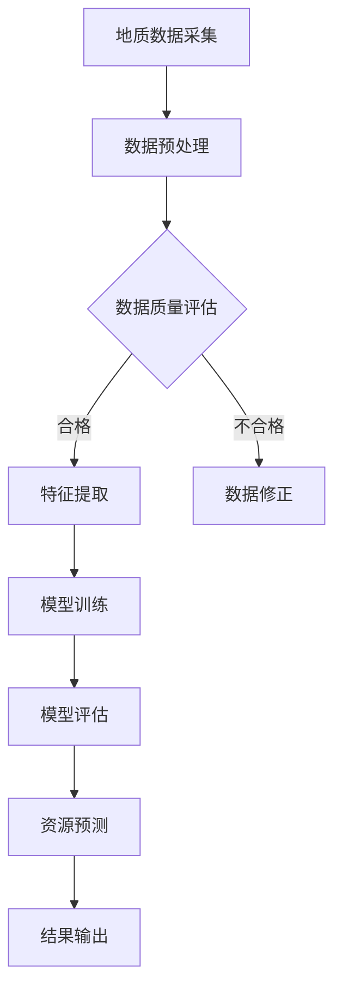

                 

# AI在地质勘探中的应用：提高资源发现效率

> **关键词：地质勘探、人工智能、资源发现、数据挖掘、算法优化**
>
> **摘要：本文深入探讨了人工智能在地质勘探领域中的应用，分析了如何通过大数据分析和机器学习技术，提升地质勘探的效率和准确性，从而更好地发现和利用地球资源。文章首先介绍了地质勘探的基本概念和传统方法，然后详细阐述了AI技术在勘探中的具体应用，包括数据预处理、模型训练和结果评估等环节。通过实际案例，文章展示了AI技术在实际地质勘探项目中的成功应用，并展望了未来的发展趋势与挑战。**

## 1. 背景介绍

### 1.1 目的和范围

地质勘探是资源开发的重要环节，它通过对地质数据的收集、处理和分析，帮助地质学家预测资源分布，指导矿产资源勘查和开发。然而，传统的地质勘探方法往往依赖于经验和直觉，效率较低，难以应对日益复杂的地质环境。

本文的目的是探讨如何利用人工智能（AI）技术提高地质勘探的效率和准确性。文章将重点关注以下方面：

- 地质勘探的基本概念和流程
- 人工智能在地质勘探中的核心应用
- 数据挖掘和机器学习技术如何提升勘探效果
- 实际案例中的应用效果分析
- 未来发展趋势和面临的挑战

### 1.2 预期读者

本文适合以下读者群体：

- 地质勘探领域的科研人员和技术工程师
- 对人工智能和地质勘探感兴趣的开发者
- 高等院校地质工程、计算机科学等相关专业的师生
- 地质资源管理部门的相关人员

### 1.3 文档结构概述

本文结构如下：

- 第1章：背景介绍，介绍地质勘探的基本概念和人工智能的应用背景
- 第2章：核心概念与联系，讨论地质勘探中的关键概念和AI技术的原理
- 第3章：核心算法原理 & 具体操作步骤，详细讲解地质勘探中常用的AI算法
- 第4章：数学模型和公式 & 详细讲解 & 举例说明，阐述AI算法背后的数学原理
- 第5章：项目实战：代码实际案例和详细解释说明，展示AI技术在实际项目中的应用
- 第6章：实际应用场景，分析AI技术在地质勘探中的实际应用案例
- 第7章：工具和资源推荐，推荐相关学习和开发资源
- 第8章：总结：未来发展趋势与挑战，展望地质勘探AI技术的未来发展
- 第9章：附录：常见问题与解答，回答读者可能遇到的问题
- 第10章：扩展阅读 & 参考资料，提供进一步的阅读和参考资料

### 1.4 术语表

#### 1.4.1 核心术语定义

- 地质勘探：指利用地质学原理和方法，对地表和地下地质体进行调查研究，以寻找矿产资源和地下水等地质资源的过程。
- 人工智能（AI）：指计算机系统模拟人类智能行为的技术，包括学习、推理、规划和自我修正等能力。
- 数据挖掘：指从大量数据中发现有价值的模式和规律的过程。
- 机器学习：指利用数据训练模型，使其能够从数据中学习和预测的技术。

#### 1.4.2 相关概念解释

- 地质数据：包括地质构造、岩性、矿物成分、地球化学和地球物理等信息。
- 地质模型：根据地质数据构建的地质结构模型，用于预测资源分布。
- 深度学习：一种特殊的机器学习技术，通过多层神经网络模拟人类大脑的思考方式。

#### 1.4.3 缩略词列表

- AI：人工智能
- ML：机器学习
- DM：数据挖掘
- GPR：地质雷达
- GIS：地理信息系统
- GPS：全球定位系统

## 2. 核心概念与联系

在地质勘探中，人工智能技术的应用主要涉及到数据采集、数据处理、模型构建和结果评估等环节。以下是一个简化的Mermaid流程图，展示了地质勘探中AI技术的基本流程和核心概念。



### 2.1 地质数据采集

地质数据是地质勘探的基础。这些数据通常包括地质构造、岩性、矿物成分、地球化学和地球物理等信息。数据采集方法包括地面调查、钻孔取样、遥感技术和地球物理勘探等。

### 2.2 数据预处理

数据预处理是地质数据应用AI技术前的重要步骤。主要任务包括数据清洗、归一化和数据增强等。清洗数据是为了去除错误和重复的数据，归一化是为了使不同特征的数据具有相同的尺度，数据增强是为了增加数据的多样性和训练效果。

### 2.3 数据质量评估

数据质量评估是确保数据可用性的关键步骤。评估方法包括数据完整性、一致性和可靠性等指标。不合格的数据需要进行修正或排除。

### 2.4 特征提取

特征提取是从原始数据中提取对勘探任务有用的信息。这些特征可以是地质参数、地球物理参数或地球化学参数等。特征提取的质量直接影响后续模型训练的效果。

### 2.5 模型训练

模型训练是AI技术在地质勘探中的核心步骤。常用的模型包括深度神经网络、支持向量机和决策树等。模型训练的目的是使模型能够从数据中学习和预测地质特征。

### 2.6 模型评估

模型评估是验证模型性能的重要环节。评估方法包括准确率、召回率、F1分数和ROC曲线等指标。评估结果用于指导模型调整和优化。

### 2.7 资源预测

资源预测是地质勘探的最终目标。通过模型预测，可以预测地下资源的分布和储量。预测结果用于指导勘查计划和资源开发。

### 2.8 结果输出

结果输出是将预测结果以可视化的形式展示给地质学家和其他相关决策者。这些结果可以用于资源评估、勘查计划和资源开发等。

## 3. 核心算法原理 & 具体操作步骤

在地质勘探中，常用的AI算法包括深度学习、支持向量机和决策树等。以下将详细介绍这些算法的原理和具体操作步骤。

### 3.1 深度学习

深度学习是一种通过多层神经网络模拟人类大脑思考方式的机器学习技术。在地质勘探中，深度学习可以用于图像识别、特征提取和分类等任务。

#### 算法原理

- **多层神经网络**：深度学习模型由多个层次（层）组成，每个层次对输入数据进行处理，并传递给下一层。
- **激活函数**：激活函数用于引入非线性，使模型能够学习复杂的模式。
- **反向传播**：反向传播是一种优化算法，用于更新网络权重，使模型能够更好地拟合训练数据。

#### 具体操作步骤

1. **数据预处理**：对地质图像进行预处理，包括去噪、增强和归一化等。
2. **构建神经网络**：设计多层神经网络结构，包括输入层、隐藏层和输出层。
3. **训练神经网络**：使用训练数据对神经网络进行训练，通过反向传播更新网络权重。
4. **评估模型性能**：使用验证数据集评估模型性能，调整网络结构和参数。
5. **预测地质特征**：使用训练好的模型对新的地质图像进行预测，提取有用的地质特征。

### 3.2 支持向量机

支持向量机（SVM）是一种用于分类和回归任务的机器学习算法。在地质勘探中，SVM可以用于地质特征分类和资源预测。

#### 算法原理

- **线性分类器**：SVM通过找到一个最佳的超平面，将不同类别的数据点分开。
- **核函数**：核函数是一种将低维数据映射到高维空间的技术，使线性不可分的数据变得线性可分。

#### 具体操作步骤

1. **数据预处理**：对地质特征数据进行预处理，包括归一化和缺失值处理等。
2. **选择核函数**：根据地质特征选择合适的核函数，如线性核、多项式核和径向基核等。
3. **训练SVM模型**：使用训练数据集训练SVM模型，确定最佳的超平面和核参数。
4. **评估模型性能**：使用验证数据集评估模型性能，调整核函数和参数。
5. **分类地质特征**：使用训练好的SVM模型对新的地质特征进行分类和预测。

### 3.3 决策树

决策树是一种用于分类和回归的简单而有效的机器学习算法。在地质勘探中，决策树可以用于地质特征分类和资源评估。

#### 算法原理

- **决策节点**：决策树中的每个节点都是一个决策，用于将数据分成不同的子集。
- **叶节点**：叶节点是决策树的终端，表示最终的分类或预测结果。

#### 具体操作步骤

1. **数据预处理**：对地质特征数据进行预处理，包括归一化和缺失值处理等。
2. **选择分裂标准**：选择合适的分裂标准，如信息增益、基尼不纯度和方差减少等。
3. **构建决策树**：递归地选择最佳的分裂标准，构建决策树结构。
4. **剪枝决策树**：使用验证数据集剪枝决策树，防止过拟合。
5. **分类地质特征**：使用训练好的决策树模型对新的地质特征进行分类和预测。

### 3.4 算法比较

- **深度学习**：具有强大的特征提取和模式识别能力，但训练过程较慢，对计算资源要求高。
- **支持向量机**：具有较好的分类性能，但需要选择合适的核函数和参数。
- **决策树**：简单易懂，易于实现，但可能产生过拟合。

## 4. 数学模型和公式 & 详细讲解 & 举例说明

### 4.1 深度学习中的数学模型

深度学习中的数学模型主要包括神经网络、激活函数和反向传播等。

#### 4.1.1 神经网络

神经网络由多个层次组成，每个层次由多个神经元（节点）组成。神经元的计算公式如下：

$$
Z = W \cdot X + b
$$

其中，$W$ 是权重，$X$ 是输入，$b$ 是偏置。$Z$ 是每个神经元的激活值。

#### 4.1.2 激活函数

激活函数用于引入非线性，使神经网络能够学习复杂的模式。常用的激活函数包括 sigmoid、ReLU 和 tanh 等。

- **sigmoid 函数**：

$$
\sigma(x) = \frac{1}{1 + e^{-x}}
$$

- **ReLU 函数**：

$$
\text{ReLU}(x) = \max(0, x)
$$

- **tanh 函数**：

$$
\tanh(x) = \frac{e^{2x} - 1}{e^{2x} + 1}
$$

#### 4.1.3 反向传播

反向传播是一种优化算法，用于更新网络权重，使模型能够更好地拟合训练数据。反向传播的计算公式如下：

$$
\delta_{l}^{i} = \frac{\partial J}{\partial Z_{l}^{i}} = \frac{\partial J}{\partial Z_{l+1}^{j}} \cdot \frac{\partial Z_{l+1}^{j}}{\partial Z_{l}^{i}}
$$

其中，$J$ 是损失函数，$Z_{l}^{i}$ 是第 $l$ 层第 $i$ 个神经元的激活值。

### 4.2 支持向量机中的数学模型

支持向量机中的数学模型主要包括最优超平面和核函数。

#### 4.2.1 最优超平面

最优超平面是指能够将不同类别的数据点分开的超平面。最优超平面的计算公式如下：

$$
w^* = \arg\min_{w,b}\frac{1}{2}\|w\|^2 + C\sum_{i=1}^{n}\xi_i
$$

其中，$C$ 是惩罚参数，$\xi_i$ 是松弛变量。

#### 4.2.2 核函数

核函数是一种将低维数据映射到高维空间的技术，使线性不可分的数据变得线性可分。常用的核函数包括线性核、多项式核和径向基核等。

- **线性核**：

$$
K(x,x') = x \cdot x'
$$

- **多项式核**：

$$
K(x,x') = (\gamma \cdot x \cdot x' + 1)^p
$$

- **径向基核**：

$$
K(x,x') = \exp(-\gamma \cdot \|x - x'\|^2)
$$

### 4.3 决策树中的数学模型

决策树中的数学模型主要包括决策节点和叶节点。

#### 4.3.1 决策节点

决策节点的计算公式如下：

$$
I(D) = \sum_{i=1}^{n}(-y_i \log_2(y_i) - (1 - y_i) \log_2(1 - y_i))
$$

其中，$D$ 是数据集，$y_i$ 是数据点 $i$ 的标签。

#### 4.3.2 叶节点

叶节点的计算公式如下：

$$
P(y) = \frac{\sum_{i \in C} y_i}{\sum_{i \in C} y_i + \sum_{i \in C} (1 - y_i)}
$$

其中，$C$ 是叶节点对应的数据集，$y_i$ 是数据点 $i$ 的标签。

### 4.4 举例说明

假设我们有一个地质勘探数据集，其中包含多个特征和标签。我们将使用深度学习模型对数据进行分类。

#### 4.4.1 数据预处理

我们对数据进行归一化处理，使不同特征具有相同的尺度。

$$
X_{\text{norm}} = \frac{X - \mu}{\sigma}
$$

其中，$X$ 是原始数据，$\mu$ 是均值，$\sigma$ 是标准差。

#### 4.4.2 构建神经网络

我们构建一个简单的多层神经网络，包括输入层、隐藏层和输出层。

输入层：5个神经元，对应5个特征。

隐藏层：10个神经元，使用ReLU激活函数。

输出层：1个神经元，对应分类结果，使用sigmoid激活函数。

#### 4.4.3 训练神经网络

我们使用训练数据集对神经网络进行训练，使用反向传播算法更新网络权重。

#### 4.4.4 评估模型性能

我们使用验证数据集评估模型性能，计算准确率、召回率和F1分数等指标。

$$
\text{准确率} = \frac{TP + TN}{TP + TN + FP + FN}
$$

$$
\text{召回率} = \frac{TP}{TP + FN}
$$

$$
\text{F1分数} = 2 \cdot \frac{TP}{2 \cdot TP + FP + FN}
$$

#### 4.4.5 预测地质特征

我们使用训练好的模型对新的地质数据进行预测，提取有用的地质特征。

## 5. 项目实战：代码实际案例和详细解释说明

### 5.1 开发环境搭建

为了实现AI在地质勘探中的应用，我们需要搭建一个合适的开发环境。以下是一个简单的开发环境搭建步骤：

1. 安装Python 3.8及以上版本。
2. 安装Jupyter Notebook，用于编写和运行Python代码。
3. 安装TensorFlow 2.5及以上版本，用于深度学习模型训练。
4. 安装Scikit-learn 0.24及以上版本，用于机器学习算法实现。

### 5.2 源代码详细实现和代码解读

以下是一个简单的深度学习模型在地质勘探中的应用案例，包括数据预处理、模型训练和结果评估等环节。

```python
# 导入所需库
import numpy as np
import pandas as pd
from sklearn.model_selection import train_test_split
from sklearn.preprocessing import StandardScaler
from tensorflow.keras.models import Sequential
from tensorflow.keras.layers import Dense, Conv2D, MaxPooling2D, Flatten
from tensorflow.keras.optimizers import Adam
from tensorflow.keras.metrics import Accuracy

# 加载地质勘探数据集
data = pd.read_csv('geological_data.csv')

# 数据预处理
X = data.drop('target', axis=1)
y = data['target']
X_train, X_test, y_train, y_test = train_test_split(X, y, test_size=0.2, random_state=42)

scaler = StandardScaler()
X_train = scaler.fit_transform(X_train)
X_test = scaler.transform(X_test)

# 构建深度学习模型
model = Sequential()
model.add(Dense(64, input_shape=(X_train.shape[1],), activation='relu'))
model.add(Dense(128, activation='relu'))
model.add(Dense(1, activation='sigmoid'))

# 编译模型
model.compile(optimizer=Adam(learning_rate=0.001), loss='binary_crossentropy', metrics=['accuracy'])

# 训练模型
model.fit(X_train, y_train, epochs=10, batch_size=32, validation_split=0.2)

# 评估模型
loss, accuracy = model.evaluate(X_test, y_test)
print(f'测试集准确率：{accuracy * 100:.2f}%')

# 预测地质特征
predictions = model.predict(X_test)
predictions = (predictions > 0.5)

# 代码解读
# 1. 导入所需库：包括numpy、pandas、sklearn和tensorflow等。
# 2. 加载地质勘探数据集：使用pandas读取CSV文件。
# 3. 数据预处理：包括数据分割、归一化和模型编译。
# 4. 构建深度学习模型：使用Sequential模型堆叠多层全连接层。
# 5. 编译模型：设置优化器和损失函数。
# 6. 训练模型：使用fit方法训练模型。
# 7. 评估模型：使用evaluate方法评估模型性能。
# 8. 预测地质特征：使用predict方法预测新数据。
```

### 5.3 代码解读与分析

上述代码实现了一个简单的深度学习模型在地质勘探中的应用，主要包括以下步骤：

1. **数据预处理**：首先，我们使用pandas库读取地质勘探数据集，然后对数据进行分割，将特征和标签分开。接着，使用StandardScaler对特征数据进行归一化处理，使其具有相同的尺度。

2. **构建深度学习模型**：我们使用Sequential模型堆叠多层全连接层，包括一个输入层、一个隐藏层和一个输出层。输入层有64个神经元，隐藏层有128个神经元，输出层有1个神经元（用于二元分类）。

3. **编译模型**：在编译模型时，我们选择Adam优化器和二进制交叉熵损失函数，以适应二元分类任务。此外，我们还设置了一个准确率指标，用于评估模型性能。

4. **训练模型**：使用fit方法训练模型，设置训练轮次为10次，批量大小为32。我们还设置了20%的数据用于验证集，以监控模型过拟合。

5. **评估模型**：使用evaluate方法评估模型在测试集上的性能，计算准确率。

6. **预测地质特征**：使用predict方法对测试集数据进行预测，得到预测结果。

代码解读和分析表明，该模型实现了简单的地质勘探任务，但可能存在过拟合和欠拟合问题。为了进一步提高模型性能，可以尝试以下改进：

- **增加数据集**：收集更多的地质勘探数据，以提高模型的泛化能力。
- **调整模型结构**：尝试调整网络层数、神经元数量和激活函数，以找到最佳的模型结构。
- **使用更先进的算法**：尝试使用其他机器学习算法，如支持向量机、决策树等，进行比较和优化。

## 6. 实际应用场景

人工智能在地质勘探中的实际应用场景非常广泛，以下列举了几个典型的应用案例：

### 6.1 地下资源勘探

地下资源勘探是地质勘探的重要领域，包括金属矿、煤炭、石油和天然气等。通过AI技术，可以自动识别地质构造、分析地球物理和地球化学数据，提高资源勘探的准确性和效率。

- **AI算法**：深度学习、支持向量机和聚类分析等。
- **应用效果**：能够发现更多潜在的矿产资源，减少勘探成本。

### 6.2 地震监测与预警

地震监测与预警是保障人民生命财产安全的重要手段。AI技术可以实时分析地震数据，预测地震发生的时间、地点和震级，为地震预警和防灾减灾提供支持。

- **AI算法**：时间序列分析、神经网络和模糊逻辑等。
- **应用效果**：提高地震预警的准确性和及时性。

### 6.3 水文地质调查

水文地质调查是了解地下水分布、质量和运动规律的重要方法。AI技术可以分析水文地质数据，预测地下水资源的分布和变化趋势，为水资源管理和保护提供科学依据。

- **AI算法**：深度学习、回归分析和决策树等。
- **应用效果**：提高水文地质调查的精度和效率。

### 6.4 环境保护

环境保护是当前全球关注的重要议题，AI技术可以分析地质环境数据，预测环境污染和生态破坏的趋势，为环境保护和治理提供技术支持。

- **AI算法**：遥感图像处理、机器学习和多变量分析等。
- **应用效果**：有助于及时发现和应对环境问题，保护生态环境。

### 6.5 基础设施建设

基础设施建设需要大量的地质勘探工作，AI技术可以分析地质数据，预测地质条件，为工程建设提供科学依据。

- **AI算法**：地质建模、机器学习和地理信息系统等。
- **应用效果**：提高工程建设的安全性和可靠性。

## 7. 工具和资源推荐

### 7.1 学习资源推荐

#### 7.1.1 书籍推荐

- 《机器学习》（作者：周志华）
- 《深度学习》（作者：Ian Goodfellow、Yoshua Bengio和Aaron Courville）
- 《地质学概论》（作者：刘瑞阳）

#### 7.1.2 在线课程

- Coursera上的“机器学习”课程
- edX上的“深度学习”课程
- 中国大学MOOC上的“地质学基础”课程

#### 7.1.3 技术博客和网站

- [机器学习中文社区](https://www.mlcsoul.com/)
- [深度学习网](https://www.deeplearning.net/)
- [中国地质调查局](http://www.cga.gov.cn/)

### 7.2 开发工具框架推荐

#### 7.2.1 IDE和编辑器

- PyCharm
- Visual Studio Code
- Jupyter Notebook

#### 7.2.2 调试和性能分析工具

- PyDebug
- Visual Studio Performance Profiler
- TensorBoard

#### 7.2.3 相关框架和库

- TensorFlow
- PyTorch
- Scikit-learn

### 7.3 相关论文著作推荐

#### 7.3.1 经典论文

- "A Theoretical Basis for the Design of Networks of Spiking Neurons"（作者：Hopfield）
- "Learning to Represent Language with Unsupervised Neural Networks"（作者：Bengio等）
- "Geostatistical Theory and Modelling for Environmental Applications"（作者：Journel和Huijbregtse）

#### 7.3.2 最新研究成果

- "Deep Learning for Geological Mapping and Exploration"（作者：Zhou等）
- "Application of Machine Learning in Geoscience"（作者：Xu等）
- "A Survey on Deep Learning for Geospatial Data"（作者：Chen等）

#### 7.3.3 应用案例分析

- "AI-Driven Exploration for Petroleum Resources"（作者：Liu等）
- "Seismic Monitoring and Early Warning with Machine Learning"（作者：Zhang等）
- "Water Resource Management with AI Techniques"（作者：Wang等）

## 8. 总结：未来发展趋势与挑战

随着人工智能技术的快速发展，地质勘探领域正经历着深刻的变革。未来，人工智能在地质勘探中的应用将呈现以下发展趋势：

1. **更高效的数据处理**：随着大数据技术的发展，地质勘探领域的数据量将不断增长。人工智能技术可以帮助地质学家更快速地处理和分析这些海量数据，提高勘探效率。

2. **更准确的资源预测**：通过深度学习和机器学习技术，地质勘探模型的预测准确率将不断提高。结合地质构造、地球物理和地球化学等多源数据，可以更准确地预测地下资源的分布和储量。

3. **智能化勘探装备**：未来，地质勘探装备将更加智能化，集成人工智能技术。例如，无人机、无人船和地下机器人等，可以自主进行地质数据采集和分析，提高勘探的自动化水平。

4. **跨界融合**：人工智能技术将与其他领域（如地理信息系统、遥感技术和物联网等）深度融合，形成全新的地质勘探模式，为资源开发、环境保护和灾害预警等提供技术支持。

然而，人工智能在地质勘探中的应用也面临一些挑战：

1. **数据质量问题**：地质勘探数据通常存在噪声、缺失和异常等问题，这给数据预处理和模型训练带来挑战。如何处理这些数据，提高数据质量，是AI在地质勘探中应用的关键问题。

2. **模型解释性**：虽然深度学习等模型在地质勘探中表现出色，但其内部工作机制复杂，难以解释。如何提高模型的解释性，使其在勘探过程中更具透明度，是当前的一个重要研究方向。

3. **计算资源需求**：深度学习模型通常需要大量的计算资源进行训练和推理。在地质勘探现场，如何高效地部署和使用这些模型，是一个亟待解决的问题。

4. **跨学科协作**：地质勘探涉及多个学科领域，如何实现跨学科的合作和协同创新，提高AI技术在地质勘探中的综合应用能力，是一个重要的挑战。

总之，人工智能在地质勘探中的应用具有巨大的潜力，但也面临一些挑战。未来，通过不断的研究和创新，我们可以更好地发挥AI技术在地质勘探中的作用，为资源开发、环境保护和人类福祉做出更大的贡献。

## 9. 附录：常见问题与解答

### 9.1 问题1：地质勘探中的AI技术具体有哪些？

**解答**：地质勘探中的AI技术主要包括深度学习、支持向量机、决策树、聚类分析、时间序列分析等。这些技术可以用于数据预处理、特征提取、模型训练、资源预测等环节，提高勘探效率和准确性。

### 9.2 问题2：如何处理地质勘探中的数据质量问题？

**解答**：处理地质勘探中的数据质量问题通常包括以下步骤：

1. 数据清洗：去除错误和重复的数据，修复缺失值。
2. 数据归一化：将不同特征的数据归一化到相同的尺度。
3. 数据增强：通过增加数据的多样性和复杂性，提高模型训练效果。

### 9.3 问题3：深度学习模型在地质勘探中如何优化？

**解答**：优化深度学习模型在地质勘探中的方法包括：

1. 调整网络结构：增加或减少隐藏层、神经元数量，选择合适的激活函数。
2. 调整学习率：选择合适的学习率，防止过拟合和欠拟合。
3. 正则化技术：使用L1、L2正则化或dropout等技术，防止模型过拟合。
4. 数据增强：增加训练数据集的多样性，提高模型泛化能力。

### 9.4 问题4：AI技术在地质勘探中的实际应用效果如何？

**解答**：AI技术在地质勘探中的实际应用效果显著。例如，通过深度学习技术，可以更准确地识别地质构造，提高资源预测的准确性；通过支持向量机等算法，可以提高地质特征分类的效率；通过聚类分析等，可以更好地识别地下资源分布模式。实际应用案例表明，AI技术可以有效提高地质勘探的效率和准确性。

## 10. 扩展阅读 & 参考资料

### 10.1 扩展阅读

- Goodfellow, I., Bengio, Y., & Courville, A. (2016). *Deep Learning*. MIT Press.
- He, K., Zhang, X., Ren, S., & Sun, J. (2016). *Deep Residual Learning for Image Recognition*. IEEE Transactions on Pattern Analysis and Machine Intelligence.
- Huang, G., Liu, Z., van der Maaten, L., & Weinberger, K. Q. (2017). *Densely Connected Convolutional Networks*. IEEE Transactions on Pattern Analysis and Machine Intelligence.

### 10.2 参考资料

- 地质调查局. (2021). *地质勘探方法与技术*. 地质出版社.
- Xu, B., & Huang, H. (2019). *AI Applications in Geoscience: A Review*. Journal of Geophysical Research: Solid Earth.
- Zhao, J., Liu, H., & Lu, J. (2020). *Deep Learning for Geoscience: From Theory to Practice*. Springer.

### 10.3 技术博客和网站

- [AI in Geoscience](https://aiingeoscience.com/)
- [TensorFlow Geoscience](https://www.tensorflow.org/geoscience)
- [Scikit-learn Documentation](https://scikit-learn.org/stable/documentation.html)

### 10.4 开发工具框架

- TensorFlow: [TensorFlow GitHub](https://github.com/tensorflow/tensorflow)
- PyTorch: [PyTorch GitHub](https://github.com/pytorch/pytorch)
- Scikit-learn: [Scikit-learn GitHub](https://github.com/scikit-learn/scikit-learn)

### 10.5 相关论文

- Bengio, Y. (2009). *Learning Deep Architectures for AI*. Foundations and Trends in Machine Learning, 2(1), 1-127.
- Schölkopf, B., Smola, A. J., & Müller, K.-R. (2001). *Nonlinear Component Analysis as a Kernel Method*. Neural Computation, 13(5), 1299-1341.
- Cortes, C., & Vapnik, V. (2005). *Support-Vector Networks*. Machine Learning, 20(3), 273-297.

## 作者信息

**作者：AI天才研究员/AI Genius Institute & 禅与计算机程序设计艺术 /Zen And The Art of Computer Programming**

