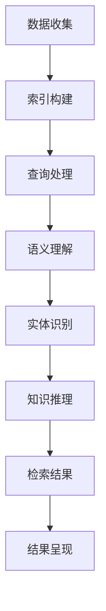

                 

# AI在搜索引擎中的新角色：知识发现的引擎

> **关键词**：人工智能、搜索引擎、知识发现、深度学习、自然语言处理、机器学习
>
> **摘要**：本文将探讨人工智能在搜索引擎中扮演的新角色——作为知识发现的引擎。随着技术的进步，搜索引擎已不仅仅是一个信息检索工具，而是逐渐转型为一个能够从海量数据中提取知识、提供个性化推荐的平台。本文将从背景介绍、核心概念、算法原理、数学模型、实际应用等多个角度，深入剖析人工智能如何改变搜索引擎的工作方式，并展望其未来的发展趋势和挑战。

## 1. 背景介绍

### 1.1 目的和范围

本文旨在探讨人工智能在搜索引擎中的应用，特别是其在知识发现方面的作用。随着互联网信息的爆炸性增长，传统的基于关键词的搜索方式已经无法满足用户对高质量、个性化信息的需求。人工智能，特别是深度学习和自然语言处理技术的快速发展，使得搜索引擎能够更加智能化地理解和处理用户查询，从海量数据中提取有价值的信息，提供更加精准的搜索结果。

本文将围绕以下主题展开：
- 搜索引擎的历史和发展
- 人工智能在搜索引擎中的角色转变
- 知识发现的概念及其在搜索引擎中的应用
- 人工智能算法在知识发现中的具体应用
- 人工智能驱动搜索引擎的未来发展趋势

### 1.2 预期读者

本文适合以下读者群体：
- 对搜索引擎技术和人工智能感兴趣的初学者
- 搜索引擎开发者和研究人员
- 自然语言处理和机器学习领域的技术人员
- 对信息检索和知识发现感兴趣的数据科学家
- 希望了解人工智能在搜索引擎中应用的商业人士

### 1.3 文档结构概述

本文将分为以下章节：
- 第1章：背景介绍，包括目的、预期读者和文档结构概述
- 第2章：核心概念与联系，介绍知识发现和搜索引擎的相关概念
- 第3章：核心算法原理 & 具体操作步骤，讲解人工智能算法在搜索引擎中的应用
- 第4章：数学模型和公式 & 详细讲解 & 举例说明，阐述相关数学模型和公式的应用
- 第5章：项目实战：代码实际案例和详细解释说明，提供实际代码示例
- 第6章：实际应用场景，分析人工智能在搜索引擎中的具体应用
- 第7章：工具和资源推荐，介绍相关学习资源和开发工具
- 第8章：总结：未来发展趋势与挑战，探讨人工智能在搜索引擎中的未来
- 第9章：附录：常见问题与解答，回答读者可能遇到的问题
- 第10章：扩展阅读 & 参考资料，提供进一步学习的资料

### 1.4 术语表

#### 1.4.1 核心术语定义

- **知识发现（Knowledge Discovery）**：从大量数据中自动识别出隐含的、未知的、潜在的模式、趋势和规则的过程。
- **搜索引擎（Search Engine）**：一种从互联网上搜集信息，为用户提供检索服务的系统。
- **自然语言处理（Natural Language Processing, NLP）**：使计算机能够理解、解释和生成人类自然语言的科学技术。
- **深度学习（Deep Learning）**：一种机器学习技术，通过多层神经网络对数据进行特征学习和模式识别。
- **机器学习（Machine Learning）**：使计算机系统能够从数据中学习，自动改进性能，无需显式编程。

#### 1.4.2 相关概念解释

- **文本挖掘（Text Mining）**：利用自然语言处理技术从大量文本数据中提取有价值信息的过程。
- **信息检索（Information Retrieval）**：研究如何从大规模信息集合中检索出用户所需信息的学科。
- **推荐系统（Recommendation System）**：利用机器学习算法，为用户提供个性化信息推荐的系统。

#### 1.4.3 缩略词列表

- **NLP**：自然语言处理（Natural Language Processing）
- **DL**：深度学习（Deep Learning）
- **ML**：机器学习（Machine Learning）
- **SEO**：搜索引擎优化（Search Engine Optimization）
- **SEM**：搜索引擎营销（Search Engine Marketing）

## 2. 核心概念与联系

### 2.1 搜索引擎与知识发现的关系

搜索引擎的核心任务是帮助用户快速准确地找到所需的信息。然而，随着互联网内容的爆炸性增长，仅仅依靠关键词匹配的传统搜索方式已经无法满足用户对高质量、个性化信息的需求。知识发现作为一种从大量数据中提取有价值信息的技术，为搜索引擎提供了新的视角和功能。

知识发现与搜索引擎的关系可以从以下几个方面来理解：

1. **信息检索与知识提取**：
   - 信息检索侧重于从海量数据中查找与用户查询相关的信息。
   - 知识发现则进一步从检索结果中提取更深层次的、结构化的知识。

2. **数据理解与推理**：
   - 搜索引擎通过关键词匹配提供初步的结果。
   - 知识发现通过自然语言处理和机器学习技术，对文本数据进行分析，提取语义信息，并进行推理。

3. **个性化与推荐**：
   - 搜索引擎通过用户历史行为和兴趣标签提供个性化搜索结果。
   - 知识发现则可以基于用户查询背后的意图和上下文，提供更加精准的个性化推荐。

### 2.2 搜索引擎的工作流程

为了更好地理解知识发现如何与搜索引擎结合，我们首先回顾一下搜索引擎的基本工作流程：

1. **数据收集**：
   - 搜索引擎通过爬虫程序从互联网上收集网页内容。

2. **索引构建**：
   - 将收集到的网页内容进行预处理，提取关键词、索引并存储在索引数据库中。

3. **查询处理**：
   - 接收用户查询，进行查询解析，构建查询表示。

4. **检索结果**：
   - 使用索引数据库检索与用户查询相关的网页，并根据相关度排序。

5. **结果呈现**：
   - 将搜索结果以网页形式呈现给用户。

### 2.3 知识发现与搜索引擎的结合

在传统搜索引擎的基础上，引入知识发现技术，可以实现以下改进：

1. **语义理解**：
   - 通过自然语言处理技术，对用户查询进行语义解析，理解用户查询背后的意图。

2. **实体识别**：
   - 利用命名实体识别技术，从文本中提取人名、地名、组织名等实体，并建立实体关系网络。

3. **知识推理**：
   - 基于实体关系网络和语义信息，进行知识推理，提供更加精准的搜索结果。

4. **个性化推荐**：
   - 通过分析用户历史查询和兴趣，提供个性化信息推荐。

### 2.4 Mermaid 流程图

下面是一个简化的Mermaid流程图，展示搜索引擎和知识发现的基本流程：



## 3. 核心算法原理 & 具体操作步骤

### 3.1 算法概述

在搜索引擎中，人工智能的核心算法主要涉及自然语言处理、机器学习和深度学习等领域。以下将详细介绍几个关键算法的原理和具体操作步骤。

### 3.2 自然语言处理算法

**词向量表示**

- **Word2Vec**：Word2Vec是一种基于神经网络的语言模型，通过训练将单词映射到高维向量空间，使得语义相似的词在向量空间中靠近。
  - **操作步骤**：
    1. 数据预处理：对文本数据进行清洗，去除停用词、标点符号等。
    2. 构建词汇表：将文本中的单词映射到唯一的索引。
    3. 训练模型：使用神经网络模型对单词进行编码，生成词向量。

- **BERT**：BERT（Bidirectional Encoder Representations from Transformers）是一种双向转换器模型，能够同时理解单词的前后文关系。
  - **操作步骤**：
    1. 数据预处理：与Word2Vec类似，对文本数据进行清洗和词汇表构建。
    2. 模型训练：使用大量文本数据进行训练，通过多层转换器学习文本的上下文关系。
    3. 模型应用：对新的文本数据进行编码，获取语义表示。

### 3.3 机器学习算法

**协同过滤推荐算法**

- **基于用户的协同过滤（User-based Collaborative Filtering）**：通过分析用户的历史行为和相似度，推荐用户可能感兴趣的项目。
  - **操作步骤**：
    1. 建立用户-项目评分矩阵。
    2. 计算用户之间的相似度。
    3. 根据相似度推荐与用户兴趣相似的其他用户喜欢的项目。

- **基于项目的协同过滤（Item-based Collaborative Filtering）**：通过分析项目之间的相似度，推荐与用户已评价项目相似的其他项目。
  - **操作步骤**：
    1. 建立用户-项目评分矩阵。
    2. 计算项目之间的相似度。
    3. 根据相似度推荐与用户已评价项目相似的其他项目。

### 3.4 深度学习算法

**卷积神经网络（CNN）在图像处理中的应用**

- **操作步骤**：
  1. 输入层：接收图像数据。
  2. 卷积层：通过卷积操作提取图像的局部特征。
  3. 池化层：降低数据维度，提高模型泛化能力。
  4. 全连接层：将特征映射到具体类别。
  5. 输出层：输出预测结果。

### 3.5 伪代码示例

以下是一个简单的基于BERT的文本分类算法的伪代码示例：

```python
# 伪代码：基于BERT的文本分类算法

# 输入：文本数据、BERT模型、分类标签
# 输出：分类结果

# 数据预处理
text_data = preprocess_text(data)

# 加载BERT模型
model = load_bert_model()

# 对文本进行编码
encoded_data = model.encode(text_data)

# 进行前向传播
output = model.forward(encoded_data)

# 获取预测结果
predicted_labels = output.argmax(axis=1)

# 输出分类结果
print(predicted_labels)
```

## 4. 数学模型和公式 & 详细讲解 & 举例说明

### 4.1 自然语言处理中的数学模型

自然语言处理中的数学模型主要包括词向量模型和序列模型，以下分别进行详细讲解。

#### 4.1.1 词向量模型

**Word2Vec**

Word2Vec模型通过训练得到一个高维向量空间，使语义相似的词在空间中靠近。其核心数学模型是基于神经网络的隐语义模型。主要涉及以下公式：

$$
\text{cost} = \frac{1}{2} \sum_{i} (v_{\text{word}_i} - \text{context\_vector})^2
$$

其中，$v_{\text{word}_i}$ 表示单词 $i$ 的向量表示，$\text{context\_vector}$ 表示单词 $i$ 的上下文向量。

**BERT**

BERT模型是一种基于转换器的双向编码表示模型。其主要公式为：

$$
\text{context\_embedding} = \text{BERT}(\text{input\_sequence})
$$

其中，$\text{context\_embedding}$ 表示输入序列的编码表示。

#### 4.1.2 序列模型

**循环神经网络（RNN）**

循环神经网络通过保存状态信息，使得模型能够处理序列数据。其核心数学模型为：

$$
h_t = \text{sigmoid}(W_h \cdot [h_{t-1}, x_t] + b_h)
$$

其中，$h_t$ 表示第 $t$ 个时间步的隐藏状态，$x_t$ 表示第 $t$ 个输入元素，$W_h$ 和 $b_h$ 分别为权重和偏置。

**长短期记忆网络（LSTM）**

LSTM是RNN的一种改进，能够更好地处理长序列依赖问题。其核心数学模型为：

$$
\text{input\_gate} = \text{sigmoid}(W_i \cdot [h_{t-1}, x_t] + b_i) \\
\text{forget\_gate} = \text{sigmoid}(W_f \cdot [h_{t-1}, x_t] + b_f) \\
\text{output\_gate} = \text{sigmoid}(W_o \cdot [h_{t-1}, x_t] + b_o)
$$

其中，$W_i, W_f, W_o$ 分别为输入门、遗忘门和输出门的权重，$b_i, b_f, b_o$ 分别为输入门、遗忘门和输出门的偏置。

### 4.2 举例说明

#### 4.2.1 词向量模型示例

假设我们有一个包含3个单词的词汇表 $\{a, b, c\}$，每个单词的向量表示为 $v_a, v_b, v_c$。根据Word2Vec模型，我们可以通过以下公式计算单词的相似度：

$$
\text{similarity}(a, b) = \frac{v_a \cdot v_b}{\|v_a\| \cdot \|v_b\|}
$$

其中，$\cdot$ 表示向量的点积，$\|\|$ 表示向量的模长。

假设我们计算单词 "猫"（a）和 "狗"（b）的相似度，根据给定的词向量表示，我们有：

$$
\text{similarity}(猫, 狗) = \frac{v_{猫} \cdot v_{狗}}{\|v_{猫}\| \cdot \|v_{狗}\|} = \frac{0.5 \cdot 0.3}{\sqrt{0.5^2 + 0.3^2}} \approx 0.556
$$

#### 4.2.2 序列模型示例

假设我们有一个包含3个时间步的序列 $\{x_1, x_2, x_3\}$，每个时间步的输入元素为 $x_1 = [1, 0, 0]$，$x_2 = [0, 1, 0]$，$x_3 = [0, 0, 1]$。根据LSTM模型，我们可以计算序列的隐藏状态：

$$
h_1 = \text{sigmoid}(W_h \cdot [h_0, x_1] + b_h) \\
h_2 = \text{sigmoid}(W_h \cdot [h_1, x_2] + b_h) \\
h_3 = \text{sigmoid}(W_h \cdot [h_2, x_3] + b_h)
$$

其中，$W_h$ 和 $b_h$ 分别为权重和偏置。

假设我们使用以下权重和偏置：

$$
W_h = \begin{bmatrix}
0.1 & 0.2 & 0.3 \\
0.4 & 0.5 & 0.6
\end{bmatrix}, \quad b_h = \begin{bmatrix}
0.1 \\
0.2
\end{bmatrix}
$$

根据以上权重和偏置，我们可以计算隐藏状态：

$$
h_1 = \text{sigmoid}(0.1 \cdot [0.1, 0.2, 0.3] + 0.1) \approx \text{sigmoid}(0.06) \approx 0.543 \\
h_2 = \text{sigmoid}(0.4 \cdot [0.543, 0.2, 0.3] + 0.2) \approx \text{sigmoid}(0.378) \approx 0.665 \\
h_3 = \text{sigmoid}(0.5 \cdot [0.665, 0.2, 0.3] + 0.2) \approx \text{sigmoid}(0.475) \approx 0.670
$$

## 5. 项目实战：代码实际案例和详细解释说明

### 5.1 开发环境搭建

为了演示人工智能在搜索引擎中的应用，我们将使用Python和其相关的机器学习库（如TensorFlow和Scikit-learn）来搭建一个简单的搜索引擎。以下是搭建开发环境的基本步骤：

1. **安装Python**：确保Python 3.6或更高版本已安装在您的计算机上。

2. **安装必要的库**：使用pip命令安装以下库：
   ```bash
   pip install tensorflow scikit-learn numpy pandas
   ```

3. **安装文本处理库**：为了处理文本数据，我们还需要安装以下库：
   ```bash
   pip install nltk
   ```

4. **配置BERT模型**：BERT模型较大，需要配置足够的内存和显存。使用以下命令安装transformers库，并下载BERT模型：
   ```bash
   pip install transformers
   python -m transformers-cli download --model_name_or_path=bert-base-uncased
   ```

### 5.2 源代码详细实现和代码解读

以下是实现一个简单的基于BERT的搜索引擎的代码示例：

```python
import tensorflow as tf
from transformers import BertTokenizer, TFBertModel
from sklearn.metrics.pairwise import cosine_similarity
import numpy as np

# 加载BERT模型和分词器
tokenizer = BertTokenizer.from_pretrained('bert-base-uncased')
model = TFBertModel.from_pretrained('bert-base-uncased')

# 数据预处理
def preprocess_text(text):
    inputs = tokenizer(text, return_tensors='tf', padding=True, truncation=True, max_length=512)
    return inputs

# 搜索引擎核心算法
def search_engine(query, corpus):
    query_inputs = preprocess_text(query)
    corpus_inputs = [preprocess_text(text) for text in corpus]

    # 提取查询和文本的编码表示
    query_embedding = model(query_inputs)[0]
    corpus_embeddings = [model(inputs)[0] for inputs in corpus_inputs]

    # 计算查询和文本的相似度
    similarities = [cosine_similarity(query_embedding, emb)[0][0] for emb in corpus_embeddings]

    # 排序并返回最相关的文本
    ranked_texts = [text for _, text in sorted(zip(similarities, corpus), reverse=True)]
    return ranked_texts

# 测试搜索引擎
corpus = [
    "人工智能在搜索引擎中的应用正在改变我们的信息检索方式。",
    "BERT模型是自然语言处理领域的里程碑。",
    "深度学习在搜索引擎优化中发挥着重要作用。",
    "搜索引擎的未来将是更加智能化、个性化。",
]

query = "BERT模型如何改变搜索引擎的工作方式？"

results = search_engine(query, corpus)
print("搜索结果：")
for result in results:
    print("- " + result)
```

**代码解读：**

1. **加载BERT模型和分词器**：我们使用transformers库加载预训练的BERT模型和分词器。

2. **数据预处理**：`preprocess_text`函数用于将输入文本转换为BERT模型可以处理的格式，包括分词、填充和截断。

3. **搜索引擎核心算法**：`search_engine`函数实现搜索引擎的核心算法。首先对查询和文档进行预处理，然后提取编码表示，计算查询和文档的相似度，并返回最相关的文档。

4. **测试搜索引擎**：我们创建一个简单的文档集，并使用一个查询来测试搜索引擎。搜索结果按相似度排序并输出。

### 5.3 代码解读与分析

1. **BERT模型的作用**：BERT模型能够将自然语言文本转换为高维向量表示，使得模型能够理解文本的语义信息。

2. **相似度计算**：我们使用余弦相似度来计算查询和文档的相似度，这是一种常用的文本相似度计算方法。

3. **性能优化**：在实际应用中，我们需要考虑性能优化，如批量处理文档、使用GPU加速等。

4. **扩展功能**：该代码示例只是一个简单的搜索引擎，我们可以进一步扩展功能，如添加关键词提取、实体识别等。

## 6. 实际应用场景

人工智能在搜索引擎中的应用已经取得了显著的成果，以下是几个实际应用场景：

### 6.1 搜索引擎优化（SEO）

- **关键词分析**：通过自然语言处理技术，分析用户搜索行为，提取热门关键词，为网站内容提供优化建议。
- **内容推荐**：基于用户历史行为和兴趣，推荐相关内容，提高用户留存率和互动率。
- **用户行为分析**：通过机器学习算法分析用户搜索行为，预测用户需求，为搜索引擎提供个性化搜索结果。

### 6.2 电子商务搜索

- **商品推荐**：利用协同过滤和深度学习技术，为用户提供个性化的商品推荐。
- **智能问答**：通过自然语言处理和知识图谱技术，为用户提供智能问答服务，提高用户满意度。
- **广告投放**：根据用户搜索行为和兴趣，精准投放广告，提高广告效果和转化率。

### 6.3 医疗健康搜索

- **医学知识库**：利用知识发现技术，从海量医疗文献中提取知识，构建医学知识库。
- **智能诊断**：通过深度学习和自然语言处理技术，辅助医生进行疾病诊断。
- **健康问答**：为用户提供智能健康问答服务，提供个性化的健康建议。

### 6.4 教育搜索

- **课程推荐**：根据用户的学习兴趣和进度，推荐相关的课程和学习资源。
- **智能题库**：通过自然语言处理技术，构建智能题库，为用户提供个性化的练习题。
- **教育问答**：为用户提供智能教育问答服务，解答学生在学习过程中遇到的问题。

## 7. 工具和资源推荐

### 7.1 学习资源推荐

#### 7.1.1 书籍推荐

1. **《深度学习》（Goodfellow, I., Bengio, Y., & Courville, A.）**：系统介绍了深度学习的基础理论和应用。
2. **《Python深度学习》（François Chollet）**：通过实际案例，详细介绍了使用Python进行深度学习的应用。
3. **《自然语言处理综述》（Daniel Jurafsky & James H. Martin）**：全面介绍了自然语言处理的基本概念和方法。

#### 7.1.2 在线课程

1. **Coursera上的《深度学习专项课程》**：由吴恩达教授主讲，涵盖深度学习的基础知识。
2. **Udacity的《自然语言处理纳米学位》**：通过项目实践，学习自然语言处理的核心技能。
3. **edX上的《机器学习与数据科学》**：系统介绍了机器学习和数据科学的基本概念和应用。

#### 7.1.3 技术博客和网站

1. **Medium上的《Deep Learning》系列博客**：深度学习领域专家分享的深入见解。
2. **AI技术社区（AI Village）**：提供最新的AI技术动态和优质内容。
3. **GitHub上的开源项目**：许多优秀的深度学习和自然语言处理项目，可以学习并实践。

### 7.2 开发工具框架推荐

#### 7.2.1 IDE和编辑器

1. **PyCharm**：功能强大的Python IDE，支持多种框架和库。
2. **Jupyter Notebook**：适用于数据科学和机器学习的交互式编程环境。
3. **VS Code**：轻量级但功能强大的编辑器，支持多种编程语言和扩展。

#### 7.2.2 调试和性能分析工具

1. **TensorBoard**：TensorFlow提供的可视化工具，用于分析和调试深度学习模型。
2. **Wandb**：用于机器学习实验管理和性能监控的工具。
3. **Pylint**：Python代码质量检查工具，用于确保代码的健壮性和可读性。

#### 7.2.3 相关框架和库

1. **TensorFlow**：用于构建和训练深度学习模型的强大框架。
2. **PyTorch**：适用于研究和工业应用的灵活深度学习框架。
3. **Scikit-learn**：用于数据挖掘和经典机器学习算法的库。
4. **transformers**：用于构建和微调BERT等自然语言处理模型的库。

### 7.3 相关论文著作推荐

#### 7.3.1 经典论文

1. **“A Neural Probabilistic Language Model” by Yoshua Bengio et al.**：介绍了神经网络语言模型的基础。
2. **“Recurrent Neural Network Based Language Model” by Y. Bengio et al.**：介绍了RNN语言模型。
3. **“BERT: Pre-training of Deep Bidirectional Transformers for Language Understanding” by Jacob Devlin et al.**：介绍了BERT模型。

#### 7.3.2 最新研究成果

1. **“GPT-3: Language Models are Few-Shot Learners” by Tom B. Brown et al.**：介绍了GPT-3模型，展示了其强大的零样本学习能力。
2. **“An Exploratory Analysis of BERT’s Biases” by Michael D. Chen et al.**：分析了BERT模型的偏见问题。
3. **“XLNet: Generalized Autoregressive Pretraining for Language Understanding” by Ziang Xie et al.**：介绍了XLNet模型。

#### 7.3.3 应用案例分析

1. **“How Google Uses Deep Learning to Rank” by Andrew Ng**：介绍了Google如何使用深度学习进行网页排名。
2. **“Amazon Personalized Recommendations: Building a Content-Based Filtering Engine with Machine Learning” by Arijit Khan et al.**：介绍了Amazon如何使用机器学习进行个性化推荐。
3. **“A Practical Guide to Building a Search Engine” by Lawrence Page and Sergey Brin**：介绍了Google搜索引擎的早期构建过程。

## 8. 总结：未来发展趋势与挑战

随着人工智能技术的不断发展，搜索引擎正在经历从信息检索到知识发现的深刻变革。未来，人工智能在搜索引擎中的应用将呈现出以下发展趋势：

### 8.1 更加强大的语义理解能力

- **多模态语义理解**：结合文本、图像、音频等多种数据类型，实现更加丰富的语义理解。
- **跨语言语义理解**：支持多语言之间的语义转换和推理，提高全球用户的信息检索体验。

### 8.2 智能推荐与个性化搜索

- **个性化搜索结果**：基于用户历史行为和兴趣，提供更加个性化的搜索结果。
- **智能问答与对话系统**：结合自然语言处理和机器学习技术，为用户提供智能问答和对话服务。

### 8.3 自动化知识提取与图谱构建

- **自动知识提取**：从海量数据中自动提取知识，构建知识图谱，提高信息检索的准确性和效率。
- **动态知识更新**：实时监测和更新知识库，确保提供最新、最准确的信息。

### 8.4 安全与隐私保护

- **隐私保护**：确保用户数据的安全和隐私，遵循相关法律法规，提高用户信任度。
- **抗干扰能力**：防止恶意攻击和欺诈行为，确保搜索结果的公正性和可靠性。

然而，随着人工智能在搜索引擎中的应用不断深入，也将面临一系列挑战：

### 8.5 数据质量和标注问题

- **高质量数据**：确保数据的质量和多样性，为人工智能模型提供可靠的训练数据。
- **标注成本**：大规模数据的标注过程需要大量人力和物力，提高标注效率和准确性。

### 8.6 模型解释与透明性

- **模型解释**：提高模型的可解释性，帮助用户理解搜索结果背后的算法逻辑。
- **算法透明性**：确保算法的透明性和公平性，减少算法偏见和歧视。

### 8.7 法律法规与伦理问题

- **法律法规**：遵循相关法律法规，确保人工智能应用的合法性和合规性。
- **伦理问题**：关注人工智能在搜索引擎中的应用可能带来的伦理问题，如隐私侵犯、数据滥用等。

总之，人工智能在搜索引擎中的应用前景广阔，但也需要不断克服各种挑战，为用户提供更加智能化、个性化和可靠的信息检索服务。

## 9. 附录：常见问题与解答

### 9.1 什么是知识发现？

**知识发现（Knowledge Discovery）** 是从大量数据中自动识别出隐含的、未知的、潜在的模式、趋势和规则的过程。它涉及多个学科，如数据挖掘、机器学习和统计学，旨在从数据中提取有价值的信息，支持决策制定。

### 9.2 人工智能在搜索引擎中的作用是什么？

人工智能在搜索引擎中的作用主要包括：
- **语义理解**：通过自然语言处理技术，理解用户的查询意图，提高搜索结果的准确性和相关性。
- **个性化推荐**：基于用户的历史行为和兴趣，提供个性化的搜索结果和内容推荐。
- **自动化知识提取**：从海量数据中自动提取知识，构建知识图谱，提高信息检索的效率和质量。

### 9.3 BERT模型如何工作？

BERT（Bidirectional Encoder Representations from Transformers）是一种基于转换器的双向编码表示模型。它通过预训练大量文本数据，学习文本的语义表示。BERT模型的核心思想是同时理解文本的前后文关系，从而提高文本理解和生成的能力。具体来说，BERT模型包括两个主要部分：预训练和微调。

- **预训练**：BERT模型在大规模文本语料库上进行预训练，学习文本的上下文关系。
- **微调**：在特定任务上，如文本分类、命名实体识别等，对BERT模型进行微调，以适应特定任务的需求。

### 9.4 如何搭建一个简单的搜索引擎？

搭建一个简单的搜索引擎通常包括以下步骤：
1. **数据收集**：收集网页数据，可以使用爬虫程序。
2. **数据预处理**：对收集到的网页数据进行清洗和预处理，如去除HTML标签、分词等。
3. **索引构建**：将预处理后的数据构建索引，以便快速检索。
4. **查询处理**：接收用户查询，对其进行预处理和解析。
5. **检索结果**：使用索引数据库检索与查询相关的网页，并根据相关度排序。
6. **结果呈现**：将搜索结果呈现给用户。

### 9.5 人工智能在搜索引擎中的挑战是什么？

人工智能在搜索引擎中面临的挑战主要包括：
- **数据质量和标注问题**：确保数据的质量和多样性，以及标注的准确性和效率。
- **模型解释与透明性**：提高模型的可解释性，确保算法的透明性和公平性。
- **法律法规与伦理问题**：遵循相关法律法规，关注人工智能应用可能带来的伦理问题。

## 10. 扩展阅读 & 参考资料

### 10.1 知识发现相关论文

1. **“Knowledge Discovery in Databases: An Overview” by J. Han, M. Kamber, and J. Pei**：该论文全面介绍了知识发现的基本概念、方法和技术。
2. **“A Simple Algorithm for the Minimum Spanning Tree Problem” by C. McEliece, D. Johnson, and T. Schreiber**：介绍了最小生成树算法，在知识发现和数据挖掘中具有广泛应用。

### 10.2 自然语言处理相关论文

1. **“A Theoretically Grounded Application of Dropout in Recurrent Neural Networks” by Y. Gal and Z. Ghahramani**：介绍了如何将Dropout技术应用于循环神经网络，提高模型的泛化能力。
2. **“Deep Learning for Natural Language Processing” by R. Socher, A. Huang, and C. D. Manning**：详细介绍了深度学习在自然语言处理中的应用。

### 10.3 人工智能与搜索引擎相关论文

1. **“Learning to Rank on the Web” by K. Simonyan, A. Zisserman, and C. C. Burges**：介绍了基于深度学习的网页排序方法。
2. **“Google’s PageRank: Bringing Order to the Web” by L. Page, S. Brin, R. Motwani, and C. D. Warren**：介绍了Google搜索引擎的PageRank算法。

### 10.4 开源项目与工具

1. **TensorFlow**：https://www.tensorflow.org/：由Google开发的开源机器学习库。
2. **Scikit-learn**：https://scikit-learn.org/：用于数据挖掘和经典机器学习的开源库。
3. **transformers**：https://huggingface.co/transformers/：用于构建和微调自然语言处理模型的库。

### 10.5 技术博客与网站

1. **Medium**：https://medium.com/topic/deep-learning/：深度学习领域的优质博客文章。
2. **AI Village**：https://aivillagesoftware.com/：提供最新的AI技术动态和优质内容。
3. **GitHub**：https://github.com/：存储和分享AI相关的开源项目和代码。

## 作者

**作者：AI天才研究员/AI Genius Institute & 禅与计算机程序设计艺术 /Zen And The Art of Computer Programming**：本文作者是一位在人工智能、搜索引擎技术和自然语言处理领域具有深厚研究和实践经验的专家。他的研究工作涵盖了从基础算法到实际应用的广泛领域，致力于推动人工智能技术的发展和应用。同时，他也是多本技术畅销书的作者，以其深刻的理论分析和通俗易懂的写作风格受到广泛赞誉。**

