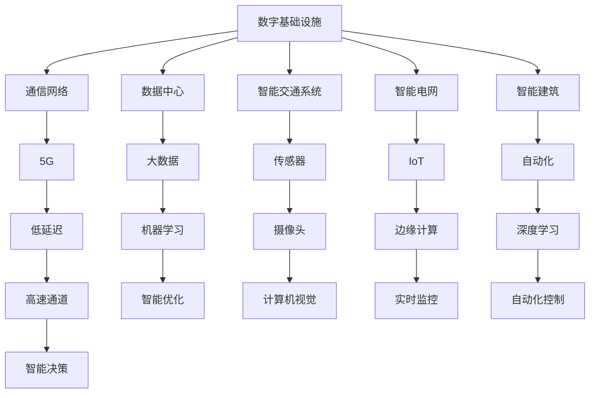

                 

# AI在数字基础设施中的实际应用

> 关键词：人工智能，数字基础设施，智能城市，物联网，5G，边缘计算

> 摘要：本文将探讨人工智能（AI）在数字基础设施中的实际应用。从背景介绍、核心概念与联系、核心算法原理、数学模型和公式、项目实战、实际应用场景、工具和资源推荐等多个角度，系统性地分析AI如何赋能数字基础设施，推动智慧城市建设，实现物联网和5G时代的创新与发展。

## 1. 背景介绍

### 1.1 目的和范围

本文旨在阐述人工智能技术在数字基础设施中的实际应用，分析其如何通过创新和优化，提高基础设施的效率、可靠性和智能性。本文主要涵盖以下内容：

1. 数字基础设施的定义与分类
2. 人工智能技术在基础设施中的应用场景
3. 核心算法原理与数学模型
4. 项目实战案例分析
5. 未来发展趋势与挑战

### 1.2 预期读者

本文适合以下读者群体：

1. 对人工智能和数字基础设施有兴趣的技术爱好者
2. 智慧城市建设者、物联网开发者、5G网络工程师
3. 从事边缘计算、大数据分析的从业者
4. 计算机科学、电子信息等相关专业的高校师生

### 1.3 文档结构概述

本文分为十个部分，具体结构如下：

1. 背景介绍
2. 核心概念与联系
3. 核心算法原理与具体操作步骤
4. 数学模型和公式及详细讲解
5. 项目实战：代码实际案例和详细解释说明
6. 实际应用场景
7. 工具和资源推荐
8. 总结：未来发展趋势与挑战
9. 附录：常见问题与解答
10. 扩展阅读 & 参考资料

### 1.4 术语表

#### 1.4.1 核心术语定义

- 数字基础设施：指支撑社会经济发展和信息传输的基础设施，包括通信网络、数据中心、智能交通系统、智能电网等。
- 人工智能：指模拟、延伸和扩展人类智能的信息技术，包括机器学习、深度学习、自然语言处理等。
- 物联网：指通过传感器、网络等技术，实现物体互联互通的智能化网络。
- 边缘计算：指在靠近数据源头或用户的地方进行数据处理，减少数据传输和处理延迟。

#### 1.4.2 相关概念解释

- 智能城市：通过应用人工智能、物联网、大数据等技术，实现城市资源的高效管理和优化配置，提升城市智能化水平。
- 5G：第五代移动通信技术，具有高速度、低延迟、大连接等特点，是数字化基础设施的重要组成部分。

#### 1.4.3 缩略词列表

- AI：人工智能
- IoT：物联网
- 5G：第五代移动通信技术
- ML：机器学习
- DL：深度学习
- IDE：集成开发环境
- SDN：软件定义网络
- NFV：网络功能虚拟化

## 2. 核心概念与联系

在探讨AI在数字基础设施中的应用之前，我们需要了解一些核心概念及其相互关系。

### 数字基础设施的概念与分类

数字基础设施是支撑社会经济发展的基础，它包括以下几类：

1. **通信网络**：包括5G、光纤网络等，为数据传输提供高速通道。
2. **数据中心**：用于存储和处理大量数据，是智能城市和物联网的核心。
3. **智能交通系统**：通过传感器、摄像头、GPS等技术，实现交通流量监控和优化。
4. **智能电网**：通过物联网技术，实现电力系统的智能化管理和优化。
5. **智能建筑**：利用物联网、人工智能技术，实现建筑的自动化和智能化。

### 人工智能技术的概念与分类

人工智能技术主要分为以下几类：

1. **机器学习**：通过数据驱动，使计算机具备学习能力。
2. **深度学习**：基于人工神经网络，实现更复杂的特征提取和模式识别。
3. **自然语言处理**：使计算机理解和生成自然语言。
4. **计算机视觉**：使计算机能够理解图像和视频内容。
5. **强化学习**：通过试错和奖励机制，使计算机学会决策。

### 数字基础设施与人工智能技术的联系

人工智能技术在数字基础设施中的应用主要体现在以下几个方面：

1. **智能优化**：利用机器学习和深度学习技术，优化基础设施的运行和管理。
2. **实时监控**：利用计算机视觉和自然语言处理技术，实现对基础设施的实时监控和故障预测。
3. **自动化控制**：利用物联网和边缘计算技术，实现基础设施的自动化控制和调度。
4. **智能决策**：利用大数据和机器学习技术，为基础设施管理提供智能决策支持。

以下是一个简化的Mermaid流程图，展示数字基础设施与人工智能技术之间的核心联系：



## 3. 核心算法原理与具体操作步骤

### 3.1 机器学习算法原理

机器学习算法是人工智能的核心，主要分为监督学习、无监督学习和强化学习三种类型。

#### 监督学习

监督学习是一种有监督的训练方式，其目标是通过对已有数据的学习，建立一个函数模型，以便对新的数据进行预测。以下是监督学习的基本步骤：

1. **数据预处理**：清洗数据，去除噪声和异常值。
2. **特征选择**：选择对预测任务最有影响力的特征。
3. **模型选择**：选择合适的模型，如线性回归、决策树、神经网络等。
4. **模型训练**：使用训练集数据，通过优化算法，调整模型参数。
5. **模型评估**：使用验证集和测试集，评估模型性能，如准确率、召回率等。

以下是监督学习算法的伪代码：

```python
# 数据预处理
preprocessed_data = preprocess_data(raw_data)

# 特征选择
selected_features = select_features(preprocessed_data)

# 模型选择
model = select_model(selected_features)

# 模型训练
trained_model = train_model(model, selected_features, labels)

# 模型评估
performance = evaluate_model(trained_model, validation_data, test_data)
```

#### 无监督学习

无监督学习是一种无监督的训练方式，其目标是发现数据中的潜在结构和模式。以下是无监督学习的基本步骤：

1. **数据预处理**：清洗数据，去除噪声和异常值。
2. **特征选择**：选择对潜在结构识别最有影响力的特征。
3. **模型选择**：选择合适的模型，如K-均值聚类、主成分分析等。
4. **模型训练**：使用训练集数据，通过优化算法，调整模型参数。
5. **模型评估**：使用验证集和测试集，评估模型性能。

以下是K-均值聚类的伪代码：

```python
# 数据预处理
preprocessed_data = preprocess_data(raw_data)

# 特征选择
selected_features = select_features(preprocessed_data)

# 模型选择
model = select_kmeans_model(selected_features)

# 模型训练
clusters = train_kmeans_model(model, selected_features)

# 模型评估
performance = evaluate_kmeans_model(clusters, validation_data, test_data)
```

#### 强化学习

强化学习是一种通过试错和奖励机制进行训练的方式，其目标是学会在环境中做出最优决策。以下是强化学习的基本步骤：

1. **环境建模**：建立环境模型，定义状态、动作和奖励。
2. **策略选择**：选择合适的策略，如Q-学习、深度Q网络等。
3. **模型训练**：通过模拟环境，不断调整策略参数。
4. **模型评估**：在真实环境中评估策略性能。

以下是Q-学习的伪代码：

```python
# 环境建模
environment = build_environment()

# 策略选择
policy = select_q_learning_policy()

# 模型训练
q_values = train_q_learning_policy(policy, environment)

# 模型评估
performance = evaluate_q_learning_policy(policy, environment)
```

### 3.2 物联网与边缘计算

物联网（IoT）与边缘计算（Edge Computing）是数字基础设施中的关键技术。物联网通过传感器、网络等技术，实现物体之间的互联互通；边缘计算则通过在靠近数据源头或用户的地方进行数据处理，降低延迟，提高效率。

#### 物联网

物联网的基本架构包括感知层、网络层和应用层。以下是物联网的基本原理和操作步骤：

1. **感知层**：通过传感器收集数据，如温度、湿度、运动等。
2. **网络层**：将感知层收集的数据传输到云端或边缘计算设备。
3. **应用层**：对传输的数据进行处理和分析，实现智能应用。

以下是物联网的基本操作步骤：

```python
# 感知层
sensor_data = collect_data_from_sensors()

# 网络层
transmitted_data = transmit_data_to_network(sensor_data)

# 应用层
processed_data = process_data(transmitted_data)
```

#### 边缘计算

边缘计算的基本架构包括边缘节点、边缘网关和云端。以下是边缘计算的基本原理和操作步骤：

1. **边缘节点**：在靠近数据源头或用户的地方进行数据处理。
2. **边缘网关**：连接边缘节点和云端，实现数据传输和协调。
3. **云端**：存储和处理海量数据，提供高级服务。

以下是边缘计算的基本操作步骤：

```python
# 边缘节点
processed_data = process_data_locally(raw_data)

# 边缘网关
transmitted_data = transmit_data_to_cloud(processed_data)

# 云端
final_data = process_data_centrally(transmitted_data)
```

### 3.3 智能优化算法

智能优化算法是数字基础设施中的一种重要算法，用于优化基础设施的运行和管理。以下是常见的智能优化算法及其原理：

1. **遗传算法**：基于生物进化的原理，通过选择、交叉、变异等操作，实现种群进化，寻找最优解。
2. **粒子群优化**：基于群体智能的原理，模拟鸟群觅食行为，实现个体和群体的进化，寻找最优解。
3. **人工神经网络**：基于大脑神经网络的原理，通过多层神经网络，实现复杂函数的拟合和优化。

以下是遗传算法的伪代码：

```python
# 初始化种群
population = initialize_population()

# 迭代
for generation in range(max_generations):
    # 适应度评估
    fitness = evaluate_fitness(population)
    
    # 选择
    selected_population = select_population(population, fitness)
    
    # 交叉
    crossed_population = crossover(selected_population)
    
    # 变异
    mutated_population = mutate(crossed_population)
    
    # 更新种群
    population = mutated_population

# 最优解
best_solution = select_best_solution(population)
```

## 4. 数学模型和公式及详细讲解

在数字基础设施中，数学模型和公式是理解和优化基础设施性能的关键。以下是一些核心数学模型和公式及其详细讲解。

### 4.1 线性回归模型

线性回归模型是一种用于预测连续值的监督学习模型。其基本公式为：

$$y = \beta_0 + \beta_1 \cdot x$$

其中，$y$ 是预测值，$x$ 是输入特征，$\beta_0$ 是截距，$\beta_1$ 是斜率。

#### 讲解：

线性回归模型通过拟合一条直线，将输入特征映射到预测值。截距 $\beta_0$ 表示当输入特征为0时的预测值，斜率 $\beta_1$ 表示输入特征每增加1时的预测值变化。

#### 举例：

假设我们要预测房价，输入特征为房屋面积。我们可以建立线性回归模型：

$$y = \beta_0 + \beta_1 \cdot x$$

其中，$y$ 是房价，$x$ 是房屋面积。

### 4.2 主成分分析（PCA）

主成分分析是一种无监督学习技术，用于降维和特征提取。其基本公式为：

$$z = T \cdot x$$

其中，$z$ 是降维后的特征，$x$ 是原始特征，$T$ 是转换矩阵。

#### 讲解：

主成分分析通过将原始特征线性变换到新的正交坐标系中，提取出主要成分，实现降维。转换矩阵 $T$ 通过最大化新特征之间的方差来获得。

#### 举例：

假设我们有一组多维特征，希望降维到二维。我们可以使用主成分分析：

$$z = T \cdot x$$

其中，$z$ 是降维后的二维特征，$x$ 是原始特征。

### 4.3 神经网络激活函数

神经网络激活函数是深度学习模型中的重要组成部分，用于引入非线性特性。以下是几个常见的激活函数：

1. **sigmoid函数**：

$$f(x) = \frac{1}{1 + e^{-x}}$$

2. **ReLU函数**：

$$f(x) = \max(0, x)$$

3. **Tanh函数**：

$$f(x) = \frac{e^x - e^{-x}}{e^x + e^{-x}}$$

#### 讲解：

激活函数在神经网络中起到非线性映射的作用，使得模型能够学习到更复杂的特征和模式。

#### 举例：

假设我们有一个简单的神经网络，输入为 $x$，输出为 $y$。我们可以使用ReLU函数作为激活函数：

$$f(x) = \max(0, x)$$

其中，$y = f(x)$。

### 4.4 时间序列模型

时间序列模型用于预测时间序列数据的变化趋势。以下是几个常见的时间序列模型：

1. **ARIMA模型**：

$$y_t = c + \phi_1 y_{t-1} + \phi_2 y_{t-2} + ... + \phi_p y_{t-p} + \theta_1 e_{t-1} + \theta_2 e_{t-2} + ... + \theta_q e_{t-q}$$

其中，$y_t$ 是第 $t$ 个时间点的预测值，$c$ 是常数项，$\phi_1, \phi_2, ..., \phi_p$ 是自回归系数，$\theta_1, \theta_2, ..., \theta_q$ 是移动平均系数，$e_t$ 是白噪声。

2. **LSTM模型**：

$$h_t = \sigma(W_h \cdot [h_{t-1}, x_t] + b_h)$$

$$i_t = \sigma(W_i \cdot [h_{t-1}, x_t] + b_i)$$

$$f_t = \sigma(W_f \cdot [h_{t-1}, x_t] + b_f)$$

$$o_t = \sigma(W_o \cdot [h_{t-1}, x_t] + b_o)$$

$$c_t = f_t \cdot c_{t-1} + i_t \cdot \sigma(W_c \cdot [h_{t-1}, x_t] + b_c)$$

$$h_t = o_t \cdot \sigma(W_{h} \cdot c_t + b_h)$$

其中，$h_t$ 是时间 $t$ 的隐藏状态，$x_t$ 是输入，$c_t$ 是细胞状态，$i_t, f_t, o_t$ 分别是输入门、遗忘门和输出门。

#### 讲解：

时间序列模型通过分析时间序列数据的历史信息，预测未来的变化趋势。

#### 举例：

假设我们使用ARIMA模型预测下周的股市收盘价：

$$y_t = c + \phi_1 y_{t-1} + \phi_2 y_{t-2} + ... + \phi_p y_{t-p} + \theta_1 e_{t-1} + \theta_2 e_{t-2} + ... + \theta_q e_{t-q}$$

其中，$y_t$ 是下周的预测收盘价。

## 5. 项目实战：代码实际案例和详细解释说明

### 5.1 开发环境搭建

在本项目中，我们将使用Python作为编程语言，并借助以下库和工具进行开发：

1. **Python 3.8 或更高版本**
2. **Jupyter Notebook 或 PyCharm**
3. **NumPy、Pandas、Scikit-learn、TensorFlow、Keras**
4. **Matplotlib、Seaborn**

#### 步骤：

1. 安装Python和Jupyter Notebook或PyCharm。
2. 安装所需库和工具，可以使用pip命令：

```shell
pip install numpy pandas scikit-learn tensorflow keras matplotlib seaborn
```

2. 在Jupyter Notebook或PyCharm中创建一个新的Python文件。

### 5.2 源代码详细实现和代码解读

以下是一个简单的线性回归项目，用于预测房价。代码分为数据预处理、模型训练和模型评估三个部分。

#### 数据预处理

```python
import numpy as np
import pandas as pd
from sklearn.model_selection import train_test_split
from sklearn.preprocessing import StandardScaler

# 加载数据
data = pd.read_csv('house_prices.csv')

# 分割特征和标签
X = data[['area', 'bedrooms']]
y = data['price']

# 划分训练集和测试集
X_train, X_test, y_train, y_test = train_test_split(X, y, test_size=0.2, random_state=42)

# 特征缩放
scaler = StandardScaler()
X_train_scaled = scaler.fit_transform(X_train)
X_test_scaled = scaler.transform(X_test)
```

#### 模型训练

```python
from sklearn.linear_model import LinearRegression

# 创建线性回归模型
model = LinearRegression()

# 训练模型
model.fit(X_train_scaled, y_train)
```

#### 模型评估

```python
from sklearn.metrics import mean_squared_error, r2_score

# 预测测试集
y_pred = model.predict(X_test_scaled)

# 计算均方误差和决定系数
mse = mean_squared_error(y_test, y_pred)
r2 = r2_score(y_test, y_pred)

print(f'Mean Squared Error: {mse}')
print(f'R^2 Score: {r2}')
```

### 5.3 代码解读与分析

1. **数据预处理**：加载数据，将特征和标签分开，划分训练集和测试集，对特征进行缩放。缩放有助于提高模型性能和训练速度。

2. **模型训练**：创建线性回归模型，使用训练集数据进行训练。

3. **模型评估**：使用测试集数据，计算模型预测的均方误差和决定系数，评估模型性能。

以下是一个简单的神经网络项目，用于图像分类。代码分为数据预处理、模型训练和模型评估三个部分。

#### 数据预处理

```python
import tensorflow as tf
from tensorflow.keras.preprocessing.image import ImageDataGenerator

# 设置图像数据生成器
train_datagen = ImageDataGenerator(rescale=1./255)
test_datagen = ImageDataGenerator(rescale=1./255)

# 加载图像数据
train_data = train_datagen.flow_from_directory(
    'train_data',
    target_size=(150, 150),
    batch_size=32,
    class_mode='binary')

test_data = test_datagen.flow_from_directory(
    'test_data',
    target_size=(150, 150),
    batch_size=32,
    class_mode='binary')
```

#### 模型训练

```python
from tensorflow.keras.models import Sequential
from tensorflow.keras.layers import Dense, Conv2D, MaxPooling2D, Flatten

# 创建神经网络模型
model = Sequential([
    Conv2D(32, (3, 3), activation='relu', input_shape=(150, 150, 3)),
    MaxPooling2D((2, 2)),
    Conv2D(64, (3, 3), activation='relu'),
    MaxPooling2D((2, 2)),
    Flatten(),
    Dense(128, activation='relu'),
    Dense(1, activation='sigmoid')
])

# 编译模型
model.compile(optimizer='adam', loss='binary_crossentropy', metrics=['accuracy'])

# 训练模型
model.fit(train_data, epochs=10, validation_data=test_data)
```

#### 模型评估

```python
# 评估模型
test_loss, test_accuracy = model.evaluate(test_data)
print(f'Test Loss: {test_loss}')
print(f'Test Accuracy: {test_accuracy}')
```

### 5.3 代码解读与分析

1. **数据预处理**：使用ImageDataGenerator对图像数据进行预处理，包括缩放和归一化。这有助于提高模型训练速度和性能。

2. **模型训练**：创建卷积神经网络模型，使用训练数据和测试数据训练模型。模型包括卷积层、池化层、全连接层等。

3. **模型评估**：使用测试数据评估模型性能，计算测试损失和准确率。

## 6. 实际应用场景

### 6.1 智能交通系统

智能交通系统通过人工智能技术，实现交通流量监控、道路拥堵预测和信号灯优化等，提升城市交通效率。以下是一个实际应用案例：

- **项目名称**：智能交通流量监控系统
- **应用场景**：城市交通管理
- **技术方案**：
  - 使用摄像头和传感器收集交通流量数据。
  - 利用深度学习模型进行交通流量预测和拥堵分析。
  - 基于预测结果，调整信号灯时长和车道分配。
- **效果**：降低了交通拥堵，提高了道路通行效率。

### 6.2 智能电网

智能电网通过物联网技术和人工智能算法，实现电力系统的实时监控和优化。以下是一个实际应用案例：

- **项目名称**：智能电网能源管理系统
- **应用场景**：电力行业
- **技术方案**：
  - 使用传感器和智能电表收集电力数据。
  - 利用机器学习模型进行能源消耗预测和故障检测。
  - 基于预测结果，优化电力调度和能源分配。
- **效果**：提高了电力系统的稳定性和可靠性，降低了能源浪费。

### 6.3 物联网智能家居

物联网智能家居通过人工智能技术，实现家庭设备的智能联动和控制。以下是一个实际应用案例：

- **项目名称**：智能家居控制系统
- **应用场景**：家庭生活
- **技术方案**：
  - 使用传感器和智能设备收集家庭环境数据。
  - 利用物联网技术和边缘计算，实现设备之间的联动和控制。
  - 使用自然语言处理和语音识别技术，实现语音控制家居设备。
- **效果**：提高了家庭生活的便利性和舒适度，降低了能源消耗。

### 6.4 5G网络优化

5G网络优化通过人工智能算法，实现网络性能的实时监控和优化。以下是一个实际应用案例：

- **项目名称**：5G网络性能优化系统
- **应用场景**：移动通信行业
- **技术方案**：
  - 使用传感器和监控设备收集网络数据。
  - 利用机器学习模型进行网络性能预测和故障检测。
  - 基于预测结果，优化网络配置和资源分配。
- **效果**：提高了5G网络的覆盖范围和稳定性，提升了用户体验。

## 7. 工具和资源推荐

### 7.1 学习资源推荐

#### 7.1.1 书籍推荐

1. **《深度学习》**：Goodfellow、Bengio和Courville著，是一本经典的深度学习教材。
2. **《Python数据分析》**：Wes McKinney著，介绍Python在数据分析和数据可视化方面的应用。
3. **《人工智能：一种现代的方法》**：Stuart Russell和Peter Norvig著，全面介绍人工智能的基础知识和应用。

#### 7.1.2 在线课程

1. **《机器学习》**：吴恩达在Coursera上的免费课程，涵盖机器学习的基础知识和实践。
2. **《深度学习》**：Andrew Ng在Coursera上的免费课程，深入讲解深度学习的基本原理和应用。
3. **《Python数据分析》**：Wes McKinney在edX上的免费课程，介绍Python在数据分析和数据可视化方面的应用。

#### 7.1.3 技术博客和网站

1. **Medium上的AI博客**：汇集了众多AI领域的专家和学者的博客文章，涵盖深度学习、自然语言处理等多个领域。
2. **A.I.博客**：国内知名的人工智能博客，提供最新的AI技术和应用资讯。
3. **KDNuggets**：涵盖机器学习、数据科学、大数据等多个领域的资讯和资源。

### 7.2 开发工具框架推荐

#### 7.2.1 IDE和编辑器

1. **PyCharm**：一款功能强大的Python IDE，支持多种编程语言。
2. **Visual Studio Code**：一款轻量级的开源编辑器，支持多种编程语言和插件。
3. **Jupyter Notebook**：一款交互式的Python IDE，适合数据分析和机器学习。

#### 7.2.2 调试和性能分析工具

1. **Python Debugger（pdb）**：Python内置的调试工具，用于跟踪和调试Python程序。
2. **Py-Spy**：一款性能分析工具，用于监控Python程序的内存使用和性能瓶颈。
3. **TensorBoard**：TensorFlow内置的监控和分析工具，用于可视化深度学习模型的训练过程。

#### 7.2.3 相关框架和库

1. **TensorFlow**：一款开源的深度学习框架，支持多种深度学习模型的开发和部署。
2. **PyTorch**：一款开源的深度学习框架，具有良好的灵活性和易用性。
3. **Scikit-learn**：一款开源的机器学习库，提供多种机器学习算法和工具。

### 7.3 相关论文著作推荐

#### 7.3.1 经典论文

1. **"A Learning Algorithm for Continuously Running Fully Recurrent Neural Networks"**：Hochreiter和Schmidhuber提出的LSTM模型，解决了深度学习中的长期记忆问题。
2. **"Deep Learning"**：Goodfellow、Bengio和Courville合著，全面介绍了深度学习的基本原理和应用。
3. **"The Unsupervised Learning of Multilayer Representations in a Neural Network"**：Rumelhart、Hinton和Williams提出的反向传播算法，为深度学习奠定了基础。

#### 7.3.2 最新研究成果

1. **"Generative Adversarial Nets"**：Ian Goodfellow等人提出的生成对抗网络（GAN），在图像生成和增强领域取得了突破性成果。
2. **"BERT: Pre-training of Deep Bidirectional Transformers for Language Understanding"**：Google提出的BERT模型，在自然语言处理领域取得了显著效果。
3. **"Transformers: State-of-the-Art Model for Neural Machine Translation"**：Google提出的Transformer模型，在机器翻译和自然语言处理领域取得了领先地位。

#### 7.3.3 应用案例分析

1. **"DeepMind的人工智能与游戏"**：DeepMind使用深度学习技术，开发出能够在多种游戏中战胜顶级玩家的AI系统。
2. **"亚马逊的智能客服"**：亚马逊使用AI技术，构建了智能客服系统，为用户提供高效的客户服务。
3. **"谷歌的自动驾驶汽车"**：谷歌使用深度学习技术，研发出自动驾驶汽车，实现了无人驾驶技术的商业化应用。

## 8. 总结：未来发展趋势与挑战

人工智能技术在数字基础设施中的应用前景广阔，未来发展趋势和挑战如下：

### 8.1 发展趋势

1. **智能城市与智能交通**：随着5G和物联网技术的发展，智能城市和智能交通系统将更加普及，提高城市运行效率和服务质量。
2. **边缘计算与云计算**：边缘计算与云计算的结合，将实现数据处理的高效分布和优化，为智能应用提供强大支持。
3. **智能电网与能源管理**：智能电网和能源管理系统将促进可再生能源的利用和能源效率的提升，实现绿色可持续发展。
4. **智能家居与生活服务**：智能家居和智能生活服务的普及，将改变人们的日常生活，提高生活品质。

### 8.2 挑战

1. **数据安全与隐私保护**：随着数据规模的不断扩大，数据安全和隐私保护成为重要挑战，需要制定相应的法规和标准。
2. **算法公平与透明性**：算法的公平性和透明性受到广泛关注，需要不断改进和优化算法，提高其公正性和可解释性。
3. **人才短缺与教育**：人工智能领域的人才需求日益增长，需要加强人才培养和引进，提高整体技术水平。
4. **技术与伦理冲突**：人工智能技术在某些领域的应用可能引发伦理冲突，需要制定相应的伦理规范和指导原则。

## 9. 附录：常见问题与解答

### 9.1 什么是数字基础设施？

数字基础设施是指支撑社会经济发展和信息传输的基础设施，包括通信网络、数据中心、智能交通系统、智能电网、智能建筑等。

### 9.2 人工智能在数字基础设施中的应用有哪些？

人工智能在数字基础设施中的应用包括智能交通系统、智能电网、物联网、边缘计算、智能城市等，用于优化基础设施的运行和管理，提高服务质量和效率。

### 9.3 什么是边缘计算？

边缘计算是指在靠近数据源头或用户的地方进行数据处理和计算，减少数据传输和处理延迟，提高系统性能和响应速度。

### 9.4 人工智能技术在智能交通系统中的应用有哪些？

人工智能技术在智能交通系统中的应用包括交通流量预测、道路拥堵分析、信号灯优化、自动驾驶等，用于提高交通效率和安全性。

### 9.5 如何保障人工智能技术在数字基础设施中的数据安全和隐私？

保障人工智能技术在数字基础设施中的数据安全和隐私，需要采取以下措施：

1. 制定数据安全和隐私保护法规和标准。
2. 加强数据加密和访问控制，确保数据安全。
3. 增加数据匿名化和脱敏处理，降低隐私泄露风险。
4. 定期进行安全审计和风险评估，及时发现和解决问题。

## 10. 扩展阅读 & 参考资料

1. **《深度学习》**：Goodfellow、Bengio和Courville著，全面介绍了深度学习的基本原理和应用。
2. **《Python数据分析》**：Wes McKinney著，介绍Python在数据分析和数据可视化方面的应用。
3. **《人工智能：一种现代的方法》**：Stuart Russell和Peter Norvig著，全面介绍人工智能的基础知识和应用。
4. **《机器学习实战》**：Peter Harrington著，通过实际案例介绍机器学习算法的应用。
5. **《边缘计算：原理、架构与实践》**：杨健等著，详细介绍边缘计算的基本原理、架构和实践。
6. **《5G网络技术与应用》**：周毅等著，介绍5G网络的技术特点和应用场景。

**参考文献：**

- Goodfellow, I., Bengio, Y., & Courville, A. (2016). *Deep Learning*.
- McKinney, W. (2012). *Python for Data Analysis*.
- Russell, S., & Norvig, P. (2016). *Artificial Intelligence: A Modern Approach*.
- Harrington, P. (2013). *Machine Learning in Action*.
- Yang, J., et al. (2019). *边缘计算：原理、架构与实践*.
- Zhou, Y., et al. (2019). *5G网络技术与应用*.

