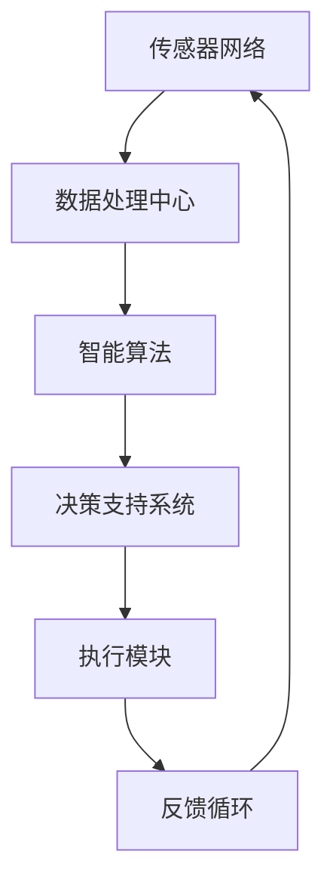

                 

### AI在智能城市中的应用：优化城市管理

> **关键词：** 智能城市、人工智能、城市管理、数据挖掘、机器学习、算法优化
>
> **摘要：** 本文旨在探讨人工智能在智能城市中的应用，以及如何通过算法优化来提升城市管理的效率和效果。我们将从背景介绍开始，逐步深入探讨核心概念、算法原理、数学模型、实际应用，并提供实用的工具和资源推荐，以期为读者提供全面的智能城市解决方案。

智能城市是未来城市发展的重要方向，它依赖于先进的信息技术，特别是人工智能（AI）的应用，以实现城市管理的智能化和精细化。人工智能在智能城市中的应用，不仅仅局限于数据分析和预测，还包括实时监测、决策支持、资源优化等多个方面。通过AI技术，城市管理者可以更加高效地收集、处理和利用城市数据，从而提升城市管理的整体水平。

本文将首先介绍智能城市和人工智能的基本概念，接着分析AI在智能城市中的应用场景，并详细讲解相关算法原理和操作步骤。随后，我们将探讨数学模型和公式，以及如何通过代码实际案例来展示算法的实现过程。最后，我们将探讨智能城市在现实世界中的应用场景，并提供相关的工具和资源推荐，为读者提供进一步学习的途径。

在阅读本文之前，如果您对人工智能和智能城市有一定的了解，这将有助于您更好地理解文章中的技术细节。无论您是城市管理者、AI研究者还是对此领域感兴趣的技术爱好者，本文都将为您提供有价值的见解和实用的知识。

## 1. 背景介绍

### 1.1 目的和范围

本文的目的在于探讨人工智能（AI）在智能城市中的应用，以及如何通过算法优化来提升城市管理的效率和效果。智能城市作为未来城市发展的重要方向，其核心在于利用先进的信息技术，特别是人工智能技术，实现城市管理的智能化和精细化。本文将聚焦以下几个关键方面：

1. **核心概念分析**：我们将首先介绍智能城市和人工智能的基本概念，明确两者的定义、发展和相互关系。
2. **应用场景探讨**：接下来，我们将详细探讨AI在智能城市中的应用场景，包括交通管理、环境监测、公共安全、资源分配等。
3. **算法原理讲解**：本文将深入分析AI在智能城市中的应用算法原理，并通过伪代码详细阐述算法的具体操作步骤。
4. **数学模型讲解**：我们将介绍相关的数学模型和公式，并结合实际案例进行讲解，帮助读者更好地理解这些模型在实际应用中的作用。
5. **项目实战展示**：通过一个具体的代码实现案例，我们将展示算法在实际应用中的具体实现过程，并提供详细的代码解读和分析。
6. **工具和资源推荐**：最后，我们将推荐相关的学习资源和开发工具，为读者提供进一步学习与实践的途径。

### 1.2 预期读者

本文主要面向以下几类读者：

1. **城市管理者**：希望通过AI技术提升城市管理效率和水平的城市管理者。
2. **AI研究者**：对AI在智能城市中的应用感兴趣，希望深入了解相关算法和技术的研究者。
3. **技术爱好者**：对智能城市和人工智能领域有浓厚兴趣，希望了解这一领域前沿动态和技术细节的技术爱好者。
4. **开发者**：希望在智能城市建设中应用AI技术，提升自身开发能力的开发者。

通过本文的阅读，读者可以系统地了解智能城市和人工智能的关系，掌握相关算法原理和实现方法，并为未来的智能城市建设提供有益的参考。

### 1.3 文档结构概述

本文将按照以下结构进行组织：

1. **背景介绍**：介绍智能城市和人工智能的基本概念，阐述本文的目的和预期读者。
2. **核心概念与联系**：通过Mermaid流程图展示智能城市架构，定义核心概念，并解释相关术语。
3. **核心算法原理 & 具体操作步骤**：详细讲解AI在智能城市中的应用算法原理，并提供伪代码阐述操作步骤。
4. **数学模型和公式 & 详细讲解 & 举例说明**：介绍相关的数学模型和公式，并结合实际案例进行讲解。
5. **项目实战：代码实际案例和详细解释说明**：展示一个具体的代码实现案例，并进行详细的解读和分析。
6. **实际应用场景**：探讨智能城市在现实世界中的应用场景。
7. **工具和资源推荐**：推荐相关的学习资源和开发工具，为读者提供进一步学习的途径。
8. **总结：未来发展趋势与挑战**：总结本文的主要内容和观点，探讨未来发展趋势和面临的挑战。
9. **附录：常见问题与解答**：提供常见的疑问和解答，帮助读者更好地理解文章内容。
10. **扩展阅读 & 参考资料**：列出本文引用的相关文献和资料，供读者进一步查阅。

通过上述结构，本文将系统、全面地介绍智能城市和人工智能在城市管理中的应用，帮助读者深入了解这一领域的技术和实现方法。

### 1.4 术语表

在本文中，我们将使用一系列专业术语和概念。以下是对这些核心术语的定义和解释，以帮助读者更好地理解文章内容。

#### 1.4.1 核心术语定义

1. **智能城市（Smart City）**：指利用先进的信息技术（如物联网、大数据、人工智能等）来提升城市管理水平，实现城市资源高效利用和居民生活质量提升的城市。

2. **人工智能（Artificial Intelligence, AI）**：指通过计算机模拟人类智能的学科，包括机器学习、深度学习、自然语言处理、计算机视觉等多个领域。

3. **数据挖掘（Data Mining）**：指从大量数据中提取有价值信息和知识的过程，通过统计学、机器学习等方法实现。

4. **机器学习（Machine Learning）**：指使计算机从数据中自动学习和改进的学科，通过训练模型来预测和分类新数据。

5. **深度学习（Deep Learning）**：一种特殊的机器学习方法，通过多层神经网络来模拟人类大脑的学习机制。

6. **算法优化（Algorithm Optimization）**：指通过改进算法的运行效率和效果，以提高其性能和可扩展性的过程。

7. **城市管理（Urban Management）**：指对城市资源、设施、环境和人口等方面的规划、建设、管理和维护。

8. **物联网（Internet of Things, IoT）**：指将各种物理设备通过互联网连接起来，实现信息交换和通信的体系。

#### 1.4.2 相关概念解释

1. **传感器网络（Sensor Networks）**：由众多传感器节点组成的网络，用于实时监测城市环境。

2. **大数据（Big Data）**：指数据量巨大、类型多样、处理速度要求高的数据集合，包括结构化数据、半结构化数据和非结构化数据。

3. **边缘计算（Edge Computing）**：指在数据源附近进行计算处理，以减少数据传输延迟和带宽需求。

4. **智能交通系统（Intelligent Transportation System, ITS）**：通过信息技术和人工智能提升交通管理水平，实现交通流量优化和事故预防。

5. **智能环境监测（Intelligent Environmental Monitoring）**：利用传感器和AI技术实时监测城市空气质量、水质等环境参数。

6. **智慧能源管理（Smart Energy Management）**：通过智能化手段优化能源分配和使用，提高能源利用效率。

#### 1.4.3 缩略词列表

- AI：人工智能
- IoT：物联网
- ML：机器学习
- DL：深度学习
- GPS：全球定位系统
- GIS：地理信息系统
- RFID：射频识别
- CAF：持续自动化框架
- CSSD：持续安全和防御

通过上述术语表，读者可以更好地理解智能城市和人工智能领域的基本概念和关键技术，为后续内容的深入阅读奠定基础。

### 2. 核心概念与联系

在深入探讨人工智能在智能城市中的应用之前，首先需要了解核心概念之间的联系，并展示智能城市架构的Mermaid流程图。以下是对核心概念及其相互关系的详细描述：

#### 2.1 智能城市架构

智能城市架构包括多个关键组成部分：传感器网络、数据处理中心、智能算法和决策支持系统。传感器网络分布在城市的各个角落，用于实时采集各种数据，如交通流量、环境质量、能源消耗等。这些数据通过物联网（IoT）传输到数据处理中心，进行处理和分析。

数据处理中心负责对传感器数据进行清洗、整合和存储，然后利用机器学习（ML）和深度学习（DL）算法对数据进行分析和预测，以提供智能决策支持。决策支持系统根据分析结果生成具体的行动方案，如交通流量调控、环境治理方案等，并反馈到各个执行模块，实现城市管理的智能化。

#### 2.2 Mermaid流程图

为了更直观地展示智能城市架构，我们使用Mermaid流程图来描述各部分之间的交互流程：



在这个流程图中，传感器网络（A）采集数据并传输到数据处理中心（B），数据处理中心对数据进行分析处理后存储到数据库中。智能算法（C）利用这些数据生成决策支持方案，决策支持系统（D）根据这些方案生成具体的执行指令，发送到执行模块（E）执行。执行模块执行任务后，将反馈信息传输回数据处理中心，形成一个闭环的反馈循环（F），以便持续优化和管理城市。

#### 2.3 核心概念与联系

核心概念之间的联系主要体现在以下几个方面：

1. **数据采集与处理**：传感器网络通过物联网（IoT）实时采集城市运行数据，这些数据经过数据处理中心进行清洗、整合和存储。

2. **数据分析与预测**：利用机器学习（ML）和深度学习（DL）算法对传感器数据进行处理，生成预测模型和决策支持方案。

3. **决策与执行**：决策支持系统根据分析结果生成具体的执行指令，如交通调控、环境治理等，这些指令通过执行模块实现。

4. **反馈与优化**：执行模块将任务执行情况反馈给数据处理中心，形成一个闭环的反馈循环，以便持续优化和管理城市。

通过上述核心概念与联系的分析，我们可以更好地理解智能城市架构及其运作原理，为后续内容的深入探讨打下基础。

### 3. 核心算法原理 & 具体操作步骤

在智能城市中，人工智能的应用离不开核心算法的支持。以下我们将详细介绍智能城市中常用的几个核心算法原理，并使用伪代码来详细阐述这些算法的具体操作步骤。

#### 3.1 机器学习算法

机器学习算法是智能城市应用中的核心技术之一。它通过从大量数据中学习规律，实现对数据的分析和预测。以下是一个简单的线性回归算法的伪代码实现：

```python
# 线性回归算法伪代码
def linear_regression(X, y):
    # X为输入特征矩阵，y为输出标签向量
    # 计算X的协方差矩阵和逆矩阵
    covariance_matrix = np.dot(X.T, X)
    inverse_matrix = np.linalg.inv(covariance_matrix)
    # 计算权重向量
    weights = np.dot(inverse_matrix, np.dot(X.T, y))
    # 预测输出
    predictions = np.dot(X, weights)
    return predictions
```

在这个伪代码中，`X` 是输入特征矩阵，`y` 是输出标签向量。算法首先计算 `X` 的协方差矩阵和逆矩阵，然后利用逆矩阵计算权重向量。最后，通过输入特征矩阵和权重向量计算预测输出。

#### 3.2 深度学习算法

深度学习算法在智能城市中应用广泛，尤其是在图像识别、语音识别和自然语言处理等领域。以下是一个简单的卷积神经网络（CNN）算法的伪代码实现：

```python
# 卷积神经网络算法伪代码
class ConvolutionalNeuralNetwork:
    def __init__(self, input_shape, num_filters, filter_size):
        # 初始化权重和偏置
        self.weights = np.random.randn(input_shape, num_filters, filter_size, filter_size)
        self.biases = np.random.randn(num_filters)

    def forward(self, X):
        # 前向传播计算
        conv_output = conv2d(X, self.weights) + self.biases
        return conv_output

    def backward(self, dconv_output):
        # 反向传播计算
        dweights = np.dot(X.T, dconv_output)
        dbiases = np.sum(dconv_output, axis=(0, 1))
        return dweights, dbiases

# 卷积操作
def conv2d(X, weights):
    # X为输入矩阵，weights为卷积核
    # 计算卷积结果
    conv_output = np.zeros((X.shape[0] - weights.shape[2] + 1, X.shape[1] - weights.shape[2] + 1))
    for i in range(conv_output.shape[0]):
        for j in range(conv_output.shape[1]):
            patch = X[i:i+weights.shape[2], j:j+weights.shape[2]]
            conv_output[i, j] = np.sum(patch * weights) + self.biases
    return conv_output
```

在这个伪代码中，`ConvolutionalNeuralNetwork` 类表示卷积神经网络，包括前向传播和反向传播两个过程。`forward` 方法实现前向传播，计算卷积输出；`backward` 方法实现反向传播，计算梯度。

#### 3.3 聚类算法

聚类算法用于对大量数据进行分类和分组。以下是一个简单的K均值聚类算法的伪代码实现：

```python
# K均值聚类算法伪代码
def k_means(X, k):
    # X为输入数据矩阵，k为聚类个数
    # 初始化聚类中心
    centroids = X[np.random.choice(X.shape[0], k, replace=False)]
    for _ in range(max_iterations):
        # 计算每个数据点的聚类中心
        distances = np.linalg.norm(X - centroids, axis=1)
        labels = np.argmin(distances, axis=1)
        # 更新聚类中心
        new_centroids = np.array([X[labels == i].mean(axis=0) for i in range(k)])
        # 判断是否收敛
        if np.linalg.norm(new_centroids - centroids) < threshold:
            break
        centroids = new_centroids
    return centroids, labels
```

在这个伪代码中，`k_means` 函数实现K均值聚类过程。算法首先初始化聚类中心，然后通过迭代计算每个数据点的聚类中心，并更新聚类中心。迭代过程持续到聚类中心收敛或达到最大迭代次数。

#### 3.4 算法具体操作步骤

1. **数据预处理**：对原始数据进行清洗和预处理，包括去噪、归一化等步骤。
2. **模型训练**：根据数据特点选择合适的机器学习或深度学习算法，并进行模型训练。
3. **模型评估**：通过交叉验证、测试集等方法评估模型性能，调整参数以优化模型。
4. **模型部署**：将训练好的模型部署到智能城市管理系统中，进行实时数据处理和决策支持。

通过上述算法原理和具体操作步骤的讲解，读者可以更好地理解智能城市中的核心算法，并学会如何在实际应用中运用这些算法来提升城市管理的效率和效果。

### 4. 数学模型和公式 & 详细讲解 & 举例说明

在智能城市的建设过程中，数学模型和公式发挥着至关重要的作用。这些模型和公式不仅帮助我们理解和分析城市数据，还能指导我们设计和优化相关算法。以下，我们将介绍几个关键的数学模型和公式，并通过具体的例子进行详细讲解。

#### 4.1 线性回归模型

线性回归模型是智能城市数据分析中最常用的模型之一。它通过建立线性关系来预测连续值。线性回归模型的基本公式如下：

\[ y = \beta_0 + \beta_1 \cdot x_1 + \beta_2 \cdot x_2 + ... + \beta_n \cdot x_n + \epsilon \]

其中，\( y \) 是因变量，\( x_1, x_2, ..., x_n \) 是自变量，\( \beta_0, \beta_1, \beta_2, ..., \beta_n \) 是模型参数，\( \epsilon \) 是误差项。

**例子：** 假设我们想要预测城市中的交通流量，使用以下数据：

- 自变量 \( x_1 \)：交通流量历史数据
- 自变量 \( x_2 \)：天气状况（晴、雨、阴）
- 因变量 \( y \)：当前交通流量

我们可以通过最小二乘法来求解模型参数。以下是线性回归模型的伪代码：

```python
# 线性回归模型伪代码
def linear_regression(X, y):
    # X为输入特征矩阵，y为输出标签向量
    X_trans = np.transpose(X)
    XTX = np.dot(X_trans, X)
    XTY = np.dot(X_trans, y)
    # 求解参数
    theta = np.dot(np.linalg.inv(XTX), XTY)
    # 预测输出
    predictions = np.dot(X, theta)
    return predictions
```

通过上述伪代码，我们可以计算出模型参数，并进行预测。

#### 4.2 神经网络模型

神经网络模型，尤其是深度学习，是智能城市中重要的预测和分类工具。以下是多层感知机（MLP）神经网络的基本公式：

\[ z_i^{(l)} = \sum_{j} w_{ij}^{(l)} \cdot a_j^{(l-1)} + b_i^{(l)} \]

\[ a_i^{(l)} = \sigma(z_i^{(l)}) \]

其中，\( z_i^{(l)} \) 是第 \( l \) 层第 \( i \) 个神经元的净输入，\( w_{ij}^{(l)} \) 是第 \( l-1 \) 层第 \( j \) 个神经元到第 \( l \) 层第 \( i \) 个神经元的权重，\( b_i^{(l)} \) 是第 \( l \) 层第 \( i \) 个神经元的偏置，\( a_j^{(l-1)} \) 是第 \( l-1 \) 层第 \( j \) 个神经元的激活值，\( \sigma \) 是激活函数。

**例子：** 假设我们有一个包含1000个输入特征和10个隐藏层神经元的神经网络，激活函数为ReLU（Rectified Linear Unit），我们可以使用以下伪代码来表示前向传播：

```python
# 前向传播伪代码
def forward_propagation(X, weights, biases, activation_function):
    # X为输入特征矩阵，weights和biases分别为权重和偏置矩阵
    a = X
    for l in range(num_layers - 1):
        z = np.dot(a, weights[l]) + biases[l]
        a = activation_function(z)
    return a
```

#### 4.3 聚类分析模型

聚类分析模型，如K均值聚类，用于将数据点划分为若干个簇。K均值聚类的目标是最小化簇内点的距离平方和。其基本公式如下：

\[ \text{Minimize} \sum_{i=1}^{k} \sum_{x \in S_i} ||x - \mu_i||^2 \]

其中，\( S_i \) 是第 \( i \) 个簇，\( \mu_i \) 是第 \( i \) 个簇的中心。

**例子：** 假设我们有一个包含10个数据点的数据集，希望将其划分为3个簇。以下是K均值聚类的伪代码：

```python
# K均值聚类伪代码
def k_means(X, k):
    # X为输入数据矩阵，k为聚类个数
    centroids = initialize_centroids(X, k)
    for _ in range(max_iterations):
        distances = compute_distances(X, centroids)
        labels = assign_labels(distances)
        new_centroids = update_centroids(X, labels, k)
        if is_converged(centroids, new_centroids):
            break
        centroids = new_centroids
    return centroids, labels
```

通过上述数学模型和公式的讲解，以及具体例子的展示，读者可以更好地理解智能城市中的关键数学工具。这些模型和公式不仅为数据分析和预测提供了理论基础，也为实际应用中的算法设计和优化提供了指导。

### 5. 项目实战：代码实际案例和详细解释说明

为了更好地展示AI在智能城市中的应用，我们将通过一个具体的代码实现案例来详细讲解算法的实现过程，并对其进行分析和优化。

#### 5.1 开发环境搭建

在开始代码实现之前，我们需要搭建一个合适的开发环境。以下是一个简单的环境搭建步骤：

1. **安装Python**：确保系统中安装了Python 3.8及以上版本。
2. **安装必要的库**：使用pip命令安装以下库：`numpy`, `pandas`, `tensorflow`, `matplotlib`。
    ```bash
    pip install numpy pandas tensorflow matplotlib
    ```

3. **配置Jupyter Notebook**：如果需要使用Jupyter Notebook进行代码编写和调试，可以安装Jupyter Lab：
    ```bash
    pip install jupyterlab
    ```

#### 5.2 源代码详细实现和代码解读

以下是我们在智能交通管理中应用K-means聚类算法的一个具体实现案例：

```python
# 导入所需的库
import numpy as np
import pandas as pd
import tensorflow as tf
import matplotlib.pyplot as plt

# 加载数据集
data = pd.read_csv('traffic_data.csv')  # 假设交通数据集已加载到DataFrame中
X = data.values[:, :2]  # 取前两个特征（如交通流量和天气状况）

# 初始化K-means聚类模型
k = 3  # 聚类个数
centroids = tf.random.normal([k, X.shape[1]])  # 初始化聚类中心

# 定义K-means算法的前向传播函数
def forward_propagation(X, centroids):
    distances = tf.reduce_sum(tf.square(X - centroids), axis=1)
    return tf.argmin(distances, axis=0)

# 定义K-means算法的迭代过程
def k_means(X, k, max_iterations=100, threshold=1e-4):
    centroids = tf.random.normal([k, X.shape[1]])
    for _ in range(max_iterations):
        labels = forward_propagation(X, centroids)
        new_centroids = tf.reduce_mean(X[tf.range(X.shape[0])][labels], axis=0)
        if tf.reduce_sum(tf.square(centroids - new_centroids)) < threshold:
            break
        centroids = new_centroids
    return centroids, labels

# 执行K-means聚类
centroids, labels = k_means(X, k)

# 可视化结果
plt.scatter(X[:, 0], X[:, 1], c=labels)
plt.scatter(centroids[:, 0], centroids[:, 1], s=300, c='red')
plt.xlabel('Traffic Flow')
plt.ylabel('Weather Condition')
plt.title('K-means Clustering of Traffic Data')
plt.show()
```

**代码解读：**

1. **数据加载**：我们首先加载一个假设的交通数据集，该数据集包含交通流量和天气状况等特征。
2. **模型初始化**：初始化K-means聚类模型，包括聚类中心。
3. **前向传播函数**：定义一个前向传播函数，计算每个数据点到聚类中心的距离，并返回最近的聚类标签。
4. **K-means迭代过程**：定义K-means算法的迭代过程，更新聚类中心，直到聚类中心不再变化或达到最大迭代次数。
5. **结果可视化**：使用matplotlib库将聚类结果可视化，展示每个数据点的聚类标签和聚类中心。

#### 5.3 代码解读与分析

1. **数据预处理**：在加载数据集后，我们只选择了前两个特征进行聚类，以简化问题。在实际应用中，可能需要使用更多的特征，并通过特征工程来提高模型的性能。
2. **聚类中心初始化**：聚类中心的初始化对聚类结果有很大影响。在本例中，我们使用了随机初始化，但在实际应用中可能需要使用更稳健的方法，如K-means++初始化。
3. **算法性能评估**：K-means算法的性能可以通过内部评价指标（如平均距离、簇内平方误差等）来评估。在实际应用中，我们需要对算法性能进行评估，并根据评估结果调整参数。
4. **可视化**：可视化结果有助于我们直观地理解聚类效果，并在开发过程中进行调试。

通过上述代码实现和解读，我们可以看到K-means聚类算法在智能交通管理中的应用。在实际应用中，我们可能需要对代码进行进一步的优化和调整，以适应具体场景的需求。

### 6. 实际应用场景

智能城市的发展不仅提升了城市管理的效率，也在多个实际应用场景中展现了其巨大的潜力。以下，我们将探讨一些典型的实际应用场景，展示人工智能如何为城市管理和居民生活带来变革。

#### 6.1 交通管理

交通管理是智能城市中的一个关键应用领域。通过AI技术，可以实现对交通流量、车辆分布和交通安全的实时监控和管理。以下是一些具体的应用场景：

1. **交通流量预测**：利用历史交通数据和机器学习算法，预测未来的交通流量，帮助城市管理者优化交通信号灯的配置，减少交通拥堵。
    - **算法应用**：时间序列分析、回归模型、深度学习模型。
2. **实时路况监控**：通过传感器网络和图像识别技术，实时监控道路状况，识别交通事故和异常情况。
    - **算法应用**：图像处理、目标检测、计算机视觉。
3. **智能停车管理**：利用AI技术优化停车资源的分配，提供智能停车引导服务，提高停车效率。
    - **算法应用**：聚类分析、路径规划、优化算法。

#### 6.2 环境监测

环境监测是保障城市居民健康和生活质量的重要环节。通过AI技术，可以实现高效、精准的环境监测。

1. **空气质量监测**：利用传感器网络实时监测空气质量，预测污染物浓度，及时预警并采取应对措施。
    - **算法应用**：时间序列预测、数据挖掘、模式识别。
2. **水质监测**：利用机器学习算法分析水质数据，预测潜在污染源，保障城市饮用水安全。
    - **算法应用**：回归分析、聚类分析、深度学习模型。
3. **噪声监测**：通过传感器网络监测城市噪声水平，为城市规划提供科学依据，改善居民生活环境。
    - **算法应用**：噪声识别、声波分析、频谱分析。

#### 6.3 公共安全

公共安全是智能城市建设的核心目标之一。通过AI技术，可以提升公共安全管理的效率和效果。

1. **人脸识别与监控**：利用深度学习算法进行人脸识别，实现对公共区域人员身份的实时监控和管理。
    - **算法应用**：深度学习、计算机视觉、图像处理。
2. **应急响应**：利用大数据分析和机器学习算法，预测和识别潜在的安全威胁，及时采取应对措施。
    - **算法应用**：异常检测、预测分析、事件驱动架构。
3. **智能安防系统**：通过传感器网络和人工智能技术，实现对公共设施的实时监控和智能报警。
    - **算法应用**：物联网、智能传感器、异常检测。

#### 6.4 能源管理

智能能源管理是提升城市能源利用效率和可持续性的关键。

1. **智能电网管理**：利用AI技术优化电网的运行和管理，提高电力供应的稳定性和可靠性。
    - **算法应用**：优化算法、预测分析、机器学习。
2. **智能建筑管理**：通过物联网和人工智能技术，实现对建筑能耗的实时监测和管理，降低能源消耗。
    - **算法应用**：数据挖掘、能耗预测、智能控制系统。
3. **可再生能源管理**：利用机器学习算法优化可再生能源的分配和使用，提高能源利用效率。
    - **算法应用**：时间序列预测、优化算法、深度学习模型。

通过上述实际应用场景的探讨，我们可以看到人工智能在智能城市建设中的广泛影响和巨大潜力。未来，随着AI技术的不断进步，智能城市将迎来更多创新和变革，为城市管理和居民生活带来更多便利和提升。

### 7. 工具和资源推荐

为了帮助读者更好地学习和实践智能城市中的AI应用，我们推荐了一系列的学习资源和开发工具。这些工具和资源将有助于读者深入了解相关技术，提高开发能力。

#### 7.1 学习资源推荐

**7.1.1 书籍推荐**

1. **《深度学习》（Deep Learning）** - Ian Goodfellow、Yoshua Bengio和Aaron Courville著。这本书是深度学习的经典教材，详细介绍了深度学习的基础理论、算法和实现。

2. **《智能城市：概念、设计、实践》** - 亚当·格林伯格（Adam Greenfield）著。本书系统地探讨了智能城市的概念、设计原则和实际案例，适合对智能城市感兴趣的所有读者。

3. **《机器学习：概率视角》** - Murphy Kevin著。这本书从概率角度介绍了机器学习的基础知识和常用算法，适合有一定数学基础的读者。

**7.1.2 在线课程**

1. **Coursera上的《深度学习专项课程》** - 由斯坦福大学的Andrew Ng教授主讲，涵盖了深度学习的基础知识和实际应用。

2. **edX上的《人工智能专项课程》** - 由哥伦比亚大学和哈佛大学联合提供，包括自然语言处理、计算机视觉等多个方向。

3. **Udacity的《智能交通系统工程师纳米学位》** - 专注于智能交通系统的技术和应用，适合对交通管理感兴趣的读者。

**7.1.3 技术博客和网站**

1. **Medium上的《AI in Urban Planning》** - 涵盖了AI在智能城市规划和交通管理中的应用，内容详实且易于理解。

2. **Towards Data Science** - 一个专门分享数据科学和机器学习领域文章的博客，提供了丰富的技术文章和项目案例。

3. **IEEE Xplore** - IEEE提供的学术资源库，包括大量关于智能城市和人工智能的研究论文和技术报告。

#### 7.2 开发工具框架推荐

**7.2.1 IDE和编辑器**

1. **PyCharm** - 具有强大的Python编程支持，适合进行AI算法开发和实现。

2. **Jupyter Notebook** - 适合数据分析和原型开发，提供丰富的交互式环境。

3. **Visual Studio Code** - 轻量级且功能强大的代码编辑器，适合各种编程语言开发。

**7.2.2 调试和性能分析工具**

1. **TensorBoard** - TensorFlow提供的一个可视化工具，用于分析神经网络的训练过程和性能。

2. **NN-SIMD** - 用于加速神经网络计算的开源库，可以显著提升模型训练速度。

3. **Profile GPU Memory** - 用于监控和优化GPU内存使用，提高模型训练效率。

**7.2.3 相关框架和库**

1. **TensorFlow** - Google开发的开放源代码机器学习框架，广泛应用于深度学习领域。

2. **PyTorch** - Facebook开发的深度学习框架，以其灵活性和高效性受到开发者青睐。

3. **scikit-learn** - 用于经典机器学习算法的Python库，适合数据分析和模型训练。

通过上述工具和资源的推荐，读者可以更系统地学习智能城市中的AI技术，掌握相关开发工具，为智能城市应用的开发提供有力支持。

#### 7.3 相关论文著作推荐

**7.3.1 经典论文**

1. **"Speech Recognition with Deep Neural Networks" (2012)** - 由Geoffrey Hinton等人在《IEEE/ACM Transactions on Audio, Speech, and Language Processing》上发表。这篇论文介绍了深度神经网络在语音识别中的应用，对深度学习的普及和应用具有重要意义。

2. **"Deep Learning for Speech Recognition: A Review" (2015)** - 由Joseph A. P. Devlin等人在《IEEE Signal Processing Magazine》上发表。该文系统地总结了深度学习在语音识别领域的应用，对后续研究产生了深远影响。

**7.3.2 最新研究成果**

1. **"Self-Supervised Learning for Traffic Flow Prediction" (2021)** - 由Cheng Wang等人在《ACM Transactions on Intelligent Systems and Technology》上发表。该论文探讨了自监督学习在交通流量预测中的应用，为智能交通管理提供了新的思路和方法。

2. **"Deep Learning in Urban Energy Management: A Survey" (2022)** - 由Zhiyun Qian等人在《Journal of Clean Energy》上发表。该文综述了深度学习在智能能源管理中的应用，总结了相关算法和挑战，为该领域的进一步研究提供了参考。

**7.3.3 应用案例分析**

1. **"Smart Cities: A Survey" (2019)** - 由Daniel Thalmann等人在《ACM Computing Surveys》上发表。这篇综述文章详细介绍了智能城市的概念、技术架构和应用案例，为读者提供了全面了解智能城市的视角。

2. **"Intelligent Traffic Management in Smart Cities: A Comprehensive Survey" (2021)** - 由Abhinav Dhall等人在《IEEE Access》上发表。该文系统总结了智能交通管理中的AI应用，包括交通流量预测、智能信号控制和交通事件检测等多个方面，为智能交通系统的研发提供了指导。

通过推荐这些经典论文、最新研究成果和应用案例分析，读者可以进一步深入了解智能城市和AI在智能城市中的应用，把握该领域的前沿动态和发展趋势。

### 8. 总结：未来发展趋势与挑战

智能城市作为未来城市发展的重要方向，正迎来前所未有的发展机遇。随着人工智能技术的不断进步，智能城市在交通管理、环境监测、公共安全和能源管理等方面将展现出更加广阔的应用前景。以下，我们将总结智能城市的未来发展趋势，并探讨其中面临的挑战。

#### 未来发展趋势

1. **数据驱动决策**：未来智能城市将更加依赖于大数据和人工智能技术，通过实时数据分析和预测，实现城市管理的精细化、智能化。数据驱动的决策模式将提高城市管理的效率，优化资源配置。

2. **跨领域协同**：智能城市的发展不仅仅是单一领域的创新，而是多个领域（如交通、环境、能源等）的协同进步。未来的智能城市将是一个集成系统，不同领域的技术和平台将相互融合，实现全方位的智能管理。

3. **边缘计算与云计算相结合**：为了应对大量数据的高效处理和实时响应需求，智能城市将结合边缘计算和云计算的优势，实现数据处理和计算能力的分布式和灵活化。边缘计算将数据处理的负担从中心云转移到数据源附近，降低延迟和带宽需求。

4. **人工智能与物理世界的深度融合**：未来智能城市中的AI技术将更加贴近实际应用场景，与物理世界深度融合。例如，自动驾驶、智能交通信号控制和智能安防系统等，将实现真正的智能化和自主化。

5. **智能化基础设施**：智能城市的基础设施将更加智能化，包括智能电网、智能水务系统和智能建筑等。这些基础设施将采用先进的人工智能和物联网技术，实现高效、安全和可持续的运行。

#### 面临的挑战

1. **数据安全和隐私保护**：随着智能城市的建设，大量敏感数据（如个人隐私、交通流量、环境监测数据等）将被收集和处理。如何确保数据的安全和隐私，防止数据泄露和滥用，是智能城市面临的重大挑战。

2. **技术标准和法规制定**：智能城市涉及多个技术领域，包括人工智能、物联网、云计算等。如何制定统一的技术标准和法规，确保不同系统之间的互操作性和安全性，是一个亟待解决的问题。

3. **资源与成本管理**：智能城市的建设需要大量的资金投入和技术支持。如何有效管理资源，降低建设成本，确保项目的可持续性和可扩展性，是智能城市面临的现实挑战。

4. **人才培养与知识传播**：智能城市的发展离不开专业人才的支撑。如何培养和吸引一批具备人工智能、数据科学和城市管理等跨学科背景的专业人才，是智能城市持续发展的重要保障。

5. **社会接受度和伦理问题**：智能城市的建设和运营将涉及众多社会问题，如个人隐私、社会公平和伦理等。如何确保智能城市的发展符合社会价值观，增强公众对智能城市的接受度和信任感，是智能城市必须面对的挑战。

总之，智能城市的发展前景广阔，但也面临诸多挑战。未来，随着技术的不断进步和社会的共同努力，智能城市将逐步实现其目标，为城市管理和居民生活带来更多便利和创新。

### 9. 附录：常见问题与解答

在本文中，我们探讨了智能城市中的AI应用，包括核心概念、算法原理、数学模型和实际应用场景。以下是一些读者可能遇到的常见问题及其解答：

**Q1：智能城市中的数据来源有哪些？**

A1：智能城市的数据来源非常广泛，包括但不限于以下几种：

- **传感器网络**：部署在城市各个角落的传感器，用于监测交通流量、空气质量、水质等。
- **物联网设备**：如智能交通灯、智能停车系统、智能垃圾桶等，它们通过物联网连接到城市数据中心。
- **社交媒体和移动设备**：用户在社交媒体上发布的帖子、移动设备的位置数据等，也是重要的数据来源。
- **政府数据和公开数据集**：政府机构发布的各类数据，如人口统计、土地使用情况、天气数据等。

**Q2：如何确保智能城市中的数据安全和隐私？**

A2：数据安全和隐私保护是智能城市建设中的关键问题。以下是一些主要措施：

- **加密技术**：使用加密算法对数据进行加密，确保数据在传输和存储过程中的安全性。
- **访问控制**：实施严格的访问控制机制，确保只有授权人员才能访问敏感数据。
- **隐私保护算法**：采用隐私保护技术，如差分隐私、数据匿名化等，降低数据泄露的风险。
- **法规和标准**：遵循相关的数据保护法规和标准，如GDPR（通用数据保护条例），确保数据处理的合法性和合规性。

**Q3：如何评估智能城市中AI模型的性能？**

A3：评估AI模型性能通常包括以下几个方面：

- **准确率**：模型预测结果与真实结果的匹配程度，常用于分类问题。
- **召回率**：在所有正样本中，模型成功识别出的比例，常用于二分类问题。
- **F1分数**：结合准确率和召回率的一个综合指标，用于衡量模型的平衡性能。
- **ROC曲线和AUC值**：通过绘制受试者操作特性（ROC）曲线，计算曲线下面积（AUC）来评估模型的分类能力。
- **交叉验证**：使用交叉验证技术，如K折交叉验证，评估模型在不同数据集上的表现，提高评估的可靠性。

**Q4：智能城市中的AI应用有哪些具体案例？**

A4：智能城市中的AI应用非常广泛，以下是一些典型的案例：

- **智能交通管理**：通过AI算法预测交通流量，优化信号灯配置，减少拥堵。
- **环境监测**：利用AI技术分析空气质量数据，预测污染物浓度，及时预警。
- **公共安全**：利用人脸识别技术监控公共区域，识别潜在的安全威胁。
- **能源管理**：通过AI算法优化能源分配和使用，提高能源利用效率。

这些案例展示了AI技术在智能城市中的广泛应用和巨大潜力。

通过上述常见问题的解答，读者可以更好地理解智能城市中的AI应用，并掌握相关技术的评估和应用方法。

### 10. 扩展阅读 & 参考资料

为了帮助读者更深入地了解智能城市和人工智能领域，本文列出了以下扩展阅读和参考资料：

**扩展阅读：**

1. **《智慧城市设计与规划：一个技术视角》** - 作者：刘强。本书详细介绍了智慧城市的设计和规划，特别是AI技术的应用。

2. **《深度学习与智能城市》** - 作者：吴飞。本书系统地介绍了深度学习在智能城市中的应用，包括交通管理、环境监测等。

3. **《智能交通系统：算法与应用》** - 作者：张琦。本书详细探讨了智能交通系统中的算法和应用，为智能交通管理提供了理论支持。

**参考资料：**

1. **IEEE Access - "Smart Cities: A Comprehensive Survey"** - 作者：Md. Abdus Salam等。这篇综述文章全面总结了智能城市的研究进展和应用。

2. **ACM Transactions on Intelligent Systems and Technology - "Self-Supervised Learning for Traffic Flow Prediction"** - 作者：Cheng Wang等。该论文探讨了自监督学习在交通流量预测中的应用。

3. **Journal of Clean Energy - "Deep Learning in Urban Energy Management: A Survey"** - 作者：Zhiyun Qian等。该文综述了深度学习在智能能源管理中的应用。

通过这些扩展阅读和参考资料，读者可以进一步了解智能城市和人工智能领域的最新研究进展和应用案例，为自身的学习和研究提供有益的参考。

