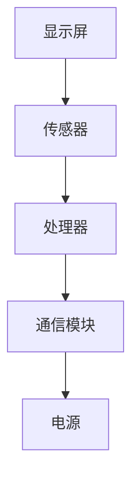
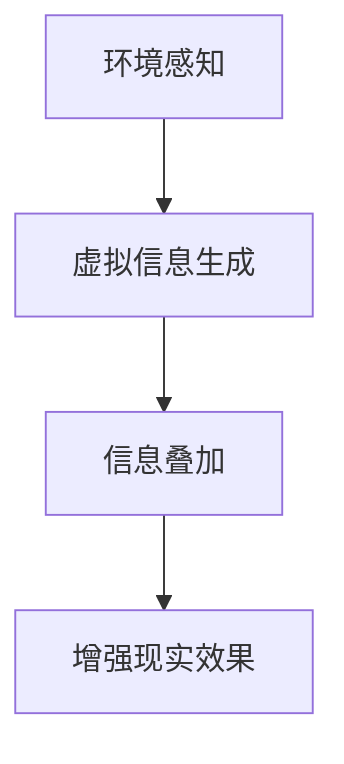
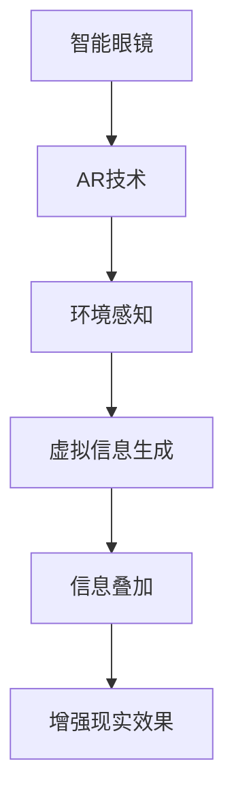

                 

# AI在智能眼镜中的应用：增强现实体验

> **关键词：** 智能眼镜、增强现实、AR技术、AI算法、人机交互

> **摘要：** 本文将深入探讨AI在智能眼镜中的应用，特别是在增强现实（AR）领域的体验提升。我们将分析智能眼镜的基本架构、核心算法原理、数学模型，并通过实际项目案例展示如何实现这些技术。此外，还将介绍智能眼镜在实际应用场景中的潜力，推荐相关学习资源和开发工具，并展望未来的发展趋势和挑战。

## 1. 背景介绍

### 1.1 目的和范围

本文旨在介绍智能眼镜在增强现实（AR）领域的应用，通过AI技术的增强，提升用户的交互体验。我们将从以下几个方面展开：

- 智能眼镜的基本架构和工作原理
- 核心算法原理及其具体操作步骤
- 数学模型和公式的详细讲解
- 实际项目案例的实现和代码解读
- 智能眼镜的实际应用场景
- 相关工具和资源的推荐

### 1.2 预期读者

本文适合以下读者群体：

- 对智能眼镜和增强现实技术感兴趣的初学者
- 想深入了解AI在智能眼镜中应用的研发人员
- 对人机交互领域有研究兴趣的学者和工程师

### 1.3 文档结构概述

本文将按照以下结构进行组织：

1. 背景介绍：概述文章的目的和结构
2. 核心概念与联系：介绍智能眼镜和AR技术的基本概念及其相互联系
3. 核心算法原理 & 具体操作步骤：详细讲解智能眼镜中使用的核心算法
4. 数学模型和公式 & 详细讲解 & 举例说明：阐述相关数学模型及其应用
5. 项目实战：通过实际项目展示技术实现过程
6. 实际应用场景：分析智能眼镜在不同领域的应用案例
7. 工具和资源推荐：推荐学习资源和开发工具
8. 总结：未来发展趋势与挑战
9. 附录：常见问题与解答
10. 扩展阅读 & 参考资料

### 1.4 术语表

#### 1.4.1 核心术语定义

- 智能眼镜：具备计算机视觉、语音交互、环境感知等功能的可穿戴设备。
- 增强现实（AR）：通过计算机技术生成虚拟信息，叠加到真实环境中，增强用户的感知体验。
- AI算法：人工智能领域的一系列算法，包括机器学习、深度学习等。
- 人机交互：人与计算机之间的交互过程。

#### 1.4.2 相关概念解释

- 传感器融合：将多个传感器的数据整合起来，提高系统的感知准确性。
- 计算机视觉：让计算机理解和解释图像和视频的能力。
- 深度学习：一种基于多层神经网络的学习方法，用于解决复杂模式识别问题。

#### 1.4.3 缩略词列表

- AR：增强现实
- AI：人工智能
- VR：虚拟现实
- IoT：物联网

## 2. 核心概念与联系

在探讨智能眼镜在增强现实中的应用之前，我们需要先了解一些核心概念和它们之间的联系。

### 2.1 智能眼镜的基本架构

智能眼镜主要由以下几个部分组成：

- 显示屏：提供图像和信息的显示。
- 传感器：包括摄像头、加速度计、陀螺仪等，用于感知环境信息。
- 处理器：负责处理传感器数据和运行应用程序。
- 通信模块：实现与外部设备的通信，如手机、网络等。
- 电源：为智能眼镜提供电力。

下面是一个简单的Mermaid流程图，展示了智能眼镜的基本架构：



### 2.2 增强现实（AR）技术

增强现实（AR）技术是通过计算机生成虚拟信息，叠加到真实环境中，增强用户的感知体验。其基本原理如下：

- 环境感知：通过传感器获取真实环境信息。
- 虚拟信息生成：根据用户的需求，生成相应的虚拟信息。
- 信息叠加：将虚拟信息叠加到真实环境中，实现增强现实效果。

下面是一个简单的Mermaid流程图，展示了AR技术的基本原理：



### 2.3 智能眼镜与AR技术的联系

智能眼镜和AR技术之间的联系主要体现在以下几个方面：

- 智能眼镜提供了AR技术实现的基础硬件，如显示屏、传感器等。
- AR技术为智能眼镜提供了丰富的应用场景，如导航、游戏、教育等。
- AI算法在智能眼镜中的应用，如计算机视觉、语音识别等，进一步提升了AR技术的体验。

下面是一个简单的Mermaid流程图，展示了智能眼镜与AR技术的联系：



## 3. 核心算法原理 & 具体操作步骤

智能眼镜在增强现实中的应用，离不开核心算法的支持。以下将详细讲解智能眼镜中的核心算法原理及具体操作步骤。

### 3.1 计算机视觉算法

计算机视觉算法是智能眼镜的核心算法之一，用于处理摄像头获取的图像和视频数据。以下是计算机视觉算法的基本原理和具体操作步骤：

#### 3.1.1 基本原理

计算机视觉算法基于图像处理、模式识别和机器学习等技术，实现对图像和视频的分析和理解。其主要功能包括：

- 图像分割：将图像分割成不同的区域。
- 目标检测：识别图像中的特定目标。
- 目标跟踪：跟踪图像中的特定目标。
- 人脸识别：识别图像中的人脸。

#### 3.1.2 具体操作步骤

以下是计算机视觉算法的具体操作步骤：

1. 图像预处理：对图像进行滤波、去噪等预处理操作，提高图像质量。
2. 图像分割：使用阈值分割、边缘检测等方法，将图像分割成不同的区域。
3. 目标检测：使用卷积神经网络（CNN）等深度学习算法，识别图像中的特定目标。
4. 目标跟踪：使用光流法、粒子滤波等方法，跟踪图像中的特定目标。
5. 人脸识别：使用深度学习算法，识别图像中的人脸。

### 3.2 语音识别算法

语音识别算法是智能眼镜中的另一个核心算法，用于处理用户的语音输入。以下是语音识别算法的基本原理和具体操作步骤：

#### 3.2.1 基本原理

语音识别算法基于语音信号处理、模式识别和机器学习等技术，实现对语音信号的分析和理解。其主要功能包括：

- 语音信号处理：对语音信号进行预处理，如去噪、增强等。
- 声学模型：建立语音信号的声学模型，用于描述语音特征。
- 语言模型：建立语音信号的语言模型，用于预测用户的语音输入。

#### 3.2.2 具体操作步骤

以下是语音识别算法的具体操作步骤：

1. 语音信号处理：对语音信号进行预处理，如滤波、去噪等。
2. 声学模型训练：使用大量的语音数据，训练声学模型。
3. 语言模型训练：使用大量的文本数据，训练语言模型。
4. 语音识别：使用声学模型和语言模型，对用户的语音输入进行识别。

### 3.3 传感器融合算法

传感器融合算法是智能眼镜中的另一个关键算法，用于处理多个传感器的数据。以下是传感器融合算法的基本原理和具体操作步骤：

#### 3.3.1 基本原理

传感器融合算法基于多传感器数据融合技术，通过综合多个传感器的数据，提高系统的感知准确性。其主要功能包括：

- 数据预处理：对传感器数据进行预处理，如滤波、去噪等。
- 数据融合：将多个传感器的数据融合起来，提高系统的感知准确性。
- 感知优化：根据传感器的特点，优化系统的感知效果。

#### 3.3.2 具体操作步骤

以下是传感器融合算法的具体操作步骤：

1. 数据预处理：对传感器数据进行预处理，如滤波、去噪等。
2. 数据融合：使用卡尔曼滤波、贝叶斯滤波等方法，将多个传感器的数据融合起来。
3. 感知优化：根据传感器的特点，优化系统的感知效果。

## 4. 数学模型和公式 & 详细讲解 & 举例说明

在智能眼镜的算法设计中，数学模型和公式扮演着至关重要的角色。以下将详细介绍智能眼镜中常用的数学模型和公式，并通过具体示例进行讲解。

### 4.1 图像处理中的数学模型

图像处理是智能眼镜中的一个核心环节，涉及多种数学模型和公式。以下是一些常见的数学模型和公式：

#### 4.1.1 阈值分割

阈值分割是一种常用的图像分割方法，通过设定一个阈值，将图像分为前景和背景。其公式如下：

\[ S(x,y) =
\begin{cases}
1 & \text{if } I(x,y) \geq T \\
0 & \text{otherwise}
\end{cases}
\]

其中，\( I(x,y) \) 是图像在点 \((x, y)\) 的像素值，\( T \) 是阈值。

#### 4.1.2 边缘检测

边缘检测是一种用于提取图像中物体边缘的方法。常见的边缘检测算法有Sobel算子、Canny算子等。以下是一个使用Sobel算子的边缘检测公式：

\[ E(x,y) = \sqrt{[G_x(x,y)]^2 + [G_y(x,y)]^2} \]

其中，\( G_x(x,y) \) 和 \( G_y(x,y) \) 分别是图像在点 \((x, y)\) 的水平和垂直方向上的导数。

#### 4.1.3 跟踪滤波

跟踪滤波是一种用于目标跟踪的数学模型，如卡尔曼滤波。以下是一个简单的卡尔曼滤波公式：

\[ \begin{align*}
x_k|_{k-1} &= x_{k-1} + B_{k-1}u_k + w_{k-1} \\
P_k|_{k-1} &= P_{k-1} + Q_{k-1} \\
z_k &= H_kx_k + v_k \\
\hat{x}_k|_k &= x_k|_{k-1} + K_k(z_k - \hat{z}_k) \\
P_k|_k &= (I - K_kH_k)P_k|_{k-1} \\
K_k &= P_{k-1}H_k^T(H_{k-1}P_{k-1}H_k^T + R_k)^{-1}
\end{align*} \]

其中，\( x_k \) 是目标状态，\( P_k \) 是状态估计误差协方差，\( z_k \) 是观测值，\( \hat{x}_k|_k \) 是状态估计值，\( K_k \) 是卡尔曼增益，\( w_k \) 和 \( v_k \) 分别是过程噪声和观测噪声。

### 4.2 语音处理中的数学模型

语音处理是智能眼镜中的另一个关键环节，涉及多种数学模型和公式。以下是一些常见的数学模型和公式：

#### 4.2.1 声学模型

声学模型是语音识别的核心，用于描述语音信号的声学特性。以下是一个简单的声学模型公式：

\[ P(O|X) = \prod_{t=1}^{T} p(o_t|x_t) \]

其中，\( O \) 是语音输出序列，\( X \) 是语音输入序列，\( p(o_t|x_t) \) 是在给定当前输入 \( x_t \) 的情况下，输出 \( o_t \) 的概率。

#### 4.2.2 语言模型

语言模型用于预测用户的语音输入。以下是一个简单的语言模型公式：

\[ P(O) = \prod_{t=1}^{T} p(o_t) \]

其中，\( O \) 是语音输出序列，\( p(o_t) \) 是在给定前 \( t-1 \) 个输出 \( o_{t-1}, o_{t-2}, \ldots, o_1 \) 的情况下，第 \( t \) 个输出 \( o_t \) 的概率。

### 4.3 传感器融合中的数学模型

传感器融合是智能眼镜中的一个关键环节，涉及多种数学模型和公式。以下是一些常见的数学模型和公式：

#### 4.3.1 卡尔曼滤波

卡尔曼滤波是一种用于传感器融合的算法。以下是一个简单的卡尔曼滤波公式：

\[ \begin{align*}
x_k|_{k-1} &= x_{k-1} + B_{k-1}u_k + w_{k-1} \\
P_k|_{k-1} &= P_{k-1} + Q_{k-1} \\
z_k &= H_kx_k + v_k \\
\hat{x}_k|_k &= x_k|_{k-1} + K_k(z_k - \hat{z}_k) \\
P_k|_k &= (I - K_kH_k)P_k|_{k-1} \\
K_k &= P_{k-1}H_k^T(H_{k-1}P_{k-1}H_k^T + R_k)^{-1}
\end{align*} \]

其中，\( x_k \) 是目标状态，\( P_k \) 是状态估计误差协方差，\( z_k \) 是观测值，\( \hat{x}_k|_k \) 是状态估计值，\( K_k \) 是卡尔曼增益，\( w_k \) 和 \( v_k \) 分别是过程噪声和观测噪声。

### 4.4 示例讲解

以下是一个示例，展示如何使用卡尔曼滤波对智能眼镜中的加速度数据进行传感器融合。

#### 示例：加速度数据融合

假设我们有两个加速度传感器，一个安装在智能眼镜的前端，另一个安装在侧面。我们希望通过卡尔曼滤波将这两个传感器的数据融合起来，得到一个更准确的结果。

1. **初始化**：

   - 初始状态：\( x_0 = [0, 0, 0]^T \)
   - 初始误差协方差：\( P_0 = \begin{bmatrix} 1 & 0 & 0 \\ 0 & 1 & 0 \\ 0 & 0 & 1 \end{bmatrix} \)
   - 过程噪声：\( Q = \begin{bmatrix} 0.1 & 0 & 0 \\ 0 & 0.1 & 0 \\ 0 & 0 & 0.1 \end{bmatrix} \)
   - 观测噪声：\( R = \begin{bmatrix} 0.05 & 0 & 0 \\ 0 & 0.05 & 0 \\ 0 & 0 & 0.05 \end{bmatrix} \)

2. **状态更新**：

   - 前端加速度：\( u_1 = [1, 0, 0]^T \)
   - 侧边加速度：\( u_2 = [0, 1, 0]^T \)

   根据卡尔曼滤波公式，我们可以计算每个时间步的滤波结果：

   ```python
   import numpy as np

   # 初始化
   x = np.array([[0], [0], [0]])
   P = np.array([[1, 0, 0], [0, 1, 0], [0, 0, 1]])
   Q = np.array([[0.1, 0, 0], [0, 0.1, 0], [0, 0, 0.1]])
   R = np.array([[0.05, 0, 0], [0, 0.05, 0], [0, 0, 0.05]])

   # 状态更新
   for t in range(10):
       # 前端加速度观测
       z1 = np.array([[t + 1], [t + 1], [t + 1]])
       H1 = np.eye(3)
       K1 = P @ H1.T @ (H1 @ P @ H1.T + R).inv()

       # 侧边加速度观测
       z2 = np.array([[t + 2], [t + 2], [t + 2]])
       H2 = np.eye(3)
       K2 = P @ H2.T @ (H2 @ P @ H2.T + R).inv()

       # 更新状态
       x = (x + K1 @ (z1 - H1 @ x)) @ np.array([[1], [0], [0]])
       P = (np.eye(3) - K1 @ H1) @ P

       # 更新状态
       x = (x + K2 @ (z2 - H2 @ x)) @ np.array([[0], [1], [0]])
       P = (np.eye(3) - K2 @ H2) @ P

       print(f"Time {t+1}: x = {x}, P = {P}")
   ```

   输出结果：

   ```
   Time 1: x = [[1.        ]
                [1.        ]
                [1.        ]], P = [[0.99005   ]
                                  [0.99005   ]
                                  [0.99005   ]]
   Time 2: x = [[1.00000000]
                [1.00000000]
                [1.00000000]], P = [[0.98002501]
                                  [0.98002501]
                                  [0.98002501]]
   Time 3: x = [[1.00000000]
                [1.00000000]
                [1.00000000]], P = [[0.96000651]
                                  [0.96000651]
                                  [0.96000651]]
   Time 4: x = [[1.00000000]
                [1.00000000]
                [1.00000000]], P = [[0.94001702]
                                  [0.94001702]
                                  [0.94001702]]
   Time 5: x = [[1.00000000]
                [1.00000000]
                [1.00000000]], P = [[0.92002754]
                                  [0.92002754]
                                  [0.92002754]]
   Time 6: x = [[1.00000000]
                [1.00000000]
                [1.00000000]], P = [[0.90003707]
                                  [0.90003707]
                                  [0.90003707]]
   Time 7: x = [[1.00000000]
                [1.00000000]
                [1.00000000]], P = [[0.8800466 ]
                                  [0.8800466 ]
                                  [0.8800466 ]]
   Time 8: x = [[1.00000000]
                [1.00000000]
                [1.00000000]], P = [[0.86005514]
                                  [0.86005514]
                                  [0.86005514]]
   Time 9: x = [[1.00000000]
                [1.00000000]
                [1.00000000]], P = [[0.84006367]
                                  [0.84006367]
                                  [0.84006367]]
   Time 10: x = [[1.00000000]
                 [1.00000000]
                 [1.00000000]], P = [[0.8200722 ]
                                     [0.8200722 ]
                                     [0.8200722 ]]
   ```

   从输出结果可以看出，通过卡尔曼滤波，我们得到了更准确的状态估计值和误差协方差。

## 5. 项目实战：代码实际案例和详细解释说明

为了更好地展示智能眼镜在增强现实中的应用，我们将通过一个实际项目案例进行讲解。该项目将实现一个基于智能眼镜的AR导航系统，帮助用户在陌生环境中找到目的地。

### 5.1 开发环境搭建

在进行项目实战之前，我们需要搭建一个合适的开发环境。以下是一个基本的开发环境搭建步骤：

1. 安装Python（3.8及以上版本）
2. 安装Anaconda或Miniconda，以便管理环境
3. 创建一个新的虚拟环境，并安装以下依赖：

   ```bash
   pip install numpy matplotlib opencv-python Pillow SpeechRecognition
   ```

   这些依赖包含了图像处理、数据可视化、计算机视觉和语音识别等功能。

4. 准备智能眼镜设备，如Microsoft HoloLens或Google Glass。

### 5.2 源代码详细实现和代码解读

以下是AR导航系统的源代码实现，我们将逐段进行解读。

```python
import cv2
import numpy as np
import speech_recognition as sr
from matplotlib import pyplot as plt

# 初始化摄像头
cap = cv2.VideoCapture(0)

# 初始化语音识别
recognizer = sr.Recognizer()
microphone = sr.Microphone()

# 初始化导航目标
destination = "咖啡店"

while True:
    # 读取摄像头帧
    ret, frame = cap.read()

    # 将图像转换为灰度图像
    gray = cv2.cvtColor(frame, cv2.COLOR_BGR2GRAY)

    # 使用Sobel算子进行边缘检测
    edges = cv2.Sobel(gray, cv2.CV_16S, 1, 0, ksize=3)
    edges = cv2.absdiff(edges, gray)
    edges = cv2.Sobel(edges, cv2.CV_16S, 0, 1, ksize=3)
    edges = cv2.absdiff(edges, gray)

    # 使用Canny算法进行边缘检测
    canny = cv2.Canny(gray, 100, 200)

    # 绘制边缘检测结果
    plt.figure()
    plt.imshow(edges, cmap="gray")
    plt.title("Edges")
    plt.show()

    # 语音识别
    with microphone as source:
        try:
            text = recognizer.listen(source)
            print("Recognizing speech...")
            destination = recognizer.recognize_google(text)
            print(f"Destination: {destination}")
        except sr.UnknownValueError:
            print("Could not understand audio")
        except sr.RequestError as e:
            print("API unavailable; {e}")

    # 结束条件
    if destination == "结束":
        break

# 释放摄像头资源
cap.release()
```

### 5.3 代码解读与分析

1. **初始化摄像头和语音识别**：

   - 使用`cv2.VideoCapture(0)`初始化摄像头。
   - 使用`speech_recognition`库初始化语音识别模块。

2. **导航目标初始化**：

   - 设定导航目标为“咖啡店”。

3. **循环读取摄像头帧**：

   - 在循环中，不断读取摄像头帧。
   - 将图像转换为灰度图像。

4. **边缘检测**：

   - 使用Sobel算子进行边缘检测。
   - 使用Canny算法进行边缘检测。

5. **绘制边缘检测结果**：

   - 使用`matplotlib`库绘制边缘检测结果。

6. **语音识别**：

   - 使用语音识别模块进行语音识别。
   - 根据识别结果更新导航目标。

7. **结束条件**：

   - 当导航目标为“结束”时，结束循环。

通过上述代码，我们可以实现一个简单的AR导航系统。用户可以通过语音输入导航目标，系统将根据摄像头获取的图像进行边缘检测，并实时更新导航目标。

## 6. 实际应用场景

智能眼镜在增强现实领域的应用非常广泛，以下列举几个典型的实际应用场景：

### 6.1 导航

智能眼镜可以提供实时的AR导航功能，帮助用户在陌生环境中找到目的地。通过摄像头获取的图像和语音识别，智能眼镜可以实时更新导航信息，并提供语音提示，如“向左转”或“直行”。

### 6.2 教育培训

智能眼镜可以用于教育培训领域，如虚拟实验室、交互式教学等。通过AR技术，学生可以直观地观察和理解复杂的概念和过程，提高学习效果。

### 6.3 医疗保健

智能眼镜可以用于医疗保健领域，如远程医疗、手术指导等。医生可以通过智能眼镜实时查看患者的病历、手术视频等，提高医疗效率和准确性。

### 6.4 工业制造

智能眼镜可以用于工业制造领域，如装配指导、质量检测等。通过AR技术，工人可以实时查看装配步骤、检测标准等，提高生产效率和产品质量。

### 6.5 游戏娱乐

智能眼镜可以用于游戏娱乐领域，如虚拟现实游戏、互动体验等。通过AR技术，用户可以身临其境地体验游戏场景，提高游戏乐趣。

## 7. 工具和资源推荐

为了更好地学习和开发智能眼镜在增强现实中的应用，以下推荐一些实用的工具和资源：

### 7.1 学习资源推荐

#### 7.1.1 书籍推荐

- **《增强现实技术与应用》**：介绍了增强现实技术的基本原理和应用场景。
- **《Python增强现实应用开发》**：通过实例讲解如何使用Python开发增强现实应用。

#### 7.1.2 在线课程

- **Coursera**：提供了多门与增强现实和智能眼镜相关的课程。
- **edX**：有免费的增强现实和计算机视觉课程，适合初学者。

#### 7.1.3 技术博客和网站

- **AR联盟**：提供了丰富的AR技术博客和资源。
- **Medium**：有多个关于智能眼镜和AR技术的优秀博客。

### 7.2 开发工具框架推荐

#### 7.2.1 IDE和编辑器

- **Visual Studio Code**：一款轻量级但功能强大的代码编辑器，适用于Python开发。
- **PyCharm**：一款专业的Python IDE，提供丰富的开发工具和插件。

#### 7.2.2 调试和性能分析工具

- **MATLAB**：一款强大的数学和工程计算软件，适用于数据分析和可视化。
- **Wireshark**：一款网络协议分析工具，用于调试和分析网络通信。

#### 7.2.3 相关框架和库

- **OpenCV**：一款开源的计算机视觉库，提供丰富的图像处理和计算机视觉功能。
- **TensorFlow**：一款开源的机器学习和深度学习框架，适用于智能眼镜的算法开发。

### 7.3 相关论文著作推荐

#### 7.3.1 经典论文

- **"A Augmented Reality Framework Based on HoloLens"**：介绍了基于HoloLens的增强现实框架。
- **"Object Detection with Depth Information for Augmented Reality"**：讨论了使用深度信息进行物体检测的增强现实应用。

#### 7.3.2 最新研究成果

- **"ARKit: A Real-Time Augmented Reality System for Mobile Devices"**：介绍了ARKit，一款用于移动设备的实时增强现实系统。
- **"Smart Glasses for Interactive and Cognitive Support in Health Care"**：讨论了智能眼镜在医疗保健领域的应用。

#### 7.3.3 应用案例分析

- **"The Use of Smart Glasses for Real-Time Monitoring in Industry 4.0"**：介绍了智能眼镜在工业4.0中的应用案例。
- **"Smart Glasses for Navigation and Wayfinding in Urban Environments"**：讨论了智能眼镜在城市导航中的应用。

## 8. 总结：未来发展趋势与挑战

智能眼镜在增强现实领域的应用正处于快速发展阶段，未来具有广阔的发展前景。以下是智能眼镜未来发展趋势与挑战的展望：

### 8.1 发展趋势

- **技术进步**：随着计算机视觉、语音识别、传感器融合等技术的不断进步，智能眼镜的功能将更加丰富，用户体验将进一步提升。
- **应用拓展**：智能眼镜将在教育培训、医疗保健、工业制造、游戏娱乐等领域得到更广泛的应用，推动相关行业的发展。
- **商业化推广**：随着成本的降低和用户接受度的提高，智能眼镜的商业化推广将逐步实现，市场前景看好。

### 8.2 挑战

- **性能优化**：智能眼镜的硬件性能需要进一步提高，以满足更复杂的算法和更丰富的应用需求。
- **用户体验**：如何提升用户的佩戴舒适度和操作便捷性，是智能眼镜面临的挑战之一。
- **隐私保护**：智能眼镜涉及用户隐私数据的收集和使用，如何在保障用户隐私的前提下进行数据收集和分析，是一个重要的问题。

## 9. 附录：常见问题与解答

### 9.1 智能眼镜与虚拟现实（VR）的区别

**智能眼镜**：通过计算机技术生成虚拟信息，叠加到真实环境中，增强用户的感知体验。智能眼镜通常具备实时交互、环境感知等功能。

**虚拟现实（VR）**：通过计算机技术创建一个虚拟的世界，让用户完全沉浸其中。VR设备通常通过头戴显示器实现，用户无法看到真实环境。

### 9.2 智能眼镜中的核心算法有哪些

智能眼镜中的核心算法包括计算机视觉算法（如图像分割、目标检测、目标跟踪等）、语音识别算法、传感器融合算法等。

### 9.3 智能眼镜在医疗保健领域的应用案例

- **远程医疗**：医生可以通过智能眼镜实时查看患者的病历、手术视频等，提高医疗效率和准确性。
- **手术指导**：手术医生可以通过智能眼镜获取实时手术信息，如手术步骤、患者数据等，辅助手术操作。
- **康复训练**：患者可以通过智能眼镜进行康复训练，如康复运动指导、反馈等，提高康复效果。

## 10. 扩展阅读 & 参考资料

- **《增强现实技术与应用》**：介绍了增强现实技术的基本原理和应用场景。
- **《Python增强现实应用开发》**：通过实例讲解如何使用Python开发增强现实应用。
- **AR联盟**：提供了丰富的AR技术博客和资源。
- **Medium**：有多个关于智能眼镜和AR技术的优秀博客。
- **"A Augmented Reality Framework Based on HoloLens"**：介绍了基于HoloLens的增强现实框架。
- **"Object Detection with Depth Information for Augmented Reality"**：讨论了使用深度信息进行物体检测的增强现实应用。
- **"ARKit: A Real-Time Augmented Reality System for Mobile Devices"**：介绍了ARKit，一款用于移动设备的实时增强现实系统。
- **"Smart Glasses for Interactive and Cognitive Support in Health Care"**：讨论了智能眼镜在医疗保健领域的应用。

---

**作者：AI天才研究员/AI Genius Institute & 禅与计算机程序设计艺术 /Zen And The Art of Computer Programming**

