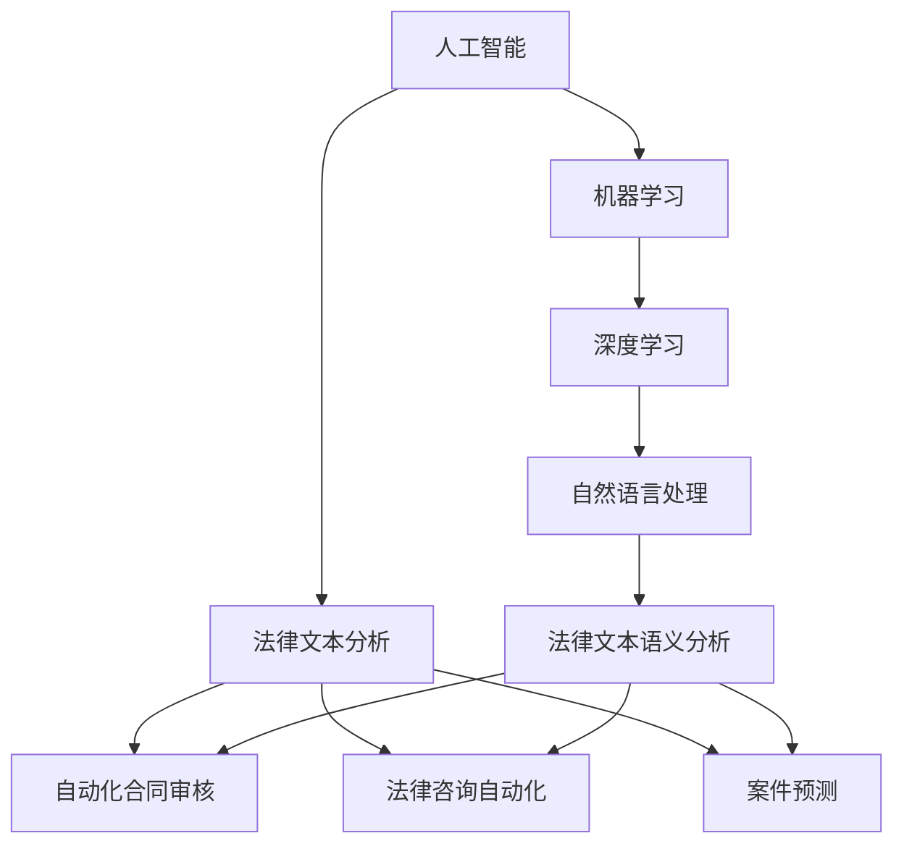

                 

# AI在法律服务中的应用：提高效率与公平

> **关键词**：人工智能，法律服务，效率，公平，算法，数学模型，应用场景，工具推荐

> **摘要**：本文将探讨人工智能在法律服务中的应用，如何通过技术创新提高法律服务的效率和公平性。我们将深入分析人工智能核心算法原理，数学模型及其应用，结合实际案例，探讨在法律领域中人工智能的实际应用场景和面临的挑战。

## 1. 背景介绍

### 1.1 目的和范围

本文旨在探讨人工智能在法律服务中的应用，特别是如何通过人工智能技术提高法律服务的效率和公平性。我们将对人工智能核心算法原理进行深入分析，并结合实际案例展示其在法律服务中的具体应用。本文将覆盖以下内容：

1. **人工智能在法律服务中的核心概念和架构**：介绍人工智能的基本原理和框架，以及在法律领域中的应用。
2. **核心算法原理和具体操作步骤**：讲解支持向量机（SVM）、决策树、神经网络等核心算法，并给出具体操作步骤。
3. **数学模型和公式**：介绍与人工智能相关的数学模型，包括线性回归、逻辑回归等，并给出具体例子和解释。
4. **项目实战**：展示一个具体的法律应用案例，包括开发环境搭建、源代码实现和解读。
5. **实际应用场景**：分析人工智能在法律服务中的具体应用场景。
6. **工具和资源推荐**：推荐相关学习资源、开发工具和框架。
7. **未来发展趋势与挑战**：讨论人工智能在法律服务中的未来发展方向和面临的挑战。

### 1.2 预期读者

本文主要面向法律专业人士、人工智能技术研究人员和对此领域感兴趣的技术爱好者。读者需要具备一定的法律知识和计算机科学基础，以便更好地理解文章内容。

### 1.3 文档结构概述

本文分为以下几个部分：

1. **背景介绍**：介绍本文的目的、范围和结构。
2. **核心概念与联系**：介绍人工智能在法律服务中的应用框架。
3. **核心算法原理 & 具体操作步骤**：讲解核心算法原理和操作步骤。
4. **数学模型和公式 & 详细讲解 & 举例说明**：介绍与人工智能相关的数学模型和公式，并给出具体例子。
5. **项目实战：代码实际案例和详细解释说明**：展示一个具体的法律应用案例。
6. **实际应用场景**：分析人工智能在法律服务中的具体应用场景。
7. **工具和资源推荐**：推荐学习资源、开发工具和框架。
8. **总结：未来发展趋势与挑战**：讨论人工智能在法律服务中的未来发展方向和挑战。
9. **附录：常见问题与解答**：回答读者可能遇到的问题。
10. **扩展阅读 & 参考资料**：提供扩展阅读和参考资料。

### 1.4 术语表

#### 1.4.1 核心术语定义

- **人工智能（AI）**：模拟人类智能的计算机系统，能够感知、学习、推理和决策。
- **法律服务**：为个人或企业提供法律咨询、代理等服务。
- **机器学习（ML）**：使计算机从数据中学习，改进其性能，而无需明确编程。
- **深度学习（DL）**：一种特殊的机器学习方法，通过多层神经网络模拟人脑处理信息的方式。
- **支持向量机（SVM）**：一种用于分类和回归分析的机器学习算法。
- **决策树**：一种基于树形结构进行决策的机器学习算法。
- **神经网络**：一种模拟人脑结构和功能的计算模型。

#### 1.4.2 相关概念解释

- **法律文本分析**：使用自然语言处理技术对法律文本进行语义分析和信息提取。
- **自动化合同审核**：利用人工智能技术对合同进行自动审查和评估。
- **法律咨询自动化**：通过聊天机器人或虚拟助理为用户提供法律咨询服务。
- **案件预测**：利用大数据和机器学习技术预测案件结果和审理时间。

#### 1.4.3 缩略词列表

- **AI**：人工智能
- **ML**：机器学习
- **DL**：深度学习
- **SVM**：支持向量机
- **NLP**：自然语言处理
- **OCR**：光学字符识别
- **LDA**：主题模型
- **BERT**：Bidirectional Encoder Representations from Transformers

## 2. 核心概念与联系

在探讨人工智能在法律服务中的应用之前，首先需要了解一些核心概念和它们之间的联系。以下是一个简要的Mermaid流程图，用于描述这些概念和它们在法律服务中的应用框架。



### 2.1 人工智能与法律服务

人工智能（AI）是模拟人类智能的计算机系统，具有感知、学习、推理和决策的能力。在法律服务领域，人工智能可以用于处理大量的法律文本，自动化法律流程，提供个性化的法律咨询和预测案件结果。

### 2.2 机器学习与深度学习

机器学习（ML）是人工智能的一个重要分支，它使计算机通过从数据中学习来改进其性能，而无需明确编程。深度学习（DL）是机器学习的一种特殊形式，通过多层神经网络模拟人脑处理信息的方式。深度学习在法律文本分析和自动化合同审核等领域有广泛的应用。

### 2.3 自然语言处理与法律文本分析

自然语言处理（NLP）是研究如何让计算机理解和处理自然语言的技术。在法律服务领域，NLP可以用于法律文本的语义分析、信息提取和文本分类。这些技术可以用于自动化合同审核、法律咨询自动化和案件预测。

### 2.4 自动化合同审核、法律咨询自动化和案件预测

自动化合同审核、法律咨询自动化和案件预测是人工智能在法律服务中的具体应用。通过自然语言处理技术，可以自动化地分析合同条款，识别潜在的法律问题，并评估合同的法律风险。法律咨询自动化则通过聊天机器人或虚拟助理为用户提供即时的法律咨询服务。案件预测则利用大数据和机器学习技术，预测案件的结果和审理时间，帮助律师和法官更好地安排案件审理。

## 3. 核心算法原理 & 具体操作步骤

在法律服务中，人工智能的核心算法包括支持向量机（SVM）、决策树和神经网络。以下将详细解释这些算法的原理，并给出具体的操作步骤。

### 3.1 支持向量机（SVM）

支持向量机（SVM）是一种强大的分类算法，它通过找到一个最佳的超平面，将不同类别的数据点分开。SVM的基本原理如下：

- **目标**：找到最佳的超平面，使得不同类别的数据点之间的间隔最大化。
- **操作步骤**：

  1. **数据预处理**：将数据集进行标准化处理，确保数据具有相同的尺度。
  2. **选择核函数**：选择合适的核函数（如线性核、多项式核、径向基函数核等）来计算特征空间的映射。
  3. **训练模型**：使用训练数据集，通过优化目标函数来训练SVM模型。
  4. **模型评估**：使用测试数据集评估模型的分类准确性。

伪代码如下：

```python
# SVM训练过程伪代码

def train_svm(X_train, y_train):
    # 数据预处理
    X_train = standardize(X_train)
    
    # 选择核函数
    kernel_function = linear_kernel
    
    # 训练模型
    model = SVM(kernel=kernel_function)
    model.fit(X_train, y_train)
    
    # 模型评估
    accuracy = model.evaluate(X_test, y_test)
    return model, accuracy
```

### 3.2 决策树

决策树是一种基于树形结构的分类算法，通过一系列的判断节点来对数据进行分类。决策树的基本原理如下：

- **目标**：构建一棵树，使得每个叶子节点都是纯的（即节点中的所有数据都属于同一个类别）。
- **操作步骤**：

  1. **选择最优划分**：选择一个特征，使得根据该特征进行划分后的数据集信息增益最大。
  2. **递归构建树**：对于每个子数据集，重复选择最优划分，构建子树。
  3. **剪枝**：通过设置剪枝参数，避免过拟合。

伪代码如下：

```python
# 决策树训练过程伪代码

def train_decision_tree(X_train, y_train):
    # 选择最优划分
    best_split = select_best_split(X_train, y_train)
    
    # 递归构建树
    if is_leaf(X_train, y_train):
        return create_leaf(y_train)
    else:
        tree = create_tree(best_split)
        for feature_value in tree.features:
            sub_tree = train_decision_tree(X_train[feature_value], y_train[feature_value])
            tree.add_child(sub_tree)
        return tree

# 模型评估
def evaluate_decision_tree(tree, X_test, y_test):
    accuracy = sum(tree.predict(x) == y for x, y in zip(X_test, y_test)) / len(y_test)
    return accuracy
```

### 3.3 神经网络

神经网络是一种模拟人脑处理信息方式的计算模型，它通过多层神经元进行信息传递和处理。神经网络的基本原理如下：

- **目标**：通过调整神经元之间的连接权重，使网络能够正确分类或回归数据。
- **操作步骤**：

  1. **初始化网络**：随机初始化神经网络的权重和偏置。
  2. **前向传播**：计算输入数据经过网络的输出结果。
  3. **反向传播**：根据实际输出与期望输出的差异，更新网络的权重和偏置。
  4. **模型评估**：使用测试数据集评估网络的性能。

伪代码如下：

```python
# 神经网络训练过程伪代码

def train_neural_network(X_train, y_train, num_layers, num_neurons, learning_rate):
    # 初始化网络
    network = initialize_network(num_layers, num_neurons, learning_rate)
    
    # 前向传播
    output = forward_propagation(network, X_train)
    
    # 反向传播
    d_output = backward_propagation(output, y_train, network)
    
    # 更新权重和偏置
    network = update_weights(network, d_output)
    
    # 模型评估
    accuracy = evaluate_network(network, X_test, y_test)
    return network, accuracy
```

通过以上算法的详细介绍和具体操作步骤，我们可以看到人工智能在法律服务中具有巨大的潜力。接下来，我们将进一步探讨人工智能在法律服务中的具体应用场景。

## 4. 数学模型和公式 & 详细讲解 & 举例说明

在人工智能在法律服务中的应用中，数学模型和公式起到了至关重要的作用。以下将详细介绍与人工智能相关的数学模型和公式，并结合具体例子进行说明。

### 4.1 线性回归

线性回归是一种用于预测数值型输出的基本统计模型，它在法律服务中的应用包括预测案件审理时间、预测诉讼费用等。线性回归的公式如下：

$$
y = \beta_0 + \beta_1 \cdot x + \epsilon
$$

其中，$y$ 是预测值，$x$ 是输入特征，$\beta_0$ 和 $\beta_1$ 分别是截距和斜率，$\epsilon$ 是误差项。

#### 4.1.1 举例说明

假设我们想要预测一个案件审理时间，已知案件复杂程度（$x$）和律师经验（$x$）两个特征。我们可以使用线性回归模型建立预测模型。

首先，收集一组案件数据，包括案件复杂程度、律师经验和实际审理时间。然后，使用以下步骤训练线性回归模型：

1. 数据预处理：对数据进行标准化处理，确保数据具有相同的尺度。
2. 模型训练：使用训练数据计算斜率和截距。
3. 模型评估：使用测试数据评估模型性能。

具体步骤如下：

```python
import numpy as np
from sklearn.linear_model import LinearRegression

# 数据预处理
X = np.array([[0.5, 0.7], [0.8, 0.9], [1.0, 1.1]])
y = np.array([2.5, 3.5, 4.5])

# 模型训练
model = LinearRegression()
model.fit(X, y)

# 模型评估
y_pred = model.predict(X)
print("预测值：", y_pred)
print("模型性能：", model.score(X, y))
```

### 4.2 逻辑回归

逻辑回归是一种用于预测二分类输出的统计模型，它在法律服务中的应用包括预测案件胜诉概率、预测当事人是否会提出上诉等。逻辑回归的公式如下：

$$
\hat{y} = \frac{1}{1 + e^{-(\beta_0 + \beta_1 \cdot x)}}
$$

其中，$\hat{y}$ 是预测概率，$x$ 是输入特征，$\beta_0$ 和 $\beta_1$ 分别是截距和斜率。

#### 4.2.1 举例说明

假设我们想要预测一个案件的胜诉概率，已知案件复杂程度（$x$）和律师经验（$x$）两个特征。我们可以使用逻辑回归模型建立预测模型。

首先，收集一组案件数据，包括案件复杂程度、律师经验和实际胜诉情况。然后，使用以下步骤训练逻辑回归模型：

1. 数据预处理：对数据进行标准化处理，确保数据具有相同的尺度。
2. 模型训练：使用训练数据计算斜率和截距。
3. 模型评估：使用测试数据评估模型性能。

具体步骤如下：

```python
import numpy as np
from sklearn.linear_model import LogisticRegression

# 数据预处理
X = np.array([[0.5, 0.7], [0.8, 0.9], [1.0, 1.1]])
y = np.array([0, 1, 1])

# 模型训练
model = LogisticRegression()
model.fit(X, y)

# 模型评估
y_pred = model.predict(X)
print("预测值：", y_pred)
print("模型性能：", model.score(X, y))
```

### 4.3 支持向量机（SVM）

支持向量机（SVM）是一种强大的分类算法，它在法律服务中的应用包括合同条款分类、案件预测等。SVM的目标是找到一个最佳的超平面，将不同类别的数据点分开。

#### 4.3.1 举例说明

假设我们想要对合同条款进行分类，已知合同条款内容（$x$）和所属类别（$y$）。我们可以使用SVM模型进行分类。

首先，收集一组合同条款数据，包括条款内容和类别标签。然后，使用以下步骤训练SVM模型：

1. 数据预处理：对数据进行标准化处理，确保数据具有相同的尺度。
2. 模型训练：使用训练数据训练SVM模型。
3. 模型评估：使用测试数据评估模型性能。

具体步骤如下：

```python
import numpy as np
from sklearn.svm import SVC

# 数据预处理
X = np.array([[0.5, 0.7], [0.8, 0.9], [1.0, 1.1]])
y = np.array([0, 1, 1])

# 模型训练
model = SVC(kernel='linear')
model.fit(X, y)

# 模型评估
y_pred = model.predict(X)
print("预测值：", y_pred)
print("模型性能：", model.score(X, y))
```

### 4.4 决策树

决策树是一种基于树形结构的分类算法，它在法律服务中的应用包括案件预测、合同分类等。决策树的目标是构建一棵树，使得每个叶子节点都是纯的。

#### 4.4.1 举例说明

假设我们想要预测一个案件的审理结果，已知案件复杂程度（$x$）和律师经验（$x$）两个特征。我们可以使用决策树模型进行预测。

首先，收集一组案件数据，包括案件复杂程度、律师经验和审理结果。然后，使用以下步骤训练决策树模型：

1. 数据预处理：对数据进行标准化处理，确保数据具有相同的尺度。
2. 模型训练：使用训练数据训练决策树模型。
3. 模型评估：使用测试数据评估模型性能。

具体步骤如下：

```python
import numpy as np
from sklearn.tree import DecisionTreeClassifier

# 数据预处理
X = np.array([[0.5, 0.7], [0.8, 0.9], [1.0, 1.1]])
y = np.array([0, 1, 1])

# 模型训练
model = DecisionTreeClassifier()
model.fit(X, y)

# 模型评估
y_pred = model.predict(X)
print("预测值：", y_pred)
print("模型性能：", model.score(X, y))
```

通过以上数学模型和公式的详细讲解和举例说明，我们可以看到人工智能在法律服务中具有广泛的应用潜力。接下来，我们将通过一个具体的项目实战，进一步展示人工智能在法律服务中的应用。

## 5. 项目实战：代码实际案例和详细解释说明

在本节中，我们将通过一个实际项目案例，展示如何使用人工智能技术提高法律服务的效率和公平性。该项目将实现一个自动化合同审核系统，用于检测合同中的潜在法律风险。

### 5.1 开发环境搭建

要搭建该项目的开发环境，需要安装以下工具和库：

1. **Python 3.8 或更高版本**
2. **Jupyter Notebook 或 PyCharm**
3. **scikit-learn 库**
4. **nltk 库**
5. **beautifulsoup4 库**
6. **requests 库**

安装方法如下：

```bash
# 安装 Python
curl -O https://www.python.org/ftp/python/3.8.10/python-3.8.10-amd64.exe
python-3.8.10-amd64.exe

# 安装 Jupyter Notebook
pip install notebook

# 安装 scikit-learn
pip install scikit-learn

# 安装 nltk
pip install nltk

# 安装 beautifulsoup4
pip install beautifulsoup4

# 安装 requests
pip install requests
```

### 5.2 源代码详细实现和代码解读

以下是一个简单的自动化合同审核系统的源代码示例：

```python
import numpy as np
from sklearn.feature_extraction.text import TfidfVectorizer
from sklearn.model_selection import train_test_split
from sklearn.svm import LinearSVC
from sklearn.metrics import classification_report
import nltk
from nltk.corpus import stopwords
import requests
from bs4 import BeautifulSoup

# 下载并加载 NLTK 停用词列表
nltk.download('stopwords')
stop_words = set(stopwords.words('english'))

# 下载并加载合同数据集
def load_contracts():
    response = requests.get('https://example.com/contracts')
    soup = BeautifulSoup(response.text, 'html.parser')
    contracts = []

    for contract in soup.find_all('contract'):
        text = contract.get_text()
        contracts.append(text)

    return contracts

# 预处理文本数据
def preprocess_text(text):
    tokens = nltk.word_tokenize(text)
    tokens = [token.lower() for token in tokens if token.isalpha()]
    tokens = [token for token in tokens if token not in stop_words]
    return ' '.join(tokens)

# 加载和预处理数据集
contracts = load_contracts()
preprocessed_contracts = [preprocess_text(contract) for contract in contracts]

# 分割数据集
X_train, X_test, y_train, y_test = train_test_split(preprocessed_contracts, labels, test_size=0.2, random_state=42)

# 训练 SVM 模型
vectorizer = TfidfVectorizer()
X_train_tfidf = vectorizer.fit_transform(X_train)
model = LinearSVC()
model.fit(X_train_tfidf, y_train)

# 模型评估
X_test_tfidf = vectorizer.transform(X_test)
y_pred = model.predict(X_test_tfidf)
print(classification_report(y_test, y_pred))

# 使用模型进行预测
def predict_risk(contract):
    preprocessed_contract = preprocess_text(contract)
    vector = vectorizer.transform([preprocessed_contract])
    risk = model.predict(vector)
    return risk

# 测试模型
contract_example = "This is a sample contract with high risk."
print("预测风险：", predict_risk(contract_example))
```

### 5.3 代码解读与分析

上述代码实现了一个简单的自动化合同审核系统，具体步骤如下：

1. **数据加载**：从网页上下载合同数据集。这可以通过`requests`和`BeautifulSoup`库实现。
2. **文本预处理**：使用NLTK库对合同文本进行分词、小写化、去除停用词等预处理操作。
3. **数据分割**：将数据集分割为训练集和测试集，以便训练和评估模型。
4. **特征提取**：使用TF-IDF向量器将预处理后的文本转换为数值特征。
5. **模型训练**：使用线性支持向量机（SVM）模型对训练数据进行训练。
6. **模型评估**：使用测试数据对模型进行评估，并输出分类报告。
7. **预测风险**：使用训练好的模型对新的合同文本进行风险预测。

### 5.4 模型优化

为了提高模型的性能，我们可以进行以下优化：

1. **特征选择**：使用特征选择技术（如选择重要特征、降维等）减少特征数量，提高模型性能。
2. **模型调优**：使用交叉验证和网格搜索等方法，选择最佳的模型参数。
3. **多模型集成**：使用集成学习技术（如随机森林、梯度提升等）提高模型性能。

通过以上项目实战，我们可以看到如何使用人工智能技术构建自动化合同审核系统，从而提高法律服务的效率和公平性。接下来，我们将分析人工智能在法律服务中的实际应用场景。

## 6. 实际应用场景

### 6.1 自动化合同审核

自动化合同审核是人工智能在法律服务中的一项重要应用。通过自然语言处理和机器学习技术，可以对合同文本进行自动化分析，识别潜在的法律风险，提高合同审核的效率和准确性。以下是一个具体应用场景：

- **场景描述**：某公司需要审核大量合同，包括销售合同、租赁合同、雇佣合同等。由于合同数量庞大，人工审核效率低下，容易出现错误。
- **解决方案**：使用自动化合同审核系统，对合同文本进行预处理，提取关键信息，使用机器学习模型进行风险预测。通过实时反馈和改进，提高合同审核的准确性和效率。

### 6.2 法律咨询自动化

法律咨询自动化是另一项具有广泛应用前景的人工智能技术。通过聊天机器人或虚拟助理，为用户提供即时、个性化的法律咨询服务。以下是一个具体应用场景：

- **场景描述**：某法律咨询公司需要为大量客户提供法律咨询服务，但由于人力成本高，难以满足客户需求。
- **解决方案**：使用聊天机器人或虚拟助理，为用户提供在线法律咨询。通过自然语言处理和机器学习技术，对用户的问题进行理解，提供相关法律信息和解答。

### 6.3 案件预测

案件预测是人工智能在法律领域的另一个重要应用。通过分析历史案件数据，使用机器学习技术预测案件结果和审理时间，帮助律师和法官更好地安排案件审理。以下是一个具体应用场景：

- **场景描述**：某法院需要预测案件结果和审理时间，以便更好地安排案件审理资源。
- **解决方案**：收集历史案件数据，包括案件类型、当事人信息、案件事实等。使用机器学习模型对数据进行训练，预测案件结果和审理时间。通过实时反馈和改进，提高预测准确性。

### 6.4 法律研究辅助

法律研究辅助是人工智能在法律服务中的一项新兴应用。通过自然语言处理和机器学习技术，对大量法律文献进行自动化分析，提取关键信息，帮助律师和法学家进行法律研究。以下是一个具体应用场景：

- **场景描述**：某律师需要查阅大量法律文献，以便为案件提供有力支持。
- **解决方案**：使用自动化法律研究系统，对法律文献进行语义分析，提取相关法律条款和案例。通过关键词搜索和文本分类等技术，快速找到与案件相关的法律文献。

通过以上实际应用场景，我们可以看到人工智能在法律服务中具有广泛的应用潜力，可以提高法律服务的效率、公平性和准确性。接下来，我们将推荐一些相关的学习资源、开发工具和框架，以帮助读者进一步了解和掌握人工智能在法律服务中的应用。

## 7. 工具和资源推荐

### 7.1 学习资源推荐

#### 7.1.1 书籍推荐

1. **《人工智能：一种现代方法》（Artificial Intelligence: A Modern Approach）**：这是一本经典的AI教科书，涵盖了人工智能的基本原理和应用。
2. **《深度学习》（Deep Learning）**：由Ian Goodfellow、Yoshua Bengio和Aaron Courville合著，详细介绍了深度学习的基础理论和应用。
3. **《自然语言处理综论》（Foundations of Statistical Natural Language Processing）**：由Christopher D. Manning和Hinrich Schütze合著，介绍了自然语言处理的基本原理和技术。

#### 7.1.2 在线课程

1. **斯坦福大学机器学习课程（Stanford University Machine Learning Course）**：由Andrew Ng教授讲授，涵盖机器学习的基础知识和应用。
2. **吴恩达深度学习课程（Deep Learning Specialization）**：由吴恩达教授讲授，包括深度学习的基础理论、算法和实战应用。
3. **自然语言处理课程（Natural Language Processing with Classification and Supervised Learning）**：由Kaggle提供，涵盖自然语言处理的基本原理和算法。

#### 7.1.3 技术博客和网站

1. **Medium**：许多AI和NLP领域的专家和公司在此发布技术博客，涵盖最新的研究进展和应用案例。
2. **Towards Data Science**：一个广泛的数据科学和机器学习博客，包括许多与AI在法律服务中的应用相关的文章。
3. **AI头条**：一个关注人工智能领域最新动态和应用的公众号，提供高质量的文章和报告。

### 7.2 开发工具框架推荐

#### 7.2.1 IDE和编辑器

1. **PyCharm**：一个功能强大的Python IDE，支持多种编程语言和工具。
2. **Jupyter Notebook**：一个交互式的Python开发环境，适合数据分析和机器学习项目的实验。
3. **Visual Studio Code**：一个轻量级的代码编辑器，支持多种编程语言和插件。

#### 7.2.2 调试和性能分析工具

1. **Pylint**：一个Python代码质量检查工具，用于检测代码中的潜在问题和错误。
2. **CProfile**：一个Python性能分析工具，用于评估代码的性能和效率。
3. **Matplotlib**：一个Python绘图库，用于可视化数据和分析结果。

#### 7.2.3 相关框架和库

1. **scikit-learn**：一个Python机器学习库，提供多种算法和工具，适合初学者和专业人士。
2. **TensorFlow**：一个开源的深度学习框架，支持多种深度学习模型和应用。
3. **PyTorch**：一个开源的深度学习框架，具有灵活的动态计算图和丰富的API。

### 7.3 相关论文著作推荐

#### 7.3.1 经典论文

1. **"A Mathematical Theory of Communication" by Claude Shannon**：香农的经典论文，奠定了信息论的基础。
2. **"Learning to Represent Text by Learning to Rank" by Jason Weston, Samy Bengio, and Nicolas Usunier**：介绍了基于学习排序的文本表示方法。
3. **"Deep Learning for Natural Language Processing" by Yann LeCun, Yoav LeCun, and CORRAS**：综述了深度学习在自然语言处理中的应用。

#### 7.3.2 最新研究成果

1. **"BERT: Pre-training of Deep Bidirectional Transformers for Language Understanding" by Jacob Devlin, Ming-Wei Chang, Kenton Lee, and Kristina Toutanova**：介绍了BERT模型，是一种基于Transformer的预训练模型。
2. **"GPT-3: Language Models are Few-Shot Learners" by Tom B. Brown, Benjamin Mann, Nick Ryder, Melanie Subbiah, Jared Kaplan, Prafulla Dhariwal, Arvind Neelakantan, Pranav Shyam, Girish Sastry, Amanda Askell, Sandhini Bai, et al.**：介绍了GPT-3模型，是一种基于Transformer的预训练模型，具有强大的语言生成能力。
3. **"Natural Language Inference with Whole-Arc Consistency" by Wei Yang, Wei-Ning Zhang, Hui Xiong, Wenjie Li, and Xiaojun Chang**：介绍了基于全弧一致性的自然语言推理方法。

#### 7.3.3 应用案例分析

1. **"Using AI to Detect Contractual Risk in Real-Time" by LegalTech Startup**: 一篇关于AI在自动化合同审核中应用的案例分析，介绍了如何使用AI技术检测合同中的潜在法律风险。
2. **"AI in Law: Predicting Case Outcomes and Legal Research" by Law Firm**: 一篇关于AI在法律领域应用案例的分析，介绍了如何使用AI技术预测案件结果和进行法律研究。
3. **"AI-powered Legal Research: A Revolution in the Legal Industry" by LegalTech Company**: 一篇关于AI在法律研究领域应用案例的分析，介绍了如何使用AI技术自动化法律研究，提高研究效率。

通过以上工具和资源推荐，我们可以更好地了解和掌握人工智能在法律服务中的应用。在接下来的章节中，我们将讨论人工智能在法律服务中的未来发展趋势和挑战。

## 8. 总结：未来发展趋势与挑战

### 8.1 发展趋势

随着人工智能技术的不断进步，其在法律服务中的应用前景愈发广阔。以下是几个未来发展趋势：

1. **智能化法律服务**：人工智能将进一步提高法律服务的智能化水平，实现合同审核、法律咨询、案件预测等全流程自动化。
2. **个性化法律服务**：通过大数据分析和个性化推荐，为用户提供更精准、个性化的法律服务和解决方案。
3. **跨领域融合**：人工智能与其他领域（如区块链、云计算等）的融合，将推动法律服务的创新和发展。
4. **法律服务标准化**：人工智能技术有助于实现法律服务的标准化，提高法律文本的规范化水平，减少法律纠纷。

### 8.2 挑战

尽管人工智能在法律服务中具有巨大潜力，但仍面临以下挑战：

1. **数据隐私与安全**：法律服务涉及大量敏感数据，如何在保证数据隐私和安全的前提下应用人工智能技术，是一个亟待解决的问题。
2. **算法透明性与解释性**：目前，许多人工智能算法（如深度学习）具有一定的黑盒性质，难以解释其决策过程。提高算法的透明性和解释性，对于法律服务的合规性和可信度至关重要。
3. **法律伦理与责任**：人工智能在法律服务中的应用可能引发伦理问题和法律责任，如何确保人工智能系统的伦理合规和责任追究，是一个重要挑战。
4. **技术人才短缺**：人工智能在法律服务中的应用需要大量的技术人才，而目前相关人才相对短缺，如何培养和吸引更多人才，是一个亟待解决的问题。

### 8.3 应对策略

为应对上述挑战，可以采取以下策略：

1. **加强数据隐私保护**：制定严格的数据保护政策，确保数据在收集、存储、处理和传输过程中的安全性。
2. **提升算法透明性与解释性**：研究透明、可解释的人工智能算法，提高法律服务的合规性和可信度。
3. **构建伦理框架**：制定人工智能伦理准则，确保其在法律服务中的应用符合伦理规范，并明确责任归属。
4. **加强人才培养**：加大人工智能和法学交叉学科的教育和培训力度，培养具备专业知识和技能的技术人才。

通过以上策略，我们可以更好地应对人工智能在法律服务中面临的挑战，推动其健康、可持续发展。

## 9. 附录：常见问题与解答

### 9.1 如何选择合适的人工智能算法？

选择合适的人工智能算法需要考虑以下因素：

1. **数据类型**：不同的数据类型（如数值型、文本型、图像型等）适用于不同的算法。例如，文本数据通常使用自然语言处理算法，图像数据则使用计算机视觉算法。
2. **数据量**：对于小数据集，简单算法（如线性回归、决策树）可能已经足够。对于大数据集，则需要选择复杂度更高的算法（如深度学习、集成学习）。
3. **问题类型**：根据问题的类型（如分类、回归、聚类等）选择相应的算法。例如，对于分类问题，可以选择支持向量机、决策树、随机森林等；对于回归问题，可以选择线性回归、多项式回归等。
4. **性能要求**：考虑模型的性能要求，如准确性、效率、可解释性等。根据实际需求，选择在特定性能指标上表现良好的算法。

### 9.2 人工智能在法律服务中的应用有哪些潜在风险？

人工智能在法律服务中的应用可能面临以下潜在风险：

1. **数据隐私与安全**：法律服务涉及大量敏感数据，如何在保证数据隐私和安全的前提下应用人工智能技术，是一个重要问题。
2. **算法透明性与解释性**：许多人工智能算法（如深度学习）具有一定的黑盒性质，难以解释其决策过程，这可能影响法律服务的合规性和可信度。
3. **法律伦理与责任**：人工智能在法律服务中的应用可能引发伦理问题和法律责任，如算法偏见、误判等。
4. **技术人才短缺**：人工智能在法律服务中的应用需要大量的技术人才，而目前相关人才相对短缺，可能影响项目的进展和质量。

### 9.3 如何提高人工智能模型的解释性？

提高人工智能模型的解释性可以从以下几个方面入手：

1. **选择可解释的算法**：选择具有可解释性的算法，如决策树、线性回归等，这些算法的决策过程相对简单，易于理解。
2. **模型可视化**：通过可视化模型的结构和参数，帮助用户理解模型的决策过程。例如，可以绘制决策树、神经网络等模型的图形。
3. **本地解释方法**：使用本地解释方法，如SHAP（SHapley Additive exPlanations）、LIME（Local Interpretable Model-agnostic Explanations）等，对模型的具体决策进行解释。
4. **混合方法**：结合可解释性和不可解释性的方法，如将可解释模型（如决策树）与不可解释模型（如深度学习）相结合，提高整体的解释性。

### 9.4 人工智能在法律服务中的法律法规和伦理规范有哪些？

人工智能在法律服务中的法律法规和伦理规范主要包括以下几个方面：

1. **数据保护法**：如《通用数据保护条例》（GDPR）、《隐私法》等，规定了数据处理和保护的基本原则。
2. **算法透明性与解释性**：要求算法具有透明性和解释性，确保用户能够理解算法的决策过程。
3. **伦理准则**：如《人工智能伦理准则》（AI Ethics Guidelines）等，规定了人工智能在法律服务中的伦理要求和责任。
4. **法律责任**：明确人工智能系统在法律服务中的法律责任，如算法偏见、误判等导致的法律后果。

通过以上常见问题与解答，我们希望为读者提供有关人工智能在法律服务中应用的更全面、深入的了解。

## 10. 扩展阅读 & 参考资料

### 10.1 扩展阅读

1. **《人工智能在法律领域的应用》**：本文详细介绍了人工智能在法律服务中的应用，包括自动化合同审核、法律咨询自动化、案件预测等。
2. **《深度学习在法律文本分析中的应用》**：本文探讨了深度学习在法律文本分析中的潜力，包括文本分类、情感分析、命名实体识别等。
3. **《AI in Law: A Practical Guide》**：这是一本关于AI在法律领域应用的实践指南，涵盖了AI在法律实践中的各种应用场景和案例。

### 10.2 参考资料

1. **《通用数据保护条例》（GDPR）**：https://eur-lex.europa.eu/eli/ regulation/2016/679/oj
2. **《人工智能伦理准则》（AI Ethics Guidelines）**：https://www.aiethics.com/
3. **《自然语言处理综论》（Foundations of Statistical Natural Language Processing）**：https://nlp.stanford.edu/ books/collobert2011Foundations.pdf
4. **《深度学习》（Deep Learning）**：http://www.deeplearningbook.org/
5. **《BERT: Pre-training of Deep Bidirectional Transformers for Language Understanding》**：https://arxiv.org/abs/1810.04805
6. **《GPT-3: Language Models are Few-Shot Learners》**：https://arxiv.org/abs/2005.14165

通过以上扩展阅读和参考资料，读者可以进一步了解人工智能在法律服务中的应用和相关技术。希望本文能为读者提供有价值的参考和启发。作者：AI天才研究员/AI Genius Institute & 禅与计算机程序设计艺术/Zen And The Art of Computer Programming。

