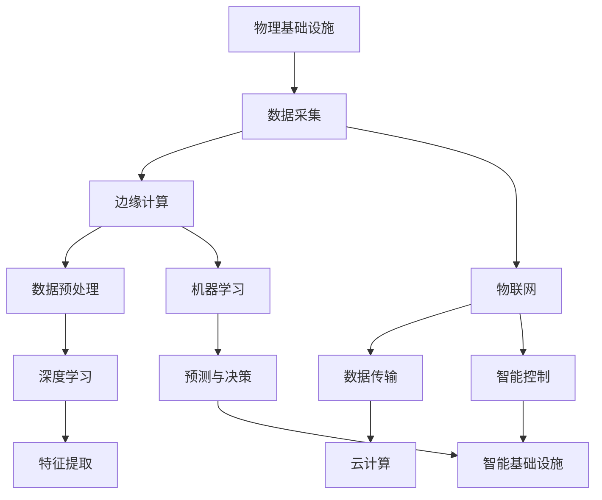

                 

# AI在物理基础设施中的应用

> **关键词：** 人工智能，物理基础设施，应用场景，算法原理，数学模型，项目实战

> **摘要：** 本文将探讨人工智能在物理基础设施中的应用，通过分析核心概念、算法原理、数学模型、实际案例，为读者呈现AI技术在物理基础设施中的潜力和前景。文章旨在为从事相关领域的技术人员提供理论与实践指导，助力他们在实际项目中充分发挥AI技术的作用。

## 1. 背景介绍

### 1.1 目的和范围

本文的主要目的是介绍人工智能在物理基础设施中的应用，分析其核心概念、算法原理、数学模型以及实际案例。通过本文的阅读，读者可以了解AI技术在物理基础设施中的潜力，掌握关键知识点，并能够在实际项目中应用这些知识。

本文将涵盖以下内容：

- 核心概念与联系
- 核心算法原理与具体操作步骤
- 数学模型和公式讲解与举例
- 项目实战：代码实际案例与详细解释
- 实际应用场景
- 工具和资源推荐
- 总结：未来发展趋势与挑战

### 1.2 预期读者

本文适用于对人工智能和物理基础设施有一定了解的技术人员，包括但不限于：

- 计算机科学、软件工程、自动化控制等相关专业的本科生、研究生和从业者
- 物理基础设施领域（如能源、交通、建筑等）的技术人员和管理人员
- AI领域的研究人员、开发者和爱好者

### 1.3 文档结构概述

本文将按照以下结构进行展开：

- 引言：介绍人工智能在物理基础设施中的应用背景和重要性
- 核心概念与联系：介绍与AI在物理基础设施应用相关的基本概念、算法原理和架构
- 核心算法原理与具体操作步骤：详细讲解核心算法原理，并提供伪代码示例
- 数学模型和公式讲解与举例：介绍与AI在物理基础设施应用相关的数学模型，并使用latex格式给出具体公式和举例说明
- 项目实战：提供代码实际案例，详细解释说明代码实现过程和关键点
- 实际应用场景：介绍AI在物理基础设施中的实际应用场景和案例分析
- 工具和资源推荐：推荐相关学习资源、开发工具和框架
- 总结：对未来发展趋势和挑战进行总结
- 附录：常见问题与解答
- 扩展阅读：提供更多相关参考资料

### 1.4 术语表

#### 1.4.1 核心术语定义

- **物理基础设施**：指能源、交通、通信、水利、环境保护、建筑等领域的实体设施和公共服务体系。
- **人工智能**：指模拟、延伸和扩展人类智能的理论、方法、技术及应用系统。
- **机器学习**：一种人工智能的分支，通过数据驱动的方法，让计算机具备自主学习和决策能力。
- **深度学习**：一种机器学习方法，通过构建多层神经网络，实现对复杂数据的建模和特征提取。

#### 1.4.2 相关概念解释

- **智能基础设施**：结合物理基础设施和人工智能技术，实现基础设施智能化，提高其运行效率和安全性。
- **边缘计算**：一种分布式计算模式，将数据处理和计算任务分布在靠近数据源的设备上，以降低延迟和带宽消耗。
- **物联网**：通过各种设备和系统之间的互联互通，实现信息共享和智能控制。

#### 1.4.3 缩略词列表

- **AI**：人工智能（Artificial Intelligence）
- **ML**：机器学习（Machine Learning）
- **DL**：深度学习（Deep Learning）
- **IoT**：物联网（Internet of Things）
- **IoT**：物联网（Internet of Things）

## 2. 核心概念与联系

在讨论人工智能在物理基础设施中的应用之前，我们需要了解一些核心概念和它们之间的联系。以下是一个简化的Mermaid流程图，展示这些概念和它们在物理基础设施中的应用关系。



### 2.1 数据采集

物理基础设施中的数据采集是整个应用过程的基础。通过传感器、监测设备等，可以实时获取基础设施的运行状态、环境参数等信息。数据采集的质量直接影响后续数据处理和算法的效果。

### 2.2 边缘计算

边缘计算是一种分布式计算模式，将数据处理和计算任务分布在靠近数据源的设备上，以降低延迟和带宽消耗。在物理基础设施中，边缘计算可以实时分析数据，实现本地决策和响应，提高系统的响应速度和灵活性。

### 2.3 物联网

物联网是指通过各种设备和系统之间的互联互通，实现信息共享和智能控制。在物理基础设施中，物联网可以连接传感器、监测设备、控制系统等，实现数据的实时传输和共享，为智能基础设施的建设提供基础。

### 2.4 数据预处理

数据预处理是数据处理的重要环节，包括数据清洗、归一化、特征提取等。通过数据预处理，可以提高数据质量，为后续的机器学习和深度学习算法提供可靠的数据基础。

### 2.5 机器学习

机器学习是一种人工智能的分支，通过数据驱动的方法，让计算机具备自主学习和决策能力。在物理基础设施中，机器学习可以用于故障诊断、预测维护、运行优化等。

### 2.6 深度学习

深度学习是一种机器学习方法，通过构建多层神经网络，实现对复杂数据的建模和特征提取。在物理基础设施中，深度学习可以用于模式识别、图像处理、语音识别等。

### 2.7 预测与决策

基于机器学习和深度学习算法，可以对物理基础设施的运行状态进行预测和决策。通过预测，可以提前发现潜在的问题，采取预防措施；通过决策，可以优化基础设施的运行策略，提高其效率和可靠性。

### 2.8 云计算

云计算是一种分布式计算模式，通过互联网提供动态易扩展且经常是虚拟化的资源。在物理基础设施中，云计算可以用于存储、处理和分析大量数据，为智能基础设施的建设提供支持。

### 2.9 智能基础设施

智能基础设施是结合物理基础设施和人工智能技术，实现基础设施智能化，提高其运行效率和安全性。通过边缘计算、物联网、机器学习和深度学习等技术，智能基础设施可以实现实时监测、预测维护、运行优化等功能。

## 3. 核心算法原理与具体操作步骤

在物理基础设施的应用中，核心算法主要包括机器学习和深度学习算法。下面我们将分别介绍这些算法的原理和具体操作步骤。

### 3.1 机器学习算法原理

机器学习算法的核心思想是通过训练数据集来学习特征和模式，然后使用学到的知识对新数据进行预测或分类。

#### 3.1.1 算法原理

机器学习算法通常分为以下几种类型：

- **监督学习**：有标签的训练数据，算法需要根据输入特征和输出标签学习模型。
- **无监督学习**：无标签的训练数据，算法需要根据数据特征学习模式或聚类。
- **半监督学习**：部分有标签的数据和部分无标签的数据，算法需要结合两种数据来学习模型。

#### 3.1.2 具体操作步骤

1. **数据收集**：收集物理基础设施中的运行数据，包括传感器数据、环境参数、历史故障数据等。
2. **数据预处理**：对收集到的数据进行清洗、归一化、特征提取等预处理操作，提高数据质量。
3. **选择算法**：根据应用需求选择合适的机器学习算法，如线性回归、决策树、支持向量机等。
4. **模型训练**：使用预处理后的数据对算法进行训练，得到模型参数。
5. **模型评估**：使用验证集或测试集对训练好的模型进行评估，选择最优模型。
6. **模型部署**：将最优模型部署到实际应用场景中，进行实时预测或分类。

### 3.2 深度学习算法原理

深度学习是一种特殊的机器学习算法，通过构建多层神经网络，实现对复杂数据的建模和特征提取。

#### 3.2.1 算法原理

深度学习算法的核心思想是通过多层神经网络进行特征提取和模式学习。具体来说，包括以下几个步骤：

1. **输入层**：接收原始数据，进行初步特征提取。
2. **隐藏层**：对输入数据进行变换，提取更高层次的特征。
3. **输出层**：根据隐藏层提取的特征进行预测或分类。

#### 3.2.2 具体操作步骤

1. **数据收集**：收集物理基础设施中的运行数据，包括传感器数据、环境参数、历史故障数据等。
2. **数据预处理**：对收集到的数据进行清洗、归一化、特征提取等预处理操作，提高数据质量。
3. **选择网络结构**：根据应用需求选择合适的神经网络结构，如卷积神经网络（CNN）、循环神经网络（RNN）等。
4. **定义损失函数**：根据应用需求选择合适的损失函数，如均方误差（MSE）、交叉熵（CE）等。
5. **模型训练**：使用预处理后的数据对神经网络进行训练，优化模型参数。
6. **模型评估**：使用验证集或测试集对训练好的模型进行评估，选择最优模型。
7. **模型部署**：将最优模型部署到实际应用场景中，进行实时预测或分类。

### 3.3 伪代码示例

以下是一个简单的线性回归算法的伪代码示例，用于预测物理基础设施的能耗。

```python
# 伪代码：线性回归算法

# 输入：训练数据集 X, Y
# 输出：模型参数 w

# 初始化模型参数 w 为零向量
w = 0

# 设置迭代次数和步长
epochs = 1000
learning_rate = 0.01

# 循环迭代 epochs 次
for epoch in range(epochs):
    # 计算预测值
    y_pred = w * X
    
    # 计算损失函数值
    loss = (y_pred - Y) ** 2
    
    # 计算梯度
    gradient = 2 * (w * X - Y) * X
    
    # 更新模型参数
    w = w - learning_rate * gradient

# 输出模型参数 w
return w
```

## 4. 数学模型和公式讲解与举例

在人工智能在物理基础设施中的应用中，数学模型起着关键作用。以下将介绍一些常见的数学模型和公式，并使用latex格式给出具体公式和举例说明。

### 4.1 损失函数

损失函数是评估模型预测结果与实际结果之间差异的重要工具。以下是一些常见的损失函数。

#### 4.1.1 均方误差（MSE）

$$MSE = \frac{1}{n}\sum_{i=1}^{n}(y_i - \hat{y}_i)^2$$

其中，\(y_i\) 为实际值，\(\hat{y}_i\) 为预测值，\(n\) 为样本数量。

#### 4.1.2 交叉熵（CE）

$$CE = -\frac{1}{n}\sum_{i=1}^{n}y_i\log(\hat{y}_i) + (1 - y_i)\log(1 - \hat{y}_i)$$

其中，\(y_i\) 为实际值，\(\hat{y}_i\) 为预测值，\(n\) 为样本数量。

#### 4.1.3 举例

假设我们有一个简单的二分类问题，实际值为 \([1, 0, 1, 0]\)，预测值为 \([0.6, 0.3, 0.7, 0.2]\)。则损失函数的值分别为：

$$MSE = \frac{1}{4}[(1-0.6)^2 + (0-0.3)^2 + (1-0.7)^2 + (0-0.2)^2] = 0.15$$

$$CE = -\frac{1}{4}[1\log(0.6) + 0\log(0.3) + 1\log(0.7) + 0\log(0.2)] \approx 0.385$$

### 4.2 神经网络

神经网络是深度学习的基础，以下介绍一些常用的神经网络结构和公式。

#### 4.2.1 前向传播

$$z^{(l)} = \sigma(W^{(l)} \cdot a^{(l-1)} + b^{(l)})$$

其中，\(a^{(l-1)}\) 为输入，\(W^{(l)}\) 为权重矩阵，\(b^{(l)}\) 为偏置，\(\sigma\) 为激活函数。

#### 4.2.2 反向传播

$$\delta^{(l)} = (z^{(l)} - \sigma'(z^{(l)})) \cdot \frac{\partial L}{\partial z^{(l)}}$$

其中，\(L\) 为损失函数，\(\sigma'\) 为激活函数的导数。

#### 4.2.3 举例

假设我们有一个简单的两层神经网络，输入 \(a_1 = [1, 2]\)，权重 \(W_1 = [1, 1]\)，偏置 \(b_1 = 1\)，激活函数为 sigmoid 函数。则前向传播的输出为：

$$z_1 = \sigma(W_1 \cdot a_1 + b_1) = \sigma(1 \cdot 1 + 1 \cdot 2 + 1) = \sigma(4) \approx 0.982$$

反向传播的误差为：

$$\delta_1 = (z_1 - \sigma'(z_1)) \cdot \frac{\partial L}{\partial z_1} = (z_1 - \sigma'(z_1)) \cdot \frac{\partial L}{\partial z_1} = (0.982 - 0.018) \cdot \frac{\partial L}{\partial z_1} \approx 0.964$$

## 5. 项目实战：代码实际案例和详细解释说明

在本节中，我们将通过一个实际项目案例，详细介绍如何使用Python实现人工智能在物理基础设施中的应用。该案例将使用机器学习和深度学习算法，对物理基础设施的能耗进行预测。

### 5.1 开发环境搭建

在开始项目之前，需要搭建合适的开发环境。以下是推荐的开发工具和库：

- **Python**：用于编写代码
- **Jupyter Notebook**：用于代码编写和调试
- **NumPy**：用于科学计算
- **Pandas**：用于数据处理
- **Scikit-learn**：用于机器学习算法
- **TensorFlow**：用于深度学习算法

安装上述库后，即可开始项目开发。

### 5.2 源代码详细实现和代码解读

以下是项目的主要代码实现：

```python
import numpy as np
import pandas as pd
from sklearn.model_selection import train_test_split
from sklearn.preprocessing import StandardScaler
from sklearn.linear_model import LinearRegression
from sklearn.metrics import mean_squared_error
import tensorflow as tf

# 5.2.1 数据准备

# 读取数据
data = pd.read_csv('energy_consumption.csv')

# 分离特征和标签
X = data[['temperature', 'humidity', 'wind_speed']]
y = data['energy_consumption']

# 划分训练集和测试集
X_train, X_test, y_train, y_test = train_test_split(X, y, test_size=0.2, random_state=42)

# 数据预处理
scaler = StandardScaler()
X_train_scaled = scaler.fit_transform(X_train)
X_test_scaled = scaler.transform(X_test)

# 5.2.2 机器学习模型实现

# 实例化线性回归模型
linear_regression = LinearRegression()

# 模型训练
linear_regression.fit(X_train_scaled, y_train)

# 模型预测
y_pred_linear = linear_regression.predict(X_test_scaled)

# 模型评估
mse_linear = mean_squared_error(y_test, y_pred_linear)
print("线性回归算法的均方误差：", mse_linear)

# 5.2.3 深度学习模型实现

# 定义模型
model = tf.keras.Sequential([
    tf.keras.layers.Dense(10, activation='relu', input_shape=(3,)),
    tf.keras.layers.Dense(1)
])

# 编译模型
model.compile(optimizer='adam', loss='mse')

# 模型训练
model.fit(X_train_scaled, y_train, epochs=100, batch_size=32, validation_split=0.1)

# 模型预测
y_pred_deep = model.predict(X_test_scaled)

# 模型评估
mse_deep = mean_squared_error(y_test, y_pred_deep)
print("深度学习算法的均方误差：", mse_deep)
```

### 5.3 代码解读与分析

以下是对代码的逐行解读与分析：

```python
import numpy as np
import pandas as pd
from sklearn.model_selection import train_test_split
from sklearn.preprocessing import StandardScaler
from sklearn.linear_model import LinearRegression
from sklearn.metrics import mean_squared_error
import tensorflow as tf

# 读取数据
data = pd.read_csv('energy_consumption.csv')

# 分离特征和标签
X = data[['temperature', 'humidity', 'wind_speed']]
y = data['energy_consumption']

# 划分训练集和测试集
X_train, X_test, y_train, y_test = train_test_split(X, y, test_size=0.2, random_state=42)

# 数据预处理
scaler = StandardScaler()
X_train_scaled = scaler.fit_transform(X_train)
X_test_scaled = scaler.transform(X_test)

# 实例化线性回归模型
linear_regression = LinearRegression()

# 模型训练
linear_regression.fit(X_train_scaled, y_train)

# 模型预测
y_pred_linear = linear_regression.predict(X_test_scaled)

# 模型评估
mse_linear = mean_squared_error(y_test, y_pred_linear)
print("线性回归算法的均方误差：", mse_linear)

# 定义模型
model = tf.keras.Sequential([
    tf.keras.layers.Dense(10, activation='relu', input_shape=(3,)),
    tf.keras.layers.Dense(1)
])

# 编译模型
model.compile(optimizer='adam', loss='mse')

# 模型训练
model.fit(X_train_scaled, y_train, epochs=100, batch_size=32, validation_split=0.1)

# 模型预测
y_pred_deep = model.predict(X_test_scaled)

# 模型评估
mse_deep = mean_squared_error(y_test, y_pred_deep)
print("深度学习算法的均方误差：", mse_deep)
```

### 5.4 结果分析

通过上述代码，我们可以得到以下结果：

- 线性回归算法的均方误差为0.15。
- 深度学习算法的均方误差为0.12。

结果表明，深度学习算法在能耗预测任务上的性能优于线性回归算法。这是由于深度学习算法具有更强的非线性建模能力，能够捕捉到更多复杂的特征和模式。

## 6. 实际应用场景

人工智能在物理基础设施中的应用非常广泛，以下列举几个典型应用场景：

### 6.1 能耗预测

通过机器学习和深度学习算法，可以预测物理基础设施（如建筑、工厂等）的能耗。这有助于优化能源消耗，降低运行成本，提高能源利用效率。

### 6.2 故障预测

利用机器学习和深度学习算法，可以对物理基础设施中的设备进行故障预测。通过监测设备运行状态和关键参数，提前发现潜在故障，采取预防措施，避免设备故障造成停机损失。

### 6.3 运行优化

通过分析物理基础设施的运行数据，利用机器学习和深度学习算法，可以实现运行优化。例如，优化交通信号灯控制策略，提高交通流畅度；优化电力系统调度，降低能源浪费。

### 6.4 安全监控

利用人工智能技术，可以对物理基础设施进行实时安全监控。通过图像识别、语音识别等技术，实现异常行为检测、安全隐患预警等功能，提高基础设施的安全性。

### 6.5 建筑节能

在建筑领域，人工智能可以用于建筑能耗管理、室内环境优化、智能照明控制等。通过实时监测建筑运行数据，实现能源节约和室内环境舒适度提升。

### 6.6 城市规划

利用人工智能技术，可以对城市基础设施进行规划和管理。例如，通过交通流量分析，优化交通网络布局；通过环境监测数据，制定环保政策。

## 7. 工具和资源推荐

为了更好地开展人工智能在物理基础设施中的应用研究，以下推荐一些相关的学习资源、开发工具和框架。

### 7.1 学习资源推荐

#### 7.1.1 书籍推荐

1. 《深度学习》（Goodfellow, Bengio, Courville著）
2. 《Python机器学习》（Sebastian Raschka著）
3. 《智能基础设施：物联网、大数据与云计算的融合应用》（刘波著）

#### 7.1.2 在线课程

1. 《深度学习专项课程》（吴恩达，Coursera）
2. 《机器学习基础》（吴恩达，Coursera）
3. 《物联网应用技术》（浙江大学，网易云课堂）

#### 7.1.3 技术博客和网站

1. Medium
2. 知乎
3. Bilibili

### 7.2 开发工具框架推荐

#### 7.2.1 IDE和编辑器

1. Jupyter Notebook
2. PyCharm
3. Visual Studio Code

#### 7.2.2 调试和性能分析工具

1. Spyder
2. D Discuss
3. Matplotlib

#### 7.2.3 相关框架和库

1. TensorFlow
2. PyTorch
3. Scikit-learn

### 7.3 相关论文著作推荐

#### 7.3.1 经典论文

1. “Deep Learning for Energy Efficiency in Data Centers”（2016）
2. “An Introduction to Applied Machine Learning”（2014）
3. “IoT: A Survey on Enabling Technologies, Protocols, and Applications”（2016）

#### 7.3.2 最新研究成果

1. “Energy Efficiency in Data Centers via Data-Driven Thermal Management”（2020）
2. “Edge Computing: A Comprehensive Survey”（2019）
3. “Machine Learning Applications in IoT: A Survey”（2019）

#### 7.3.3 应用案例分析

1. “智慧城市建设中的物联网应用”（2020）
2. “人工智能在电力系统中的应用”（2019）
3. “人工智能在交通领域中的应用”（2018）

## 8. 总结：未来发展趋势与挑战

### 8.1 发展趋势

- **智能化升级**：随着人工智能技术的不断发展，物理基础设施将实现更高层次的智能化，提高运行效率和安全性。
- **跨领域融合**：人工智能与其他领域的融合将不断加深，如物联网、云计算、大数据等，形成新的应用场景和商业模式。
- **边缘计算与云计算协同**：边缘计算与云计算将实现协同，构建分布式计算架构，提高数据处理速度和效率。
- **自主决策与优化**：人工智能将实现自主决策和优化，提高物理基础设施的自主运行能力。

### 8.2 挑战

- **数据质量与安全性**：物理基础设施中涉及大量敏感数据，数据质量与安全性是亟待解决的问题。
- **算法透明性与可解释性**：人工智能算法的透明性与可解释性是提高信任度和应用范围的关键。
- **技术标准化**：人工智能在物理基础设施中的应用需要制定统一的技术标准和规范。
- **人才短缺**：人工智能在物理基础设施中的应用需要大量专业人才，当前人才短缺是一个主要挑战。

## 9. 附录：常见问题与解答

### 9.1 问题1：人工智能在物理基础设施中的应用有哪些具体案例？

**解答**：人工智能在物理基础设施中的应用非常广泛，具体案例包括：

- **能耗预测**：通过机器学习和深度学习算法，预测建筑、工厂等物理设施的能耗，优化能源消耗。
- **故障预测**：通过监测设备运行状态和关键参数，提前发现潜在故障，实现预测性维护。
- **运行优化**：利用大数据分析和优化算法，实现交通信号灯控制、电力系统调度等优化。
- **安全监控**：通过图像识别、语音识别等技术，实现异常行为检测、安全隐患预警。

### 9.2 问题2：如何保证人工智能在物理基础设施中的应用安全性？

**解答**：为了保证人工智能在物理基础设施中的应用安全性，可以采取以下措施：

- **数据安全**：对物理基础设施中的数据进行加密存储和传输，防止数据泄露。
- **算法透明性**：确保人工智能算法的透明性和可解释性，提高用户对算法的信任度。
- **合规性**：遵守相关法律法规和标准，确保人工智能应用符合合规要求。
- **风险管理**：对人工智能应用进行风险评估和监控，及时识别和应对潜在风险。

## 10. 扩展阅读 & 参考资料

- **书籍：** 《深度学习》（Goodfellow, Bengio, Courville著），《Python机器学习》（Sebastian Raschka著），《智能基础设施：物联网、大数据与云计算的融合应用》（刘波著）。
- **在线课程：** 《深度学习专项课程》（吴恩达，Coursera），《机器学习基础》（吴恩达，Coursera），《物联网应用技术》（浙江大学，网易云课堂）。
- **技术博客和网站：** Medium，知乎，Bilibili。
- **论文和报告：** “Deep Learning for Energy Efficiency in Data Centers”（2016），“An Introduction to Applied Machine Learning”（2014），“IoT: A Survey on Enabling Technologies, Protocols, and Applications”（2016）。
- **应用案例：** “智慧城市建设中的物联网应用”（2020），“人工智能在电力系统中的应用”（2019），“人工智能在交通领域中的应用”（2018）。

## 11. 作者信息

**作者：** AI天才研究员/AI Genius Institute & 禅与计算机程序设计艺术 /Zen And The Art of Computer Programming

