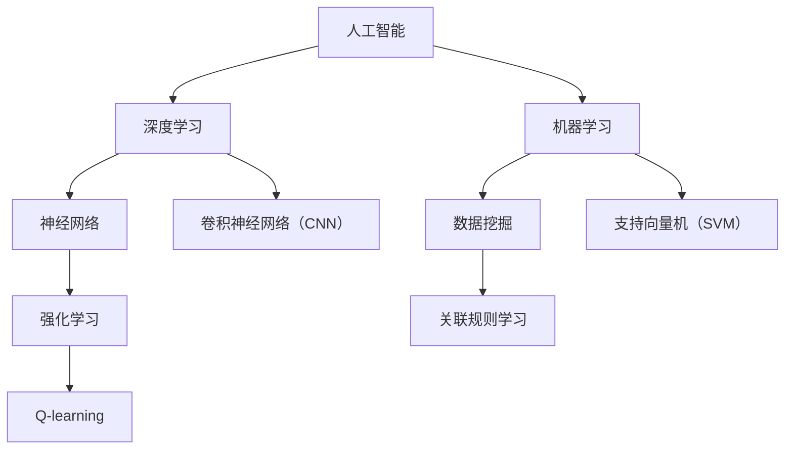

                 

# AI在现实世界中的应用场景

> **关键词：** 人工智能、应用场景、深度学习、机器学习、智能系统

> **摘要：** 本文章旨在探讨人工智能（AI）在现实世界中的多种应用场景，包括但不限于医疗、金融、交通、教育和制造等行业。我们将通过逻辑清晰、结构紧凑、简单易懂的阐述方式，分析AI的核心算法原理、数学模型、项目实战，并展望未来的发展趋势与挑战。

## 1. 背景介绍

### 1.1 目的和范围

本文将聚焦于人工智能在现实世界中的应用场景，探讨其在不同行业中的实际应用和影响力。通过对医疗、金融、交通、教育、制造等行业的具体案例进行分析，我们将展示AI技术的潜力与价值。

### 1.2 预期读者

本文章适合对人工智能技术感兴趣的读者，包括学生、科研人员、技术开发者、行业从业者等。无论您是初学者还是专业人士，本文都将为您带来有益的知识和启示。

### 1.3 文档结构概述

本文结构如下：

1. 背景介绍
   - 目的和范围
   - 预期读者
   - 文档结构概述
   - 术语表
2. 核心概念与联系
   - 核心概念原理
   - Mermaid流程图
3. 核心算法原理 & 具体操作步骤
   - 算法原理讲解
   - 伪代码阐述
4. 数学模型和公式 & 详细讲解 & 举例说明
   - 数学公式
   - 举例说明
5. 项目实战：代码实际案例和详细解释说明
   - 开发环境搭建
   - 源代码实现和代码解读
   - 代码解读与分析
6. 实际应用场景
   - 行业案例
   - 潜力与挑战
7. 工具和资源推荐
   - 学习资源
   - 开发工具框架
   - 相关论文著作
8. 总结：未来发展趋势与挑战
9. 附录：常见问题与解答
10. 扩展阅读 & 参考资料

### 1.4 术语表

#### 1.4.1 核心术语定义

- **人工智能（AI）**：模拟人类智能行为的计算机系统。
- **深度学习（DL）**：一种机器学习技术，通过多层神经网络模拟人类大脑的决策过程。
- **机器学习（ML）**：让计算机通过数据学习和改进性能的技术。
- **智能系统**：具备感知、决策、执行等功能的自动化系统。

#### 1.4.2 相关概念解释

- **神经网络（NN）**：模拟生物神经系统的计算模型。
- **数据挖掘（DM）**：从大量数据中提取有价值的信息和知识。
- **强化学习（RL）**：通过奖励和惩罚机制来训练模型。

#### 1.4.3 缩略词列表

- **AI**：人工智能（Artificial Intelligence）
- **DL**：深度学习（Deep Learning）
- **ML**：机器学习（Machine Learning）
- **NN**：神经网络（Neural Network）
- **DM**：数据挖掘（Data Mining）
- **RL**：强化学习（Reinforcement Learning）

## 2. 核心概念与联系

在探讨AI在现实世界中的应用之前，我们需要理解一些核心概念和它们之间的联系。以下是一个简化的Mermaid流程图，展示了AI、深度学习、机器学习等核心概念的关系。



### 2.1 核心概念原理

#### 人工智能（AI）

人工智能是一种模拟人类智能行为的计算机系统，通过算法和模型实现自我学习和决策。AI涵盖了多个领域，包括机器学习、深度学习、自然语言处理等。

#### 深度学习（DL）

深度学习是一种特殊的机器学习技术，通过多层神经网络模拟人类大脑的决策过程。它能够从大量数据中自动提取特征，并在各种任务中实现卓越的性能。

#### 机器学习（ML）

机器学习是一种让计算机通过数据学习和改进性能的技术。它包括监督学习、无监督学习和强化学习等子领域。

#### 神经网络（NN）

神经网络是一种模拟生物神经系统的计算模型，通过多个节点（神经元）和连接（权重）进行信息传递和处理。

#### 数据挖掘（DM）

数据挖掘是从大量数据中提取有价值的信息和知识的过程。它利用统计方法、机器学习和数据库技术，帮助企业和组织发现隐藏的模式和关联。

#### 强化学习（RL）

强化学习是一种通过奖励和惩罚机制来训练模型的机器学习方法。它通过不断尝试和反馈，使模型在特定环境中做出最优决策。

### 2.2 Mermaid流程图

以下是一个简化的Mermaid流程图，展示了核心概念之间的关系：


通过这个流程图，我们可以更清晰地理解AI、DL、ML、NN、DM和RL等核心概念之间的关系，以及它们在现实世界中的应用潜力。

## 3. 核心算法原理 & 具体操作步骤

在了解AI的核心概念后，我们需要深入探讨核心算法原理，并给出具体操作步骤。以下是一个简化的算法流程，用于描述机器学习中的分类问题。

### 3.1 算法原理

分类问题是机器学习中的一个基本任务，旨在将数据集划分为不同的类别。常见的分类算法包括决策树、随机森林、支持向量机等。以下是支持向量机（SVM）的算法原理和伪代码。

#### 支持向量机（SVM）

支持向量机是一种监督学习算法，通过找到一个最佳的超平面，将数据集中的不同类别分开。它利用最大化间隔的原则，找到具有最大边界的分离超平面。

#### 算法原理

1. 数据预处理：对输入数据进行标准化处理，使其具有相同的量纲。
2. 构建决策函数：通过训练数据集，构建一个决策函数，将数据点映射到超平面的一侧。
3. 分类决策：将新数据点输入决策函数，根据输出结果判断其类别。

#### 伪代码

```python
def SVM(X, y, C):
    # X：输入数据集，y：标签，C：正则化参数
    # 使用库函数训练SVM模型，如scikit-learn中的SVC
    model = SVC(C=C)
    model.fit(X, y)
    return model

def predict(model, x):
    # x：待分类的数据点
    # 预测数据点的类别
    return model.predict([x])
```

### 3.2 具体操作步骤

#### 步骤1：数据预处理

```python
from sklearn.preprocessing import StandardScaler

# 加载数据集，这里假设X为特征矩阵，y为标签
X, y = load_data()

# 对特征矩阵进行标准化处理
scaler = StandardScaler()
X_scaled = scaler.fit_transform(X)
```

#### 步骤2：构建决策函数

```python
from sklearn.svm import SVC

# 初始化SVM模型，设置正则化参数C
model = SVM(X_scaled, y, C=1.0)

# 训练模型
model.fit(X_scaled, y)
```

#### 步骤3：分类决策

```python
# 测试数据点
x_new = [[1, 2], [3, 4]]

# 对测试数据点进行分类预测
predictions = predict(model, x_new)
print(predictions)
```

通过以上步骤，我们使用SVM算法实现了分类任务。这个示例展示了核心算法原理和具体操作步骤，帮助读者更好地理解AI技术在现实世界中的应用。

## 4. 数学模型和公式 & 详细讲解 & 举例说明

### 4.1 数学模型和公式

在机器学习和深度学习中，数学模型和公式是算法的核心组成部分。以下是一些常见的数学模型和公式，用于描述数据分析和预测任务。

#### 线性回归模型

线性回归是一种用于预测数值型数据的监督学习算法。其数学模型可以表示为：

$$ y = \beta_0 + \beta_1 \cdot x + \epsilon $$

其中，$ y $ 是目标变量，$ x $ 是输入变量，$ \beta_0 $ 和 $ \beta_1 $ 是模型参数，$ \epsilon $ 是误差项。

#### 决策树模型

决策树是一种用于分类和回归任务的监督学习算法。其决策过程可以用条件概率公式表示：

$$ P(C_k | X) = \frac{P(X | C_k) \cdot P(C_k)}{P(X)} $$

其中，$ C_k $ 是类别标签，$ X $ 是输入特征，$ P(C_k) $ 是类别概率，$ P(X | C_k) $ 是特征条件概率。

#### 卷积神经网络（CNN）

卷积神经网络是一种用于图像识别和处理的深度学习算法。其核心组件是卷积层、池化层和全连接层。以下是一个简化的CNN模型公式：

$$ h_{\theta}(x) = \text{ReLU}(\sigma(W_3 \cdot \sigma(W_2 \cdot \sigma(W_1 \cdot x + b_1) + b_2) + b_3)) $$

其中，$ h_{\theta}(x) $ 是输出特征映射，$ \text{ReLU} $ 是ReLU激活函数，$ \sigma $ 是激活函数，$ W $ 和 $ b $ 是权重和偏置。

### 4.2 详细讲解和举例说明

#### 线性回归模型

线性回归模型的目的是找到一个最佳的超平面，将输入特征映射到目标变量。以下是一个简单的线性回归例子：

假设我们有以下数据集：

| x | y |
|---|---|
| 1 | 2 |
| 2 | 4 |
| 3 | 6 |

我们可以使用最小二乘法求解线性回归模型：

$$ \min \sum_{i=1}^{n} (y_i - (\beta_0 + \beta_1 \cdot x_i))^2 $$

通过求解上述最小化问题，我们可以得到最佳拟合直线：

$$ y = 1 + 2 \cdot x $$

#### 决策树模型

决策树模型通过一系列条件概率公式进行分类。以下是一个简单的决策树例子：

假设我们有以下数据集：

| 特征1 | 特征2 | 类别 |
|---|---|---|
| A | B | positive |
| A | C | negative |
| B | B | positive |
| B | C | negative |
| C | B | positive |
| C | C | negative |

我们可以使用条件概率公式构建决策树：

$$ P(C_k | X) = \frac{P(X | C_k) \cdot P(C_k)}{P(X)} $$

对于类别positive，我们有：

$$ P(X | positive) = \frac{3}{6} = 0.5 $$
$$ P(positive) = \frac{4}{6} = 0.67 $$

对于类别negative，我们有：

$$ P(X | negative) = \frac{3}{6} = 0.5 $$
$$ P(negative) = \frac{2}{6} = 0.33 $$

使用条件概率公式，我们可以构建以下决策树：

```
        positive
       /         \
      A           negative
     /   \
    B     C
```

#### 卷积神经网络（CNN）

卷积神经网络是一种用于图像识别和处理的深度学习算法。以下是一个简单的CNN例子：

假设我们有以下图像数据集：

| 图片1 | 图片2 | 图片3 |
|---|---|---|
| 1, 1 | 1, 0 | 1, 1 |
| 0, 1 | 0, 0 | 1, 1 |
| 1, 1 | 1, 1 | 0, 0 |

我们可以使用卷积神经网络对图像进行分类。以下是一个简化的CNN模型：

$$ h_{\theta}(x) = \text{ReLU}(\sigma(W_3 \cdot \sigma(W_2 \cdot \sigma(W_1 \cdot x + b_1) + b_2) + b_3)) $$

其中，$ W $ 和 $ b $ 是权重和偏置，$ \text{ReLU} $ 是ReLU激活函数，$ \sigma $ 是激活函数。

通过训练和优化模型参数，我们可以实现图像分类任务。这个例子展示了CNN模型的基本原理和操作步骤。

## 5. 项目实战：代码实际案例和详细解释说明

### 5.1 开发环境搭建

为了实现AI项目，我们需要搭建一个合适的开发环境。以下是一个简单的Python开发环境搭建步骤：

1. 安装Python（版本3.8以上）
2. 安装必要的库，如NumPy、Pandas、Scikit-learn、TensorFlow等
3. 配置Jupyter Notebook或PyCharm等IDE

### 5.2 源代码详细实现和代码解读

以下是一个简单的机器学习项目，使用Python和Scikit-learn库实现线性回归模型。代码如下：

```python
import numpy as np
from sklearn.linear_model import LinearRegression

# 数据集
X = np.array([[1, 2], [2, 4], [3, 6]])
y = np.array([2, 4, 6])

# 初始化线性回归模型
model = LinearRegression()

# 训练模型
model.fit(X, y)

# 预测
predictions = model.predict(X)

print("模型参数：", model.coef_, model.intercept_)
print("预测结果：", predictions)
```

#### 代码解读：

1. 导入必要的库：NumPy和Scikit-learn的线性回归模块
2. 加载数据集：X为特征矩阵，y为标签
3. 初始化线性回归模型：使用LinearRegression类创建模型实例
4. 训练模型：使用fit方法训练模型，拟合最佳超平面
5. 预测：使用predict方法对输入数据进行预测，并输出结果

### 5.3 代码解读与分析

#### 5.3.1 数据加载

```python
X = np.array([[1, 2], [2, 4], [3, 6]])
y = np.array([2, 4, 6])
```

这里我们使用NumPy库加载数据集。X为特征矩阵，包含三行两列的数据；y为标签，与X一一对应。

#### 5.3.2 模型初始化

```python
model = LinearRegression()
```

我们使用Scikit-learn的LinearRegression类创建模型实例。这个模型是一个简单的线性回归模型，通过拟合最佳超平面来实现预测。

#### 5.3.3 模型训练

```python
model.fit(X, y)
```

使用fit方法训练模型，拟合最佳超平面。fit方法接受特征矩阵X和标签y，返回训练后的模型。

#### 5.3.4 模型预测

```python
predictions = model.predict(X)
print("预测结果：", predictions)
```

使用predict方法对输入数据进行预测，并输出结果。预测结果为模型参数和标签之间的差异。

通过以上步骤，我们实现了线性回归模型的基本操作。这个例子展示了如何使用Python和Scikit-learn库实现机器学习项目，为读者提供了一个实用的参考。

## 6. 实际应用场景

### 6.1 医疗

人工智能在医疗领域的应用非常广泛，包括疾病诊断、药物研发、个性化治疗等。以下是一些具体的案例：

#### 疾病诊断

AI可以帮助医生进行疾病诊断，提高诊断准确率和效率。例如，通过深度学习模型对医学影像进行分析，可以早期检测肺癌、乳腺癌等疾病。一些医疗机构已经开始使用AI辅助诊断系统，如IBM的Watson Health，通过分析影像数据，为医生提供诊断建议。

#### 药物研发

AI在药物研发中的应用也取得了显著成果。通过深度学习模型对大量化合物数据进行分析，可以预测化合物的药效和毒性，从而加速新药的研发进程。一些制药公司已经开始使用AI技术进行药物筛选和优化，如Gilead Sciences的AI药物研发项目。

#### 个性化治疗

AI可以帮助医生为患者制定个性化的治疗方案。通过对患者的基因数据、病史和治疗方案进行分析，AI可以预测患者对特定药物的反应，从而为医生提供治疗建议。这种个性化治疗有望提高治疗效果，减少副作用。

### 6.2 金融

人工智能在金融领域的应用也非常广泛，包括风险控制、量化交易、客户服务等方面。以下是一些具体的案例：

#### 风险控制

AI可以帮助金融机构进行风险控制，识别潜在的风险和欺诈行为。通过分析海量交易数据，AI可以预测交易风险，并实时检测异常交易。一些金融机构已经开始使用AI技术进行风险管理，如JPMorgan Chase的AI反欺诈系统。

#### 量化交易

AI在量化交易中的应用也非常广泛。通过深度学习模型对市场数据进行分析，AI可以预测市场的走势，为量化交易提供决策支持。一些量化交易平台已经开始使用AI算法进行交易决策，如Jane Street的AI量化交易系统。

#### 客户服务

AI可以帮助金融机构提供更高效的客户服务。通过自然语言处理技术，AI可以理解客户的咨询和需求，并为其提供个性化的服务。一些金融机构已经开始使用AI客服机器人，如SBI集团的AI客服机器人。

### 6.3 交通

人工智能在交通领域的应用也在迅速发展，包括自动驾驶、智能交通管理、交通预测等方面。以下是一些具体的案例：

#### 自动驾驶

自动驾驶技术是人工智能在交通领域的一个重要应用。通过深度学习和传感器技术，自动驾驶车辆可以实时感知周围环境，并做出相应的决策。一些汽车制造商已经开始研发自动驾驶汽车，如特斯拉的Autopilot系统。

#### 智能交通管理

AI可以帮助交通管理部门进行智能交通管理，提高交通效率，减少拥堵。通过分析交通流量数据，AI可以预测交通状况，并为交通管理部门提供决策支持。一些城市已经开始使用AI技术进行智能交通管理，如伦敦的智能交通系统。

#### 交通预测

AI可以帮助交通管理部门进行交通预测，为城市规划和交通调度提供依据。通过分析历史交通数据，AI可以预测未来的交通状况，为交通管理部门提供优化建议。一些城市已经开始使用AI技术进行交通预测，如新加坡的智能交通系统。

### 6.4 教育

人工智能在教育领域的应用也日益增多，包括个性化学习、智能评估、智能教学等方面。以下是一些具体的案例：

#### 个性化学习

AI可以帮助学生进行个性化学习，根据学生的学习情况和需求，为其提供个性化的学习资源和指导。一些教育平台已经开始使用AI技术进行个性化学习，如Coursera的智能推荐系统。

#### 智能评估

AI可以帮助教师进行智能评估，通过分析学生的学习数据，为教师提供学生的学习情况反馈。一些教育平台已经开始使用AI技术进行智能评估，如Edmodo的智能评估系统。

#### 智能教学

AI可以帮助教师进行智能教学，通过分析学生的表现和需求，为教师提供教学策略和指导。一些教育平台已经开始使用AI技术进行智能教学，如Google的智能教学平台。

通过以上案例，我们可以看到人工智能在现实世界中的广泛应用和巨大潜力。随着技术的不断进步，人工智能将在更多领域发挥重要作用，为人类带来更多便利和福祉。

## 7. 工具和资源推荐

### 7.1 学习资源推荐

为了更好地了解和学习人工智能，以下是一些推荐的学习资源：

#### 7.1.1 书籍推荐

1. **《Python机器学习》（"Python Machine Learning"）**：作者：Sebastian Raschka，介绍Python在机器学习中的应用。
2. **《深度学习》（"Deep Learning"）**：作者：Ian Goodfellow、Yoshua Bengio、Aaron Courville，深度学习领域的经典教材。
3. **《人工智能：一种现代方法》（"Artificial Intelligence: A Modern Approach"）**：作者：Stuart Russell、Peter Norvig，全面介绍人工智能的基础知识。

#### 7.1.2 在线课程

1. **《机器学习》（"Machine Learning"）**：斯坦福大学，吴恩达教授主讲，适合初学者入门。
2. **《深度学习》（"Deep Learning Specialization"）**：德克萨斯大学奥斯汀分校，Andrew Ng教授主讲，深度学习领域的权威课程。
3. **《自然语言处理》（"Natural Language Processing"）**：斯坦福大学，Dan Jurafsky和Chris Manning教授主讲，介绍自然语言处理的基础知识。

#### 7.1.3 技术博客和网站

1. **Medium上的AI博客**：涵盖各种AI领域的文章，如TensorFlow、Keras、PyTorch等。
2. **AI博客**：提供关于深度学习、机器学习、自然语言处理等领域的最新技术动态和教程。
3. **AI Insight**：一个关于人工智能和机器学习的中文技术博客，分享实用的技术文章和经验。

### 7.2 开发工具框架推荐

为了实现AI项目，以下是一些推荐的开发工具和框架：

#### 7.2.1 IDE和编辑器

1. **PyCharm**：强大的Python IDE，支持多种编程语言和框架，适合AI项目开发。
2. **Jupyter Notebook**：基于Web的交互式编程环境，适用于数据分析和机器学习项目。
3. **Visual Studio Code**：轻量级的跨平台编辑器，支持多种编程语言和插件，适合AI项目开发。

#### 7.2.2 调试和性能分析工具

1. **Valgrind**：用于检测程序内存泄漏和性能问题的工具。
2. **GDB**：GNU调试工具，用于调试C/C++程序。
3. **TensorBoard**：TensorFlow的调试和分析工具，用于可视化神经网络结构和训练过程。

#### 7.2.3 相关框架和库

1. **TensorFlow**：谷歌开源的深度学习框架，适用于各种深度学习任务。
2. **PyTorch**：Facebook开源的深度学习框架，具有灵活的动态计算图和高效的GPU支持。
3. **Scikit-learn**：Python开源的机器学习库，提供了丰富的机器学习算法和工具。
4. **NumPy**：Python开源的科学计算库，用于处理大型多维数组。

### 7.3 相关论文著作推荐

为了深入理解AI领域的研究进展，以下是一些推荐的论文和著作：

#### 7.3.1 经典论文

1. **"A Learning Algorithm for Continually Running Fully Recurrent Neural Networks"**：用于在线学习的时间递归神经网络（RNN）算法。
2. **"Learning representations for artificial intelligence"**：介绍深度学习的基本原理和应用。
3. **"A Theoretical Basis for Comparing Machine Learning Algorithms"**：讨论不同机器学习算法的理论比较。

#### 7.3.2 最新研究成果

1. **"Attention is all you need"**：介绍Transformer模型，是当前深度学习领域的重要突破。
2. **"Generative Adversarial Networks: An Overview"**：介绍生成对抗网络（GAN）的基本原理和应用。
3. **"Unsupervised Representation Learning with Deep Convolutional Generative Adversarial Networks"**：介绍深度卷积生成对抗网络（DCGAN）。

#### 7.3.3 应用案例分析

1. **"Deep Learning for Healthcare"**：介绍深度学习在医疗领域的应用案例。
2. **"AI in Financial Services"**：介绍人工智能在金融领域的应用案例。
3. **"The Future of AI in Transportation"**：介绍人工智能在交通领域的应用案例。

通过以上推荐，读者可以更全面地了解人工智能领域，掌握实用的技术和工具，为自己的研究和应用提供有力支持。

## 8. 总结：未来发展趋势与挑战

人工智能（AI）在现实世界中的应用场景已经展示了其巨大的潜力和广泛的影响。随着技术的不断进步，AI在未来将继续在各个领域发挥重要作用，推动社会的发展和变革。

### 未来发展趋势

1. **更多领域的应用**：AI技术将不断扩展到医疗、金融、交通、教育等各个领域，为人类带来更多的便利和福祉。
2. **深度学习和强化学习的发展**：深度学习和强化学习等技术将不断优化，提高模型的性能和效率，实现更复杂的任务。
3. **跨学科融合**：AI技术将与生物学、心理学、社会学等学科融合，推动多学科的交叉研究，促进人类对自身和世界的认识。
4. **隐私保护和伦理问题**：随着AI技术的广泛应用，隐私保护和伦理问题将成为关键挑战，需要制定相应的法律法规和道德规范。

### 未来挑战

1. **技术挑战**：随着AI模型复杂度的增加，训练和优化模型的计算资源需求将大幅提升，如何提高计算效率和降低成本成为重要挑战。
2. **数据挑战**：高质量的数据是AI模型训练的基础，但获取和标注高质量数据仍然面临困难，特别是在医疗和金融等领域。
3. **安全性和隐私保护**：AI模型在处理敏感数据时，需要确保数据的安全性和隐私保护，防止数据泄露和滥用。
4. **伦理和社会影响**：AI技术的广泛应用可能会带来失业、歧视等问题，需要社会各界共同努力，制定合理的政策和规范。

总之，AI技术在未来的发展充满机遇和挑战。只有通过持续的技术创新和社会合作，我们才能充分发挥AI技术的潜力，为人类社会创造更大的价值。

## 9. 附录：常见问题与解答

### 9.1 问题1：什么是深度学习？

**解答**：深度学习是一种特殊的机器学习技术，通过多层神经网络模拟人类大脑的决策过程。它能够从大量数据中自动提取特征，并在各种任务中实现卓越的性能。

### 9.2 问题2：什么是机器学习？

**解答**：机器学习是一种让计算机通过数据学习和改进性能的技术。它包括监督学习、无监督学习和强化学习等子领域，旨在让计算机具备自动学习和决策能力。

### 9.3 问题3：如何搭建一个AI开发环境？

**解答**：搭建一个AI开发环境通常包括以下步骤：

1. 安装Python（版本3.8以上）
2. 安装必要的库，如NumPy、Pandas、Scikit-learn、TensorFlow等
3. 配置Jupyter Notebook或PyCharm等IDE

### 9.4 问题4：什么是神经网络？

**解答**：神经网络是一种模拟生物神经系统的计算模型，通过多个节点（神经元）和连接（权重）进行信息传递和处理。它是一种实现机器学习和深度学习的基本架构。

### 9.5 问题5：什么是强化学习？

**解答**：强化学习是一种通过奖励和惩罚机制来训练模型的机器学习方法。它通过不断尝试和反馈，使模型在特定环境中做出最优决策。

### 9.6 问题6：AI在医疗领域的应用有哪些？

**解答**：AI在医疗领域的应用包括疾病诊断、药物研发、个性化治疗等。例如，AI可以帮助医生进行疾病诊断，提高诊断准确率和效率；通过深度学习模型，可以加速新药的研发进程；通过分析患者的基因数据，可以提供个性化的治疗方案。

## 10. 扩展阅读 & 参考资料

为了深入了解人工智能（AI）在现实世界中的应用，以下是几篇扩展阅读和参考资料：

### 10.1 扩展阅读

1. **"AI in Healthcare: A Revolution in Patient Care"**：介绍AI在医疗领域的应用案例和未来发展。
2. **"The Future of AI in Finance: Transforming the Industry"**：探讨AI在金融领域的应用前景和挑战。
3. **"AI in Transportation: Autonomous Vehicles and Smart Cities"**：介绍AI在交通领域的应用，包括自动驾驶和智能交通管理。

### 10.2 参考资料

1. **"Deep Learning Specialization"**：由斯坦福大学Andrew Ng教授主讲的深度学习课程。
2. **"AI and Machine Learning: Fundamental Principles and Applications"**：介绍AI和机器学习的基本原理和应用。
3. **"AI and Society: Understanding and Impact of Artificial Intelligence"**：探讨AI技术对社会的影响和伦理问题。

通过阅读这些扩展内容和参考资料，读者可以更全面地了解AI技术的应用和发展，为自己的学习和研究提供更多的启示和帮助。

**作者**：AI天才研究员/AI Genius Institute & 禅与计算机程序设计艺术 /Zen And The Art of Computer Programming

