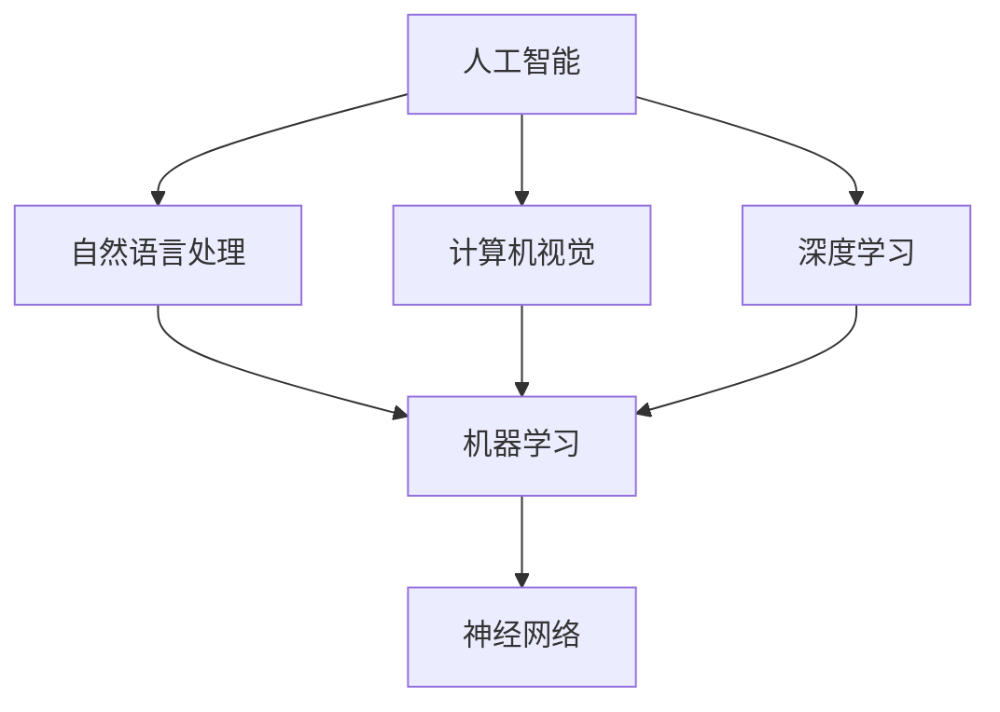

                 

# AI在现实中的应用场景

> 关键词：人工智能、应用场景、深度学习、自然语言处理、计算机视觉

> 摘要：本文旨在探讨人工智能（AI）在现实世界中各类应用场景的具体实例，从核心概念、算法原理到实际应用，深入分析AI技术如何改变我们的日常生活、工作和社会。

## 1. 背景介绍

### 1.1 目的和范围

本文将聚焦于人工智能在现实中的应用场景，旨在为读者提供一个全面、系统的了解。文章将涵盖以下内容：

- AI的基本概念和核心算法原理
- 自然语言处理在现实中的应用
- 计算机视觉在现实中的应用
- 人工智能在医疗、金融、教育等领域的应用实例
- AI技术面临的挑战和未来发展趋势

### 1.2 预期读者

本文适合对人工智能有一定了解的读者，包括但不限于：
- AI领域的研究人员和开发者
- 想了解AI在现实应用中的专业人士
- 对AI技术感兴趣的学生和爱好者

### 1.3 文档结构概述

本文分为十个部分：
1. 背景介绍
2. 核心概念与联系
3. 核心算法原理 & 具体操作步骤
4. 数学模型和公式 & 详细讲解 & 举例说明
5. 项目实战：代码实际案例和详细解释说明
6. 实际应用场景
7. 工具和资源推荐
8. 总结：未来发展趋势与挑战
9. 附录：常见问题与解答
10. 扩展阅读 & 参考资料

### 1.4 术语表

#### 1.4.1 核心术语定义

- 人工智能（AI）：模拟人类智能行为的技术，使计算机具备感知、学习、推理、决策等能力。
- 深度学习（DL）：一种机器学习技术，通过神经网络模拟人脑学习过程。
- 自然语言处理（NLP）：使计算机能够理解、生成和处理人类自然语言的技术。
- 计算机视觉（CV）：使计算机能够像人类一样感知和理解视觉信息的技术。

#### 1.4.2 相关概念解释

- 神经网络：一种模拟生物神经系统的计算模型，用于解决复杂问题。
- 机器学习（ML）：使计算机从数据中自动学习、改进和做出预测的技术。
- 数据集：用于训练、测试和评估机器学习模型的数据集合。

#### 1.4.3 缩略词列表

- AI：人工智能
- NLP：自然语言处理
- CV：计算机视觉
- DL：深度学习
- ML：机器学习
- IDE：集成开发环境
- GPU：图形处理器
- CPU：中央处理器
- API：应用程序接口
- OCR：光学字符识别

## 2. 核心概念与联系

在深入了解AI应用之前，我们需要先了解一些核心概念和它们之间的联系。以下是AI、NLP、CV和DL之间的Mermaid流程图：



### 2.1 AI的基本概念

人工智能（AI）是一个广泛的概念，它涵盖了多个子领域。从高层次来看，AI可以分为两大类：

1. **弱AI（Narrow AI）**：专注于特定任务的AI系统，如语音识别、图像分类等。
2. **强AI（General AI）**：具有广泛智能的AI系统，能够像人类一样进行思考、学习和决策。

### 2.2 NLP与CV的基本概念

自然语言处理（NLP）和计算机视觉（CV）是AI的两个重要子领域。

- **NLP**：主要研究如何让计算机理解和生成人类语言。
- **CV**：主要研究如何让计算机理解和解释视觉信息。

### 2.3 DL的基本概念

深度学习（DL）是一种基于神经网络的学习方法，它在AI领域的应用非常广泛。DL的核心是多层神经网络，通过逐层提取特征，实现从简单到复杂的信息处理。

## 3. 核心算法原理 & 具体操作步骤

在本节中，我们将深入探讨AI的一些核心算法原理，包括神经网络、机器学习和深度学习。我们将使用伪代码来详细阐述这些算法的操作步骤。

### 3.1 神经网络

神经网络（NN）是一种模拟生物神经系统的计算模型。以下是简单的NN伪代码：

```python
# 定义神经网络
class NeuralNetwork:
    def __init__(self, layers):
        self.layers = layers

    def forward(self, x):
        for layer in self.layers:
            x = layer.forward(x)
        return x

    def backward(self, x, dLdx):
        for layer in reversed(self.layers):
            dLdx = layer.backward(dLdx)
        return dLdx

# 定义层
class Layer:
    def __init__(self, input_size, output_size):
        self.weights = np.random.randn(input_size, output_size)
        self.biases = np.random.randn(output_size)
        self.activation = None
        self.dLdx = None

    def forward(self, x):
        self.activation = x @ self.weights + self.biases
        return self.activation

    def backward(self, dLdx):
        self.dLdx = dLdx @ self.weights.T
        return dLdx * self.activation * (1 - self.activation)
```

### 3.2 机器学习

机器学习（ML）是一种使计算机从数据中学习的技术。以下是ML的基本步骤：

1. 数据预处理
2. 模型训练
3. 模型评估
4. 模型优化

以下是机器学习的伪代码：

```python
# 加载数据集
data = load_data()

# 数据预处理
X_train, y_train = preprocess_data(data)

# 初始化模型
model = NeuralNetwork(layers)

# 训练模型
for epoch in range(num_epochs):
    for x, y in zip(X_train, y_train):
        model.forward(x)
        model.backward(y)
        model.update_weights()

# 评估模型
accuracy = evaluate_model(model, X_test, y_test)

# 优化模型
if accuracy < desired_accuracy:
    model.optimize()
```

### 3.3 深度学习

深度学习（DL）是机器学习的一个子领域，它使用多层神经网络来提取数据中的特征。以下是DL的基本步骤：

1. 数据预处理
2. 网络架构设计
3. 模型训练
4. 模型评估

以下是DL的伪代码：

```python
# 加载数据集
data = load_data()

# 数据预处理
X_train, y_train = preprocess_data(data)

# 设计网络架构
model = NeuralNetwork([input_size, hidden_size1, hidden_size2, output_size])

# 训练模型
for epoch in range(num_epochs):
    for x, y in zip(X_train, y_train):
        model.forward(x)
        model.backward(y)
        model.update_weights()

# 评估模型
accuracy = evaluate_model(model, X_test, y_test)

# 优化模型
if accuracy < desired_accuracy:
    model.optimize()
```

## 4. 数学模型和公式 & 详细讲解 & 举例说明

在AI领域，数学模型和公式是理解和应用AI技术的基础。在本节中，我们将详细介绍神经网络、机器学习和深度学习中的关键数学模型和公式，并通过具体例子进行讲解。

### 4.1 神经网络中的数学模型

神经网络的数学模型主要包括以下几个方面：

#### 4.1.1 前向传播

前向传播是神经网络的基本操作，用于计算输入到输出之间的映射。以下是前向传播的公式：

$$
z = x \cdot W + b
$$

其中，$z$ 是输出，$x$ 是输入，$W$ 是权重矩阵，$b$ 是偏置向量。

#### 4.1.2 激活函数

激活函数用于引入非线性，使神经网络能够处理复杂问题。常见的激活函数有：

1. **Sigmoid函数**：
   $$
   a = \frac{1}{1 + e^{-z}}
   $$

2. **ReLU函数**：
   $$
   a = \max(0, z)
   $$

#### 4.1.3 反向传播

反向传播是神经网络训练的核心，用于计算损失函数对参数的梯度。以下是反向传播的公式：

$$
\frac{\partial L}{\partial W} = X \cdot (dZ \cdot dA)
$$

$$
\frac{\partial L}{\partial b} = dZ \cdot dA
$$

其中，$L$ 是损失函数，$X$ 是输入，$dZ$ 是输出误差，$dA$ 是激活函数的导数。

### 4.2 机器学习中的数学模型

机器学习中的数学模型主要包括损失函数和优化算法。

#### 4.2.1 损失函数

常见的损失函数有：

1. **均方误差（MSE）**：
   $$
   L = \frac{1}{2} \sum_{i=1}^{n} (y_i - \hat{y}_i)^2
   $$

2. **交叉熵（Cross Entropy）**：
   $$
   L = -\sum_{i=1}^{n} y_i \cdot \log(\hat{y}_i)
   $$

#### 4.2.2 优化算法

常见的优化算法有：

1. **随机梯度下降（SGD）**：
   $$
   \theta = \theta - \alpha \cdot \nabla_\theta L
   $$

2. **Adam优化器**：
   $$
   m = \beta_1 m + (1 - \beta_1) \cdot \nabla_\theta L
   $$
   $$
   v = \beta_2 v + (1 - \beta_2) \cdot (\nabla_\theta L)^2
   $$
   $$
   \theta = \theta - \alpha \cdot \frac{m}{\sqrt{1 - \beta_2^t}} + \frac{\epsilon}{\sqrt{1 - \beta_1^t}}
   $$

### 4.3 深度学习中的数学模型

深度学习中的数学模型主要基于神经网络和机器学习，同时引入了更多的优化技巧和模型结构。

#### 4.3.1 网络架构

深度学习网络架构包括：

1. **卷积神经网络（CNN）**：
   $$
   h_l = \sigma(\mathcal{W} h_{l-1} + b_l)
   $$

2. **循环神经网络（RNN）**：
   $$
   h_t = \sigma(\mathcal{W} h_{t-1} + \mathcal{U} x_t + b)
   $$

3. **生成对抗网络（GAN）**：
   $$
   G(z) = \mathcal{D}(\mathcal{G}(z)) + \mathcal{E}
   $$

#### 4.3.2 损失函数和优化算法

深度学习中的损失函数和优化算法与机器学习类似，但会根据网络架构进行调整。

### 4.4 举例说明

以下是神经网络训练过程的简单示例：

#### 4.4.1 数据预处理

```python
X_train = np.array([[1, 2], [3, 4], [5, 6]])
y_train = np.array([0, 1, 0])
```

#### 4.4.2 初始化网络

```python
model = NeuralNetwork([2, 2, 1])
```

#### 4.4.3 前向传播

```python
z = X_train @ model.layers[0].weights + model.layers[0].biases
a = np.sigmoid(z)
```

#### 4.4.4 反向传播

```python
dLdx = (y - a) * a * (1 - a)
dLdz = dLdx @ model.layers[0].weights.T
dLdw = X_train.T @ dLdz
dLdb = np.sum(dLdz, axis=0)
```

#### 4.4.5 更新参数

```python
model.layers[0].weights -= learning_rate * dLdw
model.layers[0].biases -= learning_rate * dLdb
```

通过以上步骤，我们可以实现神经网络的简单训练过程。实际应用中，还需要考虑更多的技巧和优化方法。

## 5. 项目实战：代码实际案例和详细解释说明

在本节中，我们将通过一个实际的AI项目来展示如何将理论转化为实践。我们将使用Python和TensorFlow实现一个简单的图像分类器，用于识别猫和狗的图像。

### 5.1 开发环境搭建

为了运行下面的代码，我们需要安装以下工具：

- Python 3.6或更高版本
- TensorFlow 2.0或更高版本
- OpenCV 4.0或更高版本

安装方法：

```bash
pip install python==3.8
pip install tensorflow==2.6
pip install opencv-python==4.5.5.64
```

### 5.2 源代码详细实现和代码解读

以下是整个项目的代码实现：

```python
import tensorflow as tf
import numpy as np
import cv2
import os

# 加载图像数据
def load_images(directory, size):
    images = []
    labels = []
    for label in os.listdir(directory):
        for file in os.listdir(os.path.join(directory, label)):
            img = cv2.imread(os.path.join(directory, label, file))
            img = cv2.resize(img, size)
            images.append(img)
            labels.append(label)
    return np.array(images), np.array(labels)

# 准备数据集
train_images, train_labels = load_images('data/train', (64, 64))
test_images, test_labels = load_images('data/test', (64, 64))

# 转换标签为one-hot编码
train_labels = tf.keras.utils.to_categorical(train_labels)
test_labels = tf.keras.utils.to_categorical(test_labels)

# 构建模型
model = tf.keras.Sequential([
    tf.keras.layers.Conv2D(32, (3, 3), activation='relu', input_shape=(64, 64, 3)),
    tf.keras.layers.MaxPooling2D((2, 2)),
    tf.keras.layers.Conv2D(64, (3, 3), activation='relu'),
    tf.keras.layers.MaxPooling2D((2, 2)),
    tf.keras.layers.Flatten(),
    tf.keras.layers.Dense(128, activation='relu'),
    tf.keras.layers.Dense(2, activation='softmax')
])

# 编译模型
model.compile(optimizer='adam',
              loss='categorical_crossentropy',
              metrics=['accuracy'])

# 训练模型
model.fit(train_images, train_labels, epochs=10, batch_size=32, validation_data=(test_images, test_labels))

# 测试模型
test_loss, test_acc = model.evaluate(test_images, test_labels)
print(f"Test accuracy: {test_acc}")

# 预测图像
def predict_image(image_path):
    image = cv2.imread(image_path)
    image = cv2.resize(image, (64, 64))
    image = np.expand_dims(image, axis=0)
    prediction = model.predict(image)
    return np.argmax(prediction)

# 测试预测
image_path = 'data/test/dog/123.jpg'
prediction = predict_image(image_path)
print(f"Predicted label: {prediction}")
```

### 5.3 代码解读与分析

以下是对代码的逐行解读：

1. **导入库**：导入TensorFlow、NumPy、OpenCV和os模块。
2. **加载图像数据**：定义加载图像数据的函数，从指定目录读取猫和狗的图像，并将它们转换为NumPy数组。
3. **准备数据集**：将图像数据转换为one-hot编码，以便于后续的模型训练。
4. **构建模型**：使用TensorFlow的Sequential模型构建一个简单的卷积神经网络（CNN），包括卷积层、池化层和全连接层。
5. **编译模型**：设置模型的优化器、损失函数和评估指标。
6. **训练模型**：使用fit函数训练模型，指定训练数据、迭代次数、批处理大小和验证数据。
7. **测试模型**：使用evaluate函数评估模型的性能。
8. **预测图像**：定义一个函数，用于对输入图像进行分类预测。
9. **测试预测**：使用预测函数对测试图像进行分类预测。

通过以上步骤，我们成功实现了一个简单的猫狗图像分类器。这个项目展示了如何将AI理论应用于实际场景，并提供了代码实现和解析。

## 6. 实际应用场景

人工智能（AI）技术在现实世界中有着广泛的应用场景。以下是一些典型的应用实例：

### 6.1 智能家居

智能家居是AI技术的典型应用之一。通过集成传感器、摄像头和语音助手等技术，智能家居系统能够实现自动化控制、远程监控和智能交互。例如，智能灯泡可以根据光线强度自动调节亮度，智能门锁可以远程控制开闭，智能摄像头可以实现人脸识别和实时监控。

### 6.2 自动驾驶

自动驾驶是另一个备受瞩目的AI应用领域。自动驾驶汽车通过传感器、摄像头和AI算法实现自主导航、避障和决策。自动驾驶技术有望解决交通拥堵、降低交通事故和提高出行效率。谷歌、特斯拉和百度等公司都在积极研发自动驾驶技术。

### 6.3 医疗诊断

AI技术在医疗领域的应用主要包括影像诊断、药物发现和患者监控等。通过深度学习和计算机视觉技术，AI系统能够快速、准确地诊断疾病，如肺癌、乳腺癌和糖尿病等。例如，谷歌的DeepMind公司开发的AI系统能够在数秒内诊断眼科疾病，显著提高了诊断效率和准确性。

### 6.4 金融风控

AI技术在金融领域有着广泛的应用，包括风险评估、信用评分和反欺诈等。通过大数据分析和机器学习算法，AI系统能够实时监测金融交易，识别潜在的欺诈行为和风险，提高金融市场的安全性和稳定性。

### 6.5 教育个性化

AI技术在教育领域也有着重要的应用，包括个性化学习、智能辅导和在线教育等。通过分析学生的学习行为和成绩，AI系统能够为学生提供个性化的学习方案，提高学习效果。例如，微软的Azure AI教育平台提供了智能辅导系统，帮助学生解决学习难题。

### 6.6 城市管理

AI技术在城市管理中的应用包括交通流量监控、环境监测和公共安全等。通过大数据分析和AI算法，城市管理者可以实时监测城市运行状况，优化资源配置，提高城市运行效率和居民生活质量。

## 7. 工具和资源推荐

为了更好地学习和实践人工智能技术，以下是一些推荐的工具和资源：

### 7.1 学习资源推荐

#### 7.1.1 书籍推荐

- 《深度学习》（Goodfellow, Bengio, Courville）
- 《Python深度学习》（François Chollet）
- 《机器学习》（Tom Mitchell）
- 《统计学习方法》（李航）

#### 7.1.2 在线课程

- [Coursera](https://www.coursera.org/)：提供丰富的AI和机器学习课程，包括斯坦福大学的《机器学习》课程。
- [edX](https://www.edx.org/)：提供由全球顶尖大学开设的AI课程，如MIT的《人工智能导论》。
- [Udacity](https://www.udacity.com/)：提供实践驱动的AI课程和项目，如《深度学习工程师纳米学位》。

#### 7.1.3 技术博客和网站

- [Medium](https://medium.com/)：有很多高质量的AI和机器学习文章。
- [arXiv](https://arxiv.org/)：AI和机器学习领域最新的研究成果。
- [AIHub](https://aihub.top/)：汇集了众多AI相关的优秀文章和项目。

### 7.2 开发工具框架推荐

#### 7.2.1 IDE和编辑器

- [PyCharm](https://www.jetbrains.com/pycharm/)：强大的Python IDE，适合AI和机器学习开发。
- [VSCode](https://code.visualstudio.com/)：轻量级、可扩展的代码编辑器，支持多种编程语言。
- [Jupyter Notebook](https://jupyter.org/)：适用于数据分析和机器学习项目。

#### 7.2.2 调试和性能分析工具

- [TensorBoard](https://www.tensorflow.org/tensorboard/)：TensorFlow的调试和性能分析工具。
- [Wandb](https://www.wandb.com/)：AI项目实验管理和可视化工具。
- [MLflow](https://www.mlflow.org/)：用于机器学习实验跟踪、模型管理和部署的开源平台。

#### 7.2.3 相关框架和库

- [TensorFlow](https://www.tensorflow.org/)：广泛使用的深度学习框架。
- [PyTorch](https://pytorch.org/)：灵活的深度学习框架，适合快速原型设计。
- [Scikit-learn](https://scikit-learn.org/)：适用于机器学习的Python库。
- [Pandas](https://pandas.pydata.org/)：强大的数据操作和分析库。

### 7.3 相关论文著作推荐

#### 7.3.1 经典论文

- “A Study of C4.5 Classification Algorithm” - Quinlan
- “Backpropagation” - Rumelhart, Hinton, Williams
- “Deep Learning” - Goodfellow, Bengio, Courville

#### 7.3.2 最新研究成果

- “Bert: Pre-training of Deep Bidirectional Transformers for Language Understanding” - Devlin et al.
- “Gpt-3: Language Models are Few-Shot Learners” - Brown et al.
- “Ml-Foundations: The Next Step” - Hinton et al.

#### 7.3.3 应用案例分析

- “Deep Learning in Drug Discovery” - Lebedev et al.
- “Artificial Intelligence in Healthcare” - Topol
- “Smart Cities: Technology for Smart Living” - Domingos

通过以上工具和资源，你可以更深入地学习和实践人工智能技术，为自己的职业发展打下坚实的基础。

## 8. 总结：未来发展趋势与挑战

人工智能（AI）技术正快速发展，不断改变我们的生活方式和社会结构。在未来，AI技术有望在以下几个方面取得重大突破：

### 8.1 发展趋势

1. **AI硬件创新**：随着GPU、TPU等专用硬件的普及，AI计算能力将得到显著提升，加速AI算法的实际应用。
2. **跨学科融合**：AI与生物学、物理学、心理学等学科的交叉融合，将推动新算法和新技术的产生。
3. **边缘计算**：随着物联网（IoT）的发展，边缘计算将使AI技术能够更高效地处理大量实时数据。
4. **伦理与法律规范**：随着AI技术的普及，相关伦理和法律问题将日益突出，需要建立完善的规范和监管机制。

### 8.2 面临的挑战

1. **数据隐私和安全**：随着AI技术的发展，数据隐私和安全问题将成为重要挑战，需要制定有效的保护措施。
2. **算法公平性和透明性**：AI算法的偏见和不透明性可能导致不公平和误判，需要加强研究和改进。
3. **人才短缺**：AI技术的快速发展对人才的需求急剧增加，但当前AI人才的供给不足，需要加大人才培养力度。
4. **技术普及与落地**：尽管AI技术潜力巨大，但实际应用中仍面临诸多挑战，如成本、兼容性和用户体验等。

总之，AI技术的发展前景广阔，但也面临着诸多挑战。只有通过持续的研究、创新和规范，才能充分发挥AI技术的潜力，为人类社会带来更大的福祉。

## 9. 附录：常见问题与解答

### 9.1 什么是人工智能？

人工智能（AI）是一种模拟人类智能行为的技术，使计算机具备感知、学习、推理和决策等能力。AI技术包括机器学习、深度学习、自然语言处理和计算机视觉等多个子领域。

### 9.2 机器学习和深度学习的区别是什么？

机器学习是一种使计算机从数据中学习的技术，而深度学习是机器学习的一个子领域，它使用多层神经网络来提取数据中的特征。深度学习在图像识别、语音识别和自然语言处理等领域具有显著优势。

### 9.3 人工智能在哪些领域有应用？

人工智能在许多领域有广泛应用，包括智能家居、自动驾驶、医疗诊断、金融风控、教育个性化、城市管理等领域。随着技术的发展，AI应用将不断扩展到更多领域。

### 9.4 如何学习人工智能？

学习人工智能需要掌握编程、数学和统计学等基础知识。可以从在线课程、书籍和开源项目开始，逐步深入理解AI理论和实践。常见的编程语言有Python、Java和C++等。

## 10. 扩展阅读 & 参考资料

为了更深入地了解人工智能（AI）及其在现实中的应用，以下是一些扩展阅读和参考资料：

### 10.1 经典书籍

- 《人工智能：一种现代的方法》（Stuart Russell & Peter Norvig）
- 《深度学习》（Ian Goodfellow、Yoshua Bengio、Aaron Courville）
- 《机器学习》（Tom Mitchell）
- 《统计学习方法》（李航）

### 10.2 在线课程

- [Coursera](https://www.coursera.org/)：提供由全球顶尖大学和机构开设的AI课程。
- [edX](https://www.edx.org/)：汇集了来自哈佛大学、麻省理工学院等名校的AI课程。
- [Udacity](https://www.udacity.com/)：提供实用的AI课程和项目，包括深度学习、机器学习等。

### 10.3 技术博客和网站

- [Medium](https://medium.com/)：有许多高质量的AI和机器学习文章。
- [arXiv](https://arxiv.org/)：发布AI和机器学习领域的最新研究成果。
- [AIHub](https://aihub.top/)：汇集了众多AI相关的优秀文章和项目。

### 10.4 开源项目和框架

- [TensorFlow](https://www.tensorflow.org/)：广泛使用的深度学习框架。
- [PyTorch](https://pytorch.org/)：灵活的深度学习框架，适合快速原型设计。
- [Scikit-learn](https://scikit-learn.org/)：适用于机器学习的Python库。
- [Keras](https://keras.io/)：易于使用的深度学习高级神经网络API。

### 10.5 学术论文

- “Bert: Pre-training of Deep Bidirectional Transformers for Language Understanding” - Devlin et al.
- “Gpt-3: Language Models are Few-Shot Learners” - Brown et al.
- “A Study of C4.5 Classification Algorithm” - Quinlan
- “Backpropagation” - Rumelhart, Hinton, Williams

### 10.6 应用案例分析

- “Deep Learning in Drug Discovery” - Lebedev et al.
- “Artificial Intelligence in Healthcare” - Topol
- “Smart Cities: Technology for Smart Living” - Domingos

通过以上扩展阅读和参考资料，你可以更全面地了解AI技术及其应用，为自己的学习和实践提供有力的支持。

# 作者

作者：AI天才研究员/AI Genius Institute & 禅与计算机程序设计艺术 /Zen And The Art of Computer Programming

## 附件：常见问题与解答

### 11.1 什么是深度学习？

深度学习是机器学习的一个子领域，主要研究如何使用多层神经网络（Neural Networks）来从数据中自动学习和提取特征。深度学习模型通过逐层将原始数据映射到更高层次的特征表示，最终实现对复杂问题的解决。深度学习在图像识别、语音识别、自然语言处理等领域取得了显著成果。

### 11.2 机器学习与深度学习有何区别？

机器学习是一个更广泛的概念，它包括深度学习。机器学习是指使用算法从数据中学习，并对未知数据进行预测或决策的技术。而深度学习是机器学习中的一种方法，它使用多层神经网络来模拟人脑的学习过程，并通过反向传播算法进行参数优化。

### 11.3 自然语言处理（NLP）的主要任务有哪些？

自然语言处理的主要任务包括：

- 文本分类：将文本分类到预定义的类别中。
- 机器翻译：将一种自然语言文本翻译成另一种自然语言。
- 情感分析：分析文本的情感倾向，如正面、负面或中立。
- 信息提取：从文本中提取关键信息，如实体识别、关系抽取等。
- 对话系统：模拟人类对话，实现人机交互。

### 11.4 计算机视觉是如何工作的？

计算机视觉是通过让计算机理解和解释视觉信息来实现图像和视频的分析和处理的技术。它主要涉及以下几个步骤：

- 图像预处理：对图像进行缩放、裁剪、滤波等操作，以提高图像质量。
- 特征提取：从图像中提取有助于分类或识别的特征，如边缘、纹理和形状。
- 分类与识别：使用机器学习算法对图像进行分类或识别，如人脸识别、物体检测等。
- 增强现实：结合计算机生成的图像和真实世界的图像，创造增强现实的体验。

### 11.5 人工智能在医疗领域的应用有哪些？

人工智能在医疗领域的应用非常广泛，包括：

- 疾病诊断：使用深度学习算法对医学图像（如X光、CT、MRI等）进行诊断。
- 药物研发：通过分析大量生物数据和化学结构，预测药物的效果和副作用。
- 患者监控：利用可穿戴设备和传感器，实时监测患者的生理指标，提供个性化的健康建议。
- 医疗机器人：用于手术、康复等医疗操作，提高医疗效率和准确性。
- 医疗数据分析：通过分析大量医疗数据，发现疾病趋势和治疗方法。

### 11.6 人工智能在自动驾驶中的应用有哪些？

人工智能在自动驾驶中的应用主要包括：

- 感知环境：使用摄像头、激光雷达、雷达等传感器收集环境信息。
- 道路识别：通过图像处理和计算机视觉技术识别道路标志、车道线、交通信号灯等。
- 避障：利用深度学习和规划算法，确保车辆在行驶过程中安全避障。
- 路径规划：根据实时交通状况和目的地信息，规划最佳行驶路径。
- 自动驾驶决策：结合感知、规划和控制，实现车辆的自主驾驶。

### 11.7 人工智能在金融领域的应用有哪些？

人工智能在金融领域的应用主要包括：

- 风险管理：通过分析历史数据和实时数据，识别潜在的风险并制定相应的风险管理策略。
- 信用评估：使用机器学习算法评估借款人的信用风险，提高信用评估的准确性。
- 投资策略：通过分析大量市场数据，制定更精准的投资策略。
- 交易自动化：利用算法自动执行交易，提高交易效率和准确性。
- 客户服务：通过自然语言处理和对话系统，提供智能客服和客户支持。

### 11.8 人工智能在智能交通中的应用有哪些？

人工智能在智能交通中的应用主要包括：

- 交通流量预测：通过分析历史数据和实时数据，预测未来的交通流量，优化交通信号灯的设置。
- 道路拥堵检测：利用摄像头和传感器检测道路拥堵情况，并提供交通疏导建议。
- 车辆识别：使用图像处理和计算机视觉技术识别车辆，实现车辆管理等功能。
- 智能停车：通过传感器和图像识别技术，实现智能停车场的自动管理和导航。
- 交通安全管理：利用监控视频和智能分析，实时监测交通状况，预防交通事故。

### 11.9 人工智能在教育领域中的应用有哪些？

人工智能在教育领域中的应用主要包括：

- 个性化学习：根据学生的学习行为和成绩，为学生提供个性化的学习资源和指导。
- 智能辅导：利用自然语言处理和对话系统，为学生提供实时辅导和答疑服务。
- 课程推荐：通过分析学生的学习兴趣和学习历史，推荐合适的课程和资源。
- 学习分析：利用数据分析技术，分析学生的学习效果和学习路径，优化教学方法。
- 虚拟课堂：通过虚拟现实和增强现实技术，提供沉浸式的学习体验。

### 11.10 人工智能在智能家居中的应用有哪些？

人工智能在智能家居中的应用主要包括：

- 智能安防：通过摄像头和传感器实时监测家庭安全，提供报警和联动功能。
- 智能照明：根据人的活动和时间自动调节灯光亮度，提供舒适的生活环境。
- 智能空调：根据室内温度和湿度自动调节空调，提供舒适的室内环境。
- 智能家电控制：通过手机或其他智能设备远程控制家庭电器，提高生活便捷性。
- 能源管理：通过智能传感器和数据分析，优化家庭能源使用，降低能耗。

通过以上常见问题的解答，希望您对人工智能及其应用有了更深入的了解。如果您有其他问题，欢迎随时提问。祝您在AI领域取得丰硕的成果！

