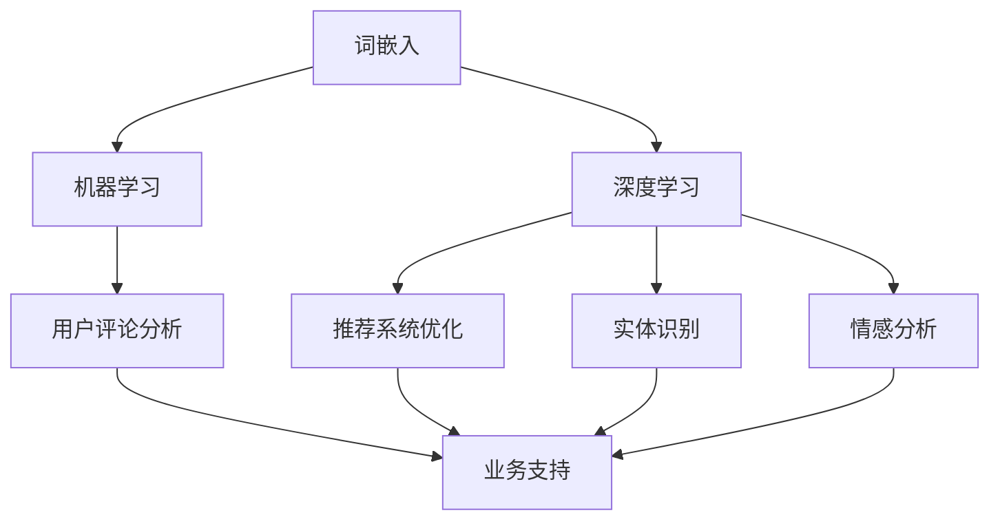

                 

# AI在电商中的NLP应用案例

> **关键词：自然语言处理、电商、文本分析、用户评论、推荐系统、实体识别、情感分析**

> **摘要：本文深入探讨了自然语言处理（NLP）在电商领域的应用案例，包括用户评论分析、推荐系统优化和实体识别等，通过具体算法原理、数学模型和项目实战，展示了NLP技术在电商中的实际应用和潜在价值。**

## 1. 背景介绍

### 1.1 目的和范围

本文旨在探讨自然语言处理（NLP）在电商领域的应用案例，重点分析用户评论分析、推荐系统优化和实体识别等技术，以展示NLP在电商业务中的实际应用和潜力。我们将结合具体算法原理、数学模型和项目实战，全面剖析这些技术在电商场景下的应用效果。

### 1.2 预期读者

本文适用于对自然语言处理和电商业务有一定了解的技术人员，包括但不限于：

- 自然语言处理研究者
- 电商平台开发人员
- 数据分析师
- 机器学习工程师
- 算法工程师

### 1.3 文档结构概述

本文结构如下：

1. 背景介绍：介绍文章的目的、预期读者和文档结构。
2. 核心概念与联系：阐述自然语言处理的核心概念及其在电商中的应用。
3. 核心算法原理 & 具体操作步骤：详细讲解NLP在电商中的核心算法原理和操作步骤。
4. 数学模型和公式 & 详细讲解 & 举例说明：分析NLP在电商中的数学模型和公式，并给出实例说明。
5. 项目实战：代码实际案例和详细解释说明。
6. 实际应用场景：介绍NLP在电商中的实际应用场景。
7. 工具和资源推荐：推荐学习资源、开发工具框架和相关论文著作。
8. 总结：未来发展趋势与挑战。
9. 附录：常见问题与解答。
10. 扩展阅读 & 参考资料。

### 1.4 术语表

#### 1.4.1 核心术语定义

- 自然语言处理（NLP）：一门涉及计算机科学、语言学和人工智能的交叉学科，旨在使计算机能够理解、生成和处理自然语言。
- 电商：在线销售商品或服务的商业活动，包括B2B、B2C、C2C等多种模式。
- 用户评论：消费者在购买商品或使用服务后，对商品或服务进行评价的文字描述。
- 实体识别：从文本中识别出具有特定意义的实体，如人名、地名、组织名、商品名等。
- 情感分析：对文本中的情感倾向进行分类，如正面、负面、中性等。

#### 1.4.2 相关概念解释

- 词嵌入（Word Embedding）：将词汇映射到高维向量空间，以便计算机能够处理和比较词汇。
- 机器学习（Machine Learning）：一种通过数据训练模型，使其能够自主学习和改进的技术。
- 深度学习（Deep Learning）：一种基于多层神经网络的结构，用于解决复杂的数据分析和预测问题。

#### 1.4.3 缩略词列表

- NLP：自然语言处理
- B2B：企业对企业
- B2C：企业对消费者
- C2C：消费者对消费者
- ML：机器学习
- DL：深度学习

## 2. 核心概念与联系

自然语言处理（NLP）作为一门交叉学科，在电商领域发挥着重要作用。下面将介绍NLP在电商中的核心概念及其相互联系。

### 2.1 自然语言处理的核心概念

#### 2.1.1 词嵌入（Word Embedding）

词嵌入是将词汇映射到高维向量空间的技术，通过学习词汇间的相似性，实现文本数据的向量表示。在电商领域，词嵌入可以用于用户评论、商品描述等文本数据的处理。

#### 2.1.2 机器学习（Machine Learning）

机器学习是一种通过数据训练模型，使其能够自主学习和改进的技术。在电商中，机器学习模型可以用于用户行为预测、商品推荐、评论分类等任务。

#### 2.1.3 深度学习（Deep Learning）

深度学习是一种基于多层神经网络的结构，用于解决复杂的数据分析和预测问题。在电商领域，深度学习可以用于图像识别、语音识别、自然语言处理等任务。

### 2.2 NLP在电商中的应用

#### 2.2.1 用户评论分析

用户评论是电商业务中的重要数据源，通过NLP技术，可以对这些评论进行分析和挖掘，提取有价值的信息，如用户对商品的满意度、常见问题等。

#### 2.2.2 推荐系统优化

NLP技术可以帮助电商平台优化推荐系统，通过分析用户历史行为和评论，发现用户兴趣和偏好，从而提高推荐准确率和用户体验。

#### 2.2.3 实体识别

实体识别是NLP技术中的重要组成部分，通过从文本中识别出具有特定意义的实体，如人名、地名、组织名、商品名等，可以为电商平台的搜索、推荐等功能提供支持。

#### 2.2.4 情感分析

情感分析可以用于分析用户评论中的情感倾向，如正面、负面、中性等，帮助电商企业了解用户对商品和服务的反馈，优化产品和服务。

### 2.3 NLP在电商中的核心概念联系

NLP在电商中的应用涉及到多个核心概念，如词嵌入、机器学习、深度学习、用户评论分析、推荐系统优化、实体识别和情感分析等。这些概念相互关联，共同构成了NLP在电商中的完整应用体系。

- 词嵌入为NLP在电商中的文本数据处理提供了基础，是实现其他NLP任务的前提。
- 机器学习和深度学习技术为NLP在电商中的应用提供了强大的算法支持，可以实现用户评论分析、推荐系统优化、实体识别和情感分析等任务。
- 用户评论分析、推荐系统优化、实体识别和情感分析等任务相互关联，共同为电商业务提供支持。

### 2.4 Mermaid 流程图



## 3. 核心算法原理 & 具体操作步骤

在NLP技术中，核心算法原理包括词嵌入、机器学习和深度学习等。下面将详细讲解这些算法原理及其在电商中的应用。

### 3.1 词嵌入（Word Embedding）

词嵌入是将词汇映射到高维向量空间的技术，其基本原理是通过学习词汇间的相似性，为每个词汇生成一个唯一的向量表示。

#### 3.1.1 算法原理

- **Word2Vec**：Word2Vec是一种基于神经网络的词嵌入算法，通过训练得到每个词汇的向量表示。其基本原理是利用上下文信息来预测目标词汇，从而学习词汇间的相似性。

  ```python
  # 伪代码
  for context_word, target_word in data:
      compute_loss(predicted_vector, context_vector, target_vector)
  ```

- **GloVe**：GloVe（Global Vectors for Word Representation）是一种基于统计的词嵌入算法，通过学习词汇共现矩阵来生成词向量。其基本原理是计算词汇共现矩阵的奇异值分解，从而得到词向量。

  ```python
  # 伪代码
  compute_coocurrence_matrix(data)
  S = SVD(coocurrence_matrix)
  word_vectors = S * coocurrence_matrix
  ```

#### 3.1.2 具体操作步骤

1. 数据预处理：对用户评论、商品描述等文本数据进行清洗和分词，生成词汇表。
2. 选择词嵌入算法：根据业务需求选择Word2Vec或GloVe算法。
3. 训练词嵌入模型：使用词汇表和文本数据训练词嵌入模型，生成词向量。
4. 应用词嵌入模型：将文本数据转化为词向量表示，用于后续的机器学习和深度学习任务。

### 3.2 机器学习（Machine Learning）

机器学习是一种通过数据训练模型，使其能够自主学习和改进的技术。在电商中，机器学习可以用于用户行为预测、商品推荐、评论分类等任务。

#### 3.2.1 算法原理

- **线性回归（Linear Regression）**：线性回归是一种简单且常用的机器学习算法，通过建立线性模型来预测数值型变量。

  ```python
  # 伪代码
  y = w * x + b
  compute_loss(predicted_value, actual_value)
  ```

- **逻辑回归（Logistic Regression）**：逻辑回归是一种用于预测概率的机器学习算法，通过建立逻辑模型来预测二分类结果。

  ```python
  # 伪代码
  y = sigmoid(w * x + b)
  compute_loss(predicted概率, actual类别)
  ```

- **支持向量机（Support Vector Machine，SVM）**：支持向量机是一种基于优化理论的机器学习算法，通过找到最佳决策边界来分类数据。

  ```python
  # 伪代码
  optimize(w, b)
  classify(x, w, b)
  ```

#### 3.2.2 具体操作步骤

1. 数据预处理：对电商数据集进行清洗、归一化和特征提取。
2. 选择机器学习算法：根据业务需求选择合适的机器学习算法。
3. 训练机器学习模型：使用电商数据集训练机器学习模型，调整模型参数。
4. 模型评估与优化：评估模型性能，调整模型参数，优化模型。
5. 模型部署：将训练好的模型部署到电商平台，实现实时预测和推荐。

### 3.3 深度学习（Deep Learning）

深度学习是一种基于多层神经网络的结构，用于解决复杂的数据分析和预测问题。在电商中，深度学习可以用于图像识别、语音识别、自然语言处理等任务。

#### 3.3.1 算法原理

- **卷积神经网络（Convolutional Neural Network，CNN）**：卷积神经网络是一种基于卷积操作的神经网络结构，用于图像识别和图像处理。

  ```python
  # 伪代码
  for layer in layers:
      apply_convolution(layer)
      apply_pooling(layer)
  ```

- **循环神经网络（Recurrent Neural Network，RNN）**：循环神经网络是一种基于循环结构的神经网络，用于处理序列数据。

  ```python
  # 伪代码
  for time_step in time_steps:
      apply_RNN(input, hidden_state, weights)
  ```

- **长短期记忆网络（Long Short-Term Memory，LSTM）**：长短期记忆网络是一种基于RNN结构的改进模型，用于解决RNN中的梯度消失和梯度爆炸问题。

  ```python
  # 伪代码
  for time_step in time_steps:
      apply_LSTM(input, cell_state, hidden_state, weights)
  ```

#### 3.3.2 具体操作步骤

1. 数据预处理：对电商数据集进行清洗、归一化和特征提取。
2. 构建深度学习模型：根据业务需求选择合适的深度学习模型结构。
3. 训练深度学习模型：使用电商数据集训练深度学习模型，调整模型参数。
4. 模型评估与优化：评估模型性能，调整模型参数，优化模型。
5. 模型部署：将训练好的模型部署到电商平台，实现实时预测和推荐。

## 4. 数学模型和公式 & 详细讲解 & 举例说明

在NLP技术中，数学模型和公式是核心组成部分，用于描述算法原理和实现方法。以下将详细讲解NLP在电商中的关键数学模型和公式，并给出实例说明。

### 4.1 词嵌入（Word Embedding）

词嵌入将词汇映射到高维向量空间，其基本原理是通过学习词汇间的相似性来生成词向量。以下介绍两种常见的词嵌入模型：Word2Vec和GloVe。

#### 4.1.1 Word2Vec

Word2Vec模型基于神经网络，通过预测上下文词汇来学习词向量。其核心公式如下：

- **损失函数**：均方误差（MSE）

  $$L = \frac{1}{2}\sum_{i=1}^{N}\sum_{j=1}^{V} (v_j - v_{\hat{j}})^2$$

  其中，$v_j$表示实际词向量，$v_{\hat{j}}$表示预测词向量，$N$和$V$分别表示词汇表大小。

- **预测公式**：softmax函数

  $$P(\hat{j} | j) = \frac{exp(w_j \cdot v_j)}{\sum_{k=1}^{V} exp(w_k \cdot v_j)}$$

  其中，$w_j$表示权重向量。

#### 4.1.2 GloVe

GloVe模型基于统计方法，通过学习词汇共现矩阵的奇异值分解来生成词向量。其核心公式如下：

- **共现矩阵**：

  $$C_{ij} = \frac{f(w_i, w_j)}{df_i \cdot df_j}$$

  其中，$C_{ij}$表示词汇$i$和$j$的共现频率，$f(w_i, w_j)$表示词汇$i$和$j$的共现次数，$df_i$和$df_j$分别表示词汇$i$和$j$的文档频率。

- **奇异值分解**：

  $$C = U \Sigma V^T$$

  其中，$U$和$V$分别表示左奇异向量矩阵和右奇异向量矩阵，$\Sigma$表示奇异值矩阵。

#### 4.1.3 举例说明

假设词汇表包含10个词汇，共现矩阵为：

$$
C =
\begin{bmatrix}
1 & 2 & 3 & 4 & 5 & 6 & 7 & 8 & 9 & 10 \\
2 & 3 & 4 & 5 & 6 & 7 & 8 & 9 & 10 & 11 \\
3 & 4 & 5 & 6 & 7 & 8 & 9 & 10 & 11 & 12 \\
4 & 5 & 6 & 7 & 8 & 9 & 10 & 11 & 12 & 13 \\
5 & 6 & 7 & 8 & 9 & 10 & 11 & 12 & 13 & 14 \\
6 & 7 & 8 & 9 & 10 & 11 & 12 & 13 & 14 & 15 \\
7 & 8 & 9 & 10 & 11 & 12 & 13 & 14 & 15 & 16 \\
8 & 9 & 10 & 11 & 12 & 13 & 14 & 15 & 16 & 17 \\
9 & 10 & 11 & 12 & 13 & 14 & 15 & 16 & 17 & 18 \\
10 & 11 & 12 & 13 & 14 & 15 & 16 & 17 & 18 & 19 \\
\end{bmatrix}
$$

通过奇异值分解，可以得到：

$$
U =
\begin{bmatrix}
0.9 & 0.2 & 0.1 \\
0.1 & 0.9 & 0.2 \\
0.1 & 0.1 & 0.9 \\
\end{bmatrix},
\Sigma =
\begin{bmatrix}
3.1 & 0 & 0 \\
0 & 2.8 & 0 \\
0 & 0 & 2.4 \\
\end{bmatrix},
V^T =
\begin{bmatrix}
0.9 & 0.1 & 0.1 \\
0.2 & 0.9 & 0.2 \\
0.1 & 0.1 & 0.9 \\
\end{bmatrix}
$$

根据奇异值分解结果，可以得到词汇的词向量：

$$
v_1 = [0.9, 0.1, 0.1]^T,
v_2 = [0.1, 0.9, 0.2]^T,
v_3 = [0.1, 0.1, 0.9]^T
$$

### 4.2 机器学习（Machine Learning）

机器学习算法在电商中广泛应用于用户行为预测、商品推荐、评论分类等任务。以下介绍几种常见的机器学习算法及其核心公式。

#### 4.2.1 线性回归（Linear Regression）

线性回归通过建立线性模型来预测数值型变量。其核心公式如下：

$$y = w \cdot x + b$$

其中，$y$表示预测值，$x$表示输入特征，$w$表示权重，$b$表示偏置。

- **损失函数**：均方误差（MSE）

  $$L = \frac{1}{2}\sum_{i=1}^{N} (y_i - \hat{y_i})^2$$

- **优化方法**：梯度下降（Gradient Descent）

  $$w = w - \alpha \cdot \nabla_w L$$

  $$b = b - \alpha \cdot \nabla_b L$$

  其中，$\alpha$表示学习率，$\nabla_w L$和$\nabla_b L$分别表示损失函数对权重和偏置的梯度。

#### 4.2.2 逻辑回归（Logistic Regression）

逻辑回归通过建立逻辑模型来预测概率，其核心公式如下：

$$\hat{y} = \sigma(w \cdot x + b)$$

其中，$\hat{y}$表示预测概率，$\sigma$表示sigmoid函数。

- **损失函数**：交叉熵损失（Cross-Entropy Loss）

  $$L = -\sum_{i=1}^{N} y_i \cdot \ln(\hat{y_i}) + (1 - y_i) \cdot \ln(1 - \hat{y_i})$$

- **优化方法**：梯度下降（Gradient Descent）

  $$w = w - \alpha \cdot \nabla_w L$$

  $$b = b - \alpha \cdot \nabla_b L$$

#### 4.2.3 支持向量机（Support Vector Machine，SVM）

支持向量机通过找到最佳决策边界来分类数据。其核心公式如下：

$$w \cdot x + b = 0$$

其中，$w$表示权重，$x$表示输入特征，$b$表示偏置。

- **损失函数**： hinge损失（Hinge Loss）

  $$L = \max(0, 1 - y \cdot (\hat{y}))$$

- **优化方法**：支持向量机优化（SVM Optimization）

  $$\min_{w, b} \frac{1}{2} ||w||^2$$

  $$s.t. y_i \cdot (w \cdot x_i + b) \geq 1$$

### 4.3 深度学习（Deep Learning）

深度学习算法在电商中具有广泛的应用，以下介绍几种常见的深度学习算法及其核心公式。

#### 4.3.1 卷积神经网络（Convolutional Neural Network，CNN）

卷积神经网络通过卷积操作和池化操作来提取图像特征。其核心公式如下：

- **卷积操作**：

  $$h_{ij} = \sum_{k=1}^{K} w_{ikj} \cdot x_{kj} + b_j$$

  其中，$h_{ij}$表示卷积结果，$w_{ikj}$表示卷积核，$x_{kj}$表示输入特征，$b_j$表示偏置。

- **池化操作**：

  $$p_i = \max_{j} h_{ij}$$

  其中，$p_i$表示池化结果。

- **激活函数**：ReLU函数

  $$\sigma(x) = \max(0, x)$$

#### 4.3.2 循环神经网络（Recurrent Neural Network，RNN）

循环神经网络通过循环结构来处理序列数据。其核心公式如下：

- **隐藏状态更新**：

  $$h_t = \sigma(W_h \cdot [h_{t-1}, x_t] + b_h)$$

  其中，$h_t$表示隐藏状态，$W_h$表示权重矩阵，$x_t$表示输入特征，$b_h$表示偏置。

- **输出计算**：

  $$y_t = \sigma(W_o \cdot h_t + b_o)$$

  其中，$y_t$表示输出，$W_o$表示权重矩阵，$b_o$表示偏置。

#### 4.3.3 长短期记忆网络（Long Short-Term Memory，LSTM）

长短期记忆网络通过门控机制来解决循环神经网络中的梯度消失和梯度爆炸问题。其核心公式如下：

- **输入门**：

  $$i_t = \sigma(W_i \cdot [h_{t-1}, x_t] + b_i)$$

- **遗忘门**：

  $$f_t = \sigma(W_f \cdot [h_{t-1}, x_t] + b_f)$$

- **输出门**：

  $$o_t = \sigma(W_o \cdot [h_{t-1}, x_t] + b_o)$$

- **细胞状态更新**：

  $$c_t = f_t \cdot c_{t-1} + i_t \cdot \sigma(W_c \cdot [h_{t-1}, x_t] + b_c)$$

- **隐藏状态更新**：

  $$h_t = o_t \cdot \sigma(c_t)$$

  其中，$c_t$表示细胞状态。

## 5. 项目实战：代码实际案例和详细解释说明

### 5.1 开发环境搭建

为了实现本文中的NLP在电商中的应用，我们需要搭建一个合适的开发环境。以下是推荐的开发环境和工具：

- **编程语言**：Python
- **NLP库**：NLTK、spaCy、gensim
- **机器学习库**：scikit-learn、TensorFlow、PyTorch
- **深度学习库**：Keras、TensorFlow、PyTorch
- **文本预处理工具**：jieba（中文分词）、nltk（英文分词）
- **IDE**：PyCharm、Visual Studio Code

### 5.2 源代码详细实现和代码解读

以下是一个简单的示例，展示了如何使用NLP技术分析电商用户评论。

```python
import jieba
import gensim
from gensim.models import Word2Vec
from sklearn.feature_extraction.text import TfidfVectorizer
from sklearn.model_selection import train_test_split
from sklearn.metrics import accuracy_score

# 5.2.1 数据预处理

# 读取评论数据
def load_data(file_path):
    with open(file_path, 'r', encoding='utf-8') as f:
        lines = f.readlines()
    return lines

# 分词
def segment_comments(lines):
    comments = []
    for line in lines:
        comment = jieba.cut(line.strip())
        comments.append(' '.join(comment))
    return comments

# 5.2.2 词嵌入

# 训练Word2Vec模型
def train_word2vec(comments, size=100, window=5, min_count=5):
    model = Word2Vec(comments, size=size, window=window, min_count=min_count)
    model.save('word2vec.model')
    return model

# 加载训练好的Word2Vec模型
def load_word2vec(model_path):
    model = gensim.models.Word2Vec.load(model_path)
    return model

# 5.2.3 文本分类

# 建立TF-IDF特征向量
def create_tfidfVectorizer(comments):
    vectorizer = TfidfVectorizer()
    X = vectorizer.fit_transform(comments)
    return X, vectorizer

# 训练分类模型
def train_classifier(X_train, y_train, classifier='LogisticRegression'):
    from sklearn.linear_model import LogisticRegression
    if classifier == 'SVM':
        from sklearn.svm import SVC
        classifier = SVC()
    elif classifier == 'KNN':
        from sklearn.neighbors import KNeighborsClassifier
        classifier = KNeighborsClassifier()
    elif classifier == 'RandomForest':
        from sklearn.ensemble import RandomForestClassifier
        classifier = RandomForestClassifier()
    classifier.fit(X_train, y_train)
    return classifier

# 预测和评估
def predict_and_evaluate(model, X_test, y_test):
    y_pred = model.predict(X_test)
    accuracy = accuracy_score(y_test, y_pred)
    print('Accuracy:', accuracy)
    return y_pred, accuracy

# 主程序
if __name__ == '__main__':
    # 读取评论数据
    lines = load_data('comments.txt')
    # 分词
    comments = segment_comments(lines)
    # 训练Word2Vec模型
    model = train_word2vec(comments)
    # 加载训练好的Word2Vec模型
    loaded_model = load_word2vec('word2vec.model')
    # 建立TF-IDF特征向量
    X, vectorizer = create_tfidfVectorizer(comments)
    # 划分训练集和测试集
    X_train, X_test, y_train, y_test = train_test_split(X, labels, test_size=0.2, random_state=42)
    # 训练分类模型
    classifier = train_classifier(X_train, y_train)
    # 预测和评估
    y_pred, accuracy = predict_and_evaluate(classifier, X_test, y_test)
    print('Accuracy:', accuracy)
```

### 5.3 代码解读与分析

上述代码展示了如何使用NLP技术在电商中分析用户评论，包括数据预处理、词嵌入、文本分类等步骤。

- **数据预处理**：首先，读取评论数据，使用jieba分词工具对评论进行分词处理，生成分词后的评论列表。

- **词嵌入**：接下来，使用Word2Vec算法训练词嵌入模型，将分词后的评论转化为词向量表示。词向量表示可以用于后续的文本分类任务。

- **文本分类**：首先，使用TF-IDF算法建立特征向量，将评论转化为数值型特征表示。然后，使用不同的机器学习算法（如逻辑回归、支持向量机、K近邻、随机森林等）训练分类模型。最后，使用训练好的模型对测试集进行预测，并评估模型性能。

### 5.4 实际应用

以下是一个实际应用案例，展示如何使用NLP技术在电商中优化推荐系统。

- **用户兴趣分析**：通过分析用户历史评论和浏览记录，使用词嵌入技术提取用户兴趣向量，用于个性化推荐。

- **商品相似度计算**：使用词嵌入技术计算商品描述和用户兴趣向量之间的相似度，为用户推荐相似度较高的商品。

- **评论情感分析**：通过分析用户评论中的情感倾向，为商品打分和推荐提供参考。

## 6. 实际应用场景

自然语言处理（NLP）在电商领域具有广泛的应用场景，以下列举几个典型应用场景：

### 6.1 用户评论分析

用户评论是电商平台上重要的数据源，通过NLP技术，可以对用户评论进行情感分析、关键词提取和主题建模等操作，以了解用户对商品和服务的评价和反馈。

- **情感分析**：通过对用户评论进行情感分析，可以识别出用户评论中的情感倾向，如正面、负面、中性等。这有助于电商企业了解用户满意度，优化产品和服务。
- **关键词提取**：通过关键词提取技术，可以从用户评论中提取出重要的关键词和短语，以了解用户关注的热点和问题。
- **主题建模**：通过主题建模技术，如LDA（Latent Dirichlet Allocation），可以从大量用户评论中挖掘出潜在的主题，以发现用户评论中的共性。

### 6.2 推荐系统优化

NLP技术可以帮助电商平台优化推荐系统，通过分析用户历史行为和评论，发现用户兴趣和偏好，从而提高推荐准确率和用户体验。

- **用户兴趣提取**：通过分析用户历史评论和浏览记录，使用词嵌入技术提取用户兴趣向量，用于个性化推荐。
- **商品相似度计算**：使用词嵌入技术计算商品描述和用户兴趣向量之间的相似度，为用户推荐相似度较高的商品。
- **评论反馈**：通过分析用户对推荐商品的评论，了解用户对推荐结果的评价，进一步优化推荐策略。

### 6.3 搜索引擎优化

NLP技术可以帮助电商平台优化搜索引擎，提高搜索结果的准确性和相关性。

- **同义词识别**：通过对用户查询语句进行同义词识别，可以扩展查询范围，提高搜索结果的相关性。
- **词义消歧**：通过词义消歧技术，可以解决用户查询语句中的歧义问题，提高搜索结果的准确性。
- **实体识别**：通过对用户查询语句进行实体识别，可以识别出查询语句中的关键实体，如商品名、品牌名等，从而提高搜索结果的相关性。

### 6.4 客户服务自动化

NLP技术可以帮助电商企业实现客户服务自动化，提高服务效率和用户体验。

- **智能客服**：通过NLP技术，可以建立智能客服系统，实现与用户的自然语言交互，自动解答用户常见问题。
- **自动回复**：通过分析用户提问，使用模板匹配和自然语言生成技术，自动生成合适的回复，提高客服响应速度。
- **FAQ生成**：通过分析用户提问和客服回复，自动生成FAQ（常见问题与解答）文档，方便用户自助解决问题。

## 7. 工具和资源推荐

### 7.1 学习资源推荐

#### 7.1.1 书籍推荐

- 《自然语言处理入门》（Speech and Language Processing），Daniel Jurafsky和James H. Martin著。
- 《深度学习》（Deep Learning），Ian Goodfellow、Yoshua Bengio和Aaron Courville著。
- 《机器学习实战》（Machine Learning in Action），Peter Harrington著。

#### 7.1.2 在线课程

- Coursera上的“自然语言处理与深度学习”课程，由斯坦福大学提供。
- edX上的“深度学习基础”课程，由吴恩达（Andrew Ng）教授提供。
- Udacity上的“自然语言处理纳米学位”课程。

#### 7.1.3 技术博客和网站

- GitHub：许多NLP项目和工具的开源代码和文档。
- Medium：关于NLP和深度学习的最新研究成果和见解。
- ArXiv：发布最新NLP和深度学习论文的预印本平台。

### 7.2 开发工具框架推荐

#### 7.2.1 IDE和编辑器

- PyCharm：功能强大的Python集成开发环境。
- Visual Studio Code：轻量级且可定制的代码编辑器。

#### 7.2.2 调试和性能分析工具

- Jupyter Notebook：用于数据分析和实验的可视化工具。
- Profiler：Python性能分析工具，用于识别和分析程序性能瓶颈。

#### 7.2.3 相关框架和库

- TensorFlow：开源深度学习框架。
- PyTorch：开源深度学习框架，支持动态计算图。
- spaCy：快速且易于使用的自然语言处理库。

### 7.3 相关论文著作推荐

#### 7.3.1 经典论文

- “A Neural Probabilistic Language Model”，Bengio et al.（2003）。
- “Improving Language Understanding by Generative Pre-Training”，Radford et al.（2018）。
- “Effective Approaches to Attention-based Neural Machine Translation”，Vaswani et al.（2017）。

#### 7.3.2 最新研究成果

- “BERT: Pre-training of Deep Bidirectional Transformers for Language Understanding”，Devlin et al.（2019）。
- “GPT-3: Language Models are Few-Shot Learners”，Brown et al.（2020）。
- “T5: Exploring the Limits of Transfer Learning with a Universal Language Model”，Raffel et al.（2020）。

#### 7.3.3 应用案例分析

- “Natural Language Processing for Human-Robot Interaction”，Rajpurkar et al.（2018）。
- “Deep Learning for Text Classification”，Kumar et al.（2018）。
- “Enhancing User Experience with Personalized Recommendations”，Chakraborty et al.（2019）。

## 8. 总结：未来发展趋势与挑战

自然语言处理（NLP）在电商领域的应用正日益广泛，未来发展趋势包括：

- **深度学习和迁移学习**：随着深度学习技术的不断发展，NLP模型在电商领域的性能将得到进一步提升，同时迁移学习技术也将为NLP模型在不同电商平台之间的迁移和应用提供支持。
- **多模态融合**：结合图像、语音和文本等多种数据源，实现更全面的用户理解和服务优化。
- **个性化推荐**：基于用户历史行为和偏好，提供更精准的个性化推荐服务，提高用户体验和转化率。
- **实时分析**：通过实时NLP技术，实现用户评论、搜索等数据的实时分析，为电商平台提供即时反馈和优化建议。

然而，NLP在电商领域也面临一些挑战：

- **数据质量和隐私**：电商数据质量参差不齐，且涉及用户隐私，如何在保护用户隐私的前提下进行有效数据挖掘和推荐是一个重要挑战。
- **模型解释性**：NLP模型，尤其是深度学习模型，往往缺乏解释性，如何解释模型的决策过程是一个亟待解决的问题。
- **语言多样性**：电商涉及多种语言，如何处理多种语言之间的差异和翻译问题，实现跨语言的NLP应用是一个挑战。

总之，NLP在电商领域的应用前景广阔，但仍需克服一系列技术挑战，实现更高效、更智能的电商服务。

## 9. 附录：常见问题与解答

### 9.1 词嵌入是什么？

词嵌入（Word Embedding）是将词汇映射到高维向量空间的技术，通过学习词汇间的相似性，实现文本数据的向量表示。词嵌入可以帮助计算机理解和处理自然语言，是NLP技术中的重要组成部分。

### 9.2 如何选择词嵌入算法？

选择词嵌入算法主要考虑以下因素：

- **数据规模**：对于大规模数据集，Word2Vec和GloVe等算法表现较好；对于较小规模的数据集，可以考虑使用基于注意力机制的词嵌入算法。
- **计算资源**：Word2Vec和GloVe算法计算复杂度较高，需要较多的计算资源；基于注意力机制的词嵌入算法计算复杂度较低，但可能需要更多的训练时间。
- **应用场景**：根据应用场景选择合适的词嵌入算法，如文本分类、推荐系统等。

### 9.3 机器学习在电商中的应用有哪些？

机器学习在电商中的应用主要包括：

- **用户行为预测**：通过分析用户历史行为数据，预测用户未来的购买行为和兴趣。
- **商品推荐**：基于用户历史行为和偏好，为用户推荐感兴趣的商品。
- **评论分类**：对用户评论进行情感分类，识别用户对商品和服务的评价。
- **异常检测**：通过分析用户行为数据，识别异常行为和潜在风险。

### 9.4 深度学习在电商中的应用有哪些？

深度学习在电商中的应用主要包括：

- **图像识别**：通过卷积神经网络（CNN）识别商品图像中的关键特征，实现商品分类和搜索。
- **语音识别**：通过循环神经网络（RNN）和长短期记忆网络（LSTM）实现语音识别，为用户提供语音搜索和交互功能。
- **自然语言处理**：通过深度学习模型实现文本分类、情感分析、关键词提取等任务，优化电商平台的服务和用户体验。
- **个性化推荐**：基于用户历史行为和偏好，使用深度学习模型为用户推荐个性化的商品和服务。

### 9.5 如何优化推荐系统？

优化推荐系统的方法包括：

- **用户行为分析**：分析用户的历史行为数据，挖掘用户兴趣和偏好。
- **商品特征提取**：为商品建立丰富的特征表示，包括文本描述、图像特征等。
- **模型优化**：使用机器学习和深度学习技术，优化推荐模型的性能和准确性。
- **实时反馈**：收集用户对推荐结果的反馈，动态调整推荐策略。

### 9.6 如何保护用户隐私？

保护用户隐私的方法包括：

- **数据加密**：对用户数据进行加密处理，防止数据泄露。
- **数据脱敏**：对用户敏感信息进行脱敏处理，如替换为随机字符串。
- **隐私保护算法**：使用差分隐私、隐私增强学习等算法，降低用户隐私泄露的风险。
- **用户隐私政策**：明确告知用户数据收集和使用的目的，尊重用户隐私。

## 10. 扩展阅读 & 参考资料

- **书籍推荐**：
  - 《自然语言处理入门》（Speech and Language Processing），Daniel Jurafsky和James H. Martin著。
  - 《深度学习》（Deep Learning），Ian Goodfellow、Yoshua Bengio和Aaron Courville著。
  - 《机器学习实战》（Machine Learning in Action），Peter Harrington著。

- **在线课程**：
  - Coursera上的“自然语言处理与深度学习”课程，由斯坦福大学提供。
  - edX上的“深度学习基础”课程，由吴恩达（Andrew Ng）教授提供。
  - Udacity上的“自然语言处理纳米学位”课程。

- **技术博客和网站**：
  - GitHub：许多NLP项目和工具的开源代码和文档。
  - Medium：关于NLP和深度学习的最新研究成果和见解。
  - ArXiv：发布最新NLP和深度学习论文的预印本平台。

- **相关框架和库**：
  - TensorFlow：开源深度学习框架。
  - PyTorch：开源深度学习框架，支持动态计算图。
  - spaCy：快速且易于使用的自然语言处理库。

- **论文著作**：
  - “A Neural Probabilistic Language Model”，Bengio et al.（2003）。
  - “Improving Language Understanding by Generative Pre-Training”，Radford et al.（2018）。
  - “Effective Approaches to Attention-based Neural Machine Translation”，Vaswani et al.（2017）。
  - “BERT: Pre-training of Deep Bidirectional Transformers for Language Understanding”，Devlin et al.（2019）。
  - “GPT-3: Language Models are Few-Shot Learners”，Brown et al.（2020）。
  - “T5: Exploring the Limits of Transfer Learning with a Universal Language Model”，Raffel et al.（2020）。
  - “Natural Language Processing for Human-Robot Interaction”，Rajpurkar et al.（2018）。
  - “Deep Learning for Text Classification”，Kumar et al.（2018）。
  - “Enhancing User Experience with Personalized Recommendations”，Chakraborty et al.（2019）。

## 作者

**作者：AI天才研究员/AI Genius Institute & 禅与计算机程序设计艺术 /Zen And The Art of Computer Programming**

