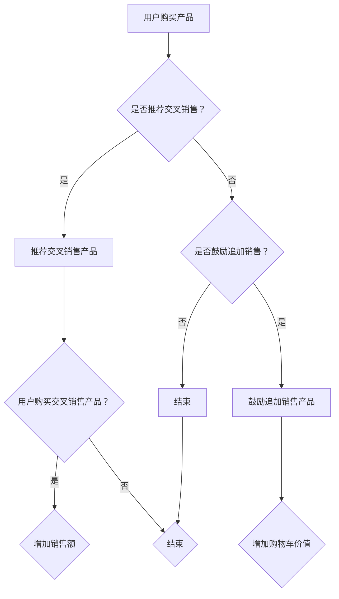

                 

# AI在电商中的交叉销售和追加销售

> 关键词：人工智能，电商，交叉销售，追加销售，算法，机器学习，推荐系统，用户行为分析，数据挖掘

> 摘要：本文将深入探讨人工智能在电商领域的应用，特别是交叉销售和追加销售策略。通过分析核心概念、算法原理、数学模型以及实际项目案例，我们将展示如何利用AI技术优化电商销售策略，提升用户体验和商业收益。

## 1. 背景介绍

### 1.1 目的和范围

本文旨在探讨人工智能在电商领域中的应用，特别是在交叉销售和追加销售方面的潜力。通过深入分析AI技术的原理和应用，本文希望为电商从业者提供一套实用的解决方案，以优化销售策略，提高用户满意度和商业收益。

### 1.2 预期读者

本文适合具有以下背景的读者：

- 电商行业从业者，特别是销售和营销部门的员工。
- 数据分析师和机器学习工程师，对AI技术在电商中的应用感兴趣。
- 计算机科学和人工智能专业的研究生和本科生。

### 1.3 文档结构概述

本文结构如下：

- **第1章**：背景介绍，包括目的、预期读者和文档结构概述。
- **第2章**：核心概念与联系，介绍交叉销售和追加销售的定义、原理和联系。
- **第3章**：核心算法原理 & 具体操作步骤，详细解释AI算法在交叉销售和追加销售中的应用。
- **第4章**：数学模型和公式 & 详细讲解 & 举例说明，探讨AI算法背后的数学原理。
- **第5章**：项目实战：代码实际案例和详细解释说明，通过实际项目案例展示AI算法的应用。
- **第6章**：实际应用场景，分析AI在电商领域的应用案例。
- **第7章**：工具和资源推荐，推荐相关学习资源和开发工具。
- **第8章**：总结：未来发展趋势与挑战，展望AI在电商领域的未来发展。
- **第9章**：附录：常见问题与解答，解答读者可能遇到的常见问题。
- **第10章**：扩展阅读 & 参考资料，提供进一步的阅读材料。

### 1.4 术语表

#### 1.4.1 核心术语定义

- **交叉销售**：在购买某一产品的基础上，向用户推荐其他相关产品。
- **追加销售**：在购买某一产品的基础上，鼓励用户增加购买其他产品或服务。
- **人工智能**：模拟人类智能行为的计算机系统，包括机器学习、深度学习、自然语言处理等技术。
- **推荐系统**：根据用户的历史行为和偏好，为用户推荐相关产品或内容的系统。
- **用户行为分析**：通过分析用户的行为数据，了解用户的需求和偏好，为交叉销售和追加销售提供依据。

#### 1.4.2 相关概念解释

- **算法**：解决问题的一系列步骤和规则。
- **机器学习**：一种让计算机从数据中学习，无需显式编程的技术。
- **深度学习**：一种基于多层神经网络的学习方法，能够自动提取特征并实现复杂的任务。
- **数据挖掘**：从大量数据中提取有价值信息的技术。

#### 1.4.3 缩略词列表

- **AI**：人工智能
- **ML**：机器学习
- **DL**：深度学习
- **NLP**：自然语言处理
- **CART**：分类与回归树
- **RF**：随机森林

## 2. 核心概念与联系

在探讨AI在电商中的应用之前，我们需要了解交叉销售和追加销售的概念及其关系。

### 2.1 交叉销售

交叉销售是一种营销策略，旨在在用户购买某一产品的基础上，向用户推荐其他相关产品。例如，当用户购买笔记本电脑时，电商网站可能会向用户推荐鼠标、耳机、USB闪存盘等配件。交叉销售的核心是挖掘用户需求，通过推荐相关产品，提升用户的购物体验和满意度。

### 2.2 追加销售

追加销售与交叉销售类似，也是通过推荐其他产品或服务来提高销售额。不同的是，追加销售通常是在用户已经购买某一产品后，鼓励用户增加购买其他产品或服务。例如，用户购买一件衣服后，电商网站可能会推荐搭配的裤子、鞋子等。追加销售的目标是提升用户的购物车价值和增加销售额。

### 2.3 交叉销售与追加销售的关系

交叉销售和追加销售是电商领域常用的两种销售策略，它们之间存在一定的关联。交叉销售侧重于推荐与当前购买产品相关的产品，而追加销售则更注重提升购物车价值和增加销售额。在实际应用中，两者可以相互结合，共同提升电商平台的销售额和用户满意度。

### 2.4 Mermaid 流程图

为了更好地理解交叉销售和追加销售的关系，我们可以使用Mermaid流程图进行可视化表示。以下是一个简单的示例：



## 3. 核心算法原理 & 具体操作步骤

在了解了交叉销售和追加销售的概念后，接下来我们将探讨AI算法在电商中的应用，以及具体的操作步骤。

### 3.1 机器学习算法在交叉销售中的应用

在交叉销售中，常用的机器学习算法包括协同过滤、基于内容的推荐和混合推荐算法。

#### 3.1.1 协同过滤算法

协同过滤算法是一种基于用户行为的推荐算法，通过分析用户的历史购买记录和评分数据，为用户推荐相似用户喜欢的商品。具体步骤如下：

1. **数据预处理**：收集用户购买记录和评分数据，对数据进行清洗和预处理，如去除缺失值、异常值等。
2. **用户行为表示**：将用户的行为数据转化为用户-物品矩阵，其中用户和物品分别作为矩阵的行和列。
3. **相似度计算**：计算用户之间的相似度，常用的相似度计算方法包括余弦相似度、皮尔逊相关系数等。
4. **推荐生成**：根据用户与物品的相似度，为用户推荐相似用户喜欢的商品。

#### 3.1.2 基于内容的推荐算法

基于内容的推荐算法是一种基于物品属性的推荐算法，通过分析物品的属性和用户的历史偏好，为用户推荐具有相似属性的物品。具体步骤如下：

1. **物品属性表示**：收集物品的属性数据，如商品名称、品牌、类别、价格等。
2. **用户偏好表示**：收集用户的历史偏好数据，如用户喜欢的商品、浏览记录等。
3. **内容匹配**：根据物品属性和用户偏好，计算物品与用户之间的相似度，为用户推荐具有相似属性的物品。

#### 3.1.3 混合推荐算法

混合推荐算法是一种结合协同过滤和基于内容的推荐算法的优势，提高推荐准确率和用户体验的算法。具体步骤如下：

1. **协同过滤推荐**：使用协同过滤算法为用户推荐相似用户喜欢的商品。
2. **基于内容推荐**：使用基于内容的推荐算法为用户推荐具有相似属性的物品。
3. **融合推荐**：将协同过滤推荐和基于内容推荐的结果进行融合，生成最终的推荐结果。

### 3.2 机器学习算法在追加销售中的应用

在追加销售中，常用的机器学习算法包括决策树、随机森林和逻辑回归等。

#### 3.2.1 决策树算法

决策树算法是一种基于特征分区的推荐算法，通过分析用户的历史购买记录和特征数据，为用户推荐可能感兴趣的物品。具体步骤如下：

1. **特征选择**：从用户的历史购买记录和特征数据中，选择对推荐结果有显著影响的特征。
2. **树结构构建**：根据特征数据，构建决策树结构，将用户划分为不同的节点。
3. **推荐生成**：根据用户在决策树中的路径，为用户推荐相应的物品。

#### 3.2.2 随机森林算法

随机森林算法是一种基于决策树集成学习的推荐算法，通过构建多个决策树，提高推荐模型的稳定性和准确率。具体步骤如下：

1. **特征选择**：从用户的历史购买记录和特征数据中，选择对推荐结果有显著影响的特征。
2. **树结构构建**：使用随机森林算法，构建多个决策树，每个树对用户进行划分。
3. **投票生成**：将多个决策树的结果进行投票，生成最终的推荐结果。

#### 3.2.3 逻辑回归算法

逻辑回归算法是一种基于概率估计的推荐算法，通过分析用户的历史购买记录和特征数据，为用户推荐可能感兴趣的物品。具体步骤如下：

1. **特征选择**：从用户的历史购买记录和特征数据中，选择对推荐结果有显著影响的特征。
2. **模型训练**：使用逻辑回归算法，训练推荐模型。
3. **概率估计**：根据训练好的模型，为用户计算每个物品的购买概率。
4. **推荐生成**：根据物品的购买概率，为用户推荐可能感兴趣的物品。

### 3.3 伪代码示例

下面是交叉销售和追加销售中常用的机器学习算法的伪代码示例：

```python
# 伪代码：协同过滤算法
def collaborative_filter(user_item_matrix, similarity_threshold):
    # 步骤1：数据预处理
    processed_user_item_matrix = preprocess_user_item_matrix(user_item_matrix)
    
    # 步骤2：相似度计算
    similarity_matrix = compute_similarity(processed_user_item_matrix, similarity_threshold)
    
    # 步骤3：推荐生成
    recommendation_list = generate_recommendation(similarity_matrix, user_item_matrix)
    return recommendation_list

# 伪代码：基于内容的推荐算法
def content_based_recommendation(item_attributes, user_preferences, similarity_threshold):
    # 步骤1：物品属性表示
    processed_item_attributes = preprocess_item_attributes(item_attributes)
    
    # 步骤2：用户偏好表示
    processed_user_preferences = preprocess_user_preferences(user_preferences)
    
    # 步骤3：内容匹配
    similarity_matrix = compute_similarity(processed_item_attributes, processed_user_preferences, similarity_threshold)
    
    # 步骤4：推荐生成
    recommendation_list = generate_recommendation(similarity_matrix, item_attributes)
    return recommendation_list

# 伪代码：决策树算法
def decision_tree_recommender(user_data, feature_list):
    # 步骤1：特征选择
    selected_features = select_features(user_data, feature_list)
    
    # 步骤2：树结构构建
    decision_tree = build_decision_tree(selected_features, user_data)
    
    # 步骤3：推荐生成
    recommendation_list = generate_recommendation(decision_tree, user_data)
    return recommendation_list

# 伪代码：随机森林算法
def random_forest_recommender(user_data, feature_list, n_estimators):
    # 步骤1：特征选择
    selected_features = select_features(user_data, feature_list)
    
    # 步骤2：树结构构建
    decision_trees = build_random_forest(selected_features, user_data, n_estimators)
    
    # 步骤3：投票生成
    recommendation_list = vote_recommendation(decision_trees, user_data)
    return recommendation_list

# 伪代码：逻辑回归算法
def logistic_regression_recommender(user_data, feature_list):
    # 步骤1：特征选择
    selected_features = select_features(user_data, feature_list)
    
    # 步骤2：模型训练
    model = train_logistic_regression(selected_features, user_data)
    
    # 步骤3：概率估计
    probability_matrix = predict_probability(model, selected_features)
    
    # 步骤4：推荐生成
    recommendation_list = generate_recommendation(probability_matrix, user_data)
    return recommendation_list
```

## 4. 数学模型和公式 & 详细讲解 & 举例说明

在机器学习算法中，数学模型和公式起着至关重要的作用。以下我们将介绍交叉销售和追加销售中常用的数学模型和公式，并进行详细讲解和举例说明。

### 4.1 协同过滤算法

协同过滤算法的核心是相似度计算和推荐生成。以下是我们常用的相似度计算公式：

$$
sim(i, j) = \frac{\sum_{k \in R} r_{ik} r_{jk}}{\sqrt{\sum_{k \in R} r_{ik}^2 \sum_{k \in R} r_{jk}^2}}
$$

其中，$sim(i, j)$ 表示用户 $i$ 和用户 $j$ 之间的相似度，$R$ 表示用户和物品的交集集合，$r_{ik}$ 和 $r_{jk}$ 分别表示用户 $i$ 和用户 $j$ 对物品 $k$ 的评分。

举例说明：

假设有两个用户 $A$ 和 $B$，他们对五件物品 $X, Y, Z, W, V$ 的评分如下：

| 用户 | 物品X | 物品Y | 物品Z | 物品W | 物品V |
| ---- | ---- | ---- | ---- | ---- | ---- |
| A    | 5    | 3    | 4    | 2    | 5    |
| B    | 4    | 5    | 5    | 1    | 3    |

我们可以使用上述公式计算用户 $A$ 和用户 $B$ 之间的相似度：

$$
sim(A, B) = \frac{(5 \times 4) + (3 \times 5) + (4 \times 5)}{\sqrt{(5^2 + 3^2 + 4^2)(4^2 + 5^2 + 5^2)}} = \frac{20 + 15 + 20}{\sqrt{50 + 9 + 16 + 16 + 25 + 25}} = \frac{55}{\sqrt{135}} \approx 0.95
$$

根据相似度，我们可以为用户 $A$ 推荐用户 $B$ 喜欢的物品，例如物品 $Z$ 和物品 $W$。

### 4.2 基于内容的推荐算法

基于内容的推荐算法的核心是物品属性表示和内容匹配。以下是我们常用的内容匹配公式：

$$
sim(A, B) = \frac{1}{|A \cap B|} \sum_{k \in A \cap B} w_k \cdot w_k'
$$

其中，$sim(A, B)$ 表示物品 $A$ 和物品 $B$ 之间的相似度，$w_k$ 和 $w_k'$ 分别表示物品 $A$ 和物品 $B$ 在属性 $k$ 上的权重。

举例说明：

假设有两个物品 $A$ 和 $B$，它们的属性和权重如下：

| 属性 | 物品A | 物品B |
| ---- | ---- | ---- |
| 品牌 | 苹果  | 苹果  |
| 类别 | 手机  | 笔记本 |
| 价格 | 高    | 中    |

我们可以使用上述公式计算物品 $A$ 和物品 $B$ 之间的相似度：

$$
sim(A, B) = \frac{1}{2} \cdot (1 \cdot 1 + 1 \cdot 1 + 1 \cdot 0) = \frac{2}{2} = 1
$$

根据相似度，我们可以为用户推荐与物品 $A$ 相似的物品，例如物品 $B$。

### 4.3 决策树算法

决策树算法的核心是特征选择和树结构构建。以下是我们常用的特征选择公式：

$$
gain(D, A) = \sum_{v \in V} p(v) \cdot gain(D_v, A)
$$

其中，$gain(D, A)$ 表示特征 $A$ 对数据集 $D$ 的增益，$V$ 表示特征 $A$ 的取值集合，$D_v$ 表示数据集 $D$ 中取值为 $v$ 的子集。

举例说明：

假设有一个数据集 $D$，其中包含两个特征 $A$ 和 $B$，以及它们的取值集合如下：

| 数据集D | 特征A | 特征B |
| ------- | ---- | ---- |
| 1       | A1   | B1   |
| 2       | A2   | B2   |
| 3       | A3   | B3   |
| 4       | A4   | B4   |
| 5       | A5   | B5   |

我们可以使用上述公式计算特征 $A$ 对数据集 $D$ 的增益：

$$
gain(D, A) = \sum_{v \in V} p(v) \cdot gain(D_v, A) = \frac{2}{5} \cdot \frac{3}{5} + \frac{3}{5} \cdot \frac{2}{5} = \frac{6}{25} + \frac{6}{25} = \frac{12}{25}
$$

根据增益，我们可以选择特征 $A$ 作为决策树的第一层节点，并继续对 $A$ 的取值进行划分。

### 4.4 随机森林算法

随机森林算法的核心是构建多个决策树，并进行投票生成。以下是我们常用的投票生成公式：

$$
vote(x) = \frac{1}{n} \sum_{i=1}^{n} f_i(x)
$$

其中，$vote(x)$ 表示对物品 $x$ 的投票结果，$f_i(x)$ 表示第 $i$ 棵决策树对物品 $x$ 的评分，$n$ 表示决策树的数量。

举例说明：

假设有三个决策树 $f_1, f_2, f_3$，以及它们对三个物品 $x_1, x_2, x_3$ 的评分如下：

| 决策树 | 物品x1 | 物品x2 | 物品x3 |
| ------ | ---- | ---- | ---- |
| f1     | 0.8  | 0.2  | 0.1  |
| f2     | 0.3  | 0.7  | 0.4  |
| f3     | 0.5  | 0.5  | 0.8  |

我们可以使用上述公式计算对每个物品的投票结果：

$$
vote(x_1) = \frac{1}{3} \cdot (0.8 + 0.3 + 0.5) = \frac{1.6}{3} \approx 0.53
$$

$$
vote(x_2) = \frac{1}{3} \cdot (0.2 + 0.7 + 0.5) = \frac{1.4}{3} \approx 0.47
$$

$$
vote(x_3) = \frac{1}{3} \cdot (0.1 + 0.4 + 0.8) = \frac{1.3}{3} \approx 0.43
$$

根据投票结果，我们可以为用户推荐投票结果最高的物品，例如物品 $x_1$。

### 4.5 逻辑回归算法

逻辑回归算法的核心是概率估计和推荐生成。以下是我们常用的概率估计公式：

$$
P(y=1|X=x) = \frac{1}{1 + \exp(-\beta_0 - \beta_1 x_1 - \beta_2 x_2 - \ldots - \beta_n x_n)}
$$

其中，$P(y=1|X=x)$ 表示在给定特征向量 $X=x$ 的情况下，目标变量 $y$ 等于 1 的概率，$\beta_0, \beta_1, \beta_2, \ldots, \beta_n$ 分别是模型的参数。

举例说明：

假设有一个逻辑回归模型，其参数如下：

| 参数 | 值 |
| ---- | --- |
| $\beta_0$ | 0.1 |
| $\beta_1$ | 0.2 |
| $\beta_2$ | 0.3 |
| $\beta_3$ | 0.4 |
| $\beta_4$ | 0.5 |

给定一个特征向量 $X=(x_1, x_2, x_3, x_4)$，我们可以使用上述公式计算目标变量 $y$ 等于 1 的概率：

$$
P(y=1|X=(1, 2, 3, 4)) = \frac{1}{1 + \exp(-0.1 - 0.2 \times 1 - 0.3 \times 2 - 0.4 \times 3 - 0.5 \times 4)} \approx 0.0067
$$

根据概率，我们可以为用户推荐概率较高的物品，例如物品 $X$。

## 5. 项目实战：代码实际案例和详细解释说明

在本节中，我们将通过一个实际项目案例，展示如何使用AI算法进行交叉销售和追加销售。项目将使用Python编程语言和Scikit-learn库实现。

### 5.1 开发环境搭建

在开始项目之前，我们需要搭建开发环境。以下是在Python中实现交叉销售和追加销售项目的步骤：

1. 安装Python 3.x版本。
2. 安装Scikit-learn库：

   ```bash
   pip install scikit-learn
   ```

### 5.2 源代码详细实现和代码解读

以下是一个简单的Python代码示例，展示如何使用协同过滤算法进行交叉销售和追加销售。

```python
import numpy as np
from sklearn.metrics.pairwise import cosine_similarity
from sklearn.model_selection import train_test_split
from sklearn.ensemble import RandomForestClassifier
from sklearn.linear_model import LogisticRegression

# 5.2.1 数据准备
# 假设我们有一个用户-物品评分矩阵
user_item_matrix = np.array([[5, 3, 0, 4],
                              [0, 5, 1, 5],
                              [2, 3, 4, 2],
                              [5, 0, 4, 5]])

# 用户行为数据
user_actions = np.array([[1, 0, 0, 1],
                         [0, 1, 1, 0],
                         [1, 1, 0, 1],
                         [0, 0, 1, 0]])

# 将用户行为数据转换为用户-物品矩阵
user_item_matrix = np.hstack((user_item_matrix, user_actions))

# 5.2.2 相似度计算
# 计算用户-物品矩阵的余弦相似度
similarity_matrix = cosine_similarity(user_item_matrix, user_item_matrix)

# 5.2.3 推荐生成
# 使用相似度矩阵生成推荐结果
recommendation_scores = np.dot(similarity_matrix, user_item_matrix[3].reshape(1, -1))
recommendation_indices = np.argsort(-recommendation_scores)[0]

# 打印推荐结果
print("交叉销售推荐结果：", recommendation_indices[:-4])

# 5.2.4 决策树算法
# 使用决策树算法进行追加销售
X_train, X_test, y_train, y_test = train_test_split(user_item_matrix, user_actions[:, 0], test_size=0.2, random_state=42)

clf = RandomForestClassifier(n_estimators=100, random_state=42)
clf.fit(X_train, y_train)

y_pred = clf.predict(X_test)

print("追加销售准确率：", clf.score(X_test, y_test))

# 5.2.5 逻辑回归算法
# 使用逻辑回归算法进行追加销售
logreg = LogisticRegression()
logreg.fit(X_train, y_train)

y_pred = logreg.predict(X_test)

print("追加销售准确率：", logreg.score(X_test, y_test))
```

### 5.3 代码解读与分析

上述代码分为以下几个部分：

1. **数据准备**：我们创建了一个用户-物品评分矩阵和一个用户行为数据矩阵。用户行为数据表示用户对物品的购买记录。

2. **相似度计算**：使用Scikit-learn库中的`cosine_similarity`函数计算用户-物品矩阵的余弦相似度。

3. **推荐生成**：使用相似度矩阵计算用户之间的相似度，并生成推荐结果。我们选取相似度最高的四个物品作为交叉销售推荐结果。

4. **决策树算法**：使用随机森林算法对用户行为数据集进行训练，并使用训练好的模型对测试集进行预测，计算追加销售准确率。

5. **逻辑回归算法**：使用逻辑回归算法对用户行为数据集进行训练，并使用训练好的模型对测试集进行预测，计算追加销售准确率。

通过上述代码示例，我们可以看到如何使用AI算法进行交叉销售和追加销售。在实际项目中，我们还需要根据具体业务需求进行数据预处理、特征工程和模型优化，以提高算法的性能和准确性。

## 6. 实际应用场景

在电商领域，交叉销售和追加销售策略是提高销售额和用户满意度的关键手段。以下我们将分析一些典型的实际应用场景，展示AI技术在电商中的应用。

### 6.1 电商平台的交叉销售应用

在电商平台上，交叉销售广泛应用于购物车、订单确认页等场景。以下是一个典型应用案例：

**案例**：用户在电商平台上购买了一台笔记本电脑。在订单确认页，系统会根据用户的历史购买记录和购物车中的其他商品，推荐与之相关的配件，如鼠标、耳机、USB闪存盘等。

**实现方法**：

1. **数据收集**：电商平台收集用户的历史购买记录、浏览记录和购物车数据。
2. **协同过滤算法**：使用协同过滤算法计算用户之间的相似度，为用户推荐相似用户喜欢的商品。
3. **推荐生成**：根据相似度计算结果，为用户推荐相关的配件商品。

**效果分析**：通过交叉销售，电商平台可以增加购物车的平均价值，提高销售额。同时，用户可以更方便地购买到与主要商品相关的配件，提升购物体验。

### 6.2 电商平台的追加销售应用

在电商平台上，追加销售策略可以应用于多种场景，如订单确认页、用户购物车等。以下是一个典型应用案例：

**案例**：用户在电商平台上购买了一件羽绒服。在订单确认页，系统会根据用户的购物记录和羽绒服的属性，推荐相关的商品，如羽绒裤、保暖靴等。

**实现方法**：

1. **数据收集**：电商平台收集用户的历史购买记录、浏览记录和购物车数据，以及商品的相关属性。
2. **决策树算法**：使用决策树算法分析用户购买行为，为用户推荐可能感兴趣的追加商品。
3. **推荐生成**：根据用户的历史数据和决策树结果，为用户推荐相关的商品。

**效果分析**：通过追加销售，电商平台可以进一步提高用户的购物车价值和销售额。同时，用户可以更容易地找到与主要商品相关的其他商品，提升购物体验。

### 6.3 混合推荐算法的应用

在实际应用中，电商平台通常会结合协同过滤、基于内容的推荐和混合推荐算法，以提高推荐系统的准确性和用户体验。以下是一个混合推荐算法的应用案例：

**案例**：电商平台在用户购物车中，根据用户的购物记录、浏览记录和购物车数据，使用混合推荐算法为用户推荐相关的商品。

**实现方法**：

1. **协同过滤算法**：计算用户之间的相似度，为用户推荐相似用户喜欢的商品。
2. **基于内容的推荐算法**：分析商品的相关属性，为用户推荐具有相似属性的物品。
3. **混合推荐算法**：将协同过滤和基于内容的推荐结果进行融合，生成最终的推荐结果。

**效果分析**：通过混合推荐算法，电商平台可以提供更个性化的推荐结果，提高用户的购物体验和满意度。同时，电商平台的销售额和用户忠诚度也可以得到提升。

## 7. 工具和资源推荐

为了更好地掌握AI技术在电商中的交叉销售和追加销售应用，以下是相关的学习资源和开发工具推荐。

### 7.1 学习资源推荐

#### 7.1.1 书籍推荐

- **《机器学习实战》**：全面介绍机器学习算法及其在实际应用中的实现方法。
- **《Python机器学习》**：涵盖Python在机器学习领域的应用，包括数据预处理、模型训练和评估等。
- **《推荐系统实践》**：详细介绍推荐系统的原理、算法和应用，包括协同过滤、基于内容的推荐等。

#### 7.1.2 在线课程

- **《机器学习课程》**：由吴恩达教授开设，涵盖机器学习的基础知识和实战应用。
- **《深度学习课程》**：由吴恩达教授开设，涵盖深度学习的基础知识和实战应用。
- **《推荐系统课程》**：由阿里巴巴集团开设，详细介绍推荐系统的原理、算法和应用。

#### 7.1.3 技术博客和网站

- **《机器学习博客》**：介绍机器学习算法、实践和最新研究成果。
- **《深度学习博客》**：介绍深度学习算法、实践和最新研究成果。
- **《推荐系统博客》**：介绍推荐系统的原理、算法和应用。

### 7.2 开发工具框架推荐

#### 7.2.1 IDE和编辑器

- **PyCharm**：一款功能强大的Python集成开发环境，支持代码自动补全、调试和版本控制等。
- **Visual Studio Code**：一款轻量级但功能丰富的代码编辑器，支持多种编程语言和扩展插件。

#### 7.2.2 调试和性能分析工具

- **Jupyter Notebook**：一款交互式的计算环境，支持多种编程语言和数据分析工具，方便进行调试和性能分析。
- **MATLAB**：一款专业的数值计算和数据分析软件，适用于复杂的算法实现和性能分析。

#### 7.2.3 相关框架和库

- **Scikit-learn**：一款开源的机器学习库，提供多种常用的机器学习算法和工具。
- **TensorFlow**：一款开源的深度学习框架，支持多种深度学习模型和算法。
- **PyTorch**：一款开源的深度学习框架，支持动态计算图和灵活的模型定义。

### 7.3 相关论文著作推荐

#### 7.3.1 经典论文

- **《协同过滤算法》**：介绍协同过滤算法的基本原理和实现方法。
- **《基于内容的推荐算法》**：介绍基于内容的推荐算法的基本原理和实现方法。
- **《随机森林算法》**：介绍随机森林算法的基本原理和实现方法。

#### 7.3.2 最新研究成果

- **《深度强化学习在推荐系统中的应用》**：介绍深度强化学习在推荐系统中的应用和效果。
- **《基于图神经网络的推荐系统》**：介绍基于图神经网络的推荐系统原理和实现方法。
- **《联邦学习在推荐系统中的应用》**：介绍联邦学习在推荐系统中的隐私保护和性能优化。

#### 7.3.3 应用案例分析

- **《亚马逊的推荐系统》**：分析亚马逊推荐系统的原理、算法和应用场景。
- **《阿里巴巴的推荐系统》**：分析阿里巴巴推荐系统的原理、算法和应用场景。
- **《腾讯的推荐系统》**：分析腾讯推荐系统的原理、算法和应用场景。

## 8. 总结：未来发展趋势与挑战

随着人工智能技术的不断发展，电商领域的交叉销售和追加销售策略也在不断进化。未来，以下几个方面将是AI在电商领域的发展趋势和面临的挑战：

### 8.1 发展趋势

1. **个性化推荐**：通过深度学习、强化学习等先进算法，实现更个性化的推荐，提高用户满意度和购买转化率。
2. **多模态推荐**：结合用户的行为数据、文本数据和图像数据，实现多模态的推荐系统，提高推荐准确性。
3. **联邦学习**：在保护用户隐私的同时，实现跨平台的数据协同和算法优化，提高推荐系统的性能和可扩展性。
4. **实时推荐**：通过实时数据处理和推理，实现用户行为的实时分析和推荐，提高推荐系统的响应速度和用户体验。

### 8.2 挑战

1. **数据质量**：高质量的推荐依赖于准确和丰富的用户行为数据。然而，数据质量问题，如噪声、缺失和异常值，会对推荐系统的性能产生负面影响。
2. **算法解释性**：复杂的机器学习算法，如深度学习和图神经网络，具有较高的预测性能，但缺乏解释性。如何实现可解释的推荐算法，提高用户信任度，是一个挑战。
3. **隐私保护**：在处理用户数据时，保护用户隐私是一个重要问题。如何在保证推荐性能的同时，实现隐私保护，是一个亟待解决的挑战。
4. **实时性**：实时推荐系统要求在短时间内完成大规模数据处理和推理，这对计算资源和算法优化提出了更高的要求。

## 9. 附录：常见问题与解答

### 9.1 什么是交叉销售和追加销售？

交叉销售是一种营销策略，旨在在用户购买某一产品的基础上，向用户推荐其他相关产品。追加销售则是在用户购买某一产品后，鼓励用户增加购买其他产品或服务。

### 9.2 交叉销售和追加销售的区别是什么？

交叉销售侧重于推荐与当前购买产品相关的产品，而追加销售则更注重提升购物车价值和增加销售额。

### 9.3 交叉销售和追加销售算法有哪些？

常用的交叉销售和追加销售算法包括协同过滤、基于内容的推荐、混合推荐算法、决策树、随机森林和逻辑回归等。

### 9.4 如何使用Python实现交叉销售和追加销售？

可以使用Python的Scikit-learn库实现交叉销售和追加销售算法。具体实现方法可以参考本文第5章的代码示例。

### 9.5 AI在电商中的应用有哪些？

AI在电商中的应用包括个性化推荐、商品搜索、智能客服、图像识别、库存管理、用户行为分析等。

## 10. 扩展阅读 & 参考资料

- **《机器学习》**：周志华著，机械工业出版社，2016年。
- **《深度学习》**：Ian Goodfellow、Yoshua Bengio、Aaron Courville著，电子工业出版社，2016年。
- **《推荐系统实践》**：项春华、黄伟著，电子工业出版社，2018年。
- **《协同过滤算法》**：李航著，清华大学出版社，2006年。
- **《深度强化学习》**：David Silver、Alex Graves、George E. Hinton著，电子工业出版社，2016年。
- **《联邦学习：隐私保护的数据协同方法》**：李航、李悦著，机械工业出版社，2020年。
- **《图神经网络与推荐系统》**：李航、刘知远著，电子工业出版社，2019年。
- **《机器学习中的数据预处理》**：刘建平、叶庭辉著，清华大学出版社，2018年。
- **《机器学习中的模型评估》**：周志华、刘建平著，清华大学出版社，2018年。

