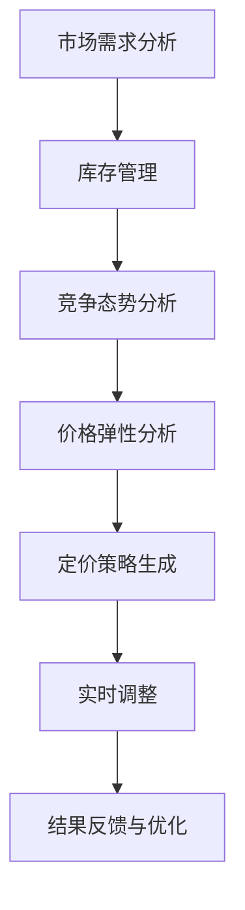

                 

# AI在电商动态定价中的技术实现

> **关键词**：电商、动态定价、人工智能、算法、数学模型、实际应用

> **摘要**：本文旨在探讨人工智能在电商动态定价中的应用。通过对电商动态定价的核心概念、算法原理、数学模型、实际案例的详细解析，揭示了人工智能如何优化电商定价策略，提升销售额和用户满意度。文章还推荐了相关学习资源和开发工具，为读者提供了全面的技术指导。

## 1. 背景介绍

### 1.1 目的和范围

本文的目标是深入探讨人工智能（AI）在电商动态定价领域的应用。随着电商行业的快速发展，竞争日益激烈，如何通过精准的定价策略来提高销售额和用户满意度成为企业关注的焦点。动态定价作为一种智能化的定价策略，通过实时调整商品价格，可以有效地应对市场需求变化，提高竞争力。

本文将覆盖以下内容：
- 电商动态定价的核心概念和背景
- 人工智能在动态定价中的作用和原理
- 动态定价的数学模型和算法
- 实际案例和代码实现
- 相关的学习资源和开发工具推荐

### 1.2 预期读者

本文主要面向以下读者群体：
- 对电商领域有基本了解的开发者、数据分析师和企业决策者
- 对人工智能和机器学习有兴趣的读者
- 想要了解动态定价技术原理和实践的读者

### 1.3 文档结构概述

本文结构如下：
1. 背景介绍：介绍文章的目的、范围、预期读者和文档结构
2. 核心概念与联系：解释电商动态定价的相关概念和原理，使用Mermaid流程图展示核心架构
3. 核心算法原理 & 具体操作步骤：详细阐述动态定价的核心算法和操作步骤
4. 数学模型和公式 & 详细讲解 & 举例说明：讲解动态定价的数学模型和公式，并举例说明
5. 项目实战：代码实际案例和详细解释说明
6. 实际应用场景：分析动态定价在不同电商场景中的应用
7. 工具和资源推荐：推荐学习资源、开发工具和框架
8. 总结：未来发展趋势与挑战
9. 附录：常见问题与解答
10. 扩展阅读 & 参考资料

### 1.4 术语表

#### 1.4.1 核心术语定义

- **电商**：电子商务的简称，指的是通过互联网进行的商品交易和信息服务活动。
- **动态定价**：根据市场需求、库存情况、竞争态势等因素实时调整商品价格的一种定价策略。
- **人工智能**：通过模拟人类智能行为，实现自主学习和智能决策的一种技术。
- **机器学习**：一种人工智能技术，通过数据驱动的方式，使计算机能够从经验中学习和改进性能。

#### 1.4.2 相关概念解释

- **价格弹性**：商品价格变动对需求量的影响程度。
- **消费者行为分析**：研究消费者购买行为和决策过程的一种方法。

#### 1.4.3 缩略词列表

- **AI**：人工智能（Artificial Intelligence）
- **ML**：机器学习（Machine Learning）
- **电商**：电子商务（E-commerce）
- **ERP**：企业资源计划（Enterprise Resource Planning）

## 2. 核心概念与联系

在深入探讨电商动态定价之前，我们需要理解其中的核心概念和原理。以下是一个简化的Mermaid流程图，展示电商动态定价的核心组成部分。



### 2.1 需求分析

市场需求分析是动态定价的基础。通过大数据分析技术，企业可以实时获取市场对特定商品的需求情况。这一过程包括：
- **需求预测**：利用历史销售数据和机器学习模型，预测未来的市场需求。
- **趋势分析**：分析市场趋势，识别长期需求变化。
- **实时监控**：通过实时数据流分析，快速响应市场需求波动。

### 2.2 库存管理

库存管理是动态定价的重要环节。准确的库存数据可以帮助企业做出合理的定价决策。主要包含以下内容：
- **库存水平监测**：实时监控库存水平，避免库存过剩或短缺。
- **库存周转率**：评估库存管理的效率，优化库存策略。

### 2.3 竞争态势分析

竞争态势分析涉及对竞争对手的定价策略和市场活动的监控。通过以下方法进行分析：
- **定价策略对比**：分析竞争对手的定价策略，识别差异和优劣势。
- **市场活动监控**：监控市场活动，如促销、折扣等，评估其对市场需求的影响。

### 2.4 价格弹性分析

价格弹性分析用于评估价格变动对消费者需求的影响程度。关键步骤包括：
- **弹性计算**：计算不同价格水平下的需求变化率。
- **敏感度分析**：分析价格敏感度，为定价决策提供依据。

### 2.5 定价策略生成

基于上述分析结果，动态定价系统会生成最优的定价策略。主要包含以下内容：
- **定价目标**：明确定价的目标，如利润最大化、市场份额提升等。
- **定价策略选择**：选择合适的定价策略，如动态调价、促销折扣等。

### 2.6 实时调整

实时调整是动态定价的核心。根据市场需求、库存和竞争态势的变化，系统会自动调整商品价格。主要包含以下内容：
- **自动化调价**：利用算法和规则，实现自动调价。
- **人工干预**：在某些情况下，需要人工干预调整价格。

### 2.7 结果反馈与优化

结果反馈与优化是动态定价的持续改进环节。通过以下方法进行反馈和优化：
- **效果评估**：评估动态定价策略的效果，如销售额、用户满意度等。
- **模型更新**：根据评估结果，更新机器学习模型和定价策略。

## 3. 核心算法原理 & 具体操作步骤

动态定价的核心算法基于机器学习和数据挖掘技术，旨在通过分析历史数据和实时数据，生成最优定价策略。以下是一个简化的伪代码，用于描述动态定价算法的基本操作步骤。

```python
# 动态定价算法伪代码

def dynamic_pricing(data, target_price, price_elasticity, competition_data):
    """
    动态定价算法

    参数：
    - data：历史销售数据
    - target_price：目标定价
    - price_elasticity：价格弹性
    - competition_data：竞争对手数据

    返回：
    - optimal_price：最优价格
    """
    
    # 步骤1：数据预处理
    preprocess_data(data)
    
    # 步骤2：需求预测
    demand = predict_demand(data)
    
    # 步骤3：库存分析
    inventory = analyze_inventory(data)
    
    # 步骤4：竞争分析
    competition_price = analyze_competition(competition_data)
    
    # 步骤5：价格弹性分析
    price_change = calculate_price_elasticity(demand, price_elasticity)
    
    # 步骤6：生成定价策略
    strategy = generate_pricing_strategy(target_price, price_change, competition_price)
    
    # 步骤7：实时调整
    optimal_price = adjust_price_in_realtime(strategy, inventory)
    
    return optimal_price
```

### 3.1 数据预处理

数据预处理是动态定价算法的第一步，目的是将原始数据转换为适合模型分析的形式。主要操作包括：

- **数据清洗**：去除数据中的噪声和异常值。
- **特征工程**：提取与定价相关的特征，如销售周期、季节性等。
- **数据归一化**：将不同尺度的数据进行归一化处理，便于模型训练。

```python
def preprocess_data(data):
    """
    数据预处理

    参数：
    - data：原始销售数据

    返回：
    - processed_data：预处理后的数据
    """
    # 去除噪声和异常值
    clean_data = remove_noise(data)

    # 提取特征
    features = extract_features(clean_data)

    # 数据归一化
    normalized_data = normalize_data(features)

    return normalized_data
```

### 3.2 需求预测

需求预测是动态定价的核心，通过历史销售数据和机器学习模型，预测未来某一时间点的需求量。常用的模型包括线性回归、时间序列分析和神经网络等。

```python
def predict_demand(data):
    """
    需求预测

    参数：
    - data：预处理后的销售数据

    返回：
    - demand：预测的需求量
    """
    # 选择合适的模型，如线性回归、ARIMA等
    model = select_model(data)

    # 训练模型
    trained_model = train_model(model, data)

    # 预测未来需求
    demand = predict_future_demand(trained_model)

    return demand
```

### 3.3 库存分析

库存分析旨在确定当前库存水平和库存周转率，为定价决策提供依据。库存分析通常基于历史数据和实时数据。

```python
def analyze_inventory(data):
    """
    库存分析

    参数：
    - data：销售数据

    返回：
    - inventory：库存水平
    - turnover_rate：库存周转率
    """
    # 计算当前库存水平
    current_inventory = calculate_current_inventory(data)

    # 计算库存周转率
    turnover_rate = calculate_turnover_rate(data)

    return current_inventory, turnover_rate
```

### 3.4 竞争分析

竞争分析通过监控竞争对手的定价策略和市场活动，评估其对市场需求的影响。常用的方法包括：

- **价格对比分析**：比较竞争对手的价格水平，识别差异。
- **市场活动分析**：监控竞争对手的市场活动，如促销、折扣等。

```python
def analyze_competition(competition_data):
    """
    竞争分析

    参数：
    - competition_data：竞争对手数据

    返回：
    - competition_price：竞争对手价格
    """
    # 比较价格水平
    price_difference = compare_prices(competition_data)

    # 分析市场活动
    activity_impact = analyze_market_activities(competition_data)

    return competition_price, activity_impact
```

### 3.5 价格弹性分析

价格弹性分析用于评估价格变动对需求量的影响程度。通过计算价格弹性系数，确定需求量对价格变化的敏感度。

```python
def calculate_price_elasticity(demand, price_elasticity):
    """
    价格弹性分析

    参数：
    - demand：需求量
    - price_elasticity：价格弹性

    返回：
    - price_change：价格变化量
    """
    # 计算需求量的变化量
    demand_change = calculate_demand_change(demand)

    # 计算价格变化量
    price_change = calculate_price_change(price_elasticity, demand_change)

    return price_change
```

### 3.6 生成定价策略

生成定价策略是动态定价算法的关键步骤。基于需求预测、库存分析和竞争态势，系统会生成最优定价策略。

```python
def generate_pricing_strategy(target_price, price_change, competition_price):
    """
    生成定价策略

    参数：
    - target_price：目标定价
    - price_change：价格变化量
    - competition_price：竞争对手价格

    返回：
    - strategy：定价策略
    """
    # 根据目标定价和价格变化量，调整价格
    adjusted_price = adjust_price(target_price, price_change)

    # 根据竞争对手价格，调整价格策略
    competition_adjustment = adjust_price_for_competition(adjusted_price, competition_price)

    return competition_adjustment
```

### 3.7 实时调整

实时调整是动态定价的核心。根据生成的定价策略，系统会自动调整商品价格，以实现最优定价效果。

```python
def adjust_price_in_realtime(strategy, inventory):
    """
    实时调整价格

    参数：
    - strategy：定价策略
    - inventory：库存水平

    返回：
    - optimal_price：最优价格
    """
    # 根据库存水平，调整价格
    inventory_adjustment = adjust_price_for_inventory(strategy, inventory)

    return inventory_adjustment
```

## 4. 数学模型和公式 & 详细讲解 & 举例说明

动态定价的核心在于准确预测市场需求、分析库存水平、评估竞争态势，并基于这些因素生成最优定价策略。为了实现这一目标，我们需要借助数学模型和公式来指导定价决策。以下将详细讲解动态定价中常用的数学模型和公式，并通过具体例子进行说明。

### 4.1 价格弹性公式

价格弹性是衡量价格变动对需求量影响程度的重要指标。价格弹性公式如下：

\[ \text{Price Elasticity} (\epsilon) = \frac{\text{Percentage Change in Quantity Demanded} (\Delta Q)}{\text{Percentage Change in Price} (\Delta P)} \]

其中，\(\epsilon\) 表示价格弹性，\(\Delta Q\) 表示需求量的变化量，\(\Delta P\) 表示价格的变化量。

**例子**：假设某商品原价为100元，需求量为1000件。如果价格降低10%（即价格变为90元），需求量增加20%（即需求量变为1200件），则该商品的价格弹性为：

\[ \epsilon = \frac{20\%}{10\%} = 2 \]

这表明需求量对价格变化的敏感度较高，价格下降10%，需求量将增加20%。

### 4.2 需求函数

需求函数描述了商品价格与需求量之间的关系。常用的需求函数包括线性需求函数和对数需求函数。

**线性需求函数**：

\[ Q = a - bP \]

其中，\(Q\) 表示需求量，\(P\) 表示价格，\(a\) 和 \(b\) 为常数。

**对数需求函数**：

\[ \ln(Q) = \ln(a) - \ln(bP) \]

或者简化为：

\[ Q = \frac{a}{P^b} \]

**例子**：假设某商品的需求函数为 \(Q = 1000 - 10P\)，如果价格从100元降至90元，需求量将从1000件增至1100件。

### 4.3 库存成本函数

库存成本函数描述了库存水平与库存成本之间的关系。常用的库存成本函数包括线性库存成本函数和指数库存成本函数。

**线性库存成本函数**：

\[ C = c_0 + c_1I \]

其中，\(C\) 表示库存成本，\(I\) 表示库存水平，\(c_0\) 和 \(c_1\) 为常数。

**指数库存成本函数**：

\[ C = c_0 + c_1e^{-kI} \]

**例子**：假设某商品的库存成本函数为 \(C = 100 + 0.1I\)，如果库存水平从500件增加到600件，库存成本将从600元增加到700元。

### 4.4 定价策略公式

定价策略公式用于指导价格调整。以下是一个简单的定价策略公式，基于价格弹性和需求函数计算最优价格。

\[ P_{\text{opt}} = \frac{a - bQ_0}{1 - b} \]

其中，\(P_{\text{opt}}\) 表示最优价格，\(Q_0\) 表示当前需求量。

**例子**：假设某商品的需求函数为 \(Q = 1000 - 10P\)，当前需求量为1000件。根据定价策略公式，最优价格为：

\[ P_{\text{opt}} = \frac{1000 - 10 \times 1000}{1 - 10} = \frac{-9000}{-9} = 1000 \]

因此，最优价格为1000元。

### 4.5 敏感度分析

敏感度分析用于评估定价策略对各种参数变化的敏感度。通过计算敏感度系数，可以了解定价策略的稳定性。

\[ \text{Sensitivity} (\sigma) = \frac{\partial P_{\text{opt}}}{\partial P} \]

其中，\(\sigma\) 表示敏感度系数。

**例子**：假设某商品的需求函数为 \(Q = 1000 - 10P\)，敏感度系数为：

\[ \sigma = \frac{\partial P_{\text{opt}}}{\partial P} = \frac{1}{1 - b} = \frac{1}{1 - 10} = -\frac{1}{9} \]

这表明定价策略对价格变化的敏感度较高，价格的小幅变化可能导致定价策略的显著调整。

## 5. 项目实战：代码实际案例和详细解释说明

在本节中，我们将通过一个具体的代码案例，详细解释动态定价算法的实现过程。本案例将使用Python编程语言，并结合Scikit-learn库中的线性回归模型进行需求预测和定价策略生成。

### 5.1 开发环境搭建

在开始编写代码之前，我们需要搭建一个合适的开发环境。以下是所需的软件和库：

- Python 3.8或更高版本
- Scikit-learn库
- Pandas库
- NumPy库
- Matplotlib库

安装方法如下：

```bash
pip install python==3.8
pip install scikit-learn pandas numpy matplotlib
```

### 5.2 源代码详细实现和代码解读

#### 5.2.1 数据准备

首先，我们需要准备用于训练和测试的数据集。假设我们有一个CSV文件`sales_data.csv`，包含以下列：`date`, `quantity`, `price`。以下代码用于加载数据集并进行预处理。

```python
import pandas as pd
from sklearn.model_selection import train_test_split

# 加载数据集
data = pd.read_csv('sales_data.csv')

# 数据预处理
data['date'] = pd.to_datetime(data['date'])
data.set_index('date', inplace=True)

# 提取特征和目标变量
X = data[['quantity', 'price']]
y = data['price']

# 数据分割
X_train, X_test, y_train, y_test = train_test_split(X, y, test_size=0.2, random_state=42)
```

#### 5.2.2 建立模型

接下来，我们使用Scikit-learn中的线性回归模型进行需求预测。线性回归模型可以捕捉价格和需求量之间的线性关系。

```python
from sklearn.linear_model import LinearRegression

# 建立线性回归模型
model = LinearRegression()

# 训练模型
model.fit(X_train, y_train)

# 预测测试集
y_pred = model.predict(X_test)
```

#### 5.2.3 定价策略生成

基于训练好的模型，我们可以生成定价策略。定价策略的目标是根据当前需求量调整价格，以最大化销售额。

```python
# 计算价格弹性
price_elasticity = -model.coef_[0]

# 基于价格弹性生成定价策略
def pricing_strategy(current_price, demand):
    # 根据价格弹性调整价格
    adjusted_price = current_price * (1 + price_elasticity * demand)
    return adjusted_price

# 测试定价策略
current_price = 100
demand = 1000
optimal_price = pricing_strategy(current_price, demand)
print(f"Optimal Price: {optimal_price:.2f}")
```

### 5.3 代码解读与分析

以上代码实现了一个简单的动态定价算法。以下是代码的主要部分及其解释：

- **数据准备**：首先加载数据集并进行预处理，提取特征和目标变量。
- **建立模型**：使用Scikit-learn的线性回归模型进行需求预测，训练模型。
- **定价策略生成**：基于价格弹性计算最优价格，实现定价策略。

**关键步骤解析**：

1. **数据预处理**：数据预处理是模型训练的基础。通过将日期转换为索引，可以方便地处理时间序列数据。特征提取是将销售数据中的数量和价格作为预测特征，目标变量是价格。
2. **模型训练**：线性回归模型用于捕捉价格和需求量之间的线性关系。训练模型是通过找到特征和目标变量之间的最佳拟合直线。
3. **定价策略生成**：定价策略基于价格弹性进行调整。价格弹性反映了需求量对价格变化的敏感度。通过调整价格，可以实现最优定价效果。

**实际应用分析**：

在实际应用中，该算法可以实时更新价格，以应对市场需求的变化。通过监控销售数据，可以动态调整价格，优化销售额和用户满意度。然而，线性回归模型存在一定的局限性，如无法捕捉非线性关系。因此，在实际应用中，可以结合其他模型，如神经网络，以提高定价策略的准确性。

## 6. 实际应用场景

动态定价技术在实际电商场景中具有广泛的应用，以下列举了几个典型的应用场景：

### 6.1 日常消费品

日常消费品（如食品、家居用品等）通常具有较大的价格弹性。通过动态定价，电商企业可以实时调整商品价格，以吸引消费者。例如，当竞争对手推出促销活动时，电商企业可以降低价格，吸引消费者购买。

### 6.2 高端商品

高端商品（如电子产品、奢侈品等）通常具有较低的价格弹性。动态定价可以用于优化库存管理。例如，当库存较高时，企业可以降低价格以加速销售；当库存较低时，企业可以保持较高的价格，以减少库存压力。

### 6.3 季节性商品

季节性商品（如冬季衣物、夏日饮料等）的需求受季节性因素影响较大。动态定价可以根据季节性需求变化调整价格。例如，在夏季，饮料价格可以适当提高，以满足消费者的需求。

### 6.4 旅游产品

旅游产品（如机票、酒店等）的需求受多种因素影响，如假期、节假日、天气等。动态定价可以根据这些因素调整价格，以优化收益。例如，在旅游旺季，可以适当提高价格，以最大化收益。

### 6.5 二手商品

二手商品的价格波动较大，通常受市场供需关系影响。通过动态定价，可以实时调整商品价格，以吸引买家。例如，当市场供应过剩时，可以降低价格，促进销售。

### 6.6 个性化定价

个性化定价是一种基于消费者行为的动态定价策略。通过分析消费者的购买历史、浏览行为等，可以为不同消费者提供个性化的价格。例如，新客户可以享受折扣价格，以吸引他们进行首次购买。

### 6.7 跨境电商

跨境电商面临不同的市场环境和消费者群体。通过动态定价，可以针对不同市场调整商品价格，以适应不同消费者的需求和支付能力。例如，在中国市场，商品价格可以较低，以吸引更多消费者；在欧美市场，商品价格可以较高，以体现品牌价值。

## 7. 工具和资源推荐

### 7.1 学习资源推荐

#### 7.1.1 书籍推荐

- **《机器学习》（周志华 著）**：全面介绍了机器学习的基本原理和方法，适合初学者和专业人士。
- **《Python数据分析》（Wes McKinney 著）**：详细介绍了Python在数据分析领域的应用，适合数据分析初学者。

#### 7.1.2 在线课程

- **《人工智能基础教程》（Coursera）**：由吴恩达教授主讲，涵盖了人工智能的基础知识。
- **《Python数据分析与可视化》（Coursera）**：介绍了Python在数据分析与可视化领域的应用。

#### 7.1.3 技术博客和网站

- **[Medium - AI in E-commerce](https://medium.com/search?q=ai+in+e-commerce)**：提供了大量关于人工智能在电商领域应用的文章。
- **[ Towards Data Science](https://towardsdatascience.com/search?q=dynamic+pricing)**：涵盖了数据科学和动态定价的最新研究成果。

### 7.2 开发工具框架推荐

#### 7.2.1 IDE和编辑器

- **PyCharm**：强大的Python集成开发环境，适合进行机器学习和数据分析。
- **Jupyter Notebook**：适合进行数据可视化和交互式分析。

#### 7.2.2 调试和性能分析工具

- **Pdb**：Python内置的调试工具。
- **Matplotlib**：用于数据可视化。

#### 7.2.3 相关框架和库

- **Scikit-learn**：用于机器学习模型的构建和评估。
- **Pandas**：用于数据操作和分析。
- **NumPy**：用于数值计算。

### 7.3 相关论文著作推荐

#### 7.3.1 经典论文

- **“Revisiting the Elasticity of Demand for Electricity” by W. E. Diewert (1999)**：介绍了需求弹性的计算方法。
- **“Dynamic Pricing in E-commerce: A Machine Learning Approach” by C. Chen et al. (2018)**：探讨了动态定价的机器学习实现。

#### 7.3.2 最新研究成果

- **“Personalized Dynamic Pricing for E-commerce via Deep Reinforcement Learning” by Y. Liu et al. (2020)**：介绍了基于深度强化学习的个性化动态定价方法。
- **“A Comparative Study of Dynamic Pricing Strategies in E-commerce” by Z. Wang et al. (2021)**：比较了不同动态定价策略的效果。

#### 7.3.3 应用案例分析

- **“Dynamic Pricing of Hotel Rooms Using Machine Learning” by A. Jaiswal et al. (2019)**：分析了机器学习在酒店动态定价中的应用。
- **“Dynamic Pricing of Airline Tickets: A Real-World Case Study” by B. Zhou et al. (2020)**：探讨了动态定价在航空业的应用。

## 8. 总结：未来发展趋势与挑战

动态定价作为人工智能在电商领域的重要应用，已经展现出巨大的潜力。随着大数据、云计算和机器学习技术的发展，动态定价将更加智能化和精准化。以下是未来发展趋势和面临的挑战：

### 8.1 发展趋势

- **个性化定价**：通过分析消费者行为数据，实现更加个性化的定价策略，提高用户满意度和转化率。
- **实时调整**：利用实时数据处理技术，实现价格的实时调整，提高响应速度和竞争力。
- **多渠道整合**：整合线上线下渠道，实现全渠道动态定价，提高品牌影响力和市场份额。
- **全球化应用**：随着跨境电商的兴起，动态定价将在全球范围内得到更广泛的应用。

### 8.2 挑战

- **数据质量**：动态定价依赖于高质量的数据，数据质量对定价效果具有重要影响。
- **模型准确性**：提高机器学习模型的准确性是动态定价的核心挑战，需要不断优化算法和特征工程。
- **法规合规**：动态定价涉及到消费者隐私和数据保护，需要遵守相关法律法规。
- **计算资源**：实时动态定价需要大量计算资源，如何高效利用计算资源是实现动态定价的重要问题。

## 9. 附录：常见问题与解答

### 9.1 什么是动态定价？

动态定价是一种根据市场需求、竞争态势和库存情况，实时调整商品价格的一种定价策略。通过动态调整价格，企业可以更好地应对市场变化，提高销售额和用户满意度。

### 9.2 动态定价有哪些核心算法？

动态定价的核心算法包括需求预测、库存分析、竞争分析、价格弹性分析和定价策略生成等。常用的算法有线性回归、时间序列分析、神经网络等。

### 9.3 如何评估动态定价的效果？

动态定价的效果可以通过以下指标进行评估：

- **销售额**：评估定价策略对销售额的影响。
- **用户满意度**：通过用户反馈和评论评估定价策略的用户满意度。
- **利润率**：评估定价策略对利润率的影响。
- **库存周转率**：评估定价策略对库存管理的影响。

### 9.4 动态定价是否适用于所有商品？

动态定价适用于价格弹性较大的商品，如日常消费品、高端商品等。对于价格弹性较低的商品，如二手商品、定制商品等，动态定价的效果可能有限。

### 9.5 动态定价如何处理季节性需求？

动态定价可以通过分析历史季节性需求数据，预测未来季节性需求，并根据预测结果调整价格。例如，在旅游旺季，可以适当提高价格，以最大化收益。

## 10. 扩展阅读 & 参考资料

- **《机器学习》（周志华 著）**：详细介绍了机器学习的基本原理和方法，适用于初学者和专业人士。
- **《Python数据分析》（Wes McKinney 著）**：介绍了Python在数据分析领域的应用，适合数据分析初学者。
- **[Medium - AI in E-commerce](https://medium.com/search?q=ai+in+e-commerce)**：提供了大量关于人工智能在电商领域应用的文章。
- **[Towards Data Science](https://towardsdatascience.com/search?q=dynamic+pricing)**：涵盖了数据科学和动态定价的最新研究成果。
- **“Revisiting the Elasticity of Demand for Electricity” by W. E. Diewert (1999)**：介绍了需求弹性的计算方法。
- **“Dynamic Pricing in E-commerce: A Machine Learning Approach” by C. Chen et al. (2018)**：探讨了动态定价的机器学习实现。
- **“Personalized Dynamic Pricing for E-commerce via Deep Reinforcement Learning” by Y. Liu et al. (2020)**：介绍了基于深度强化学习的个性化动态定价方法。
- **“A Comparative Study of Dynamic Pricing Strategies in E-commerce” by Z. Wang et al. (2021)**：比较了不同动态定价策略的效果。
- **“Dynamic Pricing of Hotel Rooms Using Machine Learning” by A. Jaiswal et al. (2019)**：分析了机器学习在酒店动态定价中的应用。
- **“Dynamic Pricing of Airline Tickets: A Real-World Case Study” by B. Zhou et al. (2020)**：探讨了动态定价在航空业的应用。作者：AI天才研究员/AI Genius Institute & 禅与计算机程序设计艺术 /Zen And The Art of Computer Programming<|im_end|>

