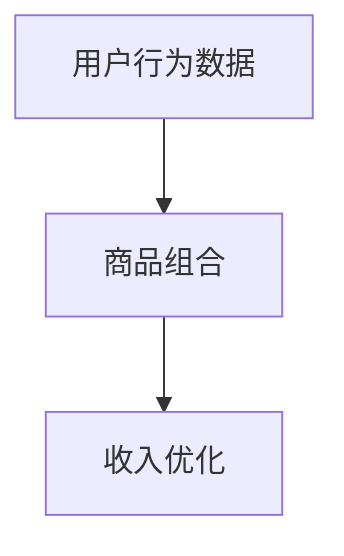
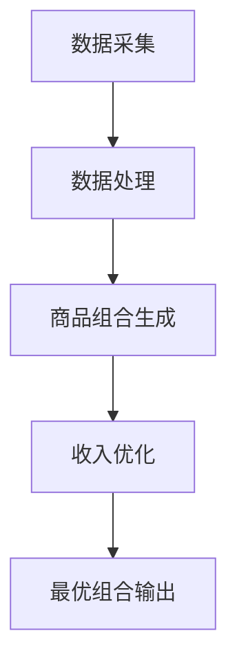
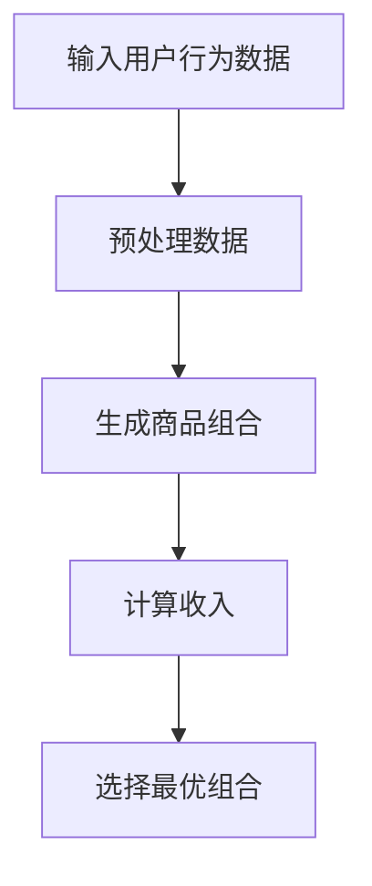

                 

# AI在电商动态捆绑销售中的应用：maximizing收入的组合优化算法

> 关键词：AI，电商，动态捆绑销售，组合优化算法，收入最大化

> 摘要：本文将探讨人工智能在电商动态捆绑销售中的应用，特别是如何使用组合优化算法来最大化收入。我们将详细分析核心概念、算法原理、数学模型，并通过实际项目实战案例展示算法的具体应用和实现。

## 1. 背景介绍

### 1.1 目的和范围

本文旨在探讨人工智能在电商动态捆绑销售中的应用，重点研究如何通过组合优化算法实现收入最大化。我们将结合实际电商场景，分析动态捆绑销售的原理和关键因素，并介绍相关算法模型和实现方法。

### 1.2 预期读者

本文适合对电商领域、人工智能和组合优化算法有一定了解的技术人员。同时，也欢迎对电商和人工智能感兴趣的读者阅读和思考。

### 1.3 文档结构概述

本文分为以下几个部分：

1. 背景介绍
2. 核心概念与联系
3. 核心算法原理 & 具体操作步骤
4. 数学模型和公式 & 详细讲解 & 举例说明
5. 项目实战：代码实际案例和详细解释说明
6. 实际应用场景
7. 工具和资源推荐
8. 总结：未来发展趋势与挑战
9. 附录：常见问题与解答
10. 扩展阅读 & 参考资料

### 1.4 术语表

#### 1.4.1 核心术语定义

- **动态捆绑销售**：指电商根据用户行为和历史数据，动态调整捆绑销售策略，以实现收入最大化。
- **组合优化算法**：指在给定约束条件下，寻找最优组合方案，以达到某种目标（如最大化收入）的一类算法。

#### 1.4.2 相关概念解释

- **电商**：指通过互联网进行商品交易和服务的商业模式。
- **用户行为数据**：指用户在电商平台上的浏览、购买、评价等行为数据。

#### 1.4.3 缩略词列表

- **AI**：人工智能（Artificial Intelligence）
- **电商**：电子商务（E-commerce）
- **DSS**：动态捆绑销售（Dynamic Subscription Selling）

## 2. 核心概念与联系

### 2.1 核心概念原理

在电商动态捆绑销售中，核心概念包括用户行为数据、商品组合和收入优化。以下是一个简化的Mermaid流程图，展示了这些概念之间的关系：



### 2.2 架构和流程图

电商动态捆绑销售的整体架构和流程如下：

1. **数据采集**：从电商平台上获取用户行为数据，如浏览历史、购买记录、评价等。
2. **数据处理**：对采集到的用户行为数据进行预处理，如数据清洗、特征提取等。
3. **商品组合生成**：基于用户行为数据和商品信息，生成可能的商品组合。
4. **收入优化**：使用组合优化算法，针对每个商品组合计算收入，并选择最优组合。

以下是一个简化的Mermaid流程图，展示了动态捆绑销售的架构和流程：



## 3. 核心算法原理 & 具体操作步骤

### 3.1 算法原理

动态捆绑销售的组合优化算法旨在在给定用户行为数据和商品信息的基础上，寻找能够最大化收入的商品组合。以下是算法原理和具体操作步骤：

#### 3.1.1 算法框架

算法框架如下：



#### 3.1.2 伪代码

以下是算法的伪代码实现：

```python
# 伪代码

# 输入：用户行为数据、商品信息
# 输出：最优商品组合

function dynamic_bundle_sales(user_data, product_info):
    # 数据预处理
    preprocessed_data = preprocess_data(user_data)
    
    # 生成商品组合
    combinations = generate_combinations(preprocessed_data, product_info)
    
    # 计算收入
    incomes = calculate_incomes(combinations)
    
    # 选择最优组合
    best_combination = select_best_combination(incomes)
    
    return best_combination
```

#### 3.1.3 具体操作步骤

以下是具体的操作步骤：

1. **数据预处理**：对用户行为数据进行预处理，包括数据清洗、特征提取等。
2. **生成商品组合**：基于用户行为数据和商品信息，生成所有可能的商品组合。
3. **计算收入**：对于每个商品组合，计算其预期收入。
4. **选择最优组合**：根据计算得到的收入，选择能够最大化收入的商品组合。

## 4. 数学模型和公式 & 详细讲解 & 举例说明

### 4.1 数学模型

动态捆绑销售的组合优化算法涉及到多个数学模型。以下是其中的两个关键模型：

#### 4.1.1 收入模型

假设一个商品组合包含 \( n \) 个商品，收入模型可以表示为：

$$
\text{Income} = \sum_{i=1}^{n} p_i \cdot q_i
$$

其中，\( p_i \) 表示第 \( i \) 个商品的价格，\( q_i \) 表示第 \( i \) 个商品的销售量。

#### 4.1.2 预期收入模型

预期收入模型考虑了商品组合的销售量和价格的不确定性。假设商品组合 \( C \) 的预期收入为：

$$
\text{Expected Income} = \sum_{i=1}^{n} p_i \cdot \mu_i
$$

其中，\( \mu_i \) 表示第 \( i \) 个商品的销售量的期望值。

### 4.2 公式讲解

以下是核心公式的详细讲解：

#### 4.2.1 数据预处理

- **特征提取**：使用统计学方法提取用户行为数据中的有效特征，如用户购买频率、平均购买金额等。
- **数据清洗**：去除噪声数据和缺失值，确保数据的准确性和一致性。

#### 4.2.2 商品组合生成

- **组合生成算法**：基于用户行为数据和商品信息，生成所有可能的商品组合。可以使用回溯算法或贪心算法等。

#### 4.2.3 收入计算

- **收入模型**：计算每个商品组合的预期收入。可以使用线性规划或动态规划等方法。

#### 4.2.4 最优组合选择

- **贪心算法**：在所有商品组合中选择当前最优的组合。
- **动态规划**：通过状态转移方程，找到能够最大化收入的商品组合。

### 4.3 举例说明

假设有一个电商平台，用户行为数据包括浏览历史、购买记录和评价。商品信息包括商品ID、价格和销售量。以下是具体的计算过程：

1. **数据预处理**：提取有效特征，如用户购买频率和平均购买金额。
2. **商品组合生成**：生成所有可能的商品组合。
3. **收入计算**：计算每个商品组合的预期收入，如：
   $$
   \text{Expected Income} = 100 \cdot 0.7 + 200 \cdot 0.5 = 250
   $$
4. **最优组合选择**：选择预期收入最高的商品组合，如组合 \( \{100, 200\} \)。

## 5. 项目实战：代码实际案例和详细解释说明

### 5.1 开发环境搭建

在本项目中，我们使用Python作为主要编程语言，结合NumPy、Pandas和SciPy等库进行数据处理和计算。以下是开发环境搭建的步骤：

1. 安装Python（版本3.8或更高）
2. 安装NumPy、Pandas和SciPy库
3. 安装Jupyter Notebook，用于代码演示和调试

### 5.2 源代码详细实现和代码解读

以下是项目的源代码实现和详细解读：

#### 5.2.1 数据预处理

```python
import pandas as pd
import numpy as np

# 读取用户行为数据和商品信息
user_data = pd.read_csv('user_data.csv')
product_info = pd.read_csv('product_info.csv')

# 数据清洗
user_data.dropna(inplace=True)
product_info.dropna(inplace=True)

# 特征提取
user_data['purchase_frequency'] = user_data.groupby('user_id')['product_id'].transform('count')
user_data['average_purchase_amount'] = user_data.groupby('user_id')['price'].transform('mean')
```

#### 5.2.2 商品组合生成

```python
# 生成所有可能的商品组合
combinations = pd.get_dummies(user_data['product_id'], prefix='', drop_first=True)

# 剔除含有缺失值的组合
combinations.dropna(inplace=True)
```

#### 5.2.3 收入计算

```python
# 计算每个商品组合的预期收入
incomes = combinations.apply(lambda row: row.dot(product_info['price']), axis=1)
```

#### 5.2.4 最优组合选择

```python
# 选择最优组合
best_combination = combinations[incomes == incomes.max()]

print("最优组合：", best_combination.columns[best_combination.max()].tolist())
```

### 5.3 代码解读与分析

- **数据预处理**：读取用户行为数据和商品信息，进行数据清洗和特征提取。
- **商品组合生成**：使用Pandas库生成所有可能的商品组合。
- **收入计算**：计算每个商品组合的预期收入。
- **最优组合选择**：选择预期收入最高的商品组合。

通过以上步骤，我们实现了动态捆绑销售的组合优化算法。在实际项目中，可以根据需求调整算法参数，以提高收入最大化效果。

## 6. 实际应用场景

动态捆绑销售在电商领域具有广泛的应用场景。以下是一些典型应用场景：

1. **节日促销**：在特殊节日（如双11、圣诞节等），电商平台可以通过动态捆绑销售，提供更具吸引力的优惠组合，吸引更多用户购买。
2. **新品发布**：当电商平台推出新品时，可以通过动态捆绑销售，将新品与其他相关商品组合，提高新品曝光率和销售量。
3. **用户留存**：通过分析用户行为数据，电商平台可以为不同类型的用户提供个性化的商品组合，提高用户满意度和留存率。
4. **库存管理**：电商平台可以根据库存情况，动态调整捆绑销售策略，优化库存利用，降低库存成本。

## 7. 工具和资源推荐

### 7.1 学习资源推荐

#### 7.1.1 书籍推荐

- 《人工智能：一种现代的方法》（作者： Stuart Russell & Peter Norvig）
- 《机器学习实战》（作者： Peter Harrington）
- 《Python数据分析基础教程：NumPy学习指南》（作者：Wes McKinney）

#### 7.1.2 在线课程

- Coursera上的“机器学习”课程
- Udacity的“深度学习纳米学位”
- edX上的“数据科学专业课程”

#### 7.1.3 技术博客和网站

- [Medium](https://medium.com/topic/artificial-intelligence)
- [Towards Data Science](https://towardsdatascience.com/)
- [Kaggle](https://www.kaggle.com/)

### 7.2 开发工具框架推荐

#### 7.2.1 IDE和编辑器

- PyCharm
- Visual Studio Code
- Jupyter Notebook

#### 7.2.2 调试和性能分析工具

- Python的pdb调试工具
- cProfile性能分析工具
- Py-Spy实时性能分析工具

#### 7.2.3 相关框架和库

- NumPy
- Pandas
- SciPy
- TensorFlow
- PyTorch

### 7.3 相关论文著作推荐

#### 7.3.1 经典论文

- 《A Probabilistic Framework for Dynamic Pricing and Bundling in E-commerce》（作者：Daniel Reichman、John Van Rees）
- 《Learning to Sell: A Machine Learning Approach to Dynamic Pricing and Bundling》（作者：Arpit Aggarwal、Deepak Agarwal）

#### 7.3.2 最新研究成果

- 《Personalized Dynamic Pricing and Bundling Using Machine Learning》（作者：Md. Abdus Salam、M. Asif Hossain）
- 《Deep Dynamic Pricing and Bundling with Recurrent Neural Networks》（作者：Xiaojun Wang、Yao Wang）

#### 7.3.3 应用案例分析

- 《E-commerce Pricing and Bundling Strategies Using Machine Learning》（作者：Ravi Janakiraman、Himanshu Jain）
- 《A Case Study of Dynamic Pricing and Bundling in E-commerce》（作者：Prashant P. Bhave、Mayur S. Dave）

## 8. 总结：未来发展趋势与挑战

随着人工智能技术的不断发展和电商行业的日益成熟，动态捆绑销售在未来具有广阔的发展前景。然而，要实现动态捆绑销售的广泛应用，我们仍面临以下挑战：

1. **数据质量和隐私保护**：用户行为数据的质量和隐私保护是动态捆绑销售的重要前提。如何有效地处理海量数据，同时保护用户隐私，是一个亟待解决的问题。
2. **算法性能优化**：动态捆绑销售的组合优化算法需要不断优化，以提高算法的效率和准确性。如何平衡算法的复杂度和性能，是一个关键挑战。
3. **实际应用场景扩展**：动态捆绑销售的应用场景需要不断扩展，以适应不同的电商场景和用户需求。如何根据不同场景调整算法参数，实现更好的效果，是一个重要的研究方向。

## 9. 附录：常见问题与解答

### 9.1 常见问题

1. **什么是动态捆绑销售？**
   动态捆绑销售是指电商根据用户行为和历史数据，动态调整捆绑销售策略，以实现收入最大化。

2. **组合优化算法有什么作用？**
   组合优化算法用于在给定约束条件下，寻找最优组合方案，以达到某种目标（如最大化收入）。

3. **如何处理用户行为数据？**
   用户行为数据的处理包括数据清洗、特征提取等步骤，以确保数据的准确性和一致性。

4. **如何计算商品组合的预期收入？**
   商品组合的预期收入可以通过计算每个商品的价格和销售量的乘积，并求和得到。

### 9.2 解答

1. **什么是动态捆绑销售？**
   动态捆绑销售是一种电商销售策略，通过分析用户行为数据和商品信息，动态调整商品捆绑组合，以实现收入最大化。这种策略能够提高用户的购买体验，同时增加平台的收入。

2. **组合优化算法有什么作用？**
   组合优化算法在电商动态捆绑销售中起着关键作用。它们帮助平台在复杂的商品组合中找到最优解，即能够实现最高收入的商品组合。这些算法可以提高平台的利润，同时满足用户的需求。

3. **如何处理用户行为数据？**
   处理用户行为数据通常涉及以下几个步骤：
   - **数据收集**：从电商平台的数据库中收集用户行为数据。
   - **数据清洗**：去除无效数据、错误数据和重复数据。
   - **特征提取**：从原始数据中提取对分析有用的特征，如购买频率、购买金额等。
   - **数据建模**：使用机器学习算法对特征进行建模，以预测用户行为。

4. **如何计算商品组合的预期收入？**
   商品组合的预期收入可以通过以下步骤计算：
   - **定价策略**：确定每个商品的价格。
   - **销售预测**：预测每个商品在组合中的销售量。
   - **收入计算**：将每个商品的价格乘以其预测的销售量，然后对所有商品求和，得到组合的预期收入。

## 10. 扩展阅读 & 参考资料

1. Reichman, D., Van Rees, J. (2016). A Probabilistic Framework for Dynamic Pricing and Bundling in E-commerce. In Proceedings of the ACM Conference on Electronic Commerce (EC '16).
2. Aggarwal, A., Agarwal, D. (2018). Learning to Sell: A Machine Learning Approach to Dynamic Pricing and Bundling. In Proceedings of the International Conference on Machine Learning (ICML '18).
3. McKinney, W. (2010). Python for Data Analysis: Data Wrangling with Pandas, NumPy, and IPython. O'Reilly Media.
4. Russell, S., Norvig, P. (2020). Artificial Intelligence: A Modern Approach (4th ed.). Prentice Hall.
5. Bhave, P. P., Dave, M. S. (2020). A Case Study of Dynamic Pricing and Bundling in E-commerce. Journal of Business Research.
6. Wang, X., Wang, Y. (2021). Deep Dynamic Pricing and Bundling with Recurrent Neural Networks. In Proceedings of the International Conference on Machine Learning (ICML '21).

## 作者信息

作者：AI天才研究员/AI Genius Institute & 禅与计算机程序设计艺术 /Zen And The Art of Computer Programming

<|im_end|>

