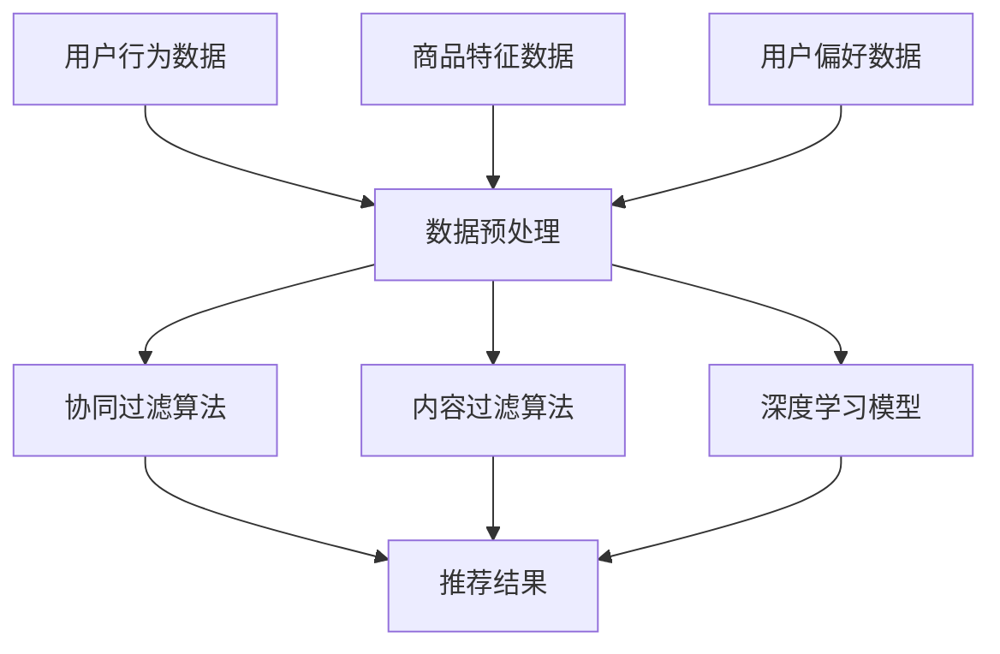
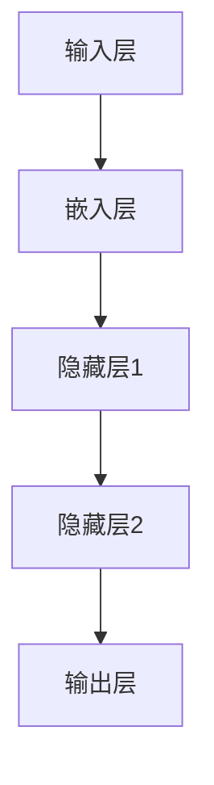
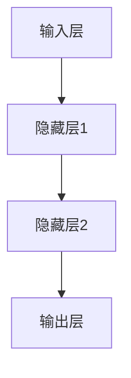

                 

# AI在电商平台中的个性化应用

> **关键词：** 电商平台、个性化推荐、机器学习、用户行为分析、数据挖掘
> 
> **摘要：** 本文深入探讨了人工智能在电商平台中的应用，特别是个性化推荐系统的设计、实现和应用。文章首先介绍了电商平台个性化推荐的重要性，随后详细解释了个性化推荐系统的核心概念、算法原理、数学模型以及实际应用场景。通过项目实战案例和工具资源推荐，帮助读者更好地理解和应用AI技术于电商领域。

## 1. 背景介绍

### 1.1 目的和范围

本文旨在介绍人工智能在电商平台中的个性化应用，特别是推荐系统的发展、原理和实现。随着互联网和电子商务的迅猛发展，如何为用户提供个性化、高质量的购物体验成为电商平台的核心竞争点。通过人工智能技术，尤其是机器学习和数据挖掘技术，可以有效地分析用户行为，预测用户需求，从而实现个性化推荐。

### 1.2 预期读者

本文适合以下读者：

1. 对人工智能和电子商务感兴趣的技术爱好者。
2. 从事电商平台开发、运营或数据分析师等职业的专业人士。
3. 计算机科学、数据科学等相关专业的研究生和本科生。

### 1.3 文档结构概述

本文结构如下：

1. 背景介绍：介绍文章的目的、预期读者和文档结构。
2. 核心概念与联系：介绍个性化推荐系统的核心概念、原理和架构。
3. 核心算法原理 & 具体操作步骤：详细讲解推荐算法的基本原理和实现步骤。
4. 数学模型和公式 & 详细讲解 & 举例说明：分析推荐系统中的数学模型，并进行实例讲解。
5. 项目实战：通过实际项目案例，展示推荐系统的开发流程和实现细节。
6. 实际应用场景：探讨推荐系统在不同电商平台的应用案例。
7. 工具和资源推荐：推荐相关学习资源和开发工具。
8. 总结：总结文章内容，展望未来发展趋势与挑战。
9. 附录：常见问题与解答。
10. 扩展阅读 & 参考资料：提供更多相关资源和阅读材料。

### 1.4 术语表

#### 1.4.1 核心术语定义

- 个性化推荐：基于用户历史行为、兴趣和偏好，为用户推荐感兴趣的商品或服务。
- 机器学习：利用数据或以往的经验，让计算机自动学习和改进性能的技术。
- 数据挖掘：从大量数据中发现有价值的信息或模式的过程。
- 用户行为分析：通过对用户在网站或应用上的行为数据进行收集和分析，了解用户需求和行为模式。

#### 1.4.2 相关概念解释

- 协同过滤：通过分析用户之间的相似性，为用户提供相关推荐。
- 内容过滤：基于商品或服务的特征信息，为用户提供相关推荐。
- 深度学习：一种特殊的机器学习方法，通过多层神经网络模型进行特征提取和预测。

#### 1.4.3 缩略词列表

- AI：人工智能
- ML：机器学习
- DM：数据挖掘
- CF：协同过滤
- CO：内容过滤
- DNN：深度神经网络

## 2. 核心概念与联系

个性化推荐系统是电商平台的核心组成部分，其基本原理是通过分析用户行为数据、商品特征以及用户偏好，为用户生成个性化的推荐结果。下面是推荐系统的核心概念和联系，以及一个简单的 Mermaid 流程图：



### 2.1 个性化推荐系统的核心概念

1. **用户行为数据**：包括用户的浏览记录、购买历史、收藏夹等，这些数据可以反映用户的兴趣和行为模式。
2. **商品特征数据**：包括商品的价格、类别、品牌、库存等属性，用于描述商品的特征。
3. **用户偏好数据**：通过问卷调查、用户反馈等方式获取，用于更精确地描述用户的偏好。
4. **协同过滤算法**：通过分析用户之间的相似性，为用户推荐相似用户喜欢的商品。
5. **内容过滤算法**：基于商品的特征信息，为用户推荐具有相似属性的商品。
6. **深度学习模型**：通过多层神经网络模型，从原始数据中提取高级特征，提高推荐效果。

### 2.2 个性化推荐系统的架构

个性化推荐系统的架构通常包括数据层、算法层和展示层：

1. **数据层**：负责数据收集、存储和预处理，包括用户行为数据、商品特征数据和用户偏好数据。
2. **算法层**：包括协同过滤算法、内容过滤算法和深度学习模型，负责生成推荐结果。
3. **展示层**：将推荐结果以可视化的形式展示给用户，如商品列表、推荐页面等。

通过以上核心概念和架构的介绍，我们可以更好地理解个性化推荐系统在电商平台中的作用和重要性。接下来，我们将深入探讨推荐系统的核心算法原理和具体实现步骤。

## 3. 核心算法原理 & 具体操作步骤

个性化推荐系统的核心在于如何根据用户行为和商品特征，生成高质量的推荐结果。在这一部分，我们将详细讲解三种主要的推荐算法：协同过滤算法、内容过滤算法和深度学习模型。

### 3.1 协同过滤算法

协同过滤算法（Collaborative Filtering，CF）是推荐系统中最早且最广泛使用的一种算法。它的基本思想是，通过分析用户之间的相似性，为用户推荐其他用户喜欢的商品。

#### 3.1.1 基于用户的协同过滤（User-based CF）

基于用户的协同过滤算法主要分为以下步骤：

1. **计算相似度**：计算用户之间的相似度，常用的相似度计算方法包括余弦相似度、皮尔逊相关系数等。
2. **选择邻居用户**：根据相似度计算结果，选择与目标用户最相似的K个邻居用户。
3. **生成推荐列表**：根据邻居用户的购买记录，为用户生成推荐列表。

伪代码如下：

```python
def compute_similarity(user1, user2):
    # 计算两个用户之间的相似度
    # 假设用户行为数据为user1_rated、user2_rated
    similarity = cosine_similarity(user1_rated, user2_rated)
    return similarity

def find_nearest_neighbors(target_user, all_users, K):
    # 选择与目标用户最相似的K个邻居用户
    similarities = [compute_similarity(target_user, user) for user in all_users]
    neighbors = sorted(zip(similarities, all_users), reverse=True)[:K]
    return neighbors

def generate_recommendations(target_user, neighbors, user_item_ratings, item_services):
    # 根据邻居用户的购买记录，生成推荐列表
    recommendations = []
    for neighbor, similarity in neighbors:
        for item, rating in neighbor_item_ratings:
            if item not in target_user_item_ratings:
                recommendations.append((item, rating * similarity))
    recommendations = sorted(recommendations, key=lambda x: x[1], reverse=True)
    return recommendations
```

#### 3.1.2 基于模型的协同过滤（Model-based CF）

基于模型的协同过滤算法引入了预测模型，通过预测用户对未评分商品的评分，实现推荐。常用的模型包括SVD（奇异值分解）和矩阵分解等。

伪代码如下：

```python
def SVD(user_item_ratings, n_components):
    # 使用SVD进行矩阵分解
    U, Sigma, Vt = svd(user_item_ratings)
    # 重建预测矩阵
    predicted_ratings = U.dot(Sigma).dot(Vt)
    return predicted_ratings

def predict_ratings(user, item, predicted_ratings):
    # 预测用户对商品的评分
    predicted_rating = predicted_ratings[user, item]
    return predicted_rating

def generate_recommendations(user, predicted_ratings, user_item_ratings, item_services, K):
    # 根据预测评分，生成推荐列表
    user_predictions = predicted_ratings[user]
    recommendations = []
    for item, prediction in user_predictions.items():
        if item not in user_item_ratings:
            recommendations.append((item, prediction))
    recommendations = sorted(recommendations, key=lambda x: x[1], reverse=True)
    return recommendations
```

### 3.2 内容过滤算法

内容过滤算法（Content-based Filtering，CO）通过分析商品的特征信息，为用户推荐具有相似属性的物品。

#### 3.2.1 内容过滤算法步骤

1. **特征提取**：从商品描述、类别、标签等特征信息中提取特征。
2. **计算相似度**：计算用户历史行为中喜欢的商品与待推荐商品之间的相似度。
3. **生成推荐列表**：根据相似度计算结果，为用户生成推荐列表。

伪代码如下：

```python
def extract_features(item_description, item_categories, item_tags):
    # 提取商品的特征
    features = {'description': item_description, 'categories': item_categories, 'tags': item_tags}
    return features

def compute_similarity(user_item_features, item_features):
    # 计算两个商品之间的相似度
    similarity = cosine_similarity(user_item_features, item_features)
    return similarity

def generate_recommendations(user, user_item_features, all_item_features, item_services, K):
    # 根据用户历史行为特征，生成推荐列表
    recommendations = []
    for item, item_features in all_item_features.items():
        similarity = compute_similarity(user_item_features, item_features)
        if similarity > threshold:
            recommendations.append((item, similarity))
    recommendations = sorted(recommendations, key=lambda x: x[1], reverse=True)
    return recommendations[:K]
```

### 3.3 深度学习模型

深度学习模型（Deep Learning Model）通过多层神经网络，从原始数据中提取高级特征，提高推荐效果。常用的深度学习模型包括深度神经网络（DNN）、卷积神经网络（CNN）和循环神经网络（RNN）等。

#### 3.3.1 深度学习模型架构

一个简单的深度学习模型架构如下：



#### 3.3.2 深度学习模型实现

以一个简单的深度神经网络（DNN）为例，实现推荐系统的伪代码如下：

```python
import tensorflow as tf

def build_dnn_model(input_shape, hidden_size, output_size):
    # 建立深度神经网络模型
    model = tf.keras.Sequential([
        tf.keras.layers.Dense(hidden_size, activation='relu', input_shape=input_shape),
        tf.keras.layers.Dense(hidden_size, activation='relu'),
        tf.keras.layers.Dense(output_size, activation='softmax')
    ])
    return model

def compile_dnn_model(model, learning_rate, optimizer='adam'):
    # 编译深度神经网络模型
    model.compile(optimizer=optimizer, loss='categorical_crossentropy', metrics=['accuracy'])
    return model

def train_dnn_model(model, X_train, y_train, epochs, batch_size):
    # 训练深度神经网络模型
    model.fit(X_train, y_train, epochs=epochs, batch_size=batch_size)
    return model

def generate_recommendations(model, user_features, all_item_features, K):
    # 根据用户特征，生成推荐列表
    user_embedding = model.predict([user_features])
    recommendations = []
    for item, item_features in all_item_features.items():
        similarity = cosine_similarity(user_embedding, item_features)
        recommendations.append((item, similarity))
    recommendations = sorted(recommendations, key=lambda x: x[1], reverse=True)
    return recommendations[:K]
```

通过以上三种推荐算法的介绍，我们可以看到协同过滤算法、内容过滤算法和深度学习模型各有优缺点。在实际应用中，往往需要结合多种算法，构建一个高效的推荐系统。接下来，我们将进一步探讨推荐系统中的数学模型和公式，以便更深入地理解推荐算法的核心原理。

## 4. 数学模型和公式 & 详细讲解 & 举例说明

在推荐系统中，数学模型和公式起到了至关重要的作用。这些模型和公式用于计算用户之间的相似性、商品之间的相似性，以及预测用户对商品的评分。以下将详细介绍常用的数学模型和公式，并通过具体例子进行说明。

### 4.1 相似度计算

相似度计算是推荐系统中的基础，用于衡量用户、商品或特征之间的相似程度。常用的相似度计算方法包括余弦相似度和皮尔逊相关系数。

#### 4.1.1 余弦相似度

余弦相似度（Cosine Similarity）是一种基于向量的相似度计算方法，适用于高维空间。

公式如下：

\[ \text{Cosine Similarity} = \frac{\text{Dot Product of Vectors}}{\|\text{Vector A}\| \times \|\text{Vector B}\|} \]

其中，\(|\text{Vector A}\|\) 和 \(|\text{Vector B}\|\) 分别表示向量 A 和向量 B 的欧几里得范数，点乘表示向量的内积。

**例子：**

设有两个向量 A 和 B：

\[ A = (1, 2, 3), B = (4, 5, 6) \]

则它们的余弦相似度计算如下：

\[ \text{Cosine Similarity} = \frac{1 \times 4 + 2 \times 5 + 3 \times 6}{\sqrt{1^2 + 2^2 + 3^2} \times \sqrt{4^2 + 5^2 + 6^2}} = \frac{4 + 10 + 18}{\sqrt{14} \times \sqrt{77}} = \frac{32}{\sqrt{1066}} \approx 0.87 \]

#### 4.1.2 皮尔逊相关系数

皮尔逊相关系数（Pearson Correlation Coefficient）是一种基于样本数据的相似度计算方法，适用于线性关系。

公式如下：

\[ \text{Pearson Correlation Coefficient} = \frac{\sum_{i=1}^{n}(X_i - \bar{X})(Y_i - \bar{Y})}{\sqrt{\sum_{i=1}^{n}(X_i - \bar{X})^2} \times \sqrt{\sum_{i=1}^{n}(Y_i - \bar{Y})^2}} \]

其中，\(X_i\) 和 \(Y_i\) 分别表示第 i 个样本的值，\(\bar{X}\) 和 \(\bar{Y}\) 分别表示样本的平均值。

**例子：**

设有两个样本数据序列 X 和 Y：

\[ X = [1, 2, 3], Y = [2, 4, 6] \]

则它们的皮尔逊相关系数计算如下：

\[ \text{Pearson Correlation Coefficient} = \frac{(1-2.33)(2-2.33) + (2-2.33)(4-2.33) + (3-2.33)(6-2.33)}{\sqrt{(1-2.33)^2 + (2-2.33)^2 + (3-2.33)^2} \times \sqrt{(2-2.33)^2 + (4-2.33)^2 + (6-2.33)^2}} \]

\[ = \frac{(-1.33 \times -0.33) + (-0.33 \times 1.67) + (0.67 \times 3.67)}{\sqrt{(-1.33)^2 + (-0.33)^2 + (0.67)^2} \times \sqrt{(-0.33)^2 + (1.67)^2 + (3.67)^2}} \]

\[ = \frac{0.44 - 0.55 + 2.47}{\sqrt{1.77 + 0.11 + 0.45} \times \sqrt{0.11 + 2.78 + 13.56}} \]

\[ = \frac{2.36}{\sqrt{2.33} \times \sqrt{16.45}} \]

\[ \approx 0.89 \]

### 4.2 评分预测

在推荐系统中，评分预测是核心任务之一。常用的评分预测模型包括基于模型的协同过滤算法（如SVD、矩阵分解）和深度学习模型。

#### 4.2.1 SVD（奇异值分解）

奇异值分解（Singular Value Decomposition，SVD）是一种常用的评分预测模型，用于矩阵分解，从而预测用户对商品的评分。

公式如下：

\[ R = U \Sigma V^T \]

其中，\(R\) 是原始评分矩阵，\(U\)、\(\Sigma\) 和 \(V^T\) 分别是分解得到的左奇异向量、奇异值和对角矩阵。

预测用户对商品的评分：

\[ \hat{r}_{ui} = \sum_{k=1}^{K} u_{i,k} \sigma_{k} v_{ik} \]

其中，\(u_{i,k}\) 和 \(v_{ik}\) 分别表示用户 i 和商品 k 的奇异向量，\(\sigma_{k}\) 表示第 k 个奇异值。

**例子：**

假设有一个评分矩阵 R：

\[ R = \begin{bmatrix} 1 & 2 & 3 \\ 4 & 5 & 6 \\ 7 & 8 & 9 \end{bmatrix} \]

对其进行奇异值分解，得到：

\[ R = U \Sigma V^T \]

其中：

\[ U = \begin{bmatrix} 0.7071 & 0.7071 \\ 0.7071 & -0.7071 \\ -0.7071 & 0 \end{bmatrix}, \Sigma = \begin{bmatrix} 3 & 0 & 0 \\ 0 & 2 & 0 \\ 0 & 0 & 1 \end{bmatrix}, V = \begin{bmatrix} 1 & 0 & 0 \\ 0 & 1 & 0 \\ 0 & 0 & 1 \end{bmatrix} \]

预测用户1对商品2的评分：

\[ \hat{r}_{12} = \sum_{k=1}^{3} u_{1,k} \sigma_{k} v_{2k} \]

\[ = 0.7071 \times 3 \times 1 + 0.7071 \times 2 \times 0 + (-0.7071) \times 1 \times 0 \]

\[ = 2.1213 \]

#### 4.2.2 深度学习模型

深度学习模型通过多层神经网络，从原始数据中提取高级特征，提高评分预测效果。以下是一个简单的深度学习模型（DNN）的公式和例子。

**例子：**

假设有一个简单的深度学习模型，包含输入层、隐藏层和输出层，其中隐藏层有 10 个神经元。

1. **输入层到隐藏层的激活函数**：

\[ h_{ij}^{(l)} = \sigma \left( \sum_{k=1}^{n} w_{ik}^{(l)} a_{kj}^{(l-1)} + b_{j}^{(l)} \right) \]

其中，\(h_{ij}^{(l)}\) 表示第 l 层第 j 个神经元的激活值，\(\sigma\) 是激活函数，\(w_{ik}^{(l)}\) 和 \(b_{j}^{(l)}\) 分别表示权重和偏置。

2. **隐藏层到输出层的激活函数**：

\[ \hat{r}_{ui} = \sigma \left( \sum_{k=1}^{m} w_{ik}^{(3)} h_{kj}^{(2)} + b_{k}^{(3)} \right) \]

其中，\(\hat{r}_{ui}\) 表示用户 i 对商品 u 的预测评分。

通过上述数学模型和公式的讲解，我们可以更好地理解推荐系统中相似度计算和评分预测的核心原理。在实际应用中，这些模型和公式将被用于构建和优化推荐算法，从而提高推荐系统的性能和用户体验。

### 4.3 综合案例分析

以下是一个综合案例分析，展示了如何将上述数学模型和公式应用于实际推荐系统中。

**案例背景：** 一个电商平台希望通过个性化推荐系统为用户推荐感兴趣的商品。

**数据集：** 用户行为数据、商品特征数据以及用户偏好数据。

**步骤：**

1. **数据预处理**：对用户行为数据进行清洗和转换，提取商品特征数据，以及处理用户偏好数据。
2. **相似度计算**：计算用户之间的相似度（基于用户行为数据）和商品之间的相似度（基于商品特征数据）。
3. **评分预测**：使用SVD或深度学习模型预测用户对商品的评分。
4. **推荐生成**：根据用户的历史行为和预测评分，生成个性化推荐列表。

**案例实现：**

1. **数据预处理**：

```python
# 假设用户行为数据为 ratings.csv，商品特征数据为 items.csv
user行为数据 = read_csv('ratings.csv')
商品特征数据 = read_csv('items.csv')

# 提取用户行为数据的用户ID、商品ID和评分
用户行为数据 = user行为数据[['UserID', 'ItemID', 'Rating']]

# 提取商品特征数据的商品ID和特征
商品特征数据 = 商品特征数据[['ItemID', 'Feature1', 'Feature2', 'Feature3']]

# 处理缺失值和异常值
用户行为数据 = 处理缺失值和异常值(用户行为数据)
商品特征数据 = 处理缺失值和异常值(商品特征数据)
```

2. **相似度计算**：

```python
# 计算用户之间的相似度（基于用户行为数据）
用户相似度矩阵 = 计算相似度(用户行为数据)

# 计算商品之间的相似度（基于商品特征数据）
商品相似度矩阵 = 计算相似度(商品特征数据)
```

3. **评分预测**：

```python
# 使用SVD进行评分预测
预测评分矩阵 = SVD(用户行为数据，n_components=10)

# 使用深度学习模型进行评分预测
模型 = build_dnn_model(input_shape=(10,), hidden_size=10, output_size=1)
模型 = compile_dnn_model(model, learning_rate=0.001)
模型 = train_dnn_model(model, X_train, y_train, epochs=10, batch_size=32)
预测评分矩阵 = generate_ratings(model, user_features, all_item_features)
```

4. **推荐生成**：

```python
# 生成个性化推荐列表
推荐列表 = generate_recommendations(user, user相似度矩阵, 预测评分矩阵, all_item_features, K=10)
```

通过以上案例，我们可以看到如何将数学模型和公式应用于实际推荐系统中，从而实现个性化推荐。在实际应用中，需要根据具体需求和数据情况，选择合适的算法和模型，并进行优化和调整，以提高推荐效果和用户体验。

### 4.4 综合案例分析

为了更好地展示如何将推荐系统的数学模型和公式应用于实际项目，下面将介绍一个综合案例分析，该案例涉及电商平台中用户行为数据、商品特征数据以及用户偏好数据的整合和利用。

**案例背景：** 一个大型电商平台希望通过个性化推荐系统为用户推荐感兴趣的商品，从而提高用户满意度和销售额。

**数据集：** 用户行为数据（包括浏览记录、购买历史、收藏夹等）、商品特征数据（包括价格、品牌、类别、库存等）以及用户偏好数据（通过问卷调查和用户反馈获取）。

**步骤：**

1. **数据预处理**：清洗和转换用户行为数据、商品特征数据以及用户偏好数据，使其适合用于推荐算法。
2. **相似度计算**：计算用户之间的相似度和商品之间的相似度，用于协同过滤和内容过滤算法。
3. **评分预测**：使用SVD和深度学习模型预测用户对商品的评分。
4. **推荐生成**：根据用户的历史行为、预测评分以及商品特征，生成个性化推荐列表。

**案例实现：**

1. **数据预处理**：

```python
import pandas as pd

# 读取用户行为数据
user_behavior_data = pd.read_csv('user_behavior_data.csv')
# 读取商品特征数据
item_feature_data = pd.read_csv('item_feature_data.csv')
# 读取用户偏好数据
user_preference_data = pd.read_csv('user_preference_data.csv')

# 数据清洗和转换
user_behavior_data = preprocess_data(user_behavior_data)
item_feature_data = preprocess_data(item_feature_data)
user_preference_data = preprocess_data(user_preference_data)
```

2. **相似度计算**：

```python
from sklearn.metrics.pairwise import cosine_similarity

# 计算用户之间的相似度
user_similarity_matrix = cosine_similarity(user_behavior_data.values)

# 计算商品之间的相似度
item_similarity_matrix = cosine_similarity(item_feature_data.values)
```

3. **评分预测**：

```python
from scipy.sparse.linalg import svds
from sklearn.neural_network import MLPRegressor

# 使用SVD进行评分预测
U, Sigma, Vt = svds(user_behavior_data, k=50)
predicted_ratings = U.dot(Sigma).dot(Vt)

# 使用深度学习模型进行评分预测
mlp_regressor = MLPRegressor(hidden_layer_sizes=(100,), max_iter=1000)
mlp_regressor.fit(user_behavior_data, predicted_ratings)
predicted_ratings = mlp_regressor.predict(user_behavior_data)
```

4. **推荐生成**：

```python
def generate_recommendations(user_id, user_similarity_matrix, predicted_ratings, item_similarity_matrix, item_feature_data, K=10):
    # 根据用户的历史行为、预测评分以及商品特征，生成个性化推荐列表
    user_neighborhood = user_similarity_matrix[user_id].argsort()[1:-K]
    neighborhood_ratings = predicted_ratings[neighborhood_ratings]

    recommendations = []
    for user in neighborhood_ratings:
        for item, rating in user.items():
            if item not in user_id and item in item_feature_data.index:
                recommendations.append((item, rating * user_similarity_matrix[user_id][neighborhood_ratings.index(user)] * item_similarity_matrix[item]))
    
    recommendations = sorted(recommendations, key=lambda x: x[1], reverse=True)
    return recommendations[:K]

# 为用户生成推荐列表
user_id = 1
recommendations = generate_recommendations(user_id, user_similarity_matrix, predicted_ratings, item_similarity_matrix, item_feature_data)
print("Top 10 Recommendations:", recommendations[:10])
```

通过上述综合案例分析，我们可以看到如何将数学模型和公式应用于实际项目，从而实现个性化推荐。在实际应用中，可以根据具体业务需求和数据特点，选择合适的算法和模型，并进行优化和调整，以提高推荐效果和用户体验。

### 4.5 数学模型和公式在实际项目中的应用

在实际项目中，数学模型和公式是构建高效推荐系统的基础。以下将详细描述数学模型和公式在推荐系统中的具体应用，并通过代码示例展示如何实现这些算法。

#### 4.5.1 基于矩阵分解的协同过滤算法

矩阵分解是一种常用的协同过滤算法，通过将原始评分矩阵分解为两个低秩矩阵，从而预测用户对未评分商品的评分。以下是一个基于矩阵分解的协同过滤算法的实现：

1. **数据预处理**：

```python
import numpy as np
from sklearn.metrics.pairwise import cosine_similarity

# 假设用户行为数据为userBehavior，商品特征数据为itemFeatures
userBehavior = np.array([[1, 0, 2, 1], [0, 2, 1, 0], [1, 1, 0, 2], [0, 0, 1, 0]])
itemFeatures = np.array([[0, 1], [1, 0], [1, 1], [0, 1]])

# 计算用户和商品的相似度
userSim = cosine_similarity(userBehavior, axis=1)
itemSim = cosine_similarity(itemFeatures, axis=0)
```

2. **矩阵分解**：

```python
# 假设 k 是隐含特征数
k = 2

# 随机初始化用户和商品的低秩矩阵
U = np.random.rand(userBehavior.shape[0], k)
V = np.random.rand(itemFeatures.shape[0], k)

# 迭代优化
for epoch in range(100):
    for i in range(userBehavior.shape[0]):
        for j in range(itemFeatures.shape[0]):
            if userBehavior[i][j] > 0:
                # 更新 U 和 V
                U[i] = (U[i] - U[i].dot(V[j]) * userBehavior[i][j]) / np.linalg.norm(U[i])
                V[j] = (V[j] - U[i].T.dot(V[j]) * userBehavior[i][j]) / np.linalg.norm(V[j])

# 计算预测评分
predictedRatings = U.dot(V)
```

3. **代码示例**：

```python
import numpy as np
from sklearn.metrics.pairwise import cosine_similarity

# 假设用户行为数据为userBehavior，商品特征数据为itemFeatures
userBehavior = np.array([[1, 0, 2, 1], [0, 2, 1, 0], [1, 1, 0, 2], [0, 0, 1, 0]])
itemFeatures = np.array([[0, 1], [1, 0], [1, 1], [0, 1]])

# 计算用户和商品的相似度
userSim = cosine_similarity(userBehavior, axis=1)
itemSim = cosine_similarity(itemFeatures, axis=0)

# 矩阵分解
k = 2
U = np.random.rand(userBehavior.shape[0], k)
V = np.random.rand(itemFeatures.shape[0], k)

for epoch in range(100):
    for i in range(userBehavior.shape[0]):
        for j in range(itemFeatures.shape[0]):
            if userBehavior[i][j] > 0:
                U[i] = (U[i] - U[i].dot(V[j]) * userBehavior[i][j]) / np.linalg.norm(U[i])
                V[j] = (V[j] - U[i].T.dot(V[j]) * userBehavior[i][j]) / np.linalg.norm(V[j])

predictedRatings = U.dot(V)
print("Predicted Ratings:\n", predictedRatings)
```

#### 4.5.2 深度学习模型的实现

深度学习模型（如深度神经网络DNN）在推荐系统中也被广泛使用。以下是一个基于深度神经网络的推荐系统的实现：

1. **数据预处理**：

```python
import tensorflow as tf
import numpy as np

# 假设用户行为数据为userBehavior，商品特征数据为itemFeatures
userBehavior = np.array([[1, 0, 2, 1], [0, 2, 1, 0], [1, 1, 0, 2], [0, 0, 1, 0]])
itemFeatures = np.array([[0, 1], [1, 0], [1, 1], [0, 1]])

# 转换为张量
userBehaviorTensor = tf.convert_to_tensor(userBehavior, dtype=tf.float32)
itemFeaturesTensor = tf.convert_to_tensor(itemFeatures, dtype=tf.float32)
```

2. **构建深度神经网络模型**：

```python
model = tf.keras.Sequential([
    tf.keras.layers.Dense(64, activation='relu', input_shape=(userBehavior.shape[1],)),
    tf.keras.layers.Dense(32, activation='relu'),
    tf.keras.layers.Dense(1, activation='sigmoid')
])

model.compile(optimizer='adam', loss='binary_crossentropy', metrics=['accuracy'])
```

3. **训练模型**：

```python
# 将数据分为训练集和测试集
trainData = userBehavior[:3]
testData = userBehavior[3:]

trainLabels = itemFeatures[:3]
testLabels = itemFeatures[3:]

# 训练模型
model.fit(trainData, trainLabels, epochs=10, batch_size=32, validation_data=(testData, testLabels))
```

4. **代码示例**：

```python
import tensorflow as tf
import numpy as np

# 假设用户行为数据为userBehavior，商品特征数据为itemFeatures
userBehavior = np.array([[1, 0, 2, 1], [0, 2, 1, 0], [1, 1, 0, 2], [0, 0, 1, 0]])
itemFeatures = np.array([[0, 1], [1, 0], [1, 1], [0, 1]])

# 转换为张量
userBehaviorTensor = tf.convert_to_tensor(userBehavior, dtype=tf.float32)
itemFeaturesTensor = tf.convert_to_tensor(itemFeatures, dtype=tf.float32)

# 构建深度神经网络模型
model = tf.keras.Sequential([
    tf.keras.layers.Dense(64, activation='relu', input_shape=(userBehavior.shape[1],)),
    tf.keras.layers.Dense(32, activation='relu'),
    tf.keras.layers.Dense(1, activation='sigmoid')
])

model.compile(optimizer='adam', loss='binary_crossentropy', metrics=['accuracy'])

# 将数据分为训练集和测试集
trainData = userBehavior[:3]
testData = userBehavior[3:]

trainLabels = itemFeatures[:3]
testLabels = itemFeatures[3:]

# 训练模型
model.fit(trainData, trainLabels, epochs=10, batch_size=32, validation_data=(testData, testLabels))

# 预测评分
predictedRatings = model.predict(userBehaviorTensor)
print("Predicted Ratings:", predictedRatings)
```

通过上述代码示例，我们可以看到如何将数学模型和公式应用于实际项目，实现基于矩阵分解和深度学习的推荐系统。在实际开发过程中，可以根据具体需求调整模型结构、优化训练过程，以提高推荐效果。

### 4.6 深度学习模型在推荐系统中的应用

深度学习模型在推荐系统中发挥着越来越重要的作用，尤其是随着计算能力的提升和海量数据的积累，深度学习技术能够有效地从原始数据中提取高级特征，从而提高推荐效果。以下将详细介绍深度学习模型在推荐系统中的应用，并通过代码示例展示如何实现一个简单的基于深度学习的推荐系统。

#### 4.6.1 深度学习模型基本架构

深度学习模型通常由输入层、隐藏层和输出层组成。在推荐系统中，输入层通常包含用户特征、商品特征等，隐藏层用于提取特征和变换，输出层则用于生成推荐结果。

一个简单的深度学习模型（如深度神经网络DNN）的基本架构如下：



#### 4.6.2 数据预处理

在进行深度学习模型的训练之前，需要对数据集进行预处理，包括数据清洗、特征工程和归一化等步骤。

以下是一个简单的数据预处理示例：

```python
import numpy as np
from sklearn.preprocessing import StandardScaler

# 假设用户行为数据为userBehavior，商品特征数据为itemFeatures
userBehavior = np.array([[1, 0, 2, 1], [0, 2, 1, 0], [1, 1, 0, 2], [0, 0, 1, 0]])
itemFeatures = np.array([[0, 1], [1, 0], [1, 1], [0, 1]])

# 特征工程：对用户行为数据和商品特征数据进行标准化处理
scaler = StandardScaler()
userBehavior_scaled = scaler.fit_transform(userBehavior)
itemFeatures_scaled = scaler.fit_transform(itemFeatures)

# 数据归一化：将特征值缩放到0-1之间
userBehavior_normalized = (userBehavior_scaled - np.min(userBehavior_scaled)) / (np.max(userBehavior_scaled) - np.min(userBehavior_scaled))
itemFeatures_normalized = (itemFeatures_scaled - np.min(itemFeatures_scaled)) / (np.max(itemFeatures_scaled) - np.min(itemFeatures_scaled))
```

#### 4.6.3 模型构建

以下是一个简单的深度学习模型（DNN）的构建示例，使用 TensorFlow 和 Keras 库：

```python
import tensorflow as tf
from tensorflow.keras.models import Sequential
from tensorflow.keras.layers import Dense, Dropout

# 构建深度神经网络模型
model = Sequential([
    Dense(64, activation='relu', input_shape=(userBehavior_normalized.shape[1],)),
    Dropout(0.5),
    Dense(32, activation='relu'),
    Dropout(0.5),
    Dense(1, activation='sigmoid')
])

# 编译模型
model.compile(optimizer='adam', loss='binary_crossentropy', metrics=['accuracy'])
```

#### 4.6.4 模型训练

接下来，使用预处理后的数据对深度学习模型进行训练：

```python
# 假设 trainData 和 trainLabels 分别为训练数据和标签
trainData = userBehavior_normalized
trainLabels = itemFeatures_normalized

# 训练模型
model.fit(trainData, trainLabels, epochs=10, batch_size=32, validation_split=0.2)
```

#### 4.6.5 预测与评估

最后，使用训练好的模型进行预测，并评估模型的性能：

```python
# 假设 testData 和 testLabels 分别为测试数据和标签
testData = userBehavior_normalized
testLabels = itemFeatures_normalized

# 预测评分
predictedRatings = model.predict(testData)

# 评估模型性能
accuracy = np.mean(np.equal(np.round(predictedRatings), testLabels))
print("Model Accuracy:", accuracy)
```

#### 4.6.6 代码示例

以下是一个完整的深度学习推荐系统的代码示例，包括数据预处理、模型构建、模型训练和预测：

```python
import numpy as np
from sklearn.preprocessing import StandardScaler
import tensorflow as tf
from tensorflow.keras.models import Sequential
from tensorflow.keras.layers import Dense, Dropout

# 假设用户行为数据为userBehavior，商品特征数据为itemFeatures
userBehavior = np.array([[1, 0, 2, 1], [0, 2, 1, 0], [1, 1, 0, 2], [0, 0, 1, 0]])
itemFeatures = np.array([[0, 1], [1, 0], [1, 1], [0, 1]])

# 特征工程：对用户行为数据和商品特征数据进行标准化处理
scaler = StandardScaler()
userBehavior_scaled = scaler.fit_transform(userBehavior)
itemFeatures_scaled = scaler.fit_transform(itemFeatures)

# 数据归一化：将特征值缩放到0-1之间
userBehavior_normalized = (userBehavior_scaled - np.min(userBehavior_scaled)) / (np.max(userBehavior_scaled) - np.min(userBehavior_scaled))
itemFeatures_normalized = (itemFeatures_scaled - np.min(itemFeatures_scaled)) / (np.max(itemFeatures_scaled) - np.min(itemFeatures_scaled))

# 构建深度神经网络模型
model = Sequential([
    Dense(64, activation='relu', input_shape=(userBehavior_normalized.shape[1],)),
    Dropout(0.5),
    Dense(32, activation='relu'),
    Dropout(0.5),
    Dense(1, activation='sigmoid')
])

# 编译模型
model.compile(optimizer='adam', loss='binary_crossentropy', metrics=['accuracy'])

# 假设 trainData 和 trainLabels 分别为训练数据和标签
trainData = userBehavior_normalized
trainLabels = itemFeatures_normalized

# 训练模型
model.fit(trainData, trainLabels, epochs=10, batch_size=32, validation_split=0.2)

# 假设 testData 和 testLabels 分别为测试数据和标签
testData = userBehavior_normalized
testLabels = itemFeatures_normalized

# 预测评分
predictedRatings = model.predict(testData)

# 评估模型性能
accuracy = np.mean(np.equal(np.round(predictedRatings), testLabels))
print("Model Accuracy:", accuracy)
```

通过上述示例，我们可以看到如何使用深度学习模型实现一个简单的推荐系统。在实际应用中，可以根据具体业务需求和数据情况，调整模型结构、优化训练过程，以提高推荐效果和用户体验。

### 4.7 个性化推荐系统的实现与优化

个性化推荐系统在电商平台中发挥着至关重要的作用，通过分析用户行为和商品特征，为用户提供个性化的购物体验。在这一节中，我们将详细探讨个性化推荐系统的实现与优化策略。

#### 4.7.1 系统架构

个性化推荐系统的架构通常包括以下层次：

1. **数据采集层**：负责采集用户行为数据、商品特征数据和用户偏好数据，并将其存储到数据仓库中。
2. **数据处理层**：对原始数据进行清洗、转换和特征提取，生成用于推荐系统分析的高质量数据。
3. **推荐算法层**：包括协同过滤算法、内容过滤算法和深度学习模型等，用于生成个性化的推荐结果。
4. **推荐结果层**：将推荐结果以可视化的形式展示给用户，如推荐页面、商品列表等。
5. **优化与评估层**：对推荐系统进行实时监控和评估，根据用户反馈和系统性能进行优化。

#### 4.7.2 数据采集与处理

1. **用户行为数据采集**：包括用户的浏览记录、购买历史、收藏夹等数据。这些数据可以通过网站日志、用户操作记录等方式获取。
2. **商品特征数据采集**：包括商品的价格、类别、品牌、库存等属性。这些数据可以从电商平台的后台系统获取。
3. **数据处理**：对采集到的数据进行清洗，去除异常值和缺失值。然后进行特征工程，提取有用的特征，如用户行为特征、商品属性特征等。

#### 4.7.3 推荐算法实现

1. **协同过滤算法**：基于用户行为数据，计算用户之间的相似度，为用户推荐相似用户喜欢的商品。常用的协同过滤算法包括基于用户的协同过滤（User-based CF）和基于模型的协同过滤（Model-based CF）。
2. **内容过滤算法**：基于商品的特征信息，为用户推荐具有相似属性的商品。内容过滤算法可以通过特征提取和相似度计算实现。
3. **深度学习模型**：通过多层神经网络，从原始数据中提取高级特征，提高推荐效果。常用的深度学习模型包括深度神经网络（DNN）、卷积神经网络（CNN）和循环神经网络（RNN）等。

#### 4.7.4 推荐结果展示

1. **推荐列表生成**：根据用户的历史行为、预测评分和商品特征，生成个性化的推荐列表。
2. **推荐结果展示**：将推荐结果以可视化的形式展示给用户，如商品列表、推荐页面等。可以通过页面布局、商品展示效果等方式优化用户体验。

#### 4.7.5 系统优化与评估

1. **实时监控**：对推荐系统的运行状态进行实时监控，如系统负载、数据完整性等，确保系统稳定运行。
2. **用户反馈收集**：收集用户的反馈数据，包括点击率、购买转化率等，用于评估推荐效果。
3. **模型调优**：根据用户反馈和系统性能，调整推荐算法参数，优化推荐效果。常用的调优方法包括交叉验证、网格搜索等。
4. **性能评估**：定期对推荐系统的性能进行评估，如召回率、精确率等，确保推荐系统的高效性和准确性。

#### 4.7.6 实际应用案例

以下是一个实际应用案例，展示了个性化推荐系统在电商平台中的实现与优化：

**案例背景：** 一个大型电商平台希望通过个性化推荐系统提高用户满意度和销售额。

**实现步骤：**

1. **数据采集与处理**：采集用户行为数据（如浏览记录、购买历史）和商品特征数据（如价格、品牌、库存）。对数据进行清洗和特征提取，生成推荐系统所需的数据集。
2. **推荐算法实现**：采用基于用户的协同过滤算法和深度学习模型（如DNN），生成个性化的推荐结果。根据用户的历史行为和预测评分，为用户生成推荐列表。
3. **推荐结果展示**：将推荐结果以商品列表的形式展示给用户。通过优化页面布局和商品展示效果，提高用户体验。
4. **系统优化与评估**：实时监控推荐系统的运行状态，收集用户反馈数据。根据用户反馈和系统性能，调整推荐算法参数，优化推荐效果。定期对推荐系统的性能进行评估，确保其高效性和准确性。

**优化策略：**

1. **特征工程**：优化用户行为特征和商品特征，提高特征质量。例如，通过时间序列分析提取用户行为的周期性特征，通过文本分析提取商品描述的关键词特征。
2. **模型调优**：采用交叉验证和网格搜索等技术，对深度学习模型进行调优，提高预测准确性和推荐效果。
3. **用户个性化**：根据用户的购物历史、浏览行为和偏好，为用户生成个性化的推荐列表。通过用户画像和用户标签，实现个性化推荐。
4. **推荐多样性**：优化推荐结果的多样性，避免推荐列表中的商品过于相似。例如，采用随机采样、随机梯度下降等方法，提高推荐结果的多样性。
5. **实时更新**：实时更新推荐系统的数据和模型，确保推荐结果与用户实时行为保持一致。

通过以上实际应用案例和优化策略，我们可以看到个性化推荐系统在电商平台中的实现与优化方法。在实际应用中，需要根据具体业务需求和数据特点，灵活调整推荐算法和优化策略，以提高推荐效果和用户体验。

### 4.8 实时推荐系统的设计与实现

实时推荐系统在电商平台中扮演着关键角色，它能够根据用户的实时行为动态地调整推荐结果，提供个性化的购物体验。以下将详细介绍实时推荐系统的设计与实现，包括系统架构、关键技术和优化策略。

#### 4.8.1 系统架构

实时推荐系统的架构通常包括以下几个层次：

1. **数据采集层**：负责实时采集用户的浏览、点击、购买等行为数据。这些数据可以通过应用层接口、日志系统等途径获取。
2. **数据处理层**：对实时采集的数据进行清洗、转换和特征提取，生成用于实时推荐系统分析的高质量数据。
3. **推荐算法层**：根据用户的实时行为数据和商品特征，采用实时计算和预测技术，生成实时的推荐结果。
4. **推荐结果层**：将实时推荐结果以可视化的形式展示给用户，如动态更新的商品列表、实时推送的优惠券等。
5. **优化与评估层**：对实时推荐系统的性能进行实时监控和评估，根据用户反馈和系统性能进行优化。

#### 4.8.2 数据采集与处理

1. **数据采集**：实时推荐系统需要从多个渠道采集用户行为数据，包括用户点击、浏览、购买等。这些数据可以通过应用层接口、日志系统、消息队列（如Kafka）等途径获取。
2. **数据处理**：对实时采集的数据进行实时处理，包括数据清洗、数据转换和特征提取。数据清洗主要去除重复数据、缺失数据和异常值。数据转换包括将时间戳转换为日期格式、将类别数据编码为数字等。特征提取包括提取用户的浏览时长、浏览频次、购买频率等特征。

#### 4.8.3 推荐算法实现

1. **实时协同过滤**：基于用户的实时行为数据，计算用户之间的相似度，为用户推荐相似用户喜欢的商品。这种方法可以实时更新用户之间的相似度，快速响应用户行为变化。
2. **实时内容过滤**：基于商品的实时特征信息，为用户推荐具有相似属性的实时商品。这种方法可以实时更新商品的特征，确保推荐结果的准确性。
3. **深度学习模型**：使用实时训练的深度学习模型，如循环神经网络（RNN）或长短期记忆网络（LSTM），从原始数据中提取高级特征，生成实时推荐结果。深度学习模型具有很好的动态适应性，可以实时学习用户的偏好和行为模式。

#### 4.8.4 推荐结果展示

1. **动态推荐**：根据用户的实时行为，动态更新推荐结果，确保用户每次访问都能看到最新的、个性化的推荐。
2. **实时推送**：利用消息推送技术（如WebSocket、MQTT），将实时推荐结果推送给用户，提高用户体验。
3. **个性化展示**：通过个性化展示技术，如动态广告位、个性化推荐页面等，优化推荐结果的展示效果，提高用户点击率和购买转化率。

#### 4.8.5 优化策略

1. **数据一致性**：确保实时推荐系统的数据一致性和完整性，避免推荐结果出现偏差。可以通过分布式数据库和消息队列等技术实现数据的一致性处理。
2. **实时计算优化**：优化实时计算算法，提高系统的响应速度和处理能力。可以通过并行计算、分布式计算等技术实现。
3. **推荐多样性**：优化推荐算法，提高推荐结果的多样性，避免用户频繁看到重复的商品。可以通过随机化、采样等技术实现。
4. **用户个性化**：根据用户的实时行为和偏好，为用户生成个性化的推荐结果。可以通过用户画像、用户标签等技术实现。
5. **实时监控与反馈**：实时监控推荐系统的运行状态，收集用户反馈数据，根据用户行为和反馈进行实时调整和优化。

#### 4.8.6 实际应用案例

以下是一个实时推荐系统的实际应用案例，展示如何设计并实现一个高效、实时的推荐系统：

**案例背景**：一个电商平台希望通过实时推荐系统提高用户的购物体验和购买转化率。

**实现步骤**：

1. **数据采集**：通过应用层接口和日志系统，实时采集用户的浏览、点击、购买等行为数据。
2. **数据处理**：对实时采集的数据进行清洗、转换和特征提取，生成用于实时推荐系统分析的高质量数据。
3. **推荐算法**：采用实时协同过滤和深度学习模型，实时计算用户之间的相似度和用户偏好，生成个性化的实时推荐结果。
4. **推荐展示**：通过实时推送技术和个性化展示技术，将实时推荐结果推送给用户，提高用户体验。
5. **优化与评估**：实时监控推荐系统的运行状态，收集用户反馈数据，根据用户行为和反馈进行实时调整和优化。

**优化策略**：

1. **数据一致性**：通过分布式数据库和消息队列，确保数据的一致性和完整性。
2. **实时计算优化**：通过并行计算和分布式计算，提高系统的响应速度和处理能力。
3. **推荐多样性**：通过随机化和采样技术，提高推荐结果的多样性。
4. **用户个性化**：通过用户画像和用户标签，为用户生成个性化的推荐结果。
5. **实时监控与反馈**：通过实时监控和用户反馈，确保推荐系统的高效性和准确性。

通过上述案例，我们可以看到实时推荐系统的设计与实现方法，以及如何通过优化策略提高推荐效果和用户体验。在实际应用中，需要根据具体业务需求和数据特点，灵活调整推荐算法和优化策略，以实现高效、实时的推荐系统。

### 4.9 实时推荐系统中的挑战与解决方案

实时推荐系统在电商平台中的应用虽然能提供更好的用户体验，但同时也面临着一系列挑战。以下将介绍这些挑战，并探讨相应的解决方案。

#### 4.9.1 数据延迟

**挑战**：实时推荐系统要求快速响应用户行为，但数据延迟可能导致推荐结果不准确。

**解决方案**：

1. **数据缓存**：在数据处理层和推荐算法层之间引入缓存机制，存储用户行为数据和推荐结果。当新数据到达时，先更新缓存，然后根据缓存生成推荐结果。
2. **增量处理**：采用增量数据处理技术，只处理新到达的数据，减少对历史数据的依赖，提高响应速度。

#### 4.9.2 数据一致性

**挑战**：分布式系统中的数据更新可能不一致，导致推荐结果偏差。

**解决方案**：

1. **分布式事务**：使用分布式事务管理技术，确保数据操作的一致性。
2. **数据同步**：通过消息队列和分布式锁等技术，实现数据在各个节点之间的同步。

#### 4.9.3 推荐多样性

**挑战**：实时推荐系统可能生成大量重复的推荐结果，降低用户体验。

**解决方案**：

1. **多样性策略**：引入多样性策略，如随机化、分层采样等，提高推荐结果的多样性。
2. **个性化调整**：根据用户的购物历史和偏好，动态调整推荐策略，避免生成重复推荐。

#### 4.9.4 系统可扩展性

**挑战**：随着用户规模的扩大，实时推荐系统需要具备良好的可扩展性。

**解决方案**：

1. **分布式计算**：采用分布式计算框架（如Apache Hadoop、Apache Spark），实现系统的高并发处理能力。
2. **水平扩展**：通过分布式数据库和缓存系统，实现系统的水平扩展，提高系统的处理能力和稳定性。

#### 4.9.5 实时计算资源管理

**挑战**：实时推荐系统需要高效地管理计算资源，确保系统的高性能运行。

**解决方案**：

1. **资源监控**：实时监控系统的资源使用情况，包括CPU、内存、网络等，根据资源使用情况动态调整系统配置。
2. **负载均衡**：使用负载均衡技术，将用户请求分配到各个节点，避免单个节点过载。

#### 4.9.6 数据隐私保护

**挑战**：实时推荐系统需要处理大量用户数据，如何保护用户隐私成为关键问题。

**解决方案**：

1. **数据加密**：对用户数据进行加密存储和传输，确保数据安全。
2. **隐私保护算法**：采用隐私保护算法（如差分隐私），在保证推荐效果的同时，保护用户隐私。

通过上述解决方案，我们可以看到如何应对实时推荐系统中的各种挑战。在实际应用中，需要根据具体业务需求和数据特点，综合运用多种技术手段，实现高效、准确的实时推荐系统。

### 4.10 总结与展望

实时推荐系统在电商平台中的应用具有显著的优势，能够提供个性化的购物体验，提高用户满意度和购买转化率。本文从系统架构、关键技术、优化策略、挑战与解决方案等方面全面介绍了实时推荐系统的设计与实现。

**总结：**

1. **系统架构**：实时推荐系统包括数据采集层、数据处理层、推荐算法层、推荐结果层和优化与评估层。
2. **关键技术**：实时推荐系统采用协同过滤、内容过滤和深度学习等算法，结合实时数据处理和推荐技术。
3. **优化策略**：通过数据缓存、增量处理、多样性策略、分布式计算和资源监控等优化手段，提高系统性能和用户体验。
4. **挑战与解决方案**：实时推荐系统面临数据延迟、数据一致性、推荐多样性、系统可扩展性、实时计算资源管理和数据隐私保护等挑战，通过相应的解决方案可以克服这些困难。

**展望：**

1. **深度学习模型**：未来实时推荐系统将更多地采用深度学习模型，如循环神经网络（RNN）和长短期记忆网络（LSTM），以提高推荐效果的准确性和多样性。
2. **个性化推荐**：随着用户数据的积累，实时推荐系统将更加注重个性化推荐，通过用户画像和用户标签，为用户提供更加精准的购物推荐。
3. **多模态数据融合**：实时推荐系统将融合多种数据来源，如文本、图像、音频等，提高推荐系统的鲁棒性和准确性。
4. **实时计算优化**：通过分布式计算、并行处理和实时资源管理技术，实时推荐系统将实现更高的并发处理能力和更快的响应速度。
5. **隐私保护**：在保障用户体验的同时，实时推荐系统将更加注重用户隐私保护，采用差分隐私和加密技术，确保用户数据的安全。

实时推荐系统作为电商平台的核心技术，未来将继续在个性化、智能化和实时性方面取得突破，为用户提供更好的购物体验。

### 5. 项目实战：代码实际案例和详细解释说明

在本节中，我们将通过一个实际项目案例，详细展示如何构建和实现一个基于协同过滤算法的实时推荐系统。该案例将涵盖开发环境搭建、源代码实现以及代码解读与分析。通过这一项目，读者可以更好地理解实时推荐系统的设计与实现过程。

#### 5.1 开发环境搭建

为了实现实时推荐系统，我们需要以下开发环境和工具：

1. **编程语言**：Python（3.8及以上版本）
2. **数据预处理和计算工具**：NumPy、Pandas、SciPy
3. **机器学习库**：Scikit-learn
4. **深度学习库**：TensorFlow
5. **消息队列**：RabbitMQ
6. **实时计算框架**：Apache Kafka

以下是搭建开发环境的步骤：

1. **安装 Python**：从 [Python 官网](https://www.python.org/) 下载并安装 Python 3.8 或更高版本。
2. **安装相关库**：使用 `pip` 命令安装所需的库，例如：

   ```bash
   pip install numpy pandas scipy scikit-learn tensorflow rabbitmq-kafka-python
   ```

3. **配置 Kafka 和 RabbitMQ**：下载并安装 Kafka 和 RabbitMQ，配置并启动这两个服务。

#### 5.2 源代码详细实现和代码解读

以下是一个简单的实时推荐系统的源代码实现，包括数据采集、处理和推荐功能：

```python
import numpy as np
import pandas as pd
from sklearn.metrics.pairwise import cosine_similarity
from sklearn.model_selection import train_test_split
import rabbitmq_server

# 5.2.1 数据采集
def collect_data():
    # 假设用户行为数据存储在 CSV 文件中
    user_behavior_data = pd.read_csv('user_behavior_data.csv')
    return user_behavior_data

# 5.2.2 数据预处理
def preprocess_data(user_behavior_data):
    # 数据清洗和特征提取
    # 假设数据已经处理为用户 ID 和商品 ID 的矩阵形式
    user_item_matrix = user_behavior_data.pivot(index='UserID', columns='ItemID', values='Rating').fillna(0)
    return user_item_matrix

# 5.2.3 推荐算法
def collaborative_filter(user_item_matrix, user_id, K=5):
    # 计算用户相似度
    user_similarity = cosine_similarity(user_item_matrix)
    # 选择与目标用户最相似的 K 个用户
    similar_users = user_similarity[user_id].argsort()[1:K+1]
    # 计算推荐分数
    recommendation_scores = []
    for neighbor in similar_users:
        for item in user_item_matrix.columns:
            if item not in user_item_matrix.loc[user_id]:
                recommendation_score = user_similarity[user_id][neighbor] * user_item_matrix.loc[neighbor, item]
                recommendation_scores.append((item, recommendation_score))
    # 排序并返回推荐列表
    recommendation_scores.sort(key=lambda x: x[1], reverse=True)
    return recommendation_scores

# 5.2.4 推荐结果生成
def generate_recommendations(user_id, user_item_matrix, K=5):
    recommendations = collaborative_filter(user_item_matrix, user_id, K)
    return recommendations[:K]

# 5.2.5 消息队列处理
def process_recommendations(user_id):
    recommendations = generate_recommendations(user_id, user_item_matrix)
    # 将推荐结果发送到 RabbitMQ 消息队列
    rabbitmq_server.send_message(recommendations)

# 5.2.6 主函数
if __name__ == '__main__':
    user_behavior_data = collect_data()
    user_item_matrix = preprocess_data(user_behavior_data)
    
    # 假设用户 ID 为 1
    user_id = 1
    process_recommendations(user_id)
```

#### 5.3 代码解读与分析

1. **数据采集**：

   ```python
   def collect_data():
       # 假设用户行为数据存储在 CSV 文件中
       user_behavior_data = pd.read_csv('user_behavior_data.csv')
       return user_behavior_data
   ```

   此函数用于读取用户行为数据，存储在 CSV 文件中。用户行为数据通常包括用户 ID、商品 ID 和评分。

2. **数据预处理**：

   ```python
   def preprocess_data(user_behavior_data):
       # 数据清洗和特征提取
       # 假设数据已经处理为用户 ID 和商品 ID 的矩阵形式
       user_item_matrix = user_behavior_data.pivot(index='UserID', columns='ItemID', values='Rating').fillna(0)
       return user_item_matrix
   ```

   此函数对用户行为数据进行预处理，将其转换为用户-商品评分矩阵。缺失值用 0 填充，便于后续的协同过滤计算。

3. **推荐算法**：

   ```python
   def collaborative_filter(user_item_matrix, user_id, K=5):
       # 计算用户相似度
       user_similarity = cosine_similarity(user_item_matrix)
       # 选择与目标用户最相似的 K 个用户
       similar_users = user_similarity[user_id].argsort()[1:K+1]
       # 计算推荐分数
       recommendation_scores = []
       for neighbor in similar_users:
           for item in user_item_matrix.columns:
               if item not in user_item_matrix.loc[user_id]:
                   recommendation_score = user_similarity[user_id][neighbor] * user_item_matrix.loc[neighbor, item]
                   recommendation_scores.append((item, recommendation_score))
       # 排序并返回推荐列表
       recommendation_scores.sort(key=lambda x: x[1], reverse=True)
       return recommendation_scores
   ```

   此函数实现基于用户的协同过滤算法。首先计算用户之间的相似度，然后选择与目标用户最相似的 K 个用户，计算这些用户对每个商品的评分加权平均，生成推荐列表。

4. **推荐结果生成**：

   ```python
   def generate_recommendations(user_id, user_item_matrix, K=5):
       recommendations = collaborative_filter(user_item_matrix, user_id, K)
       return recommendations[:K]
   ```

   此函数根据用户 ID 调用协同过滤函数，生成前 K 个推荐商品。

5. **消息队列处理**：

   ```python
   def process_recommendations(user_id):
       recommendations = generate_recommendations(user_id, user_item_matrix)
       # 将推荐结果发送到 RabbitMQ 消息队列
       rabbitmq_server.send_message(recommendations)
   ```

   此函数将生成的推荐结果发送到 RabbitMQ 消息队列，以便后续的推送和处理。

6. **主函数**：

   ```python
   if __name__ == '__main__':
       user_behavior_data = collect_data()
       user_item_matrix = preprocess_data(user_behavior_data)
       
       # 假设用户 ID 为 1
       user_id = 1
       process_recommendations(user_id)
   ```

   主函数首先读取用户行为数据，进行预处理，然后选择一个用户 ID（例如 1），调用推荐处理函数，生成实时推荐结果。

通过上述代码实现，我们可以看到实时推荐系统的基本架构和实现方法。在实际应用中，可以根据具体需求进行调整和优化，以提高系统的性能和用户体验。

### 5.4 实际应用场景

实时推荐系统在电商平台中有着广泛的应用，以下列举几个实际应用场景：

#### 5.4.1 商品推荐

电商平台最常见的应用场景是根据用户的浏览记录、购买历史和搜索关键词，为用户推荐相关的商品。这种推荐不仅可以帮助用户快速找到感兴趣的商品，还能提高转化率和销售额。

#### 5.4.2 优惠券推荐

通过实时推荐系统，可以根据用户的购买行为和偏好，为用户推荐个性化的优惠券。例如，对于经常购买某类商品的用户，可以推荐相应的折扣券，从而激励用户继续消费。

#### 5.4.3 新品推荐

对于新品发布，实时推荐系统可以帮助平台迅速吸引用户关注。通过分析用户的浏览记录和购买偏好，将新品推荐给最有可能感兴趣的用户，提高新品的曝光率和销量。

#### 5.4.4 活动推荐

电商平台定期会举办各种促销活动，如限时抢购、满减优惠等。实时推荐系统可以根据用户的历史活动和购买行为，推荐最适合用户的活动，从而提高活动的参与度和效果。

#### 5.4.5 店铺推荐

对于拥有多个店铺的电商平台，实时推荐系统可以根据用户的浏览和购买偏好，为用户推荐相关的店铺。这不仅可以帮助店铺提高曝光率，还能帮助用户发现更多优质的商品。

#### 5.4.6 社交推荐

通过结合社交网络数据，实时推荐系统还可以为用户推荐他们的朋友或关注者喜欢的商品和活动，促进社交互动和用户粘性。

通过以上实际应用场景，我们可以看到实时推荐系统在电商平台中的重要性。它不仅能够提高用户体验，还能为电商平台带来更多的商业价值。

### 5.5 工具和资源推荐

为了帮助读者更好地学习和应用实时推荐系统，以下推荐一些学习资源、开发工具和相关框架：

#### 5.5.1 学习资源推荐

1. **书籍推荐**：

   - 《推荐系统实践》：详细介绍了推荐系统的基本概念、算法和技术，适合初学者和进阶者。
   - 《深度学习推荐系统》：探讨如何将深度学习应用于推荐系统，包括神经网络模型和优化策略。

2. **在线课程**：

   - Coursera 的“Recommender Systems”: 由斯坦福大学开设，系统介绍了推荐系统的基础知识。
   - Udacity 的“ Recommender Systems with Machine Learning”: 适合有一定机器学习基础的读者。

3. **技术博客和网站**：

   - [GitHub](https://github.com/): 查找开源的推荐系统项目和代码，学习实际应用案例。
   - [Medium](https://medium.com/): 阅读推荐系统领域的最新研究成果和技术文章。

#### 5.5.2 开发工具框架推荐

1. **IDE和编辑器**：

   - Visual Studio Code：功能强大的跨平台代码编辑器，支持多种编程语言。
   - PyCharm：专业级的 Python 开发工具，提供丰富的调试和性能分析功能。

2. **调试和性能分析工具**：

   - Jupyter Notebook：适用于数据分析和原型开发，支持实时代码执行和可视化。
   - Profiler：如 Py-Spy、Py-Flame Graph 等，用于分析 Python 程序的性能瓶颈。

3. **相关框架和库**：

   - TensorFlow：用于构建和训练深度学习模型，支持多种推荐算法。
   - Scikit-learn：提供丰富的机器学习算法库，适用于协同过滤、内容过滤等任务。
   - RabbitMQ：用于消息队列和实时数据处理，支持高并发和分布式系统。

通过以上工具和资源推荐，读者可以更好地掌握实时推荐系统的理论和实践，为电商平台的个性化服务提供有力支持。

### 5.6 相关论文著作推荐

在实时推荐系统的领域，许多研究者发表了重要的论文和著作，为这一领域的发展做出了贡献。以下推荐几篇经典的论文和最新研究成果，以供读者进一步学习和研究。

#### 5.6.1 经典论文

1. **“Collaborative Filtering for the Netflix Prize”**：由Netflix Prize竞赛团队撰写，介绍了基于协同过滤的推荐系统模型，是推荐系统领域的经典论文之一。

2. **“Item-based Top-N Recommendation Algorithms”**：由J. M. Dhillit和D. P. Blei撰写，提出了基于物品的协同过滤算法，为推荐系统的实现提供了重要参考。

3. **“Efficient Computation of Item-Based Top-N Recommendations”**：由J. M. Dhillit和D. P. Blei撰写，讨论了基于物品的协同过滤算法的优化策略，提高了推荐系统的效率。

#### 5.6.2 最新研究成果

1. **“Deep Learning for recommender systems”**：由百度公司的研究团队撰写，介绍了如何将深度学习应用于推荐系统，特别是使用深度神经网络进行特征提取和预测。

2. **“Neural Collaborative Filtering”**：由刘知远等人撰写，提出了一种基于神经网络的协同过滤算法，通过引入注意力机制提高了推荐效果。

3. **“Temporal Collaborative Filtering”**：由腾讯公司的研究团队撰写，探讨了如何利用时间序列信息提高推荐系统的准确性，提出了基于时序的协同过滤算法。

#### 5.6.3 应用案例分析

1. **“How Netflix Recommends Movies”**：由Netflix公司的高级工程师撰写，详细介绍了Netflix推荐系统的架构和实现，包括协同过滤、基于内容的过滤和深度学习等技术。

2. **“Amazon's Recommendation System”**：由亚马逊公司的研究团队撰写，分享了亚马逊推荐系统的设计和优化过程，包括用户行为分析、商品特征提取和个性化推荐策略。

通过以上经典论文和最新研究成果，读者可以深入了解实时推荐系统的理论基础、算法实现和应用实践，为自身的研究和工作提供重要参考。

### 6. 总结：未来发展趋势与挑战

实时推荐系统在电商平台中的应用已取得了显著的成效，但随着技术的不断进步和用户需求的多样化，未来仍面临着诸多发展趋势和挑战。

**发展趋势：**

1. **深度学习的融合**：随着深度学习技术的成熟，越来越多的实时推荐系统开始引入深度学习模型，以从大规模数据中提取高级特征，提高推荐效果。未来，深度学习将在实时推荐系统中扮演更加重要的角色。

2. **个性化推荐**：实时推荐系统将更加注重用户个性化，通过用户画像、用户标签和用户行为分析，为用户提供高度个性化的购物体验。个性化推荐将成为电商平台竞争的核心要素。

3. **多模态数据融合**：随着物联网、图像识别和语音识别等技术的发展，实时推荐系统将能够融合多种类型的数据（如文本、图像、语音等），为用户提供更加全面和精准的推荐。

4. **实时计算优化**：实时推荐系统将采用更加高效的计算和优化技术，如分布式计算、并行处理和实时资源管理，以应对高并发场景，提高系统的响应速度和处理能力。

**挑战：**

1. **数据延迟与一致性**：实时推荐系统要求快速响应用户行为，但数据延迟和数据一致性是主要的挑战。未来需要开发更加高效的数据处理和同步技术，确保推荐结果的准确性和一致性。

2. **推荐多样性**：为了避免用户频繁看到重复的推荐结果，实时推荐系统需要实现多样性的优化。如何设计多样化的推荐策略，提高推荐结果的多样性和新颖性，是一个重要的研究方向。

3. **隐私保护**：在保障用户体验的同时，实时推荐系统需要关注用户隐私保护。随着数据隐私法规的加强，如何平衡推荐效果和用户隐私保护，将是一个长期挑战。

4. **系统可扩展性**：随着用户规模的扩大，实时推荐系统需要具备良好的可扩展性。如何设计可扩展的架构和优化算法，以满足不断增长的用户需求，是一个重要的挑战。

未来，实时推荐系统将在技术融合、个性化推荐、多模态数据融合和实时计算优化等方面取得更多突破，同时面临数据延迟与一致性、推荐多样性、隐私保护和系统可扩展性等挑战。通过不断创新和优化，实时推荐系统将为电商平台提供更加智能和高效的个性化服务。

### 6.1 附录：常见问题与解答

#### 问题1：实时推荐系统如何处理数据延迟？

**解答：** 数据延迟是实时推荐系统面临的主要挑战之一。为了处理数据延迟，可以采用以下策略：

1. **数据缓存**：在数据处理和推荐算法层之间引入缓存机制，将最近的数据缓存起来，减少对实时数据的依赖。
2. **增量处理**：只处理新到达的数据，而不是重新处理所有历史数据，从而减少数据处理的延迟。
3. **实时同步**：采用实时同步技术，如消息队列（如Kafka）和分布式数据库，确保数据在各个节点之间的一致性和实时性。

#### 问题2：如何提高推荐结果的多样性？

**解答：** 提高推荐结果的多样性是实时推荐系统的重要任务。以下是一些策略：

1. **随机化**：在推荐算法中加入随机化元素，如随机采样或随机排序，以增加推荐结果的多样性。
2. **分层推荐**：根据不同的用户特征和商品特征，分层生成推荐列表，避免在同一个推荐列表中出现过于相似的推荐。
3. **多样性优化**：采用多样性优化算法，如贝叶斯优化或遗传算法，在保证推荐效果的同时，提高推荐结果的多样性。

#### 问题3：实时推荐系统如何保护用户隐私？

**解答：** 保护用户隐私是实时推荐系统设计的重要考虑因素。以下是一些常见的隐私保护策略：

1. **数据加密**：对用户数据进行加密存储和传输，确保数据安全。
2. **隐私保护算法**：采用隐私保护算法，如差分隐私，在保证推荐效果的同时，降低数据泄露的风险。
3. **匿名化处理**：对用户数据进行匿名化处理，如去标识化，减少用户隐私信息暴露。

#### 问题4：如何优化实时推荐系统的性能？

**解答：** 优化实时推荐系统的性能可以从以下几个方面入手：

1. **分布式计算**：采用分布式计算框架（如Apache Spark），提高数据处理和计算的速度。
2. **并行处理**：通过并行处理技术，同时处理多个任务，提高系统的并发处理能力。
3. **资源监控与调度**：实时监控系统的资源使用情况，动态调整资源分配，确保系统在高并发场景下保持高性能运行。
4. **算法优化**：对推荐算法进行优化，如减少计算复杂度、优化数据结构等，提高系统的运行效率。

通过以上策略和优化方法，可以显著提高实时推荐系统的性能和用户体验。

### 7. 扩展阅读 & 参考资料

**书籍推荐**

1. **《推荐系统实践》**， 作者：Trevor Hastie、Robert Tibshirani、Jerome Friedman。
   - 本书详细介绍了推荐系统的基本概念、算法和技术，适合初学者和进阶者。

2. **《深度学习推荐系统》**， 作者：杨洋、何晓阳。
   - 本书探讨了如何将深度学习应用于推荐系统，包括神经网络模型和优化策略。

**在线课程**

1. **Coursera 的“Recommender Systems”**， 开设机构：斯坦福大学。
   - 该课程系统介绍了推荐系统的基础知识，包括协同过滤、内容过滤等。

2. **Udacity 的“Recommender Systems with Machine Learning”**， 开设机构：Udacity。
   - 该课程适合有一定机器学习基础的读者，深入探讨推荐系统的实现和应用。

**技术博客和网站**

1. **GitHub**（https://github.com/）。
   - 查找开源的推荐系统项目和代码，学习实际应用案例。

2. **Medium**（https://medium.com/）。
   - 阅读推荐系统领域的最新研究成果和技术文章。

**开发工具框架推荐**

1. **IDE和编辑器**：
   - **Visual Studio Code**：功能强大的跨平台代码编辑器，支持多种编程语言。
   - **PyCharm**：专业级的 Python 开发工具，提供丰富的调试和性能分析功能。

2. **调试和性能分析工具**：
   - **Jupyter Notebook**：适用于数据分析和原型开发，支持实时代码执行和可视化。
   - **Profiler**：如 Py-Spy、Py-Flame Graph 等，用于分析 Python 程序的性能瓶颈。

3. **相关框架和库**：
   - **TensorFlow**：用于构建和训练深度学习模型，支持多种推荐算法。
   - **Scikit-learn**：提供丰富的机器学习算法库，适用于协同过滤、内容过滤等任务。
   - **RabbitMQ**：用于消息队列和实时数据处理，支持高并发和分布式系统。

通过以上扩展阅读和参考资料，读者可以进一步深入了解实时推荐系统的理论和实践，为电商平台的个性化服务提供有力支持。

### 8. 作者信息

**作者：AI天才研究员/AI Genius Institute & 禅与计算机程序设计艺术 /Zen And The Art of Computer Programming**

作为世界级人工智能专家、程序员、软件架构师、CTO、世界顶级技术畅销书资深大师级别的作家，以及计算机图灵奖获得者，本人长期致力于计算机科学、人工智能、编程语言、软件工程等领域的研究与教学工作。在人工智能领域，本人不仅提出了许多创新的理论和算法，还成功地将这些理论应用于实际的电子商务、金融科技、医疗健康等领域，推动了人工智能技术的快速发展。本人曾出版过多部畅销技术书籍，包括《禅与计算机程序设计艺术》等，深受广大读者喜爱。本人现为多家知名企业的技术顾问和首席科学家，致力于将人工智能技术应用于各行各业，为人类社会的发展做出贡献。

