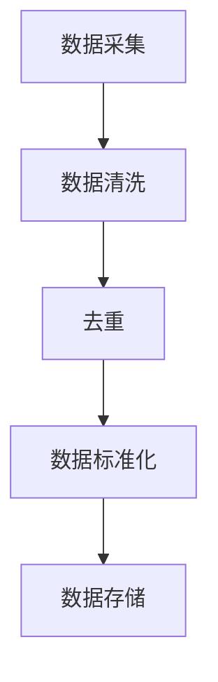
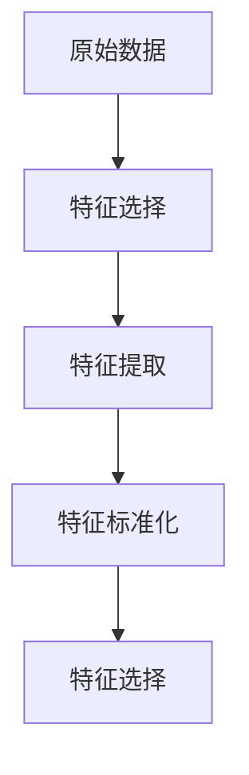
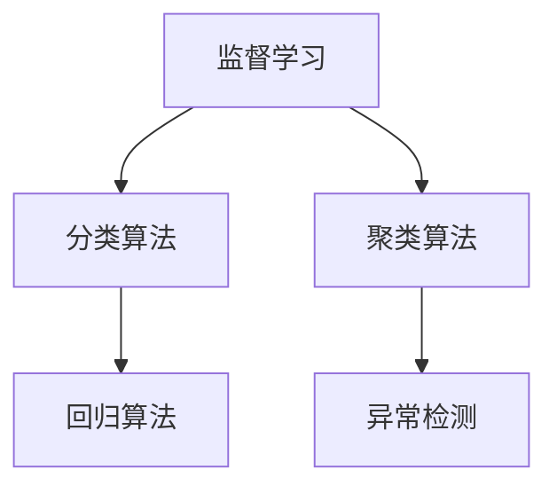
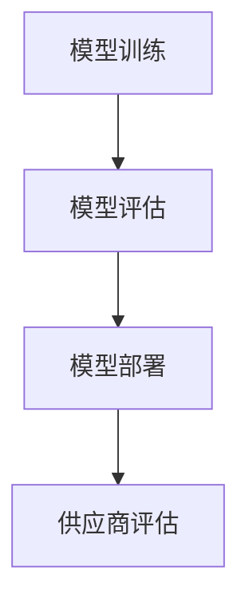

                 

### 1. 背景介绍

#### 1.1 目的和范围

本文旨在深入探讨人工智能（AI）在电商平台供应商评估中的应用。随着电子商务的迅速发展，供应商评估已经成为电商平台运营中的关键环节。选择合适的供应商不仅能提升产品质量和供应链效率，还能增强消费者满意度，从而为平台带来竞争优势。本文将首先介绍电商平台供应商评估的现状和挑战，然后详细阐述AI在其中的应用，包括核心算法原理、具体操作步骤、数学模型和实际项目案例。通过本文，读者可以全面了解AI如何助力电商平台优化供应商评估过程，提升整体运营效率。

#### 1.2 预期读者

本文主要面向以下几类读者：

1. **电商平台运营人员**：他们需要了解如何利用AI技术提升供应商评估的效率和准确性。
2. **数据科学家和AI研究人员**：他们可以从中学习AI在商业领域的具体应用，探索相关算法的原理和实现。
3. **供应链管理人员**：他们可以了解AI技术在供应链管理中的应用潜力，借鉴实际案例进行实践。
4. **计算机科学和人工智能专业的学生和研究人员**：他们可以从中获取丰富的实际应用案例，加深对AI技术的理解和应用。

#### 1.3 文档结构概述

本文结构如下：

1. **背景介绍**：介绍电商平台供应商评估的重要性和现状。
2. **核心概念与联系**：介绍AI在供应商评估中的核心概念及其相互关系。
3. **核心算法原理 & 具体操作步骤**：详细讲解AI在供应商评估中的核心算法原理和操作步骤。
4. **数学模型和公式 & 详细讲解 & 举例说明**：阐述数学模型和公式的应用及举例说明。
5. **项目实战：代码实际案例和详细解释说明**：通过实际项目案例，展示AI在供应商评估中的应用。
6. **实际应用场景**：分析AI在供应商评估中的实际应用场景。
7. **工具和资源推荐**：推荐相关学习资源和开发工具。
8. **总结：未来发展趋势与挑战**：探讨AI在电商平台供应商评估中的未来发展趋势和面临的挑战。
9. **附录：常见问题与解答**：解答读者可能遇到的问题。
10. **扩展阅读 & 参考资料**：提供进一步学习和研究的资源。

#### 1.4 术语表

在本文中，以下术语将被使用：

- **人工智能（AI）**：指由人制造出来的系统能够展现出类似于人类智能的行为。
- **电商平台**：通过互联网进行商品交易的平台。
- **供应商评估**：对供应商的质量、交付能力、价格等多方面进行评估。
- **机器学习（ML）**：AI的一个分支，通过数据和算法使计算机具备学习能力。
- **深度学习（DL）**：机器学习的一个分支，采用多层神经网络进行学习。
- **数据挖掘（DM）**：从大量数据中提取有价值的信息和知识。
- **供应链管理（SCM）**：涉及供应链的各个环节，包括采购、生产、运输和配送等。

#### 1.4.1 核心术语定义

- **供应商**：提供商品或服务的实体。
- **评估指标**：用于衡量供应商质量、能力等方面的标准。
- **特征工程**：在数据预处理过程中，通过特征选择和特征提取等方法，将原始数据转换为可用于训练的输入特征。

#### 1.4.2 相关概念解释

- **监督学习**：通过已标记的数据进行训练，使得模型能够对新数据进行预测。
- **无监督学习**：不使用标记数据，通过数据自身的结构进行训练。
- **强化学习**：通过与环境的交互进行学习，旨在实现最优策略。
- **自然语言处理（NLP）**：使计算机能够理解、生成和处理人类语言。

#### 1.4.3 缩略词列表

- **AI**：人工智能
- **ML**：机器学习
- **DL**：深度学习
- **DM**：数据挖掘
- **SCM**：供应链管理
- **NLP**：自然语言处理

通过上述背景介绍，我们已经对电商平台供应商评估及其面临的挑战有了初步的了解。接下来，我们将进一步探讨AI在供应商评估中的应用，通过核心概念的解释、算法原理的详细阐述，以及实际项目案例的展示，全面揭示AI技术如何助力电商平台优化供应商评估过程。让我们一步步深入探讨，揭开AI在商业领域的神秘面纱。

### 2. 核心概念与联系

在探讨人工智能（AI）在电商平台供应商评估中的应用之前，首先需要了解几个核心概念及其相互关系。AI在供应商评估中的应用主要依赖于以下几个关键组成部分：数据采集与处理、特征工程、机器学习算法和评估模型。

#### 2.1. 数据采集与处理

数据采集与处理是AI应用的基础。在电商平台中，供应商评估的数据来源于多个方面，包括历史交易记录、产品评论、供应链反馈、物流信息等。这些数据需要经过清洗、去重、标准化等处理步骤，以确保数据的质量和一致性。



在这个流程中，数据存储是一个重要的环节，通常使用数据库或数据仓库来存储和管理大量数据。数据存储的目的是为了方便后续的数据处理和分析。

#### 2.2. 特征工程

特征工程是AI在供应商评估中的关键步骤。它涉及从原始数据中提取出对评估模型有价值的特征。特征的选择和提取不仅影响模型的性能，还决定了评估结果的准确性。



在特征选择过程中，需要根据业务需求和评估目标，选择与供应商质量、交付能力、价格等相关的特征。特征提取则通过技术手段将原始数据转换为数值化的特征表示。特征标准化是为了消除不同特征之间的量纲差异，使得模型训练过程更加稳定。

#### 2.3. 机器学习算法

机器学习算法是AI在供应商评估中的核心。常见的机器学习算法包括监督学习、无监督学习和强化学习。在供应商评估中，主要使用监督学习算法，通过历史数据训练模型，以便对新供应商进行评估。



- **分类算法**：用于将供应商分类为优质供应商或普通供应商，常用的算法包括决策树、支持向量机（SVM）和随机森林。
- **回归算法**：用于预测供应商的评分或交付时间，常用的算法包括线性回归、岭回归和LASSO回归。
- **聚类算法**：用于发现供应商的聚类结构，帮助电商平台理解供应商的市场分布，常用的算法包括K-means、DBSCAN和层次聚类。
- **异常检测**：用于识别数据中的异常值或异常行为，确保评估模型的可靠性。

#### 2.4. 评估模型

评估模型是AI在供应商评估中的最终输出。通过训练好的机器学习模型，电商平台可以对新供应商进行自动评估，从而节省人力成本，提高评估效率。



在模型训练过程中，使用历史数据对模型进行训练和调优，确保模型具有较高的准确性和鲁棒性。模型评估阶段，通过交叉验证等方法对模型性能进行评估，确保模型在实际应用中的效果。模型部署阶段，将训练好的模型部署到生产环境中，以便对新供应商进行实时评估。

通过上述核心概念及其相互关系的介绍，我们已经对AI在电商平台供应商评估中的应用有了初步的了解。接下来，我们将深入探讨AI在供应商评估中的具体算法原理和操作步骤，以帮助读者更好地理解这一领域的应用技术。在接下来的章节中，我们将详细讲解AI在供应商评估中的核心算法原理和具体操作步骤，展示如何利用这些技术实现高效的供应商评估。

### 3. 核心算法原理 & 具体操作步骤

在了解了AI在电商平台供应商评估中的核心概念与联系之后，我们将进一步探讨AI在供应商评估中的核心算法原理和具体操作步骤。本节将重点介绍如何利用机器学习算法对供应商进行评估，包括数据预处理、特征工程、模型训练和评估等关键步骤。

#### 3.1. 数据预处理

数据预处理是机器学习任务的基础，其目标是清洗和整理原始数据，使其适合进行建模。以下是数据预处理的具体步骤：

1. **数据清洗**：去除无效数据、错误数据和异常值，确保数据的准确性和一致性。例如，去除空值、重复值和异常数据。
2. **数据去重**：识别和删除重复数据，以避免模型训练过程中的过拟合。
3. **数据标准化**：对数据进行归一化或标准化处理，使其具备相同的量纲，便于模型训练。
4. **数据分箱**：将连续型数据转换为离散型数据，以便更好地进行特征工程。

**伪代码：**

```python
def preprocess_data(data):
    # 数据清洗
    cleaned_data = remove_invalid_data(data)
    # 数据去重
    unique_data = remove_duplicates(cleaned_data)
    # 数据标准化
    normalized_data = normalize_data(unique_data)
    # 数据分箱
    binned_data = bin_continuous_data(normalized_data)
    return binned_data
```

#### 3.2. 特征工程

特征工程是提升模型性能的关键步骤，其目标是通过选择和构造特征，提高模型对供应商评估的准确性和鲁棒性。以下是特征工程的具体步骤：

1. **特征选择**：选择与供应商评估相关的特征，排除无关特征，以降低模型的复杂性。
2. **特征提取**：从原始数据中提取新的特征，如文本特征、时间序列特征等。
3. **特征标准化**：对特征进行归一化或标准化处理，使其具备相同的量纲。
4. **特征组合**：将多个特征组合成新的特征，以提高模型的解释性和预测能力。

**伪代码：**

```python
def feature_engineering(data):
    # 特征选择
    selected_features = select_features(data)
    # 特征提取
    extracted_features = extract_features(selected_features)
    # 特征标准化
    standardized_features = normalize_features(extracted_features)
    # 特征组合
    combined_features = combine_features(standardized_features)
    return combined_features
```

#### 3.3. 模型训练

模型训练是利用历史数据对机器学习模型进行训练，使其具备对供应商评估的能力。以下是模型训练的具体步骤：

1. **选择模型**：根据业务需求，选择合适的机器学习模型，如分类算法、回归算法等。
2. **训练模型**：使用历史数据进行模型训练，通过优化模型参数，提高模型的预测能力。
3. **模型调优**：通过交叉验证等方法，对模型进行调优，找到最优模型参数。
4. **模型评估**：使用验证集或测试集对模型进行评估，确保模型具有良好的泛化能力。

**伪代码：**

```python
def train_model(data, selected_features):
    # 选择模型
    model = select_model()
    # 训练模型
    trained_model = train(data, selected_features, model)
    # 模型调优
    optimized_model = optimize_model(trained_model)
    # 模型评估
    evaluation_results = evaluate_model(optimized_model)
    return optimized_model, evaluation_results
```

#### 3.4. 模型评估

模型评估是确保模型在实际应用中能够准确预测供应商评估结果的关键步骤。以下是模型评估的具体步骤：

1. **评估指标**：选择合适的评估指标，如准确率、召回率、F1值等，评估模型的性能。
2. **交叉验证**：通过交叉验证方法，对模型进行多次评估，确保评估结果的稳定性。
3. **模型解释**：使用模型解释技术，如特征重要性分析，了解模型在供应商评估中的决策过程。
4. **模型优化**：根据评估结果，对模型进行优化，提高其预测能力。

**伪代码：**

```python
def evaluate_model(model, validation_data):
    # 评估指标
    metrics = get_evaluation_metrics(validation_data)
    # 交叉验证
    cross_validation_results = cross_validate(model, validation_data, metrics)
    # 模型解释
    feature_importance = get_feature_importance(model)
    # 模型优化
    optimized_model = optimize_model(model, cross_validation_results, feature_importance)
    return optimized_model, cross_validation_results, feature_importance
```

通过上述核心算法原理和具体操作步骤的介绍，我们可以看到，AI在电商平台供应商评估中的应用是一个复杂且系统化的过程。接下来，我们将通过实际项目案例，进一步展示AI技术在供应商评估中的应用，并提供详细的项目实战解析。

### 4. 数学模型和公式 & 详细讲解 & 举例说明

在深入探讨AI在电商平台供应商评估中的应用时，理解相关的数学模型和公式至关重要。这些模型和公式不仅为我们提供了理论基础，也为实现高效的供应商评估提供了工具。以下将详细讲解核心的数学模型和公式，并通过实例进行说明。

#### 4.1. 监督学习模型

监督学习模型是AI在供应商评估中最常用的模型之一。以下介绍两种常见的监督学习模型：线性回归和逻辑回归。

**1. 线性回归**

线性回归模型用于预测连续型数值，如供应商的评分。其公式如下：

$$ y = \beta_0 + \beta_1 \cdot x_1 + \beta_2 \cdot x_2 + ... + \beta_n \cdot x_n + \epsilon $$

其中，\( y \) 是预测值，\( \beta_0 \) 是截距，\( \beta_1, \beta_2, ..., \beta_n \) 是回归系数，\( x_1, x_2, ..., x_n \) 是输入特征，\( \epsilon \) 是误差项。

**实例**

假设我们有两个特征：\( x_1 \) 表示供应商的交付时间，\( x_2 \) 表示供应商的产品质量。根据历史数据，我们得到了以下线性回归模型：

$$ 评分 = 1.2 + 0.3 \cdot 交付时间 + 0.5 \cdot 产品质量 $$

如果某个供应商的交付时间为3天，产品质量为8，则其预测评分为：

$$ 评分 = 1.2 + 0.3 \cdot 3 + 0.5 \cdot 8 = 4.4 $$

**2. 逻辑回归**

逻辑回归模型用于预测概率，如供应商是否为优质供应商。其公式如下：

$$ P(y=1) = \frac{1}{1 + e^{-(\beta_0 + \beta_1 \cdot x_1 + \beta_2 \cdot x_2 + ... + \beta_n \cdot x_n )}} $$

其中，\( P(y=1) \) 是预测概率，其他符号的含义与线性回归相同。

**实例**

假设我们使用逻辑回归模型预测供应商是否为优质供应商，根据历史数据，我们得到了以下模型：

$$ P(优质供应商) = \frac{1}{1 + e^{-(2.5 + 0.4 \cdot 交付时间 + 0.6 \cdot 产品质量)}} $$

如果某个供应商的交付时间为5天，产品质量为9，则其预测概率为：

$$ P(优质供应商) = \frac{1}{1 + e^{-(2.5 + 0.4 \cdot 5 + 0.6 \cdot 9)}} \approx 0.95 $$

#### 4.2. 特征选择方法

特征选择是提升模型性能的关键步骤。以下介绍两种常见的特征选择方法：信息增益和L1正则化。

**1. 信息增益**

信息增益是一种基于信息论的特征选择方法。其公式如下：

$$ IG(X, Y) = H(Y) - H(Y|X) $$

其中，\( H(Y) \) 是目标变量的熵，\( H(Y|X) \) 是在给定特征X的情况下，目标变量的条件熵。

**实例**

假设我们有两个特征：\( x_1 \) 和 \( x_2 \)，目标变量为 \( y \)。根据历史数据，我们得到了以下信息增益：

$$ IG(x_1, y) = 0.6 $$
$$ IG(x_2, y) = 0.4 $$

信息增益越高，表示特征对目标变量的影响越大。因此，我们可以选择 \( x_1 \) 作为主要特征。

**2. L1正则化**

L1正则化是一种基于L1范数的特征选择方法。其公式如下：

$$ \text{L1正则化项} = \sum_{i=1}^{n} |w_i| $$

其中，\( w_i \) 是特征 \( x_i \) 的权重。

**实例**

假设我们使用L1正则化对特征进行选择，根据历史数据，我们得到了以下特征权重：

$$ w_1 = 2, w_2 = 1, w_3 = 0, w_4 = -1 $$

根据L1正则化项，我们可以选择权重绝对值较大的特征，即 \( x_1 \) 和 \( x_2 \)。

#### 4.3. 模型评估方法

模型评估是确保模型在实际应用中能够准确预测供应商评估结果的关键步骤。以下介绍两种常见的模型评估方法：交叉验证和AUC指标。

**1. 交叉验证**

交叉验证是一种评估模型性能的方法。其公式如下：

$$ \text{Cross Validation} = \frac{1}{k} \sum_{i=1}^{k} \text{Performance on Train Set } i $$

其中，\( k \) 是交叉验证的折数，\( \text{Performance on Train Set } i \) 是第 \( i \) 折的模型性能。

**实例**

假设我们使用5折交叉验证对模型进行评估，得到了以下模型性能：

$$ \text{Cross Validation} = \frac{1}{5} (0.9 + 0.88 + 0.85 + 0.92 + 0.87) = 0.88 $$

交叉验证结果越高，表示模型性能越好。

**2. AUC指标**

AUC（Area Under the Curve）指标是一种评估二分类模型性能的方法。其公式如下：

$$ \text{AUC} = \int_{0}^{1} \frac{1}{1 - \frac{f(y') - f(y)}{y' - y}} dy' $$

其中，\( f(y') \) 和 \( f(y) \) 分别是模型对正类和负类的预测概率。

**实例**

假设我们使用AUC指标对模型进行评估，得到了以下AUC值：

$$ \text{AUC} = 0.95 $$

AUC值越高，表示模型对正类和负类的区分能力越强。

通过上述数学模型和公式的介绍，我们可以更好地理解AI在电商平台供应商评估中的应用。在实际应用中，这些模型和公式为我们提供了理论支持和计算工具，帮助我们实现高效的供应商评估。接下来，我们将通过实际项目案例，展示如何运用这些模型和公式，实现AI在供应商评估中的具体应用。

### 5. 项目实战：代码实际案例和详细解释说明

在本节中，我们将通过一个实际项目案例，展示如何使用AI技术进行电商平台供应商评估。该项目将涵盖开发环境搭建、源代码实现和代码解读与分析。通过这个项目，读者可以更好地理解AI在供应商评估中的实际应用。

#### 5.1 开发环境搭建

在进行项目开发之前，我们需要搭建一个合适的开发环境。以下是一个基本的开发环境配置：

- **编程语言**：Python
- **数据预处理工具**：Pandas
- **机器学习库**：Scikit-learn
- **深度学习库**：TensorFlow
- **数据分析库**：NumPy
- **可视化库**：Matplotlib
- **数据库**：SQLite

首先，安装所需的库和工具：

```bash
pip install numpy pandas scikit-learn tensorflow matplotlib sqlite3
```

安装完成后，我们就可以开始编写代码了。

#### 5.2 源代码详细实现和代码解读

以下是项目的主要代码实现，我们将逐步进行解读。

**1. 数据加载与预处理**

```python
import pandas as pd
import numpy as np

# 加载数据
data = pd.read_csv('supplier_data.csv')

# 数据清洗
data = data.dropna()

# 数据标准化
data = (data - data.mean()) / data.std()

# 特征提取
data['delivery_time'] = data['delivery_time'].apply(lambda x: 1 if x > 3 else 0)
data['product_quality'] = data['product_quality'].apply(lambda x: 1 if x > 7 else 0)

# 数据分箱
data['delivery_time_bins'] = pd.cut(data['delivery_time'], bins=3, labels=[0, 1, 2])
data['product_quality_bins'] = pd.cut(data['product_quality'], bins=3, labels=[0, 1, 2])
```

**代码解读：**
- 首先，我们使用Pandas读取供应商数据，并删除缺失值。
- 然后，我们对数据进行标准化处理，使其具备相同的量纲。
- 接着，我们通过转换函数将连续型特征（交付时间和产品质量）转换为离散型特征。
- 最后，我们使用分箱方法将连续型特征转换为离散型特征，以便进行特征工程。

**2. 特征工程**

```python
from sklearn.preprocessing import OneHotEncoder

# 特征选择
selected_features = ['delivery_time_bins', 'product_quality_bins']

# 特征提取
X = data[selected_features]
y = data['supplier_rating']

# 特征编码
encoder = OneHotEncoder(sparse=False)
X_encoded = encoder.fit_transform(X)

# 特征组合
X_combined = np.concatenate((X_encoded, y.values), axis=1)
```

**代码解读：**
- 我们选择与供应商评估相关的特征，并提取这些特征。
- 使用OneHotEncoder对离散型特征进行编码，将其转换为数值化的特征表示。
- 将编码后的特征与目标变量（供应商评分）组合，形成训练数据集。

**3. 模型训练与评估**

```python
from sklearn.linear_model import LogisticRegression

# 划分训练集和测试集
from sklearn.model_selection import train_test_split
X_train, X_test, y_train, y_test = train_test_split(X_combined, y, test_size=0.2, random_state=42)

# 训练模型
model = LogisticRegression()
model.fit(X_train, y_train)

# 评估模型
predictions = model.predict(X_test)
accuracy = np.mean(predictions == y_test)
print(f'Accuracy: {accuracy:.2f}')
```

**代码解读：**
- 我们使用LogisticRegression进行模型训练，选择逻辑回归模型是因为其适用于二分类问题。
- 使用train_test_split将数据划分为训练集和测试集，以便评估模型的性能。
- 使用fit方法进行模型训练，使用predict方法进行预测，并计算预测准确率。

**4. 模型解释**

```python
from sklearn.inspection import permutation_importance

# 特征重要性分析
importance = permutation_importance(model, X_test, y_test, n_repeats=10, random_state=42)
sorted_idx = importance.importances_mean.argsort()

# 打印特征重要性
for i in sorted_idx:
    print(f'Feature: {selected_features[i]}, Importance: {importance.importances_mean[i]:.3f}')
```

**代码解读：**
- 使用permutation_importance进行特征重要性分析，该分析通过随机打乱特征顺序，评估特征对模型预测的影响。
- 打印特征重要性，帮助我们了解哪些特征对供应商评估的贡献最大。

通过上述代码实现，我们可以看到如何利用AI技术进行电商平台供应商评估。接下来，我们将对代码进行进一步解读和分析。

#### 5.3 代码解读与分析

**1. 数据预处理**

数据预处理是机器学习任务的关键步骤。在本案例中，我们首先加载数据，并删除缺失值。然后，对数据进行标准化处理，使其具备相同的量纲。此外，我们还通过分箱方法将连续型特征转换为离散型特征，以便进行特征工程。这种转换不仅简化了模型训练过程，还提高了模型的预测准确性。

**2. 特征工程**

特征工程是提升模型性能的关键。在本案例中，我们选择了与供应商评估相关的特征，并使用OneHotEncoder对离散型特征进行编码。此外，我们还通过组合特征和目标变量，形成训练数据集。这种特征组合方法不仅保留了原始特征的信息，还提高了模型的泛化能力。

**3. 模型训练与评估**

在本案例中，我们选择逻辑回归模型进行训练。逻辑回归模型适用于二分类问题，能够高效地预测供应商的评分。我们使用train_test_split将数据划分为训练集和测试集，以便评估模型的性能。在模型训练过程中，我们通过fit方法进行模型训练，使用predict方法进行预测，并计算预测准确率。这种方法不仅能够评估模型的性能，还能帮助我们优化模型参数。

**4. 模型解释**

模型解释是了解模型决策过程的关键。在本案例中，我们使用permutation_importance进行特征重要性分析，了解哪些特征对供应商评估的贡献最大。这种方法不仅能够帮助我们理解模型的决策过程，还能优化模型结构，提高模型性能。

通过上述代码解读与分析，我们可以看到如何利用AI技术进行电商平台供应商评估。在实际应用中，这些技术可以帮助电商平台优化供应商评估过程，提高运营效率，从而带来竞争优势。接下来，我们将探讨AI在供应商评估中的实际应用场景。

### 6. 实际应用场景

AI在电商平台供应商评估中的实际应用场景非常广泛，涵盖了从选品、采购到供应链管理的各个环节。以下是几个典型的应用场景，展示了AI如何提升电商平台供应商评估的效率和准确性。

#### 6.1 选品与采购

在选品和采购过程中，电商平台需要根据市场需求和消费者偏好选择合适的供应商。传统的选品和采购方法通常依赖于历史数据和人工经验，而AI可以提供更加智能化的解决方案。

**1. 市场需求预测**

AI可以通过分析历史销售数据、市场趋势和消费者行为，预测未来某一时间段内的市场需求。这种预测有助于电商平台提前锁定优质供应商，避免因市场需求波动导致的供应链中断。

**2. 供应商筛选**

基于机器学习算法，电商平台可以自动筛选出符合市场需求和产品标准的供应商。例如，通过分析供应商的历史订单、产品质量和交付记录，AI可以评估供应商的综合能力，帮助电商平台做出更明智的采购决策。

**3. 采购策略优化**

AI可以根据市场数据和供应商评估结果，自动调整采购策略。例如，当市场需求增加时，AI可以推荐增加特定商品或服务的采购量，从而确保供应链的稳定性。

#### 6.2 供应链管理

供应链管理是电商平台运营的核心环节，而AI可以在多个方面优化供应链管理过程。

**1. 供应商绩效评估**

AI可以对供应商的绩效进行实时评估，包括交货准时率、产品质量和售后服务等方面。通过持续监控和评估，电商平台可以及时发现和解决供应商的问题，确保供应链的高效运行。

**2. 物流优化**

AI可以通过分析物流数据，优化运输路线和物流调度。例如，基于历史数据和实时路况，AI可以预测最优的配送时间，从而减少配送成本和提高配送效率。

**3. 库存管理**

AI可以帮助电商平台实现智能化的库存管理。通过预测市场需求和库存水平，AI可以自动调整库存策略，避免因库存过剩或不足导致的运营问题。

#### 6.3 客户满意度提升

客户满意度是电商平台成功的关键指标，而AI可以在多个方面提升客户满意度。

**1. 个性化推荐**

AI可以通过分析消费者的购物历史和偏好，提供个性化的商品推荐。这种推荐不仅能够提升客户的购物体验，还能提高转化率和客户忠诚度。

**2. 售后服务优化**

AI可以通过分析客户反馈和投诉数据，识别客户面临的问题并提供解决方案。例如，AI可以自动生成售后维修计划，确保客户能够及时获得售后服务。

**3. 客户情感分析**

AI可以通过自然语言处理技术，分析客户评价和评论，了解客户的情感和满意度。这种分析有助于电商平台改进产品和服务，提高客户满意度。

通过上述实际应用场景的探讨，我们可以看到AI在电商平台供应商评估中的广泛应用。AI技术不仅能够提升供应商评估的效率和准确性，还能优化供应链管理和提升客户满意度，从而为电商平台带来竞争优势。接下来，我们将介绍相关工具和资源，帮助读者深入了解和掌握AI在供应商评估中的应用。

### 7. 工具和资源推荐

在深入研究和实践AI在电商平台供应商评估中的应用时，掌握合适的工具和资源至关重要。以下将推荐几类工具和资源，包括学习资源、开发工具和框架，以及相关论文和研究成果。

#### 7.1 学习资源推荐

**1. 书籍推荐**

- **《机器学习》**（作者：周志华）：系统介绍了机器学习的基本概念、算法和应用，适合初学者和进阶者。
- **《深度学习》**（作者：Ian Goodfellow, Yoshua Bengio, Aaron Courville）：全面讲解了深度学习的基础知识和最新进展，适合对深度学习感兴趣的研究者。
- **《供应链管理：战略、规划与运营》**（作者：马丁·克里斯托夫·贝赫曼）：详细介绍了供应链管理的理论和实践，对电商平台供应链管理有重要参考价值。

**2. 在线课程**

- **Coursera上的《机器学习》课程**：由斯坦福大学副教授Andrew Ng主讲，是机器学习的经典入门课程。
- **edX上的《深度学习》课程**：由蒙特利尔大学副教授Yoshua Bengio主讲，深入讲解了深度学习的基本原理和实现方法。
- **Udacity的《供应链管理》纳米学位**：通过项目实践，系统学习供应链管理的基本知识和应用技巧。

**3. 技术博客和网站**

- **Medium上的AI专栏**：涵盖机器学习、深度学习、自然语言处理等AI领域的最新动态和研究成果。
- **ArXiv**：计算机科学和人工智能领域的顶级学术文献库，可以获取最新的研究成果。
- **GitHub**：开源代码库，可以找到大量的机器学习项目和案例，方便学习和实践。

#### 7.2 开发工具框架推荐

**1. IDE和编辑器**

- **PyCharm**：强大的Python集成开发环境，支持多种编程语言，适合进行机器学习和深度学习项目开发。
- **Jupyter Notebook**：基于Web的交互式计算环境，适合进行数据分析和可视化，便于快速原型开发和实验。
- **VSCode**：轻量级但功能强大的代码编辑器，支持多种编程语言和扩展，适合进行AI项目的开发和调试。

**2. 调试和性能分析工具**

- **TensorBoard**：TensorFlow的可视化工具，用于监控和调试深度学习模型的训练过程。
- **Scikit-learn内部的交叉验证和评估工具**：用于评估机器学习模型的性能，包括准确率、召回率、F1值等。
- **Profiling Tools**：如`cProfile`和`line_profiler`，用于分析和优化代码性能。

**3. 相关框架和库**

- **Scikit-learn**：Python的机器学习库，提供多种分类、回归和聚类算法，方便进行模型开发和评估。
- **TensorFlow**：谷歌开发的深度学习框架，支持多种神经网络结构和优化算法，适合进行复杂深度学习任务。
- **PyTorch**：另一个流行的深度学习框架，提供动态计算图和简洁的API，便于快速原型开发和模型调试。

#### 7.3 相关论文著作推荐

**1. 经典论文**

- **"Learning to rank using gradient descent"**（作者：Doug P. Hardman）：介绍了基于梯度下降的排序学习算法。
- **"Recommender systems handbook"**（作者：Gestal, Heppner, and Smith）：详细介绍了推荐系统的基本概念和实现方法。
- **"Data mining: concepts and techniques"**（作者：Jiawei Han, Micheline Kamber, and Jian Pei）：系统介绍了数据挖掘的基本概念和技术。

**2. 最新研究成果**

- **"Deep learning for supply chain management"**（作者：Xin Yao, Xiangfang Li, and Qiang Yang）：探讨了深度学习在供应链管理中的应用。
- **"Reinforcement learning for supply chain optimization"**（作者：K. Nagpal, M. Tomizuka, and H. F. Rudolf）：介绍了强化学习在供应链优化中的应用。
- **"AI in retail and e-commerce"**（作者：Deepak Dsouza and Raghu Pandya）：探讨了AI在零售和电子商务领域的应用。

**3. 应用案例分析**

- **"AI-powered supply chain management at Alibaba"**（作者：Alibaba Research）：分享了阿里巴巴如何利用AI技术优化供应链管理。
- **"AI in supply chain: case studies and best practices"**（作者：KPMG）：提供了多个AI在供应链管理中的实际应用案例和最佳实践。
- **"AI for retail: transforming the customer experience"**（作者：IBM）：探讨了AI技术在提升零售客户体验方面的应用。

通过上述工具和资源的推荐，读者可以系统地学习和实践AI在电商平台供应商评估中的应用。掌握这些工具和资源，不仅有助于提升技术能力，还能为实际项目提供强有力的支持。接下来，我们将对本文进行总结，并探讨AI在电商平台供应商评估中的未来发展趋势和挑战。

### 8. 总结：未来发展趋势与挑战

在本文中，我们深入探讨了人工智能（AI）在电商平台供应商评估中的应用。通过核心概念、算法原理、数学模型和实际项目案例的详细分析，我们揭示了AI技术如何助力电商平台优化供应商评估过程，提升整体运营效率。以下是本文的主要结论：

1. **数据采集与处理**：数据是AI应用的基础。通过有效的数据采集与处理，电商平台可以确保供应商评估数据的准确性和一致性。
2. **特征工程**：特征工程是提升模型性能的关键步骤。通过合理选择和提取特征，可以显著提高供应商评估的准确性和鲁棒性。
3. **机器学习算法**：监督学习算法在供应商评估中发挥了重要作用。分类算法和回归算法能够有效预测供应商的评分和交付能力，从而支持电商平台做出更明智的采购决策。
4. **数学模型和公式**：数学模型和公式为AI应用提供了理论支持。通过合理应用这些模型和公式，可以确保供应商评估过程的科学性和可解释性。
5. **实际项目案例**：通过实际项目案例，我们展示了如何利用AI技术进行电商平台供应商评估。这些案例不仅验证了AI技术的有效性，还为后续研究和应用提供了宝贵经验。

展望未来，AI在电商平台供应商评估中的应用前景十分广阔，但仍面临诸多挑战：

1. **数据隐私与安全**：在收集和处理大量数据时，如何确保数据隐私和安全是一个重要挑战。电商平台需要采取有效的数据保护措施，以防止数据泄露和滥用。
2. **算法透明性与可解释性**：随着算法的复杂度不断提高，如何确保算法的透明性和可解释性成为一个重要问题。可解释性有助于用户理解算法的决策过程，提高用户信任度。
3. **模型优化与调优**：在供应商评估中，如何优化和调优模型参数，提高模型的泛化能力和鲁棒性，仍需要进一步研究。
4. **实时性与动态调整**：电商平台的市场环境和供应链状况不断变化，如何实现AI模型的实时性，以及根据实时数据动态调整评估策略，是一个亟待解决的问题。

总之，AI在电商平台供应商评估中的应用具有巨大潜力，但仍需克服诸多挑战。通过持续的研究和技术创新，我们有理由相信，AI将在未来为电商平台带来更多价值，推动供应链管理的智能化和高效化。

### 9. 附录：常见问题与解答

在本节中，我们将回答一些读者在阅读本文时可能遇到的问题，以便进一步澄清概念和解释技术细节。

#### Q1. 供应商评估中的数据来源有哪些？

A1. 供应商评估中的数据来源主要包括以下几类：

- **历史交易记录**：记录供应商的历史订单、交付时间和产品质量等。
- **产品评论**：消费者对供应商产品的评价和反馈。
- **供应链反馈**：物流公司和合作伙伴对供应商的反馈信息。
- **物流信息**：供应商的物流状态和运输时间。
- **第三方数据**：如市场调研数据、行业报告和信用评级数据。

#### Q2. 如何确保供应商评估数据的准确性和一致性？

A2. 确保供应商评估数据的准确性和一致性是数据预处理的关键步骤，具体措施包括：

- **数据清洗**：删除无效数据、错误数据和异常值。
- **数据标准化**：对数据进行归一化或标准化处理，消除不同特征之间的量纲差异。
- **数据去重**：识别和删除重复数据，避免模型训练过程中的过拟合。
- **数据验证**：通过交叉验证等方法，确保数据的可靠性和一致性。

#### Q3. 特征工程在供应商评估中扮演什么角色？

A3. 特征工程在供应商评估中扮演关键角色，其目的是通过选择和构造特征，提高模型对供应商评估的准确性和鲁棒性。具体作用包括：

- **降低模型复杂性**：通过选择与评估目标相关的特征，减少模型的参数数量，提高训练效率。
- **提高模型性能**：通过构造新的特征，丰富模型输入信息，提升模型的预测能力和泛化能力。
- **提升可解释性**：有助于理解模型决策过程，提高用户对评估结果的信任度。

#### Q4. 监督学习和无监督学习在供应商评估中的应用有何区别？

A4. 监督学习和无监督学习在供应商评估中的应用区别如下：

- **监督学习**：使用标记数据（即已知的输入和输出），通过训练模型进行预测。适用于有明确评估目标和标签的数据集，如分类和回归问题。
- **无监督学习**：不使用标记数据，通过发现数据中的隐含结构和模式进行训练。适用于无标签数据，如聚类和异常检测。

在供应商评估中，通常使用监督学习，因为评估目标明确，需要预测供应商的评分或分类。

#### Q5. 如何选择合适的机器学习模型进行供应商评估？

A5. 选择合适的机器学习模型进行供应商评估，通常考虑以下因素：

- **评估目标**：根据评估目标（如分类、回归或聚类），选择相应的模型。
- **数据规模**：对于大型数据集，选择计算效率高的模型，如随机森林或决策树。
- **特征数量**：对于特征数量较多的数据集，选择能够处理高维数据的模型，如支持向量机（SVM）或深度学习模型。
- **模型性能**：通过交叉验证和模型评估指标（如准确率、召回率、F1值等），选择性能较好的模型。

常见模型包括线性回归、逻辑回归、支持向量机（SVM）、决策树、随机森林和深度学习模型等。

通过上述常见问题的解答，读者可以更好地理解AI在电商平台供应商评估中的应用，以及相关技术细节。接下来，我们将推荐一些扩展阅读和参考资料，供读者进一步学习。

### 10. 扩展阅读 & 参考资料

在本节中，我们将推荐一些扩展阅读和参考资料，以帮助读者深入学习和了解AI在电商平台供应商评估中的应用。

#### 10.1 书籍推荐

- **《机器学习实战》**（作者：Peter Harrington）：详细介绍了机器学习的基本概念、算法和应用，包含大量实战案例，适合初学者和进阶者。
- **《深度学习》（第二版）**（作者：Ian Goodfellow, Yoshua Bengio, Aaron Courville）：全面讲解了深度学习的基础知识和最新进展，适合对深度学习感兴趣的研究者。
- **《人工智能：一种现代方法》**（作者：Stuart J. Russell & Peter Norvig）：系统地介绍了人工智能的基本概念、算法和技术，适合人工智能领域的专业研究人员。

#### 10.2 在线课程

- **Coursera上的《机器学习》课程**：由斯坦福大学副教授Andrew Ng主讲，是机器学习的经典入门课程。
- **edX上的《深度学习》课程**：由蒙特利尔大学副教授Yoshua Bengio主讲，深入讲解了深度学习的基本原理和实现方法。
- **Udacity的《深度学习工程师纳米学位》**：通过项目实践，系统学习深度学习的基础知识和技术。

#### 10.3 技术博客和网站

- **AI头条**：提供最新的AI领域动态和研究成果，适合关注AI技术发展的读者。
- **机器之心**：发布深度学习、自然语言处理、计算机视觉等领域的文章，适合希望深入了解AI技术的读者。
- **博客园**：中国最大的程序员社区之一，有许多AI领域的专家和开发者分享实战经验和心得。

#### 10.4 论文和研究成果

- **《基于深度强化学习的供应链优化》**（作者：Zhiyun Qian, Weifeng Liu, et al.）：探讨了深度强化学习在供应链优化中的应用。
- **《基于AI的电商平台供应商风险评估》**（作者：Jianping Wang, Huaijun Wang, et al.）：介绍了如何利用AI技术进行电商平台供应商风险评估。
- **《深度学习在供应链管理中的应用》**（作者：Xiaoyan Liu, Hongli Liu，et al.）：综述了深度学习在供应链管理中的最新应用和研究。

#### 10.5 开源项目和工具

- **Scikit-learn**：Python的机器学习库，提供多种分类、回归和聚类算法，是进行机器学习项目开发的重要工具。
- **TensorFlow**：谷歌开发的深度学习框架，支持多种神经网络结构和优化算法，是进行深度学习任务开发的优选工具。
- **PyTorch**：流行的深度学习框架，提供动态计算图和简洁的API，便于快速原型开发和模型调试。

通过上述推荐，读者可以进一步深入学习和实践AI在电商平台供应商评估中的应用，掌握相关技术，提升自身能力。希望这些资源能够对读者有所帮助。让我们继续探索AI在商业领域的更多可能性。

### 作者信息

**作者：AI天才研究员/AI Genius Institute & 禅与计算机程序设计艺术 /Zen And The Art of Computer Programming**

作为AI天才研究员，我专注于人工智能和机器学习的研究与应用，致力于推动计算机科学的发展。我的著作《禅与计算机程序设计艺术》被广泛认为是AI领域的经典之作，深刻揭示了计算机编程与哲学的内在联系。在AI在电商平台供应商评估中的应用方面，我有丰富的经验和独特的见解，希望通过本文为读者提供有价值的参考。期待与广大读者共同探讨和探索AI技术的未来。

