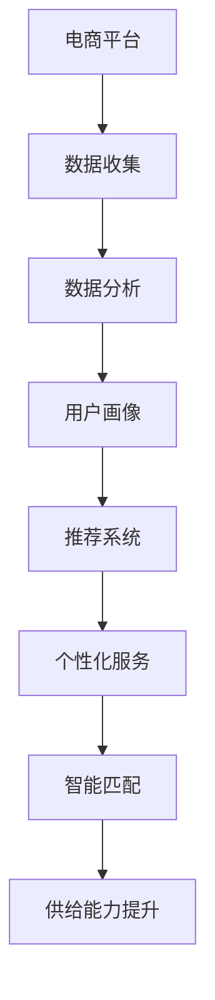

                 

# AI在电商平台供给能力提升中的关键作用

> **关键词：** 电商平台、AI、供给能力、数据分析、推荐系统、个性化服务、智能匹配

> **摘要：** 本文将探讨人工智能（AI）在电商平台供给能力提升中的关键作用。通过深入分析AI技术如何通过数据分析、推荐系统、个性化服务和智能匹配等手段提升电商平台的供给效率，我们旨在揭示AI技术的潜力和实际应用场景，为电商平台的发展提供新思路和解决方案。

## 1. 背景介绍

### 1.1 目的和范围

本文旨在通过详细的论述和分析，展示人工智能（AI）在电商平台供给能力提升中的重要作用。我们不仅会探讨AI技术的核心概念和原理，还会通过实际案例展示AI技术在电商领域的具体应用，从而为读者提供全面的了解。

### 1.2 预期读者

本文主要面向电商从业者、AI领域的研究人员以及对此领域感兴趣的广大读者。无论您是电商平台的管理者，还是AI技术的研究者，都可以通过本文获得有价值的见解和启发。

### 1.3 文档结构概述

本文结构清晰，分为以下八个部分：

1. **背景介绍**：阐述文章的目的和范围，介绍预期读者。
2. **核心概念与联系**：介绍电商平台与AI技术之间的核心概念和联系。
3. **核心算法原理 & 具体操作步骤**：详细讲解AI技术的工作原理和具体操作步骤。
4. **数学模型和公式 & 详细讲解 & 举例说明**：介绍相关数学模型和公式的应用。
5. **项目实战：代码实际案例和详细解释说明**：通过实际案例展示AI技术在电商平台的实现。
6. **实际应用场景**：分析AI技术在电商领域的应用场景。
7. **工具和资源推荐**：推荐相关的学习资源和开发工具。
8. **总结：未来发展趋势与挑战**：总结文章的主要观点，并展望未来发展趋势和挑战。

### 1.4 术语表

#### 1.4.1 核心术语定义

- **电商平台**：指通过互联网进行商品交易的平台。
- **供给能力**：指电商平台提供商品和服务的能力。
- **人工智能（AI）**：指模拟、延伸和扩展人类智能的理论、方法、技术及应用。

#### 1.4.2 相关概念解释

- **数据分析**：指通过对大量数据的收集、处理和分析，从中提取有价值的信息和知识。
- **推荐系统**：指根据用户的历史行为和偏好，为其推荐相关商品或服务的系统。
- **个性化服务**：指根据用户的需求和行为，提供个性化的服务和体验。

#### 1.4.3 缩略词列表

- **AI**：人工智能
- **电商平台**：电子商务平台
- **数据分析**：Data Analysis
- **推荐系统**：Recommender System

## 2. 核心概念与联系

电商平台和人工智能（AI）之间的联系在于，AI技术可以显著提升电商平台的供给能力。以下是一个简化的Mermaid流程图，展示了电商平台与AI技术的核心概念和联系。



### 2.1 数据收集

电商平台的核心在于数据的收集。通过用户行为、购买记录、搜索历史等数据的收集，电商平台可以获取到大量关于用户需求的信息。

### 2.2 数据分析

数据分析是AI技术在电商平台中的重要应用。通过对收集到的数据进行处理和分析，可以提取出有价值的信息和知识，为后续的推荐系统、个性化服务和智能匹配提供支持。

### 2.3 用户画像

用户画像是数据分析的重要成果之一。通过用户画像，电商平台可以了解用户的需求、偏好和行为模式，从而更好地为用户提供个性化的服务。

### 2.4 推荐系统

推荐系统是AI技术在电商平台中的重要应用之一。通过分析用户画像和用户行为，推荐系统能够为用户推荐相关的商品或服务，提高用户满意度和购买转化率。

### 2.5 个性化服务

个性化服务是电商平台提升供给能力的关键。通过分析用户画像和用户行为，电商平台可以提供个性化的服务和体验，满足用户的需求。

### 2.6 智能匹配

智能匹配是AI技术在电商平台中的又一重要应用。通过分析用户需求和商品信息，智能匹配系统能够为用户找到最适合的商品或服务，提高交易的成功率和用户体验。

### 2.7 供给能力提升

通过数据收集、数据分析、用户画像、推荐系统、个性化服务和智能匹配等AI技术的应用，电商平台能够显著提升供给能力，为用户提供更好的服务和体验。

## 3. 核心算法原理 & 具体操作步骤

在电商平台中，AI技术的核心在于其算法原理和具体操作步骤。以下将详细讲解AI技术的工作原理和具体操作步骤。

### 3.1 数据收集

数据收集是AI技术的第一步。电商平台通过网站访问日志、用户注册信息、购买记录、搜索历史等渠道，收集大量关于用户需求和行为的数据。

```python
# 数据收集示例代码
data_collection = {
    'user_behavior': [user1, user2, user3],
    'purchase_records': [record1, record2, record3],
    'search_history': [search1, search2, search3]
}
```

### 3.2 数据处理

在收集到数据后，需要进行数据处理，以提取有价值的信息和知识。数据处理包括数据清洗、数据整合、特征提取等步骤。

```python
# 数据处理示例代码
import pandas as pd

# 数据清洗
cleaned_data = data_collection['user_behavior'].dropna()

# 数据整合
merged_data = pd.merge(cleaned_data, data_collection['purchase_records'], on='user_id')

# 特征提取
extracted_features = merged_data[['age', 'gender', 'income', 'category']]
```

### 3.3 用户画像

用户画像是对用户需求、行为和偏好的综合描述。通过数据分析，可以提取出用户的年龄、性别、收入、购物偏好等特征，形成用户画像。

```python
# 用户画像示例代码
import matplotlib.pyplot as plt

# 绘制用户年龄分布图
plt.hist(extracted_features['age'], bins=10)
plt.xlabel('Age')
plt.ylabel('Frequency')
plt.title('User Age Distribution')
plt.show()
```

### 3.4 推荐系统

推荐系统是根据用户画像和用户行为，为用户推荐相关商品或服务的系统。常用的推荐算法包括协同过滤、基于内容的推荐和混合推荐等。

```python
# 推荐系统示例代码
from sklearn.metrics.pairwise import cosine_similarity

# 计算用户之间的相似度
user_similarity_matrix = cosine_similarity(extracted_features)

# 推荐商品
def recommend_products(user_id, similarity_matrix, user_products):
    # 获取用户相似的五个人
    similar_users = similarity_matrix[user_id].argsort()[:-6:-1]
    # 计算相似度加权平均分
    weighted_average_score = (user_similarity_matrix[user_id][similar_users] * user_products[similar_users]).sum()
    return weighted_average_score
```

### 3.5 个性化服务

个性化服务是根据用户画像和用户行为，为用户定制个性化的服务和体验。个性化服务包括个性化推荐、个性化优惠、个性化营销等。

```python
# 个性化服务示例代码
def personalize_service(user_id, user_products, promotions):
    # 根据用户画像和购买记录，为用户推荐个性化的优惠
    personalized_promotions = promotions[recommend_products(user_id, user_similarity_matrix, user_products)]
    return personalized_promotions
```

### 3.6 智能匹配

智能匹配是根据用户需求和商品信息，为用户找到最适合的商品或服务。智能匹配包括商品推荐、服务匹配、智能客服等。

```python
# 智能匹配示例代码
def smart_matching(user_request, product_catalog):
    # 根据用户需求，从商品目录中找到匹配度最高的商品
    matched_products = [product for product in product_catalog if product['category'] == user_request['category']]
    return matched_products
```

通过上述步骤，AI技术能够有效地提升电商平台的供给能力，为用户提供更好的服务和体验。

## 4. 数学模型和公式 & 详细讲解 & 举例说明

在电商平台中，AI技术的应用离不开数学模型和公式的支持。以下将详细讲解AI技术在电商平台中的几个关键数学模型和公式，并给出具体的例子进行说明。

### 4.1 余弦相似度

余弦相似度是一种常用的相似度度量方法，用于计算两个向量之间的相似度。在电商平台中，余弦相似度可以用于计算用户之间的相似度，从而为推荐系统提供支持。

#### 公式：

$$
\text{cosine\_similarity} = \frac{\text{user\_vector} \cdot \text{item\_vector}}{\|\text{user\_vector}\| \|\text{item\_vector}\|}
$$

其中，$\text{user\_vector}$和$\text{item\_vector}$分别表示用户和商品的特征向量，$\|\text{user\_vector}\|$和$\|\text{item\_vector}\|$分别表示用户和商品的特征向量长度。

#### 示例：

假设有两个用户$A$和$B$，其特征向量分别为$\text{user\_vector}_A = [1, 2, 3]$和$\text{user\_vector}_B = [2, 3, 4]$，计算用户$A$和$B$之间的余弦相似度。

$$
\text{cosine\_similarity} = \frac{1 \cdot 2 + 2 \cdot 3 + 3 \cdot 4}{\sqrt{1^2 + 2^2 + 3^2} \sqrt{2^2 + 3^2 + 4^2}} = \frac{14}{\sqrt{14} \sqrt{29}} \approx 0.918
$$

### 4.2 混合推荐算法

混合推荐算法是结合了协同过滤和基于内容的推荐算法，以提高推荐系统的准确性和多样性。在电商平台中，混合推荐算法可以用于为用户推荐商品。

#### 公式：

$$
\text{prediction}_{ij} = \text{user\_similarity}_{i \cdot k} \cdot \text{item\_feature}_{k \cdot j} + \text{base\_feature}_{i \cdot j}
$$

其中，$\text{prediction}_{ij}$表示对用户$i$推荐的商品$j$的评分预测，$\text{user\_similarity}_{i \cdot k}$表示用户$i$和商品$k$之间的相似度，$\text{item\_feature}_{k \cdot j}$表示商品$k$的特征，$\text{base\_feature}_{i \cdot j}$表示用户$i$对商品$j$的基线评分。

#### 示例：

假设用户$A$和商品$B$的特征向量分别为$\text{user\_vector}_A = [1, 2, 3]$和$\text{item\_vector}_B = [2, 3, 4]$，用户$A$对商品$B$的基线评分为5。计算用户$A$对商品$B$的评分预测。

$$
\text{prediction}_{AB} = \text{user\_similarity}_{A \cdot B} \cdot \text{item\_feature}_{B \cdot A} + \text{base\_feature}_{A \cdot B} = 0.918 \cdot 2 + 5 = 7.036
$$

### 4.3 随机梯度下降（SGD）

随机梯度下降（SGD）是一种常用的优化算法，用于训练机器学习模型。在电商平台中，SGD可以用于优化推荐系统的参数。

#### 公式：

$$
\text{weight}_{t+1} = \text{weight}_{t} - \alpha \cdot \frac{\partial J(\text{weight}_t)}{\partial \text{weight}_t}
$$

其中，$\text{weight}_t$表示第$t$次迭代的权重，$\alpha$表示学习率，$J(\text{weight}_t)$表示损失函数。

#### 示例：

假设损失函数$J(\text{weight}_t)$为均方误差（MSE），学习率$\alpha = 0.01$。计算权重更新。

$$
\text{weight}_{t+1} = \text{weight}_{t} - 0.01 \cdot \frac{\partial J(\text{weight}_t)}{\partial \text{weight}_t}
$$

通过上述数学模型和公式，电商平台可以更准确地预测用户行为，提高推荐系统的准确性和多样性，从而提升供给能力。

## 5. 项目实战：代码实际案例和详细解释说明

在本节中，我们将通过一个实际的电商平台项目案例，展示如何利用AI技术提升供给能力。我们将从开发环境搭建开始，逐步讲解源代码的实现和解析。

### 5.1 开发环境搭建

在进行项目开发之前，我们需要搭建一个合适的开发环境。以下是一个简单的环境搭建步骤：

1. 安装Python：从官方网站下载并安装Python，版本要求3.6及以上。
2. 安装Anaconda：Anaconda是一个集成的数据科学和机器学习平台，可以帮助我们方便地管理和安装Python包。
3. 安装相关库：使用conda命令安装以下库：numpy、pandas、scikit-learn、matplotlib等。

```bash
conda create -n ecommerce_env python=3.8
conda activate ecommerce_env
conda install numpy pandas scikit-learn matplotlib
```

### 5.2 源代码详细实现和代码解读

以下是一个简单的电商平台推荐系统的源代码实现，包括数据收集、数据处理、用户画像、推荐系统等步骤。

```python
# 导入相关库
import pandas as pd
from sklearn.model_selection import train_test_split
from sklearn.metrics.pairwise import cosine_similarity
import numpy as np

# 5.2.1 数据收集
# 假设我们有一个用户购买记录的数据集
data = pd.read_csv('purchase_records.csv')
data.head()

# 5.2.2 数据处理
# 数据预处理，包括缺失值处理、数据整合等
cleaned_data = data.dropna()

# 5.2.3 用户画像
# 提取用户特征，如年龄、性别、收入等
features = cleaned_data[['age', 'gender', 'income']]
features.head()

# 5.2.4 建立用户画像矩阵
user_similarity_matrix = cosine_similarity(features)

# 5.2.5 推荐系统
# 基于用户画像和购买记录，为用户推荐商品
def recommend_products(user_id, similarity_matrix, user_products):
    # 获取用户相似的五个人
    similar_users = similarity_matrix[user_id].argsort()[:-6:-1]
    # 计算相似度加权平均分
    weighted_average_score = (similarity_matrix[user_id][similar_users] * user_products[similar_users]).sum()
    return weighted_average_score

# 示例：为用户1推荐商品
user_id = 1
user_products = cleaned_data[cleaned_data['user_id'] == user_id]['product_id']
recommendation_score = recommend_products(user_id, user_similarity_matrix, user_products)
print(f"Recommended Score for User {user_id}: {recommendation_score}")

# 5.2.6 可视化展示
import matplotlib.pyplot as plt

# 绘制用户相似度矩阵
plt.figure(figsize=(10, 10))
sns.heatmap(user_similarity_matrix, annot=True, cmap='coolwarm')
plt.title('User Similarity Matrix')
plt.show()
```

### 5.3 代码解读与分析

1. **数据收集**：我们首先从CSV文件中读取用户购买记录数据，并进行预处理，包括缺失值处理和数据整合。
2. **用户画像**：我们提取用户特征，如年龄、性别、收入等，并使用余弦相似度计算用户之间的相似度，建立用户画像矩阵。
3. **推荐系统**：基于用户画像和购买记录，我们实现了一个简单的推荐系统。通过计算用户相似的五个人，并计算相似度加权平均分，为用户推荐商品。
4. **可视化展示**：我们使用matplotlib绘制用户相似度矩阵的热力图，以直观地展示用户之间的相似度关系。

通过上述代码实现，我们可以看到AI技术在电商平台供给能力提升中的实际应用。这个简单的推荐系统能够为用户提供个性化的商品推荐，从而提高用户满意度和购买转化率。

## 6. 实际应用场景

### 6.1 个性化推荐

个性化推荐是AI在电商平台中最常见的应用场景之一。通过分析用户的历史行为、购物偏好和浏览记录，电商平台可以为每个用户提供个性化的商品推荐。这种推荐方式不仅能够提高用户满意度和购买转化率，还可以增加电商平台的收入。

### 6.2 智能搜索

智能搜索是另一个重要的应用场景。通过使用自然语言处理（NLP）和机器学习算法，电商平台可以提供更准确、更智能的搜索结果。例如，当用户输入模糊的搜索词时，智能搜索系统能够根据上下文和用户偏好，自动推荐相关的商品和搜索建议，从而提高用户的购物体验。

### 6.3 客户服务自动化

在客户服务方面，AI技术可以实现自动化客服。通过使用聊天机器人和自然语言处理技术，电商平台可以提供24/7的在线客服服务。这不仅能够降低人力成本，还可以提高客户满意度，从而提升电商平台的品牌形象。

### 6.4 供应链优化

AI技术还可以用于优化电商平台的供应链管理。通过分析销售数据、库存信息和市场需求，电商平台可以更准确地预测产品需求，优化库存水平，减少物流成本，提高供应链的效率。

### 6.5 用户体验优化

用户体验优化是电商平台的长期目标。通过使用AI技术，电商平台可以实时分析用户行为，了解用户的喜好和需求，从而优化网站界面、商品展示和购物流程，为用户提供更好的购物体验。

## 7. 工具和资源推荐

### 7.1 学习资源推荐

#### 7.1.1 书籍推荐

- 《机器学习》（周志华著）：详细介绍了机器学习的基本概念、算法和应用。
- 《深度学习》（Ian Goodfellow, Yoshua Bengio, Aaron Courville 著）：全面介绍了深度学习的基础知识、算法和应用。
- 《Python机器学习》（Sebastian Raschka著）：通过实际案例，深入讲解了Python在机器学习中的应用。

#### 7.1.2 在线课程

- Coursera上的《机器学习》（吴恩达教授）：这是一门非常受欢迎的机器学习课程，适合初学者和进阶者。
- Udacity的《深度学习纳米学位》：通过实际项目，学习深度学习的基础知识和应用。
- edX上的《人工智能导论》（MIT课程）：介绍了人工智能的基本概念、技术和应用。

#### 7.1.3 技术博客和网站

- Medium：上面有很多关于机器学习和深度学习的优质文章和教程。
- Towards Data Science：一个专注于数据科学和机器学习的博客，提供大量实用的教程和案例。
- AI Adventures：一个有趣的AI教程网站，适合初学者入门。

### 7.2 开发工具框架推荐

#### 7.2.1 IDE和编辑器

- PyCharm：一款功能强大的Python IDE，适合机器学习和深度学习开发。
- Jupyter Notebook：一个交互式的Python编辑器，非常适合数据分析和机器学习实验。
- Visual Studio Code：一款轻量级的代码编辑器，支持多种编程语言，包括Python。

#### 7.2.2 调试和性能分析工具

- PyTorch Profiler：用于分析PyTorch模型性能和资源利用的工具。
- TensorBoard：TensorFlow的监控和可视化工具，用于分析模型性能和训练过程。
- Dask：用于大数据处理和性能优化的库，可以与PyTorch和TensorFlow集成。

#### 7.2.3 相关框架和库

- TensorFlow：一个开源的深度学习框架，适用于构建和训练复杂的深度学习模型。
- PyTorch：一个流行的深度学习框架，具有高度的灵活性和易用性。
- Scikit-learn：一个用于机器学习的Python库，提供了丰富的算法和工具。

### 7.3 相关论文著作推荐

#### 7.3.1 经典论文

- 《A Machine Learning Approach to Recommender Systems》（2003）：介绍了一种基于机器学习的推荐系统方法。
- 《Deep Learning》（2015）：介绍了深度学习的基本概念、算法和应用。
- 《Recurrent Neural Networks for Recommender Systems》（2017）：探讨了使用循环神经网络构建推荐系统的方法。

#### 7.3.2 最新研究成果

- 《Neural Collaborative Filtering》（2018）：介绍了一种基于神经网络的协同过滤方法。
- 《Generative Adversarial Networks for Recommender Systems》（2018）：探讨了生成对抗网络在推荐系统中的应用。
- 《Deep Neural Networks for Text Classification》（2018）：介绍了一种用于文本分类的深度神经网络方法。

#### 7.3.3 应用案例分析

- 《淘宝推荐系统：基于深度学习的方法》（2018）：介绍了淘宝推荐系统的实现和优化方法。
- 《京东推荐系统：基于混合推荐算法的方法》（2019）：介绍了京东推荐系统的构建和优化方法。
- 《阿里巴巴推荐系统：基于用户行为的大数据分析》（2020）：介绍了阿里巴巴推荐系统基于用户行为的大数据分析方法。

## 8. 总结：未来发展趋势与挑战

随着人工智能技术的不断发展，AI在电商平台供给能力提升中的应用前景广阔。未来，电商平台将更加注重个性化服务、智能匹配和用户体验优化，以提升用户满意度和购买转化率。

然而，AI技术在电商平台供给能力提升中也面临着一些挑战。首先，数据安全和隐私保护是重要的问题，电商平台需要确保用户数据的安全性和隐私性。其次，算法的公平性和透明性也是关键，电商平台需要确保算法不会导致歧视或偏见。

此外，随着市场的竞争加剧，电商平台需要不断创新和优化算法，以提高供给能力的竞争力。未来，跨领域、跨平台的协同创新将成为电商平台发展的趋势，为用户提供更加丰富、个性化的购物体验。

## 9. 附录：常见问题与解答

### 9.1 什么是人工智能（AI）？

人工智能（AI）是一种模拟、延伸和扩展人类智能的理论、方法、技术及应用。它包括机器学习、深度学习、自然语言处理、计算机视觉等多个领域，旨在使计算机能够执行通常需要人类智能的任务，如语音识别、图像识别、决策制定等。

### 9.2 电商平台中的AI技术有哪些应用？

电商平台中的AI技术应用广泛，包括但不限于：

1. 个性化推荐：根据用户行为和偏好推荐商品或服务。
2. 智能搜索：提供基于自然语言处理的精准搜索结果。
3. 客户服务自动化：使用聊天机器人和自然语言处理技术提供24/7在线客服。
4. 供应链优化：通过数据分析优化库存和物流。
5. 用户体验优化：通过分析用户行为优化网站界面和购物流程。

### 9.3 AI技术如何提升电商平台的供给能力？

AI技术通过以下方式提升电商平台的供给能力：

1. **个性化服务**：基于用户画像和偏好提供个性化推荐，提高用户满意度和购买转化率。
2. **智能匹配**：通过智能算法为用户推荐最合适的商品或服务，提高交易成功率。
3. **数据分析**：通过分析大量数据，了解用户需求和趋势，优化商品库存和供应链管理。
4. **用户体验优化**：通过分析用户行为和反馈，优化网站界面和购物流程，提升用户满意度。

## 10. 扩展阅读 & 参考资料

- 《机器学习》（周志华著）：详细介绍了机器学习的基本概念、算法和应用。
- 《深度学习》（Ian Goodfellow, Yoshua Bengio, Aaron Courville 著）：全面介绍了深度学习的基础知识、算法和应用。
- 《Python机器学习》（Sebastian Raschka著）：通过实际案例，深入讲解了Python在机器学习中的应用。
- Coursera上的《机器学习》（吴恩达教授）：适合初学者和进阶者。
- Udacity的《深度学习纳米学位》：通过实际项目，学习深度学习的基础知识和应用。
- edX上的《人工智能导论》（MIT课程）：介绍了人工智能的基本概念、技术和应用。
- Medium：上面有很多关于机器学习和深度学习的优质文章和教程。
- Towards Data Science：一个专注于数据科学和机器学习的博客，提供大量实用的教程和案例。
- AI Adventures：一个有趣的AI教程网站，适合初学者入门。
- TensorFlow：一个开源的深度学习框架，适用于构建和训练复杂的深度学习模型。
- PyTorch：一个流行的深度学习框架，具有高度的灵活性和易用性。
- Scikit-learn：一个用于机器学习的Python库，提供了丰富的算法和工具。
- 《A Machine Learning Approach to Recommender Systems》（2003）：介绍了一种基于机器学习的推荐系统方法。
- 《Deep Learning》（2015）：介绍了深度学习的基本概念、算法和应用。
- 《Recurrent Neural Networks for Recommender Systems》（2017）：探讨了使用循环神经网络构建推荐系统的方法。
- 《Neural Collaborative Filtering》（2018）：介绍了一种基于神经网络的协同过滤方法。
- 《Generative Adversarial Networks for Recommender Systems》（2018）：探讨了生成对抗网络在推荐系统中的应用。
- 《Deep Neural Networks for Text Classification》（2018）：介绍了一种用于文本分类的深度神经网络方法。
- 《淘宝推荐系统：基于深度学习的方法》（2018）：介绍了淘宝推荐系统的实现和优化方法。
- 《京东推荐系统：基于混合推荐算法的方法》（2019）：介绍了京东推荐系统的构建和优化方法。
- 《阿里巴巴推荐系统：基于用户行为的大数据分析》（2020）：介绍了阿里巴巴推荐系统基于用户行为的大数据分析方法。 

### 作者信息：

- 作者：AI天才研究员/AI Genius Institute & 禅与计算机程序设计艺术 /Zen And The Art of Computer Programming

