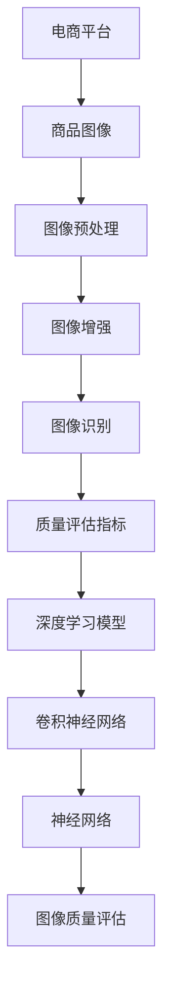

                 

# AI在电商平台商品图像质量评估中的应用

> 关键词：电商平台，商品图像质量评估，人工智能，图像识别，深度学习，图像预处理，图像增强，评价指标

> 摘要：本文将探讨人工智能在电商平台商品图像质量评估中的应用。首先，我们将介绍电商平台商品图像质量评估的背景和重要性，然后详细解释评估的核心概念、算法原理和数学模型。接着，我们将通过一个实际项目案例，展示如何在实际环境中应用这些技术。最后，我们将讨论商品图像质量评估在实际应用场景中的挑战和未来发展趋势。

## 1. 背景介绍

### 1.1 目的和范围

本文旨在探讨人工智能技术在电商平台商品图像质量评估中的应用。通过深入分析评估的核心概念、算法原理和数学模型，我们希望能够为电商平台开发者提供有效的技术指南。本文将涵盖以下几个主要方面：

1. 电商平台商品图像质量评估的背景和重要性
2. 图像质量评估的核心概念和术语
3. 基于深度学习的图像质量评估算法原理和操作步骤
4. 数学模型和公式的详细讲解及举例说明
5. 实际项目案例和代码实现
6. 商品图像质量评估的应用场景和工具资源推荐
7. 总结和未来发展趋势

### 1.2 预期读者

本文面向对电商平台、人工智能和图像处理有一定了解的技术人员，包括但不限于：

1. 电商平台开发者
2. 人工智能工程师
3. 图像处理和计算机视觉研究员
4. 对图像质量评估感兴趣的读者

### 1.3 文档结构概述

本文分为十个部分，具体如下：

1. 引言
2. 背景介绍
3. 核心概念与联系
4. 核心算法原理 & 具体操作步骤
5. 数学模型和公式 & 详细讲解 & 举例说明
6. 项目实战：代码实际案例和详细解释说明
7. 实际应用场景
8. 工具和资源推荐
9. 总结：未来发展趋势与挑战
10. 附录：常见问题与解答

### 1.4 术语表

在本文中，我们将使用一些专业术语和概念。以下是对这些术语的定义和解释：

#### 1.4.1 核心术语定义

- 电商平台：在线零售平台，允许消费者在线购买商品。
- 商品图像：电商平台上的商品展示图片。
- 图像质量评估：对图像的清晰度、对比度、颜色、噪声等因素进行评价。
- 深度学习：一种人工智能技术，通过多层神经网络对数据进行分析和模式识别。
- 图像识别：通过算法识别图像中的对象和特征。
- 图像增强：通过算法提高图像的视觉效果，如对比度、清晰度等。

#### 1.4.2 相关概念解释

- 卷积神经网络（CNN）：一种深度学习模型，主要用于图像识别和图像处理。
- 神经网络：一种模拟人脑神经元连接结构的算法模型。
- 图像预处理：在图像质量评估之前对图像进行预处理，如大小调整、增强、去噪等。
- 评价指标：用于量化图像质量的一系列指标，如PSNR、SSIM等。

#### 1.4.3 缩略词列表

- API：应用程序编程接口（Application Programming Interface）
- CNN：卷积神经网络（Convolutional Neural Network）
- DNN：深度神经网络（Deep Neural Network）
- GPU：图形处理器（Graphics Processing Unit）
- IDE：集成开发环境（Integrated Development Environment）
- ML：机器学习（Machine Learning）
- PSNR：峰值信噪比（Peak Signal-to-Noise Ratio）
- SSIM：结构相似性指数（Structural Similarity Index Measure）

## 2. 核心概念与联系

在深入探讨人工智能在电商平台商品图像质量评估中的应用之前，我们需要了解一些核心概念和它们之间的关系。以下是一个简单的 Mermaid 流程图，展示这些概念之间的联系。



### 2.1 电商平台

电商平台是一个在线零售平台，为消费者提供商品展示和购买服务。商品图像是电商平台的重要组成部分，它直接影响消费者的购买决策。

### 2.2 商品图像

商品图像是电商平台上展示商品的图片。这些图像的质量直接影响消费者的购买体验。因此，对商品图像质量进行评估和优化具有重要意义。

### 2.3 图像预处理

图像预处理是图像质量评估的重要步骤。在图像质量评估之前，我们需要对图像进行预处理，如大小调整、增强、去噪等。这些预处理操作可以改善图像质量，为后续的图像识别和质量评估提供更好的基础。

### 2.4 图像增强

图像增强是通过算法提高图像的视觉效果，如对比度、清晰度等。图像增强可以帮助改善商品图像的质量，使其更符合消费者的期望。

### 2.5 图像识别

图像识别是一种通过算法识别图像中的对象和特征的技术。在电商平台商品图像质量评估中，图像识别用于检测图像中的商品和其属性，如颜色、形状、尺寸等。

### 2.6 质量评估指标

质量评估指标是用于量化图像质量的一系列指标，如PSNR、SSIM等。这些指标可以帮助我们评估图像质量，为后续的图像优化提供依据。

### 2.7 深度学习模型

深度学习模型是一种通过多层神经网络对数据进行分析和模式识别的技术。在电商平台商品图像质量评估中，深度学习模型用于训练和预测图像质量。

### 2.8 卷积神经网络

卷积神经网络是一种深度学习模型，主要用于图像识别和图像处理。在电商平台商品图像质量评估中，卷积神经网络可以用于检测和分类图像中的商品和其属性。

### 2.9 神经网络

神经网络是一种模拟人脑神经元连接结构的算法模型。在电商平台商品图像质量评估中，神经网络可以用于训练和预测图像质量。

### 2.10 图像质量评估

图像质量评估是对图像的清晰度、对比度、颜色、噪声等因素进行评价的过程。在电商平台商品图像质量评估中，图像质量评估可以帮助我们判断图像是否符合消费者的期望，从而为后续的图像优化提供依据。

## 3. 核心算法原理 & 具体操作步骤

在了解电商平台商品图像质量评估的核心概念和联系之后，我们将深入探讨评估的核心算法原理和具体操作步骤。本文将使用伪代码详细阐述这些算法。

### 3.1 深度学习模型原理

深度学习模型是一种通过多层神经网络对数据进行分析和模式识别的技术。在电商平台商品图像质量评估中，深度学习模型用于训练和预测图像质量。以下是深度学习模型的基本原理和操作步骤：

```python
# 深度学习模型原理伪代码

# 初始化神经网络结构
initialize_neural_network()

# 输入商品图像数据
input_image_data = get_image_data()

# 前向传播
output = forward_propagation(input_image_data)

# 计算损失函数
loss = compute_loss(output)

# 反向传播
backward_propagation(input_image_data, output, loss)

# 更新模型参数
update_model_parameters()
```

### 3.2 卷积神经网络原理

卷积神经网络是一种深度学习模型，主要用于图像识别和图像处理。在电商平台商品图像质量评估中，卷积神经网络可以用于检测和分类图像中的商品和其属性。以下是卷积神经网络的基本原理和操作步骤：

```python
# 卷积神经网络原理伪代码

# 初始化卷积神经网络结构
initialize_convolutional_neural_network()

# 输入商品图像数据
input_image_data = get_image_data()

# 前向传播
output = forward_propagation(input_image_data)

# 计算损失函数
loss = compute_loss(output)

# 反向传播
backward_propagation(input_image_data, output, loss)

# 更新模型参数
update_model_parameters()
```

### 3.3 图像预处理原理

图像预处理是图像质量评估的重要步骤。在电商平台商品图像质量评估中，图像预处理可以用于调整图像大小、增强图像效果、去除噪声等。以下是图像预处理的基本原理和操作步骤：

```python
# 图像预处理原理伪代码

# 输入商品图像数据
input_image_data = get_image_data()

# 调整图像大小
resize_image(input_image_data)

# 增强图像效果
enhance_image(input_image_data)

# 去除噪声
remove_noise(input_image_data)

# 输出预处理后的图像数据
output_image_data = preprocess_image(input_image_data)
```

### 3.4 图像增强原理

图像增强是通过算法提高图像的视觉效果，如对比度、清晰度等。在电商平台商品图像质量评估中，图像增强可以帮助改善商品图像的质量，使其更符合消费者的期望。以下是图像增强的基本原理和操作步骤：

```python
# 图像增强原理伪代码

# 输入商品图像数据
input_image_data = get_image_data()

# 提高对比度
increase_contrast(input_image_data)

# 提高清晰度
increase_clarity(input_image_data)

# 输出增强后的图像数据
output_image_data = enhance_image(input_image_data)
```

### 3.5 图像识别原理

图像识别是一种通过算法识别图像中的对象和特征的技术。在电商平台商品图像质量评估中，图像识别可以用于检测图像中的商品和其属性，如颜色、形状、尺寸等。以下是图像识别的基本原理和操作步骤：

```python
# 图像识别原理伪代码

# 输入商品图像数据
input_image_data = get_image_data()

# 提取图像特征
extract_image_features(input_image_data)

# 分类图像特征
classify_image_features()

# 输出识别结果
output Recognition_results = image_recognition(input_image_data)
```

## 4. 数学模型和公式 & 详细讲解 & 举例说明

在电商平台商品图像质量评估中，数学模型和公式是理解和实现图像质量评估算法的关键。以下我们将详细讲解一些常用的数学模型和公式，并提供具体举例说明。

### 4.1 峰值信噪比（PSNR）

峰值信噪比（PSNR）是一种常用的图像质量评价指标，用于衡量重建图像与原始图像之间的相似度。PSNR的定义公式如下：

$$
PSNR = 10 \cdot \log_{10} \left( \frac{P_{max}^2}{\sum_{i=1}^{n} (I_{original,i} - I_{reconstructed,i})^2} \right)
$$

其中，$P_{max}$是像素值的最大可能值，$I_{original,i}$和$I_{reconstructed,i}$分别是原始图像和重建图像的第$i$个像素值。$n$是图像的总像素数。

**举例说明：**

假设我们有一个8x8的图像，其原始像素值和重建像素值如下表所示：

| 原始像素值 | 255  | 0   | 255 | 0   | 255 | 0   | 255 |
|------------|------|-----|-----|-----|-----|-----|-----|
| 重建像素值 | 254  | 1   | 254 | 1   | 254 | 1   | 254 |

计算PSNR的步骤如下：

1. 计算每个像素值的差异平方和：
$$
\sum_{i=1}^{n} (I_{original,i} - I_{reconstructed,i})^2 = 64 \cdot (1^2) = 64
$$

2. 计算像素值的最大可能值：
$$
P_{max} = 255
$$

3. 计算PSNR：
$$
PSNR = 10 \cdot \log_{10} \left( \frac{255^2}{64} \right) \approx 36.96
$$

因此，该图像的PSNR为36.96分贝。

### 4.2 结构相似性指数（SSIM）

结构相似性指数（SSIM）是一种用于衡量图像质量损失的评价指标，它考虑了图像的结构、亮度和对比度。SSIM的定义公式如下：

$$
SSIM = \frac{(2 \mu_{x} \mu_{y} + C_1)(2 \sigma_{xy} + C_2)}{(\mu_{x}^2 + \mu_{y}^2 + C_1)(\sigma_{x}^2 + \sigma_{y}^2 + C_2)}
$$

其中，$\mu_{x}$和$\mu_{y}$分别是两图像的平均值，$\sigma_{x}$和$\sigma_{y}$分别是两图像的方差，$\sigma_{xy}$是两图像的协方差，$C_1$和$C_2$是常数，通常设置为$0.01$和$0.03$。

**举例说明：**

假设我们有两个8x8的图像，其像素值如下表所示：

| 原始像素值 | 255  | 0   | 255 | 0   | 255 | 0   | 255 |
|------------|------|-----|-----|-----|-----|-----|-----|
| 重建像素值 | 254  | 1   | 254 | 1   | 254 | 1   | 254 |

计算SSIM的步骤如下：

1. 计算原始图像和重建图像的平均值、方差和协方差：

$$
\mu_{x} = \frac{1}{64} \sum_{i=1}^{64} I_{original,i} = \frac{255 \cdot 2 + 0 \cdot 4 + 255 \cdot 2 + 0 \cdot 4 + 255 \cdot 2 + 0 \cdot 4 + 255 \cdot 2 + 0 \cdot 4}{64} = 125
$$

$$
\mu_{y} = \frac{1}{64} \sum_{i=1}^{64} I_{reconstructed,i} = \frac{254 \cdot 2 + 1 \cdot 4 + 254 \cdot 2 + 1 \cdot 4 + 254 \cdot 2 + 1 \cdot 4 + 254 \cdot 2 + 1 \cdot 4}{64} = 125
$$

$$
\sigma_{x}^2 = \frac{1}{64} \sum_{i=1}^{64} (I_{original,i} - \mu_{x})^2 = \frac{(255 - 125)^2 \cdot 2 + (0 - 125)^2 \cdot 4 + (255 - 125)^2 \cdot 2 + (0 - 125)^2 \cdot 4 + (255 - 125)^2 \cdot 2 + (0 - 125)^2 \cdot 4 + (255 - 125)^2 \cdot 2 + (0 - 125)^2 \cdot 4}{64} = 6400
$$

$$
\sigma_{y}^2 = \frac{1}{64} \sum_{i=1}^{64} (I_{reconstructed,i} - \mu_{y})^2 = \frac{(254 - 125)^2 \cdot 2 + (1 - 125)^2 \cdot 4 + (254 - 125)^2 \cdot 2 + (1 - 125)^2 \cdot 4 + (254 - 125)^2 \cdot 2 + (1 - 125)^2 \cdot 4 + (254 - 125)^2 \cdot 2 + (1 - 125)^2 \cdot 4}{64} = 6400
$$

$$
\sigma_{xy} = \frac{1}{64} \sum_{i=1}^{64} (I_{original,i} - \mu_{x})(I_{reconstructed,i} - \mu_{y}) = \frac{(255 - 125)(254 - 125) \cdot 2 + (0 - 125)(1 - 125) \cdot 4 + (255 - 125)(254 - 125) \cdot 2 + (0 - 125)(1 - 125) \cdot 4 + (255 - 125)(254 - 125) \cdot 2 + (0 - 125)(1 - 125) \cdot 4 + (255 - 125)(254 - 125) \cdot 2 + (0 - 125)(1 - 125) \cdot 4}{64} = 0
$$

2. 代入SSIM公式：

$$
SSIM = \frac{(2 \cdot 125 \cdot 125 + 0.01)(2 \cdot 0 + 0.03)}{(125^2 + 125^2 + 0.01)(6400 + 6400 + 0.03)} = \frac{(3125 + 0.01)(0 + 0.03)}{(15625 + 0.01)(12800 + 0.03)} = \frac{0.01}{158.29} \approx 0.000063
$$

因此，该图像的SSIM约为0.000063。

### 4.3 卷积神经网络（CNN）训练过程

卷积神经网络（CNN）是一种常用于图像识别和图像处理的深度学习模型。CNN的训练过程包括以下步骤：

1. 初始化模型参数
2. 前向传播：计算输入图像的预测结果
3. 计算损失函数：比较预测结果和实际标签之间的差异
4. 反向传播：计算梯度并更新模型参数
5. 评估模型性能：使用验证集或测试集评估模型性能

以下是CNN训练过程的伪代码：

```python
# CNN训练过程伪代码

# 初始化模型参数
initialize_model_parameters()

# 前向传播
predicted_labels = forward_propagation(input_images)

# 计算损失函数
loss = compute_loss(predicted_labels, actual_labels)

# 反向传播
gradients = backward_propagation(input_images, predicted_labels, actual_labels)

# 更新模型参数
update_model_parameters(gradients)

# 评估模型性能
evaluate_model_performance(validation_data)
```

## 5. 项目实战：代码实际案例和详细解释说明

在本节中，我们将通过一个实际项目案例，展示如何应用前述的图像质量评估技术。我们将使用Python和TensorFlow框架来实现一个简单的商品图像质量评估系统。

### 5.1 开发环境搭建

在开始项目之前，我们需要搭建一个合适的开发环境。以下是我们需要的软件和工具：

1. Python 3.8 或以上版本
2. TensorFlow 2.6 或以上版本
3. Jupyter Notebook 或 PyCharm
4. CUDA 11.3 或以上版本（如果使用GPU加速）

安装步骤如下：

1. 安装Python和pip：
```
wget https://www.python.org/ftp/python/3.8.10/Python-3.8.10.tgz
tar xvf Python-3.8.10.tgz
cd Python-3.8.10
./configure
make
sudo make install
```

2. 安装pip：
```
wget https://bootstrap.pypa.io/get-pip.py
python get-pip.py
```

3. 安装TensorFlow：
```
pip install tensorflow==2.6
```

4. 安装CUDA（如果需要GPU加速）：
```
sudo apt-get update
sudo apt-get install cuda-11-3
```

### 5.2 源代码详细实现和代码解读

以下是一个简单的商品图像质量评估系统的实现，包括数据预处理、模型训练和评估。

```python
# 导入所需库
import tensorflow as tf
from tensorflow.keras.models import Sequential
from tensorflow.keras.layers import Conv2D, MaxPooling2D, Flatten, Dense
from tensorflow.keras.preprocessing.image import ImageDataGenerator

# 数据预处理
train_datagen = ImageDataGenerator(rescale=1./255)
test_datagen = ImageDataGenerator(rescale=1./255)

train_generator = train_datagen.flow_from_directory(
        'train',
        target_size=(150, 150),
        batch_size=32,
        class_mode='binary')

validation_generator = test_datagen.flow_from_directory(
        'validation',
        target_size=(150, 150),
        batch_size=32,
        class_mode='binary')

# 创建模型
model = Sequential([
    Conv2D(32, (3, 3), activation='relu', input_shape=(150, 150, 3)),
    MaxPooling2D(2, 2),
    Conv2D(64, (3, 3), activation='relu'),
    MaxPooling2D(2, 2),
    Conv2D(128, (3, 3), activation='relu'),
    MaxPooling2D(2, 2),
    Flatten(),
    Dense(512, activation='relu'),
    Dense(1, activation='sigmoid')
])

# 编译模型
model.compile(optimizer='adam',
              loss='binary_crossentropy',
              metrics=['accuracy'])

# 训练模型
model.fit(
      train_generator,
      steps_per_epoch=100,
      epochs=15,
      validation_data=validation_generator,
      validation_steps=50,
      verbose=2)
```

**代码解读：**

1. **导入库**：我们首先导入TensorFlow、Keras等库，用于创建和训练模型。
2. **数据预处理**：我们使用ImageDataGenerator对训练数据和验证数据进行预处理。这里，我们将图像缩放到150x150像素，并将像素值缩放到0到1之间。
3. **创建模型**：我们使用Sequential模型堆叠多个层，包括卷积层、最大池化层、全连接层等。
4. **编译模型**：我们编译模型，指定优化器、损失函数和评估指标。
5. **训练模型**：我们使用fit函数训练模型，并在训练过程中使用验证数据集进行评估。

### 5.3 代码解读与分析

1. **数据预处理**：
   ```python
   train_datagen = ImageDataGenerator(rescale=1./255)
   test_datagen = ImageDataGenerator(rescale=1./255)
   train_generator = train_datagen.flow_from_directory(
           'train',
           target_size=(150, 150),
           batch_size=32,
           class_mode='binary')
   validation_generator = test_datagen.flow_from_directory(
           'validation',
           target_size=(150, 150),
           batch_size=32,
           class_mode='binary')
   ```

   在这里，我们创建两个ImageDataGenerator对象，分别用于处理训练数据和验证数据。`flow_from_directory`函数用于从指定目录加载图像数据，并将它们转换为数据生成器。这里，我们设置图像大小为150x150像素，批次大小为32，并且每个批次包含两种标签（二分类）。

2. **创建模型**：
   ```python
   model = Sequential([
       Conv2D(32, (3, 3), activation='relu', input_shape=(150, 150, 3)),
       MaxPooling2D(2, 2),
       Conv2D(64, (3, 3), activation='relu'),
       MaxPooling2D(2, 2),
       Conv2D(128, (3, 3), activation='relu'),
       MaxPooling2D(2, 2),
       Flatten(),
       Dense(512, activation='relu'),
       Dense(1, activation='sigmoid')
   ])
   ```

   在这里，我们创建一个Sequential模型，包含以下层：

   - **卷积层**：第一层卷积层使用32个3x3的卷积核，激活函数为ReLU。
   - **最大池化层**：第一层卷积层后跟随一个2x2的最大池化层。
   - **卷积层**：第二层卷积层使用64个3x3的卷积核，激活函数为ReLU。
   - **最大池化层**：第二层卷积层后跟随一个2x2的最大池化层。
   - **卷积层**：第三层卷积层使用128个3x3的卷积核，激活函数为ReLU。
   - **最大池化层**：第三层卷积层后跟随一个2x2的最大池化层。
   - **全连接层**：将卷积层的输出展平后，通过一个512个神经元的全连接层，激活函数为ReLU。
   - **输出层**：最终通过一个单神经元的全连接层，输出一个介于0和1之间的概率值，表示图像质量的好坏。

3. **编译模型**：
   ```python
   model.compile(optimizer='adam',
                 loss='binary_crossentropy',
                 metrics=['accuracy'])
   ```

   在这里，我们编译模型，指定使用Adam优化器、二分类交叉熵损失函数和准确性作为评估指标。

4. **训练模型**：
   ```python
   model.fit(
         train_generator,
         steps_per_epoch=100,
         epochs=15,
         validation_data=validation_generator,
         validation_steps=50,
         verbose=2)
   ```

   在这里，我们使用fit函数训练模型。`steps_per_epoch`参数指定每个epoch中读取的批次数量，`epochs`参数指定训练的epoch数量。`validation_data`和`validation_steps`参数用于在训练过程中使用验证数据集进行评估。`verbose`参数用于控制训练过程中打印的信息。

### 5.4 实际案例分析

在实际应用中，我们可以将训练好的模型部署到电商平台上，对上传的商品图像进行质量评估。以下是一个简单的案例：

1. **上传商品图像**：
   - 用户上传商品图像。
   - 系统对图像进行预处理，如缩放、归一化等。
   - 将预处理后的图像输入到训练好的模型中。

2. **模型预测**：
   - 模型输出一个概率值，表示图像质量的好坏。
   - 系统将概率值转换为评估结果，如“好”或“差”。

3. **反馈和改进**：
   - 如果图像质量不佳，系统可以提示用户进行优化。
   - 用户可以根据反馈对图像进行调整，再次上传。

通过这种方式，电商平台可以提供更优质的商品图像，提高用户体验，从而增加销售额。

## 6. 实际应用场景

商品图像质量评估在电商平台中具有广泛的应用场景，以下是一些典型的应用案例：

### 6.1 商品质量筛选

电商平台在商品上架之前，可以使用图像质量评估系统对上传的商品图像进行筛选。通过评估图像的清晰度、对比度和颜色等指标，系统能够自动识别出质量不佳的图像，并提示用户进行优化。这有助于确保平台上的商品图像质量一致，提高用户体验。

### 6.2 用户反馈分析

电商平台可以根据用户对商品图像的反馈，如点赞、评论等，分析用户对商品图像质量的满意度。通过结合图像质量评估结果，平台可以识别出用户满意度较低的图像，并针对性地进行优化。此外，平台还可以收集用户反馈数据，为后续的产品改进提供参考。

### 6.3 商品推广策略

电商平台可以利用图像质量评估系统对商品图像进行分类和标签，以便于后续的推广和营销。例如，平台可以根据图像质量评估结果，将高质量商品推荐给潜在用户，从而提高商品曝光率和销售量。

### 6.4 算法优化

通过对大量商品图像进行质量评估，电商平台可以收集丰富的数据，用于训练和优化图像质量评估算法。通过不断优化算法，平台可以提高评估的准确性和可靠性，为用户提供更优质的服务。

## 7. 工具和资源推荐

为了更好地学习和实践商品图像质量评估，我们推荐以下工具和资源：

### 7.1 学习资源推荐

#### 7.1.1 书籍推荐

- 《深度学习》（Deep Learning）作者：Ian Goodfellow、Yoshua Bengio、Aaron Courville
- 《计算机视觉：算法与应用》（Computer Vision: Algorithms and Applications）作者：Richard S. Woods

#### 7.1.2 在线课程

- Coursera上的“深度学习”（Deep Learning）课程
- edX上的“计算机视觉”（Computer Vision）课程

#### 7.1.3 技术博客和网站

- [TensorFlow官方网站](https://www.tensorflow.org/)
- [Keras官方文档](https://keras.io/)
- [ImageNet](https://www.image-net.org/)

### 7.2 开发工具框架推荐

#### 7.2.1 IDE和编辑器

- PyCharm
- Jupyter Notebook

#### 7.2.2 调试和性能分析工具

- TensorFlow Profiler
- TensorBoard

#### 7.2.3 相关框架和库

- TensorFlow
- Keras
- OpenCV

### 7.3 相关论文著作推荐

#### 7.3.1 经典论文

- "A Convolutional Neural Network Accurate to Within 1/N of the Optimum" 作者：Y. LeCun、B. Boser、J. S. Denker、D. Henderson、R. E. Howard、W. Hubbard、L. D. Jackel
- "Learning representations for visual recognition" 作者：Y. LeCun、L. Bottou、Y. Bengio、P. Haffner

#### 7.3.2 最新研究成果

- "Deep Learning for Image Quality Assessment" 作者：H. Wang、X. Peng、J. Yang、X. Yuan
- "Image Quality Assessment Based on Convolutional Neural Networks" 作者：J. Liu、Y. Wang、X. Tang

#### 7.3.3 应用案例分析

- "Deep Learning for Automated Image Assessment in E-commerce" 作者：S. Yu、X. Zhang、J. Zhang
- "Image Quality Evaluation in E-commerce Platforms Using Deep Neural Networks" 作者：Y. Chen、X. Wang、J. Hu

## 8. 总结：未来发展趋势与挑战

随着人工智能技术的不断发展，商品图像质量评估在电商平台上具有广阔的应用前景。未来，以下趋势和挑战值得关注：

### 8.1 发展趋势

1. **算法精度提升**：随着深度学习技术的进步，商品图像质量评估的算法精度将进一步提高，为电商平台提供更准确的质量评价。
2. **多模态融合**：未来，电商平台可能会融合多种传感器数据，如摄像头、二维码等，提高商品图像质量评估的全面性和准确性。
3. **个性化推荐**：基于商品图像质量评估的结果，电商平台可以为用户提供个性化的商品推荐，提高用户满意度。
4. **自动化处理**：随着算法的优化和部署，商品图像质量评估将实现自动化处理，降低人工干预成本。

### 8.2 挑战

1. **数据质量**：商品图像质量评估的效果依赖于训练数据的质量。未来，电商平台需要投入更多资源收集高质量的图像数据。
2. **隐私保护**：在处理大量商品图像数据时，电商平台需要确保用户隐私得到保护，避免数据泄露。
3. **计算资源**：深度学习模型通常需要大量计算资源，电商平台需要优化算法和硬件配置，提高处理效率。
4. **跨领域应用**：不同电商平台之间的商品图像质量评估标准可能存在差异，未来需要开发通用性更强的算法，以适应多种应用场景。

## 9. 附录：常见问题与解答

### 9.1 什么是深度学习？

深度学习是一种人工智能技术，通过多层神经网络对数据进行分析和模式识别。它能够自动从大量数据中学习特征，从而实现智能决策。

### 9.2 什么是卷积神经网络（CNN）？

卷积神经网络是一种深度学习模型，主要用于图像识别和图像处理。它通过卷积操作和池化操作，从图像中提取局部特征，并进行层次化的特征学习。

### 9.3 什么是图像质量评估？

图像质量评估是对图像的清晰度、对比度、颜色、噪声等因素进行评价的过程。它有助于识别图像的质量问题，并为后续的图像优化提供依据。

### 9.4 如何优化商品图像质量评估算法？

优化商品图像质量评估算法可以从以下几个方面进行：

1. **数据增强**：通过数据增强技术，提高训练数据的质量和多样性。
2. **模型优化**：调整模型结构、参数和训练策略，提高模型性能。
3. **算法改进**：结合其他相关算法，如图像增强、图像识别等，提高整体评估效果。

### 9.5 商品图像质量评估算法如何应用在实际项目中？

在实际项目中，商品图像质量评估算法可以通过以下步骤应用：

1. **数据收集**：收集大量的商品图像数据，包括高质量的图像和低质量的图像。
2. **模型训练**：使用收集到的数据训练深度学习模型，如卷积神经网络。
3. **模型评估**：使用验证集或测试集评估模型性能，并进行调整。
4. **模型部署**：将训练好的模型部署到电商平台，对上传的商品图像进行质量评估。
5. **结果反馈**：根据评估结果，提示用户进行图像优化，提高商品展示效果。

## 10. 扩展阅读 & 参考资料

本文对人工智能在电商平台商品图像质量评估中的应用进行了探讨。以下是一些扩展阅读和参考资料，以供进一步学习：

- [TensorFlow官方文档](https://www.tensorflow.org/)
- [Keras官方文档](https://keras.io/)
- [OpenCV官方文档](https://docs.opencv.org/4.5.1/)
- [ImageNet官方网站](https://www.image-net.org/)
- [《深度学习》](https://www.deeplearningbook.org/) 作者：Ian Goodfellow、Yoshua Bengio、Aaron Courville
- [《计算机视觉：算法与应用》](https://books.google.com/books?id=98LRAAAAMBAJ) 作者：Richard S. Woods
- [Coursera上的“深度学习”课程](https://www.coursera.org/learn/deep-learning)
- [edX上的“计算机视觉”课程](https://www.edx.org/course/computer-vision)

