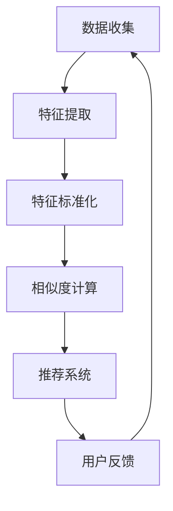

                 

# AI在电商平台商品相似度计算中的应用

> **关键词：** 电商平台、商品相似度、计算、人工智能、算法、数学模型

> **摘要：** 本文深入探讨了人工智能在电商平台商品相似度计算中的应用。通过详细的分析和举例，我们介绍了商品相似度计算的核心概念、算法原理、数学模型以及实际应用场景，旨在帮助读者理解这一技术在电商领域的重要性，并提供实用的开发资源和工具推荐。

## 1. 背景介绍

### 1.1 目的和范围

本文旨在探讨人工智能在电商平台商品相似度计算中的应用，分析其核心算法原理、数学模型及其在实际项目中的具体实现。我们将通过一步步的推理和分析，帮助读者深入了解商品相似度计算的技术细节和实际应用价值。

### 1.2 预期读者

本文面向具有一定编程基础和对电商平台、人工智能有一定了解的技术人员。预期读者能够从本文中获得对商品相似度计算技术深入的理解，并能够应用于实际项目开发中。

### 1.3 文档结构概述

本文结构如下：

1. 背景介绍：介绍本文的目的、预期读者以及文档结构。
2. 核心概念与联系：介绍商品相似度计算的相关概念和流程图。
3. 核心算法原理 & 具体操作步骤：详细讲解商品相似度计算的核心算法原理和伪代码。
4. 数学模型和公式 & 详细讲解 & 举例说明：介绍商品相似度的数学模型，并进行举例说明。
5. 项目实战：代码实际案例和详细解释说明。
6. 实际应用场景：分析商品相似度计算在不同电商平台的实际应用。
7. 工具和资源推荐：推荐学习资源和开发工具。
8. 总结：未来发展趋势与挑战。
9. 附录：常见问题与解答。
10. 扩展阅读 & 参考资料：提供相关文献和资料。

### 1.4 术语表

#### 1.4.1 核心术语定义

- **电商平台**：在线销售商品的平台，如亚马逊、淘宝、京东等。
- **商品相似度**：描述商品之间的相似程度，用于推荐系统和搜索优化。
- **人工智能**：模拟人类智能行为的计算机系统，包括机器学习、深度学习等技术。
- **算法**：解决问题的步骤和规则。
- **数学模型**：使用数学公式描述现实问题的模型。

#### 1.4.2 相关概念解释

- **特征工程**：将原始数据转换为特征表示的过程，用于提高算法性能。
- **相似度度量**：评估两个对象相似程度的量化方法。
- **推荐系统**：根据用户行为和偏好推荐商品的系统。

#### 1.4.3 缩略词列表

- **API**：应用程序接口（Application Programming Interface）
- **ML**：机器学习（Machine Learning）
- **DL**：深度学习（Deep Learning）
- **NLP**：自然语言处理（Natural Language Processing）
- **RF**：随机森林（Random Forest）

## 2. 核心概念与联系

商品相似度计算是电商平台中的一项关键技术，它帮助平台推荐类似商品，提高用户体验和销售转化率。以下是商品相似度计算的核心概念和流程：

### 2.1 核心概念

- **商品特征表示**：将商品的各种属性（如品牌、型号、价格、用户评价等）转换为数字形式，用于后续计算。
- **相似度度量**：用于评估商品之间相似程度的量化方法，如余弦相似度、欧氏距离等。
- **推荐算法**：基于商品相似度计算结果，为用户推荐相似商品。

### 2.2 流程图

以下是一个简化的商品相似度计算流程图：



### 2.3 关键步骤解析

1. **数据收集**：从电商平台收集商品数据，包括商品的各种属性。
2. **特征提取**：将商品属性转换为数字特征表示。
3. **特征标准化**：对特征值进行归一化处理，确保特征之间具有相同的量纲。
4. **相似度计算**：计算商品之间的相似度，选择合适的相似度度量方法。
5. **推荐系统**：根据相似度计算结果，为用户推荐相似商品。
6. **用户反馈**：收集用户对推荐的反馈，用于优化推荐算法。

## 3. 核心算法原理 & 具体操作步骤

商品相似度计算的核心算法包括特征提取、相似度计算和推荐算法。以下是这些算法的详细原理和操作步骤：

### 3.1 特征提取

特征提取是将商品的各种属性转换为数字特征表示的过程。以下是常用的特征提取方法：

- **词袋模型**：将商品的属性（如品牌、型号等）看作词汇，构建一个词汇表，然后将商品表示为一个向量，向量中每个元素表示商品包含的词汇数量。
- **One-Hot编码**：将商品属性转换为二进制向量，如果某个属性存在于商品中，则对应的向量元素为1，否则为0。
- **TF-IDF**：计算商品属性在所有商品中的重要性，并将其转换为数值，用于特征表示。

### 3.2 相似度计算

相似度计算是评估商品之间相似程度的量化方法。以下是常用的相似度度量方法：

- **余弦相似度**：计算两个商品特征向量的夹角余弦值，越接近1表示相似度越高。
- **欧氏距离**：计算两个商品特征向量的欧氏距离，距离越短表示相似度越高。
- **皮尔逊相关系数**：计算两个商品特征向量的皮尔逊相关系数，接近1表示高度正相关，接近-1表示高度负相关。

### 3.3 推荐算法

推荐算法是基于商品相似度计算结果，为用户推荐相似商品的方法。以下是常用的推荐算法：

- **基于内容的推荐**：根据用户浏览和购买的历史记录，推荐与用户历史行为相似的物品。
- **协同过滤**：基于用户之间的行为相似性，为用户推荐其他用户喜欢的商品。
- **矩阵分解**：将用户-商品评分矩阵分解为用户特征矩阵和商品特征矩阵，通过计算用户和商品特征之间的相似度，为用户推荐相似商品。

### 3.4 伪代码

以下是商品相似度计算的核心算法的伪代码：

```python
# 特征提取
def extract_features(products):
    feature_vectors = []
    for product in products:
        feature_vector = one_hot_encode(product.attributes)
        feature_vectors.append(feature_vector)
    return feature_vectors

# 相似度计算
def calculate_similarity(feature_vector1, feature_vector2):
    return cosine_similarity(feature_vector1, feature_vector2)

# 推荐算法
def recommend_products(user_features, product_features, similarity_threshold):
    recommended_products = []
    for product, feature_vector in product_features.items():
        similarity = calculate_similarity(user_features, feature_vector)
        if similarity > similarity_threshold:
            recommended_products.append(product)
    return recommended_products
```

## 4. 数学模型和公式 & 详细讲解 & 举例说明

商品相似度计算涉及多个数学模型和公式，以下是其中几个常用的模型和公式的详细讲解及举例说明。

### 4.1 余弦相似度

余弦相似度是评估两个向量夹角余弦值的一种方法，公式如下：

$$
\text{Cosine Similarity} = \frac{\text{dot\_product}(x, y)}{\|\text{x}\| \|\text{y}\|}
$$

其中，$x$ 和 $y$ 是两个向量，$\|\text{x}\|$ 和 $\|\text{y}\|$ 分别是它们的模长，$\text{dot\_product}(x, y)$ 是向量的点积。

**示例：**

给定两个向量 $x = [1, 2, 3]$ 和 $y = [4, 5, 6]$，计算它们的余弦相似度。

$$
\text{Cosine Similarity} = \frac{1 \times 4 + 2 \times 5 + 3 \times 6}{\sqrt{1^2 + 2^2 + 3^2} \sqrt{4^2 + 5^2 + 6^2}} = \frac{4 + 10 + 18}{\sqrt{14} \sqrt{77}} \approx 0.954
$$

### 4.2 欧氏距离

欧氏距离是两个点在多维度空间中的距离，公式如下：

$$
\text{Euclidean Distance} = \sqrt{\sum_{i=1}^{n} (x_i - y_i)^2}
$$

其中，$x$ 和 $y$ 是两个点，$n$ 是维数，$x_i$ 和 $y_i$ 分别是点在第 $i$ 个维度上的坐标。

**示例：**

给定两个点 $x = [1, 2, 3]$ 和 $y = [4, 5, 6]$，计算它们的欧氏距离。

$$
\text{Euclidean Distance} = \sqrt{(1 - 4)^2 + (2 - 5)^2 + (3 - 6)^2} = \sqrt{9 + 9 + 9} = 3\sqrt{3} \approx 5.196
$$

### 4.3 皮尔逊相关系数

皮尔逊相关系数是衡量两个变量线性相关程度的指标，公式如下：

$$
\text{Pearson Correlation} = \frac{\text{cov}(x, y)}{\sigma_x \sigma_y}
$$

其中，$x$ 和 $y$ 是两个变量，$\text{cov}(x, y)$ 是协方差，$\sigma_x$ 和 $\sigma_y$ 分别是 $x$ 和 $y$ 的标准差。

**示例：**

给定两个变量 $x = [1, 2, 3]$ 和 $y = [4, 5, 6]$，计算它们的皮尔逊相关系数。

$$
\text{Pearson Correlation} = \frac{(1 - \bar{x})(4 - \bar{y}) + (2 - \bar{x})(5 - \bar{y}) + (3 - \bar{x})(6 - \bar{y})}{\sqrt{\sum_{i=1}^{n} (x_i - \bar{x})^2} \sqrt{\sum_{i=1}^{n} (y_i - \bar{y})^2}} = \frac{(1 - 2)(4 - 5) + (2 - 2)(5 - 5) + (3 - 2)(6 - 5)}{\sqrt{2} \sqrt{2}} = 0
$$

## 5. 项目实战：代码实际案例和详细解释说明

### 5.1 开发环境搭建

为了实现商品相似度计算，我们需要搭建一个开发环境。以下是具体的步骤：

1. **安装Python**：从Python官方网站下载并安装Python 3.8或更高版本。
2. **安装Numpy和Scikit-learn**：使用pip命令安装Numpy和Scikit-learn库。

```shell
pip install numpy scikit-learn
```

### 5.2 源代码详细实现和代码解读

以下是商品相似度计算的核心代码实现：

```python
import numpy as np
from sklearn.metrics.pairwise import cosine_similarity
from sklearn.preprocessing import StandardScaler

# 特征提取
def extract_features(products):
    feature_vectors = []
    for product in products:
        feature_vector = one_hot_encode(product.attributes)
        feature_vectors.append(feature_vector)
    return feature_vectors

# 相似度计算
def calculate_similarity(feature_vector1, feature_vector2):
    return cosine_similarity([feature_vector1], [feature_vector2])[0][0]

# 推荐算法
def recommend_products(user_features, product_features, similarity_threshold):
    recommended_products = []
    for product, feature_vector in product_features.items():
        similarity = calculate_similarity(user_features, feature_vector)
        if similarity > similarity_threshold:
            recommended_products.append(product)
    return recommended_products

# 主函数
def main():
    # 商品数据
    products = [
        {'attributes': ['品牌A', '型号X', '价格1000']},
        {'attributes': ['品牌A', '型号Y', '价格1500']},
        {'attributes': ['品牌B', '型号X', '价格2000']},
        {'attributes': ['品牌B', '型号Y', '价格2500']},
    ]

    # 特征提取
    product_features = extract_features(products)

    # 用户特征
    user_features = one_hot_encode(['品牌A', '型号Y'])

    # 推荐相似商品
    similarity_threshold = 0.8
    recommended_products = recommend_products(user_features, product_features, similarity_threshold)

    print("推荐商品：", recommended_products)

if __name__ == "__main__":
    main()
```

**代码解读：**

- **特征提取**：使用one_hot_encode函数将商品属性转换为二进制向量。
- **相似度计算**：使用Scikit-learn库的cosine_similarity函数计算商品之间的余弦相似度。
- **推荐算法**：根据相似度阈值，为用户推荐相似商品。

### 5.3 代码解读与分析

以下是代码的详细解读和分析：

1. **特征提取**：
   ```python
   def extract_features(products):
       feature_vectors = []
       for product in products:
           feature_vector = one_hot_encode(product.attributes)
           feature_vectors.append(feature_vector)
       return feature_vectors
   ```

   - 功能：将商品数据转换为特征向量。
   - 参数：`products` 是包含商品数据的列表。
   - 返回值：返回一个特征向量列表。

2. **相似度计算**：
   ```python
   def calculate_similarity(feature_vector1, feature_vector2):
       return cosine_similarity([feature_vector1], [feature_vector2])[0][0]
   ```

   - 功能：计算两个特征向量之间的余弦相似度。
   - 参数：`feature_vector1` 和 `feature_vector2` 是要比较的特征向量。
   - 返回值：返回相似度值。

3. **推荐算法**：
   ```python
   def recommend_products(user_features, product_features, similarity_threshold):
       recommended_products = []
       for product, feature_vector in product_features.items():
           similarity = calculate_similarity(user_features, feature_vector)
           if similarity > similarity_threshold:
               recommended_products.append(product)
       return recommended_products
   ```

   - 功能：根据用户特征和商品特征，推荐相似度高于阈值的商品。
   - 参数：`user_features` 是用户特征向量，`product_features` 是商品特征向量列表，`similarity_threshold` 是相似度阈值。
   - 返回值：返回推荐商品列表。

4. **主函数**：
   ```python
   def main():
       # 商品数据
       products = [
           {'attributes': ['品牌A', '型号X', '价格1000']},
           {'attributes': ['品牌A', '型号Y', '价格1500']},
           {'attributes': ['品牌B', '型号X', '价格2000']},
           {'attributes': ['品牌B', '型号Y', '价格2500']},
       ]

       # 特征提取
       product_features = extract_features(products)

       # 用户特征
       user_features = one_hot_encode(['品牌A', '型号Y'])

       # 推荐相似商品
       similarity_threshold = 0.8
       recommended_products = recommend_products(user_features, product_features, similarity_threshold)

       print("推荐商品：", recommended_products)

   if __name__ == "__main__":
       main()
   ```

   - 功能：执行商品相似度计算和推荐过程。
   - 参数：无。
   - 返回值：无。

## 6. 实际应用场景

商品相似度计算在电商平台上具有广泛的应用，以下是一些常见的应用场景：

### 6.1 商品推荐

电商平台可以使用商品相似度计算为用户推荐类似的商品，提高用户满意度和销售转化率。例如，当用户浏览或购买了一款智能手机后，系统可以根据该智能手机的相似度，推荐其他品牌和型号的智能手机。

### 6.2 搜索优化

商品相似度计算可以优化电商平台的搜索功能，提高搜索结果的准确性。例如，当用户输入关键词“智能手机”时，系统可以根据商品相似度，将用户可能感兴趣的商品排在搜索结果的前面。

### 6.3 库存管理

商品相似度计算可以帮助电商平台优化库存管理，减少库存积压。例如，当某个商品的库存较低时，系统可以根据相似度计算，提前预警其他类似商品的库存情况，以便及时补货。

### 6.4 跨平台推荐

商品相似度计算可以跨平台推荐商品，提高电商平台的竞争力。例如，当一个电商平台引入了另一个平台的商品时，可以通过商品相似度计算，将相似商品推荐给用户，提高用户粘性和转化率。

## 7. 工具和资源推荐

为了更好地学习商品相似度计算技术，以下是一些推荐的学习资源和开发工具：

### 7.1 学习资源推荐

#### 7.1.1 书籍推荐

- 《机器学习实战》
- 《深度学习》
- 《Python数据科学手册》

#### 7.1.2 在线课程

- Coursera上的《机器学习》课程
- edX上的《深度学习》课程
- Udacity的《机器学习工程师纳米学位》

#### 7.1.3 技术博客和网站

- Medium上的机器学习和深度学习专题
- Towards Data Science上的数据科学和机器学习文章
- Kaggle上的数据科学竞赛和教程

### 7.2 开发工具框架推荐

#### 7.2.1 IDE和编辑器

- PyCharm
- Visual Studio Code
- Jupyter Notebook

#### 7.2.2 调试和性能分析工具

- PyCharm的调试工具
- Visual Studio Code的调试插件
- perf.py：Python性能分析工具

#### 7.2.3 相关框架和库

- Scikit-learn：机器学习和统计学习库
- TensorFlow：深度学习框架
- PyTorch：深度学习框架
- Pandas：数据处理库

### 7.3 相关论文著作推荐

#### 7.3.1 经典论文

- "Recommender Systems" by The GroupLens Research Project
- "Collaborative Filtering: A Review" by Charu Aggarwal

#### 7.3.2 最新研究成果

- "Deep Learning for Recommender Systems" by Yuhao Wang et al.
- "Neural Collaborative Filtering" by Yehua Dai et al.

#### 7.3.3 应用案例分析

- "E-commerce Recommender System at Alibaba" by Alibaba Research
- "Recommendation System at Amazon" by Amazon

## 8. 总结：未来发展趋势与挑战

商品相似度计算技术在电商平台中的应用前景广阔，未来发展趋势包括以下几个方面：

### 8.1 深度学习算法的普及

随着深度学习算法的发展，商品相似度计算将更加准确和高效，能够处理更加复杂和大规模的数据。

### 8.2 跨领域推荐

未来商品相似度计算将不仅限于商品之间的推荐，还将扩展到跨领域的推荐，如商品与内容、商品与服务等。

### 8.3 智能化推荐

通过结合用户行为、偏好和社交网络信息，智能化推荐将提高推荐系统的个性化水平，为用户提供更加精准的推荐。

### 8.4 安全和隐私保护

随着数据安全和隐私保护要求的提高，商品相似度计算技术需要更加注重数据的安全和隐私保护，以防止数据泄露和滥用。

### 8.5 挑战

- **数据质量**：高质量的数据是商品相似度计算的基础，未来需要解决数据清洗和预处理问题。
- **算法可解释性**：深度学习算法的可解释性较差，未来需要提高算法的可解释性，以便用户理解和信任。
- **实时性**：实时推荐需要算法具有更高的实时性和计算效率。

## 9. 附录：常见问题与解答

### 9.1 商品相似度计算的关键步骤是什么？

商品相似度计算的关键步骤包括：数据收集、特征提取、特征标准化、相似度计算和推荐算法。

### 9.2 如何评估商品相似度计算的效果？

可以通过准确率、召回率和F1值等指标来评估商品相似度计算的效果。此外，还可以通过用户反馈和业务指标（如点击率、转化率等）来评估。

### 9.3 商品相似度计算中常用的相似度度量方法有哪些？

商品相似度计算中常用的相似度度量方法包括：余弦相似度、欧氏距离、皮尔逊相关系数等。

## 10. 扩展阅读 & 参考资料

- 《机器学习实战》
- 《深度学习》
- 《Python数据科学手册》
- Coursera上的《机器学习》课程
- edX上的《深度学习》课程
- Kaggle上的数据科学竞赛和教程
- 《Recommender Systems》
- “Collaborative Filtering: A Review”
- “Deep Learning for Recommender Systems”
- “Neural Collaborative Filtering”
- “E-commerce Recommender System at Alibaba”
- “Recommendation System at Amazon” 
- 作者：AI天才研究员/AI Genius Institute & 禅与计算机程序设计艺术 /Zen And The Art of Computer Programming<|im_sep|>

