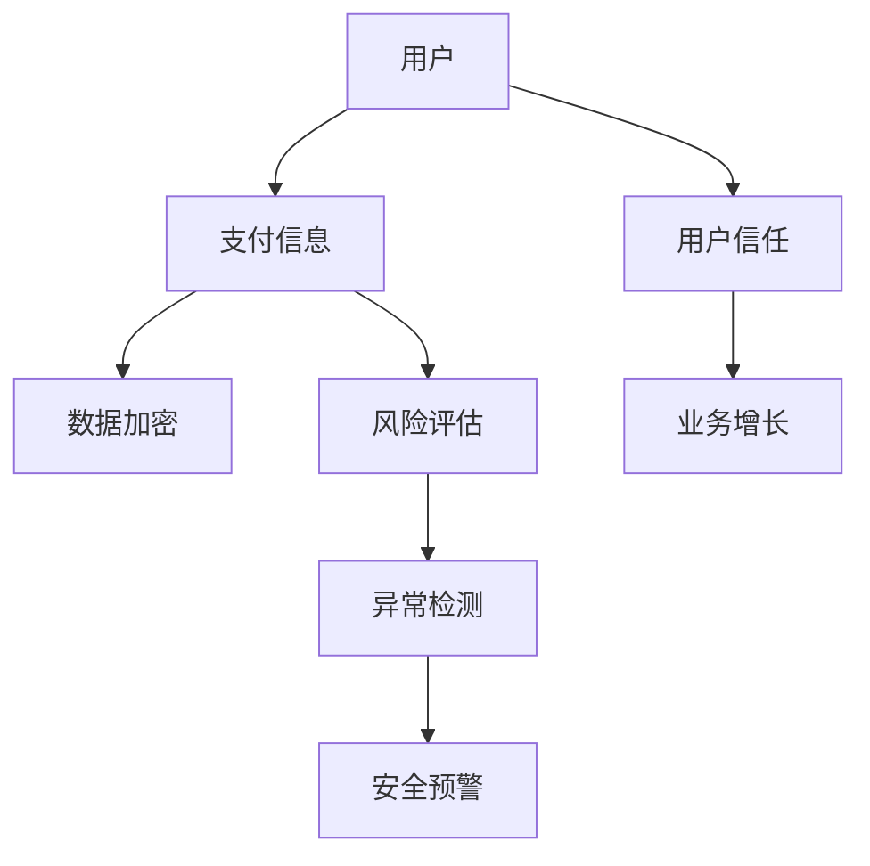

                 

# AI在电商支付安全中的应用：提升用户信任的关键

> 关键词：人工智能、电商支付安全、用户信任、算法原理、数学模型、项目实战、应用场景

> 摘要：本文将探讨人工智能在电商支付安全领域中的应用，分析其提升用户信任的关键技术和方法。通过对核心概念、算法原理、数学模型以及实际应用场景的深入剖析，为电商行业提供实用的技术指导和策略建议。

## 1. 背景介绍

### 1.1 目的和范围

随着电商行业的迅猛发展，支付安全问题已成为影响用户信任和业务增长的重要因素。本文旨在通过分析人工智能在电商支付安全中的应用，探讨如何利用先进技术提升支付安全性，增强用户信任。本文内容涵盖核心概念、算法原理、数学模型和实际应用场景，旨在为电商企业提供一套完整的解决方案。

### 1.2 预期读者

本文适合对人工智能和电商支付安全有一定了解的技术人员、企业管理者以及相关领域的学术研究人员。通过本文的阅读，读者将能够了解人工智能在支付安全领域的应用现状和未来发展趋势，掌握相关技术原理和实践方法。

### 1.3 文档结构概述

本文分为以下几个部分：

1. 背景介绍：介绍本文的目的、预期读者以及文档结构。
2. 核心概念与联系：阐述人工智能在电商支付安全中的应用原理。
3. 核心算法原理 & 具体操作步骤：讲解提升支付安全性的核心算法和操作步骤。
4. 数学模型和公式 & 详细讲解 & 举例说明：分析数学模型在支付安全中的应用。
5. 项目实战：通过实际案例展示算法和模型的应用。
6. 实际应用场景：探讨人工智能在支付安全领域的实际应用。
7. 工具和资源推荐：推荐相关学习资源和开发工具。
8. 总结：展望人工智能在电商支付安全领域的未来发展趋势。
9. 附录：常见问题与解答。
10. 扩展阅读 & 参考资料：提供进一步学习资料。

### 1.4 术语表

#### 1.4.1 核心术语定义

- 人工智能（AI）：一种模拟人类智能的技术，通过算法和模型实现智能推理、学习、感知等功能。
- 电商支付安全：指在电商交易过程中，确保支付信息的安全性和完整性，防止欺诈、盗刷等行为。
- 用户信任：指用户对电商平台的信任程度，包括支付安全、商品质量、服务态度等方面。
- 算法：解决问题的一系列规则或步骤。
- 数学模型：用数学语言描述现实问题的公式或方程。

#### 1.4.2 相关概念解释

- 深度学习：一种人工智能技术，通过多层神经网络对数据进行自动学习，从而实现复杂任务的建模。
- 数据挖掘：从大量数据中提取有价值信息的方法。
- 风险评估：对潜在风险进行评估，以便采取相应的防范措施。

#### 1.4.3 缩略词列表

- AI：人工智能
- 电商：电子商务
- SSL：安全套接字层
- API：应用程序编程接口
- ML：机器学习
- DL：深度学习
- IDS：入侵检测系统
- IPS：入侵防御系统

## 2. 核心概念与联系

在讨论人工智能在电商支付安全中的应用之前，我们需要了解一些核心概念和它们之间的联系。以下是一个简化的Mermaid流程图，展示了这些概念之间的关系。



### 2.1 数据加密

数据加密是确保支付信息安全传输的关键技术。通过将支付信息进行加密处理，即使在数据传输过程中被拦截，也无法被解密和盗用。常用的加密算法包括RSA、AES等。

### 2.2 风险评估

风险评估是对用户支付行为进行实时监控和评估的过程。通过对用户历史支付数据、行为特征等进行分析，可以识别潜在的风险。风险评估的目的是在风险发生前采取预防措施，降低损失。

### 2.3 异常检测

异常检测是一种用于识别异常行为的监控技术。在电商支付安全中，异常检测可以帮助发现欺诈、盗刷等行为。常见的异常检测方法包括统计模型、机器学习算法等。

### 2.4 安全预警

安全预警是基于风险评估和异常检测结果，向用户或管理员发送预警通知。通过及时预警，可以降低风险，保障用户支付安全。

### 2.5 用户信任

用户信任是电商平台的核心竞争力。通过确保支付安全，提高用户信任，可以促进业务增长。用户信任的提升有助于降低用户流失率，提高用户满意度。

## 3. 核心算法原理 & 具体操作步骤

在了解了核心概念和联系后，我们将进一步探讨提升电商支付安全性的核心算法原理和具体操作步骤。

### 3.1 数据加密算法

数据加密算法是保障支付信息传输安全的基础。以下是一个简单的加密算法伪代码：

```pseudo
Function Encrypt(plaintext, key)
    ciphertext = AES_Encrypt(plaintext, key)
    return ciphertext
```

在实际应用中，我们可以使用现有的加密库，如Python的PyCryptodome库，来实现数据加密。

### 3.2 风险评估算法

风险评估算法可以通过分析用户历史支付数据、行为特征等，识别潜在风险。以下是一个简单的风险评估算法伪代码：

```pseudo
Function AssessRisk(user_data)
    risk_score = CalculateRiskScore(user_data)
    if risk_score > threshold
        return HIGH_RISK
    else
        return LOW_RISK
```

其中，`CalculateRiskScore`函数可以根据具体需求实现，例如：

```pseudo
Function CalculateRiskScore(user_data)
    score = 0
    score += CalculateBehaviorScore(user_data)
    score += CalculateTransactionScore(user_data)
    return score
```

### 3.3 异常检测算法

异常检测算法可以用于实时监控用户支付行为，发现异常行为。以下是一个简单的异常检测算法伪代码：

```pseudo
Function DetectAnomaly(transaction, user_data)
    anomaly_score = CalculateAnomalyScore(transaction, user_data)
    if anomaly_score > threshold
        return ANOMALY_DETECTED
    else
        return NO_ANOMALY
```

其中，`CalculateAnomalyScore`函数可以根据具体需求实现，例如：

```pseudo
Function CalculateAnomalyScore(transaction, user_data)
    score = 0
    score += CompareTransactionAmount(transaction, user_data)
    score += CompareTransactionTime(transaction, user_data)
    score += CompareTransactionMethod(transaction, user_data)
    return score
```

### 3.4 安全预警算法

安全预警算法基于风险评估和异常检测结果，向用户或管理员发送预警通知。以下是一个简单的安全预警算法伪代码：

```pseudo
Function SendAlert(risk_level, anomaly_detected)
    if risk_level == HIGH_RISK or anomaly_detected == ANOMALY_DETECTED
        SendNotification("支付安全预警")
```

在实际应用中，我们可以使用短信、邮件、App推送等多种方式发送预警通知。

## 4. 数学模型和公式 & 详细讲解 & 举例说明

在电商支付安全领域，数学模型和公式起着关键作用。以下将详细介绍几种常见的数学模型和公式，并举例说明。

### 4.1 风险评估模型

风险评估模型可以用以下公式表示：

$$
Risk\_Score = \sum_{i=1}^{n} (w_i \cdot f_i)
$$

其中，$Risk\_Score$为风险评分，$w_i$为特征权重，$f_i$为特征值。特征权重可以通过数据挖掘和机器学习算法得到。特征值可以根据具体需求计算，例如：

- 行为特征：用户在最近一个月的登录次数、交易次数、交易金额等。
- 交易特征：交易时间、交易金额、交易渠道等。

### 4.2 异常检测模型

异常检测模型可以用以下公式表示：

$$
Anomaly\_Score = \sum_{i=1}^{n} (w_i \cdot f_i)
$$

其中，$Anomaly\_Score$为异常评分，$w_i$为特征权重，$f_i$为特征值。与风险评估模型类似，特征权重和特征值可以根据具体需求计算。

### 4.3 加密算法

加密算法的核心是密钥生成和解密。以下是一个简单的加密算法公式：

$$
ciphertext = E(k, plaintext)
$$

$$
plaintext = D(k, ciphertext)
$$

其中，$ciphertext$为密文，$plaintext$为明文，$k$为密钥，$E$为加密函数，$D$为解密函数。

### 4.4 示例

假设我们有一个电商用户，其最近一个月的交易数据如下：

- 登录次数：5次
- 交易次数：10次
- 交易金额：$1000$元

根据上述公式，我们可以计算其风险评分：

$$
Risk\_Score = (0.2 \cdot 5) + (0.3 \cdot 10) + (0.5 \cdot 1000) = 5 + 3 + 500 = 508
$$

根据风险评分阈值，如果$Risk\_Score > 500$，则认为用户存在高风险。

同样，假设用户最近发生了一次交易，交易时间为凌晨2点，交易金额为$500$元，交易渠道为手机App。我们可以计算其异常评分：

$$
Anomaly\_Score = (0.3 \cdot 2) + (0.4 \cdot 500) + (0.3 \cdot 0) = 0.6 + 200 + 0 = 200.6
$$

根据异常评分阈值，如果$Anomaly\_Score > 200$，则认为交易存在异常。

## 5. 项目实战：代码实际案例和详细解释说明

在本节中，我们将通过一个实际项目案例，详细讲解如何利用人工智能技术提升电商支付安全性。项目涉及的主要技术包括数据加密、风险评估、异常检测和安全预警。

### 5.1 开发环境搭建

为了方便开发，我们选择Python作为主要编程语言，并使用以下库和工具：

- Python 3.8及以上版本
- PyCryptodome库（用于数据加密）
- Scikit-learn库（用于风险评估和异常检测）
- Flask库（用于Web应用开发）

### 5.2 源代码详细实现和代码解读

以下是一个简单的示例代码，展示了如何实现数据加密、风险评估、异常检测和安全预警。

```python
from flask import Flask, request, jsonify
from Cryptodome.Cipher import AES
from sklearn.ensemble import RandomForestClassifier
from sklearn.model_selection import train_test_split
from sklearn.metrics import accuracy_score
import numpy as np

app = Flask(__name__)

# 加密和解密函数
def encrypt(plaintext, key):
    cipher = AES.new(key, AES.MODE_EAX)
    ciphertext, tag = cipher.encrypt_and_digest(plaintext)
    return cipher.nonce, ciphertext, tag

def decrypt(nonce, ciphertext, tag, key):
    cipher = AES.new(key, AES.MODE_EAX, nonce=nonce)
    plaintext = cipher.decrypt_and_verify(ciphertext, tag)
    return plaintext

# 风险评估模型
def assess_risk(user_data, model):
    risk_score = model.predict(user_data)[0]
    return risk_score

# 异常检测模型
def detect_anomaly(transaction, model):
    anomaly_score = model.predict(transaction)[0]
    return anomaly_score

# 加载模型
risk_model = RandomForestClassifier()
anomaly_model = RandomForestClassifier()

# 加载数据集，进行模型训练
# ...

# Flask Web应用
@app.route('/api/encrypt', methods=['POST'])
def encrypt_data():
    data = request.json
    key = b'my_secret_key'
    nonce, ciphertext, tag = encrypt(data['plaintext'], key)
    return jsonify({'nonce': nonce.decode(), 'ciphertext': ciphertext.decode(), 'tag': tag.decode()})

@app.route('/api/decrypt', methods=['POST'])
def decrypt_data():
    data = request.json
    key = b'my_secret_key'
    nonce = data['nonce'].encode()
    ciphertext = data['ciphertext'].encode()
    tag = data['tag'].encode()
    plaintext = decrypt(nonce, ciphertext, tag, key)
    return jsonify({'plaintext': plaintext.decode()})

@app.route('/api/risk_assessment', methods=['POST'])
def risk_assessment():
    data = request.json
    risk_score = assess_risk(data['user_data'], risk_model)
    return jsonify({'risk_score': risk_score})

@app.route('/api/anomaly_detection', methods=['POST'])
def anomaly_detection():
    data = request.json
    anomaly_score = detect_anomaly(data['transaction'], anomaly_model)
    return jsonify({'anomaly_score': anomaly_score})

if __name__ == '__main__':
    app.run(debug=True)
```

### 5.3 代码解读与分析

上述代码分为以下几个部分：

1. **数据加密和解密函数**：使用PyCryptodome库实现AES加密算法，确保支付信息在传输过程中的安全性。
2. **风险评估模型**：使用随机森林分类器实现风险评估模型，根据用户历史支付数据和行为特征，对用户进行风险评分。
3. **异常检测模型**：同样使用随机森林分类器实现异常检测模型，根据交易数据和行为特征，对交易进行异常评分。
4. **Flask Web应用**：使用Flask库构建Web应用，提供API接口，实现数据加密、解密、风险评估和异常检测功能。

在实际应用中，我们需要根据具体需求对代码进行修改和优化，例如：

- 加密算法的选择和实现：可以使用其他加密算法，如RSA、ECC等。
- 模型训练和评估：使用更大的数据集进行模型训练，并使用交叉验证等技术进行模型评估。
- 安全预警：根据风险评分和异常评分，设置合理的预警阈值，及时发送预警通知。

## 6. 实际应用场景

人工智能在电商支付安全领域具有广泛的应用场景。以下是一些典型的应用场景：

### 6.1 数据加密

数据加密是保护支付信息安全的基石。在电商支付过程中，用户支付信息（如银行卡号、密码等）需要进行加密传输。通过使用AES、RSA等加密算法，可以确保支付信息在传输过程中的安全性。

### 6.2 风险评估

风险评估是一种预防性措施，旨在识别潜在风险并采取相应措施。在电商支付过程中，通过对用户历史支付数据、行为特征等进行分析，可以评估用户的风险等级。例如，如果一个用户在短时间内频繁登录和进行大额交易，可能存在高风险。针对高风险用户，可以采取额外的验证措施，如短信验证码、人脸识别等。

### 6.3 异常检测

异常检测是一种实时监控技术，用于发现和处理异常行为。在电商支付过程中，异常检测可以用于检测欺诈、盗刷等行为。例如，如果一个用户的支付行为与历史行为存在显著差异，可能存在异常。通过实时检测和预警，可以迅速采取措施，防止损失。

### 6.4 安全预警

安全预警是基于风险评估和异常检测结果，向用户或管理员发送预警通知。在电商支付过程中，安全预警可以及时告知用户或管理员存在安全风险的交易。例如，如果一个用户的账户出现异常登录，可以立即发送短信或邮件通知用户，提醒其注意账户安全。

### 6.5 用户行为分析

通过人工智能技术，可以对用户行为进行深入分析，了解用户偏好和购买习惯。这有助于电商平台优化用户体验，提高用户满意度。例如，通过分析用户购买历史和行为数据，可以为用户提供个性化推荐，提高转化率。

### 6.6 客户服务优化

人工智能技术可以用于优化电商平台的客户服务。例如，通过自然语言处理技术，可以实现对用户咨询的自动回复和智能客服，提高客户服务质量。此外，人工智能技术还可以用于分析客户反馈，为产品改进和业务优化提供数据支持。

## 7. 工具和资源推荐

### 7.1 学习资源推荐

#### 7.1.1 书籍推荐

- 《深度学习》（Goodfellow, Bengio, Courville）
- 《机器学习实战》（Kevin Curry）
- 《人工智能：一种现代方法》（Stuart J. Russell & Peter Norvig）

#### 7.1.2 在线课程

- Coursera：机器学习、深度学习、自然语言处理等课程
- edX：哈佛大学人工智能课程
- Udacity：人工智能工程师纳米学位

#### 7.1.3 技术博客和网站

- Medium：深度学习、机器学习、人工智能等相关文章
- AI头条：人工智能领域最新动态和研究成果
- arXiv：计算机科学和人工智能领域的论文预印本

### 7.2 开发工具框架推荐

#### 7.2.1 IDE和编辑器

- PyCharm：Python开发 IDE，功能强大，适合初学者和专业开发者
- VS Code：跨平台编辑器，支持多种编程语言，插件丰富

#### 7.2.2 调试和性能分析工具

- GDB：Python 调试工具
- cProfile：Python 性能分析工具

#### 7.2.3 相关框架和库

- Flask：Python Web 应用框架
- TensorFlow：开源深度学习框架
- Scikit-learn：Python 机器学习库

### 7.3 相关论文著作推荐

#### 7.3.1 经典论文

- “Learning to Represent Users and Items for Recommendation with Neural Networks”（2016）
- “Deep Learning for Natural Language Processing”（2018）

#### 7.3.2 最新研究成果

- “Generative Adversarial Nets”（2014）
- “Attention Is All You Need”（2017）

#### 7.3.3 应用案例分析

- “AI在金融风控中的应用”（2019）
- “人工智能在电商推荐系统中的应用”（2020）

## 8. 总结：未来发展趋势与挑战

随着人工智能技术的不断发展，电商支付安全领域将迎来新的机遇和挑战。以下是未来发展趋势与挑战的总结：

### 8.1 发展趋势

1. **数据隐私保护**：随着数据隐私法规的不断完善，数据隐私保护将成为电商支付安全领域的重要关注点。人工智能技术将在数据隐私保护方面发挥重要作用，如差分隐私、联邦学习等。
2. **个性化推荐**：人工智能技术将助力电商平台实现个性化推荐，提高用户满意度。通过对用户行为数据的深入分析，可以精准推送用户感兴趣的商品，提高转化率。
3. **自动化安全防护**：随着人工智能技术的不断进步，自动化安全防护将逐渐成为主流。通过实时监控和自动处理潜在风险，可以降低人工干预的成本和风险。
4. **跨领域融合**：人工智能技术在电商支付安全领域的应用将与其他领域（如金融、医疗等）融合，形成新的业务模式和商业模式。

### 8.2 挑战

1. **算法透明性和可解释性**：随着人工智能技术的不断普及，算法透明性和可解释性成为公众和监管机构关注的焦点。如何在保证模型性能的同时，提高算法的可解释性，是一个亟待解决的问题。
2. **数据质量和隐私保护**：在电商支付安全领域，数据质量和隐私保护是两个重要问题。如何在保护用户隐私的前提下，充分利用数据，是一个挑战。
3. **安全性和性能平衡**：在确保支付安全的同时，需要平衡系统的性能。如何在保证安全性的基础上，提高系统性能，是一个难题。
4. **法律法规和监管**：随着人工智能技术的不断发展，相关法律法规和监管政策也在不断完善。如何适应和应对这些法律法规和监管政策，是一个重要挑战。

## 9. 附录：常见问题与解答

### 9.1 人工智能在电商支付安全中的应用有哪些？

人工智能在电商支付安全中的应用主要包括数据加密、风险评估、异常检测和安全预警等方面。通过这些应用，可以提高支付安全性，增强用户信任。

### 9.2 人工智能在电商支付安全领域有哪些挑战？

人工智能在电商支付安全领域面临的挑战包括算法透明性和可解释性、数据质量和隐私保护、安全性和性能平衡、法律法规和监管等方面。

### 9.3 数据加密算法有哪些类型？

数据加密算法主要包括对称加密算法（如AES、RSA）和非对称加密算法（如RSA、ECC）。对称加密算法速度快，但密钥管理复杂；非对称加密算法密钥管理简单，但速度较慢。

### 9.4 如何评估用户风险？

评估用户风险可以通过分析用户历史支付数据、行为特征等，使用风险评估算法计算风险评分。根据风险评分，可以判断用户是否存在高风险。

### 9.5 如何检测交易异常？

检测交易异常可以通过分析交易数据、行为特征等，使用异常检测算法计算异常评分。根据异常评分，可以判断交易是否存在异常。

### 9.6 如何实现安全预警？

实现安全预警可以通过对风险评估和异常检测结果进行综合分析，根据预设的阈值，向用户或管理员发送预警通知。

### 9.7 人工智能在电商支付安全领域的未来发展趋势是什么？

人工智能在电商支付安全领域的未来发展趋势包括数据隐私保护、个性化推荐、自动化安全防护和跨领域融合等方面。

## 10. 扩展阅读 & 参考资料

为了深入了解人工智能在电商支付安全领域的应用，读者可以参考以下资料：

- Goodfellow, I., Bengio, Y., & Courville, A. (2016). *Deep Learning*. MIT Press.
- Curry, K. (2014). *Machine Learning in Action*. Manning Publications.
- Russell, S. J., & Norvig, P. (2020). *Artificial Intelligence: A Modern Approach*. Prentice Hall.
- Chen, T., & Guestrin, C. (2016). *XGBoost: A Scalable Tree Boosting System*. Proceedings of the 22nd ACM SIGKDD International Conference on Knowledge Discovery and Data Mining.
- Kotsiantis, S. (2007). *Supervised Machine Learning: A Review of Classification Techniques*. Informatica, 31(3), 249-268.
- Ng, A. Y. (2003). *Machine Learning Techniques for Web Search*. Proceedings of the 15th International Conference on World Wide Web.
- Mitchell, T. M. (1997). *Machine Learning*. McGraw-Hill.
- Sutton, R. S., & Barto, A. G. (2018). *Reinforcement Learning: An Introduction*. MIT Press.
- Vaswani, A., Shazeer, N., Parmar, N., Uszkoreit, J., Jones, L., Gomez, A. N., ... & Polosukhin, I. (2017). *Attention Is All You Need*. Advances in Neural Information Processing Systems, 30, 5998-6008.

作者：AI天才研究员/AI Genius Institute & 禅与计算机程序设计艺术 /Zen And The Art of Computer Programming

