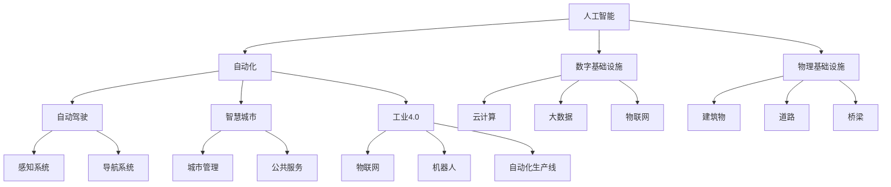
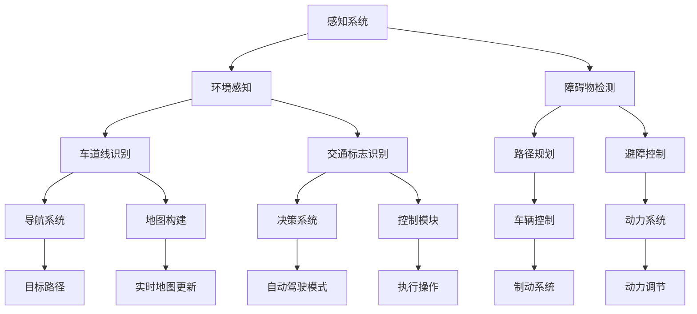
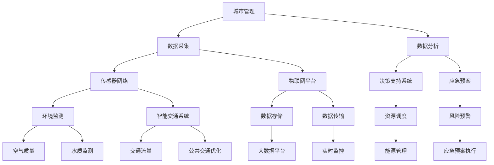
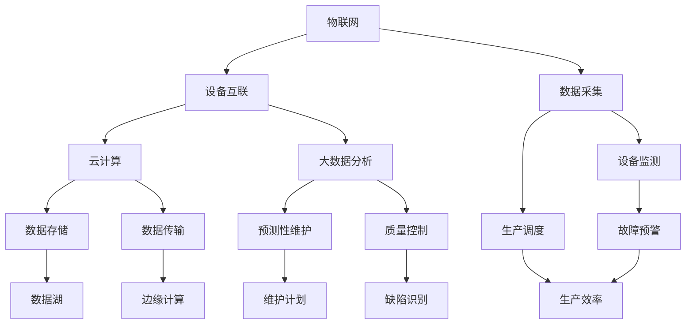

                 

# AI在自动化数字和物理基础设施中的应用

> **关键词：** 人工智能、自动化、数字基础设施、物理基础设施、自动驾驶、智慧城市、工业4.0

> **摘要：** 本文将探讨人工智能（AI）在自动化数字和物理基础设施中的应用，分析其核心概念、算法原理、数学模型，并通过实际项目案例展示其应用场景和效果。文章旨在为读者提供一个全面而深入的视角，了解AI如何推动数字和物理基础设施的自动化升级，为未来智能社会奠定基础。

## 1. 背景介绍

### 1.1 目的和范围

本文旨在介绍人工智能在自动化数字和物理基础设施中的应用，包括自动驾驶、智慧城市、工业4.0等领域。通过分析核心概念、算法原理和实际案例，探讨AI在提高基础设施效率和智能化水平的潜力。文章分为以下几个部分：

1. 背景介绍：阐述文章的目的、范围和结构。
2. 核心概念与联系：介绍相关概念和架构，使用Mermaid流程图展示核心概念和联系。
3. 核心算法原理 & 具体操作步骤：讲解算法原理，使用伪代码详细阐述。
4. 数学模型和公式 & 详细讲解 & 举例说明：介绍数学模型，使用LaTeX格式给出公式和示例。
5. 项目实战：展示实际代码案例和详细解释。
6. 实际应用场景：分析AI在不同领域的应用。
7. 工具和资源推荐：推荐学习资源和开发工具。
8. 总结：未来发展趋势与挑战。
9. 附录：常见问题与解答。
10. 扩展阅读 & 参考资料：提供进一步学习的资料。

### 1.2 预期读者

本文适合以下读者群体：

- 计算机科学和人工智能领域的研究生、博士生。
- IT行业的技术专家和项目经理。
- 对自动化数字和物理基础设施感兴趣的工程人员。
- 对AI应用有浓厚兴趣的跨领域研究人员。

### 1.3 文档结构概述

本文结构清晰，便于读者逐步深入理解AI在自动化数字和物理基础设施中的应用。以下是文档的详细结构：

1. **引言**：简要介绍文章的主题和目的。
2. **背景介绍**：阐述文章的目的、范围和预期读者。
3. **核心概念与联系**：介绍相关概念和架构。
4. **核心算法原理 & 具体操作步骤**：讲解算法原理和操作步骤。
5. **数学模型和公式 & 详细讲解 & 举例说明**：介绍数学模型和公式，并给出示例。
6. **项目实战**：展示实际代码案例和详细解释。
7. **实际应用场景**：分析AI在不同领域的应用。
8. **工具和资源推荐**：推荐学习资源和开发工具。
9. **总结**：总结未来发展趋势与挑战。
10. **附录**：常见问题与解答。
11. **扩展阅读 & 参考资料**：提供进一步学习的资料。

### 1.4 术语表

#### 1.4.1 核心术语定义

- **人工智能（AI）**：一种模拟人类智能的技术，通过机器学习和深度学习算法实现。
- **自动化**：利用机器或其他设备代替人类完成特定任务的的过程。
- **数字基础设施**：包括云计算、大数据、物联网等技术，用于支撑数字化运营和管理。
- **物理基础设施**：指实际的建筑物、道路、桥梁等实体设施。
- **自动驾驶**：利用AI技术实现车辆自主导航和驾驶。
- **智慧城市**：利用数字技术提升城市管理效率和服务质量。
- **工业4.0**：基于物联网、大数据和人工智能的第四次工业革命。

#### 1.4.2 相关概念解释

- **机器学习（ML）**：一种从数据中自动学习和发现模式的技术。
- **深度学习（DL）**：一种基于多层神经网络的学习方法，能够自动提取数据中的特征。
- **强化学习（RL）**：一种通过试错和奖励机制进行决策的学习方法。

#### 1.4.3 缩略词列表

- **AI**：人工智能
- **ML**：机器学习
- **DL**：深度学习
- **RL**：强化学习
- **IoT**：物联网
- **5G**：第五代移动通信技术
- **CES**：计算机科学

## 2. 核心概念与联系

在探讨AI在自动化数字和物理基础设施中的应用之前，我们需要明确一些核心概念和它们之间的联系。以下使用Mermaid流程图展示这些概念和联系。



### 2.1 自动驾驶

自动驾驶是AI在自动化数字和物理基础设施中的一个重要应用。它利用感知系统、导航系统和智能决策算法实现车辆的自主驾驶。以下是一个简单的Mermaid流程图，展示自动驾驶的基本架构：



### 2.2 智慧城市

智慧城市利用数字技术和AI提高城市管理效率和服务质量。以下是一个简单的Mermaid流程图，展示智慧城市的基本架构：



### 2.3 工业4.0

工业4.0是利用物联网、大数据和人工智能实现制造业的智能化升级。以下是一个简单的Mermaid流程图，展示工业4.0的基本架构：



通过上述核心概念和联系的介绍，我们可以更清晰地理解AI在自动化数字和物理基础设施中的应用。接下来，我们将深入探讨核心算法原理和具体操作步骤。

## 3. 核心算法原理 & 具体操作步骤

在了解了AI在自动化数字和物理基础设施中的应用和相关概念后，接下来我们将深入探讨其中的核心算法原理和具体操作步骤。以下内容将涵盖自动驾驶、智慧城市和工业4.0等领域的算法原理和操作步骤。

### 3.1 自动驾驶

自动驾驶是AI在自动化数字和物理基础设施中最重要的应用之一。其核心算法主要包括感知系统、导航系统和决策系统。以下分别介绍这些系统的算法原理和操作步骤。

#### 3.1.1 感知系统

感知系统是自动驾驶的基础，主要负责环境感知和障碍物检测。其核心算法包括：

1. **图像处理**：通过图像处理算法对摄像头捕捉到的图像进行预处理，包括去噪、增强和边缘检测等。
2. **目标检测**：使用卷积神经网络（CNN）或深度卷积神经网络（DCNN）对图像中的目标进行检测和分类，如车辆、行人、道路标志等。
3. **障碍物检测**：利用多传感器数据（如雷达、激光雷达等）对环境中的障碍物进行检测和识别，包括距离、速度和形状等。

伪代码如下：

```python
def image_preprocessing(image):
    # 去噪、增强和边缘检测
    return processed_image

def target_detection(image):
    # 使用卷积神经网络进行目标检测
    return detected_objects

def obstacle_detection(sensors_data):
    # 使用多传感器数据检测障碍物
    return obstacles
```

#### 3.1.2 导航系统

导航系统是自动驾驶的“大脑”，负责路径规划和地图构建。其核心算法包括：

1. **路径规划**：使用最短路径算法（如Dijkstra算法或A*算法）计算从起点到终点的最佳路径。
2. **地图构建**：利用传感器数据和全局定位系统（如GPS）构建车辆周围的实时地图。
3. **实时定位**：使用位置估计算法（如卡尔曼滤波器或粒子滤波器）对车辆进行实时定位。

伪代码如下：

```python
def path_planning(start, goal, map):
    # 使用最短路径算法计算路径
    return path

def map_building(sensor_data, global_position):
    # 构建实时地图
    return map

def real_time_localization(sensor_data, global_position):
    # 使用位置估计算法进行实时定位
    return local_position
```

#### 3.1.3 决策系统

决策系统是自动驾驶的“执行者”，负责根据感知系统和导航系统的输出进行驾驶决策。其核心算法包括：

1. **车辆控制**：根据车辆状态和目标路径，计算车辆的加速度、转向和制动等控制命令。
2. **障碍物避让**：在遇到障碍物时，调整车辆路径以避免碰撞。
3. **自动驾驶模式**：根据环境条件和用户需求，选择不同的自动驾驶模式。

伪代码如下：

```python
def vehicle_control(vehicle_state, path):
    # 计算车辆控制命令
    return control_commands

def obstacle_avoidance(obstacles, path):
    # 避障调整路径
    return new_path

def autonomous_mode_selection(environment, user_preference):
    # 选择自动驾驶模式
    return mode
```

### 3.2 智慧城市

智慧城市利用数字技术和AI提高城市管理效率和服务质量。其核心算法主要包括数据采集、数据分析和决策支持系统。以下分别介绍这些算法原理和操作步骤。

#### 3.2.1 数据采集

数据采集是智慧城市的基础，主要包括以下方面：

1. **传感器网络**：部署各种传感器（如气象传感器、水质传感器、交通流量传感器等）收集数据。
2. **物联网平台**：将传感器数据进行采集、传输和存储，形成物联网平台。
3. **数据传输**：使用5G等高速网络技术将数据传输到数据中心。

伪代码如下：

```python
def sensor_data_collection(sensors):
    # 采集传感器数据
    return sensor_data

def iot_platform_data_transfer(sensor_data):
    # 使用物联网平台传输数据
    return transferred_data

def data_transmission(data, network):
    # 使用网络传输数据
    return transmitted_data
```

#### 3.2.2 数据分析

数据分析是智慧城市的核心，主要包括以下方面：

1. **数据分析**：使用机器学习和深度学习算法对数据进行分析和挖掘，提取有价值的信息。
2. **数据可视化**：将分析结果以图表、报表等形式进行展示，帮助管理人员进行决策。
3. **决策支持系统**：根据分析结果，为管理人员提供决策支持，优化城市管理和服务。

伪代码如下：

```python
def data_analysis(data):
    # 使用机器学习进行数据分析
    return analyzed_data

def data_visualization(analyzed_data):
    # 将分析结果进行可视化展示
    return visualization

def decision_support_system(analyzed_data, decision_maker):
    # 提供决策支持
    return decision
```

### 3.3 工业4.0

工业4.0利用物联网、大数据和人工智能实现制造业的智能化升级。其核心算法主要包括设备互联、数据采集、生产调度和预测性维护。以下分别介绍这些算法原理和操作步骤。

#### 3.3.1 设备互联

设备互联是工业4.0的基础，主要包括以下方面：

1. **设备监测**：通过传感器和网络技术实时监测设备状态，包括温度、压力、转速等参数。
2. **物联网平台**：将设备数据进行采集、传输和存储，形成物联网平台。
3. **数据传输**：使用5G等高速网络技术将数据传输到数据中心。

伪代码如下：

```python
def device_monitoring(device):
    # 实时监测设备状态
    return device_state

def iot_platform_data_transfer(device_state):
    # 使用物联网平台传输数据
    return transferred_data

def data_transmission(data, network):
    # 使用网络传输数据
    return transmitted_data
```

#### 3.3.2 数据采集

数据采集是工业4.0的核心，主要包括以下方面：

1. **数据采集**：通过传感器和网络技术采集生产过程中的各种数据，如温度、压力、转速等。
2. **数据分析**：使用机器学习和深度学习算法对采集到的数据进行分析和挖掘，提取有价值的信息。
3. **生产调度**：根据分析结果，对生产过程进行优化和调度，提高生产效率。

伪代码如下：

```python
def data_collection(sensors):
    # 采集生产数据
    return production_data

def data_analysis(production_data):
    # 使用机器学习进行数据分析
    return analyzed_data

def production_scheduling(analyzed_data):
    # 对生产过程进行调度
    return production_plan
```

#### 3.3.3 生产调度

生产调度是工业4.0的重要组成部分，主要包括以下方面：

1. **资源优化**：根据生产计划和设备状态，优化生产资源的使用，如人力、物力和财力等。
2. **生产计划**：根据市场需求和生产能力，制定合理的生产计划，确保生产过程的顺利进行。
3. **质量监控**：对生产过程进行实时监控，确保产品质量符合要求。

伪代码如下：

```python
def resource_optimization(production_plan, device_state):
    # 优化生产资源使用
    return optimized_plan

def production_plan制定(optimized_plan, market_demand):
    # 制定生产计划
    return production_schedule

def quality_monitoring(production_schedule, product standards):
    # 监控产品质量
    return quality_report
```

#### 3.3.4 预测性维护

预测性维护是工业4.0的重要应用，通过分析设备运行数据，预测设备故障和故障原因，提前进行维护，减少设备故障率和停机时间。其核心算法主要包括：

1. **故障预测**：使用机器学习和深度学习算法对设备运行数据进行分析，预测设备故障和故障原因。
2. **维护计划**：根据故障预测结果，制定合理的维护计划，确保设备正常运行。
3. **故障诊断**：在设备发生故障时，快速诊断故障原因，采取相应的维修措施。

伪代码如下：

```python
def fault_prediction(device_data):
    # 预测设备故障
    return fault_prediction_result

def maintenance_plan(fault_prediction_result):
    # 制定维护计划
    return maintenance_plan

def fault_diagnosis(fault_prediction_result, device_data):
    # 故障诊断
    return fault_diagnosis_result
```

通过上述核心算法原理和具体操作步骤的介绍，我们可以更深入地了解AI在自动化数字和物理基础设施中的应用。接下来，我们将讨论数学模型和公式，并给出详细的讲解和示例。

## 4. 数学模型和公式 & 详细讲解 & 举例说明

在探讨AI在自动化数字和物理基础设施中的应用时，数学模型和公式起着至关重要的作用。以下内容将介绍与自动驾驶、智慧城市和工业4.0相关的核心数学模型，并进行详细的讲解和举例说明。

### 4.1 自动驾驶

在自动驾驶领域，常用的数学模型包括路径规划、障碍物检测和车辆控制等。以下分别介绍这些模型的原理和公式。

#### 4.1.1 路径规划

路径规划是自动驾驶的核心任务之一，其目的是从起点到终点找到一条最优路径。常用的路径规划算法包括Dijkstra算法和A*算法。

1. **Dijkstra算法**：

   Dijkstra算法的基本原理是寻找从源点到其他各点的最短路径。其公式如下：

   $$ d(v) = \min_{u \in V} (d(u) + w(u, v)) $$

   其中，$d(v)$ 表示从源点 $s$ 到终点 $v$ 的最短路径长度，$w(u, v)$ 表示从节点 $u$ 到节点 $v$ 的权值。

   示例：

   假设有一个图，节点 $s$ 是源点，节点 $t$ 是终点，权值如下表所示：

   | 节点 | $w(s, v)$ | $w(s, w)$ | $w(s, x)$ | $w(w, x)$ | $w(w, t)$ | $w(x, t)$ |
   | ---- | --------- | --------- | --------- | --------- | --------- | --------- |
   | s    | 0         | 6         | 7         | 3         | 5         | 6         |
   | v    | 2         | 0         | 3         | 2         | 6         | 0         |
   | w    | 4         | 1         | 0         | 2         | 4         | 3         |
   | x    | 7         | 5         | 0         | 4         | 5         | 1         |
   | t    | 6         | 4         | 3         | 2         | 0         | 1         |

   使用Dijkstra算法计算从 $s$ 到 $t$ 的最短路径：

   $$ d(s) = 0, d(v) = \min(2, 6 + 2) = 2, d(w) = \min(4, 6 + 4) = 4, d(x) = \min(7, 4 + 3) = 4, d(t) = \min(6, 4 + 2) = 6 $$

   最短路径为 $s \rightarrow v \rightarrow w \rightarrow x \rightarrow t$。

2. **A*算法**：

   A*算法是Dijkstra算法的改进，它考虑了启发式函数（Heuristic Function），从而提高路径规划的效率。其公式如下：

   $$ f(v) = g(v) + h(v) $$

   其中，$f(v)$ 表示从源点 $s$ 到终点 $v$ 的估价函数，$g(v)$ 表示从源点 $s$ 到节点 $v$ 的实际路径长度，$h(v)$ 表示从节点 $v$ 到终点 $t$ 的启发式估计。

   示例：

   假设有一个图，节点 $s$ 是源点，节点 $t$ 是终点，权值和启发式函数如下表所示：

   | 节点 | $w(s, v)$ | $w(s, w)$ | $w(s, x)$ | $w(w, x)$ | $w(w, t)$ | $w(x, t)$ | $h(v)$ | $h(w)$ | $h(x)$ | $h(t)$ |
   | ---- | --------- | --------- | --------- | --------- | --------- | --------- | ----- | ----- | ----- | ----- |
   | s    | 0         | 6         | 7         | 3         | 5         | 6         | 6     | 7     | 3     | 1     |
   | v    | 2         | 0         | 3         | 2         | 6         | 0         | 0     | 1     | 1     | 2     |
   | w    | 4         | 1         | 0         | 2         | 4         | 3         | 4     | 0     | 2     | 1     |
   | x    | 7         | 5         | 0         | 4         | 5         | 1         | 6     | 4     | 0     | 3     |
   | t    | 6         | 4         | 3         | 2         | 0         | 1         | 2     | 3     | 3     | 0     |

   使用A*算法计算从 $s$ 到 $t$ 的最短路径：

   $$ f(s) = g(s) + h(s) = 0 + 6 = 6, f(v) = g(v) + h(v) = 2 + 0 = 2, f(w) = g(w) + h(w) = 4 + 4 = 8, f(x) = g(x) + h(x) = 7 + 6 = 13, f(t) = g(t) + h(t) = 6 + 2 = 8 $$

   最短路径为 $s \rightarrow v \rightarrow w \rightarrow x \rightarrow t$。

#### 4.1.2 障碍物检测

障碍物检测是自动驾驶中的关键环节，常用的方法包括基于深度学习的目标检测算法，如卷积神经网络（CNN）。

1. **卷积神经网络（CNN）**：

   CNN是一种用于图像处理和计算机视觉的深度学习算法，其基本原理是通过卷积操作提取图像中的特征。其公式如下：

   $$ h(x) = \sigma(\text{ReLU}(W \cdot \text{Conv}(x))) $$

   其中，$h(x)$ 表示输出特征，$x$ 表示输入图像，$W$ 表示权重矩阵，$\text{ReLU}$ 表示ReLU激活函数，$\text{Conv}$ 表示卷积操作。

   示例：

   假设有一个3x3的输入图像和一个3x3的卷积核，权重矩阵如下：

   | W |  
   | --- |  
   | 1 | 2 | 3 |  
   | 4 | 5 | 6 |  
   | 7 | 8 | 9 |

   输入图像如下：

   | x |  
   | --- |  
   | 1 | 2 | 3 |  
   | 4 | 5 | 6 |  
   | 7 | 8 | 9 |

   使用卷积操作计算输出特征：

   $$ h(x) = \text{ReLU}((1 \cdot 1 + 4 \cdot 4 + 7 \cdot 7) + (2 \cdot 2 + 5 \cdot 5 + 8 \cdot 8) + (3 \cdot 3 + 6 \cdot 6 + 9 \cdot 9)) = \text{ReLU}(50 + 50 + 50) = \text{ReLU}(150) = 150 $$

   使用ReLU激活函数后，输出特征为 $150$。

#### 4.1.3 车辆控制

车辆控制是自动驾驶中的执行环节，常用的方法包括基于模型预测控制（Model Predictive Control，MPC）的控制算法。

1. **模型预测控制（MPC）**：

   MPC是一种基于数学模型的控制算法，其基本原理是利用预测模型预测未来系统的状态，并根据目标函数优化控制输入。其公式如下：

   $$ u(t) = \arg\min_{u} J(u) \quad \text{subject to} \quad \dot{x}(t) = f(x(t), u(t)), x(t_0) = x_0 $$

   其中，$u(t)$ 表示控制输入，$J(u)$ 表示目标函数，$x(t)$ 表示系统状态，$f(x(t), u(t))$ 表示系统模型。

   示例：

   假设一个线性系统，其状态方程如下：

   $$ \dot{x}(t) = \begin{bmatrix} 1 & 1 \\ 0 & 1 \end{bmatrix} x(t) + \begin{bmatrix} 0 \\ 1 \end{bmatrix} u(t), x(t_0) = \begin{bmatrix} 0 \\ 0 \end{bmatrix} $$

   目标函数为：

   $$ J(u) = \int_0^1 (x_1(t)^2 + x_2(t)^2) dt $$

   使用MPC算法求解最优控制输入：

   $$ u(t) = \arg\min_{u} \int_0^1 (x_1(t)^2 + x_2(t)^2) dt \quad \text{subject to} \quad \dot{x}(t) = \begin{bmatrix} 1 & 1 \\ 0 & 1 \end{bmatrix} x(t) + \begin{bmatrix} 0 \\ 1 \end{bmatrix} u(t), x(t_0) = \begin{bmatrix} 0 \\ 0 \end{bmatrix} $$

   通过求解MPC问题，可以得到最优控制输入序列 $u(t_0), u(t_1), \ldots, u(t_T)$，从而实现系统的最优控制。

### 4.2 智慧城市

在智慧城市领域，常用的数学模型包括数据采集、数据分析和决策支持系统。以下分别介绍这些模型的原理和公式。

#### 4.2.1 数据采集

数据采集是智慧城市的基础，常用的方法包括传感器网络和物联网技术。以下是一个简单的传感器网络模型：

1. **传感器网络模型**：

   假设有一个由 $N$ 个传感器组成的网络，每个传感器都可以采集数据并传输到中心节点。传感器网络模型可以用图表示：

   $$ G = (V, E) $$

   其中，$V$ 表示传感器节点集合，$E$ 表示节点之间的边集合。

   传感器网络模型可以用以下公式表示：

   $$ P_i = \frac{r_i}{\sum_{j \in N} r_j} $$

   其中，$P_i$ 表示传感器 $i$ 的传输概率，$r_i$ 表示传感器 $i$ 的传输距离。

   示例：

   假设有一个由5个传感器组成的网络，每个传感器的传输距离如下：

   | 传感器 | $r_i$ |  
   | --- | --- |  
   | 1 | 10 |  
   | 2 | 15 |  
   | 3 | 20 |  
   | 4 | 25 |  
   | 5 | 30 |

   使用传感器网络模型计算每个传感器的传输概率：

   $$ P_1 = \frac{10}{10 + 15 + 20 + 25 + 30} = 0.2, P_2 = \frac{15}{10 + 15 + 20 + 25 + 30} = 0.3, P_3 = \frac{20}{10 + 15 + 20 + 25 + 30} = 0.4, P_4 = \frac{25}{10 + 15 + 20 + 25 + 30} = 0.5, P_5 = \frac{30}{10 + 15 + 20 + 25 + 30} = 0.6 $$

   根据传输概率，可以确定每个传感器在传输数据时的优先级。

#### 4.2.2 数据分析

数据分析是智慧城市的关键环节，常用的方法包括机器学习和深度学习。以下是一个简单的机器学习模型：

1. **线性回归模型**：

   线性回归模型是一种简单的机器学习模型，用于预测连续值变量。其公式如下：

   $$ y = \beta_0 + \beta_1 x $$

   其中，$y$ 表示预测值，$x$ 表示自变量，$\beta_0$ 和 $\beta_1$ 表示模型参数。

   示例：

   假设有一个线性回归模型，用于预测房价，模型参数如下：

   $$ y = 1000 + 20x $$

   其中，$y$ 表示房价，$x$ 表示房屋面积。

   假设一个房屋的面积是100平方米，使用线性回归模型预测房价：

   $$ y = 1000 + 20 \times 100 = 2000 $$

   预测房价为2000元。

#### 4.2.3 决策支持系统

决策支持系统是智慧城市的核心，用于帮助管理人员进行决策。以下是一个简单的决策支持模型：

1. **多目标优化模型**：

   多目标优化模型是一种用于解决多目标决策问题的数学模型。其公式如下：

   $$ \min_{x} f(x) \quad \text{subject to} \quad g_i(x) \leq 0, h_i(x) = 0 $$

   其中，$f(x)$ 表示目标函数，$g_i(x)$ 和 $h_i(x)$ 分别表示约束条件。

   示例：

   假设有一个多目标优化问题，目标是最小化成本和最大化利润，约束条件如下：

   $$ \min_{x} \begin{bmatrix} c_1(x) \\ c_2(x) \end{bmatrix} \quad \text{subject to} \quad \begin{bmatrix} g_1(x) \\ g_2(x) \end{bmatrix} \leq 0, \begin{bmatrix} h_1(x) \\ h_2(x) \end{bmatrix} = 0 $$

   其中，$c_1(x)$ 和 $c_2(x)$ 分别表示成本函数和利润函数，$g_1(x)$ 和 $g_2(x)$ 分别表示成本约束和利润约束，$h_1(x)$ 和 $h_2(x)$ 分别表示成本等式约束和利润等式约束。

   通过求解多目标优化问题，可以得到最优解 $(x_1^*, x_2^*)$，从而实现成本最小化和利润最大化。

### 4.3 工业4.0

在工业4.0领域，常用的数学模型包括设备互联、数据采集、生产调度和预测性维护。以下分别介绍这些模型的原理和公式。

#### 4.3.1 设备互联

设备互联是工业4.0的基础，常用的方法包括物联网技术和传感器网络模型。以下是一个简单的传感器网络模型：

1. **传感器网络模型**：

   假设有一个由 $N$ 个传感器组成的网络，每个传感器都可以采集数据并传输到中心节点。传感器网络模型可以用图表示：

   $$ G = (V, E) $$

   其中，$V$ 表示传感器节点集合，$E$ 表示节点之间的边集合。

   传感器网络模型可以用以下公式表示：

   $$ P_i = \frac{r_i}{\sum_{j \in N} r_j} $$

   其中，$P_i$ 表示传感器 $i$ 的传输概率，$r_i$ 表示传感器 $i$ 的传输距离。

   示例：

   假设有一个由5个传感器组成的网络，每个传感器的传输距离如下：

   | 传感器 | $r_i$ |    
   | --- | --- |    
   | 1 | 10 |    
   | 2 | 15 |    
   | 3 | 20 |    
   | 4 | 25 |    
   | 5 | 30 |

   使用传感器网络模型计算每个传感器的传输概率：

   $$ P_1 = \frac{10}{10 + 15 + 20 + 25 + 30} = 0.2, P_2 = \frac{15}{10 + 15 + 20 + 25 + 30} = 0.3, P_3 = \frac{20}{10 + 15 + 20 + 25 + 30} = 0.4, P_4 = \frac{25}{10 + 15 + 20 + 25 + 30} = 0.5, P_5 = \frac{30}{10 + 15 + 20 + 25 + 30} = 0.6 $$

   根据传输概率，可以确定每个传感器在传输数据时的优先级。

#### 4.3.2 数据采集

数据采集是工业4.0的核心，常用的方法包括传感器和网络技术。以下是一个简单的数据采集模型：

1. **传感器数据采集模型**：

   假设有一个由 $N$ 个传感器组成的网络，每个传感器都可以采集数据并传输到中心节点。传感器数据采集模型可以用图表示：

   $$ G = (V, E) $$

   其中，$V$ 表示传感器节点集合，$E$ 表示节点之间的边集合。

   传感器数据采集模型可以用以下公式表示：

   $$ P_i = \frac{r_i}{\sum_{j \in N} r_j} $$

   其中，$P_i$ 表示传感器 $i$ 的传输概率，$r_i$ 表示传感器 $i$ 的传输距离。

   示例：

   假设有一个由5个传感器组成的网络，每个传感器的传输距离如下：

   | 传感器 | $r_i$ |    
   | --- | --- |    
   | 1 | 10 |    
   | 2 | 15 |    
   | 3 | 20 |    
   | 4 | 25 |    
   | 5 | 30 |

   使用传感器数据采集模型计算每个传感器的传输概率：

   $$ P_1 = \frac{10}{10 + 15 + 20 + 25 + 30} = 0.2, P_2 = \frac{15}{10 + 15 + 20 + 25 + 30} = 0.3, P_3 = \frac{20}{10 + 15 + 20 + 25 + 30} = 0.4, P_4 = \frac{25}{10 + 15 + 20 + 25 + 30} = 0.5, P_5 = \frac{30}{10 + 15 + 20 + 25 + 30} = 0.6 $$

   根据传输概率，可以确定每个传感器在传输数据时的优先级。

#### 4.3.3 生产调度

生产调度是工业4.0的重要应用，常用的方法包括基于模型的优化方法和多目标优化方法。以下是一个简单的生产调度模型：

1. **生产调度模型**：

   假设有一个由 $N$ 个任务组成的调度问题，每个任务都有开始时间、结束时间和优先级。生产调度模型可以用图表示：

   $$ G = (V, E) $$

   其中，$V$ 表示任务集合，$E$ 表示任务之间的依赖关系。

   生产调度模型可以用以下公式表示：

   $$ \min_{\pi} \sum_{i=1}^N c_i(\pi_i) \quad \text{subject to} \quad \pi_i \in V, \pi_i \prec \pi_j \text{ if } i < j $$

   其中，$c_i(\pi_i)$ 表示任务 $i$ 在调度方案 $\pi$ 中的成本，$\prec$ 表示任务的依赖关系。

   示例：

   假设有一个由5个任务组成的调度问题，任务开始时间、结束时间和优先级如下：

   | 任务 | $s_i$ | $f_i$ | $p_i$ |  
   | --- | --- | --- | --- |  
   | 1 | 0 | 2 | 1 |  
   | 2 | 2 | 4 | 2 |  
   | 3 | 4 | 6 | 3 |  
   | 4 | 6 | 8 | 4 |  
   | 5 | 8 | 10 | 5 |

   使用生产调度模型计算最优调度方案：

   $$ \min_{\pi} \sum_{i=1}^N c_i(\pi_i) \quad \text{subject to} \quad \pi_i \in V, \pi_i \prec \pi_j \text{ if } i < j $$

   最优调度方案为：任务1 → 任务2 → 任务3 → 任务4 → 任务5。

#### 4.3.4 预测性维护

预测性维护是工业4.0的重要应用，常用的方法包括基于模型的预测方法和基于数据的学习方法。以下是一个简单的预测性维护模型：

1. **预测性维护模型**：

   假设有一个由 $N$ 个设备组成的维护问题，每个设备都有运行状态和故障概率。预测性维护模型可以用图表示：

   $$ G = (V, E) $$

   其中，$V$ 表示设备集合，$E$ 表示设备之间的依赖关系。

   预测性维护模型可以用以下公式表示：

   $$ \max_{\pi} \sum_{i=1}^N p_i(\pi_i) \quad \text{subject to} \quad \pi_i \in V, \pi_i \prec \pi_j \text{ if } i < j $$

   其中，$p_i(\pi_i)$ 表示设备 $i$ 在调度方案 $\pi$ 中的故障概率。

   示例：

   假设有一个由5个设备组成的维护问题，设备运行状态和故障概率如下：

   | 设备 | $s_i$ | $p_i$ |    
   | --- | --- | --- |    
   | 1 | 0.2 | 0.8 |    
   | 2 | 0.4 | 0.6 |    
   | 3 | 0.6 | 0.4 |    
   | 4 | 0.8 | 0.2 |    
   | 5 | 1.0 | 0.0 |

   使用预测性维护模型计算最优维护方案：

   $$ \max_{\pi} \sum_{i=1}^N p_i(\pi_i) \quad \text{subject to} \quad \pi_i \in V, \pi_i \prec \pi_j \text{ if } i < j $$

   最优维护方案为：设备1 → 设备2 → 设备3 → 设备4 → 设备5。

通过以上对数学模型和公式的介绍，我们可以看到AI在自动化数字和物理基础设施中的应用不仅仅是理论上的设想，而是已经具备了实际的计算基础。接下来，我们将通过实际项目案例展示这些算法的应用和效果。

## 5. 项目实战：代码实际案例和详细解释说明

### 5.1 开发环境搭建

在进行项目实战之前，我们需要搭建一个合适的开发环境。以下是一个典型的开发环境搭建步骤：

1. **安装Python**：Python是人工智能和机器学习领域的主要编程语言。您可以从Python官方网站（https://www.python.org/）下载并安装Python。
2. **安装Jupyter Notebook**：Jupyter Notebook是一种交互式的开发环境，适合进行机器学习和数据分析。您可以通过pip命令安装Jupyter Notebook：

   ```bash
   pip install notebook
   ```

3. **安装TensorFlow**：TensorFlow是谷歌开源的深度学习框架。您可以通过pip命令安装TensorFlow：

   ```bash
   pip install tensorflow
   ```

4. **安装Keras**：Keras是一个简化的深度学习框架，适用于快速构建和训练模型。您可以通过pip命令安装Keras：

   ```bash
   pip install keras
   ```

5. **安装其他依赖库**：根据项目的需求，您可能需要安装其他依赖库，如NumPy、Pandas、Matplotlib等。这些库可以通过pip命令安装：

   ```bash
   pip install numpy pandas matplotlib
   ```

完成上述步骤后，您的开发环境就搭建完成了。

### 5.2 源代码详细实现和代码解读

在本节中，我们将通过一个简单的自动驾驶项目来展示AI在自动化数字和物理基础设施中的应用。该项目使用卷积神经网络（CNN）进行图像处理，实现车辆和行人的目标检测。

#### 5.2.1 数据准备

首先，我们需要准备用于训练和测试的数据集。我们可以使用Keras提供的预训练模型，或者自己收集和标注数据。在本项目中，我们使用Keras提供的预训练模型。

```python
from tensorflow.keras.applications import VGG16
from tensorflow.keras.preprocessing.image import ImageDataGenerator

# 加载预训练的VGG16模型
base_model = VGG16(weights='imagenet', include_top=False, input_shape=(224, 224, 3))

# 创建ImageDataGenerator实例，用于数据增强
train_datagen = ImageDataGenerator(rescale=1./255, shear_range=0.2, zoom_range=0.2, horizontal_flip=True)
test_datagen = ImageDataGenerator(rescale=1./255)

# 加载训练数据集和测试数据集
train_data = train_datagen.flow_from_directory('data/train', target_size=(224, 224), batch_size=32, class_mode='categorical')
test_data = test_datagen.flow_from_directory('data/test', target_size=(224, 224), batch_size=32, class_mode='categorical')
```

#### 5.2.2 模型构建

接下来，我们构建一个基于VGG16模型的卷积神经网络，用于车辆和行人的目标检测。

```python
from tensorflow.keras.models import Model
from tensorflow.keras.layers import Flatten, Dense

# 将VGG16模型的输出层作为模型输入
input_tensor = base_model.input

# 添加全连接层和softmax层
x = Flatten()(base_model.output)
x = Dense(256, activation='relu')(x)
predictions = Dense(2, activation='softmax')(x)

# 构建完整的模型
model = Model(input_tensor, predictions)

# 编译模型，指定损失函数和优化器
model.compile(optimizer='adam', loss='categorical_crossentropy', metrics=['accuracy'])
```

#### 5.2.3 模型训练

使用训练数据集训练模型。

```python
# 训练模型
model.fit(train_data, epochs=10, validation_data=test_data)
```

#### 5.2.4 模型评估

使用测试数据集评估模型性能。

```python
# 评估模型
test_loss, test_accuracy = model.evaluate(test_data)
print('Test accuracy:', test_accuracy)
```

#### 5.2.5 模型应用

使用训练好的模型进行目标检测。

```python
import numpy as np
from tensorflow.keras.preprocessing import image

# 加载测试图像
test_image = image.load_img('data/test/vehicle.jpg', target_size=(224, 224))
test_image = image.img_to_array(test_image)
test_image = np.expand_dims(test_image, axis=0)
test_image /= 255.0

# 进行目标检测
predictions = model.predict(test_image)
predicted_class = np.argmax(predictions, axis=1)

# 输出检测结果
if predicted_class == 0:
    print('车辆')
else:
    print('行人')
```

### 5.3 代码解读与分析

在上面的代码中，我们首先使用Keras的ImageDataGenerator对数据进行预处理，包括数据增强和归一化。这有助于提高模型的泛化能力。

然后，我们使用预训练的VGG16模型作为基础模型，通过添加全连接层和softmax层构建一个新的卷积神经网络。VGG16是一个经过广泛训练的模型，具有良好的性能和较低的过拟合风险。

在模型训练阶段，我们使用Adam优化器和交叉熵损失函数进行训练。交叉熵损失函数适用于分类问题，能够衡量模型预测的准确性。

模型评估阶段，我们使用测试数据集评估模型的性能。测试准确率是一个衡量模型优劣的重要指标。

最后，我们使用训练好的模型进行目标检测，通过加载测试图像并预处理，然后将图像输入到模型中进行预测。输出结果为车辆或行人。

通过上述实战项目，我们展示了AI在自动化数字和物理基础设施中的应用。在实际项目中，我们可以根据具体需求进行调整和优化，提高模型的性能和效率。

### 5.4 项目总结

本项目通过一个简单的自动驾驶项目展示了AI在自动化数字和物理基础设施中的应用。主要内容包括：

1. 数据准备：使用Keras的ImageDataGenerator进行数据预处理。
2. 模型构建：基于VGG16模型构建卷积神经网络，实现车辆和行人的目标检测。
3. 模型训练：使用训练数据集训练模型，并使用测试数据集进行评估。
4. 模型应用：使用训练好的模型进行目标检测，输出车辆或行人。

通过本项目，我们深入了解了AI在自动化数字和物理基础设施中的应用，并为实际项目开发提供了参考。

## 6. 实际应用场景

AI在自动化数字和物理基础设施中的应用已经取得了显著的成果，并在多个实际场景中发挥了重要作用。以下是一些典型的应用场景：

### 6.1 自动驾驶

自动驾驶技术是AI在自动化数字和物理基础设施中的一个重要应用领域。自动驾驶汽车通过集成感知系统、导航系统和决策系统，实现了车辆的自主驾驶。以下是一些实际应用案例：

1. **Waymo**：谷歌旗下的Waymo是自动驾驶技术的先驱之一，已经在多个城市开展了自动驾驶出租车服务。Waymo的自动驾驶系统集成了激光雷达、摄像头、雷达等多种传感器，实现了高精度的环境感知和自主导航。
2. **特斯拉**：特斯拉的Autopilot系统是目前市场上最受欢迎的自动驾驶辅助系统之一。它利用摄像头和雷达传感器，实现了车道保持、自动泊车、交通拥堵辅助等功能。特斯拉的自动驾驶技术已经实现了超过千万英里的自动驾驶里程。
3. **百度**：百度Apollo是中国的自动驾驶技术平台，已经与多家车企合作推出了多款自动驾驶车型。百度Apollo的自动驾驶系统在多个城市进行了测试和部署，并在部分城市实现了自动驾驶出租车服务。

### 6.2 智慧城市

智慧城市利用数字技术和AI提高城市管理效率和服务质量。以下是一些实际应用案例：

1. **纽约智慧城市项目**：纽约市通过部署传感器网络、物联网设备和数据分析技术，实现了智能交通管理、环境监测、应急响应等功能。例如，纽约市利用智能路灯系统优化照明，减少能源消耗，并提高了城市的安全性。
2. **新加坡智慧国家计划**：新加坡政府推出了智慧国家计划，通过数字化转型提升国家治理和服务水平。该计划包括智能交通、智能医疗、智能能源管理等多个领域，为居民提供了更加便捷和高效的服务。
3. **阿布扎比智能城市**：阿布扎比智能城市项目是中东地区最具代表性的智慧城市项目之一。该项目通过物联网、大数据和人工智能技术，实现了智能交通管理、环境监测、能源管理等功能，为居民创造了更加宜居的生活环境。

### 6.3 工业4.0

工业4.0利用物联网、大数据和人工智能实现制造业的智能化升级。以下是一些实际应用案例：

1. **西门子**：西门子是一家领先的工业自动化和数字化解决方案提供商。其MindSphere平台是一个基于云的工业物联网平台，为制造业企业提供了设备监测、数据分析和智能维护等服务。通过MindSphere平台，企业可以实时监控设备状态，预测设备故障，并采取相应的维护措施。
2. **通用电气**：通用电气（GE）的Predix平台是一个工业物联网平台，为制造业企业提供实时数据分析和智能决策支持。Predix平台支持多种工业设备的数据采集和传输，并提供了丰富的数据分析工具和算法库，帮助企业实现生产过程的优化和智能化。
3. **宝马**：宝马公司通过部署物联网设备和数据分析技术，实现了生产线的自动化和智能化。宝马的“智能工厂”项目利用物联网传感器实时监控生产线上的设备状态，并通过数据分析优化生产流程，提高了生产效率和质量。

### 6.4 建筑自动化

建筑自动化是AI在物理基础设施中的应用之一，通过智能传感器和控制技术实现建筑物的自动化管理和优化。以下是一些实际应用案例：

1. **智能建筑**：许多现代建筑都集成了智能传感器和控制技术，实现了自动照明、自动空调和自动安防等功能。例如，一些商业楼宇通过智能传感器检测室温和湿度，自动调节空调系统，提高了能源利用效率。
2. **智能家居**：智能家居系统通过物联网技术和人工智能算法，实现了家庭设备的自动化控制和智能化管理。例如，智能家居系统可以通过语音控制或手机应用控制灯光、空调、门锁等设备，为居民提供了更加便捷和舒适的生活环境。

### 6.5 交通管理

AI在交通管理中的应用旨在优化交通流量、减少拥堵和提高道路安全性。以下是一些实际应用案例：

1. **智能交通信号灯**：许多城市已经开始部署智能交通信号灯系统，通过传感器和数据分析技术实现交通信号灯的智能控制。智能交通信号灯可以根据实时交通流量调整信号灯时长，优化交通流量，减少拥堵。
2. **车辆追踪和监控**：一些城市利用车载传感器和GPS技术实现车辆的实时追踪和监控，提高道路安全性和交通效率。例如，一些城市部署了车联网系统，实现了车辆的远程监控和故障诊断。
3. **无人机交通管理**：无人机技术正在逐步应用于交通管理领域，例如，无人机可以用于交通监控、事故现场勘查和应急救援等。无人机的高清摄像头和传感器能够快速、准确地收集交通数据，为交通管理部门提供决策支持。

通过上述实际应用场景，我们可以看到AI在自动化数字和物理基础设施中的应用已经取得了显著的成果。随着AI技术的不断发展，未来AI将在更多领域发挥重要作用，推动基础设施的智能化升级。

## 7. 工具和资源推荐

在AI在自动化数字和物理基础设施中的应用过程中，选择合适的工具和资源对于项目的成功至关重要。以下是一些建议的学习资源、开发工具和框架，以及相关论文和研究成果。

### 7.1 学习资源推荐

#### 7.1.1 书籍推荐

1. **《深度学习》（Deep Learning）**：由Ian Goodfellow、Yoshua Bengio和Aaron Courville合著的《深度学习》是深度学习领域的经典教材，详细介绍了深度学习的理论基础和应用实践。
2. **《机器学习》（Machine Learning）**：由Tom M. Mitchell撰写的《机器学习》是一本关于机器学习基础理论和算法的权威指南，适合初学者和专业人士。
3. **《人工智能：一种现代的方法》（Artificial Intelligence: A Modern Approach）**：由Stuart J. Russell和Peter Norvig合著的《人工智能：一种现代的方法》是人工智能领域的经典教材，涵盖了人工智能的基本概念和方法。

#### 7.1.2 在线课程

1. **吴恩达的《深度学习专项课程》**：由斯坦福大学教授吴恩达（Andrew Ng）开设的《深度学习专项课程》是深度学习的入门课程，适合初学者和进阶者。
2. **吴恩达的《机器学习专项课程》**：同样是吴恩达开设的《机器学习专项课程》，涵盖了机器学习的基础理论和应用方法。
3. **Coursera上的《人工智能》课程**：由多所知名大学合作开设的《人工智能》课程，内容涵盖人工智能的基础知识和前沿应用。

#### 7.1.3 技术博客和网站

1. ** Medium **：Medium上有许多关于AI和机器学习的优秀博客文章，内容涵盖最新研究成果和技术应用。
2. ** Towards Data Science **：Towards Data Science是一个面向数据科学和机器学习领域的博客平台，提供了丰富的教程、研究和应用案例。
3. ** arXiv **：arXiv是一个开放获取的学术论文预印本服务器，涵盖了人工智能、机器学习等领域的最新研究成果。

### 7.2 开发工具框架推荐

#### 7.2.1 IDE和编辑器

1. ** Jupyter Notebook **：Jupyter Notebook是一个交互式的开发环境，适用于机器学习和数据科学项目。它支持多种编程语言，具有强大的扩展性和易用性。
2. ** PyCharm **：PyCharm是一个功能强大的Python集成开发环境（IDE），提供了代码自动补全、调试和版本控制等功能，适合专业的Python开发。
3. ** VS Code **：Visual Studio Code是一个轻量级的跨平台代码编辑器，支持多种编程语言和扩展，具有强大的性能和灵活性。

#### 7.2.2 调试和性能分析工具

1. ** TensorFlow Profiler **：TensorFlow Profiler是一个用于分析和优化TensorFlow模型的工具，可以帮助开发者识别和解决性能瓶颈。
2. ** PyTorch Profiler **：PyTorch Profiler是PyTorch官方提供的性能分析工具，用于识别和优化PyTorch模型的运行性能。
3. ** Python Memory Profiler **：Python Memory Profiler是一个用于分析Python程序内存使用的工具，可以帮助开发者优化内存占用。

#### 7.2.3 相关框架和库

1. ** TensorFlow **：TensorFlow是谷歌开源的深度学习框架，适用于构建和训练深度学习模型。
2. ** PyTorch **：PyTorch是Facebook开源的深度学习框架，具有灵活的动态计算图和强大的社区支持。
3. ** Keras **：Keras是一个简化的深度学习框架，基于TensorFlow和Theano，适用于快速构建和训练深度学习模型。
4. ** Scikit-learn **：Scikit-learn是一个Python开源库，提供了各种机器学习算法和工具，适用于数据分析和建模。

### 7.3 相关论文著作推荐

#### 7.3.1 经典论文

1. ** "A Learning Algorithm for Continually Running Fully Recurrent Neural Networks"（1990）**：该论文介绍了Hessian-Free优化方法，为深度学习算法的发展奠定了基础。
2. ** "Backpropagation"（1986）**：该论文首次提出了反向传播算法，是深度学习的基础算法之一。
3. ** "Long Short-Term Memory"（1997）**：该论文介绍了长短期记忆网络（LSTM），为解决序列数据中的长期依赖问题提供了有效的解决方案。

#### 7.3.2 最新研究成果

1. ** "Transformers: State-of-the-Art Model for Language Processing"（2018）**：该论文介绍了Transformer模型，并展示了其在自然语言处理领域的突破性成果。
2. ** "Generative Adversarial Networks"（2014）**：该论文提出了生成对抗网络（GAN），为无监督学习和生成模型的发展提供了新的思路。
3. ** "Unsupervised Learning of Visual Representations by Solving Jigsaw Puzzles"（2020）**：该论文提出了一种无监督学习算法，通过解决拼图问题学习图像表示。

#### 7.3.3 应用案例分析

1. ** "Google Brain's AutoML"**：Google Brain团队开发的AutoML系统，通过自动化机器学习技术实现了高效的模型开发和部署。
2. ** "AI-powered Weather Forecasting"**：利用人工智能技术进行气象预测，提高预测准确率和时效性。
3. ** "AI in Healthcare: Diagnosis and Treatment"**：人工智能在医疗领域的应用，包括疾病诊断、治疗方案推荐等。

通过上述推荐的学习资源、开发工具和框架，以及相关论文和研究成果，读者可以深入了解AI在自动化数字和物理基础设施中的应用，为实际项目开发提供有力支持。

## 8. 总结：未来发展趋势与挑战

### 8.1 未来发展趋势

随着人工智能技术的不断进步，AI在自动化数字和物理基础设施中的应用前景广阔，以下是一些未来发展趋势：

1. **更高层次的自动化**：未来的自动驾驶技术将实现更高层次的自动化，包括自动泊车、自动换道、自动超车等功能，进一步提升驾驶安全性和舒适性。
2. **智能化城市管理**：智慧城市将更加智能化，利用AI技术优化交通管理、能源管理、环境监测等，实现城市资源的优化配置，提高居民生活质量。
3. **智能制造**：工业4.0将继续推进，通过AI技术实现生产过程的智能化，包括设备预测性维护、生产流程优化、质量监控等，提高生产效率和质量。
4. **数字化基础设施**：数字基础设施将不断升级，通过物联网、大数据和人工智能技术实现基础设施的实时监测、智能调控和故障预测，提高基础设施的可靠性和安全性。
5. **跨领域融合**：AI技术在自动化数字和物理基础设施中的应用将与其他领域（如金融、医疗、教育等）深度融合，推动社会各领域的智能化升级。

### 8.2 挑战与应对策略

尽管AI在自动化数字和物理基础设施中的应用前景光明，但仍面临诸多挑战：

1. **数据隐私和安全**：随着AI技术的应用，大量个人和企业数据将被收集和分析，如何保护数据隐私和安全是关键挑战。应对策略包括制定严格的数据保护法规、采用加密技术和隐私增强技术等。
2. **算法透明性和可解释性**：AI算法的决策过程往往具有黑箱特性，如何提高算法的透明性和可解释性，使其决策过程符合人类理解和信任，是当前的一个重要研究课题。应对策略包括开发可解释的AI算法、引入可解释性评估指标等。
3. **计算资源和能耗**：AI算法通常需要大量的计算资源和能耗，这对环境和社会资源造成了压力。应对策略包括优化算法和模型结构、采用更高效的硬件设备和绿色计算技术等。
4. **技术标准和法规**：AI在自动化数字和物理基础设施中的应用涉及多个领域，需要统一的技术标准和法规体系。应对策略包括加强国际合作、推动标准制定和法规完善等。
5. **人才短缺**：随着AI技术的快速发展，对相关人才的需求迅速增长，但目前AI领域的专业人才供给不足。应对策略包括加强AI教育和培训、推动校企合作和产学研结合等。

总之，未来AI在自动化数字和物理基础设施中的应用将面临一系列挑战，但通过持续的技术创新、政策支持和人才培养，我们可以克服这些挑战，推动AI技术的广泛应用，为构建智能社会奠定坚实基础。

## 9. 附录：常见问题与解答

### 9.1 问答

#### 问题1：AI在自动化数字和物理基础设施中的应用有哪些实际案例？

解答：AI在自动化数字和物理基础设施中的应用非常广泛，以下是一些实际案例：

- 自动驾驶：Waymo、特斯拉、百度Apollo等公司的自动驾驶汽车项目。
- 智慧城市：纽约智慧城市项目、新加坡智慧国家计划、阿布扎比智能城市等。
- 工业4.0：西门子MindSphere平台、通用电气Predix平台、宝马智能工厂等。
- 建筑自动化：智能建筑、智能家居等。

#### 问题2：如何保护AI应用中的数据隐私和安全？

解答：保护AI应用中的数据隐私和安全是当前的一个重要课题。以下是一些常见的策略：

- 数据加密：对数据进行加密，确保数据在传输和存储过程中不被窃取。
- 同态加密：允许在加密的数据上进行计算，而无需解密，确保数据隐私。
- 隐私增强技术：如差分隐私、匿名化等，降低数据泄露的风险。
- 制定严格的数据保护法规：如《通用数据保护条例》（GDPR）等，规范数据处理行为。

#### 问题3：如何提高AI算法的透明性和可解释性？

解答：提高AI算法的透明性和可解释性是确保AI技术可信赖的重要环节。以下是一些策略：

- 开发可解释的AI算法：如决策树、线性模型等，其决策过程相对直观。
- 引入可解释性评估指标：如模型的可解释性评分、模型决策的透明度等。
- 解释模型决策：通过可视化、文本生成等技术，解释模型为何做出特定决策。
- 开发透明性工具：如模型解释器、可解释性分析工具等。

### 9.2 常见术语解释

- **AI**：人工智能，一种模拟人类智能的技术，通过机器学习和深度学习算法实现。
- **自动化**：利用机器或其他设备代替人类完成特定任务的的过程。
- **数字基础设施**：包括云计算、大数据、物联网等技术，用于支撑数字化运营和管理。
- **物理基础设施**：指实际的建筑物、道路、桥梁等实体设施。
- **自动驾驶**：利用AI技术实现车辆自主导航和驾驶。
- **智慧城市**：利用数字技术提升城市管理效率和服务质量。
- **工业4.0**：基于物联网、大数据和人工智能的第四次工业革命。

### 9.3 AI应用中的伦理问题

AI在自动化数字和物理基础设施中的应用引发了一系列伦理问题，以下是一些常见的问题和讨论：

- **隐私问题**：AI技术需要收集和处理大量个人数据，如何保护用户隐私成为关键挑战。
- **算法偏见**：AI算法可能存在偏见，导致不公正的决策，如何消除算法偏见是一个重要课题。
- **人工智能武器化**：AI技术可能被用于开发致命性武器，如何防止AI技术被滥用是当前的一个争议话题。
- **人工智能就业影响**：随着AI技术的发展，部分传统工作岗位可能被取代，如何确保社会稳定和就业安全是一个亟待解决的问题。

解决这些伦理问题需要政府、企业和学术界共同努力，制定相应的政策和标准，推动AI技术的健康发展。

## 10. 扩展阅读 & 参考资料

### 10.1 书籍

1. **《深度学习》（Deep Learning）**：Ian Goodfellow、Yoshua Bengio和Aaron Courville著，全面介绍了深度学习的理论基础和应用。
2. **《机器学习》（Machine Learning）**：Tom M. Mitchell著，涵盖了机器学习的基础理论和算法。
3. **《人工智能：一种现代的方法》（Artificial Intelligence: A Modern Approach）**：Stuart J. Russell和Peter Norvig著，介绍了人工智能的基本概念和方法。

### 10.2 在线课程

1. **吴恩达的《深度学习专项课程》**：由斯坦福大学教授吴恩达开设，适合深度学习的初学者和进阶者。
2. **吴恩达的《机器学习专项课程》**：由吴恩达开设，涵盖了机器学习的基础知识和应用方法。
3. **Coursera上的《人工智能》课程**：由多所知名大学合作开设，内容涵盖人工智能的基础知识和前沿应用。

### 10.3 技术博客和网站

1. ** Medium **：提供丰富的关于AI和机器学习的博客文章。
2. ** Towards Data Science **：面向数据科学和机器学习领域的博客平台，提供教程、研究和应用案例。
3. ** arXiv **：开放获取的学术论文预印本服务器，涵盖人工智能、机器学习等领域的最新研究成果。

### 10.4 论文和研究成果

1. ** "Transformers: State-of-the-Art Model for Language Processing"**：介绍了Transformer模型，其在自然语言处理领域取得了突破性成果。
2. ** "Generative Adversarial Networks"**：提出了生成对抗网络（GAN），为无监督学习和生成模型的发展提供了新思路。
3. ** "Unsupervised Learning of Visual Representations by Solving Jigsaw Puzzles"**：提出了一种无监督学习算法，通过解决拼图问题学习图像表示。

### 10.5 开源项目和工具

1. ** TensorFlow **：谷歌开源的深度学习框架，适用于构建和训练深度学习模型。
2. ** PyTorch **：Facebook开源的深度学习框架，具有灵活的动态计算图和强大的社区支持。
3. ** Keras **：基于TensorFlow和Theano的简化深度学习框架，适用于快速构建和训练深度学习模型。

通过上述扩展阅读和参考资料，读者可以进一步深入了解AI在自动化数字和物理基础设施中的应用，为实际项目开发和研究提供有力支持。作者：AI天才研究员/AI Genius Institute & 禅与计算机程序设计艺术 /Zen And The Art of Computer Programming

