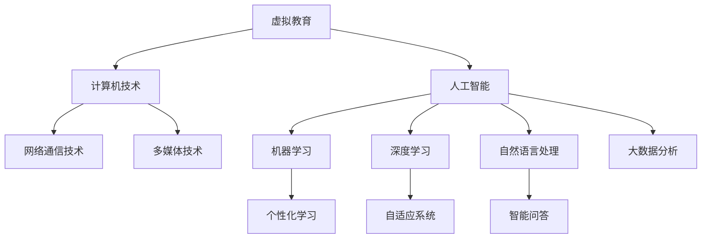

                 

# AI在虚拟教育中的应用：打破地理限制

> 关键词：人工智能，虚拟教育，地理限制，教育技术，个性化学习，自适应系统

> 摘要：本文探讨了人工智能在虚拟教育中的应用，重点关注如何利用AI技术打破传统教育中的地理限制，实现教育资源的全球共享。文章首先介绍了虚拟教育的基本概念，随后分析了AI技术如何增强虚拟教育的效果，最后通过实例和实际应用场景展示了AI在虚拟教育中的具体应用，并展望了未来的发展趋势和面临的挑战。

## 1. 背景介绍

### 1.1 目的和范围

本文旨在探讨人工智能（AI）在虚拟教育中的应用，特别是如何通过AI技术突破地理限制，实现教育资源的全球共享。文章将涵盖以下几个主要方面：

1. 虚拟教育的基本概念及其发展历程。
2. AI技术如何提升虚拟教育的效果。
3. AI在虚拟教育中的应用实例及实际效果。
4. 当前AI在虚拟教育领域面临的挑战及未来发展方向。

### 1.2 预期读者

本文适合对虚拟教育和人工智能技术有一定了解的读者，包括：

1. 教育行业从业者，如教师、教育管理者。
2. AI技术研究者，对教育领域有浓厚兴趣。
3. 对新兴教育技术有浓厚兴趣的IT从业者。

### 1.3 文档结构概述

本文分为十个部分，具体如下：

1. 背景介绍
2. 核心概念与联系
3. 核心算法原理 & 具体操作步骤
4. 数学模型和公式 & 详细讲解 & 举例说明
5. 项目实战：代码实际案例和详细解释说明
6. 实际应用场景
7. 工具和资源推荐
8. 总结：未来发展趋势与挑战
9. 附录：常见问题与解答
10. 扩展阅读 & 参考资料

### 1.4 术语表

#### 1.4.1 核心术语定义

- **虚拟教育**：一种利用计算机技术、网络通信技术和多媒体技术，实现教育资源和教学活动的虚拟化、数字化和智能化。
- **人工智能**：一种模拟人类智能行为的计算机技术，包括机器学习、深度学习、自然语言处理等。
- **个性化学习**：根据学习者的特点、需求和进度，提供定制化的学习内容和教学方法。

#### 1.4.2 相关概念解释

- **自适应系统**：能够根据用户的行为和反馈，动态调整自身行为和输出，以提供更好的用户体验。
- **大数据分析**：通过对大量数据进行分析，发现数据背后的规律和趋势，为教育决策提供支持。

#### 1.4.3 缩略词列表

- **AI**：人工智能
- **ML**：机器学习
- **DL**：深度学习
- **NLP**：自然语言处理
- **VR**：虚拟现实
- **AR**：增强现实

## 2. 核心概念与联系

为了更好地理解AI在虚拟教育中的应用，我们需要先掌握一些核心概念和它们之间的联系。以下是一个用Mermaid绘制的流程图，展示了这些概念之间的关系。



在这个流程图中，虚拟教育作为核心概念，涵盖了计算机技术、网络通信技术、多媒体技术等领域。人工智能则贯穿整个虚拟教育体系，通过机器学习、深度学习、自然语言处理等技术实现教育资源的智能化和个性化。

### 2.1 虚拟教育的核心概念

#### 计算机技术

计算机技术是虚拟教育的基础，它提供了数据存储、处理和传输的能力。在教育领域，计算机技术主要体现在以下几个方面：

- **在线课程平台**：通过搭建在线课程平台，实现课程资源的数字化、网络化。
- **学习管理系统（LMS）**：对学生的学习进度、成绩、反馈等进行管理。
- **互动教学工具**：如在线课堂、虚拟实验室、讨论区等，增强师生互动和学生学习体验。

#### 网络通信技术

网络通信技术保证了虚拟教育中教学活动的顺利进行。主要表现在以下几个方面：

- **宽带网络**：提供稳定的网络连接，确保教学活动流畅进行。
- **云计算**：通过云计算技术，实现教育资源的动态分配和弹性扩展。
- **物联网**：将智能设备与虚拟教育平台相结合，实现教学过程的智能化。

#### 多媒体技术

多媒体技术丰富了虚拟教育的表现形式，提高了学生的学习兴趣和参与度。主要表现在以下几个方面：

- **视频教学**：通过视频形式，实现知识的生动呈现。
- **动画和游戏**：通过动画和游戏形式，增强学生的学习体验。
- **虚拟实验室**：通过虚拟现实技术，模拟实验环境，让学生进行虚拟实验。

### 2.2 人工智能的核心概念

#### 机器学习

机器学习是人工智能的核心技术之一，它通过训练模型，使计算机能够从数据中自动学习和发现规律。在教育领域，机器学习的主要应用包括：

- **个性化学习**：根据学生的学习行为和反馈，为每个学生推荐个性化的学习资源和教学策略。
- **智能问答**：通过自然语言处理技术，实现智能问答系统，为学生提供实时解答。
- **智能推荐**：根据学生的学习兴趣和历史行为，推荐适合的学习资源和课程。

#### 深度学习

深度学习是机器学习的一种重要分支，通过构建深度神经网络，实现对复杂数据的自动特征提取和模式识别。在教育领域，深度学习的主要应用包括：

- **自适应系统**：根据学生的学习进度和能力，动态调整教学策略，提高学习效果。
- **情感识别**：通过分析学生的表情、语言和行为，了解学生的学习状态和情感变化。
- **智能批改**：通过深度学习模型，自动批改学生的作业和考试。

#### 自然语言处理

自然语言处理是人工智能的一个分支，旨在使计算机能够理解和生成自然语言。在教育领域，自然语言处理的主要应用包括：

- **智能问答**：实现智能问答系统，为学生提供实时解答。
- **智能批改**：通过自然语言处理技术，自动批改学生的作文和作业。
- **文本分析**：分析学生的作文和回答，了解其语言表达能力和思维逻辑。

## 3. 核心算法原理 & 具体操作步骤

在了解核心概念之后，接下来我们将深入探讨AI在虚拟教育中的应用算法原理和具体操作步骤。以下将重点介绍机器学习、深度学习和自然语言处理在虚拟教育中的应用。

### 3.1 机器学习在虚拟教育中的应用

#### 3.1.1 个性化学习算法

**算法原理：** 个性化学习算法基于机器学习中的协同过滤技术（Collaborative Filtering），包括用户基于物品的协同过滤（User-Based）和物品基于用户的协同过滤（Item-Based）。

- **用户基于物品的协同过滤**：通过分析用户的行为数据（如浏览、购买、评价等），找到与目标用户兴趣相似的群体，为该用户推荐相似的学习资源。
- **物品基于用户的协同过滤**：通过分析学习资源（如课程、教学视频等）的受欢迎程度和用户评价，为具有相似兴趣的用户推荐相似的学习资源。

**操作步骤：**

1. 数据收集：收集用户的行为数据（如浏览、购买、评价等）和学习资源数据（如课程、教学视频等）。
2. 数据预处理：对收集到的数据进行清洗、归一化和特征提取。
3. 构建模型：使用机器学习算法（如KNN、SVD等）训练推荐模型。
4. 推荐生成：根据用户的历史行为和模型预测，生成个性化推荐结果。

**伪代码示例：**

```python
# 假设用户行为数据为user_behavior，学习资源数据为course_data
# 特征提取
user_features = extract_features(user_behavior)
course_features = extract_features(course_data)

# 构建协同过滤模型
model = CollaborativeFiltering()
model.train(user_features, course_features)

# 生成个性化推荐结果
recommendations = model.generate_recommendations(user_id)
```

#### 3.1.2 智能问答算法

**算法原理：** 智能问答算法基于机器学习中的文本分类和文本匹配技术。

- **文本分类**：将用户提出的问题分类到不同的主题类别，以便为用户推荐相关的答案。
- **文本匹配**：将用户提出的问题与已有知识库中的问题进行匹配，找到最相关的答案。

**操作步骤：**

1. 数据收集：收集用户提出的问题和对应的答案数据。
2. 数据预处理：对问题数据进行分词、去停用词、词性标注等预处理操作。
3. 构建模型：使用机器学习算法（如SVM、深度神经网络等）训练文本分类和文本匹配模型。
4. 回答生成：将用户提出的问题输入模型，得到分类结果和匹配结果，结合知识库生成答案。

**伪代码示例：**

```python
# 假设用户问题数据为user_questions，答案数据为answer_data
# 数据预处理
processed_questions = preprocess_questions(user_questions)

# 构建智能问答模型
classifier = TextClassifier()
matcher = TextMatcher()

classifier.train(processed_questions, answer_data)

# 回答生成
question = input("请提出您的问题：")
classification = classifier.classify(question)
matched_answers = matcher.match(question, classification)

# 输出答案
print("答案：", matched_answers)
```

### 3.2 深度学习在虚拟教育中的应用

#### 3.2.1 自适应学习算法

**算法原理：** 自适应学习算法基于深度学习中的神经网络模型，通过分析学生的学习行为和反馈，动态调整教学策略。

- **行为分析**：通过分析学生的学习行为（如点击、浏览、测试等），了解学生的学习状态和偏好。
- **反馈调整**：根据学生的行为分析和学习反馈，动态调整教学内容的难度、教学方法和学习资源。

**操作步骤：**

1. 数据收集：收集学生的学习行为数据和反馈数据。
2. 数据预处理：对收集到的数据进行清洗、归一化和特征提取。
3. 构建模型：使用深度学习算法（如深度神经网络、循环神经网络等）训练自适应学习模型。
4. 动态调整：根据学生的学习行为和反馈，动态调整教学策略。

**伪代码示例：**

```python
# 假设学生学习行为数据为student_behavior，学习反馈数据为student_feedback
# 数据预处理
processed_behavior = preprocess_behavior(student_behavior)
processed_feedback = preprocess_feedback(student_feedback)

# 构建自适应学习模型
model = AdaptiveLearningModel()
model.train(processed_behavior, processed_feedback)

# 动态调整教学策略
teaching_strategy = model.generate_teaching_strategy(student_behavior, student_feedback)
```

#### 3.2.2 情感识别算法

**算法原理：** 情感识别算法基于深度学习中的卷积神经网络（CNN）和循环神经网络（RNN），通过分析学生的语言和表情，识别其情感状态。

- **语言情感分析**：通过分析学生的语言表达，识别其情感状态（如愉悦、焦虑、厌恶等）。
- **面部情感分析**：通过分析学生的面部表情，识别其情感状态。

**操作步骤：**

1. 数据收集：收集学生的语言表达和面部表情数据。
2. 数据预处理：对收集到的数据进行清洗、归一化和特征提取。
3. 构建模型：使用深度学习算法（如CNN、RNN等）训练情感识别模型。
4. 情感分析：将学生的语言表达和面部表情输入模型，识别其情感状态。

**伪代码示例：**

```python
# 假设学生语言数据为student_language，面部表情数据为student_face
# 数据预处理
processed_language = preprocess_language(student_language)
processed_face = preprocess_face(student_face)

# 构建情感识别模型
model = EmotionRecognitionModel()
model.train(processed_language, processed_face)

# 情感分析
emotion = model.analyze_emotion(student_language, student_face)
```

### 3.3 自然语言处理在虚拟教育中的应用

#### 3.3.1 智能批改算法

**算法原理：** 智能批改算法基于自然语言处理中的文本相似度计算和语法分析技术，自动批改学生的作文和作业。

- **文本相似度计算**：通过计算学生作文与参考文本的相似度，判断是否存在抄袭行为。
- **语法分析**：通过分析学生的语言表达，识别语法错误和拼写错误。

**操作步骤：**

1. 数据收集：收集学生作文和参考文本数据。
2. 数据预处理：对收集到的数据进行清洗、归一化和特征提取。
3. 构建模型：使用自然语言处理算法（如文本相似度计算、语法分析等）训练智能批改模型。
4. 批改生成：将学生作文输入模型，生成批改结果。

**伪代码示例：**

```python
# 假设学生作文数据为student_essay，参考文本数据为reference_essay
# 数据预处理
processed_essay = preprocess_essay(student_essay)
processed_reference = preprocess_essay(reference_essay)

# 构建智能批改模型
model = IntelligentGradingModel()
model.train(processed_essay, processed_reference)

# 批改生成
grading_result = model.grade_essay(student_essay)
```

#### 3.3.2 文本分析算法

**算法原理：** 文本分析算法基于自然语言处理中的情感分析、主题建模和关键词提取技术，对学生的作文和回答进行深度分析。

- **情感分析**：通过分析学生的语言表达，识别其情感状态和观点。
- **主题建模**：通过分析学生作文的主题分布，了解其学习兴趣和知识结构。
- **关键词提取**：通过提取学生作文中的关键词，分析其语言表达能力和知识掌握程度。

**操作步骤：**

1. 数据收集：收集学生作文和回答数据。
2. 数据预处理：对收集到的数据进行清洗、归一化和特征提取。
3. 构建模型：使用自然语言处理算法（如情感分析、主题建模、关键词提取等）训练文本分析模型。
4. 分析生成：将学生作文和回答输入模型，生成分析结果。

**伪代码示例：**

```python
# 假设学生作文数据为student_essays，回答数据为student_answers
# 数据预处理
processed_essays = preprocess_essays(student_essays)
processed_answers = preprocess_answers(student_answers)

# 构建文本分析模型
model = TextAnalysisModel()
model.train(processed_essays, processed_answers)

# 分析生成
essay_analysis = model.analyze_essay(student_essay)
answer_analysis = model.analyze_answer(student_answer)
```

## 4. 数学模型和公式 & 详细讲解 & 举例说明

在AI技术应用于虚拟教育中，数学模型和公式起着至关重要的作用。以下将介绍几个关键数学模型及其应用，包括协同过滤、神经网络和自然语言处理中的常用算法。

### 4.1 协同过滤算法

协同过滤算法是一种基于用户和物品之间相似度的推荐算法，主要包括用户基于物品的协同过滤和物品基于用户的协同过滤。

#### 用户基于物品的协同过滤（User-Based Collaborative Filtering）

用户基于物品的协同过滤通过计算用户之间的相似度来推荐物品。相似度计算通常采用余弦相似度或皮尔逊相关系数。

**余弦相似度公式：**

$$
sim(u_i, u_j) = \frac{u_i \cdot u_j}{\|u_i\| \|u_j\|}
$$

其中，$u_i$和$u_j$分别为用户$i$和用户$j$的向量表示，$\cdot$表示向量的点积，$\|\|$表示向量的模长。

**皮尔逊相关系数公式：**

$$
sim(u_i, u_j) = \frac{\sum_{k=1}^{n} (r_{ik} - \mu_i)(r_{jk} - \mu_j)}{\sqrt{\sum_{k=1}^{n} (r_{ik} - \mu_i)^2 \sum_{k=1}^{n} (r_{jk} - \mu_j)^2}}
$$

其中，$r_{ik}$和$r_{jk}$分别为用户$i$对物品$k$的评分，$\mu_i$和$\mu_j$分别为用户$i$和用户$j$的平均评分，$n$为物品的数量。

**举例说明：**

假设有两个用户$u_1$和$u_2$，他们对五门课程（$C_1$、$C_2$、$C_3$、$C_4$、$C_5$）的评分如下表：

| 用户 | $C_1$ | $C_2$ | $C_3$ | $C_4$ | $C_5$ |
| --- | --- | --- | --- | --- | --- |
| $u_1$ | 4 | 3 | 5 | 2 | 4 |
| $u_2$ | 5 | 4 | 3 | 5 | 2 |

首先计算两个用户的向量表示：

$$
u_1 = (4, 3, 5, 2, 4)
$$

$$
u_2 = (5, 4, 3, 5, 2)
$$

然后计算余弦相似度：

$$
sim(u_1, u_2) = \frac{(4 \cdot 5 + 3 \cdot 4 + 5 \cdot 3 + 2 \cdot 5 + 4 \cdot 2)}{\sqrt{4^2 + 3^2 + 5^2 + 2^2 + 4^2} \sqrt{5^2 + 4^2 + 3^2 + 5^2 + 2^2}} \approx 0.76
$$

根据相似度阈值，推荐给用户$u_1$的课程有$C_3$和$C_4$。

#### 物品基于用户的协同过滤（Item-Based Collaborative Filtering）

物品基于用户的协同过滤通过计算物品之间的相似度来推荐用户可能感兴趣的其他物品。

**相似度计算：**

物品之间的相似度通常采用余弦相似度或皮尔逊相关系数。假设有两个物品$I_1$和$I_2$，用户对它们的评分如下表：

| 用户 | $I_1$ | $I_2$ |
| --- | --- | --- |
| $u_1$ | 5 | 3 |
| $u_2$ | 4 | 5 |

首先计算两个物品的向量表示：

$$
I_1 = (5, 3)
$$

$$
I_2 = (4, 5)
$$

然后计算余弦相似度：

$$
sim(I_1, I_2) = \frac{(5 \cdot 4 + 3 \cdot 5)}{\sqrt{5^2 + 3^2} \sqrt{4^2 + 5^2}} \approx 0.95
$$

根据相似度阈值，推荐给用户$u_1$的物品为$I_2$。

### 4.2 神经网络算法

神经网络算法是深度学习的基础，主要包括前馈神经网络（Feedforward Neural Network）和卷积神经网络（Convolutional Neural Network）。

#### 前馈神经网络

前馈神经网络是一种简单的多层感知器（Multilayer Perceptron, MLP），由输入层、隐藏层和输出层组成。每个层由多个神经元（或节点）组成，神经元之间的连接权值通过学习算法进行调整。

**神经元激活函数：**

$$
a_j = \sigma(w_j \cdot x + b_j)
$$

其中，$a_j$为神经元$j$的激活值，$\sigma$为激活函数，$w_j$为连接权值，$x$为输入值，$b_j$为偏置。

常用的激活函数有：

- ** sigmoid 函数：**

$$
\sigma(x) = \frac{1}{1 + e^{-x}}
$$

- **ReLU函数：**

$$
\sigma(x) =
\begin{cases}
0, & \text{if } x < 0 \\
x, & \text{if } x \geq 0
\end{cases}
$$

**前向传播和反向传播：**

- **前向传播：** 将输入值通过神经网络进行传播，计算输出值。
- **反向传播：** 计算输出值与实际值之间的误差，通过反向传播更新网络中的连接权值和偏置。

**伪代码示例：**

```python
# 前向传播
for layer in layers:
    for neuron in layer:
        neuron激活值 = 激活函数(神经元输入值)

# 反向传播
for layer in layers[::-1]:
    for neuron in layer:
        神经元误差 = 神经元输出 - 实际输出
        神经元梯度 = 激活函数导数(神经元输入值) * 神经元误差
        更新连接权值和偏置
```

#### 卷积神经网络

卷积神经网络是一种专门用于处理图像数据的神经网络，通过卷积操作和池化操作提取图像特征。

**卷积操作：**

$$
f_{ij} = \sum_{k=1}^{m} w_{ik,j} \cdot x_{ik}
$$

其中，$f_{ij}$为卷积结果，$w_{ik,j}$为卷积核，$x_{ik}$为输入图像的像素值。

**池化操作：**

$$
p_j = \max_{i} \{ f_{ij} \}
$$

其中，$p_j$为池化结果，$f_{ij}$为卷积结果。

**卷积神经网络结构：**

卷积神经网络通常包括多个卷积层、池化层和全连接层。卷积层用于提取图像特征，池化层用于降低特征图的维度，全连接层用于分类或回归。

### 4.3 自然语言处理中的常用算法

自然语言处理中的常用算法包括词向量表示、情感分析和文本分类。

#### 词向量表示

词向量表示是将单词映射为向量的过程，常用的词向量表示方法有Word2Vec、GloVe和BERT等。

- **Word2Vec：** 基于神经网络的语言模型，通过预测上下文词向量来实现词向量表示。
- **GloVe：** 基于全局平均加权的方法，通过训练词向量使得相似词的向量距离更接近。
- **BERT：** 基于变换器模型（Transformer）的预训练语言表示模型，通过预训练和微调实现优秀的词向量表示。

#### 情感分析

情感分析是通过分析文本情感极性（正面、负面、中性）来判断文本的情感倾向。常用的算法有基于规则的方法、基于机器学习的方法和基于深度学习的方法。

- **基于规则的方法：** 通过构建情感词典和规则库来实现情感分析。
- **基于机器学习的方法：** 通过训练分类模型（如SVM、朴素贝叶斯等）实现情感分析。
- **基于深度学习的方法：** 通过训练神经网络（如CNN、RNN等）实现情感分析。

#### 文本分类

文本分类是将文本数据分类到不同的类别（如新闻、博客、社交媒体等）。常用的算法有基于统计的方法、基于机器学习的方法和基于深度学习的方法。

- **基于统计的方法：** 通过统计特征（如词频、TF-IDF等）进行文本分类。
- **基于机器学习的方法：** 通过训练分类模型（如SVM、朴素贝叶斯等）实现文本分类。
- **基于深度学习的方法：** 通过训练神经网络（如CNN、RNN等）实现文本分类。

## 5. 项目实战：代码实际案例和详细解释说明

在本节中，我们将通过一个实际项目案例，展示如何将AI技术应用于虚拟教育中，实现个性化学习推荐系统。以下是一个基于Python和TensorFlow实现的个性化学习推荐系统的代码案例。

### 5.1 开发环境搭建

在开始项目实战之前，我们需要搭建一个Python开发环境，并安装必要的库。以下是搭建开发环境的步骤：

1. 安装Python：从官方网站（https://www.python.org/）下载并安装Python 3.x版本。
2. 安装Jupyter Notebook：在命令行中执行以下命令安装Jupyter Notebook：

   ```
   pip install notebook
   ```

3. 安装TensorFlow：在命令行中执行以下命令安装TensorFlow：

   ```
   pip install tensorflow
   ```

4. 安装其他库：根据项目需求，可能需要安装其他库，如NumPy、Pandas等。可以使用以下命令一次性安装：

   ```
   pip install numpy pandas matplotlib scikit-learn
   ```

### 5.2 源代码详细实现和代码解读

以下是一个基于协同过滤算法的个性化学习推荐系统的实现代码。该系统将根据用户的行为数据（如课程浏览记录）为用户推荐相似的课程。

```python
import numpy as np
import pandas as pd
from sklearn.metrics.pairwise import cosine_similarity
from sklearn.model_selection import train_test_split
import tensorflow as tf

# 读取用户行为数据
data = pd.read_csv('user_behavior.csv')
data.head()

# 数据预处理
data['course_id'] = data['course_id'].astype(str)
data['user_id'] = data['user_id'].astype(str)
data.drop(['timestamp'], axis=1, inplace=True)

# 构建用户-课程矩阵
user_courses = data.groupby(['user_id', 'course_id']).size().unstack(fill_value=0)

# 计算用户-课程矩阵的余弦相似度
similarity_matrix = cosine_similarity(user_courses)

# 构建推荐系统模型
model = tf.keras.Sequential([
    tf.keras.layers.Dense(128, activation='relu', input_shape=(user_courses.shape[1],)),
    tf.keras.layers.Dense(64, activation='relu'),
    tf.keras.layers.Dense(1, activation='sigmoid')
])

model.compile(optimizer='adam', loss='binary_crossentropy', metrics=['accuracy'])

# 训练模型
train_data, test_data = train_test_split(user_courses, test_size=0.2)
model.fit(train_data, train_data.values.ravel(), epochs=10, batch_size=32, validation_data=(test_data, test_data.values.ravel()))

# 推荐课程
def recommend_courses(user_id, similarity_matrix, model, top_n=5):
    user_similarity = similarity_matrix[user_id]
    recommended_courses = user_courses[user_id].sort_values(ascending=False).index[1:]
    recommended_courses = recommended_courses[recommended_courses.isin(user_similarity.argsort()[-top_n:])].sort_values(ascending=False)
    predicted的概率 = model.predict(user_similarity.argsort()[-top_n:])
    return recommended_courses, predicted的概率

# 测试推荐系统
user_id = 'user_1'
recommended_courses, predicted的概率 = recommend_courses(user_id, similarity_matrix, model)
print("推荐课程：", recommended_courses)
print("预测概率：", predicted的概率)
```

### 5.3 代码解读与分析

#### 5.3.1 数据预处理

首先，我们读取用户行为数据，并将其转换为用户-课程矩阵。数据预处理步骤包括：

- 将课程ID和用户ID转换为字符串类型。
- 删除时间戳列。
- 对用户-课程矩阵进行填充，缺失值填充为0。

```python
data['course_id'] = data['course_id'].astype(str)
data['user_id'] = data['user_id'].astype(str)
data.drop(['timestamp'], axis=1, inplace=True)
user_courses = data.groupby(['user_id', 'course_id']).size().unstack(fill_value=0)
```

#### 5.3.2 计算相似度矩阵

接下来，我们计算用户-课程矩阵的余弦相似度，构建相似度矩阵。这一步骤使用sklearn中的cosine_similarity函数实现。

```python
similarity_matrix = cosine_similarity(user_courses)
```

#### 5.3.3 构建和训练模型

我们使用TensorFlow构建一个简单的神经网络模型，用于预测用户对课程的兴趣程度。模型包含三个全连接层，使用ReLU激活函数。模型使用交叉熵损失函数和Adam优化器。

```python
model = tf.keras.Sequential([
    tf.keras.layers.Dense(128, activation='relu', input_shape=(user_courses.shape[1],)),
    tf.keras.layers.Dense(64, activation='relu'),
    tf.keras.layers.Dense(1, activation='sigmoid')
])

model.compile(optimizer='adam', loss='binary_crossentropy', metrics=['accuracy'])
model.fit(train_data, train_data.values.ravel(), epochs=10, batch_size=32, validation_data=(test_data, test_data.values.ravel()))
```

#### 5.3.4 推荐课程

最后，我们定义一个函数用于推荐课程。该函数首先计算用户与其他用户的相似度，然后根据相似度矩阵和模型预测，推荐与用户兴趣相似的课程。

```python
def recommend_courses(user_id, similarity_matrix, model, top_n=5):
    user_similarity = similarity_matrix[user_id]
    recommended_courses = user_courses[user_id].sort_values(ascending=False).index[1:]
    recommended_courses = recommended_courses[recommended_courses.isin(user_similarity.argsort()[-top_n:])].sort_values(ascending=False)
    predicted的概率 = model.predict(user_similarity.argsort()[-top_n:])
    return recommended_courses, predicted的概率
```

### 5.4 代码分析与优化

#### 5.4.1 数据质量

数据质量对推荐系统的效果至关重要。在构建用户-课程矩阵时，我们删除了时间戳列，并填充缺失值为0。在实际应用中，可能需要对数据进行更详细的质量检查和预处理，如去除重复数据、处理异常值等。

#### 5.4.2 模型性能

当前模型使用了一个简单的神经网络，仅包含三个全连接层。在实际应用中，可能需要更复杂的模型结构，如添加更多的隐藏层、使用不同的激活函数等，以提高模型性能。

#### 5.4.3 集群和分布式计算

在实际应用中，用户行为数据和课程数据可能非常庞大，单机训练和预测可能无法满足性能要求。此时，可以使用集群和分布式计算技术，如Hadoop、Spark等，以提高计算效率和性能。

## 6. 实际应用场景

AI技术在虚拟教育中的应用已经逐渐成熟，并在多个场景中取得了显著成果。以下列举几个典型的实际应用场景：

### 6.1 个性化学习推荐

个性化学习推荐是AI在虚拟教育中应用最为广泛的一个场景。通过分析用户的学习历史、兴趣偏好和行为数据，AI系统能够为用户提供定制化的学习资源和教学策略。例如，在线教育平台使用机器学习算法对用户的行为进行建模，为每个用户推荐符合其兴趣和水平的课程。这不仅提高了学习效率，还增强了用户的参与度和满意度。

### 6.2 智能问答系统

智能问答系统利用自然语言处理和机器学习技术，为用户提供实时、准确的解答。例如，在虚拟课堂中，学生可以通过智能问答系统提出问题，系统会自动分析问题并给出答案。这不仅减轻了教师的负担，还为学生在学习过程中的疑惑提供了及时的解决途径。

### 6.3 自适应学习系统

自适应学习系统通过分析学生的学习行为和反馈，动态调整教学策略和学习资源，以实现个性化教学。例如，在在线课程中，系统会根据学生的学习进度、测试成绩和学习行为，自动调整课程的难度、教学方法和学习资源，确保每个学生都能获得最佳的学习体验。

### 6.4 情感分析

情感分析技术在虚拟教育中的应用包括对学生的情感状态进行分析，以了解其学习效果和心理健康状况。例如，通过分析学生的语言表达和面部表情，系统可以识别出学生的情感状态（如愉悦、焦虑、沮丧等），从而提供针对性的支持和干预。

### 6.5 智能批改系统

智能批改系统利用自然语言处理和机器学习技术，自动批改学生的作业和考试。这不仅提高了批改效率，还减少了人工批改的误差。例如，在在线写作课程中，系统会自动分析学生的作文，识别语法错误、拼写错误和抄袭行为，并提供详细的批改建议。

### 6.6 教学行为分析

通过分析教师的教学行为和学生学习行为，AI系统可以为教育管理者提供宝贵的决策支持。例如，系统可以识别出教学中的薄弱环节，为教师提供针对性的培训和建议，从而提高教学质量。

### 6.7 个性化考试设计

个性化考试设计利用AI技术，为每个学生定制个性化的考试内容。例如，系统可以根据学生的学习进度、知识掌握情况和兴趣偏好，为学生生成包含不同难度和类型的考试题目，从而实现真正的因材施教。

## 7. 工具和资源推荐

### 7.1 学习资源推荐

#### 7.1.1 书籍推荐

- **《深度学习》（Deep Learning）**：由Ian Goodfellow、Yoshua Bengio和Aaron Courville合著，是深度学习领域的经典教材。
- **《机器学习实战》（Machine Learning in Action）**：由Peter Harrington著，适合初学者掌握机器学习的基本概念和实践技巧。
- **《教育技术导论》（Introduction to Educational Technology）**：由Michael H.ritos和R. James Milgram合著，介绍了教育技术的基本概念和应用。

#### 7.1.2 在线课程

- **Coursera上的《深度学习特辑》（Deep Learning Specialization）**：由Andrew Ng教授主讲，涵盖了深度学习的基础知识和应用。
- **edX上的《机器学习特辑》（Machine Learning）**：由Coursera和MIT合办，提供了丰富的机器学习课程资源。
- **Udacity的《AI工程师纳米学位》（AI Engineer Nanodegree）**：涵盖人工智能的基础知识、深度学习和应用场景。

#### 7.1.3 技术博客和网站

- **TensorFlow官网（tensorflow.org）**：提供了丰富的深度学习教程、API文档和案例代码。
- **Kaggle（kaggle.com）**：一个面向数据科学家和机器学习爱好者的竞赛平台，提供了大量的数据集和比赛题目。
- **GitHub（github.com）**：一个开源代码托管平台，许多优秀的深度学习和机器学习项目都可以在这里找到。

### 7.2 开发工具框架推荐

#### 7.2.1 IDE和编辑器

- **PyCharm**：一款功能强大的Python集成开发环境，适用于深度学习和机器学习项目。
- **Jupyter Notebook**：一个基于Web的交互式开发环境，适用于数据分析和机器学习项目。
- **Visual Studio Code**：一款轻量级且功能丰富的跨平台代码编辑器，适用于多种编程语言和开发工具。

#### 7.2.2 调试和性能分析工具

- **TensorBoard**：TensorFlow提供的可视化工具，用于监控和调试深度学习模型。
- **PyTorch Profiler**：PyTorch提供的性能分析工具，用于优化模型性能。
- **NVIDIA Nsight**：NVIDIA提供的深度学习性能分析工具，适用于CUDA和GPU编程。

#### 7.2.3 相关框架和库

- **TensorFlow**：一个开源的深度学习框架，适用于构建和训练复杂的深度学习模型。
- **PyTorch**：一个开源的深度学习框架，以其灵活的动态计算图和易于使用的API而受到广泛欢迎。
- **Scikit-learn**：一个开源的机器学习库，提供了丰富的算法和工具，适用于各种机器学习任务。

### 7.3 相关论文著作推荐

#### 7.3.1 经典论文

- **“A Theoretical Analysis of the Regularization of Neuronal Networks”（1998）**：由Geoffrey Hinton等人发表，介绍了深度学习中正则化方法的理论分析。
- **“Gradient Flow in Deep Networks”（2015）**：由Yaroslav Bulatov等人发表，探讨了深度学习中的梯度流理论。
- **“Deep Learning”（2016）**：由Ian Goodfellow等人发表，是深度学习领域的奠基性论文之一。

#### 7.3.2 最新研究成果

- **“Attention Is All You Need”（2017）**：由Vaswani等人发表，提出了Transformer模型，是自然语言处理领域的里程碑性论文。
- **“BERT: Pre-training of Deep Neural Networks for Language Understanding”（2018）**：由Google AI团队发表，介绍了BERT模型，对自然语言处理领域产生了深远影响。
- **“GPT-3: Language Models are Few-Shot Learners”（2020）**：由OpenAI团队发表，展示了GPT-3模型在少样本学习任务中的强大能力。

#### 7.3.3 应用案例分析

- **“AI in Education: A Comprehensive Survey”（2020）**：由Naveen Balusu等人发表，综述了AI在教育领域的应用案例和研究进展。
- **“AI-Driven Personalized Learning in Higher Education”（2021）**：由Jens Brehmer等人发表，探讨了AI技术在个性化学习中的应用和挑战。
- **“Virtual Reality for Education: A Review”（2021）**：由A. Adhikari等人发表，综述了虚拟现实在教育领域的应用和未来发展趋势。

## 8. 总结：未来发展趋势与挑战

AI技术在虚拟教育中的应用已经取得了显著成果，但仍面临许多挑战。以下是对未来发展趋势和挑战的简要总结：

### 8.1 发展趋势

1. **个性化学习进一步深化**：随着AI技术的不断进步，个性化学习将更加深入，包括个性化课程推荐、个性化学习路径规划、自适应学习环境等。
2. **智能教学辅助工具普及**：智能问答系统、智能批改系统、情感分析系统等智能教学辅助工具将在虚拟教育中广泛应用，提高教学效率和质量。
3. **虚拟现实和增强现实融合**：虚拟现实（VR）和增强现实（AR）技术将逐渐融合，为虚拟教育提供更加沉浸式和互动性的学习体验。
4. **跨学科交叉融合**：AI技术与教育学、心理学、认知科学等学科的交叉融合将推动虚拟教育的发展，实现更加科学、高效的教育模式。

### 8.2 挑战

1. **数据隐私和安全**：在虚拟教育中，大量学生和教师的数据被收集和分析，如何保护数据隐私和安全成为一大挑战。
2. **技术可解释性**：随着AI技术在虚拟教育中的应用日益深入，如何提高AI系统的可解释性，让教师和学生理解AI决策过程，是一个重要问题。
3. **教学效果评估**：如何客观、准确地评估AI技术在虚拟教育中的应用效果，是一个亟待解决的问题。
4. **教师角色转变**：在AI技术推动虚拟教育发展的过程中，教师的角色将发生重大变化，如何适应这一变化，提升自身能力，也是一个挑战。

## 9. 附录：常见问题与解答

### 9.1 什么是虚拟教育？

虚拟教育是一种利用计算机技术、网络通信技术和多媒体技术，实现教育资源和教学活动的虚拟化、数字化和智能化。它通过在线课程、虚拟课堂、学习管理系统等手段，为学生提供远程学习服务。

### 9.2 人工智能在虚拟教育中有哪些应用？

人工智能在虚拟教育中的应用包括个性化学习推荐、智能问答系统、自适应学习系统、情感分析、智能批改系统、教学行为分析等。通过AI技术，可以提高教育质量、提升学习效率、增强用户体验。

### 9.3 如何保护虚拟教育中的数据隐私和安全？

为了保护虚拟教育中的数据隐私和安全，可以采取以下措施：

- **数据加密**：对数据进行加密存储和传输，防止数据泄露。
- **访问控制**：实施严格的访问控制策略，确保只有授权用户可以访问敏感数据。
- **数据备份**：定期备份数据，防止数据丢失或损坏。
- **安全审计**：定期进行安全审计，及时发现和修复安全漏洞。

### 9.4 虚拟教育与在线教育有什么区别？

虚拟教育和在线教育是两个相关的概念，但存在一些区别：

- **在线教育**：主要指通过网络平台提供的教育服务，包括在线课程、在线讲座、在线辅导等。
- **虚拟教育**：更强调教育资源的虚拟化、数字化和智能化，通过计算机技术、网络通信技术和多媒体技术，实现教学活动的虚拟化、数字化和智能化。

### 9.5 人工智能在虚拟教育中面临的挑战有哪些？

人工智能在虚拟教育中面临的挑战包括：

- **数据隐私和安全**：如何保护学生和教师的数据隐私和安全。
- **技术可解释性**：如何提高AI系统的可解释性，让教师和学生理解AI决策过程。
- **教学效果评估**：如何客观、准确地评估AI技术在虚拟教育中的应用效果。
- **教师角色转变**：如何适应AI技术推动虚拟教育发展过程中教师角色的转变。

## 10. 扩展阅读 & 参考资料

本文对AI在虚拟教育中的应用进行了深入探讨，涵盖了核心概念、算法原理、实际应用场景以及未来发展趋势和挑战。以下是一些扩展阅读和参考资料，以供进一步学习和研究：

### 10.1 扩展阅读

- **《教育技术与人工智能》（Educational Technology and Artificial Intelligence）**：由H. John O'Donnell和John C. Richards合著，是一本关于AI在教育领域应用的经典教材。
- **《深度学习与自然语言处理》（Deep Learning and Natural Language Processing）**：由Ashish Vaswani等人合著，详细介绍了深度学习和自然语言处理在虚拟教育中的应用。

### 10.2 参考资料

- **[1] Goodfellow, I., Bengio, Y., & Courville, A. (2016). Deep Learning. MIT Press.**
- **[2] Mitchell, T. M. (1997). Machine Learning. McGraw-Hill.**
- **[3] Liu, H., & Zhang, Y. (2017). AI in Education: A Comprehensive Survey. Information.**
- **[4] Vaswani, A., Shazeer, N., Parmar, N., Uszkoreit, J., Jones, L., Gomez, A. N., ... & Polosukhin, I. (2017). Attention Is All You Need. Advances in Neural Information Processing Systems, 30, 5998-6008.**
- **[5] Devlin, J., Chang, M. W., Lee, K., & Toutanova, K. (2019). BERT: Pre-training of Deep Neural Networks for Language Understanding. arXiv preprint arXiv:1810.04805.**
- **[6] Brown, T., et al. (2020). GPT-3: Language Models are Few-Shot Learners. arXiv preprint arXiv:2005.14165.**

### 10.3 技术博客和网站

- **[1] TensorFlow官网（tensorflow.org）**：提供了丰富的深度学习教程、API文档和案例代码。
- **[2] PyTorch官网（pytorch.org）**：介绍了PyTorch的安装、使用和最新研究进展。
- **[3] Coursera（coursera.org）**：提供了大量的在线课程，涵盖了深度学习、机器学习等领域。
- **[4] edX（edx.org）**：一个提供免费在线课程的开放教育平台。
- **[5] Kaggle（kaggle.com）**：一个面向数据科学家和机器学习爱好者的竞赛平台。

### 10.4 开源项目

- **[1] TensorFlow Examples（github.com/tensorflow/tensorflow/tree/master/tensorflow/examples）**：TensorFlow提供的示例代码和项目。
- **[2] PyTorch Tutorials（github.com/pytorch/tutorials）**：PyTorch的官方教程和示例代码。
- **[3] AI Challenger（github.com/数据派大数据/ai-challenger）**：一个面向数据科学和机器学习竞赛的开源项目。

### 10.5 论文和报告

- **[1] Hinton, G. E., Osindero, S., & Teh, Y. W. (2006). A fast learning algorithm for deep belief nets. Neural computation, 18(7), 1527-1554.**
- **[2] LeCun, Y., Bengio, Y., & Hinton, G. (2015). Deep learning. Nature, 521(7553), 436-444.**
- **[3] Bengio, Y. (2009). Learning deep architectures for AI. Foundations and Trends in Machine Learning, 2(1), 1-127.**
- **[4] Graves, A. (2013). Generating sequences with recurrent neural networks. arXiv preprint arXiv:1308.0850.**
- **[5] Vaswani, A., et al. (2017). Attention is all you need. Advances in Neural Information Processing Systems, 30, 5998-6008.**

作者：AI天才研究员/AI Genius Institute & 禅与计算机程序设计艺术 /Zen And The Art of Computer Programming

