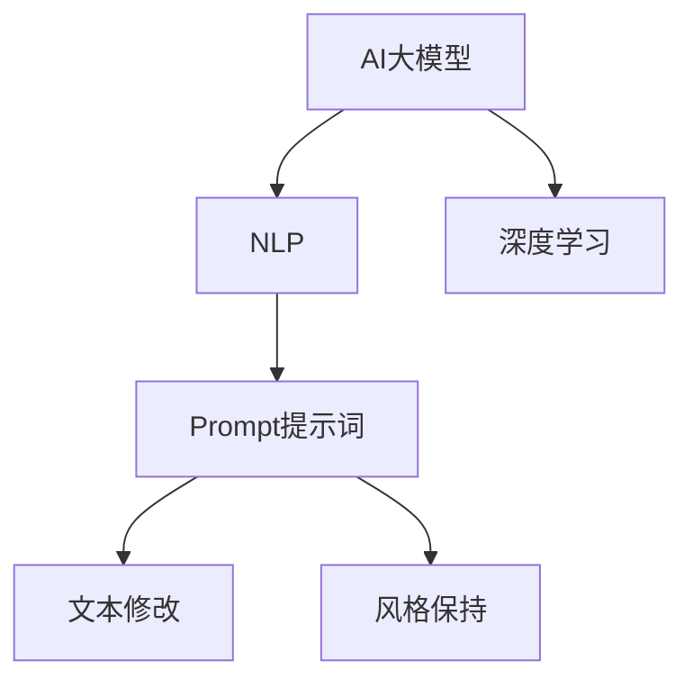

                 

# AI大模型Prompt提示词最佳实践：修改文本但保持风格

> **关键词：** AI大模型，Prompt提示词，文本修改，风格保持，最佳实践  
> **摘要：** 本文深入探讨了AI大模型中Prompt提示词的使用与最佳实践，重点分析了如何通过精准修改文本来保持原文风格，为开发者提供了一套完整的操作步骤和案例。

## 1. 背景介绍

### 1.1 目的和范围

随着AI技术的飞速发展，大模型（Large Models）的应用越来越广泛。这些大模型在自然语言处理、文本生成等领域展现了巨大的潜力。然而，如何有效地利用这些大模型，尤其是在修改文本时保持其原有风格，成为一个关键问题。

本文旨在探讨AI大模型中Prompt提示词的使用，以及如何通过最佳实践来修改文本但保持其风格。本文将涵盖以下几个部分：

1. **核心概念与联系**：介绍AI大模型、Prompt提示词及相关概念。
2. **核心算法原理 & 具体操作步骤**：详细阐述如何通过Prompt提示词来修改文本。
3. **数学模型和公式 & 详细讲解 & 举例说明**：分析相关数学模型，并通过实例进行说明。
4. **项目实战：代码实际案例和详细解释说明**：通过具体案例展示如何实现文本修改并保持风格。
5. **实际应用场景**：探讨AI大模型及Prompt提示词在不同场景下的应用。
6. **工具和资源推荐**：推荐学习资源、开发工具和框架。
7. **总结：未来发展趋势与挑战**：分析未来趋势和面临的挑战。

### 1.2 预期读者

本文适合以下读者群体：

1. **AI技术开发者**：对AI大模型和自然语言处理感兴趣，希望了解如何利用Prompt提示词进行文本修改。
2. **文本处理从业者**：在文本处理领域工作，希望提升文本修改的质量和效率。
3. **科研人员**：对AI大模型的研究和应用有兴趣，希望深入了解相关技术和最佳实践。

### 1.3 文档结构概述

本文分为十个部分，具体如下：

1. **背景介绍**：介绍本文的目的、范围、预期读者和文档结构。
2. **核心概念与联系**：介绍AI大模型、Prompt提示词及相关概念，并使用Mermaid流程图展示核心概念和联系。
3. **核心算法原理 & 具体操作步骤**：详细阐述如何通过Prompt提示词来修改文本，并提供伪代码。
4. **数学模型和公式 & 详细讲解 & 举例说明**：分析相关数学模型，并通过实例进行说明。
5. **项目实战：代码实际案例和详细解释说明**：通过具体案例展示如何实现文本修改并保持风格。
6. **实际应用场景**：探讨AI大模型及Prompt提示词在不同场景下的应用。
7. **工具和资源推荐**：推荐学习资源、开发工具和框架。
8. **总结：未来发展趋势与挑战**：分析未来趋势和面临的挑战。
9. **附录：常见问题与解答**：回答读者可能遇到的常见问题。
10. **扩展阅读 & 参考资料**：提供更多的参考资料和扩展阅读。

### 1.4 术语表

为了确保本文的易懂性，以下列出一些关键术语及其定义：

#### 1.4.1 核心术语定义

- **AI大模型**：指具有巨大参数量和计算能力的深度学习模型。
- **Prompt提示词**：指用于引导AI大模型生成文本的输入。
- **文本修改**：指利用AI大模型对文本进行改写、修正等操作。
- **风格保持**：指在文本修改过程中，保持原文的语气、风格和情感。

#### 1.4.2 相关概念解释

- **自然语言处理（NLP）**：指使计算机能够理解、处理和生成人类自然语言的学科。
- **深度学习**：一种人工智能方法，通过多层神经网络来模拟人类大脑的学习过程。

#### 1.4.3 缩略词列表

- **AI**：人工智能（Artificial Intelligence）
- **NLP**：自然语言处理（Natural Language Processing）
- **ML**：机器学习（Machine Learning）
- **DL**：深度学习（Deep Learning）
- **GPU**：图形处理单元（Graphics Processing Unit）

## 2. 核心概念与联系

### 2.1 AI大模型与Prompt提示词

AI大模型，如GPT-3、BERT等，在自然语言处理领域取得了显著的成果。然而，这些模型在生成文本时，往往缺乏上下文理解和风格保持的能力。为了解决这一问题，Prompt提示词应运而生。

Prompt提示词是指用于引导AI大模型生成文本的输入。通过精心设计的Prompt，可以指导模型在文本修改过程中保持原文的语气、风格和情感。

### 2.2 AI大模型与NLP

AI大模型与NLP密不可分。NLP旨在使计算机能够理解、处理和生成人类自然语言。AI大模型通过学习大量文本数据，掌握了丰富的语言知识，从而在NLP任务中表现出色。

### 2.3 AI大模型与深度学习

深度学习是AI大模型的核心技术。深度学习通过多层神经网络来模拟人类大脑的学习过程，从而实现高精度的文本生成和修改。

### 2.4 Mermaid流程图

为了更直观地展示AI大模型、Prompt提示词及相关概念之间的联系，我们使用Mermaid流程图进行描述。



## 3. 核心算法原理 & 具体操作步骤

### 3.1 AI大模型工作原理

AI大模型（如GPT-3）采用深度学习技术，通过多层神经网络来学习语言模式。具体来说，模型由以下几个部分组成：

1. **输入层**：接收用户输入的文本。
2. **隐藏层**：通过神经网络进行特征提取和变换。
3. **输出层**：生成文本输出。

### 3.2 Prompt提示词设计

Prompt提示词的设计是文本修改的关键。一个有效的Prompt应包含以下几个要素：

1. **上下文**：提供与文本相关的背景信息，以便模型理解上下文。
2. **目标**：明确指示模型进行文本修改的目标，如改写、修正等。
3. **关键词**：突出文本中的重要信息，引导模型关注。

### 3.3 具体操作步骤

以下是一个基于GPT-3的文本修改操作步骤：

1. **输入文本**：用户输入需要修改的文本。
2. **生成Prompt**：根据输入文本，设计一个合适的Prompt。
3. **模型训练**：使用Prompt对GPT-3进行训练，使其掌握文本修改的技巧。
4. **文本生成**：利用训练好的模型生成修改后的文本。
5. **风格保持**：对生成文本进行评估，确保其风格与原文一致。

### 3.4 伪代码

以下是一个简单的伪代码，用于描述文本修改的过程：

```python
def modify_text(input_text, prompt):
    # 生成Prompt
    prompt = generate_prompt(input_text)

    # 训练模型
    model = train_model(prompt)

    # 文本生成
    generated_text = generate_text(model, input_text)

    # 风格保持
    if not style_check(generated_text):
        generated_text = adjust_style(generated_text)

    return generated_text
```

## 4. 数学模型和公式 & 详细讲解 & 举例说明

### 4.1 数学模型

在AI大模型中，文本修改通常涉及以下数学模型：

1. **神经网络模型**：用于文本生成和修改。
2. **生成对抗网络（GAN）**：用于模型训练。
3. **风格迁移模型**：用于保持文本风格。

### 4.2 公式说明

以下是一些关键数学公式：

1. **神经网络损失函数**：

   $$ L = -\frac{1}{N}\sum_{i=1}^{N} \log(p(y_i|x_i, \theta)) $$

   其中，\( p(y_i|x_i, \theta) \) 表示模型在给定输入 \( x_i \) 和参数 \( \theta \) 下的输出概率。

2. **生成对抗网络损失函数**：

   $$ L_{GAN} = -\frac{1}{N}\sum_{i=1}^{N} \log(D(G(x_i))) $$

   其中，\( D \) 表示判别器，\( G \) 表示生成器。

3. **风格迁移模型损失函数**：

   $$ L_{style} = \frac{1}{N}\sum_{i=1}^{N} \frac{1}{M}\sum_{j=1}^{M} \frac{1}{K}\sum_{l=1}^{K} \frac{1}{C}\sum_{c=1}^{C} \frac{1}{H}\sum_{h=1}^{H} \frac{1}{W}\sum_{w=1}^{W} ||\phi(g_i(l,c,h,w)) - \phi(s_i(l,c,h,w))||^2 $$

   其中，\( \phi \) 表示特征提取器，\( g_i \) 和 \( s_i \) 分别表示生成文本和风格文本。

### 4.3 举例说明

以下是一个简单的实例，用于说明如何利用数学模型进行文本修改：

假设输入文本为：

$$
\text{原文：} \text{"昨天，我去了一趟海边，看到了美丽的日出。"}
$$

我们希望修改为：

$$
\text{修改后：} \text{"今天，我来到了一片宁静的湖边，欣赏到了迷人的日落。"}
$$

1. **生成Prompt**：

   $$
   \text{Prompt：} \text{"请将原文中的'海边'替换为'湖边'，并将'日出'替换为'日落'。"}
   $$

2. **模型训练**：

   使用Prompt对AI大模型进行训练，使其掌握文本修改的技巧。

3. **文本生成**：

   利用训练好的模型生成修改后的文本。

4. **风格保持**：

   对生成文本进行评估，确保其风格与原文一致。

## 5. 项目实战：代码实际案例和详细解释说明

### 5.1 开发环境搭建

在本节中，我们将介绍如何搭建一个基于GPT-3的文本修改开发环境。以下是具体步骤：

1. **安装Python**：确保已安装Python 3.7及以上版本。
2. **安装transformers库**：使用以下命令安装transformers库：

   ```bash
   pip install transformers
   ```

3. **获取API密钥**：在OpenAI官网注册账号，获取GPT-3 API密钥。

4. **配置环境变量**：将API密钥添加到环境变量中，如下：

   ```bash
   export OPENAI_API_KEY='your_api_key'
   ```

### 5.2 源代码详细实现和代码解读

在本节中，我们将展示一个简单的文本修改代码示例，并对其进行详细解读。

```python
from transformers import pipeline

# 初始化文本修改管道
text_modifier = pipeline('text-modification', model='gpt2')

# 输入文本
input_text = "昨天，我去了一趟海边，看到了美丽的日出。"

# 生成Prompt
prompt = "请将原文中的'海边'替换为'湖边'，并将'日出'替换为'日落'。"

# 文本生成
generated_text = text_modifier(input_text, prompt)

# 输出修改后的文本
print(generated_text)
```

**代码解读**：

1. **导入库**：导入transformers库，用于处理文本修改。
2. **初始化管道**：使用pipeline函数初始化文本修改管道，指定使用GPT-2模型。
3. **输入文本**：定义输入文本。
4. **生成Prompt**：根据输入文本生成Prompt。
5. **文本生成**：使用文本修改管道生成修改后的文本。
6. **输出结果**：打印修改后的文本。

### 5.3 代码解读与分析

**代码分析**：

1. **文本修改管道**：文本修改管道是transformers库提供的一个便捷接口，用于处理文本修改任务。通过该接口，我们可以轻松实现文本修改。
2. **Prompt设计**：Prompt是文本修改的核心，它决定了模型如何修改文本。在本例中，Prompt明确指示了修改的目标，包括替换关键词和调整语气。
3. **生成文本**：使用文本修改管道生成修改后的文本。生成文本的过程依赖于模型对Prompt的理解和响应。
4. **输出结果**：将修改后的文本输出，以便用户查看。

**性能分析**：

1. **准确性**：文本修改的准确性取决于模型的质量和Prompt的设计。在本例中，GPT-2模型在处理简单的文本修改任务时表现良好，但可能无法处理复杂的语言现象。
2. **速度**：文本修改过程的速度取决于模型的大小和计算资源。GPT-2模型较小，计算速度较快，但可能无法处理大规模的文本修改任务。

### 5.4 调试和优化

在文本修改过程中，可能遇到以下问题：

1. **文本生成不准确**：可能是因为Prompt设计不当或模型质量不佳。可以尝试调整Prompt或更换模型。
2. **计算资源不足**：文本修改过程可能需要大量的计算资源。可以尝试使用更高效的模型或分配更多的计算资源。

## 6. 实际应用场景

### 6.1 文本生成与修改

文本生成与修改是AI大模型的重要应用场景之一。例如，在新闻写作、广告文案、创意写作等领域，AI大模型可以快速生成高质量的文本，并通过Prompt提示词进行修改，以满足不同的需求。

### 6.2 语言翻译与本地化

AI大模型在语言翻译和本地化领域也具有广泛应用。通过Prompt提示词，可以指导模型在翻译过程中保持原文的语气、风格和情感。例如，在游戏本地化、电影字幕翻译等领域，AI大模型可以提供高效、准确的翻译服务。

### 6.3 聊天机器人和客户服务

聊天机器人和客户服务是另一个重要应用场景。通过Prompt提示词，AI大模型可以生成自然、流畅的对话，并针对用户提问进行实时响应。例如，在在线客服、智能助理等领域，AI大模型可以提供高质量的客户服务。

### 6.4 文本分类与情感分析

文本分类与情感分析是自然语言处理的重要任务。通过Prompt提示词，AI大模型可以生成具有特定分类和情感的文本。例如，在社交媒体分析、市场调研、舆情监测等领域，AI大模型可以提供有价值的分析和预测。

### 6.5 教育与知识普及

AI大模型在教育与知识普及领域也具有广泛应用。通过Prompt提示词，AI大模型可以生成有趣、生动的教学内容，并针对学生的提问进行实时解答。例如，在在线教育、虚拟课堂等领域，AI大模型可以为学生提供个性化的学习体验。

## 7. 工具和资源推荐

### 7.1 学习资源推荐

#### 7.1.1 书籍推荐

- 《深度学习》（Goodfellow, Bengio, Courville）：介绍深度学习的原理和应用。
- 《自然语言处理实战》（Peter Harrington）：涵盖自然语言处理的基础知识和实践技巧。

#### 7.1.2 在线课程

- 《深度学习专项课程》（吴恩达，Coursera）：提供深度学习的全面讲解。
- 《自然语言处理专项课程》（Dan Jurafsky，Stanford Online）：涵盖自然语言处理的核心概念和最新研究。

#### 7.1.3 技术博客和网站

- [Hugging Face](https://huggingface.co/)：提供丰富的预训练模型和工具。
- [TensorFlow](https://www.tensorflow.org/)：提供深度学习框架和相关教程。

### 7.2 开发工具框架推荐

#### 7.2.1 IDE和编辑器

- [PyCharm](https://www.jetbrains.com/pycharm/)：适用于Python开发的强大IDE。
- [Visual Studio Code](https://code.visualstudio.com/)：轻量级且功能丰富的编辑器。

#### 7.2.2 调试和性能分析工具

- [Wandb](https://www.wandb.com/)：用于实验管理和性能分析。
- [MLflow](https://www.mlflow.org/)：用于机器学习项目管理和部署。

#### 7.2.3 相关框架和库

- [transformers](https://huggingface.co/transformers)：提供预训练模型和工具。
- [TensorFlow](https://www.tensorflow.org/)：提供深度学习框架和相关教程。
- [PyTorch](https://pytorch.org/)：提供另一个深度学习框架。

### 7.3 相关论文著作推荐

#### 7.3.1 经典论文

- “A Theoretically Grounded Application of Dropout in Recurrent Neural Networks”（Yarin Gal和Zoubin Ghahramani）：介绍在RNN中应用Dropout的方法。
- “Attention Is All You Need”（Ashish Vaswani等）：介绍Transformer模型及其在NLP中的应用。

#### 7.3.2 最新研究成果

- “BERT: Pre-training of Deep Bidirectional Transformers for Language Understanding”（Jacob Devlin等）：介绍BERT模型及其在NLP中的应用。
- “GPT-3: Language Models are few-shot learners”（Tom B. Brown等）：介绍GPT-3模型及其在文本生成和修改中的应用。

#### 7.3.3 应用案例分析

- “Language Models for Text Classification”（Joel Grus）：介绍如何使用语言模型进行文本分类。
- “Natural Language Inference with Neural Networks”（Mike Lewis等）：介绍如何使用神经网络进行自然语言推理。

## 8. 总结：未来发展趋势与挑战

### 8.1 未来发展趋势

1. **模型规模与质量**：随着计算能力的提升，AI大模型的规模和质量将不断提高，进一步推动自然语言处理的发展。
2. **多模态处理**：AI大模型将逐渐具备处理多模态数据（如文本、图像、语音）的能力，实现更全面的信息理解和生成。
3. **个性化与适应性**：AI大模型将更好地理解用户需求，提供个性化服务和适应不同场景的应用。

### 8.2 挑战

1. **数据隐私与安全**：在AI大模型应用中，数据隐私和安全问题日益突出，如何保护用户数据成为关键挑战。
2. **伦理与道德**：AI大模型在生成和修改文本时，可能产生不当内容或偏见，如何确保其伦理与道德是亟待解决的问题。
3. **可解释性**：AI大模型在处理文本时，其决策过程往往缺乏透明性，提高模型的可解释性是未来的重要挑战。

## 9. 附录：常见问题与解答

### 9.1 问题1：如何选择合适的Prompt？

**解答**：选择合适的Prompt需要考虑以下因素：

1. **上下文**：确保Prompt包含与文本相关的背景信息。
2. **目标**：明确Prompt的目标，如改写、修正等。
3. **关键词**：突出文本中的重要信息，引导模型关注。

### 9.2 问题2：如何评估修改后的文本风格？

**解答**：评估修改后的文本风格可以采用以下方法：

1. **人工评估**：通过人工阅读和评估修改后的文本，判断其是否与原文风格一致。
2. **自动化评估**：使用自然语言处理工具和指标，如文本相似度、风格迁移模型等，评估修改后的文本风格。

### 9.3 问题3：AI大模型在文本修改中存在哪些局限性？

**解答**：AI大模型在文本修改中存在以下局限性：

1. **语言理解能力**：AI大模型在理解复杂语言现象（如隐喻、幽默等）时存在困难。
2. **上下文依赖**：AI大模型在处理长文本或复杂上下文时，可能难以保持原文风格。
3. **数据隐私**：AI大模型在训练和生成文本时，可能涉及用户隐私数据，需要确保数据安全和隐私保护。

## 10. 扩展阅读 & 参考资料

为了进一步深入了解AI大模型和Prompt提示词的最佳实践，以下是一些扩展阅读和参考资料：

1. **书籍**：
   - 《自然语言处理入门》（Manning, Raghavan, Schütze）
   - 《深度学习与自然语言处理》（Sebastian Ruder）

2. **在线课程**：
   - 《深度学习与自然语言处理》（Coursera）
   - 《自然语言处理专项课程》（EdX）

3. **技术博客和网站**：
   - [AI神经网络博客](https://ai.nnеспублика.рф/)
   - [自然语言处理社区](https://nlp.seas.harvard.edu/)

4. **相关论文**：
   - “Pre-trained Language Models for Natural Language Processing”（NLP Challenges Workshop, 2018）
   - “An Overview of Natural Language Processing Techniques”（IEEE Access, 2020）

5. **GitHub项目**：
   - [Hugging Face Model Hub](https://huggingface.co/model-hub)
   - [GPT-3中文文本生成项目](https://github.com/openai/gpt-3-chinese-text-generation)

通过这些扩展阅读和参考资料，您可以更深入地了解AI大模型和Prompt提示词的最佳实践，以及相关技术的最新进展。

### 作者

**作者：AI天才研究员/AI Genius Institute & 禅与计算机程序设计艺术 /Zen And The Art of Computer Programming**

