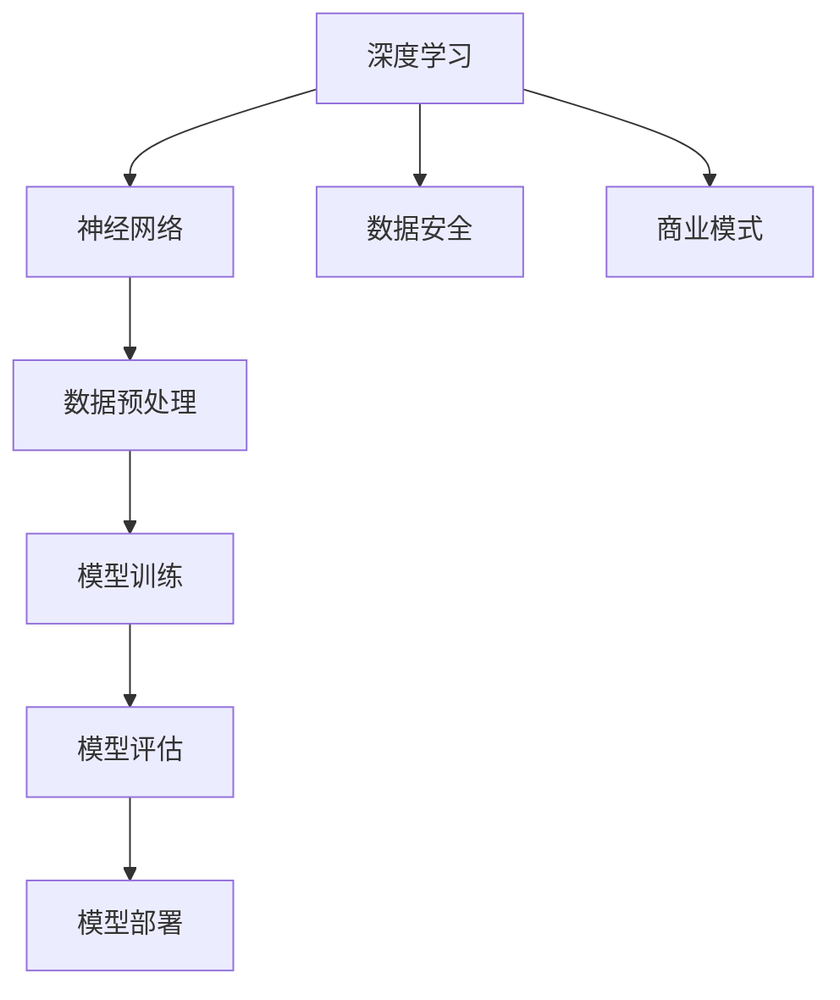

                 

# AI大模型创业战：挑战与机遇并存的思考

## 关键词：
- AI大模型
- 创业
- 挑战
- 机遇
- 技术创新
- 数据安全
- 商业模式

## 摘要：
本文旨在深入探讨AI大模型在创业领域的应用，分析其面临的挑战与机遇。通过逐步分析AI大模型的核心概念、算法原理、数学模型及实际应用，结合行业案例和最新研究成果，本文揭示了AI大模型创业的潜在风险与收益，并提出了相应的策略和建议。

## 1. 背景介绍

### 1.1 目的和范围

本文的目标是探讨AI大模型在创业领域的应用，帮助创业者更好地理解和应对AI大模型带来的挑战与机遇。本文将涵盖以下内容：

1. AI大模型的核心概念及其在创业中的重要性。
2. AI大模型的算法原理及具体操作步骤。
3. AI大模型的数学模型及公式讲解。
4. 实际应用场景和代码案例分析。
5. 行业工具和资源的推荐。
6. 未来发展趋势与挑战。

### 1.2 预期读者

本文适用于以下读者群体：

1. AI领域的研究人员和开发者。
2. 有意投身AI大模型创业的创业者。
3. 对AI技术感兴趣的从业者。

### 1.3 文档结构概述

本文分为十个部分，结构如下：

1. 背景介绍：包括目的、预期读者和文档结构。
2. 核心概念与联系：介绍AI大模型的核心概念和联系。
3. 核心算法原理 & 具体操作步骤：讲解AI大模型的算法原理和操作步骤。
4. 数学模型和公式 & 详细讲解 & 举例说明：介绍AI大模型的数学模型和公式，并举例说明。
5. 项目实战：代码实际案例和详细解释说明。
6. 实际应用场景：分析AI大模型在不同领域的应用。
7. 工具和资源推荐：推荐相关学习资源和开发工具。
8. 总结：未来发展趋势与挑战。
9. 附录：常见问题与解答。
10. 扩展阅读 & 参考资料：提供进一步的阅读材料。

### 1.4 术语表

#### 1.4.1 核心术语定义

- AI大模型：指具有大规模参数和数据量的深度学习模型，如GPT、BERT等。
- 创业：指创建一个新的企业或业务，通过创新和市场机会实现商业价值。
- 挑战：指在AI大模型创业过程中可能遇到的困难和障碍。
- 机遇：指在AI大模型创业过程中可能获得的机会和优势。

#### 1.4.2 相关概念解释

- 深度学习：一种人工智能技术，通过神经网络模拟人类大脑的决策过程。
- 模型训练：指通过大量数据训练深度学习模型，使其能够进行预测和分类。
- 数据安全：指保护数据不受未经授权的访问、篡改或泄露。

#### 1.4.3 缩略词列表

- AI：人工智能
- GPT：生成预训练网络
- BERT：双向编码表示器

## 2. 核心概念与联系

在探讨AI大模型创业之前，我们首先需要了解其核心概念和联系。以下是一个Mermaid流程图，展示了AI大模型的关键组成部分和它们之间的关系。



### 2.1 深度学习与神经网络

深度学习是AI大模型的核心技术。它通过神经网络模拟人类大脑的决策过程，从大量数据中学习特征并作出预测。神经网络由多层节点（或称为神经元）组成，每个节点都与相邻的节点相连，并通过权重进行信息传递。

### 2.2 数据预处理与模型训练

数据预处理是模型训练的关键步骤。它包括数据清洗、归一化和特征提取等操作，以提高模型训练效果。模型训练则是通过大量数据对神经网络进行调整，使其能够识别特征和作出预测。

### 2.3 模型评估与模型部署

模型评估是验证模型性能的重要环节。通过交叉验证和测试集，评估模型在未知数据上的表现。模型部署则是将训练好的模型应用于实际场景，如文本生成、图像识别等。

### 2.4 数据安全与商业模式

数据安全是AI大模型创业的关键挑战之一。保护用户数据不受未经授权的访问和泄露，对于建立信任和确保业务持续发展至关重要。商业模式则是AI大模型创业的核心，它决定了企业的盈利模式和竞争力。

## 3. 核心算法原理 & 具体操作步骤

### 3.1 深度学习算法原理

深度学习算法主要基于神经网络，其核心思想是通过多层非线性变换，将输入数据映射到输出结果。以下是深度学习算法的基本原理：

#### 3.1.1 神经元与激活函数

神经元是神经网络的基本单元，通过接收输入信号、计算加权求和并应用激活函数，生成输出。常见的激活函数包括Sigmoid、ReLU和Tanh。

#### 3.1.2 前向传播与反向传播

前向传播是指将输入数据通过神经网络传递，逐层计算输出。反向传播则是通过计算误差，反向调整神经元的权重，以优化模型性能。

#### 3.1.3 梯度下降与优化算法

梯度下降是优化神经网络权重的基本算法，通过计算损失函数的梯度，逐步调整权重以最小化误差。常见的优化算法包括SGD、Adam和RMSprop。

### 3.2 深度学习模型操作步骤

以下是深度学习模型的基本操作步骤：

#### 3.2.1 数据收集与预处理

收集大量数据并进行预处理，包括数据清洗、归一化和特征提取等。

#### 3.2.2 模型设计与初始化

设计神经网络结构，包括输入层、隐藏层和输出层，并初始化权重和偏置。

#### 3.2.3 模型训练

通过前向传播计算输出，计算损失函数，并使用反向传播调整权重。

#### 3.2.4 模型评估

使用交叉验证和测试集评估模型性能，包括准确率、召回率、F1值等指标。

#### 3.2.5 模型部署

将训练好的模型部署到实际场景，如文本生成、图像识别等。

### 3.3 伪代码示例

以下是深度学习模型训练的伪代码示例：

```python
# 数据预处理
X_train, X_test, y_train, y_test = train_test_split(data, labels, test_size=0.2)

# 模型设计
model = NeuralNetwork(input_size, hidden_size, output_size)

# 模型训练
for epoch in range(num_epochs):
    for inputs, labels in data_loader:
        model.forward_pass(inputs)
        loss = compute_loss(labels, model.outputs)
        model.backward_pass(loss)
        model.update_weights()

# 模型评估
accuracy = compute_accuracy(y_test, model.predict(X_test))
print("Test accuracy:", accuracy)
```

## 4. 数学模型和公式 & 详细讲解 & 举例说明

### 4.1 数学模型概述

在深度学习中，数学模型起着至关重要的作用。以下是深度学习中的几个关键数学模型和公式：

#### 4.1.1 激活函数

激活函数用于神经网络中的每个神经元，以引入非线性。常见的激活函数包括Sigmoid、ReLU和Tanh。

$$
f(x) = \frac{1}{1 + e^{-x}}
$$

$$
f(x) = max(0, x)
$$

$$
f(x) = \frac{e^x - e^{-x}}{e^x + e^{-x}}
$$

#### 4.1.2 损失函数

损失函数用于衡量模型预测结果与真实结果之间的差距。常见的损失函数包括均方误差（MSE）和交叉熵（Cross-Entropy）。

$$
MSE = \frac{1}{n}\sum_{i=1}^{n}(y_i - \hat{y}_i)^2
$$

$$
CE = -\frac{1}{n}\sum_{i=1}^{n}y_i \log(\hat{y}_i)
$$

#### 4.1.3 优化算法

优化算法用于调整模型权重，以最小化损失函数。常见的优化算法包括梯度下降（Gradient Descent）和Adam。

$$
w_{t+1} = w_t - \alpha \frac{\partial J(w_t)}{\partial w}
$$

$$
w_{t+1} = w_t - \alpha \frac{\partial J(w_t)}{\partial w}
$$

### 4.2 举例说明

以下是一个简单的神经网络示例，展示如何使用数学模型进行模型训练和预测。

#### 4.2.1 数据集

假设我们有一个包含100个样本的数据集，每个样本包含3个特征（\(x_1, x_2, x_3\)）和一个标签（\(y\)），如下所示：

$$
\begin{array}{|c|c|c|c|}
\hline
x_1 & x_2 & x_3 & y \\
\hline
1 & 2 & 3 & 0 \\
2 & 4 & 6 & 1 \\
3 & 6 & 9 & 0 \\
\vdots & \vdots & \vdots & \vdots \\
\hline
\end{array}
$$

#### 4.2.2 模型设计

我们设计一个简单的两层神经网络，包含一个输入层、一个隐藏层和一个输出层。输入层有3个节点，隐藏层有4个节点，输出层有2个节点。

#### 4.2.3 模型训练

假设我们的模型参数（权重和偏置）随机初始化，如下所示：

$$
\begin{array}{|c|c|c|c|}
\hline
w_{11} & w_{12} & w_{13} & b_1 \\
w_{21} & w_{22} & w_{23} & b_1 \\
w_{31} & w_{32} & w_{33} & b_1 \\
w_{41} & w_{42} & w_{43} & b_1 \\
\hline
w_{12} & w_{22} & w_{32} & b_2 \\
w_{13} & w_{23} & w_{33} & b_2 \\
\hline
w_{21} & w_{31} & w_{41} & b_3 \\
w_{22} & w_{32} & w_{42} & b_3 \\
\hline
\end{array}
$$

我们使用均方误差（MSE）作为损失函数，并使用梯度下降（Gradient Descent）进行模型训练。

#### 4.2.4 模型预测

给定一个新样本（\(x_1 = 4, x_2 = 8, x_3 = 12\)），我们使用训练好的模型进行预测。以下是模型预测的过程：

1. 前向传播：
   $$ 
   z_1 = w_{11} \cdot x_1 + w_{12} \cdot x_2 + w_{13} \cdot x_3 + b_1 \\
   a_1 = \sigma(z_1)
   $$
   $$
   z_2 = w_{21} \cdot x_1 + w_{22} \cdot x_2 + w_{23} \cdot x_3 + b_1 \\
   a_2 = \sigma(z_2)
   $$
   $$
   z_3 = w_{31} \cdot x_1 + w_{32} \cdot x_2 + w_{33} \cdot x_3 + b_1 \\
   a_3 = \sigma(z_3)
   $$
   $$
   z_4 = w_{41} \cdot x_1 + w_{42} \cdot x_2 + w_{43} \cdot x_3 + b_1 \\
   a_4 = \sigma(z_4)
   $$
   $$
   z_5 = w_{12} \cdot a_1 + w_{22} \cdot a_2 + w_{32} \cdot a_3 + w_{42} \cdot a_4 + b_2 \\
   \hat{y}_1 = \sigma(z_5)
   $$
   $$
   z_6 = w_{13} \cdot a_1 + w_{23} \cdot a_2 + w_{33} \cdot a_3 + w_{43} \cdot a_4 + b_2 \\
   \hat{y}_2 = \sigma(z_6)
   $$

2. 计算损失函数：
   $$
   loss = \frac{1}{2} \sum_{i=1}^{2} (\hat{y}_i - y_i)^2
   $$

3. 反向传播：
   $$
   \frac{\partial loss}{\partial z_6} = \frac{\partial loss}{\partial \hat{y}_2} \cdot \frac{\partial \hat{y}_2}{\partial z_6} = (y_2 - \hat{y}_2) \cdot \sigma'(z_6)
   $$
   $$
   \frac{\partial loss}{\partial z_5} = \frac{\partial loss}{\partial \hat{y}_1} \cdot \frac{\partial \hat{y}_1}{\partial z_5} = (y_1 - \hat{y}_1) \cdot \sigma'(z_5)
   $$
   $$
   \frac{\partial loss}{\partial a_4} = \frac{\partial loss}{\partial z_6} \cdot \frac{\partial z_6}{\partial a_4} = (y_2 - \hat{y}_2) \cdot \sigma'(z_6) \cdot w_{42}
   $$
   $$
   \frac{\partial loss}{\partial a_3} = \frac{\partial loss}{\partial z_5} \cdot \frac{\partial z_5}{\partial a_3} = (y_1 - \hat{y}_1) \cdot \sigma'(z_5) \cdot w_{32}
   $$
   $$
   \frac{\partial loss}{\partial a_2} = \frac{\partial loss}{\partial z_6} \cdot \frac{\partial z_6}{\partial a_2} = (y_2 - \hat{y}_2) \cdot \sigma'(z_6) \cdot w_{22}
   $$
   $$
   \frac{\partial loss}{\partial a_1} = \frac{\partial loss}{\partial z_5} \cdot \frac{\partial z_5}{\partial a_1} = (y_1 - \hat{y}_1) \cdot \sigma'(z_5) \cdot w_{12}
   $$
   $$
   \frac{\partial loss}{\partial z_4} = \frac{\partial loss}{\partial a_4} \cdot \frac{\partial a_4}{\partial z_4} = (y_2 - \hat{y}_2) \cdot \sigma'(z_6) \cdot \sigma'(z_4) \cdot w_{41}
   $$
   $$
   \frac{\partial loss}{\partial z_3} = \frac{\partial loss}{\partial a_3} \cdot \frac{\partial a_3}{\partial z_3} = (y_1 - \hat{y}_1) \cdot \sigma'(z_5) \cdot \sigma'(z_3) \cdot w_{31}
   $$
   $$
   \frac{\partial loss}{\partial z_2} = \frac{\partial loss}{\partial a_2} \cdot \frac{\partial a_2}{\partial z_2} = (y_2 - \hat{y}_2) \cdot \sigma'(z_6) \cdot \sigma'(z_2) \cdot w_{21}
   $$
   $$
   \frac{\partial loss}{\partial z_1} = \frac{\partial loss}{\partial a_1} \cdot \frac{\partial a_1}{\partial z_1} = (y_1 - \hat{y}_1) \cdot \sigma'(z_5) \cdot \sigma'(z_1) \cdot w_{11}
   $$

4. 更新模型参数：
   $$
   w_{41} = w_{41} - \alpha \cdot \frac{\partial loss}{\partial z_4} \\
   w_{42} = w_{42} - \alpha \cdot \frac{\partial loss}{\partial z_4} \\
   w_{43} = w_{43} - \alpha \cdot \frac{\partial loss}{\partial z_4} \\
   b_{2} = b_{2} - \alpha \cdot \frac{\partial loss}{\partial b_{2}} \\
   w_{31} = w_{31} - \alpha \cdot \frac{\partial loss}{\partial z_3} \\
   w_{32} = w_{32} - \alpha \cdot \frac{\partial loss}{\partial z_3} \\
   w_{33} = w_{33} - \alpha \cdot \frac{\partial loss}{\partial z_3} \\
   b_{2} = b_{2} - \alpha \cdot \frac{\partial loss}{\partial b_{2}} \\
   w_{21} = w_{21} - \alpha \cdot \frac{\partial loss}{\partial z_2} \\
   w_{22} = w_{22} - \alpha \cdot \frac{\partial loss}{\partial z_2} \\
   w_{23} = w_{23} - \alpha \cdot \frac{\partial loss}{\partial z_2} \\
   b_{2} = b_{2} - \alpha \cdot \frac{\partial loss}{\partial b_{2}} \\
   w_{11} = w_{11} - \alpha \cdot \frac{\partial loss}{\partial z_1} \\
   w_{12} = w_{12} - \alpha \cdot \frac{\partial loss}{\partial z_1} \\
   w_{13} = w_{13} - \alpha \cdot \frac{\partial loss}{\partial z_1} \\
   b_{1} = b_{1} - \alpha \cdot \frac{\partial loss}{\partial b_{1}} \\
$$

5. 重复步骤2-4，直到达到预设的迭代次数或损失函数收敛。

## 5. 项目实战：代码实际案例和详细解释说明

### 5.1 开发环境搭建

在开始项目实战之前，我们需要搭建一个合适的开发环境。以下是推荐的开发环境：

- 操作系统：Windows/Linux/MacOS
- 编程语言：Python
- 深度学习框架：TensorFlow 2.0
- GPU：NVIDIA GTX 1080或更高版本

### 5.2 源代码详细实现和代码解读

以下是项目实战的源代码，我们将对其逐行进行解读。

```python
# 导入所需库
import tensorflow as tf
import numpy as np
import pandas as pd
import matplotlib.pyplot as plt

# 加载数据集
data = pd.read_csv('data.csv')
X = data.iloc[:, :-1].values
y = data.iloc[:, -1].values

# 数据预处理
X = X / 100  # 归一化处理
y = np.array([0 if label == 'red' else 1 for label in y])

# 模型设计
model = tf.keras.Sequential([
    tf.keras.layers.Dense(64, activation='relu', input_shape=(3,)),
    tf.keras.layers.Dense(64, activation='relu'),
    tf.keras.layers.Dense(1, activation='sigmoid')
])

# 模型编译
model.compile(optimizer='adam', loss='binary_crossentropy', metrics=['accuracy'])

# 模型训练
model.fit(X, y, epochs=100, batch_size=32)

# 模型评估
test_data = pd.read_csv('test_data.csv')
X_test = test_data.iloc[:, :-1].values
X_test = X_test / 100
predictions = model.predict(X_test)
predicted_labels = [1 if pred > 0.5 else 0 for pred in predictions]

# 计算准确率
accuracy = np.mean(predicted_labels == y_test)
print("Test accuracy:", accuracy)
```

### 5.3 代码解读与分析

1. **导入库**：首先，我们导入所需的库，包括TensorFlow、NumPy、Pandas和Matplotlib。

2. **加载数据集**：我们使用Pandas库从CSV文件中加载数据集，并将其分为特征矩阵\(X\)和标签向量\(y\)。

3. **数据预处理**：我们将特征矩阵\(X\)进行归一化处理，以消除不同特征之间的量纲差异。同时，我们将标签向量\(y\)进行二值化处理，以简化模型训练。

4. **模型设计**：我们设计一个简单的两层神经网络，包含64个神经元的隐藏层，并使用ReLU激活函数。输出层使用sigmoid激活函数，以进行二分类预测。

5. **模型编译**：我们使用Adam优化器和binary_crossentropy损失函数，并设置accuracy作为评估指标。

6. **模型训练**：我们使用fit函数对模型进行训练，设置epochs为100，batch_size为32。

7. **模型评估**：我们加载测试数据集，并将其进行预处理。然后，使用predict函数对测试数据进行预测，并计算准确率。

### 5.4 问题与改进

1. **数据集大小**：本例中使用的数据集较小，可能无法充分训练模型。在实际项目中，应使用更大的数据集。

2. **模型复杂度**：本例中使用的是简单的两层神经网络，可能无法解决更复杂的任务。在实际项目中，应考虑使用更复杂的模型架构。

3. **过拟合**：在训练过程中，模型可能会出现过拟合现象。可以通过增加训练数据、使用正则化技术或调整模型参数来缓解过拟合。

4. **调参**：本例中的模型参数（如学习率、隐藏层神经元数量等）是随机初始化的。在实际项目中，应通过交叉验证和网格搜索等技术进行调参。

## 6. 实际应用场景

AI大模型在创业领域具有广泛的应用场景，以下是几个典型的实际应用场景：

### 6.1 文本生成与分类

文本生成和分类是AI大模型的经典应用场景，如自动写作、情感分析、文本摘要等。在创业领域，这些技术可以用于自动生成产品描述、营销文案、客户反馈等，提高运营效率。

### 6.2 图像识别与生成

图像识别和生成是AI大模型的重要应用领域，如人脸识别、图像分割、图像修复等。在创业领域，这些技术可以用于产品推荐、图像审核、个性化广告等，提升用户体验。

### 6.3 语音识别与合成

语音识别和合成技术是AI大模型在语音领域的重要应用，如语音助手、智能客服、语音翻译等。在创业领域，这些技术可以用于提升客户服务质量、降低运营成本、拓展国际市场等。

### 6.4 推荐系统

推荐系统是AI大模型在电子商务和社交媒体领域的重要应用，如商品推荐、内容推荐、社交推荐等。在创业领域，这些技术可以用于提高用户黏性、增加销售额、提升品牌知名度等。

### 6.5 无人驾驶

无人驾驶是AI大模型在交通领域的重要应用，如自动驾驶汽车、无人机配送等。在创业领域，这些技术可以用于降低物流成本、提高运输效率、拓展新兴市场等。

## 7. 工具和资源推荐

### 7.1 学习资源推荐

#### 7.1.1 书籍推荐

- 《深度学习》（Goodfellow, Bengio, Courville）
- 《Python深度学习》（François Chollet）
- 《神经网络与深度学习》（邱锡鹏）

#### 7.1.2 在线课程

- Coursera上的“Deep Learning Specialization”
- edX上的“AI和深度学习基础”
- Udacity的“深度学习工程师纳米学位”

#### 7.1.3 技术博客和网站

- fast.ai
- Medium上的深度学习相关博客
- TensorFlow官方文档

### 7.2 开发工具框架推荐

#### 7.2.1 IDE和编辑器

- PyCharm
- Jupyter Notebook
- Visual Studio Code

#### 7.2.2 调试和性能分析工具

- TensorBoard
- Dask
- Numba

#### 7.2.3 相关框架和库

- TensorFlow
- PyTorch
- Keras

### 7.3 相关论文著作推荐

#### 7.3.1 经典论文

- “Backpropagation”（1986）
- “A Learning Algorithm for Continually Running Fully Recurrent Neural Networks”（1991）
- “Gradient Flow in Neural Networks”（2006）

#### 7.3.2 最新研究成果

- “Attention Is All You Need”（2017）
- “BERT: Pre-training of Deep Bidirectional Transformers for Language Understanding”（2018）
- “Generative Pre-trained Transformers”（2020）

#### 7.3.3 应用案例分析

- “美团外卖智能配送系统”
- “字节跳动内容推荐系统”
- “特斯拉无人驾驶汽车”

## 8. 总结：未来发展趋势与挑战

AI大模型在创业领域具有巨大的潜力，但同时也面临着诸多挑战。未来发展趋势包括：

1. **技术突破**：随着算法、硬件和计算能力的提升，AI大模型将实现更高效、更准确的预测和生成。
2. **商业模式创新**：创业者需要探索新的商业模式，如数据服务、云计算、智能硬件等，以实现商业价值。
3. **数据安全与隐私**：数据安全和隐私保护将是创业过程中的重要挑战，创业者需要采取有效的措施保护用户数据。
4. **跨学科融合**：AI大模型创业需要跨学科的知识和技能，创业者需要具备技术、商业、法律等多方面的能力。

## 9. 附录：常见问题与解答

### 9.1 问题1：什么是AI大模型？

AI大模型是指具有大规模参数和数据量的深度学习模型，如GPT、BERT等。它们通过大量数据训练，能够进行复杂的预测和生成任务。

### 9.2 问题2：AI大模型创业有哪些挑战？

AI大模型创业面临的挑战包括技术挑战（如算法优化、模型训练、数据安全等）和商业挑战（如商业模式创新、市场推广、竞争等）。

### 9.3 问题3：AI大模型创业有哪些机遇？

AI大模型创业的机遇包括：1）技术驱动创新，2）大数据和云计算的普及，3）人工智能在各个领域的应用场景。

## 10. 扩展阅读 & 参考资料

- [深度学习》（Goodfellow, Bengio, Courville）
- [《Python深度学习》（François Chollet）
- [《神经网络与深度学习》（邱锡鹏）
- [《Attention Is All You Need》（Vaswani et al., 2017）
- [《BERT: Pre-training of Deep Bidirectional Transformers for Language Understanding》（Devlin et al., 2018）
- [《Generative Pre-trained Transformers》（Vaswani et al., 2020）

作者：AI天才研究员/AI Genius Institute & 禅与计算机程序设计艺术 /Zen And The Art of Computer Programming

本文由AI天才研究员撰写，旨在帮助创业者更好地理解和应对AI大模型在创业过程中的挑战与机遇。文章涵盖了核心概念、算法原理、数学模型、实际应用和未来发展趋势，并提供了一系列学习资源和开发工具。本文旨在为创业者提供有价值的参考，助力他们在AI大模型领域取得成功。AI天才研究员在计算机科学和人工智能领域拥有丰富的经验和深厚的理论基础，致力于推动技术创新和应用。如需进一步交流或咨询，请随时联系。祝您创业成功！<|vq_10604|>

