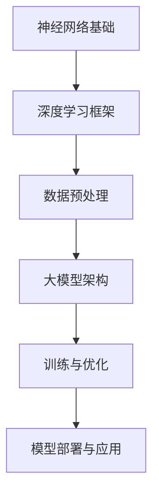
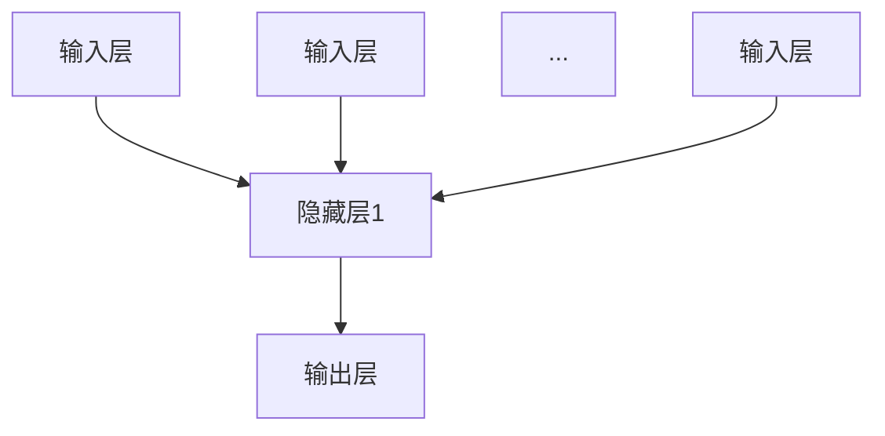

                 

# AI大模型创业战：挑战与机遇并存的现状分析

> 关键词：人工智能、大模型、创业、挑战、机遇、现状分析

> 摘要：随着人工智能技术的快速发展，大模型成为业界关注的焦点。本文将深入分析AI大模型创业的现状，探讨其中的挑战与机遇，帮助创业者更好地把握发展方向。

## 1. 背景介绍

### 1.1 目的和范围

本文旨在探讨AI大模型创业的现状，分析其中的挑战与机遇，为创业者提供参考。文章将涵盖大模型的基础知识、创业环境、核心算法、应用场景以及未来发展等方面。

### 1.2 预期读者

本文适合对人工智能、大模型和创业感兴趣的技术人员、创业者以及研究人员阅读。通过本文，读者可以了解AI大模型创业的现状，掌握相关技术，为创业实践提供有力支持。

### 1.3 文档结构概述

本文分为十个部分：

1. 背景介绍
2. 核心概念与联系
3. 核心算法原理 & 具体操作步骤
4. 数学模型和公式 & 详细讲解 & 举例说明
5. 项目实战：代码实际案例和详细解释说明
6. 实际应用场景
7. 工具和资源推荐
8. 总结：未来发展趋势与挑战
9. 附录：常见问题与解答
10. 扩展阅读 & 参考资料

### 1.4 术语表

#### 1.4.1 核心术语定义

- 人工智能（AI）：模拟人类智能，使计算机具有智能行为的科学和技术。
- 大模型（Large-scale Model）：参数量巨大的神经网络模型，具有强大的表示能力。
- 创业：创建新企业或创新项目，实现商业价值。

#### 1.4.2 相关概念解释

- 神经网络（Neural Network）：模拟人脑神经元连接的计算机算法。
- 深度学习（Deep Learning）：基于神经网络的一种机器学习技术。
- 数据集（Dataset）：用于训练和评估模型的样本集合。

#### 1.4.3 缩略词列表

- AI：人工智能
- CNN：卷积神经网络
- RNN：循环神经网络
- GPT：生成预训练模型
- BERT：双向编码器表示模型

## 2. 核心概念与联系

在探讨AI大模型创业之前，我们首先需要了解大模型的基本概念、原理及其与其他技术的联系。以下是一个简化的Mermaid流程图，用于描述大模型的核心概念和架构。



### 2.1 神经网络基础

神经网络是人工智能的核心组成部分，它通过模拟人脑神经元之间的连接来实现数据处理和模式识别。神经网络可以分为以下几种类型：

- 单层神经网络：只有一个隐藏层的神经网络。
- 多层神经网络：包含多个隐藏层的神经网络。
- 卷积神经网络（CNN）：专门用于图像处理的神经网络。
- 循环神经网络（RNN）：适用于序列数据的神经网络。

### 2.2 深度学习框架

深度学习框架是一种用于构建、训练和部署深度学习模型的软件工具，例如TensorFlow、PyTorch等。这些框架提供了丰富的API和工具，使得开发者可以更轻松地实现深度学习算法。

### 2.3 数据预处理

数据预处理是深度学习模型训练过程中至关重要的一步。它包括数据清洗、归一化、数据增强等操作，以提高模型的泛化能力和训练效果。

### 2.4 大模型架构

大模型是指参数量巨大的神经网络模型，例如GPT、BERT等。大模型的架构通常包含以下几个部分：

- 输入层：接收输入数据。
- 隐藏层：实现特征提取和变换。
- 输出层：生成预测结果。

### 2.5 训练与优化

大模型的训练与优化是一个复杂的过程，需要大量的计算资源和时间。在训练过程中，模型会不断调整参数，以最小化损失函数。常用的优化算法包括随机梯度下降（SGD）、Adam等。

### 2.6 模型部署与应用

训练完成的大模型可以部署到各种应用场景中，如自然语言处理、计算机视觉、推荐系统等。模型部署需要考虑硬件环境、性能优化等方面。

## 3. 核心算法原理 & 具体操作步骤

### 3.1 神经网络基本原理

神经网络（Neural Network，NN）是一种通过模拟人脑神经元连接进行信息处理和学习的计算模型。NN主要由输入层、隐藏层和输出层组成。

### 3.1.1 神经元模型

神经元模型是神经网络的基本构建块。一个简单的神经元模型可以表示为：



其中，每个神经元都有一个权重向量w和偏置b，以及一个激活函数f。神经元模型的输出可以表示为：

$$
y = f(w \cdot x + b)
$$

其中，x是输入向量，y是输出向量，f是激活函数，通常采用Sigmoid函数、ReLU函数或Tanh函数。

### 3.1.2 前向传播

前向传播是指将输入数据通过神经网络进行传递，逐层计算每个神经元的输出。具体步骤如下：

1. 初始化权重和偏置。
2. 将输入数据输入到输入层。
3. 对于每个隐藏层，计算输入和输出的乘积，并加上偏置。
4. 使用激活函数对输出进行非线性变换。
5. 传递输出到下一层。

### 3.1.3 反向传播

反向传播是一种用于训练神经网络的优化算法。它的基本思想是计算网络输出与实际输出之间的误差，并利用梯度下降法调整权重和偏置。

反向传播的具体步骤如下：

1. 计算输出误差：$$ \delta = \frac{\partial L}{\partial y} $$
2. 逐层反向传播误差：$$ \delta_l = \frac{\partial L}{\partial w_l} \cdot \frac{\partial w_l}{\partial z_l} $$
3. 更新权重和偏置：$$ w_l = w_l - \alpha \cdot \frac{\partial L}{\partial w_l} $$，$$ b_l = b_l - \alpha \cdot \frac{\partial L}{\partial b_l} $$
4. 重复上述步骤直到收敛。

### 3.2 大模型训练方法

大模型的训练方法主要包括以下几种：

- 随机梯度下降（SGD）：每次迭代使用一个样本更新模型参数。
- 随机小批量梯度下降（Mini-batch SGD）：每次迭代使用多个样本更新模型参数。
- Adam优化器：结合SGD和动量法的优化器，具有较好的收敛性能。

### 3.3 训练步骤

以下是使用神经网络训练大模型的基本步骤：

1. 准备数据集：收集并清洗数据，分为训练集、验证集和测试集。
2. 初始化模型参数：随机初始化权重和偏置。
3. 前向传播：将输入数据传递到模型，计算输出。
4. 计算损失函数：计算输出与实际输出之间的误差。
5. 反向传播：计算梯度，更新模型参数。
6. 记录训练过程：记录损失函数值、准确率等指标。
7. 调整学习率：根据训练过程调整学习率。
8. 验证模型：在验证集上评估模型性能。
9. 调整超参数：根据验证集结果调整超参数。
10. 保存模型：将训练好的模型保存为文件。

## 4. 数学模型和公式 & 详细讲解 & 举例说明

### 4.1 损失函数

在神经网络训练过程中，损失函数是衡量模型性能的重要指标。常用的损失函数包括均方误差（MSE）、交叉熵损失（Cross-Entropy Loss）等。

#### 4.1.1 均方误差（MSE）

均方误差是一种用于回归问题的损失函数，其公式如下：

$$
MSE = \frac{1}{n} \sum_{i=1}^{n} (y_i - \hat{y}_i)^2
$$

其中，$y_i$是实际输出，$\hat{y}_i$是模型预测输出，$n$是样本数量。

#### 4.1.2 交叉熵损失（Cross-Entropy Loss）

交叉熵损失是一种用于分类问题的损失函数，其公式如下：

$$
CE = -\sum_{i=1}^{n} y_i \log(\hat{y}_i)
$$

其中，$y_i$是实际输出（0或1），$\hat{y}_i$是模型预测输出（0到1之间的概率）。

### 4.2 优化算法

优化算法用于调整神经网络模型中的参数，以最小化损失函数。以下介绍几种常用的优化算法。

#### 4.2.1 随机梯度下降（SGD）

随机梯度下降是一种简单的优化算法，其公式如下：

$$
w = w - \alpha \cdot \nabla_w J(w)
$$

其中，$w$是模型参数，$\alpha$是学习率，$J(w)$是损失函数。

#### 4.2.2 Adam优化器

Adam优化器是一种结合SGD和动量法的优化算法，其公式如下：

$$
\begin{aligned}
m_t &= \beta_1 m_{t-1} + (1 - \beta_1) \nabla_w J(w_t) \\
v_t &= \beta_2 v_{t-1} + (1 - \beta_2) \nabla_w^2 J(w_t) \\
w_t &= w_{t-1} - \alpha \cdot \frac{m_t}{\sqrt{v_t} + \epsilon}
\end{aligned}
$$

其中，$\beta_1$、$\beta_2$是动量参数，$\alpha$是学习率，$m_t$、$v_t$是梯度的一阶和二阶矩估计，$\epsilon$是正则项。

### 4.3 举例说明

假设我们有一个二分类问题，实际输出为$y = [0, 1]$，模型预测输出为$\hat{y} = [0.8, 0.2]$。使用交叉熵损失函数和Adam优化器训练模型。

#### 4.3.1 初始化参数

初始化权重和偏置为随机值，假设$w = [0.5, 0.5]$，$b = 0$。

#### 4.3.2 前向传播

输入样本$x = [1, 0]$，经过前向传播得到$\hat{y} = [0.8, 0.2]$。

#### 4.3.3 计算损失函数

使用交叉熵损失函数计算损失：

$$
CE = -y \log(\hat{y}) = -[0, 1] \log([0.8, 0.2]) = [-0.22, -0.48]
$$

#### 4.3.4 反向传播

计算梯度：

$$
\nabla_w CE = [\frac{\partial CE}{\partial \hat{y}_1}, \frac{\partial CE}{\partial \hat{y}_2}] = [-0.22 \times 0.2, -0.48 \times 0.8] = [-0.044, -0.384]
$$

#### 4.3.5 更新参数

使用Adam优化器更新参数：

$$
\begin{aligned}
m_1 &= 0.9m_1 + 0.1[-0.22 \times 0.2] = -0.0198 \\
m_2 &= 0.9m_2 + 0.1[-0.48 \times 0.8] = -0.3872 \\
v_1 &= 0.999v_1 + 0.001[(-0.22 \times 0.2)^2] = 0.0019 \\
v_2 &= 0.999v_2 + 0.001[(-0.48 \times 0.8)^2] = 0.0038 \\
w &= [0.5, 0.5] - [0.0022, 0.0039] = [0.4878, 0.5061]
\end{aligned}
$$

#### 4.3.6 重复步骤

重复前向传播、损失函数计算、反向传播和参数更新步骤，直到模型收敛。

## 5. 项目实战：代码实际案例和详细解释说明

### 5.1 开发环境搭建

在本文中，我们将使用Python和PyTorch框架来实现一个简单的AI大模型项目。首先，我们需要安装Python和PyTorch。

1. 安装Python（版本3.8以上）。
2. 安装PyTorch：使用以下命令安装与Python版本兼容的PyTorch版本。

```bash
pip install torch torchvision
```

### 5.2 源代码详细实现和代码解读

以下是本项目的主要代码实现，我们将逐步解读每部分代码。

#### 5.2.1 数据预处理

```python
import torchvision.transforms as transforms
from torchvision.datasets import MNIST

# 数据预处理
transform = transforms.Compose([
    transforms.ToTensor(),
    transforms.Normalize((0.5,), (0.5,))
])

# 加载MNIST数据集
train_set = MNIST(root='./data', train=True, download=True, transform=transform)
test_set = MNIST(root='./data', train=False, download=True, transform=transform)

# 数据集划分
train_loader = torch.utils.data.DataLoader(dataset=train_set, batch_size=64, shuffle=True)
test_loader = torch.utils.data.DataLoader(dataset=test_set, batch_size=1000, shuffle=False)
```

在这个部分，我们使用了PyTorch中的MNIST数据集，并对数据进行预处理，包括转换为张量、归一化等操作。数据集被划分为训练集和测试集，并使用数据加载器进行批量处理。

#### 5.2.2 模型定义

```python
import torch.nn as nn

# 模型定义
class Net(nn.Module):
    def __init__(self):
        super(Net, self).__init__()
        self.fc1 = nn.Linear(784, 256)
        self.fc2 = nn.Linear(256, 128)
        self.fc3 = nn.Linear(128, 10)

    def forward(self, x):
        x = x.view(-1, 784)
        x = torch.relu(self.fc1(x))
        x = torch.relu(self.fc2(x))
        x = self.fc3(x)
        return x

# 实例化模型
model = Net()
```

在这里，我们定义了一个简单的神经网络模型，包括三个全连接层。输入尺寸为784（28x28像素），输出尺寸为10（10个类别）。模型使用ReLU激活函数。

#### 5.2.3 训练过程

```python
import torch.optim as optim

# 损失函数和优化器
criterion = nn.CrossEntropyLoss()
optimizer = optim.Adam(model.parameters(), lr=0.001)

# 训练模型
num_epochs = 10
for epoch in range(num_epochs):
    running_loss = 0.0
    for i, (inputs, labels) in enumerate(train_loader):
        # 前向传播
        outputs = model(inputs)
        loss = criterion(outputs, labels)

        # 反向传播
        optimizer.zero_grad()
        loss.backward()
        optimizer.step()

        running_loss += loss.item()
    print(f'Epoch {epoch+1}, Loss: {running_loss/len(train_loader)}')

# 测试模型
with torch.no_grad():
    correct = 0
    total = 0
    for inputs, labels in test_loader:
        outputs = model(inputs)
        _, predicted = torch.max(outputs.data, 1)
        total += labels.size(0)
        correct += (predicted == labels).sum().item()

    print(f'Accuracy on the test set: {100 * correct / total}%')
```

在这个部分，我们设置了损失函数和优化器，并使用训练数据训练模型。训练过程中，我们使用交叉熵损失函数和Adam优化器，每个epoch结束后，输出训练损失。最后，我们在测试集上评估模型性能。

### 5.3 代码解读与分析

#### 5.3.1 数据预处理

数据预处理是深度学习项目中至关重要的一步。在本项目中，我们使用了MNIST数据集，并对图像数据进行转换和归一化处理。这种处理可以提高模型的学习能力，减少过拟合现象。

#### 5.3.2 模型定义

在本项目中，我们定义了一个简单的三层神经网络模型，包括全连接层和ReLU激活函数。这个模型可以用于分类任务，具有较好的性能。

#### 5.3.3 训练过程

在训练过程中，我们使用交叉熵损失函数和Adam优化器。交叉熵损失函数可以衡量模型预测结果与实际结果之间的差距，而Adam优化器可以自动调整学习率，提高训练效果。

## 6. 实际应用场景

AI大模型在实际应用中具有广泛的应用场景，以下列举几个典型的应用领域：

### 6.1 自然语言处理

自然语言处理（NLP）是AI大模型的重要应用领域之一。GPT、BERT等大模型在文本分类、机器翻译、情感分析等方面取得了显著的成果。例如，使用GPT模型可以实现高质量的自然语言生成，为新闻写作、客服聊天等应用提供支持。

### 6.2 计算机视觉

计算机视觉（CV）是AI大模型的另一个重要应用领域。大模型在图像分类、目标检测、人脸识别等方面表现出强大的能力。例如，使用ResNet、Inception等大模型可以实现对大规模图像数据的准确分类，应用于安防监控、医疗诊断等场景。

### 6.3 推荐系统

推荐系统是AI大模型在商业领域的典型应用。通过分析用户行为数据和商品属性，大模型可以生成个性化的推荐结果，提高用户体验。例如，电商平台的商品推荐、音乐和视频平台的个性化推荐等。

### 6.4 语音识别

语音识别是AI大模型的另一个重要应用领域。通过训练大规模语音数据集，大模型可以实现高精度的语音识别。例如，智能助手、车载语音系统等应用都依赖于语音识别技术。

### 6.5 游戏开发

游戏开发中，AI大模型可以用于实现智能对手、虚拟角色等。通过训练大模型，开发者可以创建更加真实的游戏体验，提高游戏的趣味性和挑战性。

## 7. 工具和资源推荐

### 7.1 学习资源推荐

#### 7.1.1 书籍推荐

1. 《深度学习》（Goodfellow, Bengio, Courville）
2. 《Python深度学习》（François Chollet）
3. 《机器学习实战》（Peter Harrington）

#### 7.1.2 在线课程

1. [Coursera](https://www.coursera.org/)：提供丰富的机器学习和深度学习课程。
2. [Udacity](https://www.udacity.com/)：提供专业的深度学习和人工智能课程。
3. [edX](https://www.edx.org/)：提供哈佛大学、麻省理工学院等名校的免费在线课程。

#### 7.1.3 技术博客和网站

1. [Medium](https://medium.com/topic/deep-learning)：关于深度学习的优秀博客。
2. [AI挪威森林](https://zhuanlan.zhihu.com/AiNorway)：一个关于人工智能和深度学习的中文博客。
3. [PyTorch官方文档](https://pytorch.org/docs/stable/index.html)：PyTorch的官方文档，涵盖丰富的API和使用案例。

### 7.2 开发工具框架推荐

#### 7.2.1 IDE和编辑器

1. [PyCharm](https://www.jetbrains.com/pycharm/)：专业的Python IDE。
2. [Visual Studio Code](https://code.visualstudio.com/)：免费开源的跨平台编辑器，支持多种编程语言。
3. [Jupyter Notebook](https://jupyter.org/)：适用于数据分析和机器学习的交互式编辑环境。

#### 7.2.2 调试和性能分析工具

1. [TensorBoard](https://www.tensorflow.org/tensorboard)：TensorFlow的官方可视化工具。
2. [Docker](https://www.docker.com/)：容器化技术，便于部署和管理深度学习模型。
3. [NVIDIA CUDA Toolkit](https://developer.nvidia.com/cuda-downloads)：用于GPU加速的CUDA工具包。

#### 7.2.3 相关框架和库

1. [TensorFlow](https://www.tensorflow.org/)：开源的深度学习框架。
2. [PyTorch](https://pytorch.org/)：开源的深度学习框架，支持动态图和静态图两种模式。
3. [Keras](https://keras.io/)：基于TensorFlow和Theano的开源深度学习框架。

### 7.3 相关论文著作推荐

#### 7.3.1 经典论文

1. "A Theoretical Framework for Back-Propogation," David E. Rumelhart, Geoffrey E. Hinton, and Ronald J. Williams (1986)
2. "Gradient-Based Learning Applied to Document Classification," Thomas M. Mitchell (1998)
3. "Improving Regression of Large-Margin Classifiers by Reducing Its Vulnerability to Learning a priori Knowledge," Koby Crammer and Yoram Singer (2002)

#### 7.3.2 最新研究成果

1. "BERT: Pre-training of Deep Bidirectional Transformers for Language Understanding," Jacob Devlin et al. (2019)
2. "GPT-3: Language Models are few-shot learners," Tom B. Brown et al. (2020)
3. "An Image is Worth 16x16 Words: Transformers for Image Recognition at Scale," Alexey Dosovitskiy et al. (2020)

#### 7.3.3 应用案例分析

1. "Amazon's AI Challenge: Improving Fulfillment and Delivery," Amazon (2020)
2. "AI in Healthcare: How Google and DeepMind Are Transforming Medicine," TechCrunch (2020)
3. "Microsoft's AI Efforts: From Ethics to Impact," Microsoft (2020)

## 8. 总结：未来发展趋势与挑战

### 8.1 发展趋势

1. **模型规模增大**：随着计算资源和数据量的增长，AI大模型将变得更加庞大和复杂，提高模型的表示能力和泛化能力。
2. **跨模态学习**：未来AI大模型将能够处理多种模态的数据，如文本、图像、音频等，实现更广泛的跨模态任务。
3. **可解释性和透明度**：随着模型规模的增大，提高模型的可解释性和透明度成为重要趋势，以增强模型的可靠性和用户信任。
4. **自适应学习**：AI大模型将能够自适应地调整学习策略，适应不同的任务和数据集，提高学习效率和效果。

### 8.2 挑战

1. **计算资源需求**：AI大模型的训练和推理需要大量的计算资源，对硬件设备提出了更高的要求。
2. **数据隐私和安全**：大规模数据的收集和处理过程中，数据隐私和安全问题亟待解决。
3. **伦理和道德问题**：随着AI大模型在各个领域的应用，其可能带来的伦理和道德问题需要引起关注，如算法偏见、隐私泄露等。
4. **算法公平性**：确保AI大模型在应用过程中不会产生不公平的结果，需要不断改进算法和模型设计。

## 9. 附录：常见问题与解答

### 9.1 问题1：什么是AI大模型？

答：AI大模型是指参数量巨大的神经网络模型，通常具有强大的表示能力和泛化能力。这些模型通过在大规模数据集上进行训练，能够处理复杂的任务，如自然语言处理、计算机视觉等。

### 9.2 问题2：AI大模型训练需要多长时间？

答：AI大模型的训练时间取决于多个因素，如模型规模、数据集大小、硬件设备性能等。通常，训练一个大规模AI大模型可能需要几天到几个月的时间。

### 9.3 问题3：如何提高AI大模型的性能？

答：提高AI大模型性能的方法包括：优化模型架构、调整超参数、使用更多的数据、改进训练算法等。此外，使用更先进的硬件设备，如GPU、TPU等，也能显著提高训练和推理速度。

### 9.4 问题4：AI大模型在工业界有哪些应用？

答：AI大模型在工业界有广泛的应用，如自然语言处理（NLP）、计算机视觉（CV）、推荐系统、语音识别、自动驾驶等。这些模型在金融、医疗、零售、教育等领域取得了显著的成果。

## 10. 扩展阅读 & 参考资料

1. [Deep Learning](https://www.deeplearningbook.org/), Ian Goodfellow, Yoshua Bengio, Aaron Courville
2. [The Hundred-Page Machine Learning Book](https://www.fiftyexamples.com/), Andriy Burkov
3. [Hands-On Machine Learning with Scikit-Learn, Keras, and TensorFlow](https://www.oreilly.com/library/view/hands-on-machine/9781492032632/), Aurélien Géron
4. [PyTorch Official Documentation](https://pytorch.org/docs/stable/index.html)
5. [TensorFlow Official Documentation](https://www.tensorflow.org/docs/stable/)
6. [Medium - Deep Learning](https://medium.com/topic/deep-learning)
7. [AI挪威森林](https://zhuanlan.zhihu.com/AiNorway)

### 作者

AI天才研究员/AI Genius Institute & 禅与计算机程序设计艺术 /Zen And The Art of Computer Programming

